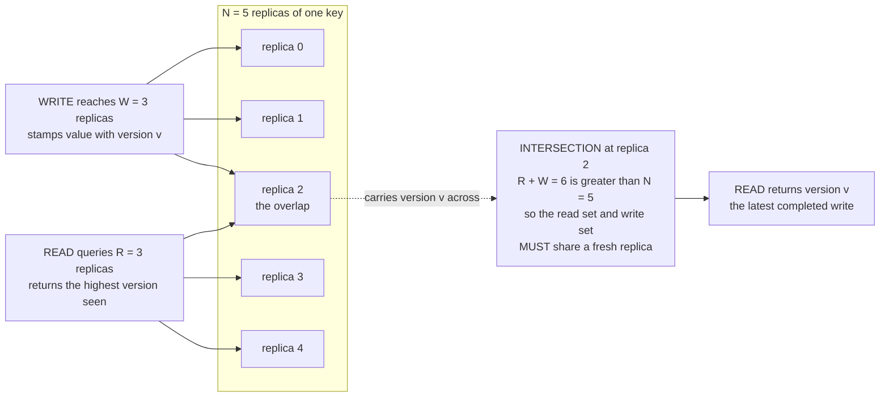

# 🗳️ Quorum Systems

> [!abstract] TL;DR
> A **quorum** is any subset of nodes whose agreement is *sufficient* to make a decision, chosen so that **any two quorums always share at least one node**. That single overlapping node **carries information between decisions**, which is what lets a replicated system stay consistent *without* unanimity and *despite* failures. The simplest quorum is a **majority** (more than `N/2`), which tolerates `f` crashes with `N = 2f + 1` and underpins Paxos and Raft. The tunable database version is the **`R + W > N`** rule: with `N` replicas, if every write reaches `W` and every read queries `R`, then `R + W > N` forces the read set and the write set to intersect in a replica holding the newest version — so the read always sees the latest completed write. Slide `R` and `W` to trade read latency, write latency, and availability while keeping consistency; relax below the line and you buy availability at the cost of stale reads.

---

## Intuition

**Analogy:** Imagine a big committee that keeps making decisions over many years, but you can never get everyone in the room at once — people are travelling, sick, or unreachable. You want a rule where **any decision made today is remembered by any decision made tomorrow**, even though a different subset of members shows up each time. The trick is to require that *enough* members are present that **any two meetings are guaranteed to have at least one person in common**. That shared person "was in both rooms": they remember what the earlier meeting decided and carry it into the later one. You never needed everyone — you only needed **overlap**.

That is exactly a quorum. If a write is recorded by a majority and a read consults a majority, the two majorities *must* share a member (there aren't enough seats for two disjoint majorities), and that member still holds the latest write. Intersection — not unanimity — is the magic that makes distributed decisions consistent.

---

## How It Works

### The core property: intersection

A **quorum** is a subset of nodes whose agreement is enough to commit a decision. A **quorum system** is a collection of such subsets with one defining property:

> **Quorum intersection:** any two quorums `Q1` and `Q2` satisfy `Q1 ∩ Q2 ≠ ∅` — they always share at least one node.

That shared node is the whole point. It **transports information from one decision to the next**: whatever the first quorum committed, the second quorum can *see* through the overlapping member and refuse to contradict it. Strip away intersection and two quorums could commit conflicting values with no one the wiser — that is split-brain. Quorum intersection is *the* mechanism behind consistency in replicated systems and the reason consensus protocols work at all (see [[The_Consensus_Problem]]).

### Majority quorums

The simplest quorum system: **any majority** — any subset of size greater than `N/2`. Why majorities intersect is pure **pigeonhole**: two subsets each larger than `N/2` must overlap, because two *disjoint* subsets would together need more than `N` nodes, and there are only `N`. This gives the classic crash-fault result:

- To tolerate `f` crash faults you need `N = 2f + 1` nodes. A majority (`f + 1`) **always survives** `f` failures, and **any two majorities overlap**, so surviving quorums still agree.
- This is the backbone of [[Paxos]] and [[Raft_Consensus]]: a leader is elected by a majority and a log entry commits once a majority has stored it.
- It is also **why cluster sizes are odd** (3, 5, 7). Going from 3 to 4 nodes still only tolerates 1 failure — a 4-node cluster needs 3 for majority, so it survives just one loss, same as 3 nodes, while paying for an extra machine and *raising* the quorum. Even sizes waste a node and enlarge the split-brain surface without buying fault tolerance.

### Read/write quorums and the `R + W > N` rule

Dynamo-style stores generalize majorities into a **tunable dial**. With `N` replicas of a key:

- A **write** must be acknowledged by `W` replicas, each stamping the value with a **version number** (or [[Vector_Clocks_and_Causality|vector clock]]).
- A **read** queries `R` replicas and returns the value with the **highest version** it sees (repairing stale replicas as it goes).

Set the knobs so that:

$$R + W > N$$

Now the read set (size `R`) and the write set (size `W`) **cannot be disjoint** — two disjoint sets would need `R + W ≤ N` nodes. So every read quorum intersects every write quorum in **at least one replica that holds the latest write**, and the read's max-version rule surfaces it. Consistency without contacting all `N`.

Two independent thresholds matter:

- **`R + W > N`** guarantees a **read sees the latest completed write** (read-write overlap).
- **`W > N/2`** guarantees **two concurrent writes overlap**, so they can't both "win" silently — one version dominates or they're detected as conflicting siblings (write-write overlap). Without it, two clients can each write a disjoint `W`-set and create a hidden split.

Because `R` and `W` are independent, you tune latency and availability against consistency **per workload** — even per operation.

### Configurations: the tuning dial

| Config | `R + W` | Character | Cost |
|--------|---------|-----------|------|
| `W = N, R = 1` | `N + 1` | **Read-optimized**: reads hit one replica, always fresh | Writes need *all* replicas — slow, fragile to any failure |
| `W = 1, R = N` | `N + 1` | **Write-optimized**: writes ack from one replica | Reads must contact *all* — slow, fragile |
| `W = R = (N+1)/2` | `N + 1` | **Balanced majority** — the common default | Both paths tolerate a minority of failures |
| `R + W ≤ N` (e.g. `R = W = 2, N = 5`) | `≤ N` | **Relaxed** — high availability | Only **eventual consistency**; stale reads possible |

Cassandra and DynamoDB expose exactly this as per-operation consistency levels (`ONE`, `QUORUM`, `ALL`); MongoDB exposes it as `writeConcern` and `readConcern`. See [[Consensus_and_Quorums]] and *Consistency_Models_Spectrum*.

### Flow: why `R + W > N` forces a fresh read



### Sloppy quorums and the ABD register

Two important variants sit on either side of "strict majority quorum":

- **Sloppy quorums and hinted handoff** (higher availability). Under a network partition the "home" replicas for a key may be unreachable. Dynamo accepts the write on **any `W` reachable nodes**, storing a **hint** so the data is later handed off to the proper replicas. This trades strict intersection (a reader contacting the real home replicas may miss the write) for **availability** — writes keep succeeding during partitions, with reconciliation deferred to anti-entropy (see *Eventual_Consistency_and_Anti_Entropy*).
- **The ABD algorithm** (stronger guarantee). Attiya–Bar-Noy–Dolev build a **linearizable** single-writer/multi-reader register from majority quorums and **no leader**. The trick is a **read write-back phase**: a read first collects the max-version value from a quorum, then **writes that value back** to a quorum *before returning*. This "propagate what you saw" step ensures a later read never regresses to an older value, achieving linearizability purely from quorum overlap (see *Linearizability_and_Sequential_Consistency*).

### Byzantine quorums

If nodes may **lie** (Byzantine faults), one honest overlap isn't enough — the overlapping node might be the liar. You need any two quorums to intersect in **`≥ f + 1` nodes** so at least one is honest, which forces `N ≥ 3f + 1` and quorums of size `≥ (N + f + 1)/2 ≈ 2f + 1` out of `3f + 1`. This is the Malkhi–Reiter generalization of quorum intersection to malicious faults, and it's why PBFT uses `2f + 1`-sized quorums (see [[Byzantine_Agreement_and_PBFT]]).

### Beyond majorities: general quorum systems

Majorities aren't the only intersecting structure. **Grid quorums** arrange `N` nodes in a `√N × √N` grid and take a full row plus a full column (`O(√N)` quorum size instead of `N/2`). **Tree quorums** and **weighted voting** (Gifford — give each replica a vote count and require a threshold) trade **quorum size**, **availability**, and **load** differently. The classic metrics are **load** (fraction of work the busiest node carries), **availability** (probability a live quorum exists), and **fault tolerance**. Maekawa's mutual-exclusion algorithm uses grid-style quorums of size `O(√N)` (see [[Distributed_Mutual_Exclusion]]).

---

## Key Concepts

### Secondary (intuitive level)
- A **quorum** is "enough nodes to make a decision" — not all of them.
- The rule that makes it work: **any two quorums share at least one node**, and that node remembers earlier decisions.
- A **majority** is the simplest quorum; two majorities always overlap.
- In databases, if **reads + writes talk to more than the total** (`R + W > N`), every read sees the newest write.

### Undergraduate (mechanism level)
- **Intersection** is the defining property; a majority achieves it by pigeonhole.
- Crash fault tolerance: `N = 2f + 1`, majority `= f + 1` survives `f` failures — hence **odd cluster sizes**.
- **`R + W > N`** guarantees read-sees-latest-write; **`W > N/2`** guarantees write-write conflict detection.
- Reads use **version numbers / vector clocks** and a **max-version** rule, plus **read repair**.
- Configurations: `W=N,R=1`, `W=1,R=N`, balanced majority, and relaxed (`R + W ≤ N` → eventual consistency).

### Graduate (research level)
- **ABD**: majority quorums + a **read write-back** phase give a **linearizable** register with no leader.
- **Sloppy quorums + hinted handoff**: relax strict intersection for availability under partition; reconcile via anti-entropy.
- **Byzantine quorums** (Malkhi–Reiter): intersection in `≥ f + 1` honest nodes, `N ≥ 3f + 1`, quorum size `≈ 2f + 1`.
- **Quorum system metrics**: load, availability, and fault tolerance; grid quorums give `O(√N)` size with optimal load; the trade-off space of tree/weighted/hierarchical quorum systems.
- Relationship to consensus: a quorum-replicated register is *weaker* than consensus (it can't order arbitrary conflicting writes) — that gap is exactly what Paxos/Raft close by layering agreement on top of quorums.

---

## Python Demo

This simulation builds a **quorum-replicated register**: `N` replicas each holding `(version, value)`. A **write** stamps a new version onto `W` replicas; a **read** queries `R` replicas and returns the **highest-versioned** reply. It proves the `R + W > N` invariant by brute force — computing the **minimum possible overlap** between any write set and any read set — then *constructs* a stale read when `R + W ≤ N`, sweeps the four canonical configurations, and visualizes the freshness map, the read/write intersection, and how quorum size caps availability under a partition.

```python
"""
QUORUM read/write on N replicas with versioned values, and the R + W > N
invariant. Pure stdlib simulation + matplotlib visualization (no numpy).

Each replica stores [version, value]. A WRITE stamps a new version onto W
replicas; a READ queries R replicas and returns the highest-versioned reply.
We show:
  * R + W > N  -> every read quorum intersects every write quorum -> FRESH read
  * R + W <= N -> a read quorum can dodge the write quorum         -> STALE read
  * configurations: W=N,R=1 / W=1,R=N / balanced majority / relaxed
  * how quorum size caps availability when a partition shrinks the cluster
"""

import itertools
import matplotlib.pyplot as plt
import matplotlib.colors as mcolors

# ---------- the quorum-replicated register ----------
def fresh_store(n, value="old", version=0):
    return [[version, value] for _ in range(n)]

def do_write(store, write_set, version, value):
    for i in write_set:                       # write stamps a new version
        store[i] = [version, value]

def do_read(store, read_set):                 # read returns the max-version reply
    hi = max((store[i] for i in read_set), key=lambda vv: vv[0])
    return hi[0], hi[1]

def min_overlap(n, r, w):
    """Smallest possible intersection between ANY size-W write set and ANY
    size-R read set. 0 means an adversary can force a stale read."""
    best = n
    for ws in itertools.combinations(range(n), w):
        s = set(ws)
        for rs in itertools.combinations(range(n), r):
            best = min(best, len(s & set(rs)))
            if best == 0:
                return 0
    return best

# ---------- the invariant across the canonical configurations ----------
N = 5
configs = [
    ("read-optimized  W=N,R=1", N, 1),
    ("write-optimized W=1,R=N", 1, N),
    ("balanced W=R=(N+1)/2",    (N + 1) // 2, (N + 1) // 2),
    ("relaxed  W=2,R=2",        2, 2),
]

print(f"N = {N} replicas")
print(f"{'config':26s} R+W  min_overlap  verdict")
for name, w, r in configs:
    ov = min_overlap(N, r, w)
    guaranteed = (r + w > N)
    assert (ov >= 1) == guaranteed            # R+W>N  <=>  overlap always >= 1
    print(f"{name:26s} {r + w:>3d}  {ov:>10d}   "
          f"{'FRESH always' if guaranteed else 'STALE possible'}")

# ---------- a concrete FRESH run (balanced) and STALE run (relaxed) ----------
print("\n-- balanced W=R=3: even the worst-case read intersects the write --")
store = fresh_store(N)
wset, rset = {0, 1, 2}, {2, 3, 4}             # rset chosen to overlap least
do_write(store, wset, version=1, value="NEW")
ver, val = do_read(store, rset)
print(f"   write_set={sorted(wset)} read_set={sorted(rset)}"
      f" intersection={sorted(wset & rset)} -> read sees v{ver} '{val}'")

print("\n-- relaxed W=2,R=2: a read quorum dodges the write quorum --")
store = fresh_store(N)
wset, rset = {0, 1}, {2, 3}                    # disjoint: R+W = 4 <= N = 5
do_write(store, wset, version=1, value="NEW")
ver, val = do_read(store, rset)
print(f"   write_set={sorted(wset)} read_set={sorted(rset)}"
      f" intersection={sorted(wset & rset)} -> read sees v{ver} '{val}'  <-- STALE")

# ---------------- visualization ----------------
fig, (ax1, ax2, ax3) = plt.subplots(1, 3, figsize=(15, 4.6))

# Panel 1: freshness map over the (R, W) grid, with the R+W = N+1 frontier
grid = [[1 if (r + w > N) else 0 for r in range(1, N + 1)]
        for w in range(1, N + 1)]
ax1.imshow(grid, origin="lower", aspect="auto",
           extent=[0.5, N + 0.5, 0.5, N + 0.5], vmin=0, vmax=1,
           cmap=mcolors.ListedColormap(["#d62728", "#2ca02c"]))
ax1.plot([0.5, N + 0.5], [N + 0.5, 0.5], "k--", lw=2)   # R + W = N + 1 frontier
for name, w, r in configs:
    ax1.scatter([r], [w], s=90, color="white", edgecolor="black", zorder=3)
    ax1.annotate(name.split()[0], (r, w), fontsize=7,
                 xytext=(3, 3), textcoords="offset points")
ax1.set_xlabel("R  (read quorum)"); ax1.set_ylabel("W  (write quorum)")
ax1.set_title(f"Freshness map, N={N}\ngreen R+W>N fresh   red R+W<=N stale-risk")

# Panel 2: the read/write set intersection (balanced W=R=3)
w_set, r_set = {0, 1, 2}, {2, 3, 4}
for i in range(N):
    if i in w_set and i in r_set:
        c, tag = "#2ca02c", "W&R"
    elif i in w_set:
        c, tag = "#1f77b4", "W"
    elif i in r_set:
        c, tag = "#ff7f0e", "R"
    else:
        c, tag = "#dddddd", ""
    ax2.add_patch(plt.Rectangle((i - 0.5, -0.5), 1, 1,
                  facecolor=c, edgecolor="white"))
    ax2.text(i, 0, f"r{i}\n{tag}", ha="center", va="center",
             color="white" if tag else "#888", fontweight="bold")
ax2.set_xlim(-0.6, N - 0.4); ax2.set_ylim(-1.1, 1.1)
ax2.set_xticks([]); ax2.set_yticks([])
ax2.set_title("Balanced W=R=3, N=5\nblue write  orange read  green overlap\noverlap replica carries the latest version")

# Panel 3: availability -- node failures each path survives (N - quorum)
names3 = ["W=N\nR=1", "W=1\nR=N", "W=R=3"]
ws3, rs3 = [N, 1, 3], [1, N, 3]
x = list(range(len(names3)))
ax3.bar([i - 0.2 for i in x], [N - w for w in ws3], width=0.4,
        label="write survives", color="#1f77b4")
ax3.bar([i + 0.2 for i in x], [N - r for r in rs3], width=0.4,
        label="read survives",  color="#ff7f0e")
ax3.set_xticks(x); ax3.set_xticklabels(names3)
ax3.set_ylabel("node failures tolerated  (N - quorum)")
ax3.set_title("Availability under partition\nlarger quorum -> fewer failures survived")
ax3.legend(fontsize=8)

fig.suptitle("Quorum systems: R + W > N forces read/write overlap",
             fontweight="bold")
fig.tight_layout()
plt.savefig("quorum_systems.png", dpi=120)
print("\nsaved quorum_systems.png")
```

**What you observe.** The brute-force `min_overlap` confirms the theory exactly: for `W=N,R=1`, `W=1,R=N`, and balanced `W=R=3` (all with `R + W = 6 > 5`) the *smallest possible* overlap between any read and write quorum is **1** — no adversary can dodge it, so every read is fresh. For the relaxed `W=2,R=2` case (`R + W = 4 ≤ 5`) the minimum overlap is **0**: the demo constructs `write_set = {0,1}` and `read_set = {2,3}`, disjoint, and the read returns the **stale** `v0 'old'`, never seeing the completed `NEW` write. Panel 1 draws the freshness frontier `R + W = N + 1` with the three consistent configs sitting on or above it and the relaxed one below in the red zone. Panel 2 shows the balanced case's overlap concentrated on replica `r2`. Panel 3 makes the trade-off blunt: `W=N,R=1` reads survive 4 failures but writes survive **zero**; `W=R=3` balances both at 2. Same consistency guarantee, wildly different availability.

---

## Real-World Applications

- **Dynamo, Cassandra, Riak, DynamoDB — tunable `N,R,W`.** These leaderless stores let you set the replication factor `N` and pick `R`/`W` per operation (`ONE`, `QUORUM`, `ALL`). `QUORUM` reads and writes on both sides give `R + W > N` and strong-ish consistency; drop to `ONE` for latency and accept eventual consistency. See [[Cassandra]] and *Eventual_Consistency_and_Anti_Entropy*.
- **etcd, ZooKeeper, Consul — majority quorums under consensus.** Every committed write needs a **majority** of the Raft/Zab cluster, which is why these run 3 or 5 nodes and go read-only rather than split-brain when a majority is unreachable. See [[Raft_Consensus]] and [[Paxos]].
- **MongoDB — `writeConcern` and `readConcern`.** `w: "majority"` writes and `readConcern: "majority"` reads are the `R + W > N` rule applied to a replica set, guaranteeing a majority-committed read never regresses.
- **Leader election and split-brain avoidance.** A node may only act as leader if it holds a **quorum lease**; because two quorums can't both exist, two leaders can't both commit — the quorum *is* the anti-split-brain mechanism (see [[Leader_Election]]).
- **Spanner / CockroachDB / TiKV.** Each shard is a Paxos/Raft group; reads and writes commit through the group's **majority quorum**, giving a globally distributed store single-copy behavior. See [[Consensus_and_Quorums]] and [[Replication_Strategies]].

---

## Common Pitfalls

- **Thinking `R + W > N` gives linearizability.** It guarantees a read sees the latest *completed* write, but Dynamo-style quorums are **not linearizable**: concurrent writes create sibling versions, reads during an in-flight write may see either value, and read repair is best-effort. True linearizability needs the ABD write-back phase or a consensus log (see *Linearizability_and_Sequential_Consistency*).
- **Forgetting `W > N/2`.** People set `R + W > N` with a tiny `W` (e.g. `N=3, W=1, R=3`) and think they're safe. Two clients can each write a disjoint single replica, producing **two concurrent winners** with no overlap to detect the conflict. Read-write overlap is not write-write overlap.
- **Even-sized clusters.** A 4-node or 6-node cluster raises the quorum without adding fault tolerance and enlarges the split-brain surface. **Always use odd sizes** for majority quorums.
- **Sloppy quorum surprises.** Sloppy quorums accept writes on *any* reachable nodes during a partition, so a strict-quorum read against the home replicas can **miss** a write that was "successfully" acknowledged. Availability was bought with a consistency IOU that anti-entropy must later pay.
- **Assuming quorum reads are cheap.** `QUORUM`/`majority` reads contact multiple replicas and wait for the slowest of the quorum — tail latency is governed by the `R`-th fastest replica, not the fastest. Read-optimized `R=1` is only free if you can afford `W=N` writes.
- **Counting acks without versions.** A quorum of acks means nothing if replies aren't versioned; the max-version rule (or vector clocks) is what turns overlap into a *correct* read (see [[Vector_Clocks_and_Causality]]).

---

## Related Concepts

- [[The_Consensus_Problem]] — quorum intersection is the primitive consensus is built from; consensus adds *ordering* of conflicting writes that plain quorums can't provide.
- [[Paxos]] — commits a value once a **majority** accepts it; majority overlap across ballots is what preserves safety.
- [[Raft_Consensus]] — leader election and log commit both require a majority quorum; the same odd-cluster logic applies.
- [[Byzantine_Agreement_and_PBFT]] — Byzantine quorums intersect in `≥ f+1` nodes, forcing `N ≥ 3f+1` and quorum size `≈ 2f+1`.
- [[Vector_Clocks_and_Causality]] — the versioning that lets a read pick the newest value and detect concurrent siblings.
- [[Leader_Election]] — a leader holds a quorum; two disjoint quorums being impossible is what prevents dual leaders.
- [[Distributed_Mutual_Exclusion]] — Maekawa's algorithm uses grid-style quorums of size `O(√N)`, a non-majority quorum system.
- [[Consensus_and_Quorums]] — the database-side treatment of how distributed stores realize agreement through quorum overlap.
- [[Cassandra]] — production tunable `N,R,W` consistency levels (`ONE`, `QUORUM`, `ALL`).
- [[Replication_Strategies]] — quorum reads/writes sit on top of leaderless and leader-based replication.
- [[Consistency_Models]] — where tunable quorums land on the strong-to-eventual spectrum.
- [[MongoDB]] — `writeConcern: majority` and `readConcern: majority` are `R + W > N` on a replica set.
- [[CAP_Theorem]] — sliding `R`/`W` is the applied face of trading consistency against availability under partition.

> Companion notes planned for this vault, referenced in prose above: *Replication_Models*, *Eventual_Consistency_and_Anti_Entropy*, *Consistency_Models_Spectrum*, *Linearizability_and_Sequential_Consistency*, *CAP_Theorem_and_PACELC*.

---

## Review Questions

**Secondary (understanding):**
1. Why does a system that requires a **majority** for every decision never need all its nodes present, yet still stay consistent? Explain using the "one person in both meetings" idea.

**Undergraduate (application):**
2. You run `N = 5` replicas and want reads to always see the latest completed write. Give two different `(R, W)` settings that achieve this, and state which one you'd pick for a read-heavy workload and why.
3. In the Python demo, `W = 2, R = 2` with `N = 5` produced a stale read. Show the specific disjoint write and read sets that cause it, and explain in terms of `R + W` versus `N` why no such pair can exist once `R + W = 6`.

**Graduate (analysis / trade-offs):**
4. `R + W > N` guarantees a read sees the latest *completed* write, yet Dynamo-style quorums are **not** linearizable. Explain the gap, then describe precisely how ABD's read write-back phase closes it and why that phase is necessary.
5. To tolerate `f` Byzantine faults you need quorums that intersect in `≥ f + 1` nodes rather than `≥ 1`. Derive why this forces `N ≥ 3f + 1` and a quorum size of about `2f + 1`, and contrast the availability cost against the crash-fault `2f + 1` majority quorum.

---

## Sources

- Gifford, D. K. — *Weighted Voting for Replicated Data*, SOSP 1979. [DOI](https://doi.org/10.1145/800215.806583)
- Attiya, H., Bar-Noy, A., Dolev, D. — *Sharing Memory Robustly in Message-Passing Systems* (the ABD algorithm), JACM 42(1), 1995. [DOI](https://doi.org/10.1145/200836.200869)
- DeCandia, G. et al. — *Dynamo: Amazon's Highly Available Key-value Store*, SOSP 2007. [PDF](https://www.allthingsdistributed.com/files/amazon-dynamo-sosp2007.pdf)
- Malkhi, D., Reiter, M. — *Byzantine Quorum Systems*, Distributed Computing 11(4), 1998. [DOI](https://doi.org/10.1007/s004460050050)
- Naor, M., Wool, A. — *The Load, Capacity, and Availability of Quorum Systems*, SIAM J. Computing 27(2), 1998. [DOI](https://doi.org/10.1137/S0097539795281232)

---

#distributed-systems #quorums #read-write-quorums #majority #dynamo
