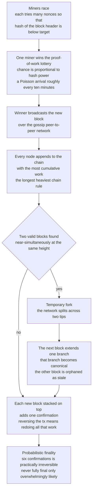

# ⛓️ Blockchain and Nakamoto Consensus

> [!abstract] TL;DR
> Classical consensus (Paxos, PBFT) assumes a **known, mostly-trusted, fixed membership** — it counts votes among identified participants. **Nakamoto consensus** (Bitcoin, 2008) solved the far harder open problem: agreement among **anonymous, permissionless, mutually-distrusting strangers** who can freely join and leave. The two moves that make it work are **proof-of-work** as *Sybil resistance* — a vote is not one-per-identity (forgeable) but **one-per-unit-of-compute** (expensive), so proposing a block requires burning real energy to find a nonce with `hash(block) < target` — and the **longest-chain rule**, where every node treats the chain with the most cumulative work as canonical, with no explicit voting round. The price is **probabilistic finality**: a block is never 100% final, only exponentially harder to reverse with each **confirmation** stacked on top (the "6 confirmations" heuristic). Safety rests on an **honest-majority-of-hash-power** assumption rather than PBFT's absolute `f < N/3`; controlling more than 50% breaks it. It is both a landmark systems achievement and a genuinely new branch of consensus theory.

---

## Intuition

**Analogy:** Imagine a town-hall vote where everyone in the room is trusted to hold exactly one ballot — that is **classical consensus**: you know who is present, you count hands, a majority wins. Now hold the same vote on the open internet, where anyone can show up wearing any number of masks. A cheater simply prints ten thousand fake faces and out-votes everyone honest. This is the **Sybil attack**, and it destroys any scheme that counts *identities*. Satoshi Nakamoto's escape was to stop counting faces and start counting **work**: to cast a vote you must solve an expensive puzzle that costs real electricity, and everyone agrees to follow whichever history has the **most total puzzle-solving effort** behind it. You cannot fake a thousand votes cheaply, because each one costs power you actually had to burn.

In technical terms, proposing a block becomes a **lottery you win by spending compute** — the more hash power you own, the more often you win, but every win is a *paid* win. Honest miners always extend the heaviest chain, so rewriting old history would mean out-computing the entire honest majority from behind — a race you lose whenever you hold less than half the world's hash power. Honesty is not enforced by identity or by trust; it is simply the **economically profitable strategy**.

---

## How It Works

### The new problem: permissionless, anonymous, adversarial

Classical protocols — [[Paxos]], [[Raft_Consensus]], and Byzantine agreement ([[Byzantine_Agreement_and_PBFT]]) — assume a **permissioned** setting: a *fixed, known* set of `N` identified validators, of which at most `f` misbehave. Every safety proof leans on counting messages from *distinct known identities* and on quorum intersection over that fixed `N`. An open cryptocurrency violates every one of those assumptions at once. Participants are **anonymous** (only public keys, freely minted), **dynamic** (they join and leave with no membership protocol), and **potentially malicious**. In such a world a **Sybil attack** — one adversary spinning up a million fake "nodes" — trivially wins any vote-counting or `N`-based quorum scheme, because there is no cost to creating an identity and no registry of who is real. This is precisely the setting classical consensus *could not touch*, and the reason overlay membership systems that also fight Sybil identities ([[Distributed_Hash_Tables]]) matter here too.

### Proof-of-work as Sybil resistance

Nakamoto's core insight is to replace **one-vote-per-identity** (Sybil-vulnerable) with **one-vote-per-unit-of-compute** (Sybil-*resistant*). To propose a block a miner must solve a cryptographic puzzle: repeatedly hash the block header while varying a **nonce** until the digest falls below a network **target**, i.e. `hash(header || nonce) < target`. Because the hash is effectively a random oracle, the only strategy is brute-force trial, so the *expected* number of hashes to find a valid block is fixed by the target and cannot be shortcut. This turns block production into a **probabilistic leader election weighted by hash rate**: your chance of mining the next block is proportional to your fraction of global hash power. Faking a thousand identities buys nothing — each still needs its own real energy to produce work. The target is periodically re-tuned (Bitcoin's difficulty adjustment; see [[Mining_and_Difficulty]]) so blocks arrive on a steady schedule (roughly one per ten minutes) regardless of how much hash power joins.

### The longest-chain (heaviest-chain) rule

Blocks link into a hash-chain — each header commits to its parent's hash and to a Merkle root of its transactions ([[Hash_Functions_and_Merkle_Trees]]) — so the chain is tamper-evident: altering any past block changes its hash and breaks every link above it. Nodes gossip blocks across a peer-to-peer overlay ([[P2P_Network_Architecture]]; the epidemic dissemination pattern of [[Gossip_and_Epidemic_Protocols]]), and each node independently adopts the **chain with the greatest cumulative proof-of-work** as canonical, extending its tip. There is **no explicit voting or agreement round** — consensus is an *emergent* consequence of everyone selfishly building on the heaviest tip. When two miners find a valid block at nearly the same height before the network has propagated either, the chain **forks** into two competing tips; the fork is resolved the moment some miner extends one branch, which then out-weighs the other. The losing block becomes a **stale/orphan** block and its miner's reward is lost.

### Probabilistic finality and the confirmation depth

Unlike PBFT's **deterministic** finality (once committed, a block is final forever), Nakamoto consensus offers only **probabilistic finality**. A transaction buried under `k` subsequent blocks has `k` **confirmations**; reversing it would require an attacker to secretly build an *alternative* chain that overtakes the public one, redoing all `k` blocks' worth of work while the honest network races ahead. The probability of an attacker with less than half the hash power ever catching up **decays exponentially in `k`** — this is the **gambler's-ruin / random-walk** argument from Nakamoto's paper (reproduced in the demo). "Six confirmations" is the customary heuristic for *practically irreversible*, but a transaction is **never mathematically 100% final** — only overwhelmingly likely to stay put.

### The 51% attack and the honest-majority assumption

Safety holds **only if honest miners control more than 50% of hash power**. An attacker with a majority can consistently win the longest-chain race, letting them **double-spend** (reverse their own recent payments) and **censor** transactions — the notorious **51% attack**. The security model is therefore **economic**, not absolute: it assumes attacking costs more than honest mining earns, so the profit-maximizing choice is to mine honestly. Even below 50%, strategic deviations exist — **selfish mining** (withholding found blocks to waste honest work) can earn a large miner more than its fair share. This contrasts sharply with BFT's *absolute* threshold `f < N/3`: Nakamoto trades a hard mathematical bound for an open membership guarded by incentives.



### Nakamoto versus classical BFT: two families of consensus

The field now recognizes **two distinct consensus regimes**, and the choice between them is architectural:

| | **Classical BFT** (PBFT, Tendermint, HotStuff) | **Nakamoto** (proof-of-work) |
|---|---|---|
| Membership | **Permissioned** — known validator set | **Permissionless** — anonymous, dynamic |
| Sybil defense | Registry of vetted identities | **Proof-of-work** cost per vote |
| Finality | **Deterministic**, instant | **Probabilistic**, deepens with confirmations |
| Fault threshold | Absolute `f < N/3` | Honest **majority** of hash power |
| Message cost | `O(N^2)` (or `O(N)` for HotStuff) | Gossip flood, no voting round |
| Scale of `N` | Tens to hundreds | Thousands, open |
| Latency / cost | Sub-second, cheap | Minutes, high energy |

This captures the **fundamental trade-off between openness and finality/efficiency**, often framed as the **blockchain trilemma** — you cannot simultaneously maximize **decentralization**, **security**, and **scalability**; every design sacrifices one corner (see [[Distributed_Ledgers_and_Trilemma]]).

### Proof-of-stake and the modern landscape

Proof-of-work's enormous energy footprint drove the search for cheaper Sybil resistance. **Proof-of-stake** replaces burned electricity with **bonded capital**: validators stake coins and are selected to propose or attest in proportion to their stake, losing (being *slashed*) their bond if they cheat. Ethereum's **Casper FFG / Gasper** is a *hybrid* — chain-based block production in the Nakamoto style plus a **BFT-style finality gadget** that periodically finalizes checkpoints with a two-thirds-stake supermajority, recovering *deterministic* finality on top of a Nakamoto-flavored base. Other Sybil-resistance mechanisms include **proof-of-space** (dedicating disk), **proof-of-authority** (a permissioned identity set), and **proof-of-history**; the full menu is surveyed in [[Consensus_Mechanisms]].

### Where it sits in distributed-systems theory

Nakamoto consensus does **not violate** the [[FLP_Impossibility_Result]] or the [[CAP_Theorem_and_PACELC]]. FLP forbids *deterministic* asynchronous consensus with one crash; Nakamoto sidesteps it by using **randomization** (the proof-of-work lottery) and by **relaxing finality to probabilistic**, so it never claims deterministic termination. It also relies on a **synchrony-ish** assumption — block **propagation** delay must be small relative to the block **interval**, or forks proliferate and the security bounds degrade. Formal treatments such as **Garay-Kiayias-Leonardos ("The Bitcoin Backbone Protocol")** recast it in distributed-computing terms, proving **common-prefix**, **chain-quality**, and **chain-growth** properties under a synchronous network with honest-majority hashing power — placing Bitcoin squarely, and rigorously, inside consensus theory. Viewed through the lens of [[The_Consensus_Problem]], the blockchain is **state-machine replication over an open network**: an agreed, totally-ordered log of transactions, but with membership thrown open and finality softened (contrast the closed-world approach of [[Replication_Models]]).

---

## Key Concepts

### Secondary (plain-language)
- Old consensus counts votes among **known, trusted people**; Nakamoto lets **anonymous strangers** agree.
- Faking many identities (a **Sybil attack**) breaks vote-counting, so instead of one-vote-per-person it is **one-vote-per-unit-of-work** — proposing a block costs real electricity.
- Everyone follows the chain with the **most total work**; the longest chain wins, no formal vote needed.
- Nothing is *ever* 100% final, but the more blocks pile on top, the harder it is to undo — that is a **confirmation**.
- If a single party controls **more than half** the mining power, they can rewrite recent history: the **51% attack**.

### Undergraduate (CS background)
- **Proof-of-work** = find a nonce with `hash(header || nonce) < target`; expected effort is fixed and cannot be shortcut, making it a **hash-rate-weighted leader-election lottery** and a **Sybil-resistance** mechanism.
- **Longest / heaviest chain rule**: adopt the branch of greatest cumulative work; **forks** arise from propagation delay and resolve when one branch is extended, orphaning the loser.
- **Probabilistic finality**: reversal probability decays roughly like `(q/p)^k` in confirmation depth `k` (attacker fraction `q`, honest `p = 1 - q`).
- **BFT vs Nakamoto**: permissioned/deterministic/`f < N/3`/`O(N^2)` messages versus permissionless/probabilistic/honest-majority/gossip.
- Does **not** break FLP or CAP — uses randomization and probabilistic finality; assumes bounded propagation relative to block time.

### Graduate (system-level)
- **Gambler's-ruin analysis** (Nakamoto): given attacker fraction `q < 0.5`, after the merchant waits `z` confirmations, attacker progress during that window is Poisson with mean `lambda = z * q / p`; catch-up probability from a deficit of `d` is `(q/p)^d`, yielding a success probability that decays exponentially in `z`. For `q >= 0.5` the random walk drifts upward and success probability is `1` — safety is lost.
- **Bitcoin Backbone (Garay-Kiayias-Leonardos)**: formalizes **common-prefix**, **chain-quality**, and **chain-growth** under a synchronous model; security requires honest hashing majority *and* propagation delay small versus block interval.
- **Selfish mining (Eyal-Sirer)**: a miner with more than about one-third of hash power (under favorable network position) can profitably deviate by withholding blocks — honest mining is not always incentive-compatible below 50%.
- **Economic vs absolute safety**: PBFT gives an unconditional `f < N/3` guarantee; Nakamoto gives a *cost-of-attack* guarantee — security equals the capital and energy needed to out-hash the honest majority.
- **Hybrid finality**: Casper FFG / Gasper layers a two-thirds-stake BFT finality gadget over a Nakamoto-style fork-choice, recovering deterministic finality while retaining open-ish membership via staking.

---

## Python Demo

Two experiments, pure standard library plus **matplotlib** (numpy optional). **Part A** simulates the **longest-chain rule**: blocks are discovered as a random process, honest miners always extend the heaviest tip, and occasional near-simultaneous discoveries create **forks** that resolve as one branch pulls ahead — orphaning the loser. **Part B** reproduces the **double-spend / gambler's-ruin** result: an attacker with hash-power fraction `q` tries to rewrite the last `k` blocks. We compute Nakamoto's exact success probability *and* confirm it by Monte-Carlo, showing it **decays exponentially in the number of confirmations `k` when `q < 0.5`**, while `q > 0.5` (a 51% attacker) drives success to `1` and breaks safety.

```python
"""
Nakamoto (longest-chain) consensus: forks + probabilistic finality.

Part A - simulate block discovery as a random (Poisson-like) process, extend the
         HEAVIEST tip (longest-chain rule), inject near-simultaneous discoveries
         that FORK the chain, and watch forks resolve into orphaned stale blocks.

Part B - double-spend attack. An attacker with hash fraction q tries to out-mine
         the honest majority and rewrite the last k blocks. We reproduce Nakamoto's
         gambler's-ruin formula AND a Monte-Carlo check, showing the success
         probability decays EXPONENTIALLY in confirmations k when q < 0.5, and
         -> 1 when q > 0.5 (the 51% attack breaks safety).

Pure stdlib + matplotlib (no numpy required).
"""

import math
import random
import matplotlib.pyplot as plt

# =====================================================================
# Part A: longest-chain rule with forks
# =====================================================================

class Block:
    __slots__ = ("bid", "parent", "height")
    def __init__(self, bid, parent, height):
        self.bid = bid          # unique id
        self.parent = parent    # parent Block (None for genesis)
        self.height = height     # cumulative work == depth here (uniform difficulty)

def simulate_chain(n_blocks, p_fork, rng):
    """Grow a blockchain. Each step a miner extends the DEEPEST (heaviest) tip.
    With probability p_fork a second miner finds a competing block at the SAME
    height before propagation completes -> a fork. Whichever tip is extended
    next becomes canonical; the other block is orphaned."""
    genesis = Block(0, None, 0)
    blocks = [genesis]
    tips = [genesis]
    nid = 1
    for _ in range(n_blocks):
        max_h = max(t.height for t in tips)
        deepest = [t for t in tips if t.height == max_h]
        base = rng.choice(deepest)                      # honest: build on heaviest tip
        if base in tips:
            tips.remove(base)
        a = Block(nid, base, base.height + 1); nid += 1
        blocks.append(a); tips.append(a)
        if rng.random() < p_fork:                        # near-simultaneous 2nd block
            b = Block(nid, base, base.height + 1); nid += 1
            blocks.append(b); tips.append(b)             # competing sibling -> FORK
    return genesis, blocks, tips

def canonical_chain(tips):
    """The heaviest tip and the path back to genesis = the canonical chain."""
    best = max(tips, key=lambda t: t.height)
    chain = []
    node = best
    while node is not None:
        chain.append(node)
        node = node.parent
    return set(b.bid for b in reversed(chain))

rng = random.Random(7)
genesis, blocks, tips = simulate_chain(n_blocks=18, p_fork=0.28, rng=rng)
main = canonical_chain(tips)
orphans = [b for b in blocks if b.bid not in main]
print("=== Part A: longest-chain with forks ===")
print(f"total blocks mined : {len(blocks)}")
print(f"canonical chain len: {max(t.height for t in tips)} blocks")
print(f"orphaned (stale)   : {len(orphans)}  -> ids {[b.bid for b in orphans]}")
print("The heaviest chain wins; work spent on orphaned forks is wasted.\n")

# =====================================================================
# Part B: double-spend success probability (gambler's ruin)
# =====================================================================

def nakamoto_success(q, z):
    """Exact attacker success probability from Nakamoto's paper (2008), for an
    attacker with hash fraction q double-spending after z confirmations.
    For q >= p the walk drifts to the attacker -> safety fails (return 1.0)."""
    p = 1.0 - q
    if q >= p:
        return 1.0
    lam = z * (q / p)                      # Poisson mean of attacker's head start
    total = 1.0
    for k in range(z + 1):
        poisson = math.exp(-lam)
        for i in range(1, k + 1):
            poisson *= lam / i
        total -= poisson * (1.0 - (q / p) ** (z - k))
    return max(0.0, min(1.0, total))

def monte_carlo_success(q, z, trials, rng, deficit_cap=60):
    """Simulate the race directly. Each block is found by the attacker with prob q,
    else by the honest network. The merchant releases goods once the honest chain
    reaches z confirmations; the attacker (mining privately from the same point)
    then keeps racing and SUCCEEDS if its chain ever strictly overtakes honest."""
    wins = 0
    for _ in range(trials):
        honest = attacker = 0
        while honest < z:                 # phase 1: honest network reaches z blocks
            if rng.random() < q:
                attacker += 1
            else:
                honest += 1
        if attacker > honest:             # already ahead -> instant success
            wins += 1
            continue
        while True:                       # phase 2: attacker tries to catch up
            if rng.random() < q:
                attacker += 1
            else:
                honest += 1
            if attacker > honest:
                wins += 1
                break
            if honest - attacker > deficit_cap:   # hopeless when q < p
                break
    return wins / trials

zs = list(range(0, 11))
q_curves = [0.10, 0.30, 0.45, 0.60]           # last one is a 51%-style attacker
print("=== Part B: double-spend success vs confirmations ===")
mc_rng = random.Random(42)
for q in q_curves:
    row = "  ".join(f"z={z}:{nakamoto_success(q, z):.2e}" for z in (0, 1, 3, 6, 10))
    print(f"q={q:.2f}  {row}")
# spot-check Monte Carlo against the formula for one honest-minority attacker
print("\nMonte-Carlo vs analytic (q=0.30):")
for z in (1, 3, 6):
    mc = monte_carlo_success(0.30, z, trials=6000, rng=mc_rng)
    print(f"  z={z}: analytic={nakamoto_success(0.30, z):.4f}   monte-carlo={mc:.4f}")
print()

# =====================================================================
# Visualization
# =====================================================================

# ---- Figure 1: the blockchain tree with forks and orphans ----
fig1, ax = plt.subplots(figsize=(12, 4.5))
# layout: x = height, main chain on y=0, orphan branches offset upward
ypos, used = {}, {}
for b in blocks:
    if b.bid in main:
        ypos[b.bid] = 0
    else:
        used[b.height] = used.get(b.height, 0) + 1
        ypos[b.bid] = used[b.height]           # stack orphans above the main line
for b in blocks:
    if b.parent is not None:
        x0, y0 = b.parent.height, ypos[b.parent.bid]
        x1, y1 = b.height, ypos[b.bid]
        on_main = (b.bid in main and b.parent.bid in main)
        ax.plot([x0, x1], [y0, y1], color=("#1f77b4" if on_main else "#c0392b"),
                lw=(2.6 if on_main else 1.4), zorder=1,
                linestyle=("-" if on_main else "--"))
for b in blocks:
    is_main = b.bid in main
    ax.scatter(b.height, ypos[b.bid], s=430, zorder=2,
               color=("#1f77b4" if is_main else "#e74c3c"),
               edgecolor="black", linewidth=0.8)
    ax.text(b.height, ypos[b.bid], str(b.bid), ha="center", va="center",
            color="white", fontsize=8, fontweight="bold", zorder=3)
ax.scatter([], [], s=200, color="#1f77b4", label="canonical (longest) chain")
ax.scatter([], [], s=200, color="#e74c3c", label="orphaned / stale fork")
ax.set_xlabel("block height  (cumulative proof-of-work)")
ax.set_yticks([])
ax.set_title("Part A  Longest-chain rule: forks resolve, losing branches are orphaned")
ax.legend(loc="upper left")
ax.grid(axis="x", alpha=0.3)
fig1.tight_layout()
fig1.savefig("nakamoto_chain_forks.png", dpi=120)

# ---- Figure 2: double-spend success probability vs confirmations ----
fig2, (axl, axr) = plt.subplots(1, 2, figsize=(13, 5))
colors = {0.10: "#2ca02c", 0.30: "#ff7f0e", 0.45: "#d62728", 0.60: "#7f0000"}
for q in q_curves:
    ys = [nakamoto_success(q, z) for z in zs]
    lbl = f"q={q}" + ("  (51% attack)" if q > 0.5 else "")
    axl.plot(zs, ys, "-o", color=colors[q], label=lbl, ms=4)
    axr.plot(zs, ys, "-o", color=colors[q], label=lbl, ms=4)
# overlay Monte-Carlo dots for q=0.30 to show the formula matches simulation
mc_ys = [monte_carlo_success(0.30, z, trials=4000, rng=mc_rng) for z in zs]
axl.plot(zs, mc_ys, "kx", ms=8, label="q=0.30 Monte-Carlo")

axl.axhline(0.001, color="gray", ls=":", lw=1)
axl.set_xlabel("confirmations  k")
axl.set_ylabel("attacker double-spend success probability")
axl.set_title("Linear scale\nq>0.5 pins at 1.0 (safety lost)")
axl.legend(fontsize=8)
axl.grid(alpha=0.3)

# log scale reveals the EXPONENTIAL decay for q<0.5 (straight lines)
for q in (0.10, 0.30, 0.45):
    ys = [max(nakamoto_success(q, z), 1e-16) for z in zs]
    axr.semilogy(zs, ys, "-o", color=colors[q], ms=4, label=f"q={q}")
axr.axhline(1.0, color="#7f0000", lw=2, label="q=0.60 (always succeeds)")
axr.set_xlabel("confirmations  k")
axr.set_ylabel("success probability (log scale)")
axr.set_title("Log scale\nq<0.5 decays exponentially in k")
axr.legend(fontsize=8)
axr.grid(alpha=0.3, which="both")

fig2.suptitle("Part B  Probabilistic finality: reversal decays exponentially with confirmations",
              fontweight="bold")
fig2.tight_layout()
fig2.savefig("nakamoto_double_spend.png", dpi=120)
print("saved nakamoto_chain_forks.png and nakamoto_double_spend.png")
```

**What you observe.** Part A prints a chain of ~18 mined blocks in which several near-simultaneous discoveries forked the tip; the canonical chain is the heaviest path, and every block off it is an **orphan** whose mining effort was wasted — exactly how real reorgs discard stale blocks. Part B reproduces Nakamoto's numbers: for `q = 0.10` the double-spend probability is already negligible by a couple of confirmations; for `q = 0.30` it falls from tens of percent to well under 0.1% by `z = 6`; for `q = 0.45` it decays too, just far more slowly (you need many more confirmations for the same safety). On the **log-scale** panel these appear as straight downward lines — the signature of **exponential decay in `k`**. The Monte-Carlo crosses land on the analytic curve, confirming the gambler's-ruin derivation. The `q = 0.60` line sits flat at `1.0`: once an attacker owns a hash-power majority, **no number of confirmations is safe** — the 51% attack breaks the honest-majority assumption on which all of Nakamoto safety rests.

---

## Real-World Applications

- **Bitcoin** — the original and canonical Nakamoto-consensus system: SHA-256 proof-of-work, ~10-minute blocks, longest-chain fork choice, and the "6 confirmations" settlement convention for high-value payments. Transactions spend and create outputs under the [[UTXO_Model]], and block integrity rests on [[Hash_Functions_and_Merkle_Trees]] and [[Cryptographic_Primitives_Blockchain]].
- **Ethereum (proof-of-work era, pre-Merge)** — ran Nakamoto-style consensus (Ethash) with ~13-second blocks and a GHOST-influenced heaviest-subtree fork choice, before **The Merge (2022)** switched it to **proof-of-stake** with a Casper FFG / Gasper finality gadget — the industry's largest live migration from Nakamoto to hybrid BFT finality.
- **All permissionless proof-of-work chains** — Litecoin, Dogecoin, Monero, Bitcoin Cash, and many others inherit the same longest-chain-plus-proof-of-work core, tuned for different hash functions, block times, and difficulty rules ([[Mining_and_Difficulty]]).
- **51% attacks in the wild** — smaller chains with rentable hash power (Ethereum Classic in 2019-2020, Bitcoin Gold in 2018) suffered real double-spend reorgs, demonstrating that the *economic* honest-majority assumption fails when hash power is cheap to acquire.
- **Consensus selection as an architecture decision** — teams choose Nakamoto proof-of-work (open, censorship-resistant, energy-hungry, probabilistic), proof-of-stake (open-ish, capital-bonded, cheaper), or permissioned BFT (fast, deterministic, closed) based on the trust model and finality needs; the menu is catalogued in [[Consensus_Mechanisms]] and framed by [[Distributed_Ledgers_and_Trilemma]].

---

## Common Pitfalls

- **Treating confirmations as deterministic finality** — Nakamoto finality is *probabilistic*; a deep reorg is improbable, not impossible. Exchanges wait more confirmations for larger amounts precisely because there is no true "committed forever" moment like PBFT's.
- **Assuming 51% is a hard wall** — profitable deviations exist *below* a majority. **Selfish mining** lets a well-positioned miner with roughly a third of hash power earn more than its fair share by withholding blocks; the honest strategy is not always the dominant one.
- **Confusing proof-of-work with the consensus itself** — proof-of-work is only the *Sybil-resistance / leader-election* layer. Agreement comes from the **longest-chain fork-choice rule**; swap in proof-of-stake and the same longest/heaviest-chain logic still drives agreement.
- **Ignoring propagation delay** — Nakamoto security assumes block propagation is fast *relative to* block time. Shrink the block interval or bloat blocks and forks multiply, orphan rates climb, and effective security drops (the Bitcoin Backbone synchrony condition).
- **Believing it repeals FLP or CAP** — it does neither. It escapes FLP via **randomization** and **probabilistic** (not deterministic) finality, and it makes an availability-favoring CAP choice: during partitions each side keeps extending its own chain, reconciling later by discarding the lighter fork.
- **Porting a permissioned protocol to an open network unchanged** — running [[Paxos]] or [[Byzantine_Agreement_and_PBFT]] among anonymous internet participants is instantly Sybil-attackable; without a Sybil-resistance layer, vote-counting over an unbounded, forgeable identity set is meaningless.

---

## Related Concepts

- [[Byzantine_Agreement_and_PBFT]] — the *classical* BFT family; deterministic finality with a known `3f+1` committee, the direct counterpoint to Nakamoto's permissionless probabilistic model.
- [[The_Consensus_Problem]] — the core agreement specification; a blockchain is state-machine replication solving consensus over open, anonymous membership.
- [[FLP_Impossibility_Result]] — deterministic async consensus is impossible with one crash; Nakamoto sidesteps it via randomization and probabilistic finality.
- [[CAP_Theorem_and_PACELC]] — blockchains make an availability-favoring choice under partition, reconciling by longest-chain fork resolution.
- [[Replication_Models]] — the closed-world replication approach Nakamoto generalizes to an open network with softened finality.
- [[Paxos]] — the archetypal crash-tolerant permissioned protocol; Sybil-attackable if naively opened to anonymous nodes.
- [[Raft_Consensus]] — an understandable permissioned consensus protocol; contrast its fixed membership with Nakamoto's dynamic one.
- [[Gossip_and_Epidemic_Protocols]] — the epidemic dissemination that propagates blocks across the peer-to-peer network and whose latency bounds security.
- [[Distributed_Hash_Tables]] — Sybil-resistant open-membership overlays, the same anonymous-participation challenge Nakamoto answers with proof-of-work.
- [[Consensus_Mechanisms]] — the full blockchain consensus menu: proof-of-work, proof-of-stake, proof-of-authority, and more.
- [[Distributed_Ledgers_and_Trilemma]] — the decentralization / security / scalability trade-off that shapes every Nakamoto-style design.
- [[Mining_and_Difficulty]] — how the proof-of-work target is tuned to keep block arrival steady as hash power changes.
- [[Hash_Functions_and_Merkle_Trees]] — the tamper-evidence and commitment primitives that make the chain immutable-by-work.
- [[UTXO_Model]] — Bitcoin's transaction model whose ordering the consensus agrees upon.
- [[P2P_Network_Architecture]] — the gossip overlay that propagates blocks and whose latency bounds security.

> Note: separate *Proof of Work* / *Proof of Stake* deep-dives currently live inside [[Consensus_Mechanisms]] rather than as standalone files.

---

## Review Questions

1. **(Secondary)** Why does simply counting votes fail when anyone can create unlimited anonymous identities, and how does requiring "work" to propose a block fix this without any registry of who is participating?
2. **(Undergraduate)** Explain the longest-chain rule and how a temporary fork forms and then resolves. When two miners find a block at the same height, which one ends up "canonical," and what happens to the other block and its mining reward?
3. **(Undergraduate)** A merchant accepts a payment after 3 confirmations from an attacker who controls 25% of hash power. Qualitatively, is this safer or riskier than 3 confirmations against a 45% attacker, and why does the answer depend on the ratio `q/p`?
4. **(Graduate)** Reproduce the reasoning behind Nakamoto's result: given attacker fraction `q < 0.5` and honest `p = 1 - q`, why is the attacker's head start during the merchant's wait Poisson-distributed with mean `z*q/p`, why is the catch-up probability from a deficit `d` equal to `(q/p)^d`, and why does the combined success probability decay exponentially in `z`? What qualitatively changes at `q >= 0.5`?
5. **(Graduate)** Nakamoto consensus is often said to "not violate FLP or CAP." Justify this precisely: which model assumption or relaxation lets it escape the FLP impossibility, what synchrony condition does it quietly require, and which CAP choice does it make during a network partition?

---

## Sources

- Nakamoto, S. — *Bitcoin: A Peer-to-Peer Electronic Cash System*, 2008. [PDF](https://bitcoin.org/bitcoin.pdf)
- Garay, J., Kiayias, A., Leonardos, N. — *The Bitcoin Backbone Protocol: Analysis and Applications*, EUROCRYPT 2015. [PDF](https://eprint.iacr.org/2014/765.pdf)
- Eyal, I., Sirer, E. G. — *Majority is not Enough: Bitcoin Mining is Vulnerable*, Financial Cryptography 2014. [PDF](https://www.cs.cornell.edu/~ie53/publications/btcProcFC.pdf)
- Bonneau, J., Miller, A., Clark, J., Narayanan, A., Kroll, J., Felten, E. — *SoK: Research Perspectives and Challenges for Bitcoin and Cryptocurrencies*, IEEE S&P 2015. [PDF](https://www.ieee-security.org/TC/SP2015/papers-archived/6949a104.pdf)
- Buterin, V., Griffith, V. — *Casper the Friendly Finality Gadget*, 2017. [PDF](https://arxiv.org/pdf/1710.09437)

---

#distributed-systems #blockchain #nakamoto-consensus #proof-of-work #probabilistic-finality
