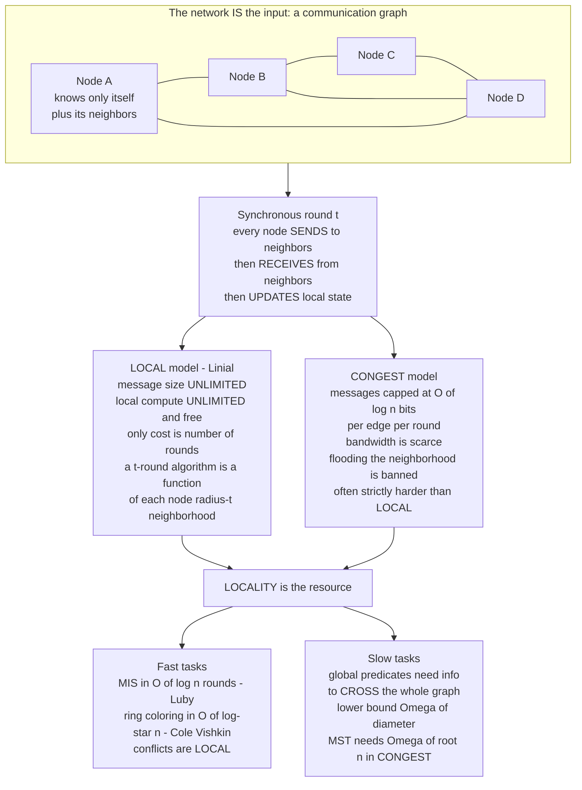

# 🕸️ Distributed Graph Algorithms (LOCAL and CONGEST)

> [!abstract] TL;DR
> **Distributed graph algorithms** ask a question that flips ordinary algorithm design inside out: *the network itself is the input.* Every processor is a **node** in a communication graph, it initially knows only itself and its neighbors, and computation runs in **synchronous rounds** where each node may only talk to its immediate neighbors. The central resource is **locality** — how far information must travel — and it is measured in **rounds**. Two canonical models pin this down: the **LOCAL** model (messages and local compute are unlimited, so the only cost is the round count, and a `t`-round algorithm is exactly a function of each node's radius-`t` neighborhood) and the **CONGEST** model (messages are capped at `O(log n)` bits per edge per round, so bandwidth becomes scarce and flooding is banned). This theory proves that some global tasks — a proper coloring, a maximal independent set — finish in a *handful* of rounds via **randomized symmetry breaking** (Luby's `O(log n)` MIS, Cole-Vishkin's `O(log* n)` ring coloring), while others *provably* require `Ω(diameter)` or `Ω(√n)` rounds because information must physically cross the network. It is the rigorous complexity theory of distributed computing.

---

## Intuition

**Analogy:** Imagine every computer in a network is a person standing in a huge field, holding hands only with a few immediate neighbors. Nobody has a map of the field. Once per minute a whistle blows: in that minute you may whisper to the people whose hands you hold, listen to what they whisper back, and update what you believe — then the whistle blows again. Now the whole crowd is asked to solve a **global** problem: "everyone put on a hat so that no two hand-holding neighbors wear the same color," or "elect exactly one person as captain," or "form one big spanning tree of handshakes." How many whistle-blows does it take?

The surprising answer is that it *depends entirely on the task*. Coloring your hats so neighbors differ can be done in a shockingly small number of rounds — roughly the number of times you can take the logarithm of the crowd size before reaching one (`log* n`, essentially a constant) — because color conflicts are *local* and everyone can resolve them by looking only a few hands away. But a task like "does *anyone* in the entire field hold a red ball?" is fundamentally different: the answer can hinge on a single person on the far side, and information can only crawl one handhold per minute, so you *must* wait at least as many rounds as the field is wide — its **diameter**. This split — some global properties are secretly local, others are irreducibly global — is the entire subject. It defines **locality as a computational resource** and proves, with mathematical certainty, which network tasks are fast and which are inherently slow.

---

## How It Works

### The network is the input

In classical algorithms a single machine holds the whole graph and runs a subroutine. In **distributed graph algorithms** the graph `G = (V, E)` is *simultaneously the input and the computer*: each vertex `v ∈ V` is an autonomous **processor**, each edge `{u, v} ∈ E` is a **bidirectional communication link**, and there is no central coordinator. A node begins knowing only *local* facts — its own identity (a unique ID or a random value), its degree, and who its neighbors are. It knows nothing about the graph beyond one hop. The goal is to compute a **global** graph structure — a proper coloring, a maximal independent set (MIS), a maximal matching, a spanning tree, or shortest-path distances — such that when the algorithm halts, each node holds *its own piece* of the answer (its color, its in/out-MIS bit, its parent pointer). See [[Distributed_Systems_Overview]] and [[Message_Passing_and_RPC_Semantics]] for how message passing underpins this whole picture.

### Synchronous rounds

Computation proceeds in lock-step **synchronous rounds**. In each round, every node in parallel:

1. **Sends** a message to each of its neighbors (possibly different messages on different edges).
2. **Receives** the messages its neighbors sent this round.
3. **Computes** — updates its local state based on what it received.

The complexity measure is the **number of rounds** until every node has committed its output. This is a *time* measure, not a *message* measure: it counts how many communication hops the algorithm needs, which is exactly a measure of **how far information must travel**. (Synchrony is a modeling convenience — a synchronous `t`-round algorithm can be run over a real asynchronous network with a **synchronizer** at bounded overhead; see [[System_and_Timing_Models]].)

### The LOCAL model — locality as the only cost

Nathan Linial's **LOCAL** model (1987/1992) makes an aggressive simplification: within a round, **message size is unbounded** and **local computation is unbounded and free**. The *only* thing you pay for is the **round count**. This has a beautiful consequence. In `t` rounds, the farthest a node's message can influence is exactly `t` hops away, and the farthest information a node can gather is its **radius-`t` neighborhood** (the ball of nodes within distance `t`). Because messages are unbounded, a node can in principle *learn its entire radius-`t` neighborhood* and then compute anything from it. Therefore:

> A `t`-round LOCAL algorithm is **exactly** a function that maps each node's radius-`t` neighborhood (its ball of radius `t`, including IDs and inputs) to that node's output.

This is what it means for the LOCAL model to *capture locality in its purest form*: round complexity **is** locality. If you can prove that no function of the radius-`t` ball can produce a correct output, you have proved a `> t` round **lower bound** — no algorithm whatsoever can be faster, because faster means "more local than the problem allows."

### The CONGEST model — bandwidth matters

The LOCAL model ignores a real cost: you cannot ship your entire neighborhood across a single link in one round. The **CONGEST** model adds the missing constraint: each message is capped at `O(log n)` bits per edge per round — just enough to name a node ID, a distance, or a counter. Now you **cannot flood** your neighborhood; you must summarize. This models real network **congestion**, and it changes the landscape: many problems that are trivial in LOCAL (learn everything nearby, then compute) become genuinely hard in CONGEST because the relevant information cannot fit through the bandwidth bottleneck. Computing an exact **minimum spanning tree**, for instance, is `O(diameter + √n)` rounds in CONGEST (Garay-Kutten-Peleg / Kutten-Peleg), and that `√n` term is a *provable* bandwidth lower bound (Das Sarma et al.), not a limitation of any one algorithm. LOCAL and CONGEST are the two canonical models, and the gap between them is precisely the study of *when bandwidth, not just locality, is the bottleneck*.

### Symmetry breaking — why randomness enters

The deepest obstacle is **symmetry**. Consider an anonymous **ring** where every node runs identical code and looks identical to its neighbors (same degree, no IDs). A **deterministic** algorithm forces every node into the *same* state every round — so no node can ever distinguish itself to become "the leader" or "the one that joins the MIS." This is **Angluin's impossibility** (1980): deterministic symmetry breaking is impossible in a symmetric anonymous network. Two escapes exist, and both appear throughout the theory:

- **Unique IDs** — if nodes have distinct identifiers, ties can be broken by comparing IDs (this is how Cole-Vishkin coloring and the ID-based MIS work).
- **Randomization** — each node draws private random bits, breaking symmetry *with high probability* (this is Luby's MIS and the randomized colorings).

Symmetry breaking is *the* fundamental primitive: leader election, MIS, coloring, and matching are all, at heart, ways of selecting a "special" subset of nodes despite local indistinguishability. See [[Leader_Election]] for the same impossibility playing out in the election setting, and [[Randomized_Complexity_Classes]] for the broader role of randomness in computation.

### The two models and locality as a resource



### Classic problems and results — the hydrogen atoms

- **Maximal Independent Set (MIS)** — select a set `S` of nodes, no two adjacent (independent), that cannot be extended (maximal, so every node is in `S` or has a neighbor in `S`). Luby's randomized algorithm solves MIS in `O(log n)` rounds with high probability. It is the workhorse the demo below implements.
- **`(Δ+1)`-coloring** — color the graph with `Δ+1` colors (`Δ` = max degree) so neighbors differ. A greedy sequential coloring always succeeds; the distributed challenge is doing it *fast and in parallel*. Randomized `(Δ+1)`-coloring runs in `O(log n)` rounds, and a beautiful line of work drives this toward `O(log* n)` on structured graphs.
- **Cole-Vishkin `O(log* n)` coloring of rings/paths** — the famous **iterated-logarithm** result: color a ring with `3` colors in `O(log* n)` rounds by repeatedly encoding each node's color as the *position of a differing bit* between its ID and its neighbor's, shrinking the color palette from `n` down to `O(1)` one exponential at a time. `log* n` (the number of times you must take `log` to get below `1`) is `≤ 5` for any `n` in the physical universe — effectively constant.
- **Maximal matching** — a symmetric cousin of MIS on edges; also `O(log n)` rounds randomized.
- **Minimum spanning tree (GHS)** — the Gallager-Humblet-Spira algorithm builds an MST bottom-up by merging *fragments* that each pick their minimum-weight outgoing edge; it is the founding result of the field and the reason MST is the canonical CONGEST benchmark. See [[Minimum_Spanning_Tree]] for the sequential Kruskal/Prim view of the same object.

### Lower bounds and the locality of a problem

The flip side of fast algorithms is **provable slowness**. Some problems demand `Ω(diameter)` rounds: any task whose answer can depend on a single far-away input (e.g., "is the whole graph 2-colorable?", "what is the graph diameter?", "does any node hold a token?") requires information to traverse the network, and information moves one hop per round. The proof technique is **indistinguishability**: construct two graphs (or two inputs) that require *different* outputs but look *identical* in every node's radius-`t` neighborhood for some `t`; then no `t`-round algorithm can be correct on both, forcing `> t` rounds. Linial's celebrated **`Ω(log* n)` lower bound** for `3`-coloring a ring *matches* Cole-Vishkin's upper bound exactly — one of the cleanest tight results in the field, using a Ramsey-theoretic argument to show no faster local rule exists. In CONGEST, the additional `Ω(√n)` bandwidth lower bounds come from **communication complexity** reductions across a graph "bottleneck." See [[Theory_of_Computation_Overview]] and [[Time_and_Space_Complexity]] for the parent discipline these arguments live in.

### The locality hierarchy — modern distributed complexity theory

Naor and Stockmeyer (1995) introduced **Locally Checkable Labelings (LCLs)**: problems where a labeling's validity can be *verified* by every node inspecting a constant-radius neighborhood (MIS, coloring, matching are all LCLs on bounded-degree graphs). The stunning discovery of the 2010s is that LCL round complexities are **quantized** into a discrete hierarchy — on bounded-degree graphs a deterministic LCL complexity is *always* one of `Θ(1)`, `Θ(log* n)`, `Θ(log n)`, `Θ(poly log n)`, or `Θ(n^{1/k})` classes, with *gaps* where no problem can land (e.g., nothing has complexity strictly between `ω(log* n)` and `o(log n)`). This "**distributed complexity theory**" — classifying local problems the way P/NP classifies sequential ones — turned a bag of clever algorithms into a structured science and remains a hot research frontier.

### Relation to PRAM and massively parallel computation

LOCAL and CONGEST are the *distributed cousins* of shared-memory **PRAM** parallel models: Luby's MIS was originally a **parallel (NC)** algorithm, and "a fast distributed algorithm" and "a low-depth parallel algorithm" are often two views of the same construction. The lineage continues into **Massively Parallel Computation (MPC)** — the theoretical model behind MapReduce, Spark, and Pregel — and the **Congested Clique** (a fully-connected CONGEST graph), where round-efficient graph algorithms directly inform how systems like **Pregel/Giraph** ("think like a vertex") and **GraphX** scale graph processing across a cluster. The bridge from this pencil-and-paper theory to industrial graph engines runs straight through these models.

---

## Key Concepts

### Secondary (plain-language)
- Picture every computer as a person in a crowd who can only whisper to the neighbors they hold hands with, once per round.
- Some group tasks (color your hats so touching neighbors differ) finish in very few rounds because conflicts are *local*.
- Other tasks ("does anyone here hold a red ball?") need many rounds because news has to travel all the way across the crowd — one handhold per round.
- In a perfectly symmetric crowd where everyone is identical, you *need* either name tags (**unique IDs**) or coin flips (**randomness**) to pick out anyone special.

### Undergraduate (CS background)
- **LOCAL model**: unlimited message size and compute; cost = **rounds**; a `t`-round algorithm equals a function of each node's radius-`t` ball.
- **CONGEST model**: adds an `O(log n)`-bit message cap per edge per round; **bandwidth** becomes the bottleneck, so you cannot just gather your neighborhood.
- **MIS / (Δ+1)-coloring / maximal matching** are the canonical symmetry-breaking problems, all solvable in `O(log n)` randomized rounds.
- **Luby's algorithm**: each round nodes draw random values; local minima join the MIS and remove their neighbors; a constant fraction of nodes leave per round, giving `O(log n)` rounds.
- **Cole-Vishkin**: `O(log* n)`-round ring coloring via iterated bit-position recoloring — `log* n` is effectively constant.
- **Ω(diameter) lower bound**: any globally-dependent predicate needs information to cross the graph, so it cannot beat the diameter.

### Graduate (research level)
- **Indistinguishability / Ramsey lower bounds**: Linial's `Ω(log* n)` ring-coloring bound; two locally-identical graphs forcing different outputs prove round lower bounds outright.
- **LCLs (Naor-Stockmeyer)** and the **distributed complexity hierarchy**: the quantized classes `Θ(1)`, `Θ(log* n)`, `Θ(log n)`, `Θ(poly log n)`, `Θ(n^{1/k})` and the provable *gaps* between them; **derandomization** results (deterministic vs randomized LOCAL, the `poly log n` frontier and the recent `poly(log log n)`-type breakthroughs for MIS/coloring).
- **CONGEST bandwidth lower bounds**: `Ω(√n + D)` for exact MST via communication-complexity reductions across graph cuts (Das Sarma et al.).
- **Model relatives**: PRAM/NC, the **Congested Clique**, and **MPC** (low/linear/superlinear memory regimes); the conjectured `1-vs-2` cycle hardness in low-memory MPC.
- **Synchronizers** (Awerbuch): running synchronous LOCAL/CONGEST algorithms over asynchronous networks with bounded overhead — the bridge back to [[System_and_Timing_Models]].

---

## Python Demo

A pure-stdlib simulation of **Luby's randomized MIS** in the LOCAL model. Nodes act in synchronous rounds, communicating only with graph neighbors; each round they draw a random priority, and every node that is a **local minimum** among its still-active neighbors joins the MIS and removes itself and its neighbors. We (1) verify the output is a **valid MIS** (independent *and* maximal), (2) show empirically that the round count grows like **`O(log n)`**, (3) contrast this with the **`Ω(diameter)`** barrier by showing how far information can travel per round on a path, and (4) **visualize** the round-by-round construction on a small graph. Only `random`, `math`, and `matplotlib` are used — no `numpy`, no `networkx`.

```python
"""
Luby's randomized Maximal Independent Set (MIS) in the LOCAL model.

Each node runs identical code, talks only to graph neighbors, and uses
private randomness to break symmetry. We show:
  1. the output is a VALID MIS  (independent + maximal),
  2. termination in ~ O(log n) synchronous rounds (empirically),
  3. the Omega(diameter) contrast: info moves one hop per round,
  4. a round-by-round picture of the MIS being built.

Pure stdlib simulation + matplotlib. numpy / networkx NOT required.
"""
import random
import math
import matplotlib.pyplot as plt


# ----------------------------------------------------------------------
# graph as an adjacency dict of sets: the "network" that is also the input
# ----------------------------------------------------------------------
def random_graph(n, avg_degree, seed):
    """Sparse Erdos-Renyi graph G(n, p) with target average degree."""
    rng = random.Random(seed)
    p = avg_degree / max(n - 1, 1)
    adj = {v: set() for v in range(n)}
    for u in range(n):
        for v in range(u + 1, n):
            if rng.random() < p:
                adj[u].add(v)
                adj[v].add(u)
    return adj


# ----------------------------------------------------------------------
# Luby's MIS: synchronous rounds, LOCAL communication only
# ----------------------------------------------------------------------
def luby_mis(adj, seed, record=False):
    """Return (mis_set, rounds, history).

    history (if record=True) is a list of per-round snapshots
    (joined_this_round, removed_this_round, active_before_round) used
    purely for visualization; the ALGORITHM only ever inspects a node's
    immediate neighbors -> it is a genuine LOCAL-model simulation.
    """
    rng = random.Random(seed)
    active = set(adj)          # nodes not yet decided
    mis = set()
    history = []
    rounds = 0

    while active:
        rounds += 1
        # ROUND STEP 1: each active node picks a random priority and
        # SENDS it to its neighbors (one hop of LOCAL communication).
        val = {v: rng.random() for v in active}

        # ROUND STEP 2: a node JOINS the MIS iff it is the local minimum
        # priority among its still-active neighbors. Ties are broken by
        # node id, so (val, id) gives every node a unique winner test.
        joiners = set()
        for v in active:
            if all((val[u], u) > (val[v], v)
                   for u in adj[v] if u in active):
                joiners.add(v)

        # ROUND STEP 3: joiners enter the MIS; joiners AND their active
        # neighbors are removed (dominated) from the active set.
        removed = set(joiners)
        for v in joiners:
            removed |= (adj[v] & active)

        if record:
            history.append((set(joiners), set(removed), set(active)))
        mis |= joiners
        active -= removed

    return mis, rounds, history


def is_valid_mis(adj, mis):
    """Check the two MIS properties from LOCAL information only."""
    for v in mis:                       # INDEPENDENCE: no edge inside mis
        if adj[v] & mis:
            return False
    for v in adj:                       # MAXIMALITY: every node dominated
        if v not in mis and not (adj[v] & mis):
            return False
    return True


# ======================================================================
# 1) correctness check on a mid-size graph
# ======================================================================
G = random_graph(n=500, avg_degree=8, seed=1)
mis, rounds, _ = luby_mis(G, seed=1)
print(f"n=500  |MIS|={len(mis):3d}  rounds={rounds}  "
      f"valid={is_valid_mis(G, mis)}")

# ======================================================================
# 2) rounds vs n  ->  grows like O(log n)
# ======================================================================
sizes = [16, 32, 64, 128, 256, 512, 1024, 2048, 4096]
TRIALS = 25
avg_rounds = []
for n in sizes:
    rs = []
    for t in range(TRIALS):
        g = random_graph(n, avg_degree=8, seed=1000 * t + n)
        _, r, _ = luby_mis(g, seed=7 * t + 3)
        rs.append(r)
    avg_rounds.append(sum(rs) / len(rs))
    print(f"n={n:5d}  avg rounds = {avg_rounds[-1]:.2f}")

# ======================================================================
# 3) Omega(diameter) contrast: on a PATH of n nodes, after t rounds a
#    node knows only its radius-t ball, so a GLOBAL predicate (e.g. "does
#    any node hold a token?") cannot finish before diameter = n-1 rounds.
# ======================================================================
path_n = 24
info_radius = list(range(path_n))            # reachable radius after t rounds
diameter = path_n - 1
print(f"\npath of {path_n} nodes: diameter = {diameter}; a global predicate "
      f"needs >= {diameter} rounds (info moves 1 hop/round)")

# ======================================================================
# 4) round-by-round visualization on a small graph (circular layout)
# ======================================================================
Vg = 22
Gv = random_graph(Vg, avg_degree=3, seed=42)
mis_v, rounds_v, hist = luby_mis(Gv, seed=5, record=True)

pos = {v: (math.cos(2 * math.pi * v / Vg), math.sin(2 * math.pi * v / Vg))
       for v in range(Vg)}

show = min(len(hist), 5)                      # first few rounds
fig, axes = plt.subplots(1, show + 1, figsize=(3.1 * (show + 1), 3.4))

decided_in = {}                               # node -> round it left active
for r, (joined, removed, _active) in enumerate(hist):
    for v in removed:
        decided_in.setdefault(v, r)
in_mis = set()

for r in range(show):
    ax = axes[r]
    joined, removed, active_before = hist[r]
    in_mis |= joined
    for u in Gv:                              # draw edges
        for w in Gv[u]:
            if u < w:
                ax.plot([pos[u][0], pos[w][0]], [pos[u][1], pos[w][1]],
                        color="#cccccc", lw=0.8, zorder=1)
    for v in range(Vg):                       # draw nodes by state
        if v in in_mis:
            c = "#2e8b57"                      # green: committed to MIS
        elif v in decided_in and decided_in[v] < r:
            c = "#d9d9d9"                      # grey: removed (dominated)
        elif v in active_before:
            c = "#f1c40f" if v in joined else "#4a90d9"  # joining vs active
        else:
            c = "#d9d9d9"
        ax.scatter(*pos[v], s=170, color=c, zorder=2,
                   edgecolors="black", linewidths=0.5)
    ax.set_title(f"round {r + 1}", fontsize=10)
    ax.axis("off")
    ax.set_aspect("equal")

# final panel: the resulting MIS
axf = axes[show]
for u in Gv:
    for w in Gv[u]:
        if u < w:
            axf.plot([pos[u][0], pos[w][0]], [pos[u][1], pos[w][1]],
                     color="#cccccc", lw=0.8, zorder=1)
for v in range(Vg):
    c = "#2e8b57" if v in mis_v else "#d9d9d9"
    axf.scatter(*pos[v], s=170, color=c, zorder=2,
                edgecolors="black", linewidths=0.5)
axf.set_title(f"final MIS  |S|={len(mis_v)}\nvalid={is_valid_mis(Gv, mis_v)}",
              fontsize=10)
axf.axis("off")
axf.set_aspect("equal")

fig.suptitle("Luby's MIS built round by round  "
             "(yellow=joining, blue=active, green=in MIS, grey=removed)",
             fontweight="bold")
fig.tight_layout()
plt.savefig("luby_mis_rounds.png", dpi=120)

# ----- second figure: O(log n) rounds + Omega(diameter) contrast -----
fig2, (axr, axd) = plt.subplots(1, 2, figsize=(13, 5))

axr.semilogx(sizes, avg_rounds, "o-", color="#2980b9", base=2,
             label="measured avg rounds (Luby MIS)")
c = avg_rounds[-1] / math.log2(sizes[-1])     # anchor a c*log2(n) reference
axr.semilogx(sizes, [c * math.log2(n) for n in sizes], "--",
             color="#c0392b", base=2, label="reference c * log2(n)")
axr.set_xlabel("number of nodes n (log scale)")
axr.set_ylabel("rounds to complete")
axr.set_title("Luby's MIS finishes in O(log n) rounds")
axr.legend()
axr.grid(True, which="both", ls=":", alpha=0.5)

axd.plot(range(path_n), info_radius, "o-", color="#8e44ad",
         label="info radius reachable after t rounds")
axd.axhline(diameter, color="#c0392b", ls="--",
            label=f"diameter = {diameter} (global-task lower bound)")
axd.set_xlabel("rounds t")
axd.set_ylabel("hops a node can know about")
axd.set_title("Omega(diameter): a global predicate cannot beat the diameter")
axd.legend()
axd.grid(True, ls=":", alpha=0.5)

fig2.tight_layout()
plt.savefig("mis_rounds_vs_n.png", dpi=120)
print("\nsaved luby_mis_rounds.png and mis_rounds_vs_n.png")
```

**What you observe.** The correctness check prints `valid=True` every run — Luby's output is always a genuine MIS (independent and maximal). The `rounds vs n` table roughly *doubles the node count while adding only a small constant to the round count*, and the log-scale plot shows the measured curve hugging the `c·log₂(n)` reference line — empirical confirmation of the `O(log n)` bound. The path experiment makes the contrast concrete: information spreads exactly **one hop per round**, so a predicate that depends on a far node cannot finish before `diameter` rounds — no cleverness helps, because in the LOCAL model a `t`-round output is *only* a function of the radius-`t` ball. The round-by-round panels visualize symmetry breaking in action: each round a scattered set of local-minimum nodes (yellow) commits to the MIS (green) and knocks out their neighbors (grey), and the active frontier (blue) shrinks geometrically until nothing is left.

---

## Real-World Applications

- **Scalable graph processing (Pregel / Giraph / GraphX)** — the "**think like a vertex**" programming model *is* the LOCAL/CONGEST model made industrial: each vertex runs the same function, sees only messages from neighbors, and computes in synchronous **supersteps** (rounds). Round-efficient distributed algorithms translate directly into fewer supersteps, and thus lower latency and cost, on these engines.
- **Wireless, sensor, and ad-hoc networks** — nodes must self-organize with no central controller: **MIS** gives a set of cluster-heads/backbone nodes, **coloring** assigns non-interfering TDMA time slots or frequencies to neighbors, and **maximal matching** pairs up nodes for link scheduling. These are the textbook motivations for the whole field.
- **Routing protocol theory** — distance-vector and link-state routing are distributed graph algorithms: **RIP/EIGRP** are essentially distributed Bellman-Ford (each router exchanges distance vectors with neighbors each round), while **OSPF/IS-IS** flood link-state to compute shortest paths. See [[Routing_Protocols]], [[Routing_Fundamentals]], and [[OSPF_Protocol]] for the systems view of these round-based algorithms.
- **Self-stabilizing and network-coordination systems** — clock synchronization, spanning-tree construction (the network **spanning-tree protocol**, and GHS-style MST), and leader/coordinator selection all rest on this theory; see [[Leader_Election]].
- **Blockchain and gossip network analysis** — the mixing time, connectivity, and information-spread properties of peer-to-peer overlays (epidemic/gossip dissemination) are analyzed with exactly these locality and round-complexity tools. *(A dedicated Gossip and Epidemic Protocols sibling note in this vault will develop the randomized-dissemination side; the round-based spreading analysis lives here.)*

---

## Common Pitfalls

- **Confusing round complexity with message complexity.** LOCAL cost is *rounds* (how far info travels), not the *number* or *size* of messages. An algorithm can be round-optimal yet send enormous messages — which is exactly why CONGEST exists to re-add the bandwidth cost you ignored.
- **Assuming LOCAL efficiency implies CONGEST efficiency.** "Gather my radius-`t` ball, then compute" is a valid LOCAL strategy but often *illegal* in CONGEST because the ball does not fit in `O(log n)`-bit messages. Always ask which model a stated round bound is in.
- **Expecting deterministic symmetry breaking in anonymous networks.** By Angluin's impossibility, identical nodes with no IDs *cannot* deterministically elect a leader or build an MIS. If your design lacks both unique IDs and randomness, it cannot break symmetry — full stop.
- **Ignoring the `Ω(diameter)` floor for global tasks.** Any output that can depend on a distant node's input needs information to cross the graph. No amount of local cleverness beats the diameter; trying to "optimize" below it is chasing an impossibility.
- **Reading `O(log* n)` as slow.** `log* n` (iterated logarithm) is `≤ 5` for every `n` that fits in the observable universe — it is *effectively constant*. Do not confuse it with `log n` or, worse, `log²n`.
- **Deploying synchronous-model algorithms on asynchronous networks naively.** Real networks are asynchronous ([[System_and_Timing_Models]]). You need a **synchronizer** (or explicit round tags) to run a synchronous LOCAL/CONGEST algorithm correctly; assuming lock-step where none exists causes rounds to interleave and corrupt state.

---

## Related Concepts

- [[Distributed_Systems_Overview]] — the map of the field; this note is its rigorous *algorithmic/complexity* branch, where the network graph is the machine.
- [[Leader_Election]] — the same symmetry-breaking impossibility (Angluin) and randomization/ID escape hatches, specialized to electing one coordinator.
- [[System_and_Timing_Models]] — synchronous rounds are an idealization; synchronizers and partial synchrony connect this theory to real asynchronous networks.
- [[The_Consensus_Problem]] — agreement is another global task; contrast its fault-tolerance focus with locality's information-distance focus.
- [[FLP_Impossibility_Result]] — a sibling "impossibility of a global task" result; here the barrier is *locality/diameter* rather than asynchrony + faults.
- [[Message_Passing_and_RPC_Semantics]] — the message-passing substrate every round is built on.
- [[Theory_of_Computation_Overview]] — the parent discipline; distributed complexity theory classifies LOCAL problems the way P/NP classifies sequential ones.
- [[Time_and_Space_Complexity]] — the sequential resource-measure analogue of "rounds as a resource."
- [[Randomized_Complexity_Classes]] — Luby's MIS is a landmark randomized/NC algorithm; randomness is the key to symmetry breaking.
- [[Minimum_Spanning_Tree]] — the sequential Kruskal/Prim view of the object that GHS builds distributedly and that anchors CONGEST lower bounds.
- [[BFS]] — breadth-first layering is exactly "information radius grows one hop per round," the intuition behind the `Ω(diameter)` bound.
- [[Graph_Representation]] — adjacency structures; in the distributed setting the representation is *physically distributed* across the processors.
- [[Greedy_Fundamentals]] — sequential greedy coloring/MIS is the baseline that distributed algorithms must parallelize.
- [[Routing_Protocols]] / [[Routing_Fundamentals]] / [[OSPF_Protocol]] — production distributed graph algorithms (distributed Bellman-Ford, link-state) running in real networks.

---

## Review Questions

1. **(Secondary)** Explain, using the crowd-in-a-field analogy, why coloring everyone's hat so neighbors differ can be fast, but answering "does *anyone* in the field hold a red ball?" is inherently slow. What is the name of the graph quantity that lower-bounds the second task?
2. **(Undergraduate)** In the LOCAL model, argue precisely why a `t`-round algorithm's output at a node can depend only on that node's radius-`t` neighborhood. Then walk through one round of **Luby's MIS**: what does each active node send, how does it decide whether to join the MIS, and why does a constant fraction of nodes get removed each round (giving `O(log n)` total)?
3. **(Graduate)** (a) State the difference between the LOCAL and CONGEST models and give a concrete problem that is easy in one and provably hard in the other, with the reason. (b) Sketch how an **indistinguishability** argument proves an `Ω(diameter)` lower bound for a globally-dependent predicate. (c) Explain what an **LCL** is and why the discovery of *gaps* in the LOCAL complexity hierarchy (e.g., nothing strictly between `ω(log* n)` and `o(log n)`) is a deep structural result rather than an artifact of current algorithms.

---

## Sources

- Linial, N. — *Locality in Distributed Graph Algorithms*, SIAM Journal on Computing, 21(1), 1992. (Defines the LOCAL model; the `Ω(log* n)` ring-coloring lower bound.) [DOI](https://doi.org/10.1137/0221015)
- Luby, M. — *A Simple Parallel Algorithm for the Maximal Independent Set Problem*, SIAM Journal on Computing, 15(4), 1986. (Luby's `O(log n)` randomized MIS.) [DOI](https://doi.org/10.1137/0215074)
- Cole, R. and Vishkin, U. — *Deterministic Coin Tossing with Applications to Optimal Parallel List Ranking*, Information and Control, 70(1), 1986. (The `O(log* n)` coloring technique.) [DOI](https://doi.org/10.1016/S0019-9958(86)80023-7)
- Naor, M. and Stockmeyer, L. — *What Can Be Computed Locally?*, SIAM Journal on Computing, 24(6), 1995. (Locally Checkable Labelings.) [DOI](https://doi.org/10.1137/S0097539793254571)
- Barenboim, L. and Elkin, M. — *Distributed Graph Coloring: Fundamentals and Recent Developments*, Morgan & Claypool, 2013. [Publisher](https://doi.org/10.2200/S00520ED1V01Y201307DCT011)
- Peleg, D. — *Distributed Computing: A Locality-Sensitive Approach*, SIAM Monographs on Discrete Mathematics, 2000. [Publisher](https://doi.org/10.1137/1.9780898719772)

---

#distributed-systems #distributed-algorithms #local-model #congest-model #symmetry-breaking
