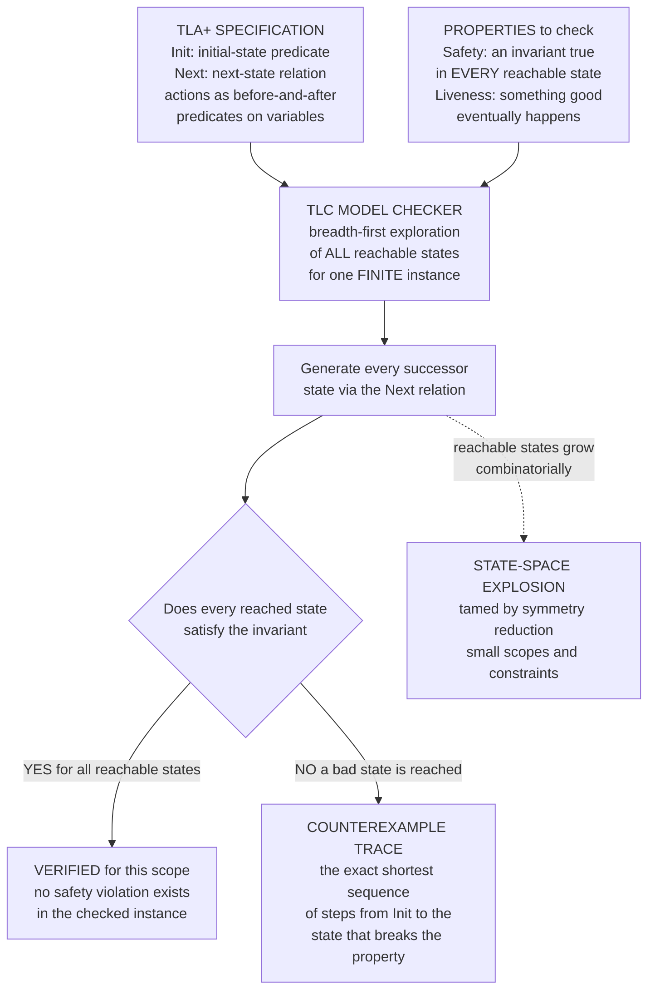

# 🔬 Formal Verification and TLA+

> [!abstract] TL;DR
> **Formal verification** treats a distributed protocol as a precise **mathematical state machine** — an *initial-state predicate* and a *next-state relation* — and then either **model-checks** it (exhaustively enumerating every reachable state to see whether a property can ever be violated) or **proves** it (a machine-checked proof for all sizes). **TLA+** (Leslie Lamport's *Temporal Logic of Actions* plus a specification language) is the industrial standard: you write *what* the system does abstractly in the language of sets, functions, and logic; its checker **TLC** does breadth-first exploration of the whole reachable-state graph, verifying **safety** invariants ("nothing bad ever happens") and **liveness** properties ("something good eventually happens"), and on failure hands you the **exact shortest sequence of steps** that breaks the property. This matters because distributed protocols have an astronomically large space of message and failure **interleavings**, the fatal bugs live in rare orderings **no human enumerates**, and **testing samples a vanishing fraction** of them. Formal methods explore *all* behaviours (within a checked scope) and catch design bugs *before* implementation — which is why AWS, Azure, MongoDB, and CockroachDB now spec their hardest protocols in TLA+.

---

## Intuition

**Analogy:** Picture a distributed protocol as a card game where every "move" is a message arriving or a node crashing. The trouble is that the *order* of moves is chosen by an adversary you cannot control — and a real protocol has so many possible orderings that if you dealt one new hand every microsecond, you would not finish exploring them before the sun burns out. Now suppose exactly **one** obscure ordering — the twelfth message arriving *just before* a crash that everyone assumed would come after — silently corrupts your data. **Testing** is like playing a few thousand hands and never happening to deal that one; you go home confident, and the bug ships. A **model checker** is different: it is a machine that plays **every possible hand**, systematically, and either certifies "in none of these millions of orderings does anything bad happen" or stops the instant it finds the one that breaks and says "here — deal the cards in *exactly this order* and watch two leaders get elected." It is **exhaustive proof instead of hopeful sampling.**

That difference is not cosmetic. Testing answers "did the bug appear in the runs I tried?"; model checking answers "does the bug exist *at all* in the checked configuration?" For a consensus or replication protocol — where a single missed interleaving means lost or duplicated committed data — that is the difference between "probably correct" and "provably correct for the scope we checked." As the AWS team famously reported, a **200-line TLA+ spec found a bug that would corrupt data — a bug that 35 pages of careful prose and years of testing had missed** (see [[Distributed_Systems_Overview]]).

---

## How It Works

### A protocol *is* a state machine

The core modelling move — the same one used by [[Finite_Automata_DFA_and_NFA|finite automata]] and by [[Operational_Semantics|operational semantics]] in language theory — is to describe the entire system as a **state machine** over a set of variables (each node's local state, the set of in-flight messages, a shared log, etc.):

1. **An initial-state predicate `Init`** — a logical formula that is true of exactly the allowed starting states. In TLA+: `Init == pc = [i \in Procs |-> "idle"] /\ flag = [i \in Procs |-> FALSE]`.
2. **A next-state relation `Next`** — a disjunction of **actions**, each a predicate relating the *current* values of variables to their *primed* (next) values. `flag' = [flag EXCEPT ![self] = TRUE]` says "in the next state, `flag[self]` becomes `TRUE` and everything else is unchanged." An action fires only when its **enabling guard** holds, so nondeterminism (which message arrives next, which node crashes) is modelled as *a choice among enabled actions*.
3. **A behaviour** is any infinite sequence of states `s0 -> s1 -> s2 -> ...` where `s0` satisfies `Init` and each consecutive pair satisfies `Next` (or leaves everything unchanged — a *stuttering* step). The full specification is the temporal formula `Init /\ [][Next]_vars /\ Fairness`.

The crucial idea is that you specify **what the system does, abstractly — not code**. You are describing the *design*, in mathematics (sets, functions, records, logic), at whatever level of abstraction makes the correctness argument clean. **PlusCal** is a friendlier, pseudocode-like front-end that compiles down to this TLA+ state-machine form for people who think in terms of processes and program counters (see [[The_Consensus_Problem]]).

### Safety and liveness: the two shapes of every property

Lamport's foundational observation is that **essentially every correctness property of a distributed protocol is a conjunction of a safety property and a liveness property**:

- **Safety — "nothing bad ever happens."** Formally an **invariant**: a predicate that must be true in *every reachable state*. Examples: "**never two leaders in the same term**," "**never two processes in the critical section**," "**committed data is never lost**," "**a transaction never both commits at one node and aborts at another**." A safety property is **refuted by a finite bad trace** — a concrete, finite sequence of steps ending in a state where the invariant is false. Written in temporal logic as `[]Invariant` (box / "always").
- **Liveness — "something good eventually happens."** Examples: "**every submitted request eventually gets a response**," "**a leader is eventually elected**," "**the protocol eventually terminates**." A liveness property is **refuted by an infinite trace** that runs forever without ever making the promised progress (e.g., a system that stutters or loops without deciding). It requires **fairness assumptions** — promises that a continuously-enabled action is not ignored forever — otherwise the trivial do-nothing behaviour refutes everything. Written `<>Good` (diamond / "eventually"), or the stronger `[]<>` (infinitely often).

This split is the through-line of the whole field: the [[FLP_Impossibility_Result|FLP impossibility]] is precisely the statement that under asynchrony plus one crash you can keep **safety** but must forfeit the **liveness** (termination) guarantee — "safe always, live usually." Formal verification lets you *state* both kinds precisely and check them mechanically.

### Model checking with TLC

Given a spec and the properties, **TLC** (the TLA+ model checker) does the exhaustive thing:

1. **Bound the instance.** You fix a **finite** configuration — e.g., 3 processes, message IDs drawn from `{1, 2, 3}`, at most 2 concurrent requests. The state space must be finite for enumeration.
2. **Breadth-first search from `Init`.** TLC computes all initial states, then repeatedly applies `Next` to generate successors, hashing each state so it is explored exactly once. This grows the **reachable-state graph**.
3. **Check invariants on every state.** As each state is discovered, TLC evaluates every safety invariant. The moment one is false, it **stops and reconstructs the shortest path** from an initial state to the violating state.
4. **Check temporal (liveness) properties** by looking for "bad cycles" in the state graph — reachable strongly-connected components where the good thing never happens despite fairness.
5. **The counterexample trace** is the payoff. Unlike a failed test ("something went wrong somewhere"), TLC hands you the **exact, minimal, step-by-step interleaving** that produces the bug — a gift for debugging. The demo below reproduces exactly this loop.



### The state-space explosion problem

The catch is in step 1. The number of reachable states grows **combinatorially** with processes, message counts, and value domains — with `N` processes each having `k` local states, you already face up to `k^N` global states *before* counting in-flight messages. TLC fights this with:

- **Symmetry reduction** — if processes are interchangeable, explore one representative of each symmetric class.
- **Small scopes / small-model hypothesis** — the empirical observation (shared with [[Theory_of_Computation_Overview|automata-based]] verification and Alloy's analysis) that **most design bugs manifest in small configurations**: if a protocol is wrong, it is almost always wrong with 3 nodes and 2 values, not only at 300 nodes. So checking small instances exhaustively catches the overwhelming majority of real bugs.
- **State constraints** — bounding queues, message counters, or retry counts to keep the reachable set finite.

Model checking is therefore **sound but bounded**: a clean run *proves* the property for the checked scope but says nothing about larger sizes. That is the gap theorem proving fills.

### Theorem proving vs model checking

Two complementary regimes exist along an **automation-versus-generality** tradeoff:

| | **Model checking** (TLC, SPIN) | **Theorem proving** (TLAPS, Coq, Isabelle) |
|---|---|---|
| **What it establishes** | Property holds for a *finite, bounded* instance | Property holds for *all* sizes, unbounded |
| **Automation** | Fully automatic — push a button | Interactive — human guides the proof |
| **On failure** | Produces a concrete **counterexample trace** | Proof gets stuck; no counterexample |
| **Effort** | Minutes to hours | Days to person-years |
| **Best for** | Finding bugs, exploring designs | Final unbounded guarantees |

**TLAPS** is TLA+'s own interactive proof system for unbounded proofs. Beyond TLA+, the landmark results are **IronFleet** (Microsoft — machine-checked proofs of a full Paxos-based replicated state machine and a sharded key-value store, connecting a TLA-style spec down to running Dafny code) and **Verdi** (a Coq framework that produced the first mechanically-verified implementation of **Raft**). These prove not just the abstract design but the *implementation*, end-to-end — the gold standard, at enormous cost. In practice most teams **model-check first** (cheap, finds most bugs, gives counterexamples) and reserve **proof** for the crown-jewel invariants (see [[Proof_Assistants_and_Dependent_Type_Theory]] and [[Verified_and_Certified_Languages]]).

### The wider ecosystem

TLA+ is the most prominent but not the only tool. **SPIN/Promela** (Holzmann) is the classic explicit-state model checker for concurrent/communication protocols. **Alloy** does bounded *relational* model finding — great for structural invariants. **P** (Microsoft) is a state-machine language purpose-built for asynchronous, event-driven systems, used to test USB drivers and Azure services. **Ivy** targets *decidable* verification of distributed protocols so proofs stay push-button. **Coq/Verdi** and **Dafny/IronFleet** anchor the full-proof end. Together they form the distributed-systems verification landscape, all resting on the same [[Axiomatic_Semantics_and_Hoare_Logic|formal-semantics]] and [[Decidability_and_Recognizability|decidability]] foundations from programming-language and computation theory.

---

## Key Concepts

### Secondary (intuitive level)
- A **protocol** can be written down as a machine: **where it can start** (initial states) and **how it can step** (transitions).
- **Testing** tries a handful of runs and hopes to hit the bug. A **model checker** tries **every** run and either says "all safe" or shows you the exact run that breaks.
- **Safety** = "a bad thing never happens" (like *two people in the same seat*). **Liveness** = "a good thing eventually happens" (like *your request eventually gets answered*).
- **TLA+** is the language distributed-systems engineers at AWS and Azure use to write these machines down so a checker can inspect them.

### Undergraduate (mechanism level)
- **Init / Next** — the initial-state predicate and the next-state relation; **actions** are before-and-after predicates on variables (primed variables denote the next state).
- **Reachable-state graph** — the set of states reachable from `Init` by repeatedly applying `Next`; TLC explores it **breadth-first**.
- **Invariant (safety)** — a predicate checked in every reachable state; violated by a **finite** counterexample trace, which the checker reconstructs as the **shortest** path to the bad state.
- **Liveness + fairness** — a good-eventually property, violated by an **infinite** non-progressing trace; requires **weak/strong fairness** assumptions so the trivial do-nothing behaviour does not refute it.
- **State-space explosion** — states grow combinatorially; mitigated by **symmetry reduction**, **small scopes**, and **state constraints**.
- **PlusCal** — algorithm-like syntax that compiles to TLA+.

### Graduate (research level)
- **Temporal Logic of Actions** — Lamport's logic where the whole spec is a single temporal formula `Init /\ [][Next]_vars /\ Fairness`; stuttering-invariance makes **refinement** (implementation ⊑ specification) expressible as `Impl => Spec`, checkable as implication.
- **Safety/liveness as a topological decomposition** (Alpern–Schneider): every property is the intersection of a safety property (a closed set of behaviours) and a liveness property (a dense set) — the formal underpinning of Lamport's split.
- **Weakest-scope soundness vs completeness** — model checking is a decision procedure only for the *bounded* instance; the **small-model hypothesis** is an empirical, not a proven, bridge to unbounded correctness.
- **Symmetry and partial-order reduction** — quotienting the state graph by process-permutation symmetry and by independence of commuting actions to combat explosion; the same commutativity structure that drives the [[FLP_Impossibility_Result|FLP]] "hook" argument.
- **Compositional / refinement proofs** — TLAPS, IronFleet (`Host` refines `DistributedSystem` refines `SpecState`), and Verdi's **verified system transformers** that lift a proof under an idealized network to one under a lossy network.
- **Decidable fragments** — Ivy's restriction to the effectively-propositional (EPR) fragment to keep distributed-protocol verification automatic, trading expressiveness for decidability.

---

## Python Demo

> [!note] A tiny model checker **in the spirit of TLA+**.
> We represent a distributed protocol exactly the way TLA+ does — as **(initial states, next-state relation)** — and do **exhaustive breadth-first exploration of all reachable states**, checking a **safety invariant**. On a **buggy** mutual-exclusion protocol (read and write are *separate* atomic steps, so two processes race into the critical section) the checker **finds and prints a concrete counterexample trace** — the exact interleaving that violates the invariant. On the **correct** protocol (an atomic acquire) it verifies *no* reachable state is bad. We then measure **state-space growth** as processes increase, and **visualize** the reachable-state graph with the counterexample path highlighted. Pure stdlib BFS + matplotlib (no external solver).

```python
"""
A TLA+-in-spirit model checker: exhaustive BFS over the reachable-state graph
of a small distributed protocol, checking a SAFETY INVARIANT and producing a
concrete COUNTEREXAMPLE TRACE when it is violated.  Pure stdlib + matplotlib.
"""

from collections import deque
import matplotlib.pyplot as plt
from matplotlib.patches import FancyArrowPatch

# ---------------------------------------------------------------------------
# 1. THE GENERIC MODEL CHECKER  (this is the whole idea, in ~15 lines)
#    A protocol is (initial states, next-state relation, invariant).
#    We BFS the reachable states; the FIRST invariant-violating state dequeued
#    is at minimum distance, so its parent-chain is the SHORTEST counterexample.
# ---------------------------------------------------------------------------
def model_check(initials, next_fn, invariant):
    parent = {}                       # state -> (prev_state, action_label)
    seen = set()
    q = deque()
    for s in initials:
        seen.add(s); parent[s] = None; q.append(s)
    violation = None
    while q:                          # exhaustive breadth-first exploration
        s = q.popleft()
        if violation is None and not invariant(s):
            violation = s             # shortest-distance bad state (BFS order)
        for label, t in next_fn(s):   # apply the next-state relation
            if t not in seen:
                seen.add(t); parent[t] = (s, label); q.append(t)
    return seen, parent, violation

def counterexample_trace(parent, bad):
    steps, s = [], bad
    while parent[s] is not None:      # walk parent pointers back to Init
        prev, label = parent[s]
        steps.append((label, s)); s = prev
    steps.append(("<INIT>", s))
    return list(reversed(steps))

# ---------------------------------------------------------------------------
# 2. TWO PROTOCOLS, each as an Init state + a Next relation.
#    State = (pcs, flags/held).  Invariant: at most ONE process in "cs".
# ---------------------------------------------------------------------------
def at_most_one_in_cs(state):
    pcs = state[0]
    return sum(1 for p in pcs if p == "cs") <= 1

# --- BUGGY: read ("check") and write ("enter/set flag") are SEPARATE steps,
#     so two processes can both pass the check while both flags are still False,
#     then both set their flag and enter the critical section.  A real race.
def buggy_init(n):
    return (("idle",) * n, (False,) * n)

def buggy_next(state):
    pcs, flags = state
    n = len(pcs); out = []
    for i in range(n):
        if pcs[i] == "idle":
            # CHECK step (a read): pass only if every OTHER flag is False
            if all(not flags[j] for j in range(n) if j != i):
                np = list(pcs); np[i] = "checked"
                out.append((f"p{i}:check-ok", (tuple(np), flags)))
        elif pcs[i] == "checked":
            # ENTER step (a write): set own flag and go critical -- too late!
            np, nf = list(pcs), list(flags); np[i] = "cs"; nf[i] = True
            out.append((f"p{i}:enter+set", (tuple(np), tuple(nf))))
        elif pcs[i] == "cs":
            np, nf = list(pcs), list(flags); np[i] = "idle"; nf[i] = False
            out.append((f"p{i}:exit", (tuple(np), tuple(nf))))
    return out

# --- CORRECT: acquire is a SINGLE ATOMIC step (test-and-set the lock).
def good_init(n):
    return (("idle",) * n, False)     # second component = lock held?

def good_next(state):
    pcs, held = state
    n = len(pcs); out = []
    for i in range(n):
        if pcs[i] == "idle" and not held:
            np = list(pcs); np[i] = "cs"
            out.append((f"p{i}:acquire", (tuple(np), True)))     # atomic
        elif pcs[i] == "cs":
            np = list(pcs); np[i] = "idle"
            out.append((f"p{i}:release", (tuple(np), False)))
    return out

# ---------------------------------------------------------------------------
# 3. RUN THE CHECKER on both protocols (2 processes).
# ---------------------------------------------------------------------------
print("=" * 68)
print("CORRECT protocol (atomic acquire), 2 processes:")
seen_g, _, viol_g = model_check([good_init(2)], good_next, at_most_one_in_cs)
print(f"  reachable states explored : {len(seen_g)}")
print(f"  safety invariant violated : {'NO -- VERIFIED for this scope' if viol_g is None else 'YES'}")

print("\nBUGGY protocol (check then set), 2 processes:")
seen_b, parent_b, viol_b = model_check([buggy_init(2)], buggy_next, at_most_one_in_cs)
print(f"  reachable states explored : {len(seen_b)}")
if viol_b is not None:
    print("  safety invariant violated : YES -- counterexample found")
    print("  COUNTEREXAMPLE TRACE (the exact interleaving that breaks it):")
    trace = counterexample_trace(parent_b, viol_b)
    for k, (label, st) in enumerate(trace):
        pcs, flags = st
        print(f"    step {k}:  {label:15s}  pcs={pcs}  flags={flags}")
    print("    ^ BOTH processes reach 'cs' -> mutual exclusion violated.")

# ---------------------------------------------------------------------------
# 4. STATE-SPACE EXPLOSION: reachable state count vs number of processes.
# ---------------------------------------------------------------------------
sizes, counts = list(range(2, 6)), []
for n in sizes:
    s, _, _ = model_check([buggy_init(n)], buggy_next, at_most_one_in_cs)
    counts.append(len(s))
print("\nState-space growth (buggy protocol):")
for n, c in zip(sizes, counts):
    print(f"  {n} processes -> {c:5d} reachable states")

# ---------------------------------------------------------------------------
# 5. VISUALIZE: reachable-state graph (2 procs) + counterexample path,
#    and the state-space growth curve.
# ---------------------------------------------------------------------------
PC = {"idle": "i", "checked": "k", "cs": "C"}
def label_of(st):
    pcs, flags = st
    return "".join(PC[p] for p in pcs) + "|" + "".join("1" if f else "0" for f in flags)

# depth of each state = length of its parent chain (BFS layer)
def depth_of(st):
    d = 0
    while parent_b[st] is not None:
        st = parent_b[st][0]; d += 1
    return d

layers = {}
for st in seen_b:
    layers.setdefault(depth_of(st), []).append(st)
pos = {}
for d, states in layers.items():
    states.sort(key=label_of)
    for j, st in enumerate(states):
        pos[st] = (j - (len(states) - 1) / 2.0, -d)   # spread on x, depth on y

cex_states = {st for _, st in counterexample_trace(parent_b, viol_b)}
cex_edges = set()
tr = counterexample_trace(parent_b, viol_b)
for (_, a), (_, b) in zip(tr, tr[1:]):
    cex_edges.add((a, b))

fig, (ax1, ax2) = plt.subplots(1, 2, figsize=(15, 6.5))

# --- left: the reachable-state graph
for u in seen_b:
    for _, v in buggy_next(u):
        if v in pos:
            hot = (u, v) in cex_edges
            ax1.add_patch(FancyArrowPatch(
                pos[u], pos[v], arrowstyle="-|>", mutation_scale=12,
                color="#e67e22" if hot else "#cccccc",
                lw=2.8 if hot else 1.0, zorder=1,
                connectionstyle="arc3,rad=0.08"))
for st, (x, y) in pos.items():
    if st == viol_b:                 color = "#c0392b"   # the violating state
    elif st in cex_states:           color = "#e67e22"   # on the counterexample
    else:                            color = "#2980b9"
    ax1.scatter(x, y, s=900, color=color, edgecolor="black", linewidths=1.2, zorder=2)
    ax1.text(x, y, label_of(st), ha="center", va="center",
             color="white", fontsize=7, fontweight="bold", zorder=3)
ax1.set_title("Reachable-state graph of the BUGGY protocol\n"
              "orange = shortest counterexample path, red = safety violation "
              "(both in 'cs')", fontsize=10, fontweight="bold")
ax1.text(0.5, 0.02, "node label = pc0 pc1 | flag0 flag1   "
         "(i=idle, k=checked, C=cs)", transform=ax1.transAxes,
         ha="center", fontsize=8, color="#555555")
ax1.axis("off")

# --- right: state-space explosion
ax2.plot(sizes, counts, "o-", color="#8e44ad", lw=2.5, markersize=9)
for n, c in zip(sizes, counts):
    ax2.annotate(str(c), (n, c), textcoords="offset points",
                 xytext=(0, 10), ha="center", fontsize=9, fontweight="bold")
ax2.set_xlabel("number of processes"); ax2.set_ylabel("reachable states")
ax2.set_title("STATE-SPACE EXPLOSION\nreachable states grow combinatorially",
              fontsize=10, fontweight="bold")
ax2.set_xticks(sizes); ax2.grid(alpha=0.3)

fig.suptitle("A model checker in the spirit of TLA+/TLC: exhaustive BFS finds "
             "the exact interleaving testing would miss",
             fontsize=12, fontweight="bold")
fig.tight_layout()
plt.savefig("tla_model_checker.png", dpi=120)
print("\nSaved figure -> tla_model_checker.png")
```

**What you observe.** The checker explores the *entire* reachable-state graph of each protocol. The **correct** (atomic-acquire) protocol reports **no reachable state** violates the invariant — verified for this scope. The **buggy** (check-then-set) protocol is caught: the checker prints the **exact 4-step counterexample trace** — `p0:check-ok -> p1:check-ok -> p0:enter+set -> p1:enter+set` — the precise interleaving where both processes pass their check *before* either sets its flag, then both barge into the critical section. The left plot shows that interleaving highlighted as the shortest orange path ending in the red violating state; the right plot shows the **reachable-state count exploding** as processes are added — the very reason real checkers need symmetry reduction and small scopes. This is TLC's loop in miniature: enumerate all states, check the invariant, and on failure produce the shortest trace to the bug.

---

## Real-World Applications

- **Amazon Web Services (the canonical case).** Newcombe et al., *"How Amazon Web Services Uses Formal Methods"* (CACM 2015), report using **TLA+** across **S3, DynamoDB, EBS, and internal replication/locking services**. TLC found subtle bugs — including one that could **corrupt data** — in designs that had passed extensive code review and testing; one such bug surfaced only in a **35-step** interleaving no human had imagined. TLA+ is now part of AWS's design process for critical distributed protocols (see [[Distributed_Systems_Overview]]).
- **Microsoft Azure Cosmos DB.** The team specified Cosmos DB's **five consistency levels** in TLA+ and model-checked that the implementation honours the promised guarantees — precisely the [[Linearizability_and_Sequential_Consistency|consistency-model]] properties that are notoriously easy to get subtly wrong.
- **MongoDB and CockroachDB.** Both maintain **TLA+ specs of their replication and consensus layers** (MongoDB's replication protocol; CockroachDB's transaction and Raft-based replication) to validate designs and reason about corner cases before shipping.
- **Consensus protocols themselves.** **Raft** ships with an official TLA+ specification (Ongaro), and **Paxos** / **Multi-Paxos** have well-known TLA+ models by Lamport himself — the reference artifacts people study to understand [[Raft_Consensus|Raft]] and [[Paxos|Paxos]] rigorously.
- **Distributed transactions and commit.** **Two-phase and three-phase commit** ([[Atomic_Commitment|atomic commitment]]) are textbook TLA+/PlusCal examples; model checking cleanly exposes the classic 2PC blocking scenarios and the invariant "no node commits while another aborts."
- **Beyond TLA+.** **IronFleet** delivered a *machine-checked implementation* of a Paxos-based replicated store; **Verdi** did the same for **Raft** in Coq; Microsoft's **P** language is used in production to model and test asynchronous Azure and device-driver logic. Formal methods have crossed fully from academia into industrial correctness engineering.

---

## Common Pitfalls

- **"Verified" means "correct for the checked scope, not for all sizes."** TLC proves the property for the *finite instance you bounded*. A clean run with 3 nodes and 2 values is strong evidence (small-model hypothesis) but **not a proof for 300 nodes** — that requires theorem proving. Do not overstate what a green check means.
- **Forgetting fairness when checking liveness.** Without a fairness assumption, the do-nothing (stuttering) behaviour trivially refutes *every* liveness property. If your liveness check "fails immediately," you almost certainly forgot to declare **weak/strong fairness** on the relevant actions.
- **Confusing safety and liveness.** A safety bug is refuted by a **finite** trace to a bad state; a liveness bug by an **infinite** non-progressing run. Trying to state "eventually terminates" as an *invariant* (safety) is a category error — and vice versa. Get the shape right before you check.
- **An unbounded model that never finishes.** If message IDs, retry counters, or queue lengths are unbounded, the state space is infinite and TLC runs forever. You must **bound the instance** with constants or state constraints — an art in itself.
- **Modelling at the wrong abstraction level.** Specifying at the level of *code* (byte layouts, TCP details) explodes the state space and buries the design bug. TLA+'s power comes from abstracting to the **essential protocol logic**; over-detailed specs are both slower to check and harder to reason about.
- **Trusting the spec-to-code gap.** Model checking the *design* does not verify your *implementation* matches it. AWS's own caveat: TLA+ finds **design** bugs; coding bugs still need tests, and closing the gap fully needs Verdi/IronFleet-style refinement proofs.
- **Believing formal methods replace testing.** They are complementary. Model checking finds **design/concurrency** bugs testing misses; testing (and property-based/[[Distributed_Systems_Overview|fault-injection]] testing) finds implementation and environment bugs the abstract spec ignores.

---

## Related Concepts

- [[The_Consensus_Problem]] — the protocols most worth verifying; consensus safety ("agreement") and liveness ("termination") are exactly the invariant/liveness pair TLA+ expresses, and Paxos/Raft ship with TLA+ specs.
- [[Distributed_Systems_Overview]] — home of the "safety always, liveness usually" framing and the AWS "200-line spec caught a data-corrupting bug" story that motivates the whole practice.
- [[FLP_Impossibility_Result]] — the sharpest statement of the safety/liveness split: under asynchrony plus one crash you keep safety but must give up the liveness (termination) guarantee.
- [[Raft_Consensus]] — has an official TLA+ specification and a full Coq/**Verdi** machine-checked implementation; the canonical "consensus you can actually verify."
- [[Paxos]] — Lamport (TLA+'s inventor) specified Paxos and Multi-Paxos in TLA+; **IronFleet** proved a Paxos-based system end-to-end.
- [[Atomic_Commitment]] — two- and three-phase commit are classic PlusCal/TLA+ exercises; model checking exposes 2PC blocking and the commit/abort-consistency invariant.
- [[Byzantine_Agreement_and_PBFT]] — BFT protocols push verification hardest; their safety/liveness under malicious faults is a prime target for model checking and proof.
- [[Linearizability_and_Sequential_Consistency]] — the consistency guarantees (as in Cosmos DB) that are specified and checked as TLA+ invariants over histories.
- [[Theory_of_Computation_Overview]] — model checking rests on automata/state-machine theory; the small-model idea and decidability limits come from computation theory.
- [[Decidability_and_Recognizability]] — why verification is generally undecidable (the halting problem lurks) and why bounded model checking / decidable fragments (Ivy) exist.
- [[Finite_Automata_DFA_and_NFA]] — a spec's Init/Next relation *is* a (possibly huge) state machine; TLC explores its reachable states just as automata theory studies reachable configurations.
- [[Axiomatic_Semantics_and_Hoare_Logic]] — the pre/post-condition, invariant-based reasoning that underpins deductive verification and TLA+ proofs.
- [[Proof_Assistants_and_Dependent_Type_Theory]] — the theorem-proving end (Coq, Isabelle, TLAPS) used by Verdi and IronFleet for unbounded, all-sizes guarantees.
- [[Verified_and_Certified_Languages]] — the broader project of machine-checked software correctness that IronFleet/Verdi extend to distributed systems.
- [[Operational_Semantics]] — the "system as a transition relation" view TLA+ shares with the semantics of programming languages.

*Companion notes referenced in prose but not yet present in this section — a dedicated *SPIN/Alloy/P tooling* note and a *Refinement and Compositional Verification* note — extend the ecosystem and proof-technique threads sketched here.*

---

## Review Questions

**Secondary (understanding):**
1. Explain, using the card-game analogy, why **testing** a distributed protocol can pass thousands of times and still miss a fatal bug, whereas **model checking** does not. In your answer, define "safety" and "liveness" in plain language with one everyday example of each.

**Undergraduate (application):**
2. In the Python demo, the *buggy* protocol's counterexample is `p0:check-ok -> p1:check-ok -> p0:enter+set -> p1:enter+set`. Walk through what each step does to the `pcs` and `flags`, and pinpoint *exactly* why separating the "check" (read) and "enter+set" (write) into two atomic steps is what allows both processes into the critical section. How does the *correct* protocol's single atomic `acquire` prevent this?
3. TLC explores the reachable-state graph **breadth-first**. Explain why BFS (rather than DFS) guarantees the counterexample trace it reports is the **shortest** one, and why a short counterexample is so valuable for debugging.

**Graduate (analysis / trade-offs):**
4. You are asked to gain confidence in a new replication protocol. Argue when you would reach for **model checking (TLC)** versus **theorem proving (TLAPS/Coq)**, framing your answer around the automation-versus-generality tradeoff, the "small-model hypothesis," and what each technique can and cannot guarantee. Reference **Verdi** or **IronFleet** to illustrate the high-assurance end.
5. A teammate model-checks a leader-election protocol with 3 nodes, sees the safety invariant "never two leaders" hold, and declares the protocol "proven correct." Give **three** distinct, specific reasons this claim is overstated (consider scope, the spec-to-code gap, and liveness/fairness), and describe what additional verification work would be needed to justify a stronger claim.

---

## Sources

- Newcombe, C., Rath, T., Zhang, F., Munteanu, B., Brooker, M., & Deardeuff, M. (2015). *How Amazon Web Services Uses Formal Methods.* Communications of the ACM, 58(4), 66–73. [DOI](https://doi.org/10.1145/2699417)
- Lamport, L. (2002). *Specifying Systems: The TLA+ Language and Tools for Hardware and Software Engineers.* Addison-Wesley. [PDF](https://lamport.azurewebsites.net/tla/book.html)
- Hawblitzel, C., Howell, J., Kapritsos, M., Lorch, J. R., Parno, B., Roberts, M. L., Setty, S., & Zill, B. (2015). *IronFleet: Proving Practical Distributed Systems Correct.* SOSP 2015. [DOI](https://doi.org/10.1145/2815400.2815428)
- Wilcox, J. R., Woos, D., Panchekha, P., Tatlock, Z., Wang, X., Ernst, M. D., & Anderson, T. (2015). *Verdi: A Framework for Implementing and Formally Verifying Distributed Systems.* PLDI 2015. [DOI](https://doi.org/10.1145/2737924.2737958)
- Alpern, B., & Schneider, F. B. (1985). *Defining Liveness.* Information Processing Letters, 21(4), 181–185. [DOI](https://doi.org/10.1016/0020-0190(85)90056-0)
- Lamport, L. (1994). *The Temporal Logic of Actions.* ACM TOPLAS, 16(3), 872–923. [DOI](https://doi.org/10.1145/177492.177726)

---

#distributed-systems #formal-verification #tla-plus #model-checking #safety-liveness
