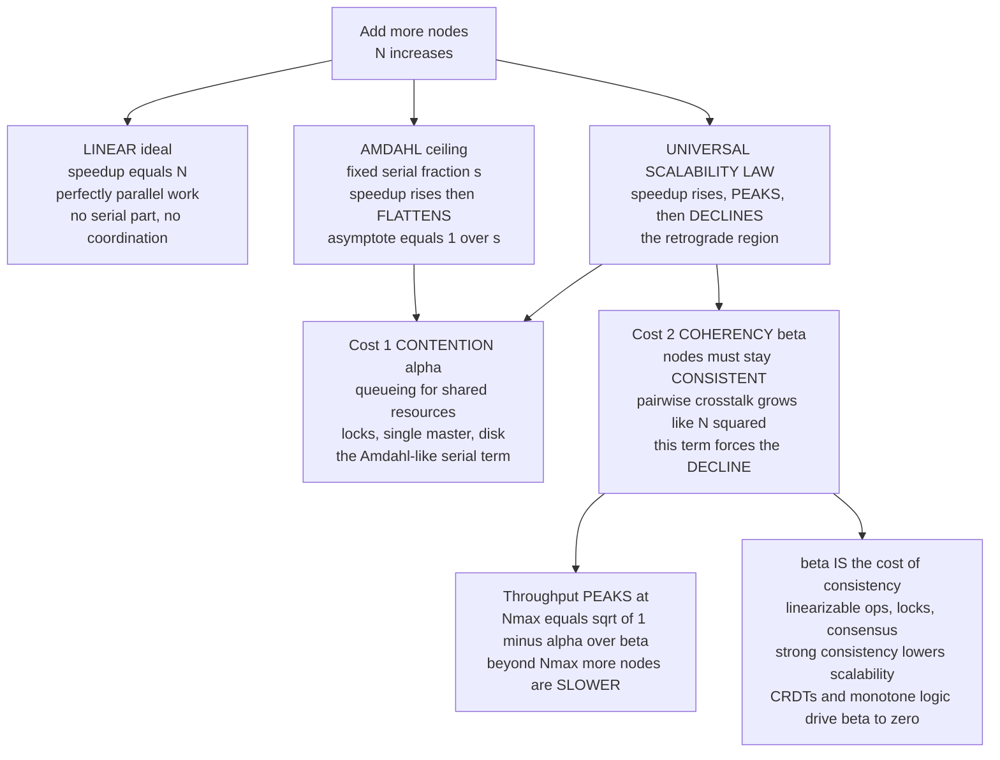

# 📈 Scalability Theory

> [!abstract] TL;DR
> **Scalability theory** is the quantitative study of *how throughput changes as you add nodes* — and its central, uncomfortable finding is that the answer is almost never "linearly." Three laws frame it. **Amdahl's Law** says a fixed workload with an inherently **serial fraction `s`** can never speed up more than **`1/s`**, no matter how many processors you throw at it: even 5% serial caps you at 20×. **Gustafson's Law** is the optimistic rebuttal — if the *problem grows* with the machine (weak scaling), speedup can stay near-linear. And **Gunther's Universal Scalability Law (USL)** adds the term the other two miss: **coherency/coordination cost**, the price of keeping nodes *consistent with each other*, which grows like `N²` (pairwise crosstalk). That `β` term makes the real-world curve **peak** at `Nmax = sqrt((1-α)/β)` and then **decline** — *retrograde scaling*, where adding machines makes the system **slower**. The deep unifying idea: **coordination is the enemy of scale.** Every linearizable read, every lock, every consensus round is coordination that serializes and grows super-linearly — which is exactly *why* strongly-consistent (CP) systems hit a wall that weakly-consistent, monotone, CRDT-based (AP) systems slip past. Scalability theory ties consistency, consensus, and performance into a single predictive framework — and lets you *measure* `α` and `β` from a load test to forecast the node count where "throw more machines at it" stops working.

---

## Intuition

**Analogy:** You are managing a project and it is running late, so you add people. The first few extra workers help a lot. But you quickly notice two things. First, **some work simply cannot be split** — one person has to write the final summary, one has to hold the single master document — and while they do it, everyone else waits. That irreducible serial slice puts a hard ceiling on how fast the project can *ever* finish, even with a thousand people. Second, and worse, **every new person you add has to be brought up to speed and kept in sync with everyone else.** With 3 people that's a quick huddle; with 30, half the day is meetings, and the number of pairwise conversations grows like the *square* of the headcount. Past some point, adding one more worker adds more coordination overhead than useful work — and the project actually finishes **later** than it would have with fewer people.

Distributed systems hit the *exact same wall*. Adding nodes gives **diminishing returns** because of the serial slice, and eventually **negative returns** because the cost of nodes agreeing with one another dominates. Scalability theory is the mathematics that says *precisely where* the speedup curve bends over, and *precisely where* it starts falling — and names the two culprits: **contention** (waiting in line for shared resources) and **coherency** (the cost of staying consistent). This is why "just add more machines" is not a strategy but a gamble whose odds you can actually compute.

---

## How It Works

Scalability theory answers one question: **if I have `N` nodes instead of 1, how much more work per second do I get?** Ideally `N×`. Reality falls short for two structurally different reasons, and the three classic laws each capture a different slice of that shortfall.

### Amdahl's Law — the serial ceiling (strong scaling)

Split a **fixed** workload into a fraction `s` that is inherently **serial** (must run one-at-a-time) and `1 - s` that is perfectly **parallelizable**. With `N` processors, the parallel part shrinks by `N` but the serial part is untouched:

> **Speedup(N) = 1 / ( s + (1 - s)/N )**

As `N → ∞`, the `(1-s)/N` term vanishes and speedup **asymptotes to `1/s`**. This is brutal: with `s = 0.05` (just 5% serial), the ceiling is `1/0.05 = 20×` — you could add ten thousand cores and never beat 20×. Amdahl models **strong scaling**: same problem, more machines. Its message is that *the serial part dominates at scale*, so shaving the serial fraction matters far more than adding hardware.

### Gustafson's Law — grow the problem, not just the machine (weak scaling)

Amdahl assumes a *fixed* problem, but in practice people who buy a bigger cluster **solve a bigger problem** — more data, higher resolution, more users. If the *parallel* work scales up with `N` while the serial work stays roughly constant, the effective speedup becomes:

> **Speedup(N) = N - s·(N - 1)** = s + N·(1 - s)   *(scaled-speedup form)*

which is **near-linear** in `N`. This is **weak scaling**, and it is why "big data" success stories coexist with Amdahl's pessimism: MapReduce over a petabyte on 1000 machines works precisely because the workload grew with the fleet. Gustafson reconciles the two — *"scale the problem, not just the machine."* Neither law, however, models the cost of the nodes **talking to each other**. For that you need the USL.

### The Universal Scalability Law — where the curve *peaks and falls*

Neal Gunther's **USL** is the key result of the field because it adds the term Amdahl and Gustafson both ignore. Relative capacity (throughput normalized to one node) is:

> **C(N) = N / ( 1 + α·(N - 1) + β·N·(N - 1) )**

Two cost terms, physically distinct:

- **`α` — contention.** Serialization and **queueing for shared resources** (a lock, a disk, a single master). This is the Amdahl-like term: it *bends the curve toward a ceiling*. With `β = 0`, USL degenerates into an Amdahl-shaped saturation curve.
- **`β` — coherency (coordination).** The cost for nodes to stay **consistent with each other** — pairwise "let me check my value against yours" crosstalk. Because every pair of `N` nodes may need to reconcile, this cost grows like **`N²`** (hence `N·(N-1)`).

The `β` term is the star of the show. Because it grows faster than the numerator, `C(N)` does not merely flatten — it **rises, reaches a maximum, and then declines.** Setting the derivative to zero gives the throughput-maximizing node count:

> **Nmax = sqrt( (1 - α) / β )**

Beyond `Nmax` you are in the **retrograde region**: each added node makes the whole system **slower**. If `β = 0` there is no peak (Amdahl's flat ceiling); the moment coordination cost is nonzero, a peak exists and scaling *out* eventually backfires. Crucially, USL is not just descriptive — you can **fit it to a load test** (estimate `α, β` from throughput-vs-nodes data) and **predict** the retrograde cliff before you fall off it.

### Why coordination is the scalability killer

Here is the bridge from performance to the rest of distributed-systems theory. The `β`/coherency term is **exactly where consistency bites.** Every **linearizable** operation ([[Linearizability_and_Sequential_Consistency]]), every distributed lock ([[Distributed_Mutual_Exclusion]]), every **consensus round** ([[The_Consensus_Problem]]) is coordination — nodes forced to agree — and coordination *serializes* work and grows *super-linearly* with fleet size. This is the quantitative reason behind the qualitative wisdom of the [[CAP_Theorem_and_PACELC]]: **strong consistency costs scalability.** AP/eventual systems scale better than CP systems not by accident but because they *have a smaller `β`* — they coordinate less. The modern research answer is **coordination avoidance**: the **CALM theorem** (Consistency As Logical Monotonicity, Hellerstein) proves a program can be computed **without coordination if and only if it is monotonic** — adding inputs never retracts a previously-produced output. Monotone logic, commutative operations, and [[CRDTs]] are the practical embodiments: they drive `β` toward zero and scale near-linearly, which is the theoretical basis for why eventually-consistent designs win at planet scale. *"Coordination is the price of non-monotonicity."*

### Little's Law and the queueing side

Scalability also has a latency face. **Little's Law** (`L = λ·W`: concurrency = arrival rate × latency) and basic **queueing theory** explain the other cliff: as utilization approaches 1, latency blows up hyperbolically. In fan-out requests that touch hundreds of nodes, **tail latency amplifies** — the slowest of many parallel calls dominates the response time (Dean & Barroso, *"The Tail at Scale"*). High `α` (contention) and high utilization are the same enemy viewed through throughput vs latency. See [[Latency_vs_Throughput]].

### Diagram: three speedup curves and the two costs



---

## Key Concepts

### Secondary (intuitive level)
- Doubling the machines almost never doubles the work you get done.
- Two reasons: **some work can't be split** (a serial part), and **machines spend time keeping in sync** with each other.
- Past a certain fleet size, adding a machine makes things **slower**, not faster — the coordination overhead wins.
- The fix is often not "more machines" but "less coordination": partition the data, relax consistency, use commutative operations.

### Undergraduate (mechanism level)
- **Amdahl's Law:** `Speedup = 1/(s + (1-s)/N)`, ceiling `1/s`; models **strong scaling** (fixed problem). 5% serial → 20× max.
- **Gustafson's Law:** if the problem grows with `N` (**weak scaling**), speedup stays near-linear — reconciles Amdahl with real big-data results.
- **Universal Scalability Law:** `C(N) = N/(1 + α(N-1) + βN(N-1))`; `α` = **contention** (queueing, Amdahl-like), `β` = **coherency/coordination** (`∝ N²`).
- **Retrograde scaling:** the `β` term makes throughput **peak at `Nmax = sqrt((1-α)/β)`** and then fall.
- **Vertical vs horizontal**, **read vs write**, **stateless (easy) vs stateful (hard)**: stateful/write scaling needs [[Partitioning_and_Sharding]] because that is how you *reduce the number of nodes that must coordinate*.
- **Little's Law:** `L = λW` — concurrency, throughput, and latency are one relationship; near saturation latency explodes.

### Graduate (research level)
- **USL fitting:** linearize via `y = (N/C(N) - 1)/(N-1) = α + βN`, then least-squares (`polyfit`) to recover `α, β` from a load test; predict the retrograde cliff (see the demo).
- **Coordination avoidance & CALM (Hellerstein, Ameloot et al.):** a query has a coordination-free, eventually-consistent distributed implementation **iff it is monotone**. Non-monotone operations (e.g. counting, negation, deletes-before-inserts) provably require coordination. This is the theoretical floor under [[CRDTs]] and [[Eventual_Consistency_and_Anti_Entropy]].
- **RAMP transactions, Bloom/Bloom^L, invariant confluence (I-confluence, Bailis et al.):** characterize exactly which application invariants can be preserved *without* coordination — sharpening "when is strong consistency actually necessary?"
- **The tail at scale (Dean & Barroso):** in fan-out services, `p99` of the fan-out ≈ `p99^k` behavior; hedged requests, tied requests, and micro-partitioning are the mitigations. The latency dual of USL's throughput story.
- **Capacity planning:** measure `α, β` per tier (DB, cache, app), locate `Nmax`, and architect to *lower `β`* — shard to shrink coordination groups, replace consensus with commutativity where correctness allows.

---

## Python Demo

> [!note] This is a **quantitative model of the scalability laws**, not a benchmark of real hardware.
> We (1) plot **Amdahl's Law** for several serial fractions and mark each `1/s` asymptote; (2) plot the **USL** and show it **peaks then declines** (retrograde), unlike Amdahl which only flattens; (3) generate a **synthetic throughput-vs-nodes dataset**, **fit the USL with numpy** to recover the contention `α` and coherency `β`, and **predict `Nmax = sqrt((1-α)/β)`**. numpy for the math and the linear fit, matplotlib to visualize.

```python
"""
MODELING and FITTING the scalability laws.

Part 1: Amdahl's Law -- speedup = 1 / (s + (1 - s)/N). Flat ceiling at 1/s.
Part 2: Universal Scalability Law (USL) -- relative capacity
            C(N) = N / (1 + a*(N-1) + b*N*(N-1))
        a = CONTENTION (queueing / serialization, Amdahl-like)
        b = COHERENCY  (cost to keep N nodes CONSISTENT, grows ~ N^2)
        The b term makes C(N) PEAK then DECLINE (retrograde scaling).
Part 3: fit USL to synthetic throughput data with numpy, recover a, b, and
        predict the optimal node count  Nmax = sqrt((1 - a) / b).

numpy + matplotlib only (no scipy: the USL fit linearizes to a straight line).
"""

import numpy as np
import matplotlib.pyplot as plt

rng = np.random.default_rng(7)          # reproducible synthetic data

# ---------------------------------------------------------------------------
# Part 1: AMDAHL'S LAW -- fixed workload, a serial fraction s caps speedup.
# ---------------------------------------------------------------------------
def amdahl_speedup(N, s):
    """Speedup with N processors when fraction s of the work is serial."""
    return 1.0 / (s + (1.0 - s) / N)

N = np.arange(1, 513)                    # 1 .. 512 processors / nodes
serial_fractions = [0.01, 0.05, 0.10, 0.25]

# ---------------------------------------------------------------------------
# Part 2: UNIVERSAL SCALABILITY LAW -- adds the coherency term b (~ N^2).
# ---------------------------------------------------------------------------
def usl_capacity(N, a, b):
    """Relative throughput vs single node. a = contention, b = coherency."""
    return N / (1.0 + a * (N - 1.0) + b * N * (N - 1.0))

def usl_Nmax(a, b):
    """Node count that MAXIMIZES throughput (derivative of C(N) = 0)."""
    return np.sqrt((1.0 - a) / b)

a_true, b_true = 0.03, 0.0008            # 3% contention, small but deadly coherency
Nmax_true = usl_Nmax(a_true, b_true)
print(f"True USL params:   alpha = {a_true:.4f}   beta = {b_true:.5f}")
print(f"True optimal nodes: Nmax = sqrt((1-a)/b) = {Nmax_true:5.1f} nodes")
print(f"Peak throughput    C(Nmax) = {usl_capacity(Nmax_true, a_true, b_true):5.1f}x "
      f"a single node\n")

# ---------------------------------------------------------------------------
# Part 3: FIT the USL to a synthetic load-test dataset (throughput vs nodes).
#   Linearization (Gunther): let y = (N/C - 1)/(N - 1). Then y = a + b*N,
#   a plain straight line -> recover a (intercept) and b (slope) via polyfit.
# ---------------------------------------------------------------------------
N_data = np.arange(1, 41)                                  # measured 1..40 nodes
C_clean = usl_capacity(N_data, a_true, b_true)             # ground-truth capacity
C_data = C_clean * (1 + rng.normal(0, 0.03, N_data.size))  # +/- 3% measurement noise

mask = N_data > 1                                          # linearization needs N>1
x = N_data[mask]
y = (N_data[mask] / C_data[mask] - 1.0) / (N_data[mask] - 1.0)   # y = a + b*N
b_fit, a_fit = np.polyfit(x, y, 1)                        # slope = b, intercept = a
Nmax_fit = usl_Nmax(a_fit, b_fit)

print("Fitted from noisy data (numpy least squares on the linearized form):")
print(f"  alpha_fit = {a_fit:.4f}   (true {a_true})")
print(f"  beta_fit  = {b_fit:.5f}   (true {b_true})")
print(f"  Nmax_fit  = {Nmax_fit:5.1f} nodes   (true {Nmax_true:.1f})")
print(f"  ==> beyond ~{int(round(Nmax_fit))} nodes, adding machines is RETROGRADE "
      f"(throughput falls).")

# ===========================================================================
# VISUALIZE: Amdahl ceilings | USL peak-and-decline | the fit that predicts Nmax
# ===========================================================================
fig, (ax1, ax2, ax3) = plt.subplots(1, 3, figsize=(18, 5.5))

# --- Panel 1: Amdahl -- rises then FLATTENS at 1/s ---
colors = plt.cm.viridis(np.linspace(0.15, 0.85, len(serial_fractions)))
for s, c in zip(serial_fractions, colors):
    ax1.plot(N, amdahl_speedup(N, s), color=c, lw=2, label=f"s = {s:.0%}")
    ax1.axhline(1.0 / s, color=c, ls=":", lw=1)                # asymptote 1/s
    ax1.text(520, 1.0 / s, f"1/s = {1/s:.0f}x", va="center", fontsize=8, color=c)
ax1.plot(N, N, color="#888888", ls="--", lw=1, label="linear ideal (N x)")
ax1.set_xscale("log"); ax1.set_yscale("log")
ax1.set_xlabel("number of nodes N (log)"); ax1.set_ylabel("speedup (log)")
ax1.set_title("Amdahl's Law: the SERIAL fraction caps speedup at 1/s")
ax1.legend(fontsize=8, loc="upper left"); ax1.grid(True, which="both", alpha=0.25)

# --- Panel 2: USL vs Amdahl vs linear -- the PEAK and DECLINE ---
N2 = np.arange(1, 201)
ax2.plot(N2, N2, color="#888888", ls="--", lw=1.5, label="linear ideal")
ax2.plot(N2, amdahl_speedup(N2, a_true), color="#2980b9", lw=2,
         label=f"Amdahl (s={a_true}) -> flat ceiling")
ax2.plot(N2, usl_capacity(N2, a_true, b_true), color="#c0392b", lw=2.5,
         label="USL -> PEAKS then DECLINES")
ax2.axvline(Nmax_true, color="#c0392b", ls=":", lw=1.5)
ax2.scatter([Nmax_true], [usl_capacity(Nmax_true, a_true, b_true)],
            color="#c0392b", s=90, zorder=5,
            label=f"Nmax = {Nmax_true:.0f} (peak)")
ax2.annotate("retrograde:\nmore nodes = SLOWER",
             xy=(180, usl_capacity(180, a_true, b_true)),
             xytext=(120, usl_capacity(Nmax_true, a_true, b_true) * 0.55),
             arrowprops=dict(arrowstyle="->", color="#c0392b"),
             fontsize=9, color="#c0392b")
ax2.set_xlabel("number of nodes N"); ax2.set_ylabel("relative throughput  C(N)")
ax2.set_title("USL: coherency (beta) forces a PEAK, then RETROGRADE decline")
ax2.legend(fontsize=8, loc="upper left"); ax2.grid(True, alpha=0.25)

# --- Panel 3: the fit -- noisy data + recovered USL curve + predicted Nmax ---
N_fine = np.linspace(1, 40, 400)
ax3.scatter(N_data, C_data, color="#16a085", s=35, zorder=4,
            label="measured throughput (noisy)")
ax3.plot(N_fine, usl_capacity(N_fine, a_fit, b_fit), color="#8e44ad", lw=2.5,
         label=f"fitted USL: a={a_fit:.3f}, b={b_fit:.4f}")
ax3.axvline(Nmax_fit, color="#8e44ad", ls=":", lw=1.5)
ax3.scatter([Nmax_fit], [usl_capacity(Nmax_fit, a_fit, b_fit)],
            color="#8e44ad", s=110, marker="*", zorder=5,
            label=f"predicted Nmax = {Nmax_fit:.1f}")
ax3.set_xlabel("number of nodes N"); ax3.set_ylabel("relative throughput  C(N)")
ax3.set_title("Fit USL to a load test -> PREDICT the optimal node count")
ax3.legend(fontsize=8, loc="lower right"); ax3.grid(True, alpha=0.25)

fig.suptitle("Scalability laws: Amdahl's serial ceiling vs the USL's "
             "coordination-driven PEAK-and-DECLINE",
             fontsize=14, fontweight="bold")
fig.tight_layout()
plt.savefig("scalability_laws.png", dpi=120)
print("\nSaved figure -> scalability_laws.png")
```

**What you observe.** Panel 1 shows Amdahl's cruelty: every serial fraction bends to a **flat ceiling at `1/s`**, and a mere 5% serial caps you at 20× even at 512 nodes. Panel 2 contrasts the three curves on one axis — the linear ideal climbs forever, Amdahl **flattens**, but the USL **rises, peaks at `Nmax`, and then falls** into the retrograde region where adding nodes *reduces* throughput. Panel 3 is the practical payoff: from noisy throughput measurements we recover `α ≈ 0.03` and `β ≈ 0.0008` with a one-line numpy fit and **predict the optimal node count (~35)** — so you know to stop scaling *out* and start scaling *smarter* (shard to shrink `β`, relax consistency) *before* you fall off the cliff.

---

## Real-World Applications

- **Database and cache capacity planning.** Teams at companies running Postgres, MySQL, Cassandra, and Redis fit the **USL to load-test data** to find the node/connection count where throughput peaks. A classic finding: a write-heavy relational primary is dominated by `β` (lock/latch coherency) and goes **retrograde** at a few dozen cores — the cure is [[Partitioning_and_Sharding]], which splits the workload into independent coordination groups so each shard's `β` stays small.
- **Coordination-avoidance systems.** **Amazon Dynamo, Riak, and CRDT stores** (Redis CRDTs, Automerge, Riak DT) exist to keep `β ≈ 0`: commutative, monotone merge functions let replicas accept writes with **no cross-node coordination**, so they scale near-linearly across datacenters. This is [[CRDTs]] and the CALM theorem in production.
- **CP coordination stores hitting the wall.** **etcd, ZooKeeper, and Raft/Paxos clusters** ([[The_Consensus_Problem]]) deliberately have high `β` — every write is a coordination round — which is *why they are kept small* (3, 5, 7 nodes). You never run a 100-node Raft group; the USL says its throughput would be *worse* than a 5-node one. Strong consistency buys correctness by *paying* scalability.
- **Fan-out services and the tail at scale.** Google's search and Bing's index serving fan a query to hundreds of leaf nodes; the `p99` latency of the whole request is dominated by the slowest leaf, so they use **hedged/tied requests** — the queueing-theory (Little's Law) side of scalability rather than the throughput side. See [[Latency_vs_Throughput]].
- **The horizontal-scaling reality check.** Every "we'll just add more servers" plan ([[Horizontal_Scaling]], [[Performance_vs_Scalability]]) is implicitly betting `β` is negligible. Scalability theory is the tool that tells you whether that bet holds — stateless web tiers scale beautifully (`β ≈ 0`); shared stateful stores rarely do.

---

## Common Pitfalls

- **Assuming linear (or even monotonic) scaling.** The default mental model "2× machines = 2× throughput" is wrong twice over: Amdahl says returns *diminish*, and USL says they eventually go *negative*. Always assume a peak exists until a load test proves otherwise.
- **Optimizing the parallel part while ignoring the serial fraction.** Amdahl's cruelest lesson: once the serial slice dominates, speeding up the parallelizable 95% is nearly worthless. Profile for the *serial* bottleneck (a global lock, a single sequencer, a shared counter) first.
- **Confusing contention (`α`) with coherency (`β`).** They demand *opposite* fixes. High `α` (queueing on a shared resource) is cured by *removing the shared resource* or sharding. High `β` (cross-node consistency cost) is cured by *removing coordination* — commutativity, CRDTs, relaxed consistency. Misdiagnosing wastes the fix.
- **Scaling out a strongly-coordinated component.** Adding nodes to a Raft group, a distributed lock, or a linearizable store *increases* `β` and can push you into the retrograde region — you make it **slower**. Consensus clusters should be *small*; scale by partitioning across many independent small clusters, not by growing one.
- **Forgetting Gustafson.** Judging a system by strong-scaling (fixed problem) alone understates it; many workloads scale the *problem* with the fleet (weak scaling) and do fine. Ask which regime you are actually in before quoting Amdahl's ceiling.
- **Reading throughput without watching latency.** A system can look "fine" on throughput right up to saturation, where Little's Law / queueing make latency explode. Near the USL peak, `p99` is often already unacceptable — the useful operating point is *below* `Nmax`.
- **Fitting the USL to too few points or only the rising region.** If your load test never approaches the peak, `β` is poorly constrained and `Nmax` is a wild extrapolation. Push the test until throughput visibly flattens or dips.

---

## Related Concepts

- [[Distributed_Systems_Overview]] — scalability is one of the four forces (with fault tolerance, geography, resource sharing) that make us distribute at all; this note quantifies its limits.
- [[CAP_Theorem_and_PACELC]] — the qualitative "strong consistency costs availability/latency"; scalability theory supplies the *quantitative* mechanism: consistency is coordination is the `β` term.
- [[Consistency_Models_Spectrum]] — moving down the spectrum (linearizable → causal → eventual) is precisely how you *lower `β`* and buy back scalability.
- [[The_Consensus_Problem]] — every consensus round is coordination; consensus clusters are kept small *because* their `β` is high — the USL explains why.
- [[CRDTs]] — commutative, monotone data types drive `β → 0`, the practical face of CALM / coordination avoidance; the reason they scale near-linearly.
- [[Partitioning_and_Sharding]] — the primary weapon against the coordination wall: split the workload so each shard's coordination group (and thus `β`) stays small; how you scale *writes*.
- [[Linearizability_and_Sequential_Consistency]] — the strongest consistency model and therefore the most coordination-expensive; the top of the cost curve.
- [[Quorum_Systems]] — `W + R > N` quorums are tunable coordination; shrinking them trades consistency for scalability and latency.
- [[Horizontal_Scaling]] — the System Design vault's applied "scale out" view; this note is the theory of *when scaling out stops working*.
- [[Performance_vs_Scalability]] — the System Design distinction between "fast for one user" and "stays fast as load grows"; USL formalizes the latter.
- [[Latency_vs_Throughput]] — the queueing/Little's-Law dual of scalability; tail latency amplification in fan-out requests.
- [[Multi_Core_Programming]] — Amdahl's Law at the CPU level: the same serial-fraction ceiling governs multi-core speedup.
- [[Threads_and_Concurrency_Models]] — where Amdahl's Law first bites inside a single machine, before you ever cross a network boundary.

> Vault siblings referenced in prose but not linked (verify/write later): *Distributed_Mutual_Exclusion* (linked above), *Eventual_Consistency_and_Anti_Entropy*, and a future *Coordination_Avoidance_and_CALM* note would deepen the `β`-reduction story.

---

## Review Questions

**Secondary (understanding):**
1. Using the project-team analogy, explain in plain language the *two* different reasons adding more workers stops helping — and which one can make the project finish *later* than with fewer workers. Which real distributed-systems cost does each reason correspond to?

**Undergraduate (application):**
2. A batch job is 8% inherently serial. Using Amdahl's Law, what is the *maximum* speedup no matter how many machines you add, and roughly how many machines gets you to half of that ceiling? Why does buying a 1000-node cluster for this job waste money?
3. In the Python demo, the USL is fit by transforming the data to `y = (N/C - 1)/(N - 1)` and doing a linear fit. Explain why that transformation turns the USL into a straight line, and what the slope and intercept of that line physically represent.

**Graduate (analysis / trade-offs):**
4. Two datastores are load-tested. Store A peaks at 40 nodes then declines; store B keeps climbing to 500 nodes. In USL terms, what does this say about each store's `α` and `β`, and what architectural property (consistency model, coordination style) most plausibly explains the difference? Connect your answer to the CALM theorem.
5. You run a 5-node Raft cluster for cluster metadata and it is becoming a throughput bottleneck. A colleague proposes growing it to 15 nodes "for more capacity." Using the USL and the meaning of `β` for consensus, explain why this is likely to make throughput *worse*, and describe the correct way to scale the metadata layer instead.

---

## Sources

- Gunther, N. J. (2007). *Guerrilla Capacity Planning: A Tactical Approach to Planning for Highly Scalable Applications and Services.* Springer. (The Universal Scalability Law.) [perfdynamics.com](http://www.perfdynamics.com/Manifesto/USLscalability.html)
- Amdahl, G. M. (1967). *Validity of the Single Processor Approach to Achieving Large-Scale Computing Capabilities.* AFIPS Spring Joint Computer Conference. [DOI](https://doi.org/10.1145/1465482.1465560)
- Gustafson, J. L. (1988). *Reevaluating Amdahl's Law.* Communications of the ACM, 31(5), 532–533. [DOI](https://doi.org/10.1145/42411.42415)
- Hellerstein, J. M., & Alvaro, P. (2020). *Keeping CALM: When Distributed Consistency is Easy.* Communications of the ACM, 63(9). [arXiv:1901.01930](https://arxiv.org/abs/1901.01930)
- Bailis, P., Fekete, A., Franklin, M., Ghodsi, A., Hellerstein, J., & Stoica, I. (2014). *Coordination Avoidance in Database Systems.* VLDB. [arXiv:1402.2237](https://arxiv.org/abs/1402.2237)
- Dean, J., & Barroso, L. A. (2013). *The Tail at Scale.* Communications of the ACM, 56(2), 74–80. [DOI](https://doi.org/10.1145/2408776.2408794)

---

#distributed-systems #scalability #amdahls-law #universal-scalability-law #coordination-cost
