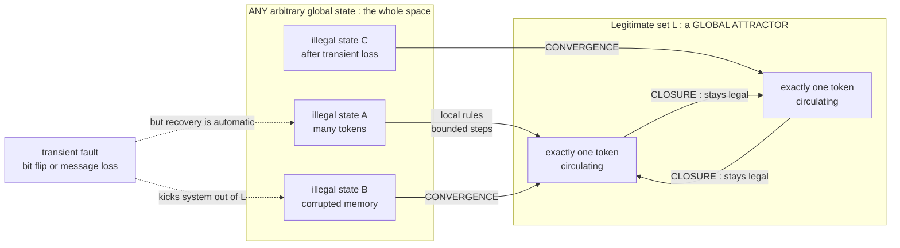

# 🩹 Self-Stabilization

> [!abstract] TL;DR
> A distributed system is **self-stabilizing** if, started from *any* arbitrary global state — however corrupted by transient faults — it is guaranteed to reach a **legitimate** state in a **finite** number of steps (**convergence**) and, once legitimate, **stays** legitimate (**closure**). This is the strongest form of fault tolerance for *non-permanent* faults: you never enumerate or detect specific failures, you simply prove the legitimate-state set is a **global attractor** that local rules drive the system into and hold it in — automatically, with no reset button and no human in the loop. Dijkstra introduced it in a terse 1974 paper that Leslie Lamport later called his most brilliant work; today its DNA lives in Internet routing recovery and in the reconciliation loops that heal Kubernetes clusters.

---

## Intuition

**Analogy — the self-righting toy.** Picture one of those weighted "roly-poly" tumbler dolls. Shove it, tip it over, spin it, knock it flat on its side in any direction you like — and no matter *how* you disturbed it, it wobbles for a moment and then rights itself back to standing. You did not have to catalogue the *kinds* of shoves it must survive, install a "detect-that-I-was-pushed-from-the-left" sensor, or press a reset switch. The doll's shape *guarantees* that "upright" is the only resting position and that it is reached from *every* tilt. Correctness is not defended fault-by-fault; it is a property of the geometry.

Self-stabilization is exactly that idea for a distributed system. Imagine memory that gets silently corrupted by a cosmic-ray bit flip, a routing table left inconsistent after a burst of lost messages, or a cluster shoved into a nonsensical configuration by *some* transient glitch you will never fully anticipate. A self-stabilizing protocol does not try to *catch* the specific fault. Instead, each node runs a few simple **local rules**, and those rules are engineered so that from *any* global state — including states no correct execution would ever produce — the whole system slides back into correct behavior within a bounded time, and then holds there. You do not handle failures; you guarantee **eventual convergence to correctness from anywhere**. That is the deepest promise in fault tolerance: recovery from *arbitrary transient corruption*, by design.

---

## How It Works

### The definition, precisely

Fix a set of **legitimate** global states `L` — the states an ideal, fault-free execution is allowed to be in (for a token ring: "exactly one token exists"). A protocol is **self-stabilizing with respect to `L`** if it has two properties:

1. **Convergence.** Starting from *any* global state whatsoever — even an illegal one produced by an arbitrary transient fault — every fair execution reaches a state in `L` after a **finite** number of steps. There is no assumption about *how* the system got into the bad state; the entire (possibly astronomically large) space of illegal states is in scope.
2. **Closure.** Once the system is in `L`, every step keeps it in `L`. Legitimate states map only to legitimate states under the algorithm.

Together, convergence + closure make `L` a **global attractor**: no matter where you drop the system in state space, the dynamics pull it into `L` and trap it there. The number of steps (or asynchronous *rounds*) needed to converge from the worst-case start is the **stabilization time** — the key performance metric of a stabilizing algorithm.

### What kind of faults this beats — and what it does not

Self-stabilization tolerates **arbitrary transient faults**: any perturbation that corrupts *state* but then *stops*. Memory corruption, a flurry of dropped or duplicated messages, a node rebooting into garbage, an operator fat-fingering a value — all are just "start me from some arbitrary state," which convergence already covers. Crucially, you do **not** need a fault detector, a failure taxonomy, or a specific recovery routine per fault type; the single guarantee "converge from anywhere" subsumes them all. This is the sense in which it is the *ultimate* fault tolerance for non-permanent faults, and it stands in sharp contrast to **masking** fault tolerance (see [[Failure_Models]]): replication with quorums masks a *bounded number* of *concurrent* faults (`2f+1` for crashes, `3f+1` for Byzantine) and needs you to know `f` in advance, whereas self-stabilization survives *any* amount of transient corruption but only if the faults eventually *stop* long enough for it to converge.

The assumptions and limits are real and worth stating plainly:

- **The code and topology must stay intact.** Self-stabilization corrects *data* state; it assumes the *program* (the local rules) and the network structure are not themselves permanently corrupted. If the rules are gone, nothing can drive convergence.
- **Faults must eventually cease.** You need a **fault-free window** long enough to converge. A relentless stream of new corruptions can keep the system perpetually out of `L` — stabilization guarantees recovery *once the shoving stops*.
- **Some asymmetry or generous state is usually required.** Dijkstra's ring needs a **distinguished** machine to break symmetry (a fully symmetric anonymous ring often *cannot* self-stabilize deterministically), and the classic algorithm needs a state space at least as large as the ring.
- **Plain self-stabilization does not handle ongoing Byzantine behavior.** A permanently malicious node is not a transient fault. Combining the two — **Byzantine-tolerant self-stabilization** — is possible but strictly harder (see [[Byzantine_Agreement_and_PBFT]]).

### Dijkstra's K-state token ring (1974)

The seminal example — from *"Self-stabilizing Systems in Spite of Distributed Control"* (Dijkstra, 1974) — is a ring of `N` machines numbered `0..N-1`. Machine `0` is **distinguished**. Each machine `i` holds a state `x[i]` drawn from `{0, 1, ..., K-1}` with `K >= N`. A machine is said to hold the **privilege** (a **token**) according to purely *local* rules that compare it only to its left neighbor:

- Machine `0` is privileged **iff** `x[0] == x[N-1]` (it compares itself to the top of the ring).
- Machine `i > 0` is privileged **iff** `x[i] != x[i-1]` (it compares itself to its left neighbor).

A **central daemon** picks any one privileged machine at a time to *move*:

- Machine `0` moves by `x[0] = (x[0] + 1) mod K`.
- Machine `i > 0` moves by `x[i] = x[i-1]` (copy the left neighbor).

The **legitimate** set `L` is "exactly one machine is privileged." Dijkstra proved that from *any* starting assignment — with *many* tokens scattered around the ring — the system converges to exactly one token, which thereafter simply **circulates** forever (each move hands the privilege to the next machine). A single local comparison per node produces *global* self-correction. A beautiful invariant makes the magic tangible: the number of tokens is **always odd** (and therefore always at least one), so an illegal state has 3, 5, 7, ... tokens, and stabilization is the process of driving that odd count down to 1. The Python demo below implements exactly this and shows hundreds of random illegal starts all converging.

### Convergence and closure as a global attractor



The dashed fault arrow is the whole point: a transient fault can eject the system to *any* illegal state, and the solid convergence arrows guarantee it is pulled back into `L` regardless — no detection, no intervention.

### The dynamical-systems view

Reframing correctness as convergence to an attractor is not just a metaphor — it is the same mathematics as **Lyapunov stability** in control theory. A standard proof technique for self-stabilization is to exhibit a **variant (potential) function** `V(state)` that is bounded below, is minimized exactly on `L`, and *strictly decreases* on every non-`L` move — the discrete analogue of a Lyapunov function whose descent proves the system flows into its equilibrium set. For Dijkstra's ring, the token count (or a related potential) plays that role. Viewed this way, a self-stabilizing distributed system *is* a dynamical system whose legitimate states form a **globally attracting invariant set**, and the connection to feedback control and attractors is exact (see [[Dynamical_Systems_and_Attractors]], [[Cybernetics_and_Control]], and [[Feedback_Loops_and_Causality]]).

---

## Key Concepts

### Secondary (plain language)
- **Self-stabilizing = self-healing.** Mess the system up any way you like; if the mess-ups stop, it fixes *itself* back to correct behavior. No reset, no admin.
- **Two promises:** it *gets* to a good state from anywhere (convergence), and once good it *stays* good (closure).
- **Local rules, global order.** Each part follows a tiny rule looking only at its neighbor, yet the *whole* system ends up correct — like the roly-poly toy whose shape guarantees it rights itself.
- You do not list the specific breakages to survive; surviving *all* transient breakage is the single guarantee.

### Undergraduate (CS background)
- **Formal definition:** convergence (any state reaches legitimate set `L` in finite steps) + closure (`L` is closed under the transition relation). Together `L` is an **attractor**.
- **Dijkstra's K-state ring:** distinguished machine `0`; privilege of `0` iff `x[0] == x[N-1]`, of `i>0` iff `x[i] != x[i-1]`; moves increment-mod-K or copy-left; legitimate = one privilege; requires `K >= N`.
- **Token-parity invariant:** the number of privileges is always odd, hence always `>= 1`; stabilization drives it to exactly 1.
- **Stabilization time** (rounds/moves to converge from the worst case) is the headline complexity metric.
- **Transient vs permanent faults:** self-stabilization handles arbitrary *transient* corruption assuming faults eventually stop and the *program* stays intact — it does not, alone, handle permanent Byzantine nodes.

### Graduate (system-level)
- **Variant/potential-function proofs** = discrete **Lyapunov** arguments; strict descent off `L` plus a lower bound gives convergence. This ties self-stabilization to Lyapunov stability and to feedback control.
- **Impossibility and symmetry:** deterministic self-stabilization on a *fully symmetric anonymous* ring is impossible; you need asymmetry (a distinguished node) or randomization — and typically a state space `>= N`.
- **Composition theory:** stabilizing layers compose. **Fair composition** (Katz–Perry) lets a stabilizing high-level protocol run atop a stabilizing low-level one; **Arora–Gouda** formalized "closure + convergence" as the general foundation and introduced **superstabilization** (bounded disruption under a single topology change).
- **The stabilization–masking spectrum:** masking tolerance (quorum replication, `2f+1` / `3f+1`) hides a *bounded* number of *concurrent* faults with no visible glitch; self-stabilization tolerates *unbounded transient* corruption but permits a *temporary* incorrect window while converging. **Fault-containing** and **time-adaptive** stabilization bound recovery time by the *number* of faults, not the state-space size.
- **Extensions:** *probabilistic*, *silent*, *snap*, and *Byzantine-tolerant* self-stabilization; *self-stabilizing* spanning trees, leader election, mutual exclusion, clock synchronization, and graph coloring are the canonical building blocks.

---

## Python Demo

Pure standard library for the simulation; `matplotlib` for the visualization (no numpy required). The program implements **Dijkstra's 1974 K-state self-stabilizing token ring** end to end: it (1) confirms the *token count is always odd* invariant over thousands of random states; (2) starts from **hundreds of random illegal configurations** (many tokens) and shows *every one* converges to **exactly one circulating token** and *stays* there (convergence + closure); and (3) visualizes the ring state over time collapsing from chaos to a single winding token, the token count decaying to 1 across many runs, and the distribution of stabilization times.

```python
"""
Dijkstra's self-stabilizing token ring -- the classic 1974 K-state algorithm.

N machines sit on a directed ring, indexed 0..N-1. Machine 0 is DISTINGUISHED
(the "bottom" machine); that asymmetry is what makes stabilization possible.
Each machine i holds a state x[i] in {0, ..., K-1}, with K >= N.

PRIVILEGE (a "token") -- purely LOCAL rules; a machine sees only its left neighbour:
    machine 0   is privileged  iff  x[0] == x[N-1]     (compare to the top)
    machine i>0 is privileged  iff  x[i] != x[i-1]     (compare to left neighbour)

MOVE (only a privileged machine may act; a central daemon picks ONE at a time):
    machine 0 :   x[0] = (x[0] + 1) mod K
    machine i>0:  x[i] = x[i-1]                         (copy the left neighbour)

LEGITIMATE state = EXACTLY ONE privilege exists. Dijkstra proved that from ANY
arbitrary (corrupted) start the system reaches a legitimate state in a bounded
number of moves (CONVERGENCE) and thereafter always has exactly one token that
simply circulates (CLOSURE).

Invariant that falls out of the definition: the number of tokens is ALWAYS ODD
(>= 1). So an illegal state has 3, 5, 7, ... tokens -- never zero -- and
stabilization drives that odd count down to 1.
"""

import random
import statistics
import matplotlib.pyplot as plt


def privileges(x, K):
    """Indices of machines currently holding a token, using only local rules."""
    N = len(x)
    p = []
    if x[0] == x[N - 1]:            # distinguished machine compares to the top
        p.append(0)
    for i in range(1, N):          # ordinary machine compares to its left neighbour
        if x[i] != x[i - 1]:
            p.append(i)
    return p


def move(x, K, chosen):
    """Apply the local rule of the chosen privileged machine (pure: returns a new list)."""
    x = list(x)
    if chosen == 0:
        x[0] = (x[0] + 1) % K
    else:
        x[chosen] = x[chosen - 1]
    return x


def stabilize(x, K, rng, tail=None, max_steps=100000):
    """
    Run the central-daemon schedule until the ring is legitimate (one token),
    then keep running `tail` extra moves to witness CLOSURE (it stays legitimate).
    Returns (state_history, token_history, steps_to_converge).
    """
    N = len(x)
    tail = tail if tail is not None else 2 * N
    x = list(x)
    state_hist = [list(x)]
    token_hist = [len(privileges(x, K))]
    converged_at = None
    for step in range(max_steps):
        p = privileges(x, K)
        if len(p) == 1 and converged_at is None:
            converged_at = step
        x = move(x, K, rng.choice(p))          # fair arbitrary pick = central daemon
        state_hist.append(list(x))
        token_hist.append(len(privileges(x, K)))
        if converged_at is not None and step - converged_at >= tail:
            break
    return state_hist, token_hist, converged_at


def random_illegal_state(N, K, rng):
    """Draw a uniformly random ring state that is ILLEGITIMATE (more than one token)."""
    while True:
        x = [rng.randrange(K) for _ in range(N)]
        if len(privileges(x, K)) > 1:
            return x


# ---------------------------------------------------------------------------
# 0. The parity invariant: token count is always ODD, never zero
# ---------------------------------------------------------------------------
def check_invariant(N, K, rng, trials=20000):
    counts = [len(privileges([rng.randrange(K) for _ in range(N)], K))
              for _ in range(trials)]
    assert all(c % 2 == 1 and c >= 1 for c in counts), "token count must be odd and >= 1!"
    print(f"[invariant] {trials} random states: token count is ALWAYS odd and >= 1 "
          f"(observed counts {sorted(set(counts))})")


# ---------------------------------------------------------------------------
# main
# ---------------------------------------------------------------------------
if __name__ == "__main__":
    N, K = 7, 7                      # K >= N is Dijkstra's requirement
    rng = random.Random(42)

    check_invariant(N, K, rng)

    # 1. MANY random illegal starts all converge to exactly ONE token (and stay there)
    starts = 400
    convergence_steps = []
    for _ in range(starts):
        x0 = random_illegal_state(N, K, rng)
        _, token_hist, converged_at = stabilize(x0, K, rng)
        assert converged_at is not None, "failed to converge!"
        # CLOSURE: every state at or after convergence has exactly one token
        assert all(t == 1 for t in token_hist[converged_at:]), "closure violated!"
        convergence_steps.append(converged_at)
    print(f"[convergence] all {starts} random ILLEGAL starts converged to ONE token, "
          f"then stayed legitimate (closure holds)")
    print(f"[convergence] moves to converge:  min={min(convergence_steps)}  "
          f"median={int(statistics.median(convergence_steps))}  "
          f"max={max(convergence_steps)}")

    # 2. One representative run to visualize
    x0 = random_illegal_state(N, K, rng)
    print(f"[demo run]    illegal start {x0} holds {len(privileges(x0, K))} tokens")
    state_hist, token_hist, converged_at = stabilize(x0, K, rng, tail=2 * N)
    print(f"[demo run]    converged to a single circulating token after "
          f"{converged_at} moves")

    # 3. A handful of token-count trajectories for the overlay plot
    trajectories = []
    for _ in range(12):
        xr = random_illegal_state(N, K, rng)
        _, th, _ = stabilize(xr, K, rng, tail=0)
        trajectories.append(th)

    # -----------------------------------------------------------------------
    # Visualization
    # -----------------------------------------------------------------------
    fig, (axA, axB, axC) = plt.subplots(1, 3, figsize=(17, 5))

    # (A) heatmap: ring state over time, with token positions overlaid
    axA.imshow(state_hist, aspect="auto", cmap="viridis",
               interpolation="nearest", origin="upper")
    for t, row in enumerate(state_hist):
        for m in privileges(row, K):
            axA.scatter(m, t, s=30, marker="s",
                        facecolors="none", edgecolors="red", linewidths=1.3)
    axA.axhline(converged_at - 0.5, color="white", ls="--", lw=1.5)
    axA.text(0.1, converged_at - 0.9, "legitimate below: one token circulating",
             color="white", fontsize=8)
    axA.set_xlabel("machine index (0 = distinguished)")
    axA.set_ylabel("move number (time)")
    axA.set_title("Ring state over time\nred squares = tokens; chaos -> one circulating token")

    # (B) token count decaying to 1 for many runs
    for th in trajectories:
        axB.plot(range(len(th)), th, alpha=0.6)
    axB.axhline(1, color="black", ls="--", lw=1.5)
    axB.text(1, 1.2, "legitimate: exactly ONE token", fontsize=9)
    axB.set_xlabel("move number")
    axB.set_ylabel("number of tokens (privileges)")
    axB.set_title("Convergence: odd token count driven down to 1\n(and it stays there = closure)")
    axB.set_ylim(0, max(max(th) for th in trajectories) + 1)

    # (C) distribution of stabilization time over many random illegal starts
    axC.hist(convergence_steps, bins=range(0, max(convergence_steps) + 2),
             color="#4c72b0", edgecolor="white")
    axC.axvline(statistics.mean(convergence_steps), color="red", ls="--",
                label=f"mean = {statistics.mean(convergence_steps):.1f} moves")
    axC.set_xlabel("moves to converge (stabilization time)")
    axC.set_ylabel("number of runs")
    axC.set_title(f"Bounded stabilization time\n{starts} random illegal starts, N={N}, K={K}")
    axC.legend()

    fig.tight_layout()
    fig.savefig("self_stabilization.png", dpi=120)
    print("\nSaved figure -> self_stabilization.png")
    plt.show()
```

Expected console output: the invariant check reports that the token count is **always odd** across 20,000 random states; **all 400** random *illegal* starts converge to a single token and then stay legitimate (closure never violated); and the stabilization time is small and bounded (a handful to a few dozen moves for `N = 7`). The figure's left panel shows a representative run where many red token-squares scattered across the ring collapse, below the dashed line, into a *single* token that winds diagonally — the privilege circulating in the legitimate regime. The middle panel shows a dozen token-count trajectories all decaying to 1 and flat-lining there; the right panel shows the distribution of stabilization times, all finite and clustered — the empirical face of "converge from anywhere in bounded steps."

---

## Real-World Applications

> **Example — Kubernetes reconciliation loops (self-stabilization in production).** A Kubernetes controller is a textbook applied self-stabilizing system. Each controller runs a tireless *reconcile* loop: it reads the **desired state** (your Deployment spec: "5 replicas of this Pod") and the **actual state** (what is really running), computes the difference, and issues local corrective actions to shrink it — creating a Pod if one crashed, deleting a surplus one, restarting an unhealthy one. Corrupt the cluster *any* transient way — a node dies, a Pod is manually deleted, the API server hiccups — and the loop drives actual state back toward desired state without anyone detecting the *specific* fault. That is precisely convergence-to-a-legitimate-set + closure. The "declare the goal, let the controller converge from any state" pattern that underpins GitOps and infrastructure-as-code is self-stabilization by another name (see [[Kubernetes_Core_Concepts]]).

Other production uses:
- **Internet routing recovery.** Link-state and distance-vector protocols must recover from *any* transient inconsistency — stale routes, dropped updates, a router rebooting with garbage tables. Well-designed routing eventually reconverges to correct forwarding from any perturbed state; **Ethernet's Spanning Tree Protocol (STP)** likewise re-forms a single loop-free tree after arbitrary topology or state disturbance (see [[Routing_Protocols]]).
- **Fault-tolerant hardware and spacecraft.** Long-running systems exposed to single-event upsets (cosmic-ray bit flips) use self-stabilizing logic and periodic scrubbing so a corrupted register does not permanently derail the machine; the state heals itself.
- **Wireless sensor and ad-hoc networks.** Nodes fail, reboot, and lose messages constantly; self-stabilizing spanning-tree, clock-synchronization, and topology-maintenance protocols keep the network converging to a usable structure with no central coordinator.
- **Distributed clock synchronization and leader election.** Self-stabilizing variants re-establish a synchronized clock or a single leader from any inconsistent start — the robust cousins of the classic protocols in [[Leader_Election]].
- **Anti-entropy / gossip reconciliation.** Continuously exchanging and merging state so replicas converge from *any* divergence is a self-stabilizing pattern for data (see [[Eventual_Consistency_and_Anti_Entropy]]).

---

## Common Pitfalls

- **Assuming faults stop long enough to converge.** Self-stabilization guarantees recovery only given a **fault-free window**. Under a relentless stream of fresh corruptions the system can be perpetually out of `L`. Measure your worst-case stabilization time against how often faults actually hit — recovery is not instantaneous.
- **Forgetting the temporary-incorrectness window.** Unlike *masking* fault tolerance, a self-stabilizing system may be *visibly wrong while converging*. If your application cannot tolerate any incorrect interval, plain stabilization is not enough — you need masking, or *fault-containing* / *snap*-stabilizing variants that bound or eliminate the glitch.
- **Symmetry that makes stabilization impossible.** Trying to self-stabilize a fully symmetric *anonymous* ring deterministically cannot work — every node behaves identically, so nothing breaks ties. You need a **distinguished node**, unique IDs, or randomization. Dijkstra's algorithm depends critically on machine `0` being special.
- **Choosing too few states.** Dijkstra's K-state ring requires `K >= N`. Shrink the state space below the ring size and the convergence proof collapses — you can get stuck cycling among illegal configurations.
- **Believing it handles Byzantine faults for free.** Self-stabilization tolerates arbitrary *transient* faults, not a *permanently* malicious node that keeps injecting bad state. That regime needs the harder *Byzantine-tolerant self-stabilization*, not the vanilla algorithm.
- **Assuming the code and topology are also self-healing.** Stabilization corrects *data* state under the assumption that the program (local rules) and network structure survive. If the rules themselves are corrupted, there is nothing left to drive convergence.
- **Non-terminating executions and unfair schedulers.** Convergence proofs assume a **fair** daemon that does not starve privileged machines forever. An adversarial or unfair scheduler can, in some formulations, delay convergence indefinitely; specify and rely on the fairness model your proof needs.

---

## Related Concepts

Verified in-vault links:

- [[Failure_Models]] — the fault taxonomy self-stabilization sits against: masking tolerance handles a *bounded* number of *concurrent* crash/Byzantine faults (`2f+1`, `3f+1`), whereas self-stabilization handles *unbounded transient* corruption assuming faults eventually stop.
- [[Distributed_Systems_Overview]] — the big picture in which self-stabilization is the strongest autonomous-recovery guarantee for non-permanent faults.
- [[Leader_Election]] — has self-stabilizing variants that re-establish a single leader from any inconsistent global state, mirroring the single-token guarantee of Dijkstra's ring.
- [[Byzantine_Agreement_and_PBFT]] — the permanent-malice regime; combining it with stabilization (Byzantine-tolerant self-stabilization) is strictly harder than either alone.
- [[Distributed_Snapshots]] — Chandy–Lamport global-state recording is how you *observe* whether a running system is in a legitimate set, the observational complement to stabilizing *into* one.
- [[Eventual_Consistency_and_Anti_Entropy]] — anti-entropy/gossip is a data-level convergence-from-any-divergence pattern, kin to state-level self-stabilization.
- [[CRDTs]] — convergence guaranteed by *algebra* (monotone lattice merges) rather than by a distinguished node driving down a potential; a different route to "converge from anywhere."
- [[Dynamical_Systems_and_Attractors]] — the legitimate set is a *global attractor*; self-stabilization is distributed correctness reframed as convergence to an attracting invariant set.
- [[Cybernetics_and_Control]] — the Lyapunov / feedback-control lens: a variant function that strictly decreases off the legitimate set is a discrete Lyapunov function.
- [[Feedback_Loops_and_Causality]] — the corrective feedback loop (compare, act, repeat) that both Dijkstra's rules and Kubernetes controllers embody.
- [[Kubernetes_Core_Concepts]] — the reconciliation controller: applied self-stabilization driving actual state toward desired state.
- [[Routing_Protocols]] — Internet routing and STP must reconverge to correct forwarding from any transient inconsistency.

> Sibling notes in this `Distributed_Systems_Theory` vault referenced in prose — `System_and_Timing_Models`, `Failure_Detectors` — are wikilinked where they already exist and referenced by name otherwise.

---

## Review Questions

1. **(Secondary)** Using the self-righting-toy analogy, explain in plain terms what it means for a system to be "self-stabilizing," and why that is different from having a big red RESET button that a human presses when something breaks. What are the *two* promises (properties) a self-stabilizing system makes?
2. **(Undergraduate)** In Dijkstra's K-state ring, machine `0` is privileged when `x[0] == x[N-1]` and machine `i > 0` is privileged when `x[i] != x[i-1]`. (a) Show, by counting "differences" around the cycle, why the total number of tokens must always be **odd** (hence at least one). (b) Trace a small ring, e.g. `N = 3, K = 3` starting from `x = [0, 1, 0]`, through moves until it reaches a single circulating token, and explain how each move either moves or removes a token.
3. **(Graduate)** (a) Explain how a **variant (potential) function** is used to *prove* convergence, and why this is the discrete analogue of a **Lyapunov** argument — what three properties must the function have? (b) Contrast **self-stabilization** with **masking** fault tolerance (quorum replication) along three axes: the *kind* and *number* of faults tolerated, whether a *fault-free window* is required, and whether a *temporarily incorrect* window is exposed. (c) Argue why a Kubernetes controller's reconcile loop qualifies as applied self-stabilization, and identify one realistic scenario where its assumptions (faults eventually stop; program and topology intact) are violated.

---

## Sources

- Dijkstra, E. W. (1974). *Self-stabilizing Systems in Spite of Distributed Control.* Communications of the ACM, 17(11), 643–644. [EWD426 PDF](https://www.cs.utexas.edu/users/EWD/ewd04xx/EWD426.PDF)
- Dijkstra, E. W. (1986). *A Belated Proof of Self-Stabilization.* Distributed Computing, 1(1), 5–6. [Springer](https://link.springer.com/article/10.1007/BF01843566)
- Dolev, S. (2000). *Self-Stabilization.* MIT Press. [Book page](https://mitpress.mit.edu/9780262041782/self-stabilization/)
- Schneider, M. (1993). *Self-Stabilization.* ACM Computing Surveys, 25(1), 45–67. [ACM DL](https://dl.acm.org/doi/10.1145/151254.151256)
- Arora, A., Gouda, M. (1993). *Closure and Convergence: A Foundation of Fault-Tolerant Computing.* IEEE Transactions on Software Engineering, 19(11), 1015–1027. [IEEE Xplore](https://ieeexplore.ieee.org/document/256698)

---

#distributed-systems #self-stabilization #dijkstra #fault-tolerance #convergence
