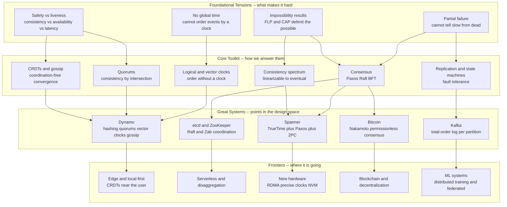

# 🌐 The Reach and Future of Distributed Systems

> [!abstract] TL;DR
> This is the **capstone** of the vault: a step back to see that the whole field grows from **a handful of deep tensions** — *no global time*, *partial failure* (you cannot tell slow from dead), and the *impossibility results* (**FLP**: no deterministic async consensus; **CAP**: consistency vs availability under a partition) — met by **a compact, interlocking toolkit** — *logical and vector clocks* (order without a clock), *consensus* (Paxos, Raft, BFT), *quorums* (consistency by intersection), *replication and state-machine replication* (fault tolerance), the *consistency spectrum* (linearizable → causal → eventual), and *CRDTs and gossip* (coordination-free convergence). Real systems are just **specific points in that design space** — Spanner, Dynamo, Kafka, etcd, Bitcoin — and the frontiers (edge/local-first, serverless, new hardware, blockchains, ML systems) recompose the *same* pieces under new constraints. The durable skill is not memorizing any one system; it is understanding the **tradeoffs and their proven limits**, because those outlive every framework.

---

## Intuition

**Analogy:** Almost everything you touch today is secretly a distributed system wearing a simple mask. Open a web page, tap "pay," let your phone sync a photo, stream a show, run a search, send crypto — behind each single tap sit **hundreds of unreliable machines in different buildings**, quietly voting, retrying, replicating, and reconciling so that *you* experience **one reliable thing**. It is a bit like watching a swan glide across a lake: serene on the surface, furiously paddling underneath. The entire discipline is the ongoing **engineering miracle of making many flaky computers behave, most of the time, like one dependable computer** — and never revealing the frantic paddling.

Zoom out from the individual algorithms in this vault and a shape appears. There are only a *few* brute facts about a world of separate machines, no shared clock, and a lossy network. Those few facts generate **every** theorem, every famous outage, and every clever protocol you have studied. This note connects the dots: how the tensions produce the tools, how the tools compose into the great systems, and where the field is paddling next.

---

## How It Works

The vault told a single story in six movements. **Foundations and models** ([[Distributed_Systems_Overview]], [[System_and_Timing_Models]], [[Failure_Models]]) named the world: independent nodes, message passing only, partial failure, no shared time. **Communication and global state** built the primitives to *reason* about that world — [[Logical_Clocks_and_Happens_Before]] and [[Vector_Clocks_and_Causality]] to order events, [[Distributed_Snapshots]] to photograph a moving system. **Consensus and agreement** hit the theoretical core: [[The_Consensus_Problem]], the [[FLP_Impossibility_Result]], and the practical escapes ([[Paxos]], [[Raft_Consensus]], [[Byzantine_Agreement_and_PBFT]]). **Consistency and replication** turned agreement into usable guarantees ([[CAP_Theorem_and_PACELC]], [[Consistency_Models_Spectrum]], [[Replication_Models]], [[CRDTs]]). **Distributed data** placed and moved bytes at scale ([[Consistent_Hashing]], [[Quorum_Systems]], [[Distributed_Transactions]]). This section — **advanced topics and frontiers** — asks what it all *adds up to*.

### The recurring tensions — the whole field on one hand

Three tensions, once you see them, explain nearly everything:

1. **No global time.** No node reads a shared clock, so "which happened first?" often has *no physical answer*. The response is to abandon wall-clock ordering for **causal** ordering — the happens-before relation captured by [[Logical_Clocks_and_Happens_Before|logical]] and [[Vector_Clocks_and_Causality|vector clocks]]. Order is *reconstructed*, not read off a wall.
2. **Partial failure, and the ambiguity of silence.** Some nodes die while others run on, and a live node **cannot distinguish a crashed peer from a slow one from a cut link**. This single ambiguity — not failure itself — is what makes the algorithms hard. It forces **failure detectors** ([[Failure_Detectors]]), timeouts as heuristics, and the humbling truth that every timeout is a *guess*.
3. **The impossibility results that delimit the achievable.** [[FLP_Impossibility_Result|FLP]] proves that in a purely asynchronous model, *no* deterministic protocol guarantees consensus if even one process may crash — you cannot have both **safety** and **liveness** under an adversarial scheduler. [[CAP_Theorem_and_PACELC|CAP]] proves that under a network partition you must sacrifice either **consistency** or **availability**. These are not engineering shortcomings; they are *laws*. Their gift is negative knowledge: they tell you which dreams to stop chasing.

Underneath all three runs the eternal pair of tradeoffs — **safety vs liveness** ("nothing bad happens" vs "something good eventually happens") and **consistency vs availability vs latency**. Every design decision in the vault is a point chosen on those axes.

### The core toolkit — how the tools answer the tensions

The beauty of the field is that a *small* set of ideas answers those tensions, and they **compose**:

- **Logical and vector clocks** give order without a clock — the direct answer to *no global time*.
- **Consensus** ([[Paxos]], [[Raft_Consensus]], PBFT) manufactures agreement despite failures — the direct answer to *partial failure*, threading the needle FLP left open by assuming **partial synchrony** (eventual timing bounds) so it keeps safety always and liveness eventually.
- **Quorums** ([[Quorum_Systems]]) buy consistency by **intersection**: if every write touches `W` replicas and every read touches `R`, then `W + R > N` forces read and write sets to overlap on at least one up-to-date replica.
- **Replication and state-machine replication** ([[Replication_Models]]) convert one reliable log of commands, agreed by consensus, into many identical fault-tolerant copies — the workhorse behind etcd, ZooKeeper, and every consensus-backed database.
- **The consistency spectrum** ([[Consistency_Models_Spectrum]], [[Linearizability_and_Sequential_Consistency]]) lets you *dial* how much agreement you pay for: linearizable → sequential → causal → eventual. Causal is provably the strongest model that stays available under a partition.
- **CRDTs and gossip/anti-entropy** ([[CRDTs]], [[Eventual_Consistency_and_Anti_Entropy]]) achieve **coordination-free** convergence: design your data so that concurrent updates *always* merge deterministically, and you never need to stop and vote.

### The great systems as case studies — each a point in the design space

No production system invents new physics; each **composes** the toolkit at a chosen point:

| System | Composition of vault ideas | Design-space position |
|---|---|---|
| **Google Spanner** | TrueTime (tight physical clocks) + Paxos per shard + two-phase commit across shards | Global **strict serializability** — pays coordination latency for the strongest guarantee (PC/EC) |
| **Amazon Dynamo** | Consistent hashing + tunable quorums (`N,R,W`) + vector clocks + gossip/anti-entropy | **Eventual consistency at scale**, always-writable (PA/EL) |
| **Apache Kafka** | A **total-order log per partition** replicated to followers with a leader | Ordered, replayable event backbone — order *within* a partition, not across |
| **etcd / ZooKeeper** | State-machine replication over Raft / Zab | **Coordination kernel** — linearizable config, locks, leader election |
| **Bitcoin** | Proof-of-work Nakamoto consensus over an open, adversarial membership | **Permissionless** Byzantine agreement — probabilistic finality, no fixed quorum |

Read the table as a *map*: Spanner and etcd sit at the strong-consistency pole; Dynamo and DNS at the available pole; Kafka is a specialized ordered log; Bitcoin extends the whole field into the Byzantine, open-membership regime (see [[Byzantine_Agreement_and_PBFT]] and the Blockchain vault's [[Consensus_Mechanisms]]). A DST sibling *Blockchain_and_Nakamoto_Consensus* will treat that last cell in depth.

### The engineering wisdom — hard-won principles

Theory says what is possible; practice adds what is *wise*:

- **"The network is not reliable"** — the eight fallacies of distributed computing are a permanent checklist, not a beginner's mistake.
- **Prefer coordination avoidance.** The cheapest coordination is none: monotone and CRDT-style designs scale precisely because they never stop to agree.
- **Idempotency + at-least-once is the reliable default.** Exactly-once is mostly a lie; make operations idempotent and retry freely.
- **Avoid distributed transactions when you can.** Two-phase commit is a blocking, coupled protocol; sagas and per-shard atomicity usually beat it.
- **Embrace eventual consistency where it is acceptable** — and be explicit about where it is *not* (money, locks, inventory).
- **Test the failures, do not just hope.** Fault injection and chaos engineering (Jepsen, chaos testing) and **formal methods** (TLA+, model checking) catch the rare-timing bugs the theory warns about. A DST sibling *Formal_Verification_TLA_Plus* covers this.
- **"Safety always, liveness usually."** Never trade a safety property (no lost commits, no two leaders) for latency; degrade liveness instead.

### Synthesis map: tensions → tools → systems → frontiers



### The frontiers — where the field is going

The tensions never change, but the *constraints* do, and that reshuffles which tools win:

- **Geo-distribution and edge / local-first.** Latency to a central datacenter is bounded by the speed of light, so computation and data move to the edge and even onto the device. **CRDTs** shine here: apps that work offline and merge on reconnect (local-first software) are coordination-free by design.
- **Serverless and disaggregated, cloud-native architectures.** Compute, storage, and memory are being *pulled apart* into independently scaled pools, turning yesterday's in-process calls into distributed ones and pushing coordination into shared logs and object stores.
- **New hardware is rewriting the assumptions.** **RDMA and kernel bypass** cut microseconds off coordination; **programmable networks** offload consensus into switches; **precise clocks (PTP, TrueTime-style)** revive *synchrony* assumptions the theory long treated as unavailable, making bounded-staleness and external consistency cheaper; **persistent memory** blurs the durable/volatile line. Faster, tighter timing does not repeal FLP or CAP — it moves the *common case* far from the worst case.
- **Blockchain and decentralized systems** drove a consensus renaissance under the hardest model: open membership and Byzantine faults (see [[Consensus_Mechanisms]]). A DST sibling *Blockchain_and_Nakamoto_Consensus* will develop it.
- **Deterministic databases** (Calvin, FaunaDB) pre-agree an order and then execute, sidestepping locking and two-phase commit.
- **ML/AI systems are now massive distributed computations** — parameter servers, data- and model-parallel training across thousands of GPUs, and **federated learning** that trains on-device without centralizing data. These inherit *every* tension in this vault (stragglers = partial failure; gradient staleness = consistency; all-reduce = coordination) plus scale most classic systems never faced.
- **Confidential and verifiable computing** extend trust boundaries — computing correctly on data you cannot see, or proving you did.

The through-line of all of it: **the ongoing quest to make strong consistency scale** — to push the price of linearizability down until you rarely have to choose against it.

### The intellectual reach — a crossroads of computer science

Distributed-systems theory is unusually well-connected. It meets **theory of computation** at consensus and impossibility (an argument about what asynchronous adversaries can force). It meets **computer architecture** at consistency and **memory models** (cache coherence is linearizability for a chip). It is the substrate of **databases** and **networking**. It underlies **blockchain and cryptography**. It borrows from **control theory** in self-stabilization (a system that returns to a legal state from *any* corruption; a DST sibling *Self_Stabilization* covers it). And it connects to **distributed algorithms** proper — locality and message complexity in the LOCAL/CONGEST models (a DST sibling *Distributed_Graph_Algorithms_LOCAL_CONGEST* covers it), plus the **scalability** limits captured by Amdahl and the Universal Scalability Law (a DST sibling *Scalability_Theory* covers it). Few fields sit at so many crossroads.

### An honest reflection

Distributed systems remain **genuinely hard**, and no capstone should pretend otherwise. The abstractions leak: a "reliable" queue drops a message, an "exactly-once" API double-charges, a "consistent" read returns yesterday. The failure modes are endless and creative, and the folklore that "it's always DNS" (or the network) is folklore *because it is usually true*. The lesson is humility: **observability, tracing, and testing matter as much as theory** — you cannot fix what you cannot see. But the theory is exactly what keeps you honest. The impossibility results and tradeoffs are a fence around the swamp of wishful thinking: they stop you from promising a customer both perfect consistency and perfect availability during the partition that *will* come.

### The learning path — how the vault built up, and where to go next

The vault climbed a deliberate staircase: **foundations and models → communication and global state → consensus → consistency and replication → distributed data → advanced and frontiers**. Sections 1–2 gave the *models*; section 3 delivered the field's central *impossibility and its escapes*; sections 4–5 turned theory into *usable guarantees*; this section pushes to the *frontier*. To go deeper: **Lynch, *Distributed Algorithms*** (the rigorous bible); **Cachin, Guerraoui & Rodrigues, *Introduction to Reliable and Secure Distributed Programming*** (modular abstractions); **Kleppmann, *Designing Data-Intensive Applications*** (the engineering bridge); **Lamport's papers** (time/clocks, Paxos, TLA+); the **MIT 6.824** course and labs; and the **Jepsen** analyses that stress real databases until they break. Start again at [[Distributed_Systems_Overview]] and the whole arc will read differently.

---

## Key Concepts

### Secondary (intuitive level)
- Nearly everything you use online is really **many computers pretending to be one**.
- The field exists because a few brute facts are always true: **no shared clock**, the **network is unreliable**, and **any one machine can fail while the rest keep going**.
- A small kit of ideas tames those facts: **agree by voting** (consensus), **overlap your copies** (quorums), **keep several copies** (replication), and **design data that always merges** (CRDTs).
- Famous systems (Spanner, Dynamo, Bitcoin) are just **different trade-off choices** built from that same kit.

### Undergraduate (mechanism level)
- **Three tensions generate the field:** no global time (→ logical/vector clocks), partial failure with indistinguishable slow-vs-dead (→ failure detectors, timeouts), and the impossibility results (FLP, CAP) that bound what is achievable.
- **The toolkit and what each answers:** clocks (order), consensus (agreement despite crashes), quorums with `W + R > N` (consistency by intersection), state-machine replication (fault tolerance), the consistency spectrum (tunable strength), CRDTs/gossip (coordination-free convergence).
- **Systems as compositions:** Spanner = TrueTime + Paxos + 2PC (strict serializability); Dynamo = consistent hashing + quorums + vector clocks + gossip (eventual); etcd/ZooKeeper = SMR over Raft/Zab (coordination); Kafka = ordered log per partition; Bitcoin = Nakamoto/Byzantine, open membership.
- **Engineering defaults:** at-least-once + idempotency, avoid distributed transactions, prefer coordination avoidance, embrace eventual consistency where safe, and test with fault injection.

### Graduate (research / synthesis level)
- **FLP vs CAP as complementary laws:** FLP is about *termination* (liveness) of consensus under asynchrony + crash; CAP is about *what you sacrifice* (C or A) under a partition. Practical consensus escapes FLP by assuming **partial synchrony**; causal+ consistency is the **strongest model available under a partition**, the sharp boundary CAP's binary "C" hides.
- **Coordination avoidance as a research program:** the CALM theorem (consistency as logical monotonicity) characterizes exactly which computations can be coordination-free; CRDTs and monotone designs are its constructive side.
- **The synchrony pendulum:** precise clocks (TrueTime/PTP), RDMA, and programmable networks move the *common case* toward synchrony, making external consistency (Spanner) and bounded staleness cheap — without repealing the asynchronous worst-case bounds.
- **New frontiers stress old theory at new scale:** deterministic databases (Calvin) reorder to avoid 2PC; federated and large-scale distributed ML reframe stragglers, staleness, and all-reduce as classic partial-failure/consistency/coordination problems; verifiable and confidential computing extend the trust and adversary model.
- **The field as a crossroads:** consensus ↔ theory of computation; memory/consistency models ↔ computer architecture; self-stabilization ↔ control theory; LOCAL/CONGEST ↔ distributed graph algorithms; scalability laws (Amdahl, USL) ↔ performance modeling.

---

## Python Demo

> [!note] A **synthesis** demo that ties the whole vault together.
> We build a tiny **Dynamo-style replicated key-value store** in pure stdlib that composes *four* vault concepts at once — **consistent-hashing partitioning** (each key maps to a preference list of replicas), **quorum reads/writes** with tunable `N, R, W`, **vector-clock conflict detection**, and a **failure detector** (per-operation node liveness). We then sweep the failure rate and run the identical workload under two quorum configs — **Strong** (`R + W > N`) and **Weak** (`R + W <= N`) — and *measure* the consistency/availability tradeoff. The punchline is visible in the plots: with `R + W > N` reads stay **consistent** (the read and write quorums always intersect on an up-to-date replica) but **availability drops** as failures rise, because ops that cannot reach a quorum are refused; with `R + W <= N` the store stays **available** but reads go **stale**. Pure stdlib + matplotlib (numpy optional, unused).

```python
"""
SYNTHESIS DEMO -- a tiny Dynamo-style replicated key-value store that combines
FOUR ideas from this vault:

  1. Consistent-hashing PARTITIONING   -> each key -> preference list of replicas
  2. QUORUM (N, R, W) reads and writes  -> success needs W acks / R responses
  3. VECTOR-CLOCK conflict detection    -> concurrent versions are flagged
  4. A simple FAILURE DETECTOR          -> nodes are up/down per operation

We sweep the failure probability and replay the SAME workload under two configs:
  STRONG:  N=3, W=2, R=2  ->  R + W = 4 > N   ->  read/write quorums INTERSECT
  WEAK:    N=3, W=1, R=1  ->  R + W = 2 <= N  ->  no guaranteed intersection

Result (the CAP tradeoff, quantified):
  STRONG keeps reads CONSISTENT but loses AVAILABILITY as failures rise.
  WEAK   keeps AVAILABILITY high but reads go STALE.

Pure standard library + matplotlib.
"""

import hashlib
import random
import matplotlib.pyplot as plt

# --------------------------------------------------------------------------
# 1. CONSISTENT-HASHING RING  (partitioning: key -> preference list of nodes)
# --------------------------------------------------------------------------
NUM_NODES = 6
REPLICATION = 3            # N: replicas per key
VNODES = 40               # virtual nodes per physical node (smooth the ring)
RING_MOD = 1 << 32

def h(s):                 # hash a string to a point on the ring
    return int(hashlib.md5(s.encode()).hexdigest(), 16) % RING_MOD

# build the ring: sorted list of (position, node_id)
RING = sorted((h(f"node-{nid}-vn-{v}"), nid)
              for nid in range(NUM_NODES) for v in range(VNODES))

def preference_list(key, n=REPLICATION):
    """Walk the ring clockwise from the key, collecting n DISTINCT nodes."""
    pos = h(key)
    start = 0
    for j, (p, _) in enumerate(RING):
        if p >= pos:
            start = j
            break
    chosen = []
    j = start
    while len(chosen) < n and len(chosen) < NUM_NODES:
        nid = RING[j % len(RING)][1]
        if nid not in chosen:
            chosen.append(nid)
        j += 1
    return chosen

# --------------------------------------------------------------------------
# 2. VECTOR CLOCKS  (conflict / concurrency detection)
# --------------------------------------------------------------------------
def vc_descends(a, b):        # a >= b : a knows everything b knows
    return all(a.get(k, 0) >= v for k, v in b.items())

def vc_concurrent(a, b):      # neither dominates -> a genuine conflict
    return not vc_descends(a, b) and not vc_descends(b, a)

def vc_merge(a, b):
    return {k: max(a.get(k, 0), b.get(k, 0)) for k in set(a) | set(b)}

# --------------------------------------------------------------------------
# 3 + 4. THE STORE: quorum ops over a per-operation failure detector
# --------------------------------------------------------------------------
KEYS = ["cart:alice", "cart:bob", "session:x", "inv:widget", "profile:z"]

def run(W, R, fail_prob, num_ops=4000, seed=7):
    """Replay a mixed read/write workload; return (availability, consistency, conflicts)."""
    rng = random.Random(seed)
    # each node holds: key -> (vclock, seq, value)
    store = [dict() for _ in range(NUM_NODES)]
    committed = {}                      # key -> latest committed seq (the "truth")
    seq = 0
    served = attempted = 0
    fresh = stale = 0
    conflicts = 0

    for _ in range(num_ops):
        key = rng.choice(KEYS)
        pref = preference_list(key)
        # FAILURE DETECTOR: which preferred replicas are reachable this op?
        alive = [nid for nid in pref if rng.random() > fail_prob]
        attempted += 1

        if rng.random() < 0.5:          # -------- WRITE --------
            if len(alive) < W:          # cannot reach a write quorum -> UNAVAILABLE
                continue
            coord = alive[0]            # coordinator = first reachable replica
            seq += 1
            merged = {}
            for nid in alive:           # merge causal history from reachable replicas
                if key in store[nid]:
                    merged = vc_merge(merged, store[nid][key][0])
            merged[coord] = merged.get(coord, 0) + 1   # bump coordinator's entry
            for nid in alive:           # replicate to all reachable replicas
                store[nid][key] = (dict(merged), seq, f"v{seq}")
            committed[key] = seq        # W acks obtained -> this write is the truth
            served += 1

        else:                           # -------- READ --------
            if len(alive) < R:          # cannot reach a read quorum -> UNAVAILABLE
                continue
            responders = rng.sample(alive, R)
            versions = [store[nid][key] for nid in responders if key in store[nid]]
            served += 1
            if not versions:            # nothing written yet at these replicas
                if key not in committed:
                    fresh += 1
                else:
                    stale += 1
                continue
            # reconcile via vector clocks: keep the causal frontier
            frontier = [v for v in versions
                        if not any(o is not v and vc_descends(o[0], v[0])
                                   and o[0] != v[0] for o in versions)]
            if len(frontier) > 1 and any(vc_concurrent(a[0], b[0])
                                         for a in frontier for b in frontier if a is not b):
                conflicts += 1          # vector clock caught concurrent writes
            result_seq = max(v[1] for v in frontier)   # LWW among concurrent siblings
            if result_seq >= committed.get(key, 0):
                fresh += 1
            else:
                stale += 1

    availability = served / attempted
    consistency = fresh / (fresh + stale) if (fresh + stale) else 1.0
    return availability, consistency, conflicts

# --------------------------------------------------------------------------
# SWEEP the failure rate for both quorum configurations
# --------------------------------------------------------------------------
fail_probs = [0.0, 0.05, 0.1, 0.15, 0.2, 0.3, 0.4, 0.5]
strong = [run(W=2, R=2, fail_prob=p) for p in fail_probs]   # R+W = 4 > N = 3
weak   = [run(W=1, R=1, fail_prob=p) for p in fail_probs]   # R+W = 2 <= N = 3

s_avail = [a for a, c, k in strong]; s_cons = [c for a, c, k in strong]
w_avail = [a for a, c, k in weak];   w_cons = [c for a, c, k in weak]
s_conf  = sum(k for a, c, k in strong); w_conf = sum(k for a, c, k in weak)

print("STRONG  (N=3, R=2, W=2, R+W>N):  reads stay consistent, availability falls")
print("WEAK    (N=3, R=1, W=1, R+W<=N): stays available, reads go stale")
for p, (sa, sc, _), (wa, wc, _) in zip(fail_probs, strong, weak):
    print(f"  p={p:>4}: STRONG avail={sa:5.0%} cons={sc:5.0%}   "
          f"WEAK avail={wa:5.0%} cons={wc:5.0%}")
print(f"vector-clock conflicts detected -> STRONG: {s_conf}   WEAK: {w_conf}")

# --------------------------------------------------------------------------
# VISUALIZE: (A) the hash ring, (B) availability, (C) consistency
# --------------------------------------------------------------------------
import math
fig = plt.figure(figsize=(15, 5))
gs = fig.add_gridspec(1, 3)
ax_ring = fig.add_subplot(gs[0, 0])
ax_av   = fig.add_subplot(gs[0, 1])
ax_co   = fig.add_subplot(gs[0, 2])

# (A) consistent-hash ring: vnodes on a circle, keys as stars -> preference list
cmap = plt.cm.tab10
for pos, nid in RING:
    ang = 2 * math.pi * pos / RING_MOD
    ax_ring.scatter(math.cos(ang), math.sin(ang), s=18,
                    color=cmap(nid % 10), zorder=2)
for key in KEYS:
    ang = 2 * math.pi * h(key) / RING_MOD
    x, y = 1.13 * math.cos(ang), 1.13 * math.sin(ang)
    pref = preference_list(key)
    ax_ring.scatter(x, y, marker="*", s=180, color="black", zorder=3)
    ax_ring.annotate(f"{key.split(':')[0]}\n->{pref}", (x, y),
                     fontsize=6, ha="center",
                     va="bottom" if y >= 0 else "top")
ax_ring.add_patch(plt.Circle((0, 0), 1.0, fill=False, color="#bbbbbb", lw=1))
ax_ring.set_xlim(-1.5, 1.5); ax_ring.set_ylim(-1.5, 1.5)
ax_ring.set_aspect("equal"); ax_ring.axis("off")
ax_ring.set_title("Consistent-hash ring\n(colored dots = virtual nodes,\n"
                  "stars = keys -> preference list)")
ax_ring.legend(handles=[plt.Line2D([0], [0], marker="o", ls="",
               markerfacecolor=cmap(n % 10), markeredgecolor="none",
               markersize=8, label=f"node {n}") for n in range(NUM_NODES)],
               loc="lower center", ncol=3, fontsize=6, framealpha=0.9)

# (B) availability vs failure rate
ax_av.plot(fail_probs, s_avail, "o-", color="#8e44ad", lw=2,
           label="STRONG  R+W>N")
ax_av.plot(fail_probs, w_avail, "s-", color="#16a085", lw=2,
           label="WEAK  R+W<=N")
ax_av.set_xlabel("per-node failure probability")
ax_av.set_ylabel("availability (fraction served)")
ax_av.set_ylim(0, 1.05); ax_av.grid(alpha=0.3); ax_av.legend()
ax_av.set_title("Availability\nSTRONG refuses without a quorum")

# (C) consistency vs failure rate
ax_co.plot(fail_probs, s_cons, "o-", color="#8e44ad", lw=2,
           label="STRONG  R+W>N")
ax_co.plot(fail_probs, w_cons, "s-", color="#16a085", lw=2,
           label="WEAK  R+W<=N")
ax_co.set_xlabel("per-node failure probability")
ax_co.set_ylabel("consistency (fresh-read fraction)")
ax_co.set_ylim(0, 1.05); ax_co.grid(alpha=0.3); ax_co.legend()
ax_co.set_title("Read consistency\nWEAK serves stale data")

fig.suptitle("One store, four vault ideas: consistent hashing + quorums + "
             "vector clocks + a failure detector\n"
             "R+W>N buys consistency (but availability falls); "
             "R+W<=N buys availability (but reads go stale)",
             fontsize=12, fontweight="bold")
fig.tight_layout(rect=[0, 0, 1, 0.92])
plt.savefig("distributed_synthesis.png", dpi=120)
print("\nSaved figure -> distributed_synthesis.png")
```

**What you observe.** The ring panel shows partitioning in action — each key hashes to a point and inherits a **preference list** of replicas from the nodes that follow it clockwise. The availability panel shows the **Strong** line (`R + W > N`) sliding downward as the failure rate climbs: once too many replicas are unreachable, quorum ops are *refused* — it trades **availability** to protect correctness. Its consistency line stays pinned at **100%**, because any read quorum of `R = 2` and any write quorum of `W = 2` drawn from the same `N = 3` preference set must overlap on a replica holding the latest committed write (`2 + 2 > 3`). The **Weak** line (`R + W <= N`) does the opposite: availability stays high (a single reachable replica suffices), but its consistency line **falls** as failures rise, because a read of one replica frequently misses a write that landed elsewhere — and the **vector clock** is what *detects* the resulting concurrent versions. This is the entire vault in one runnable object: partitioning places the data, quorums set the guarantee, vector clocks catch conflicts, the failure detector supplies the adversity, and CAP is the shape of the two curves.

---

## Real-World Applications

- **Choosing a datastore is choosing a point in this design space.** DynamoDB/Cassandra (PA/EL, tunable `N,R,W`), Spanner/CockroachDB (PC/EC, consensus + tight clocks), etcd/ZooKeeper (CP coordination kernels) — the vault's tensions and toolkit *are* the selection criteria.
- **Cloud control planes** run consensus (Raft in etcd) as the source of truth for Kubernetes, service discovery, and leader election — state-machine replication straight from Section 3.
- **Event backbones** (Kafka, Pulsar) sell an ordered, replicated log per partition — the total-order-broadcast primitive turned into infrastructure.
- **Global user data** (Spanner behind Google, DynamoDB behind Amazon carts) picks opposite CAP poles for opposite needs — money and inventory vs shopping carts and sessions.
- **Local-first and collaborative apps** (Figma, Notion, Apple Notes sync, Automerge/Yjs) ship **CRDTs** so devices work offline and merge without a coordinator.
- **Blockchains** (Bitcoin, Ethereum) extend consensus to open, Byzantine membership — the frontier cell of the systems table (see [[Consensus_Mechanisms]]).
- **Large-scale ML training** frames stragglers as partial failure, gradient staleness as a consistency knob, and all-reduce as coordination — distributed-systems theory at GPU scale.

> This theory vault is the *why*; the practical [[System_Design_Intro|System Design vault]] is the *how* — load balancers, caches, queues, and the applied [[CAP_Theorem]] and [[Microservices]] patterns are these same tensions dressed for production. The Database vault's [[Consensus_and_Quorums]] and the OS vault's [[Distributed_Operating_Systems]] view the identical facts from their own layers.

---

## Common Pitfalls

- **Treating systems as menus instead of trade-offs.** "We use Cassandra" is not an architecture; *which* `N,R,W`, and *why*, is. Every system is a point in the design space — name the point.
- **Believing new hardware repeals the impossibilities.** TrueTime, RDMA, and PTP shrink the *common-case* gap between async and sync; they do **not** repeal FLP or CAP. Design for the worst case, optimize for the common one.
- **Chasing exactly-once semantics.** The reliable default is **at-least-once + idempotency**. Teams that promise exactly-once usually shipped at-least-once with a bug.
- **Reaching for distributed transactions reflexively.** Two-phase commit blocks and couples services. Prefer per-shard atomicity, sagas, or coordination-free (CRDT) designs unless you truly need cross-shard atomicity.
- **Confusing "eventually consistent" with "no guarantees."** AP systems occupy a rich middle — causal, session, read-your-writes, monotonic — and CRDTs make convergence *deterministic*, not merely hopeful.
- **Skipping fault injection.** Systems that pass happy-path tests hide safety bugs (lost writes, split-brain) that surface only under the exact bad timing the theory predicts. Test it (Jepsen, chaos) or *model* it (TLA+).
- **Forgetting the human layer.** "It's always DNS" is a joke about observability: without tracing and metrics you cannot even *locate* the failure the theory told you to expect.

---

## Related Concepts

- [[Distributed_Systems_Overview]] — the four difficulties this capstone recaps and synthesizes; the natural place to re-read the whole arc.
- [[The_Consensus_Problem]] — the theoretical heart the toolkit is built around; agreement despite failures.
- [[FLP_Impossibility_Result]] — the impossibility that delimits async consensus; escaped in practice by partial synchrony.
- [[CAP_Theorem_and_PACELC]] — the consistency-vs-availability-vs-latency law the demo makes visible.
- [[Consistency_Models_Spectrum]] — the linearizable → causal → eventual dial the toolkit lets you set.
- [[Linearizability_and_Sequential_Consistency]] — the strong end of that spectrum and its coordination cost.
- [[Logical_Clocks_and_Happens_Before]] — order without a clock, the answer to "no global time."
- [[Vector_Clocks_and_Causality]] — the concurrency detection used in the synthesis demo and in Dynamo.
- [[Quorum_Systems]] — consistency by intersection; the `W + R > N` rule the demo exploits.
- [[Replication_Models]] — leader/follower, multi-leader, leaderless: the fault-tolerance mechanism.
- [[CRDTs]] — coordination-free convergence, the star of the edge/local-first frontier.
- [[Eventual_Consistency_and_Anti_Entropy]] — gossip and reconciliation behind AP systems.
- [[Consistent_Hashing]] — the partitioning scheme that places keys onto replicas in the demo.
- [[Distributed_Transactions]] — atomic commit across shards, and why to avoid it when you can.
- [[Byzantine_Agreement_and_PBFT]] — agreement under malicious faults; the bridge to blockchains.
- [[Paxos]] and [[Raft_Consensus]] — the consensus engines behind Spanner, etcd, and ZooKeeper.
- [[Consensus_Mechanisms]] — the Blockchain vault's take on Nakamoto/PoW/PoS, the open-membership frontier.
- [[Consensus_and_Quorums]] — the Database vault's applied quorum treatment.
- [[Distributed_Operating_Systems]] and [[The_Future_of_Operating_Systems]] — the same facts from the OS layer, and its own forward look.

> Referenced-in-prose DST siblings not yet written: *Scalability_Theory*, *Formal_Verification_TLA_Plus*, *Self_Stabilization*, *Distributed_Graph_Algorithms_LOCAL_CONGEST*, and *Blockchain_and_Nakamoto_Consensus* — they will fill the frontier cells sketched above.

---

## Review Questions

**Secondary (understanding):**
1. In plain language, why does the author call distributed systems "the ongoing miracle of making many unreliable machines behave like one reliable one"? Give two everyday examples where this is happening invisibly beneath a simple interface.

**Undergraduate (application):**
2. Name the three recurring tensions the field grows from, and for *each* one, name a specific tool from the vault that answers it and say how.
3. In the Python demo, the Strong config keeps read-consistency at 100% while its availability drops as failures rise. Explain, using the `R + W > N` overlap argument and the size-3 preference list, *why* any successful read must see the latest committed write — and why the price of that guarantee is refused requests.

**Graduate (analysis / synthesis):**
4. Spanner (PC/EC) and Dynamo (PA/EL) start from the *same* toolkit yet sit at opposite ends of the design space. Reconstruct how each composes the vault's ideas, name the tension each optimizes for, and explain what role TrueTime plays in letting Spanner claim "CP that behaves like CA" without violating CAP.
5. New hardware — precise clocks (PTP/TrueTime), RDMA, programmable networks — is reviving synchrony assumptions the theory long treated as unavailable. Argue precisely why this changes the *common case* but not the *worst-case* impossibilities (FLP, CAP), and describe one concrete guarantee (e.g., bounded-staleness or external consistency) that becomes cheaper as a result.

---

## Sources

- Lynch, N. (1996). *Distributed Algorithms.* Morgan Kaufmann. [publisher](https://www.elsevier.com/books/distributed-algorithms/lynch/978-1-55860-348-6)
- Cachin, C., Guerraoui, R., & Rodrigues, L. (2011). *Introduction to Reliable and Secure Distributed Programming* (2nd ed.). Springer. [DOI](https://doi.org/10.1007/978-3-642-15260-3)
- Kleppmann, M. (2017). *Designing Data-Intensive Applications.* O'Reilly. [dataintensive.net](https://dataintensive.net/)
- DeCandia, G., et al. (2007). *Dynamo: Amazon's Highly Available Key-value Store.* SOSP 2007. [PDF](https://www.allthingsdistributed.com/files/amazon-dynamo-sosp2007.pdf)
- Corbett, J. C., et al. (2012). *Spanner: Google's Globally-Distributed Database.* OSDI 2012. [PDF](https://research.google/pubs/pub39966/)
- MIT 6.824 *Distributed Systems* course. [pdos.csail.mit.edu/6.824](https://pdos.csail.mit.edu/6.824/) · Jepsen analyses. [jepsen.io](https://jepsen.io/analyses)

---

#distributed-systems #synthesis #distributed-theory #frontiers #capstone
