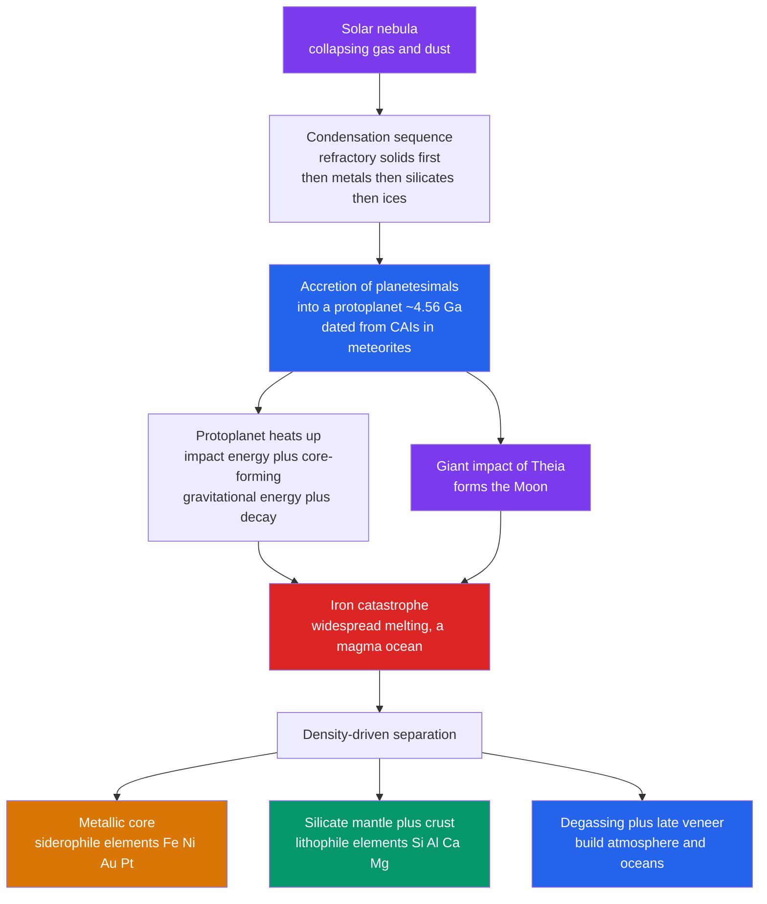

# 🌏 Earth Formation and Differentiation

> [!abstract] TL;DR
> The Earth grew by **accretion** of dust and planetesimals from the solar nebula about **4.56 billion years ago**, dated from calcium–aluminium-rich inclusions (CAIs) in meteorites. Heat from impacts, gravitational settling, and radioactive decay melted the young planet, triggering the **"iron catastrophe"**: dense metallic iron sank to form a **core**, while lighter silicates rose to form the **mantle** and **crust**. This chemical sorting — governed by Goldschmidt's siderophile / lithophile / chalcophile / atmophile affinities — is called **planetary differentiation**. A Mars-sized impactor (**Theia**) struck the near-finished Earth and threw off the debris that became the **Moon**, and later degassing plus a "late veneer" of infalling material delivered the early atmosphere and oceans.

## Intuition — analogy FIRST

Shake a jar of muddy pond water and let it stand. At first everything is a uniform brown suspension; within minutes the heavy sand sinks to the bottom, the fine silt sits above it, and the clear water floats on top. Nothing *pushed* the layers apart — **density and gravity** did all the sorting for free, and the process only works because the mixture was fluid enough to flow.

The infant Earth was that jar. Once impacts and radioactive heat melted it, molten iron (the "sand") drained downward through the silicate slurry to build the core, and the light "clear water" — the silicate mantle and crust, plus gases that became the atmosphere and ocean — floated to the top. Differentiation is gravity separating a planet into layers by density, and it is one of the most consequential events in Earth's history: it built the core that runs the magnetic field and set the chemistry of everything above it.

---

## How It Works



---

## Key Concepts / Details

### Secondary Level

**Where the material came from — the condensation sequence.** As the hot solar nebula cooled, different substances froze out of the gas at different temperatures. Nearest the young Sun, only **refractory** minerals (Ca–Al oxides, condensing near $1500$–$1800$ K) and then **iron–nickel metal** and **magnesium silicates** could survive; volatile ices ($\text{H}_2\text{O}$ below $\sim 180$ K, and lighter gases) survived only far out. This is why the inner planets are rocky and metal-rich while the outer planets are gas- and ice-rich.

**Accretion and the age of the Earth.** Dust grains stuck together into pebbles, then kilometre-scale **planetesimals**, then **protoplanets**, colliding and merging over roughly $10$–$100$ million years. The oldest solids in the Solar System, CAIs, are dated at **4.567 Ga**; the Earth reached near-full size by about **4.54 Ga**.

**The iron catastrophe.** Three heat sources — the kinetic energy of impacts, the gravitational energy of iron sinking, and radioactive decay — pushed the young Earth past iron's melting point. Molten iron, being far denser than silicate, drained to the centre. This runaway is the **iron catastrophe**, and it separated Earth into a metallic **core**, a rocky **mantle**, and a thin **crust**.

| Layer | Main material | Approx. density | Bulk of which elements |
|-------|---------------|-----------------|------------------------|
| Crust | Silicate rock | $\sim 2.7$–$3.0$ g/cm³ | Si, Al, O, K, Na (lithophile) |
| Mantle | Mg–Fe silicate | $\sim 3.3$–$5.5$ g/cm³ | O, Mg, Si, Fe (lithophile) |
| Core | Fe–Ni metal | $\sim 10$–$13$ g/cm³ | Fe, Ni + siderophiles |

### Undergraduate Level

**Goldschmidt's geochemical classification.** V. M. Goldschmidt sorted the elements by the phase they *prefer* during differentiation:

| Class | "Loves" | Ends up in | Examples |
|-------|---------|-----------|----------|
| **Siderophile** | metallic iron | core | Fe, Ni, Co, Pt, Au, Ir, W |
| **Lithophile** | silicate rock | mantle, crust | O, Si, Al, Ca, Mg, K, U, Th, Hf |
| **Chalcophile** | sulfide | ore bodies | Cu, Zn, Pb, S, Ag |
| **Atmophile** | gas phase | atmosphere, ocean | H, N, C, noble gases |

The core scavenged nearly all the gold and platinum on Earth — the reason those metals are rare at the surface.

**The heat budget of the young Earth.** Accretion converts gravitational potential energy to heat: an impactor of mass $m$ hitting a body of mass $M$, radius $R$, deposits roughly $E \approx \dfrac{GMm}{R}$. Core formation releases a further burst of gravitational energy as dense metal falls inward (computed below). On top of this, **short-lived radionuclides** — chiefly $^{26}\text{Al}$ (half-life $\approx 0.72$ Myr) and $^{60}\text{Fe}$ ($\approx 2.6$ Myr) — were intense heat sources *only* in the first few million years, while **long-lived** $^{40}\text{K}$, $^{238}\text{U}$, $^{235}\text{U}$, and $^{232}\text{Th}$ still warm the interior today (see [[Radioactive_Decay]] and [[Earths_Internal_Heat_and_Geothermal_Gradient]]).

**The giant-impact origin of the Moon.** Late in accretion, a Mars-sized protoplanet nicknamed **Theia** struck the proto-Earth a glancing blow. The impact vaporised silicate mantle from both bodies into a hot debris disk that re-accreted into the Moon. Key evidence:
- The Moon has a very **small iron core** ($\sim 3.34$ g/cm³ bulk density) — consistent with being built from silicate mantle debris after Earth's core had already formed.
- The Moon is strongly **depleted in volatiles**, matching material heated to vaporisation.
- Earth and Moon share **near-identical oxygen-isotope ratios**, implying a common source region.
- The impact supplies the **angular momentum** of today's Earth–Moon system and explains the ancient lunar magma ocean recorded in the anorthosite highlands.

**Origin of atmosphere and oceans.** Earth's primary (nebular H/He) atmosphere was lost. The **secondary atmosphere** came from **volcanic degassing** of $\text{H}_2\text{O}$, $\text{CO}_2$, $\text{N}_2$, and sulfur gases, supplemented by a **late accretion / late veneer** of volatile-rich material after core formation. Hydrogen-isotope ($\text{D/H}$) ratios point to **carbonaceous-chondrite asteroids** rather than comets as the dominant water source. Detrital **Jack Hills zircons** ($4.404$ Ga) show liquid water and continental crust existed by $\sim 4.4$ Ga, deep in the **Hadean** (see [[Earths_History_Hadean_to_Phanerozoic]]).

### Graduate Level

**Timing core formation — the Hf–W chronometer.** $^{182}\text{Hf}$ decays to $^{182}\text{W}$ with a half-life of $8.9$ Myr. Hafnium is **lithophile** (stays in silicate) and tungsten is **siderophile** (follows metal into the core). If the core forms *before* all the $^{182}\text{Hf}$ decays, the mantle is left with excess radiogenic $^{182}\text{W}$; the size of that excess dates core formation. The data show Earth's core largely formed within **$\sim 30$–$50$ Myr** of Solar System birth.

**The age of the Earth — the Pb–Pb geochron.** The twin uranium chains, $^{238}\text{U} \to {}^{206}\text{Pb}$ ($\lambda = 1.55\times10^{-10}\,\text{yr}^{-1}$) and $^{235}\text{U} \to {}^{207}\text{Pb}$ ($\lambda = 9.85\times10^{-10}\,\text{yr}^{-1}$), let a suite of samples define an **isochron** whose slope fixes an age without knowing the initial ratio. For a parent $P$ decaying to daughter $D$ referenced to a stable isotope $D_{\text{ref}}$:

$$\left(\frac{D}{D_{\text{ref}}}\right) = \left(\frac{D}{D_{\text{ref}}}\right)_0 + \frac{P}{D_{\text{ref}}}\left(e^{\lambda t}-1\right)$$

Claire Patterson (1956) fit meteorites and terrestrial lead to this "geochron," obtaining **$4.55 \pm 0.07$ Ga** — still the canonical age of the Earth. See [[Radiometric_Dating]].

**Magma-ocean crystallisation.** The energy of the giant impact plus core formation left Earth with a global or hemispheric **magma ocean** hundreds of kilometres deep. As it cooled, minerals crystallised and fractionated (denser phases sinking), imprinting early chemical heterogeneity on the mantle. The trace-element and isotopic fingerprints of that crystallisation are read from the very existence of siderophile-element abundances in the mantle that are *higher* than metal–silicate equilibrium allows — the classic argument for the volatile-rich **late veneer** ($\sim 0.5\%$ of Earth's mass) added after the core closed.

```python
# Energy released by core formation (the "iron catastrophe"), via a shell integral
# of self-gravitational potential energy for a homogeneous vs a differentiated Earth.
import numpy as np
import matplotlib.pyplot as plt

G   = 6.674e-11        # gravitational constant, N m^2 / kg^2
R_E = 6.371e6          # Earth radius, m
M_E = 5.972e24         # Earth mass, kg
c_p = 1000.0           # bulk specific heat of rock/metal, J/(kg K)

r  = np.linspace(1.0, R_E, 40000)   # radial grid
dr = r[1] - r[0]

def grav_energy(rho):
    """U = -integral of  G*M_enclosed(r)/r  dm,  with dm = 4*pi*r^2*rho*dr."""
    dm    = 4*np.pi*r**2*rho*dr
    M_enc = np.cumsum(dm)
    U     = -np.sum(G*M_enc/r*dm)
    return U, M_enc[-1]

# Model A: homogeneous Earth at the mean density (undifferentiated)
rho_A = np.full_like(r, M_E/(4/3*np.pi*R_E**3))     # ~5514 kg/m^3

# Model B: differentiated Earth = dense Fe-Ni core + silicate mantle
R_core = 3.48e6                                     # core radius, m
rho_B  = np.where(r < R_core, 10900.0, 4500.0)      # core, mantle densities

U_A, _ = grav_energy(rho_A)
U_B, _ = grav_energy(rho_B)

released = U_A - U_B                 # U_B is more negative -> energy freed as heat
dT       = released/(M_E*c_p)        # whole-Earth temperature rise if fully retained

print(f"U (homogeneous)   = {U_A:.3e} J")
print(f"U (differentiated)= {U_B:.3e} J")
print(f"Energy released   = {released:.3e} J")
print(f"Temperature rise  = {dT:.0f} K")   # ~10^31 J, order ~2000 K

plt.figure(figsize=(7, 5))
plt.plot(r/1e6, rho_A, label="Homogeneous (undifferentiated)", lw=2)
plt.plot(r/1e6, rho_B, label="Differentiated (core + mantle)", lw=2)
plt.axvline(R_core/1e6, color="k", ls="--", alpha=0.4)
plt.xlabel("Radius (thousand km)")
plt.ylabel("Density (kg/m$^3$)")
plt.title(f"Differentiation frees ~{released:.1e} J  ->  dT ~ {dT:.0f} K")
plt.legend(); plt.grid(True, alpha=0.3); plt.tight_layout()
```

---

## Real-World Notes

- **The magnetic field is a fossil of differentiation.** Without core formation there would be no liquid iron outer core and no **geodynamo** — see [[Geomagnetism_and_Paleomagnetism]]. Differentiation quite literally powers the shield that deflects the solar wind.
- **Ore deposits echo Goldschmidt.** Economic platinum, nickel, and gold concentrate where late metal or sulfide melts pooled; the surface abundances we mine are what the core *failed* to capture, often re-delivered by the late veneer.
- **Meteorites are unmelted leftovers.** Chondrites never differentiated, so they preserve the bulk Solar-System composition; iron meteorites and achondrites are the cores and mantles of *shattered* differentiated planetesimals — direct samples of the same process.
- **Apollo samples tested the impact model.** The Moon's tiny core, volatile depletion, and matching oxygen isotopes came straight from lunar rock, turning the giant impact from speculation into the leading hypothesis.
- **Hadean zircons rewrote the early story.** The $4.4$ Ga Jack Hills grains show that oceans and crust existed far earlier than the old "hellish, dry Hadean" picture assumed.
- **The Late Heavy Bombardment is contested.** A proposed spike of impacts at $\sim 4.1$–$3.8$ Ga (from lunar crater ages) may instead reflect a long declining tail of accretion; the "cataclysm" interpretation is actively debated.

---

## Common Pitfalls

1. **Confusing "age of the Solar System" with "age of the Earth."** CAIs date the *first solids* at $4.567$ Ga; the Earth finished accreting somewhat later ($\sim 4.54$ Ga) and its core closed within $\sim 30$–$50$ Myr after. *Fix:* quote CAIs for the Solar System, Pb–Pb/Hf–W for the Earth.
2. **Thinking radioactivity did the melting alone.** Impact and core-formation gravitational energy dominate the *early* budget; short-lived $^{26}\text{Al}$ matters only for the first few Myr. *Fix:* treat the heat budget as a sum of impact + gravitational + radiogenic terms.
3. **Treating differentiation as one instant.** It was a runaway (the iron catastrophe) but proceeded over millions of years as melting spread. *Fix:* describe it as a self-accelerating process, not a single "day."
4. **Assuming the Moon's material is mostly Theia.** Isotopically the Moon looks like Earth's mantle; a large fraction of lunar material is proto-Earth silicate, not the impactor. *Fix:* say the Moon formed from a *mixed* silicate debris disk.
5. **Crediting comets for the oceans.** Most cometary $\text{D/H}$ ratios are too high; carbonaceous-chondrite asteroids and degassing better match Earth's water. *Fix:* name asteroids + degassing as the primary source, comets as minor.
6. **Reading the energy demo as exact.** The $\sim 10^{31}$ J / $\sim 2000$ K result is an order-of-magnitude estimate; real heat retention, latent heat, and radiative loss all matter. *Fix:* present it as a scaling argument, not a precise thermal history.

---

## Related Concepts

- [[_MOC_Earth_Structure_Geophysics|↑ Section MOC]]
- [[Earth_Internal_Structure]] — the layered core–mantle–crust structure that differentiation *produced*
- [[Seismology_and_Earthquakes]] — seismic waves image the core–mantle boundary and confirm the density layering
- [[Earths_Internal_Heat_and_Geothermal_Gradient]] — the accretional, core-formation, and radiogenic heat introduced here is the interior's ongoing energy source
- [[Geomagnetism_and_Paleomagnetism]] — the metallic core built by differentiation drives the geodynamo
- [[Gravity_Isostasy_and_the_Geoid]] — density contrasts set up by differentiation govern Earth's gravity field
- [[Radiometric_Dating]] — the isochron and Pb–Pb methods that date formation and core closure
- [[Earths_History_Hadean_to_Phanerozoic]] — the Hadean world that emerged from accretion and the late veneer
- **Physics** — [[Newtons_Laws_and_Kinematics]] and [[Work_Energy_and_Conservation]] (accretional/impact energetics), [[Radioactive_Decay]] (heat sources and geochronology)
- **Chemistry** — [[Atomic_Structure_and_Subatomic_Particles]] (isotopes behind Hf–W and Pb–Pb), [[Periodic_Trends_and_Main_Group_Chemistry]] (why elements partition as siderophile/lithophile)
- **Mathematics** — [[_MOC_Mathematics_Master]] (integration and linear regression underlie the energy integral and isochron fitting)

---

## Review Questions

1. **Secondary:** List the three main heat sources that melted the early Earth and explain in one sentence how each one turned into heat. Why did molten iron sink instead of silicate?
2. **Undergraduate:** Using Goldschmidt's classification, predict where each of Ni, U, S, and Ar ended up (core, mantle/crust, ore, or atmosphere) and justify each choice. How does this explain why gold is rare at Earth's surface?
3. **Graduate:** The Hf–W system dates core formation while Pb–Pb dates bulk accretion. Explain why Hf–W is sensitive to *core formation specifically*, and how the two chronometers together constrain a $\sim 30$–$50$ Myr core-formation timescale.

---

## Sources

- Grotzinger & Jordan — *Understanding Earth*, 8th ed. (formation, differentiation, Hadean)
- Marshak — *Earth: Portrait of a Planet*, 6th ed. (accretion and early Earth)
- Fowler — *The Solid Earth: An Introduction to Global Geophysics*, 2nd ed. (heat budget, core formation)
- White — *Geochemistry* (Wiley) — Goldschmidt classification, Hf–W and Pb–Pb chronometry
- Patterson, C. (1956) — "Age of meteorites and the earth," *Geochim. Cosmochim. Acta* 10, 230
- Canup & Asphaug (2001) — "Origin of the Moon in a giant impact," *Nature* 412, 708
- Kleine et al. (2009) — "Hf–W chronometry of the accretion and early evolution of the terrestrial planets," *Geochim. Cosmochim. Acta* 73, 5150

#earth-science #geophysics #differentiation #accretion #iron-catastrophe #giant-impact #geochronology #secondary #undergraduate #graduate
