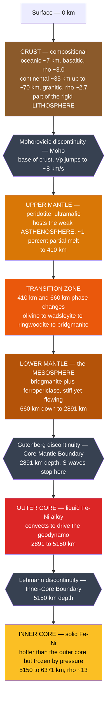

# 🧅 Earth's Internal Structure

> [!abstract] TL;DR
> Earth is layered two complementary ways. **Compositionally**: a thin **crust** (oceanic ~7 km basaltic, continental ~35 km, up to ~70 km, granitic), a thick ultramafic **mantle** (peridotite, down to ~2890 km), and an Fe–Ni **core** (liquid outer, solid inner). **Mechanically/rheologically**: a rigid **lithosphere**, a weak **asthenosphere** that lets plates move, the stiff **mesosphere** (lower mantle), a liquid **outer core**, and a solid **inner core**. We know all this indirectly: seismic P- and S-wave travel times, the **S-wave shadow zone** proving a liquid outer core, Earth's mean density (~5.51 g/cm³) demanding a dense metallic core, the moment of inertia, and meteorite analogs — synthesised in the **Preliminary Reference Earth Model (PREM)**.

## Intuition — analogy FIRST

Picture a **hard-boiled egg**. The thin, brittle **shell** is the crust — so thin it cracks into moving plates. The rubbery **white** is the mantle: solid, but soft enough to slowly deform. The **yolk** is the core. That single picture already contains the whole story — thin outside, thick middle, dense center.

But here is the twist: **no one has ever seen these layers.** The deepest hole ever drilled, the Kola Superdeep Borehole, reached only ~12.3 km — it did not even pierce the shell of the egg. So how do we know what is inside? The same way a doctor "sees" inside you without cutting: **we send waves through and time the echoes.** Every earthquake is a hammer-tap on the planet, and thousands of seismometers act like a giant CT scanner. Where waves speed up, slow down, bend, or vanish entirely tells us exactly where the layers are and what they are made of.

---

## How It Works



---

### Secondary Level

**Two ways to slice the Earth.** These schemes overlap but are *not* the same — the boundaries fall at different depths.

| Scheme | Basis | Layers |
|--------|-------|--------|
| **Compositional** | what it is made of | Crust · Mantle · Core |
| **Mechanical** | how it behaves under stress | Lithosphere · Asthenosphere · Mesosphere · Outer core · Inner core |

The **lithosphere** (the rigid plates of plate tectonics) is crust **plus** the coldest, most rigid top of the mantle — so it straddles the crust–mantle boundary. That is the single most important thing to get right.

**The three great discontinuities** — sudden jumps in wave speed that mark internal boundaries:

| Discontinuity | Depth | Marks |
|---------------|-------|-------|
| **Mohorovičić (Moho)** | ~7 km ocean, ~35 km continent | crust → mantle |
| **Gutenberg (CMB)** | ~2890 km | mantle → outer core |
| **Lehmann** | ~5150 km | outer core → inner core |

**How we know it is layered:** Earthquakes release two body waves — fast **P-waves** (compressional, travel through solids *and* liquids) and slower **S-waves** (shear, travel through solids *only*). S-waves disappear on the far side of the planet — the **S-wave shadow zone** — proving a region that cannot carry shear: a **liquid outer core**.

### Undergraduate Level

**PREM at a glance** (Preliminary Reference Earth Model, Dziewonski & Anderson 1981). Note the sharp jumps at each boundary:

| Region | Depth (km) | Density (g/cm³) | Vp (km/s) | Vs (km/s) |
|--------|-----------|-----------------|-----------|-----------|
| Upper crust | 0–15 | 2.6 | 5.8 | 3.2 |
| Uppermost mantle | 24–220 | 3.38 → 3.36 | 8.1 → 8.0 | 4.5 |
| Below 410 | 410 | 3.54 → 3.72 | 8.9 → 9.4 | 4.8 → 5.1 |
| Below 660 | 660 | 3.99 → 4.38 | 10.2 → 10.8 | 5.6 → 5.9 |
| Base of mantle | 2891 | 5.57 | 13.7 | 7.26 |
| Top of outer core | 2891 | **9.90** | **8.06** | **0** |
| Base of outer core | 5150 | 12.17 | 10.36 | 0 |
| Inner core | 5150–6371 | 12.76 → 13.09 | 11.03 → 11.26 | 3.50 → 3.67 |

The **Vs = 0 in the outer core** is the smoking gun for a liquid; the density *jump* from 5.57 to 9.90 g/cm³ across the CMB is the fingerprint of switching from silicate rock to iron metal.

**The shadow zones.** Refraction and the S-wave block carve out two zones on the surface, measured as angular distance from the epicenter:

- **S-wave shadow zone:** no direct S-waves beyond **~103°** → liquid outer core.
- **P-wave shadow zone:** **~103° to ~142°** → P-waves refract sharply at the low-velocity CMB and bend away.

**The density argument.** Earth's mean density is

$$\rho_{mean} = \frac{M}{\tfrac{4}{3}\pi R^3} = \frac{5.97\times10^{24}\ \text{kg}}{\tfrac{4}{3}\pi (6.371\times10^6\ \text{m})^3} \approx 5.51\ \text{g/cm}^3$$

Yet surface crustal rocks are only **2.7–3.0 g/cm³**. Something deep inside must be far denser — a metallic (iron-rich) core near **13 g/cm³** is required to balance the books.

**The moment of inertia** confirms the mass is concentrated toward the center:

$$\frac{I}{MR^2} = 0.3307 \quad (\text{a uniform sphere would give } 0.4)$$

**Meteorite analogs.** **Iron meteorites** (Fe–Ni) are fragments of differentiated planetesimal cores — a direct sample of core-like material. **Chondrites** approximate the Sun's non-volatile composition and anchor estimates of bulk-Earth chemistry.

### Graduate Level

**Density from seismic velocities — the Adams–Williamson equation.** In a chemically uniform, adiabatic, self-compressed layer, density gradient follows from the *seismic parameter* $\Phi$:

$$\frac{d\rho}{dr} = -\frac{\rho\, g(r)}{\Phi}, \qquad \Phi = \frac{K_S}{\rho} = V_p^2 - \tfrac{4}{3}V_s^2$$

This lets seismologists convert measured $V_p, V_s$ into a density profile — the backbone of PREM. Deviations from Adams–Williamson flag **composition or phase changes** (e.g., the 660 km jump is too large for self-compression alone).

**Mineral physics of the deep interior.** The mantle discontinuities are **solid–solid phase transitions** in $(Mg,Fe)_2SiO_4$ / $MgSiO_3$, not compositional changes:

| Depth | Pressure | Transition | Clapeyron slope |
|-------|----------|-----------|-----------------|
| 410 km | ~13.5 GPa | olivine → **wadsleyite** | positive (~ +3 MPa/K) |
| ~520 km | ~18 GPa | wadsleyite → **ringwoodite** | positive |
| 660 km | ~23 GPa | ringwoodite → **bridgmanite** + ferropericlase | **negative** (~ −2 MPa/K) |
| ~2700 km (D″) | ~125 GPa | bridgmanite → **post-perovskite** | positive |

The **negative** Clapeyron slope at 660 km opposes vertical flow and may partially layer mantle convection; the **post-perovskite** transition (Murakami et al., 2004) helps explain the D″ layer's seismic character. See [[Phase_Equilibria_and_Colligative_Properties]] and [[Solid_State_and_Crystal_Structures]].

**Geotherm vs. adiabat.** Temperature rises steeply through the conductive lithosphere, then follows a near-**adiabatic** gradient in the convecting mantle (small, ~0.3–0.5 K/km), with thermal boundary layers at the surface and at D″. The CMB sits near ~3800–4000 K; the inner-core boundary near ~5400 K — the inner core is *hotter* than the outer core yet solid, because the melting curve of iron rises with pressure faster than the geotherm does. See [[Earths_Internal_Heat_and_Geothermal_Gradient]] and [[Laws_of_Thermodynamics]].

**Inner-core growth.** As Earth cools, iron freezes onto the inner core, releasing **latent heat** and expelling light elements that buoyantly stir the outer core — the primary power source of the **geodynamo** ([[Geomagnetism_and_Paleomagnetism]]). The inner core also shows **seismic anisotropy** (faster along the spin axis) and is the subject of active "differential rotation" studies.

```python
import numpy as np
import matplotlib.pyplot as plt

# Simplified PREM (Dziewonski & Anderson, 1981), sampled at layer boundaries.
# Duplicated depths encode the sharp jumps at the three discontinuities.
# depth in km; density in g/cm^3; Vp = P-wave speed in km/s.
depth = [0,   15,  24,   24,  220, 400, 410,  410, 660,  660,
         1000,1500,2000, 2600,2891,2891,3500, 4500,5150, 5150,
         5700,6371]
rho   = [2.6, 2.6, 2.9,  3.38,3.36,3.54,3.54, 3.72,3.99, 4.38,
         4.58,4.82,5.12, 5.43,5.57,9.90,10.4, 11.6,12.17,12.76,
         12.98,13.09]
vp    = [5.8, 5.8, 6.8,  8.11,7.99,8.91,8.91, 9.36,10.20,10.79,
         11.5,12.3,12.9, 13.5,13.72,8.06,8.90,10.0,10.36,11.03,
         11.19,11.26]

depth, rho, vp = map(np.array, (depth, rho, vp))

fig, ax1 = plt.subplots(figsize=(8, 6))
ax1.plot(rho, depth, color="crimson", lw=2, label="Density")
ax1.set_xlabel("Density (g/cm^3)", color="crimson")
ax1.set_ylabel("Depth (km)")
ax1.invert_yaxis()                       # surface at the top
ax1.tick_params(axis="x", labelcolor="crimson")

ax2 = ax1.twiny()
ax2.plot(vp, depth, color="navy", lw=2, ls="--", label="Vp")
ax2.set_xlabel("P-wave speed Vp (km/s)", color="navy")
ax2.tick_params(axis="x", labelcolor="navy")

# Mark the three great discontinuities
for d, name in [(24, "Moho"), (2891, "CMB / Gutenberg"), (5150, "ICB / Lehmann")]:
    ax1.axhline(d, color="gray", ls=":", lw=1)
    ax1.text(3.0, d - 70, name, fontsize=9)

ax1.set_title("Simplified PREM: density and P-wave speed vs depth")
fig.tight_layout()
plt.show()
```

Running this reproduces the PREM signature: a modest density climb through the mantle, an abrupt near-doubling at the **CMB** (silicate → iron), the **Vp collapse** from ~13.7 to ~8.1 km/s where P-waves enter the liquid outer core, and a small jump at the **ICB**.

---

## Real-World Notes

- **Kola Superdeep Borehole** (Russia, ~12.26 km) is the deepest hole ever drilled — barely 0.2% of the way to the center. Direct sampling of the mantle and core is impossible, which is why seismology, not drilling, maps the interior.
- **Seismic tomography** images cold subducting slabs sinking and hot plumes rising, and reveals two continent-sized **LLSVPs** (Large Low-Shear-Velocity Provinces) sitting on the CMB beneath Africa and the Pacific.
- **Ringwoodite in a diamond** (Pearson et al., 2014) — a natural inclusion carried up from the transition zone directly confirmed the mineralogy predicted for ~520–660 km and showed the mantle holds significant water.
- **The geodynamo**: convection in the liquid outer core generates Earth's magnetic field, which shields the atmosphere from the solar wind — a habitability essential, tied straight to core structure ([[Geomagnetism_and_Paleomagnetism]]).
- **Inner-core rotation**: 2023 studies of repeating earthquakes suggest the inner core's rotation relative to the mantle has recently paused and may be oscillating — a live research frontier.
- **The 660 km discontinuity** frames the decades-long debate between **whole-mantle** and **layered** convection, central to how heat and material cycle through the planet ([[Mantle_Convection_and_Hotspots]]).

---

## Common Pitfalls

1. **Confusing the two layering schemes.** Crust/mantle/core is *compositional*; lithosphere/asthenosphere/... is *mechanical*. The **lithosphere includes crust AND the rigid uppermost mantle**, so its base is *not* the Moho.
2. **"The outer core is molten lava."** No. It is liquid **iron–nickel alloy**, not silicate magma; the mantle above it is **solid rock** that merely flows on geological timescales.
3. **"The asthenosphere is a liquid layer."** It is only ~1% partial melt — weak and ductile enough to flow, but overwhelmingly solid. Plates slide on it because it is *soft*, not because it is liquid.
4. **Misreading the shadow zone.** The S-wave shadow proves the **outer** core is liquid; it says nothing against a **solid inner core**, which the Lehmann discontinuity later revealed.
5. **Depth vs. radius.** The CMB is at **2891 km depth** but **3480 km radius** (6371 − 2891). Mixing the two corrupts every core calculation.
6. **Assuming a linear geotherm.** Temperature rises steeply in the lithosphere, then flattens to a near-adiabatic gradient in the convecting mantle — the interior is far cooler than a naive extrapolation of the near-surface gradient would predict.

---

## Related Concepts

- [[_MOC_Earth_Structure_Geophysics|↑ Section MOC]]
- [[Earth_Formation_and_Differentiation]] — how gravitational settling of iron produced this layered, differentiated planet in the first place.
- [[Seismology_and_Earthquakes]] — the source of the P/S travel-time and shadow-zone data that *is* our evidence for the layers.
- [[Earths_Internal_Heat_and_Geothermal_Gradient]] — the geotherm, adiabat, and heat budget that set the phase boundaries and keep the outer core molten.
- [[Geomagnetism_and_Paleomagnetism]] — the geodynamo powered by convection in the liquid outer core.
- [[Gravity_Isostasy_and_the_Geoid]] — density structure and moment of inertia link directly to Earth's gravity field.
- [[Mantle_Convection_and_Hotspots]] — how the mantle's structure drives whole-mantle circulation and plumes.
- [[Plate_Boundaries_and_Plate_Motions]] — the lithosphere/asthenosphere contrast is what makes plate tectonics possible.
- **Physics** — [[Wave_Motion_and_Properties]] (P- and S-wave propagation) and [[Laws_of_Thermodynamics]] (Earth as a cooling heat engine).
- **Chemistry** — [[Solid_State_and_Crystal_Structures]] (deep-mantle mineral phases) and [[Phase_Equilibria_and_Colligative_Properties]] (the 410/660 km phase transitions).
- **Mathematics** — [[_MOC_Mathematics_Master]] (differential equations behind Adams–Williamson and heat flow).

---

## Review Questions

1. **Secondary**: Name the three compositional layers of the Earth and the discontinuity that separates each pair. Which type of seismic wave cannot pass through the outer core, and what does that tell us about its state?
2. **Undergraduate**: Earth's mean density is ~5.51 g/cm³ while surface rocks are ~2.7 g/cm³. Explain quantitatively why this, together with a moment-of-inertia factor of 0.33, requires a dense central core. Then sketch how the S-wave and P-wave shadow zones locate the core–mantle boundary.
3. **Graduate**: The 660 km discontinuity has a *negative* Clapeyron slope while the 410 km has a *positive* one. Explain how the sign of the Clapeyron slope influences whether these phase boundaries promote or impede vertical mantle flow, and what that implies for the whole-mantle vs. layered convection debate.

---

## Sources

- Dziewonski, A. M. & Anderson, D. L. (1981) — "Preliminary reference Earth model (PREM)," *Phys. Earth Planet. Inter.* 25, 297.
- Stein, S. & Wysession, M. — *An Introduction to Seismology, Earthquakes, and Earth Structure* (Blackwell).
- Fowler, C. M. R. — *The Solid Earth: An Introduction to Global Geophysics*, 2nd ed. (Cambridge).
- Murakami, M. et al. (2004) — "Post-perovskite phase transition in MgSiO₃," *Science* 304, 855.
- Pearson, D. G. et al. (2014) — "Hydrous mantle transition zone indicated by ringwoodite in diamond," *Nature* 507, 221.

#earth-science #geophysics #PREM #crust-mantle-core #seismology #discontinuities #secondary #undergraduate #graduate
