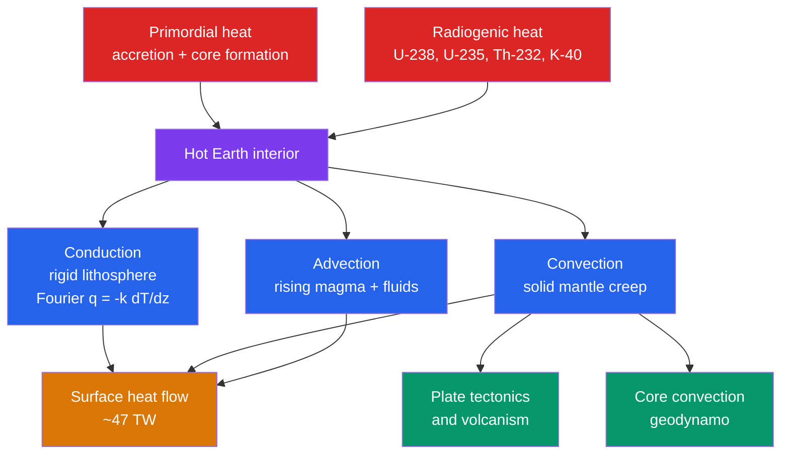

# 🔥 Earth's Internal Heat and Geothermal Gradient

> [!abstract] TL;DR
> Earth is a slowly cooling heat engine. Its interior stores **primordial heat** (from accretion and core formation) and generates **radiogenic heat** from the decay of long-lived isotopes ($^{238}$U, $^{235}$U, $^{232}$Th, $^{40}$K). This ~47 TW of power escapes through **conduction** in the rigid lithosphere, **convection** in the solid mantle, and **advection** by magma. The **geothermal gradient** is steep in the crust (~25–30 °C/km) but nearly flat (adiabatic, ~0.3–0.5 °C/km) in the convecting mantle — which is why naively extrapolating the crustal gradient to the core gives absurd temperatures. This heat drives mantle convection, plate tectonics, volcanism, and the geodynamo.

## Intuition — analogy FIRST

Imagine a fresh loaf of bread just out of the oven. The **crust** is a thin, rigid shell that can only lose heat by conduction — so a large temperature difference is packed into a few millimetres, a steep gradient. The **soft interior**, still hot enough to flow, mixes and overturns; heat is carried by moving material, so the inside is almost the same temperature throughout. Earth is that loaf at planetary scale: a brittle lithospheric crust with a steep conductive gradient sitting on a solid-but-creeping mantle that convects and is therefore nearly isothermal (adiabatic). If you measured the steep temperature rise in the crust and blindly extended it all the way to the centre, you would predict a molten interior thousands of times too hot — the mistake of forgetting the inside stirs itself.

---

## How It Works



### Secondary Level

**Where the heat comes from.** Two sources:
1. **Primordial heat** — leftover heat from Earth's violent birth. As countless planetesimals crashed together (**accretion**), their gravitational energy of motion became heat; and when dense iron sank to form the core (**differentiation**), that release of gravitational energy heated the whole planet by ~1000–2000 K. See [[Earth_Formation_and_Differentiation]].
2. **Radiogenic heat** — ongoing heat released by radioactive decay of unstable atoms trapped in Earth's rocks (see [[Radioactive_Decay]]).

**The geothermal gradient** is how fast temperature rises with depth. Deep mines and boreholes get hotter as you descend — on average about **25–30 °C per kilometre** in the continental crust. Heat always flows from the hot interior to the cold surface (the [[Laws_of_Thermodynamics|second law]]), and this outward flow is the ultimate energy source for earthquakes, volcanoes, and moving continents. Humans tap it directly as **geothermal energy** for electricity and heating.

### Undergraduate Level

**The global heat budget.** Total heat escaping Earth's surface is about **$Q \approx 46\text{–}47\ \mathrm{TW}$** (terawatts), measured from tens of thousands of borehole heat-flow determinations. Oceanic crust loses far more than continental crust because young seafloor is hot. Of this, radiogenic decay supplies only a portion; the rest is **secular cooling** (the planet slowly giving up primordial heat).

**Heat transfer — three modes:**

| Mechanism | Where it dominates | Governing relation |
|-----------|-------------------|--------------------|
| Conduction | Rigid lithosphere, D″ layer | Fourier: $q = -k\,\dfrac{dT}{dz}$ |
| Convection | Solid mantle, liquid outer core | Solid-state creep, $Ra > Ra_c$ |
| Advection | Magma, hydrothermal fluids | $q = \rho c_p\, v\, \Delta T$ |

**Fourier's law** for the conductive lithosphere: the vertical heat flux $q$ is proportional to the gradient, $q = -k\,dT/dz$, with rock conductivity $k \approx 2\text{–}4\ \mathrm{W\,m^{-1}\,K^{-1}}$. For steady 1-D conduction with uniform volumetric heat production $A$:

$$\frac{d^2 T}{dz^2} = -\frac{A}{k} \quad\Rightarrow\quad T(z) = T_s + \frac{q_0}{k}\,z - \frac{A\,z^2}{2k}$$

**The four heat-producing isotopes** (present-day, per kg of the pure isotope):

| Isotope | Half-life (Gyr) | Heat production $H$ (W/kg) | Notes |
|---------|-----------------|---------------------------|-------|
| $^{238}$U | 4.47 | $9.46\times10^{-5}$ | dominant U isotope today |
| $^{235}$U | 0.704 | $5.69\times10^{-4}$ | short-lived; huge early on |
| $^{232}$Th | 14.0 | $2.64\times10^{-5}$ | most abundant, slowest |
| $^{40}$K | 1.25 | $2.92\times10^{-5}$ | tiny abundance, big early role |

Because these are long-lived, **the early Earth produced ~4–5× more radiogenic heat than today** — early mantle convection and volcanism were far more vigorous.

**Why extrapolation fails.** Extending the crustal gradient of ~25 °C/km all the way to the core–mantle boundary at 2890 km predicts $25 \times 2890 \approx 72{,}000\ ^\circ\mathrm{C}$ — absurd (the true CMB temperature is ~3800–4100 K). The gradient *must* flatten because below the lithosphere the mantle **convects**: overturning solid rock carries heat efficiently, so the temperature profile follows the **adiabat**:

$$\left(\frac{dT}{dz}\right)_{\text{ad}} = \frac{\alpha\,g\,T}{c_p} \approx 0.3\text{–}0.5\ ^\circ\mathrm{C/km}$$

with thermal expansivity $\alpha \approx 3\times10^{-5}\ \mathrm{K^{-1}}$, $g \approx 10\ \mathrm{m\,s^{-2}}$, $c_p \approx 1250\ \mathrm{J\,kg^{-1}\,K^{-1}}$.

**Geotherm vs. solidus.** The actual temperature–depth curve (the **geotherm**) generally stays *below* the mantle **solidus** (the melting curve) — the mantle is solid. Melting happens where the two cross. Beneath mid-ocean ridges, rising mantle follows its adiabat while the solidus drops steeply with falling pressure, so the adiabat crosses the solidus and **decompression melting** produces basaltic magma (see [[Mantle_Convection_and_Hotspots]], [[Volcanism_and_Volcanic_Hazards]]).

### Graduate Level

**Half-space cooling model (HSCM).** Oceanic lithosphere is created hot at a ridge and cools by conduction into a semi-infinite half-space as it ages. With mantle temperature $T_m$ and thermal diffusivity $\kappa = k/(\rho c_p)$, the solution to the 1-D heat equation is:

$$T(z,t) = T_m\,\mathrm{erf}\!\left(\frac{z}{2\sqrt{\kappa t}}\right)$$

Two celebrated consequences follow. Surface heat flow decays with plate age as

$$q(t) = \frac{k\,T_m}{\sqrt{\pi\,\kappa\,t}} \;\propto\; t^{-1/2},$$

and thermal contraction makes the seafloor deepen as $\sqrt{\text{age}}$:

$$d(t) = d_r + \frac{2\,\rho_m\,\alpha\,T_m}{\rho_m - \rho_w}\sqrt{\frac{\kappa\,t}{\pi}} \;\propto\; \sqrt{t}.$$

The $\sqrt{\text{age}}$ law matches bathymetry superbly for crust younger than ~70–80 Myr, then flattens — motivating the bounded "plate model." Connects to [[Seismology_and_Earthquakes|seismic structure]] and [[Gravity_Isostasy_and_the_Geoid|isostatic subsidence]].

**Onset of convection — the Rayleigh number.** Convection begins only when buoyancy overwhelms viscous and diffusive damping. The controlling dimensionless group is

$$Ra = \frac{\rho\,g\,\alpha\,\Delta T\,d^{3}}{\kappa\,\eta},$$

with layer thickness $d$ and dynamic viscosity $\eta$. Convection sets in above a **critical value** $Ra_c \approx 1000\text{–}2000$ (exact value depends on boundary conditions; $657.5$ for free–free, $1707.8$ for rigid–rigid). Earth's mantle has $Ra \sim 10^{7}\text{–}10^{8}$ — vastly supercritical, so it convects vigorously despite being solid.

**Secular cooling and the Urey ratio.** The **Urey ratio** measures how self-heated the planet is:

$$Ur = \frac{H_{\text{radiogenic}}}{Q_{\text{surface}}}.$$

Geochemical (chondritic) models estimate $H \approx 20\ \mathrm{TW}$, giving $Ur \approx 0.4$ — meaning **more than half** of surface heat flow comes from secular cooling. But thermal-history models that extrapolate backward with such a low $Ur$ run into a **thermal catastrophe**: the mantle would have been implausibly molten only ~1–2 Gyr ago. Geophysical fits therefore prefer $Ur \approx 0.7$. Reconciling this tension (extra hidden heat sources, a less temperature-sensitive viscosity, or layered convection) is an open research problem, informed increasingly by **geoneutrino** detections that directly count U and Th decays.

```python
import numpy as np
import matplotlib.pyplot as plt

fig, (ax1, ax2) = plt.subplots(1, 2, figsize=(12, 5))

# --- Panel 1: steady-state conductive geotherm with internal heat production ---
# 1-D steady conduction:  T(z) = Ts + (q0/k) z - A z^2 / (2k)
Ts, q0, k, A = 10.0, 0.065, 3.0, 1.0e-6   # degC, W/m^2, W/m/K, W/m^3
z_crust = np.linspace(0, 35_000, 200)
T_crust = Ts + (q0/k)*z_crust - A*z_crust**2/(2*k)
T_moho  = Ts + (q0/k)*35_000 - A*35_000**2/(2*k)

# below the lithosphere the geotherm follows a shallow mantle adiabat (~0.4 C/km)
z_mantle = np.linspace(35_000, 200_000, 100)
T_mantle = T_moho + 0.4e-3*(z_mantle - 35_000)

# naive (wrong) extrapolation of the near-surface gradient
grad0 = (T_crust[1] - T_crust[0]) / (z_crust[1] - z_crust[0])
z_ext = np.linspace(0, 200_000, 50)
T_ext = Ts + grad0*z_ext

ax1.plot(T_crust, z_crust/1000, 'b-', lw=2, label='Conductive crust')
ax1.plot(T_mantle, z_mantle/1000, 'g-', lw=2, label='Mantle adiabat ~0.4 C/km')
ax1.plot(T_ext, z_ext/1000, 'r--', lw=1.5, label='Naive extrapolation (absurd)')
ax1.invert_yaxis(); ax1.set_xlim(0, 3000)
ax1.set_xlabel('Temperature (deg C)'); ax1.set_ylabel('Depth (km)')
ax1.set_title('Geotherm: steep crust, shallow mantle')
ax1.legend(); ax1.grid(alpha=0.3)

# --- Panel 2: radiogenic heat production of the mantle over 4.5 Gyr ---
t = np.linspace(0, 4.5, 200)  # Gyr BEFORE present
C = {'U': 3.1e-8, 'Th': 1.24e-7, 'K': 3.1e-4}   # element mass fractions (primitive mantle)
iso = {   # element, present isotopic abundance, H [W/kg isotope], half-life [Gyr]
    'U-238':  ('U', 0.9927, 9.46e-5, 4.47),
    'U-235':  ('U', 0.0072, 5.69e-4, 0.704),
    'Th-232': ('Th', 1.00,  2.64e-5, 14.0),
    'K-40':   ('K', 1.19e-4, 2.92e-5, 1.25),
}
total = np.zeros_like(t)
for name, (el, ab, H, tau) in iso.items():
    lam = np.log(2)/tau
    Hi = C[el]*ab*H*np.exp(lam*t)   # heat was higher in the past
    ax2.plot(t, Hi*1e12, lw=2, label=name)
    total += Hi
ax2.plot(t, total*1e12, 'k-', lw=2.5, label='Total')
ax2.set_xlabel('Time before present (Gyr)'); ax2.set_ylabel('Heat production (pW/kg)')
ax2.set_title('Early Earth was ~4-5x hotter (radiogenic)')
ax2.invert_xaxis(); ax2.legend(); ax2.grid(alpha=0.3)

plt.tight_layout(); plt.show()
print(f"Present: {total[0]*1e12:.2f} pW/kg | 4.5 Ga: {total[-1]*1e12:.2f} pW/kg "
      f"| ratio: {total[-1]/total[0]:.1f}x")
```

---

## Real-World Notes

- **Deep mines run hot.** South Africa's Mponeng gold mine reaches ~3.9 km depth where rock temperatures exceed 60 °C; the geothermal gradient forces enormous refrigeration to keep it workable — a direct, tangible measurement of Earth's heat.
- **Geothermal power.** Iceland sits on the Mid-Atlantic Ridge where the gradient is steep and magma is shallow; it generates ~25% of its electricity and heats ~90% of its homes geothermally. Enhanced Geothermal Systems (EGS) aim to tap deeper heat in less favourable crust.
- **Seafloor bathymetry obeys $\sqrt{\text{age}}$.** The systematic deepening of the ocean floor away from ridges — from ~2.5 km at the crest to ~5–6 km in old basins — is the half-space cooling model made visible on a global map.
- **Geoneutrinos count Earth's fuel.** The KamLAND and Borexino detectors register antineutrinos from $^{238}$U and $^{232}$Th decay inside Earth, giving the first *direct* measurement of radiogenic power (~20 TW) and constraining the Urey-ratio debate.
- **The engine of geology.** This heat budget powers [[Mantle_Convection_and_Hotspots|mantle convection]], which drives plate tectonics and [[Volcanism_and_Volcanic_Hazards|volcanism]]; convection in the liquid outer core sustains the [[Geomagnetism_and_Paleomagnetism|geodynamo]] that shields the biosphere.
- **Cooling neighbours.** Mars and the Moon, being smaller, lost their internal heat far faster (surface-area-to-volume ratio) — their volcanism and any dynamo died early, a natural experiment confirming heat drives geological activity.

---

## Common Pitfalls

1. **Extrapolating the crustal gradient to depth.** The steep ~25 °C/km applies only to the *conductive lithosphere*. Below it the mantle convects and follows a near-flat adiabat; linear extension to the core gives temperatures ~15× too high.
2. **Confusing the geotherm with the adiabat.** The **geotherm** is the actual temperature profile; the **adiabat** is the profile a convecting parcel would follow with no heat exchange. They coincide in the well-mixed interior but diverge sharply across the conductive boundary layers.
3. **Assuming all internal heat is radiogenic.** Radiogenic decay supplies only ~40–50% of the surface heat flow; the remainder is primordial secular cooling. Ignoring secular cooling produces the thermal-catastrophe paradox.
4. **Treating a solid mantle as unable to convect.** Over million-year timescales the "solid" mantle creeps like a viscous fluid ($Ra \gg Ra_c$). Solidity on human timescales does not forbid convection on geological ones.
5. **Ignoring the pressure dependence of melting.** Whether rock melts depends on the geotherm relative to the *pressure-dependent* solidus, not on temperature alone — decompression can melt mantle that is getting no hotter.
6. **Using bulk-element heat production without isotopic decay.** Each isotope has a different half-life, so the mix (and total) has changed with time; $^{235}$U and $^{40}$K dominated the young Earth even though they are minor today.

---

## Related Concepts

- [[_MOC_Earth_Structure_Geophysics|↑ Section MOC]]
- [[Earth_Formation_and_Differentiation]] — accretion and core formation are the source of primordial heat
- [[Earth_Internal_Structure]] — the layered interior whose thermal state this note describes
- [[Seismology_and_Earthquakes]] — seismic velocities depend on temperature; heat weakens the asthenosphere
- [[Geomagnetism_and_Paleomagnetism]] — core convection powered by this heat budget drives the geodynamo
- [[Gravity_Isostasy_and_the_Geoid]] — thermal contraction and density set seafloor subsidence and isostasy
- [[Mantle_Convection_and_Hotspots]] — the dominant heat-transfer mode and its surface plumes
- [[Volcanism_and_Volcanic_Hazards]] — where the geotherm crosses the solidus, magma forms
- [[Laws_of_Thermodynamics]] — Fourier conduction and the second law govern all heat escape
- [[Entropy_and_Second_Law]] — heat flows down-gradient because entropy must increase
- [[Radioactive_Decay]] — the physics of the four heat-producing isotopes
- [[Chemical_Thermodynamics]] — free-energy and phase relations behind mineral melting curves
- [[_MOC_Mathematics_Master]] — the heat/diffusion equation and error-function solutions used here

---

## Review Questions

1. **Secondary:** A borehole shows temperature rising from 15 °C at the surface to 90 °C at 3 km depth. (a) What is the average geothermal gradient? (b) If this gradient continued unchanged, what temperature would you predict at 100 km — and why is that prediction wrong?
2. **Undergraduate:** Using $q = -k\,dT/dz$ with $k = 3\ \mathrm{W\,m^{-1}\,K^{-1}}$ and a near-surface gradient of 25 °C/km, compute the conductive heat flux. Then explain, using the adiabatic gradient formula, why the deep mantle gradient is nearly two orders of magnitude smaller.
3. **Graduate:** Derive the $q \propto t^{-1/2}$ and $d \propto \sqrt{t}$ relations from the half-space cooling model, stating your assumptions. Discuss how the observed flattening of old seafloor and a Urey ratio near 0.4 versus 0.7 each constrain Earth's thermal history.

---

## Sources

- Turcotte & Schubert — *Geodynamics*, 3rd ed., Ch. 4 (Heat Transfer) — Fourier's law, half-space cooling, isotope heat production
- Stein & Stein (1992) — "A model for the global variation in oceanic depth and heat flow with lithospheric age," *Nature* 359, 123
- Jaupart & Mareschal — *Heat Generation and Transport in the Earth* (2011)
- Davies & Davies (2010) — "Earth's surface heat flux," *Solid Earth* 1, 5 (~47 TW estimate)
- KamLAND Collaboration (2011) — "Partial radiogenic heat model for Earth revealed by geoneutrino measurements," *Nature Geoscience* 4, 647

#EarthScience #geophysics #heatflow #geothermalgradient #radiogenicheat #mantleconvection #secondary #undergraduate #graduate
