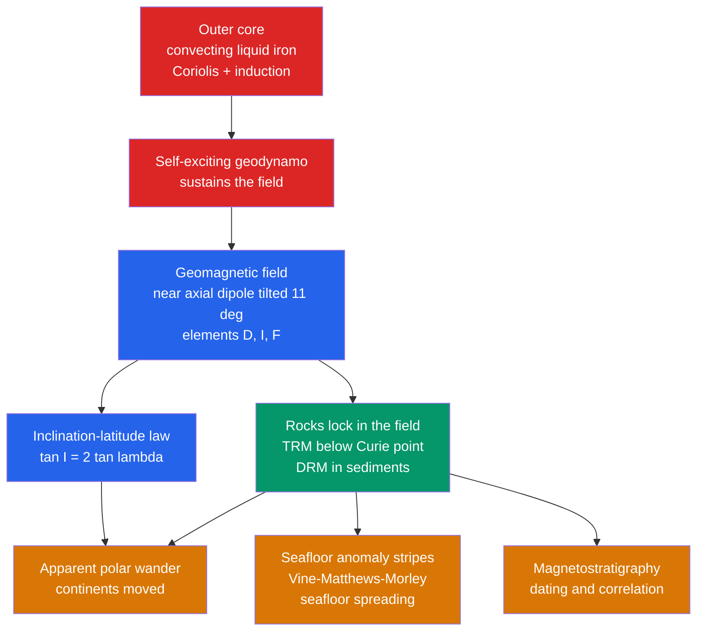

# 🧲 Geomagnetism and Paleomagnetism

> [!abstract] TL;DR
> Earth behaves like a giant bar magnet whose field is, to first order, a **geocentric axial dipole** tilted about $11^\circ$ from the rotation axis and described by **declination** and **inclination**, with the key relation $\tan I = 2\tan\lambda$ linking inclination to latitude. The field is not from a permanent magnet — the core is far too hot — but is generated by a self-exciting **geodynamo** in the convecting liquid-iron outer core. Rocks freeze in a record of the ancient field below the Curie point, and this **paleomagnetism** delivered two of the decisive proofs of plate tectonics: apparent polar wander paths (continents moved) and the symmetric magnetic stripes on the seafloor (seafloor spreading).

## Intuition — analogy FIRST

Imagine a compass needle that can also tip up and down, not just swing left and right. Near the equator the needle lies flat; as you walk toward the pole it dips ever more steeply downward until, over the magnetic pole, it stands vertical. That dip angle secretly encodes your latitude — which is why a lava flow, cooling and locking in the field like a photograph, is also recording *where on the planet it froze*. Read enough of those frozen photographs from rocks of different ages and you discover the astonishing fact that the continents have wandered across the globe.

Now flip the analogy inward. The "bar magnet" inside Earth is a fiction: it is really a churning ocean of molten iron acting like a natural dynamo — a self-sustaining electromagnet run by the planet's own heat and spin. Occasionally that dynamo stutters and reverses, swapping magnetic north and south, and every reversal is stamped into the rocks like a barcode we can read to tell time.

---

## How It Works



---

## Key Concepts / Details

### Secondary Level

**The field as a tilted dipole.** To a good first approximation Earth's magnetic field is a **geocentric axial dipole (GAD)** — as if a bar magnet sat at the centre aligned with the spin axis. In reality the best-fit dipole is tilted about $11^\circ$ from the rotation axis, so the *magnetic* poles do not coincide with the *geographic* poles. Note the polarity trap: the field's south pole is near the geographic *north*, which is why a compass needle's north-seeking end points north.

**The magnetic elements.** At any point the field vector is described by:

| Element | Symbol | Meaning |
|---------|--------|---------|
| Declination | $D$ | angle in the horizontal plane from geographic north to the field, east positive |
| Inclination (dip) | $I$ | angle the field vector dips below horizontal, positive downward |
| Total intensity | $F$ | magnitude of the field vector |
| Horizontal / vertical | $H,\ Z$ | horizontal and (downward) vertical components |

Surface strength ranges from about $25{,}000$ nT near the equator to about $65{,}000$ nT near the poles (a few tenths of a gauss) — thousands of times weaker than a fridge magnet.

**The inclination–latitude law.** For a dipole, the dip angle is tied to latitude by the single most useful equation in paleomagnetism:

$$\tan I = 2\tan\lambda$$

Flat ($I=0$) at the magnetic equator, vertical ($I=90^\circ$) at the pole. Measure $I$ in a rock and you recover its *paleolatitude*.

**Secular variation.** The field is not static: declination at a city drifts by degrees over centuries, the field is currently weakening by roughly $5\%$ per century, and the north dip pole is racing across the Arctic. These slow changes are called **secular variation**.

### Undergraduate Level

**Component relations.** With $D$ and $I$ the components are:

$$H = F\cos I,\qquad Z = F\sin I,\qquad \tan I = \frac{Z}{H}$$
$$X = H\cos D,\qquad Y = H\sin D,\qquad F^2 = X^2 + Y^2 + Z^2$$

**Deriving $\tan I = 2\tan\lambda$.** A magnetic dipole of moment $m$ produces, at Earth's surface radius $R$ and geomagnetic latitude $\lambda$, a downward (vertical) and a horizontal component:

$$Z = 2B_0\sin\lambda,\qquad H = B_0\cos\lambda,\qquad B_0 = \frac{\mu_0 m}{4\pi R^3}$$

Dividing gives $\tan I = Z/H = 2\tan\lambda$ directly. The total intensity is

$$F = B_0\sqrt{1 + 3\sin^2\lambda}$$

so the field is exactly **twice as strong at the poles as at the equator** — a purely geometric consequence of the dipole. This dipole geometry follows from magnetostatics; see [[Magnetism_and_Biot_Savart]].

**The geodynamo.** Earth's field is *generated*, not permanent. The outer core (roughly $2890$–$5150$ km depth) is liquid iron-nickel, an excellent electrical conductor, kept convecting by heat loss and by buoyant light elements released as the inner core freezes. Three ingredients make a dynamo:

1. **A conducting fluid in motion** — molten iron convecting.
2. **Induction** — moving the conductor through a magnetic field drives electric currents ([[Faradays_Law_and_Induction]]), whose own field reinforces the original: a *self-exciting* dynamo.
3. **The Coriolis force** — Earth's rotation twists the convection into helical columns roughly aligned with the spin axis, which is why the dipole axis sits close to the rotation axis.

Dynamo action requires the magnetic Reynolds number $R_m = UL/\eta$ (with magnetic diffusivity $\eta = 1/\mu_0\sigma$) to exceed a critical value of order tens.

**Why not a permanent magnet?** The core is at $\sim 4000$–$6000$ K, vastly above the **Curie temperature** of iron ($770^\circ\text{C} \approx 1043$ K). Above its Curie point a ferromagnet loses all permanent magnetisation. A frozen bar magnet is thermodynamically impossible down there — hence a dynamo is required.

**Paleomagnetism — how rocks remember.** Rocks lock in a fossil field:

- **Thermoremanent magnetization (TRM):** as an igneous rock cools below the Curie/blocking temperature of its magnetic minerals (magnetite $\approx 580^\circ\text{C}$, hematite $\approx 680^\circ\text{C}$), magnetic domains freeze aligned to the ambient field. A permanent snapshot of direction and (with care) intensity.
- **Detrital remanent magnetization (DRM):** in sediments, magnetic grains physically rotate to align with the field as they settle, recording it as the sediment lithifies.

**Reversals, excursions, and the GPTS.** The dipole occasionally **reverses** — magnetic north and south swap — over a transition of roughly $1$–$10$ kyr. Reversals are irregular: the last was the **Brunhes–Matuyama** boundary at $\sim 0.78$ Ma, yet the Cretaceous Normal Superchron ran $\sim 40$ Myr with none. Brief wanderings that return to the original polarity are **excursions** (e.g., Laschamp, $\sim 41$ ka). The ordered sequence of normal/reversed intervals (Brunhes, Matuyama, Gauss, Gilbert **chrons**, with shorter subchrons like Jaramillo and Olduvai) is the **Geomagnetic Polarity Time Scale (GPTS)**.

### Graduate Level

**Apparent polar wander (APW).** Sampling rocks of successively older age on one continent yields a track of paleomagnetic pole positions — an **apparent polar wander path**. Because the *time-averaged* field is axial-dipolar (the GAD hypothesis), the pole should be fixed; a moving pole is really the *continent* moving. Crucially, APW paths from different continents diverge but can be reassembled by closing past oceans — the paleomagnetic proof of continental drift. See [[Continental_Drift_and_the_Plate_Tectonics_Revolution]].

**Seafloor magnetic stripes.** New crust at a mid-ocean ridge cools through the Curie point and records the *current* polarity; spreading carries it symmetrically outward while reversals imprint alternating bands — a two-track tape recorder. This is the **Vine–Matthews–Morley hypothesis (1963)**, which converted seafloor spreading from proposal to proof and yields spreading rates from stripe widths. See [[Seafloor_Spreading_and_Ocean_Basins]] and [[Wilson_Cycle_and_Supercontinents]].

**Magnetostratigraphy.** Matching a section's normal/reversed pattern to the GPTS dates and correlates strata worldwide — indispensable where fossils or datable ash are absent.

**Spherical-harmonic (Gauss) representation.** Outside its sources the field is curl-free ($\nabla\times\mathbf{B}=0$; a magnetostatic limit of [[Maxwells_Equations]]), so it derives from a scalar potential expanded in spherical harmonics:

$$V(r,\theta,\phi) = R\sum_{l=1}^{\infty}\sum_{m=0}^{l}\left(\frac{R}{r}\right)^{l+1}\!\left[g_l^m\cos m\phi + h_l^m\sin m\phi\right]P_l^m(\cos\theta)$$

The $l=1$ terms are the **dipole** (the axial dipole is $g_1^0$); higher $l$ are the **non-dipole** field. Roughly $90\%$ of the surface field is dipolar. The Gauss coefficients $g_l^m,\ h_l^m$ are tabulated by the **IGRF** and updated for secular variation; westward drift ($\sim 0.2^\circ$/yr) of non-dipole features and the growing **South Atlantic Anomaly** are read directly from them.

**The magnetosphere and reversal dynamics.** The dipole carves out the **magnetosphere**, deflecting the solar wind at the magnetopause ($\sim 10\,R_E$ on the dayside), shielding the atmosphere and biosphere and trapping the Van Allen belts. Self-consistent MHD geodynamo simulations (Glatzmaier & Roberts, 1995) first reproduced spontaneous reversals, in which the dipole collapses and the transitional field becomes multipolar before rebuilding with opposite sign.

```python
import numpy as np
import matplotlib.pyplot as plt

# Geocentric axial dipole: magnetic inclination vs latitude, tan(I) = 2*tan(lambda)
lat = np.linspace(-90, 90, 361)                     # geomagnetic latitude, degrees
I = np.degrees(np.arctan(2 * np.tan(np.radians(lat))))

# Invert a measured inclination to recover paleolatitude
def paleolatitude(inclination_deg):
    """Back out geomagnetic paleolatitude from a measured rock inclination."""
    return np.degrees(np.arctan(np.tan(np.radians(inclination_deg)) / 2.0))

I_measured = 30.0                                    # a lava flow records I = +30 deg
lam = paleolatitude(I_measured)
print(f"Measured inclination  = {I_measured:.1f} deg")
print(f"Implied paleolatitude = {lam:.1f} deg")      # -> ~16.1 deg (near-equatorial)

plt.figure(figsize=(7, 5))
plt.plot(lat, I, lw=2, label=r'$\tan I = 2\tan\lambda$')
plt.axhline(0, color='k', lw=0.5); plt.axvline(0, color='k', lw=0.5)
plt.scatter([lam], [I_measured], color='red', zorder=5,
            label=f'sample: I={I_measured:.0f} deg -> lat={lam:.1f} deg')
plt.xlabel('Geomagnetic latitude (degrees)')
plt.ylabel('Inclination  I  (degrees)')
plt.title('Dipole inclination vs latitude (and paleolatitude inversion)')
plt.legend(); plt.grid(True, alpha=0.3); plt.tight_layout()
plt.show()
```

---

## Real-World Notes

- **Navigation and declination.** Every map and aircraft heading must correct magnetic bearings for local **declination**, which drifts with secular variation — charts carry an annual rate of change and are periodically re-issued.
- **The geodynamo shields life.** By standing off the solar wind, the field protects the atmosphere from erosion and the surface from charged-particle radiation; Mars, lacking an active dynamo, lost much of its atmosphere. See [[Earths_Internal_Heat_and_Geothermal_Gradient]] for the heat that drives the core convection.
- **Auroras and space weather.** Solar particles funnelled along field lines into the polar upper atmosphere produce auroras; magnetic storms can induce currents that trip power grids and disrupt satellites and GPS.
- **Reading the seafloor barcode.** The symmetric anomaly stripes are mapped by shipboard magnetometers and remain the primary way we assign ages and spreading rates to ocean crust ([[Seafloor_Spreading_and_Ocean_Basins]]).
- **Dating without fossils.** Magnetostratigraphy pins the ages of hominin-bearing and deep-sea sediments by correlating their reversal pattern to the GPTS.
- **Mineral and hazard exploration.** Magnetic surveys map buried ore bodies, igneous intrusions, and faults from the contrast between magnetic and non-magnetic rocks.

---

## Common Pitfalls

1. **Magnetic north vs the field's polarity.** The compass north-seeking end points to Earth's *magnetic north*, but the physical magnetic *pole* there is a field **south** pole. Reversals swap which is which.
2. **Magnetic pole ≠ geomagnetic pole ≠ geographic pole.** The dip pole (where $I=90^\circ$), the best-fit-dipole geomagnetic pole, and the spin axis are three distinct points; only the *time-averaged* field is truly axial (the GAD assumption).
3. **A single site's pole is not "the" pole.** Non-dipole field and secular variation bias any one spot-reading; robust paleopoles require averaging many sites over enough time to cancel secular variation.
4. **Assuming a permanent magnet at the core.** The core is far above iron's Curie point ($770^\circ\text{C}$), so it cannot hold permanent magnetisation — the field is dynamically generated and can reverse.
5. **Inclination shallowing in sediments.** Compaction of detrital sediments systematically flattens $I$, biasing paleolatitudes *too low* unless corrected — a classic error when using DRM records.
6. **Confusing excursions with reversals.** An excursion swings the field far off-axis but returns to the *same* polarity; only a completed reversal flips it — mislabelling them corrupts a GPTS correlation.

---

## Related Concepts

- [[_MOC_Earth_Structure_Geophysics|↑ Section MOC]]
- [[Earth_Formation_and_Differentiation]] — core formation and inner-core growth supply the buoyancy that powers the dynamo
- [[Earth_Internal_Structure]] — the liquid outer core is the seat of the geodynamo
- [[Seismology_and_Earthquakes]] — seismic waves reveal the very liquid-iron layer that generates the field
- [[Earths_Internal_Heat_and_Geothermal_Gradient]] — core cooling drives the convection behind the dynamo
- [[Gravity_Isostasy_and_the_Geoid]] — the other great potential field of the solid Earth, treated with the same spherical-harmonic machinery
- [[Seafloor_Spreading_and_Ocean_Basins]] — magnetic stripes confirmed spreading via Vine–Matthews–Morley
- [[Continental_Drift_and_the_Plate_Tectonics_Revolution]] — apparent polar wander paths proved the continents moved
- [[Wilson_Cycle_and_Supercontinents]] — paleomagnetic poles reconstruct past supercontinent configurations
- [[Magnetism_and_Biot_Savart]] — the dipole magnetostatics behind $\tan I = 2\tan\lambda$
- [[Faradays_Law_and_Induction]] — induction is the engine of the self-exciting geodynamo
- [[Maxwells_Equations]] — the source-free curl-free limit justifies the Gauss potential expansion
- [[_MOC_Mathematics_Master]] — spherical harmonics and differential equations behind field modelling

---

## Review Questions

1. **Secondary:** A lava flow records a magnetic inclination of $I = 45^\circ$. Using $\tan I = 2\tan\lambda$, at what geomagnetic latitude did it solidify? Would a flow that formed at the magnetic equator record a steep or a flat inclination?
2. **Undergraduate:** Explain why Earth's magnetic field cannot be due to a permanent magnet in the core, and outline the three ingredients a self-exciting geodynamo needs. Which of Maxwell's laws provides the induction that sustains it?
3. **Graduate:** Describe how the Vine–Matthews–Morley hypothesis links geomagnetic reversals, thermoremanent magnetization, and seafloor spreading to produce symmetric magnetic anomaly stripes. How would you extract a spreading rate from a measured stripe pattern, and what assumptions about the GAD field and the GPTS are you relying on?

---

## Sources

- Lowrie, W. — *Fundamentals of Geophysics*, 2nd ed., Ch. 5 (Geomagnetism and paleomagnetism)
- Merrill, McElhinny & McFadden — *The Magnetic Field of the Earth*, Academic Press
- Butler, R. F. — *Paleomagnetism: Magnetic Domains to Geologic Terranes* (freely available)
- Vine, F. J. & Matthews, D. H. (1963) — "Magnetic anomalies over oceanic ridges," *Nature* 199, 947
- Glatzmaier, G. A. & Roberts, P. H. (1995) — "A three-dimensional self-consistent computer simulation of a geomagnetic field reversal," *Nature* 377, 203

#earth-science #geophysics #geomagnetism #paleomagnetism #geodynamo #magnetic-reversals #plate-tectonics #secondary #undergraduate #graduate
