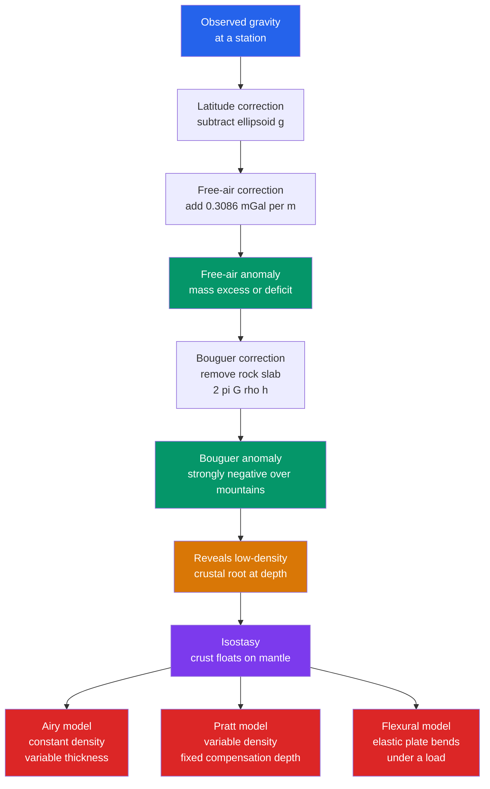

# ⚖️ Gravity, Isostasy and the Geoid

> [!abstract] TL;DR
> Earth's gravity field is not uniform: $g \approx 9.81$ m/s² but varies with latitude (rotation + equatorial bulge) and elevation. The **geoid** — the equipotential surface matching mean sea level — bulges and dips relative to the best-fit **ellipsoid** wherever mass is concentrated or deficient. Subtracting predictable effects yields **gravity anomalies** (free-air and Bouguer), and the strongly *negative* Bouguer anomalies over mountains reveal hidden low-density **crustal roots**. This is **isostasy**: the rigid lithosphere floats in buoyant equilibrium on the denser asthenosphere, either by varying thickness (**Airy**) or varying density (**Pratt**). Post-glacial rebound and satellite gravimetry (GRACE) let us watch isostasy happen in real time.

## Intuition — analogy FIRST

Drop ice cubes of different sizes into a glass of water. Every cube floats with the *same fraction* poking above the surface — but a taller cube also reaches *deeper* below the waterline. The visible height above water is always mirrored by a much larger hidden root beneath. Continents behave the same way: a mountain range standing 5 km high must be supported by a crustal "keel" tens of kilometres deep, because low-density crust (like ice) floats on the denser mantle (like water).

Now weigh yourself with an extremely sensitive scale on that mountain versus at the shore. You weigh *less* on the mountaintop — you are farther from Earth's centre, and there is a whole slab of rock below you whose pull you can measure. Geophysicists turn these tiny weight differences into a CT-scan of the crust.

---

## How It Works



---

## Key Concepts / Details

### Secondary Level

**Newton's law of gravitation** sets the stage. Between two masses,

$$F = G\frac{m_1 m_2}{r^2}, \qquad G = 6.674\times10^{-11}\ \text{N·m}^2/\text{kg}^2$$

At Earth's surface this gives the familiar acceleration

$$g = \frac{G M_\oplus}{R_\oplus^2} \approx \frac{(6.674\times10^{-11})(5.97\times10^{24})}{(6.371\times10^{6})^2} \approx 9.81\ \text{m/s}^2$$

**Why $g$ varies with latitude.** Earth is not a sphere but an oblate spheroid. Two effects both make $g$ *smaller* at the equator (~9.78 m/s²) than at the poles (~9.83 m/s²): (1) rotation supplies an outward centrifugal effect that partly cancels gravity at the equator, and (2) the resulting equatorial bulge places the equator ~21 km farther from Earth's centre.

**Why $g$ varies with elevation.** Climbing raises you away from the mass below, so $g$ drops by about **0.3086 mGal per metre** (1 mGal $= 10^{-5}$ m/s²). That is the *free-air* gradient.

**Floating balance.** Just as a big iceberg has a deep keel, tall mountains have deep crustal roots. Light crust ($\rho_c \approx 2.7$ g/cm³) floats on denser mantle ($\rho_m \approx 3.3$ g/cm³). This is **isostasy**.

### Undergraduate Level

**Ellipsoid vs geoid.** The **reference ellipsoid** (e.g. WGS84) is the best-fit rotating spheroid: equatorial radius 6378.14 km, polar radius 6356.75 km, flattening $f \approx 1/298.26$. The **geoid** is the *equipotential* surface of the real gravity field that coincides with undisturbed mean sea level. Where extra mass lies below, the equipotential is pulled outward (a geoid *high*); where mass is deficient, it dips. **Geoid undulations** $N$ range from about $-106$ m (the Indian Ocean low south of India) to $+85$ m (near New Guinea). Heights relate as $h = H + N$, where $h$ is ellipsoidal (GPS) height and $H$ is orthometric height above the geoid.

Normal gravity on the ellipsoid follows the international gravity formula:

$$\gamma(\phi) \approx 9.780327\left(1 + 0.0053024\sin^2\phi - 0.0000058\sin^2 2\phi\right)\ \text{m/s}^2$$

**Gravity anomalies.** Subtract the predictable ellipsoid value $\gamma$ from a measurement to isolate the interesting mass signal.

- **Free-air anomaly** — correct only for station height:
$$\Delta g_{FA} = g_{obs} - \gamma + 0.3086\,h \quad (h\ \text{in m, result in mGal})$$
- **Bouguer anomaly** — additionally remove the attraction of the rock slab between the station and sea level (the **Bouguer slab**, $2\pi G\rho h = 0.0419\,\rho h$ mGal, plus a terrain correction):
$$\Delta g_{B} = \Delta g_{FA} - 0.0419\,\rho\,h \quad (\rho\ \text{in g/cm}^3)$$

Over mountains the Bouguer anomaly is strongly **negative** (often $-200$ to $-400$ mGal). The topography's mass has been removed by the correction, so the remaining deficit can only come from a **low-density crustal root** displacing dense mantle at depth — direct evidence of isostatic compensation.

**Airy model** (constant density $\rho_c$, variable crustal thickness). Balancing pressure at the depth of compensation, a mountain of height $h$ requires a root of depth

$$r = \frac{\rho_c}{\rho_m - \rho_c}\,h$$

With $\rho_c = 2.7$, $\rho_m = 3.3$ the root is $4.5\times$ the height. Ocean basins get "anti-roots" (thin crust).

**Pratt model** (constant compensation depth $D$, variable density). Every column has the same mass above $D$, so taller topography is *less dense*:

$$\rho_h = \rho_c\,\frac{D}{D+h}$$

| Feature | Airy | Pratt |
|---------|------|-------|
| What varies | Crustal **thickness** | Crustal **density** |
| Compensation depth | Base of root (variable) | Fixed $D$ |
| Mountains have… | Deep low-density roots | Anomalously low-density rock |
| Best for | Orogenic belts, continents | Mid-ocean ridges, some plateaus |

The **isostatic anomaly** (Bouguer anomaly corrected for the predicted root) is near zero where compensation is complete — a test of whether a region "floats freely."

### Graduate Level

**Flexural isostasy.** Local Airy/Pratt columns assume zero rigidity. Real lithosphere behaves as a thin **elastic plate** that distributes a load laterally, so narrow loads (volcanoes, ice caps, sediment wedges) are *regionally* supported. The 1-D flexure equation for deflection $w(x)$ under load $q(x)$ is

$$D\,\frac{d^4 w}{dx^4} + \left(\rho_m - \rho_{infill}\right)g\,w = q(x)$$

where the **flexural rigidity** is

$$D = \frac{E\,T_e^{\,3}}{12\left(1-\nu^2\right)}$$

with Young's modulus $E$, Poisson's ratio $\nu$, and **effective elastic thickness** $T_e$. Because $D\propto T_e^3$, the flexural wavelength (the parameter $\alpha = [4D/(\rho_m - \rho_w)g]^{1/4}$) is a sensitive probe of lithospheric strength — old, cold oceanic plate has $T_e \sim 30\text{–}40$ km, while young or hot lithosphere is weak.

**Glacial isostatic adjustment (GIA).** Mantle flow beneath a removed load is not instantaneous; the relaxation is governed by mantle viscosity ($\sim 10^{21}$ Pa·s). Ongoing uplift in Fennoscandia and around Hudson Bay reaches ~**10 mm/yr** — a natural experiment that constrains mantle rheology.

**Satellite gravimetry.** The **GRACE** mission (2002–2017) and **GRACE-FO** (2018–) fly twin satellites and measure micron-scale changes in their separation to map *time-variable* gravity. This reveals mass change: Greenland (~280 Gt/yr loss) and Antarctic ice loss, groundwater depletion in northern India and California's Central Valley, and the residual GIA signal itself.

```python
import numpy as np

# --- Airy isostasy: crustal root beneath a mountain ---
# Buoyancy balance at the depth of compensation gives:
#     r = rho_c / (rho_m - rho_c) * h
# A tall, light mountain must be balanced by a deep low-density root.
rho_c = 2.70   # g/cm^3, continental crust
rho_m = 3.30   # g/cm^3, upper mantle / asthenosphere

def airy_root(h_km, rho_c=2.70, rho_m=3.30):
    """Root depth (km) below the normal crust for a mountain of height h_km."""
    return rho_c / (rho_m - rho_c) * h_km

print("Airy isostatic roots (rho_c=2.7, rho_m=3.3):")
for h in [1.0, 2.0, 4.5, 8.85]:      # 8.85 km ~ Everest summit
    r = airy_root(h)
    print(f"  h = {h:5.2f} km  ->  root = {r:6.2f} km  (root/height = {r/h:.1f})")

# --- Bouguer slab: gravitational pull of the topographic mass (mGal) ---
G = 6.674e-11
def bouguer_slab_mGal(h_m, rho=2670.0):
    """Attraction of an infinite slab, thickness h_m (m), density rho (kg/m^3)."""
    return 2 * np.pi * G * rho * h_m * 1e5   # m/s^2 -> mGal is x1e5

h_plateau = 4500.0
print(f"\nBouguer slab pull of a {h_plateau:.0f} m plateau: "
      f"{bouguer_slab_mGal(h_plateau):.0f} mGal  (~ magnitude of the anomaly)")

# --- Post-glacial rebound: equilibrium uplift after ice removal ---
rho_ice = 0.917                       # g/cm^3
h_ice   = 3000.0                      # m of ice removed (Fennoscandian sheet)
rebound = rho_ice / rho_m * h_ice     # equilibrium isostatic rise
print(f"\nEquilibrium rebound after removing {h_ice:.0f} m of ice: {rebound:.0f} m")
# Expected: 4.5 km mountain -> ~20 km root; ~3 km of ice -> ~830 m of rebound
```

---

## Real-World Notes

- **The Himalaya and Tibet** show ~$-400$ mGal Bouguer anomalies and crustal thickness up to ~70 km (double the normal ~35 km). Pure local Airy predicts a large root, but the *observed* root exceeds it because the load is partly **flexurally** supported by the strong Indian plate underthrusting Tibet — see [[Subduction_Zones_and_Mountain_Building]].
- **Fennoscandia and Hudson Bay** are still rising ~10 mm/yr, 10,000+ years after their ice sheets melted. Raised beaches and tide-gauge trends record hundreds of metres of completed and remaining rebound — a live demonstration of isostasy linked to [[Glaciers_and_Glacial_Landscapes]].
- **Hawaii** loads the Pacific plate with basaltic volcanoes; the plate flexes downward into a surrounding **moat** and rises in a peripheral **arch**, the textbook signature of flexural (not local) isostasy.
- **The Indian Ocean geoid low** — a ~106 m depression south of India — reflects deep mantle density structure, reminding us the geoid maps mass anomalies from crust to core–mantle boundary.
- **GRACE** turned gravity into a scale for the planet: it weighed the accelerating mass loss of the Greenland and Antarctic ice sheets and exposed catastrophic groundwater depletion in the northwestern Indian aquifers.
- **Petroleum and mineral exploration** routinely uses gravity surveys: dense ore bodies give positive Bouguer anomalies, while low-density salt domes and sedimentary basins give negative ones.

---

## Common Pitfalls

1. **Confusing the geoid with the ellipsoid.** The ellipsoid is a smooth mathematical reference; the geoid is the physical equipotential (mean sea level). GPS gives *ellipsoidal* height $h$, but "height above sea level" is *orthometric* height $H = h - N$.
2. **Sign of the free-air correction.** You *add* $0.3086\,h$ back because raising the station *reduced* the measured gravity — the correction restores it to the datum. Getting the sign backwards flips the anomaly.
3. **Free-air vs Bouguer confusion.** The free-air anomaly still *includes* the pull of the topographic mass; the Bouguer anomaly *removes* it. Over an isostatically compensated mountain the free-air anomaly is near zero while the Bouguer anomaly is strongly negative — both are correct, they answer different questions.
4. **Assuming isostasy is instantaneous.** Compensation requires viscous mantle flow over thousands of years. Regions loaded or unloaded recently (deglaciated shields, growing deltas) are *not* in equilibrium — that disequilibrium is the very signal GIA studies exploit.
5. **Treating all support as local (Airy/Pratt).** Narrow loads are held up by the plate's flexural strength, not a local root. Applying Airy to a volcano or a sediment wedge badly misestimates crustal structure; you need the elastic-plate model.
6. **Density units.** The Bouguer coefficient $0.0419\,\rho$ mGal/m expects $\rho$ in g/cm³; using kg/m³ inflates the correction by 1000×.

---

## Related Concepts

- [[_MOC_Earth_Structure_Geophysics|↑ Section MOC]]
- [[Earth_Internal_Structure]] — the crust–mantle–core layering whose densities isostasy balances
- [[Earth_Formation_and_Differentiation]] — how gravitational sorting built the layered, density-stratified Earth
- [[Seismology_and_Earthquakes]] — seismic velocities give the independent crustal-thickness picture gravity confirms
- [[Earths_Internal_Heat_and_Geothermal_Gradient]] — temperature controls mantle viscosity, hence the rate of isostatic rebound
- [[Geomagnetism_and_Paleomagnetism]] — the other great potential field mapped from surface and satellite
- [[Subduction_Zones_and_Mountain_Building]] — where roots, flexure, and topography are built together
- [[Glaciers_and_Glacial_Landscapes]] — the loads whose removal drives post-glacial rebound
- **Physics** — [[Newtons_Laws_and_Kinematics]] (gravitation and $g$), [[Work_Energy_and_Conservation]] (buoyant potential energy of a floating lithosphere), [[Gauss_Law_and_Electric_Potential]] (the same potential-field mathematics, applied to gravity)
- **Mathematics** — [[_MOC_Mathematics_Master]] (potential theory, the biharmonic flexure equation, spherical harmonics of the geoid)

---

## Review Questions

1. **Secondary**: Why does a bathroom scale read slightly *less* at the top of a mountain than at sea level? Give the two distinct reasons and state which gravity correction each corresponds to.
2. **Undergraduate**: A plateau rises 4.5 km with crustal density 2.7 g/cm³ over mantle of 3.3 g/cm³. (a) Compute the Airy root depth. (b) Sketch the expected free-air and Bouguer anomalies across the plateau and explain their opposite signs.
3. **Graduate**: A chain of oceanic volcanoes produces a much broader gravity/topography signal than local Airy compensation predicts. Explain using flexural rigidity $D = E T_e^3 / [12(1-\nu^2)]$ how you would invert the observed flexural wavelength for the effective elastic thickness $T_e$, and what $T_e$ tells you about plate age.

---

## Sources

- Fowler — *The Solid Earth: An Introduction to Global Geophysics*, 2nd ed., Ch. 5 (gravity & isostasy)
- Turcotte & Schubert — *Geodynamics*, 3rd ed., Ch. 3 (elasticity & flexure), Ch. 5 (gravity)
- Lowrie & Fichtner — *Fundamentals of Geophysics*, 3rd ed., Ch. 2
- Tapley et al. (2004) — "GRACE measurements of mass variability in the Earth system," *Science* 305, 503

#earth-science #geophysics #gravity #isostasy #geoid #bouguer #flexure #GRACE #undergraduate #graduate
