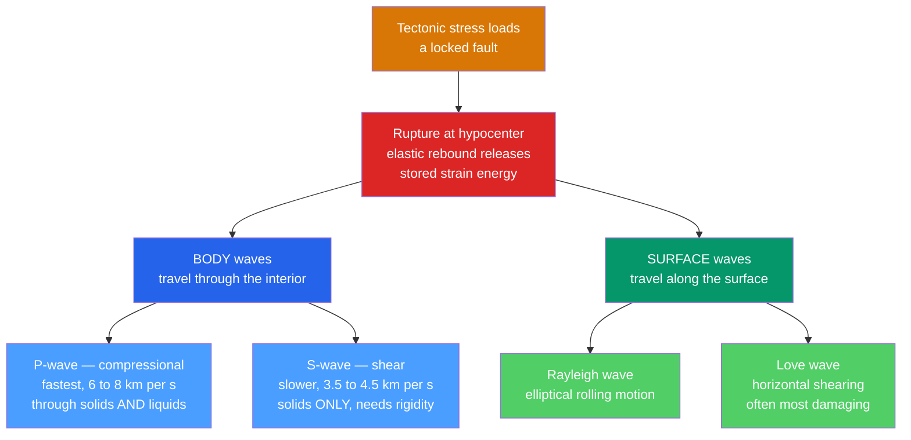

# 🌊 Seismology and Earthquakes

> [!abstract] TL;DR
> An earthquake is the sudden release of elastic strain energy stored on a locked fault (**elastic rebound theory**). The rupture radiates **seismic waves**: fast **P-waves** (compressional, travel through solids *and* liquids), slower **S-waves** (shear, *cannot* cross liquids), and the slowest, most destructive **surface waves** (Rayleigh and Love). Because wave speed depends on the medium ($v=\sqrt{\text{modulus}/\rho}$), these waves are also Earth's CT scanner — the **S-wave shadow zone** beyond $103°$ proves the outer core is liquid. We locate an earthquake by triangulating **S–P arrival-time differences** and measure its size with the physically-grounded **moment magnitude** $M_w$, where each unit is a $\sim32\times$ jump in energy.

## Intuition — analogy FIRST

Bend a wooden ruler slowly between your hands. It stores elastic energy, deforming smoothly — and then *snaps*, releasing all that energy at once as a sharp crack and a stinging vibration in your palms. A fault is a ruler the size of a mountain range. Tectonic plates load it for centuries; friction holds the two sides locked while strain quietly accumulates. When the stress finally exceeds the fault's strength, it ruptures, the rock springs back to its unstrained shape (**elastic rebound**), and the stored energy screams outward as seismic waves.

Now imagine tapping one end of that ruler and a bowl of water. The tap travels through both — but a *twisting* shake only propagates through the rigid ruler, not the water. That is exactly why P-waves reach the far side of the planet and S-waves do not: the outer core is liquid, and liquids have no shear strength.

---

## How It Works



---

### Secondary Level

**Elastic rebound theory.** Proposed by H.F. Reid after the 1906 San Francisco earthquake. Crustal blocks on either side of a fault move slowly (driven by plate motion), but friction locks the fault surface. Elastic strain builds in the rocks like a bent spring. When stress exceeds the fault's frictional strength, the fault slips suddenly, the rock rebounds toward its unstrained position, and the released energy radiates as seismic waves. The cycle then repeats — this is why faults produce **repeating** earthquakes.

**Focus vs epicenter.**
- **Focus (hypocenter):** the point *at depth* where rupture begins.
- **Epicenter:** the point on the surface *directly above* the focus.
- **Foreshocks** may precede the main shock; **aftershocks** follow it for days to years as the crust re-adjusts.

**The four wave types.**

| Wave | Class | Ground motion | Typical crustal speed | Travels through |
|------|-------|---------------|-----------------------|-----------------|
| **P** (primary) | body, compressional | push–pull, *parallel* to travel | $\sim6$ km/s (5–8) | solids **and** liquids |
| **S** (secondary) | body, shear | side-to-side, *perpendicular* to travel | $\sim3.5$ km/s (3–4.5) | **solids only** |
| **Love** | surface | horizontal shearing | $\sim3$–$4.5$ km/s | along the surface |
| **Rayleigh** | surface | elliptical rolling ($\approx0.9\,V_s$) | slowest | along the surface |

P arrives first, S next, and the large-amplitude surface waves last — they decay slowly with distance and cause most structural damage.

**Measuring size — intensity vs magnitude.**
- **Intensity** (Modified Mercalli, I–XII) is *qualitative*: it describes shaking and damage at a *place*, so it varies with distance, geology, and construction.
- **Magnitude** is a *single instrumental number* for the whole event. The original **Richter local magnitude** $M_L$ measures the log of the largest seismogram amplitude. Each whole unit is $\sim10\times$ larger amplitude and $\sim32\times$ more energy.

### Undergraduate Level

**Why P is fast and S cannot cross liquids.** Seismic waves obey the elastic wave equation, so speed is set by an elastic modulus and density (see [[Wave_Motion_and_Properties]]):

$$V_p = \sqrt{\frac{K + \tfrac{4}{3}\mu}{\rho}}, \qquad V_s = \sqrt{\frac{\mu}{\rho}}$$

where $K$ is the bulk modulus, $\mu$ the shear (rigidity) modulus, and $\rho$ density. Because $V_p$ includes the extra $\tfrac{4}{3}\mu$ term, it is always faster. In a fluid $\mu = 0$, so $V_s = 0$ — **S-waves vanish in the liquid outer core**, while $V_p$ merely drops. For a Poisson solid the ratio is fixed at

$$\frac{V_p}{V_s} = \sqrt{3} \approx 1.73,$$

which is why the S–P time gap grows linearly with distance.

**Locating an earthquake from S–P timing.** Since P and S leave the focus together but travel at different speeds, the gap between their arrivals is proportional to distance:

$$\Delta t_{S-P} = \frac{d}{V_s} - \frac{d}{V_p} \;\Longrightarrow\; d = \Delta t_{S-P}\cdot\frac{V_p\,V_s}{V_p - V_s}.$$

A rule of thumb near the surface: $d \approx 8\,\text{km} \times \Delta t_{S-P}$ (seconds). One station gives a *radius* only. Draw a distance circle around **three** stations; they intersect at the epicenter — **triangulation**.

**Seismic waves image the interior.** Waves **refract** (bend) and **reflect** at discontinuities where velocity jumps (Moho, 410/660 km transitions, core–mantle boundary). Plotting arrival time against epicentral distance gives **travel-time curves**, whose slope is the *slowness* $1/v$. The decisive evidence for Earth's structure:
- **S-wave shadow zone** ($>103°$ from the epicenter): S-waves are absent beyond $103°$ because they cannot pass through the liquid outer core — direct proof the core is molten (Oldham, Gutenberg).
- **P-wave shadow zone** ($103°$–$143°$): P-waves are refracted sharply *downward* at the core–mantle boundary, leaving a ring where they do not arrive.

**Moment magnitude — the modern scale.** $M_L$ and body-wave scales **saturate**: above $\sim M\,7$ they stop increasing even for far larger earthquakes, because their fixed-period amplitude cannot capture a huge, long-duration rupture. Moment magnitude fixes this by measuring the physical **seismic moment**:

$$M_0 = \mu\,A\,D$$

where $\mu$ is the fault-zone rigidity ($\sim3\times10^{10}$ Pa), $A$ the rupture area, and $D$ the average slip. Then (Hanks & Kanamori, SI units, $M_0$ in N·m):

$$\boxed{\,M_w = \tfrac{2}{3}\log_{10}M_0 - 6.07\,}$$

Radiated energy scales as $\log_{10}E \approx 1.5\,M + 4.8$ (J), so a one-unit magnitude increase means $10^{1.5}\approx 31.6\times$ more energy — the "$\sim32\times$ per unit" rule.

### Graduate Level

**Focal mechanisms and the double-couple source.** An earthquake radiation pattern is modeled as a **double couple** of forces equivalent to slip on a plane. Projecting the compressional/dilatational first-motion quadrants onto a lower-hemisphere stereonet produces the **"beachball" diagram**. It reveals the fault geometry (strike, dip, rake) and distinguishes normal, reverse, and strike-slip faulting — but has an inherent ambiguity between the true fault plane and its perpendicular *auxiliary plane*.

**Seismic tomography.** Just like a medical CT scan, travel-time *residuals* from thousands of ray paths crossing the mantle are inverted for a 3-D velocity field. Slow regions map hot upwellings (plumes); fast regions map cold subducted slabs (see [[Earth_Internal_Structure]] and [[Subduction_Zones_and_Mountain_Building]]).

**Spectral analysis of seismograms.** A seismogram is a time series; its physics lives in the frequency domain (see [[Fourier_Transform]] and [[Oscillations_and_SHM]]). The displacement amplitude spectrum is flat at low frequency (its plateau $\Omega_0$ fixes $M_0$) and falls off as $\omega^{-2}$ above a **corner frequency** $f_c$ that scales inversely with rupture size (Brune model). At the longest periods, an entire planet rings like a bell in discrete **normal modes** (free oscillations), whose split frequencies constrain deep density and anisotropy. Interference of scattered phases also underlies imaging (see [[Interference_and_Diffraction]]).

```python
import numpy as np

# ---- Locate an epicenter from S-minus-P arrival-time differences ----
# Typical continental-crust velocities
Vp = 6.0   # P-wave speed (km/s)
Vs = 3.5   # S-wave speed (km/s)

# dt = d/Vs - d/Vp  ->  d = dt * (Vp*Vs)/(Vp - Vs)
def distance_from_sp(dt):
    return dt * (Vp * Vs) / (Vp - Vs)

# Three seismic stations in a local flat-Earth frame (km)
stations = np.array([[0.0,  0.0],
                     [80.0, 0.0],
                     [0.0,  90.0]])

# Generate synthetic observations from a known "true" epicenter
true_epi = np.array([30.0, 40.0])
true_d   = np.linalg.norm(stations - true_epi, axis=1)
sp_times = true_d * (1.0/Vs - 1.0/Vp)            # observed S-P gaps (s)

# --- Invert: turn each S-P gap into a distance circle, then triangulate ---
d = distance_from_sp(sp_times)

# Subtract station 0's circle equation from the others to linearise:
#   (x-xi)^2 + (y-yi)^2 = di^2   ->   A [x, y]^T = b
x0, y0, d0 = stations[0, 0], stations[0, 1], d[0]
A, b = [], []
for (xi, yi), di in zip(stations[1:], d[1:]):
    A.append([2 * (xi - x0), 2 * (yi - y0)])
    b.append((xi**2 - x0**2) + (yi**2 - y0**2) - (di**2 - d0**2))
epicenter, *_ = np.linalg.lstsq(np.array(A), np.array(b), rcond=None)

print("S-P intervals (s):        ", np.round(sp_times, 2))
print("Epicentral distances (km):", np.round(d, 1))
print("Recovered epicenter (km): ", np.round(epicenter, 2))
print("True epicenter (km):      ", true_epi)

# ---- Bonus: moment magnitude from the seismic moment M0 = mu * A * D ----
mu   = 3.0e10        # shear modulus of crust (Pa)
area = 50e3 * 20e3   # rupture area 50 km x 20 km (m^2)
slip = 3.0           # average fault slip (m)
M0 = mu * area * slip                      # seismic moment (N*m)
Mw = (2.0 / 3.0) * np.log10(M0) - 6.07     # Hanks-Kanamori (SI)
print(f"\nSeismic moment M0 = {M0:.2e} N*m  ->  Mw = {Mw:.2f}")
```

---

## Real-World Notes

- **Earthquake early warning** (Japan's UREDAS, US ShakeAlert, Mexico's SASMEX) exploits the P/S speed gap: it detects the harmless fast P-wave and issues alerts seconds *before* the destructive S and surface waves arrive — enough to halt trains and elevators.
- **Great subduction earthquakes** (2004 Sumatra $M_w\,9.1$, 2011 Tōhoku $M_w\,9.0$) are only correctly sized by $M_w$; older magnitude scales saturated near 8. Their vertical seafloor displacement is what generates **tsunamis**.
- **Ground shaking is amplified by soft soils.** Loose water-saturated sediment can undergo **liquefaction**, temporarily behaving like a fluid — a major cause of foundation failure (Christchurch 2011, Niigata 1964).
- **The core was discovered by absence.** Inge Lehmann inferred the *solid inner* core in 1936 from faint P-waves appearing inside the P-wave shadow zone, refracted off the inner-core boundary.
- **Aftershocks decay predictably.** Their rate falls as $\sim1/t$ (Omori's law), and the number of events versus magnitude follows the Gutenberg–Richter law $\log_{10}N = a - bM$ with $b\approx1$.
- **Induced seismicity:** wastewater injection and reservoir impoundment can unclamp faults and trigger earthquakes (Oklahoma's swarm since 2009), directly demonstrating the elastic-rebound stress balance.

---

## Common Pitfalls

1. **Confusing focus with epicenter.** Depth matters: a shallow $M\,6$ can be far more destructive than a deep $M\,7$, because energy dissipates before reaching the surface.
2. **Assuming magnitude scales are linear.** Each unit is $\sim10\times$ amplitude and $\sim32\times$ energy. An $M\,7$ releases about *1000×* the energy of an $M\,5$, not $1.4\times$.
3. **Treating Richter as universal.** $M_L$ saturates above $\sim7$ and was calibrated for Southern California. Report great earthquakes in $M_w$, not "Richter."
4. **Mixing up intensity and magnitude.** Mercalli intensity (Roman numerals, location-dependent) is *not* a magnitude; one earthquake has *one* magnitude but *many* intensities.
5. **Forgetting P-waves cross liquids.** Only *S*-waves are stopped by the liquid outer core. The P-wave shadow zone ($103°$–$143°$) is caused by *refraction*, not blockage.
6. **Mismatched units in $M_w$.** The constant $-6.07$ assumes $M_0$ in N·m (SI). The classic Kanamori form uses $-10.7$ when $M_0$ is in dyne·cm — do not mix them.

---

## Related Concepts

- [[_MOC_Earth_Structure_Geophysics|↑ Section MOC]]
- [[Earth_Internal_Structure]] — seismic shadow zones and travel times are the primary evidence for the crust–mantle–core layering
- [[Earth_Formation_and_Differentiation]] — differentiation produced the liquid iron outer core that S-waves cannot cross
- [[Earths_Internal_Heat_and_Geothermal_Gradient]] — the heat engine that drives the plate motions loading faults
- [[Geomagnetism_and_Paleomagnetism]] — the same liquid outer core revealed by seismology generates the geodynamo
- [[Gravity_Isostasy_and_the_Geoid]] — complementary geophysical probe of subsurface density
- [[Plate_Boundaries_and_Plate_Motions]] — plate boundaries are where the fault stress that causes earthquakes accumulates
- [[Subduction_Zones_and_Mountain_Building]] — source of the largest earthquakes and deep-focus seismicity
- **Physics** — [[Wave_Motion_and_Properties]] ($v=\sqrt{\text{modulus}/\rho}$), [[Oscillations_and_SHM]] (normal modes / free oscillations), [[Interference_and_Diffraction]] (scattered-phase imaging)
- **Signals** — [[Fourier_Transform]] — spectral analysis of seismograms and source spectra
- **Mathematics** — [[_MOC_Mathematics_Master]] — the inverse problem and least-squares triangulation

---

## Review Questions

1. **Secondary:** A seismograph records the P-wave 45 s before the S-wave. Using the rule $d \approx 8\,\text{km} \times \Delta t_{S-P}$, how far away is the epicenter? Why does one station alone still leave the location ambiguous?
2. **Undergraduate:** Given $V_p = 6.0$ km/s and $V_s = 3.5$ km/s, derive the exact epicentral distance for a $30$ s S–P gap. Then explain, using $V_s=\sqrt{\mu/\rho}$, precisely why the S-wave shadow zone beyond $103°$ proves the outer core is liquid.
3. **Graduate:** A fault ruptures over an area of $60 \times 25$ km with $4$ m average slip and $\mu = 3.3\times10^{10}$ Pa. Compute the seismic moment and $M_w$. Then explain how a beachball focal mechanism would distinguish whether this was a thrust or strike-slip event, and what the auxiliary-plane ambiguity means for interpretation.

---

## Sources

- Stein & Wysession — *An Introduction to Seismology, Earthquakes, and Earth Structure* (2003)
- Shearer — *Introduction to Seismology*, 2nd ed. (2009)
- Lay & Wallace — *Modern Global Seismology* (1995)
- Hanks, T.C. & Kanamori, H. (1979) — "A Moment Magnitude Scale," *JGR* 84, 2348
- USGS Earthquake Hazards Program — magnitude, intensity, and shadow-zone references

#earth-science #geophysics #seismology #earthquakes #seismic-waves #moment-magnitude #secondary #undergraduate #graduate
