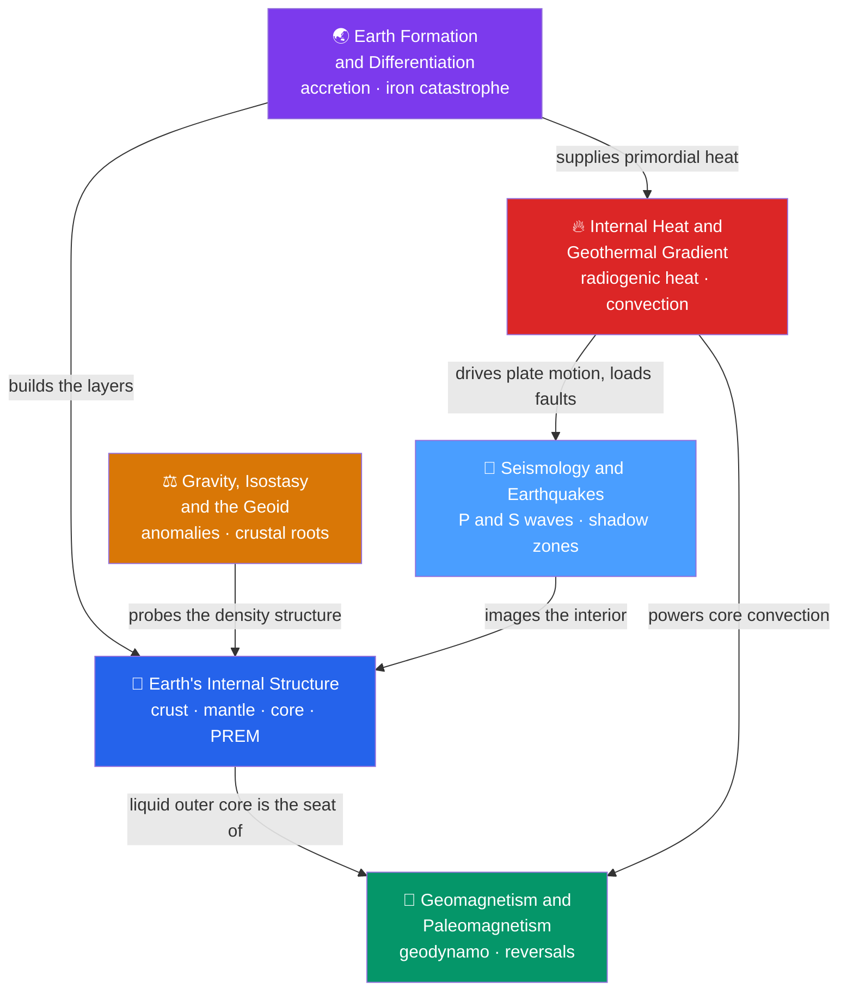

# 🌐 Earth Structure & Geophysics — Map of Content

> [!abstract] What This Section Covers
> This section tells the solid-Earth story from the inside out: how the planet **formed and differentiated** into a layered body, what those **layers** actually are (crust, mantle, core; lithosphere and asthenosphere; PREM), and the four great geophysical probes that let us "see" an interior no drill can reach. **Seismology** turns every earthquake into a CT scan, **internal heat** runs the engine that drives convection and plate tectonics, **geomagnetism** records the geodynamo and the paleomagnetic proofs of drift, and **gravity, isostasy, and the geoid** weigh the crust and watch it float. Each note opens with an everyday analogy and deepens from secondary level through undergraduate theory to graduate-level formalism and active research frontiers.

## Concept Map

*(Purple = origin, blue = the layered planet and its seismic probe, red = the heat engine, green = the geodynamo, orange = the gravity field. Arrows read "builds / images / powers".)*

## Learning Path

*Recommended order for a first pass through this section (the solid-Earth / geophysics track):*

1. [[Earth_Formation_and_Differentiation]] — how accretion and the iron catastrophe sorted a hot young planet into core, mantle, and crust.
2. [[Earth_Internal_Structure]] — the layered result: compositional vs mechanical layers, the three discontinuities, and PREM.
3. [[Seismology_and_Earthquakes]] — elastic rebound, P/S/surface waves, magnitude, and the shadow zones that reveal the layers.
4. [[Earths_Internal_Heat_and_Geothermal_Gradient]] — the primordial + radiogenic heat budget, the geotherm vs adiabat, and mantle convection.
5. [[Geomagnetism_and_Paleomagnetism]] — the geodynamo, the inclination–latitude law, reversals, and the paleomagnetic proofs of plate tectonics.
6. [[Gravity_Isostasy_and_the_Geoid]] — gravity anomalies, the geoid, Airy/Pratt/flexural isostasy, and satellite gravimetry.

## All Notes at a Glance

| Note | Difficulty | One-line summary |
|------|------------|------------------|
| [[Earth_Formation_and_Differentiation]] | Secondary → Graduate | Accretion ~4.56 Ga, the iron catastrophe, Goldschmidt affinities, the Theia giant impact, and Hf–W / Pb–Pb dating of core formation. |
| [[Earth_Internal_Structure]] | Secondary → Graduate | Crust–mantle–core vs lithosphere–asthenosphere, the Moho/Gutenberg/Lehmann discontinuities, and the PREM density and velocity profile. |
| [[Seismology_and_Earthquakes]] | Secondary → Graduate | Elastic rebound, P/S/Rayleigh/Love waves, S–P triangulation, moment magnitude, and shadow zones proving a liquid outer core. |
| [[Earths_Internal_Heat_and_Geothermal_Gradient]] | Secondary → Graduate | The ~47 TW heat budget, radiogenic isotopes, conduction/convection/advection, the adiabat, and half-space cooling of the seafloor. |
| [[Geomagnetism_and_Paleomagnetism]] | Secondary → Graduate | The tilted axial dipole and tan I = 2 tan λ, the self-exciting geodynamo, reversals and the GPTS, and paleomagnetic proofs of drift. |
| [[Gravity_Isostasy_and_the_Geoid]] | Secondary → Graduate | Why g varies, geoid vs ellipsoid, free-air and Bouguer anomalies, Airy/Pratt/flexural isostasy, rebound, and GRACE gravimetry. |

## Key Questions This Section Answers

- How did a uniform cloud of dust become a planet neatly sorted into a metallic core, a rocky mantle, and a thin crust?
- If no one has ever drilled past the crust, how do we know Earth is layered — and that its outer core is liquid?
- What powers earthquakes, and how does a single number ($M_w$) capture events from a tremor to a magnitude-9 megathrust?
- Where does Earth's internal heat come from, and why does naively extrapolating the crustal geothermal gradient give absurd core temperatures?
- Why does Earth have a magnetic field at all when its core is far too hot to be a permanent magnet — and how do rocks remember ancient fields?
- Why do tall mountains hide deep low-density roots, and how do gravity anomalies and the geoid let us weigh the crust from orbit?

## Related Sections

- [[_MOC_Earth_Science_Master|↑ Earth Science Master MOC]]
- [[_MOC_Plate_Tectonics|→ Plate Tectonics & Geodynamics]] — the lithosphere/asthenosphere contrast, mantle convection, and paleomagnetic stripes carry this section straight into the unifying theory.
- **Physics** — [[Wave_Motion_and_Properties]] and [[Oscillations_and_SHM]] underlie seismology; [[Laws_of_Thermodynamics]] governs the heat engine; [[Magnetism_and_Biot_Savart]] and [[Faradays_Law_and_Induction]] explain the geodynamo; [[Radioactive_Decay]] powers internal heat and dating.

#MOC #EarthScience #Geophysics
