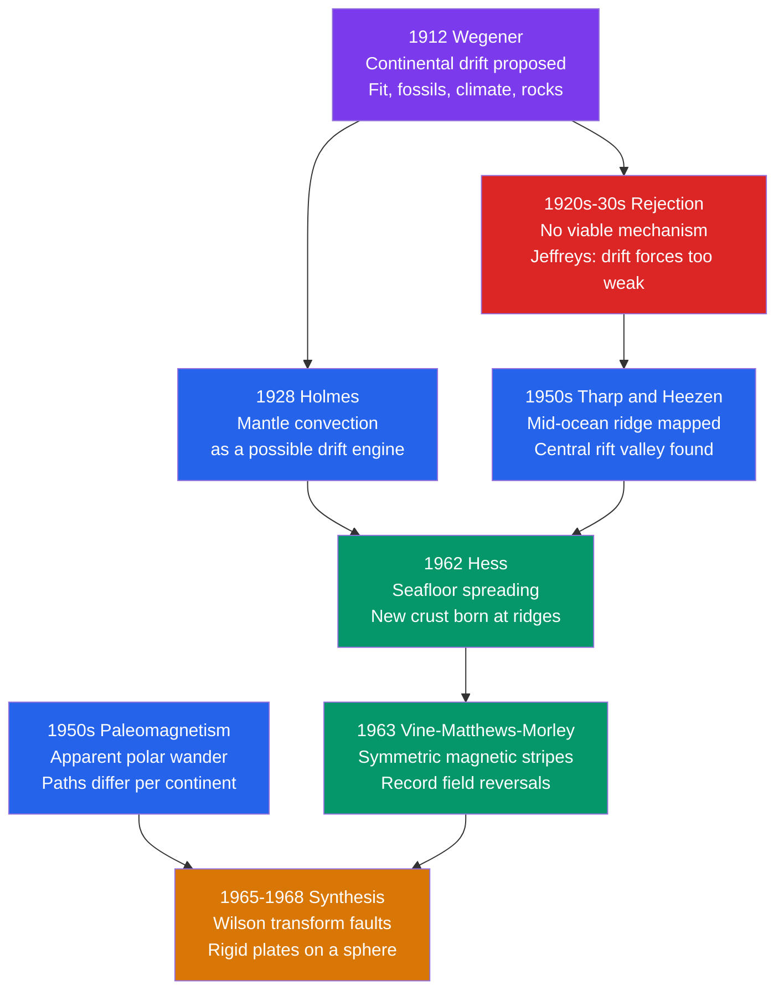

# 🗺️ Continental Drift and the Plate Tectonics Revolution

> [!abstract] TL;DR
> In 1912 Alfred Wegener argued that today's continents were once joined in a single supercontinent, **Pangaea**, surrounded by the world-ocean **Panthalassa** — using the jigsaw fit of the coastlines, fossils that cross oceans, mountain belts that stop at one shore and resume on another, and ancient climate scars in the wrong latitudes. His idea was rejected for half a century because he had no viable **mechanism**: continents cannot plow through the rigid ocean floor. Mid-century evidence — the mapped mid-ocean ridge, Hess's **seafloor spreading**, **paleomagnetism** and apparent polar wander, and the symmetric **Vine–Matthews–Morley** magnetic stripes — resurrected drift and, in the synthesis of ~1965–1968, became **plate tectonics**: rigid lithospheric plates gliding over the ductile asthenosphere. It is the unifying theory of geology.

## Intuition — analogy FIRST

Imagine tearing a printed newspaper page in two. If you later find the halves, two clues prove they belong together: the ragged edges fit like a jigsaw, **and** the lines of print run continuously across the tear. Wegener did exactly this with the planet. South America and Africa fit at the edge; but more tellingly, the "printed lines" match too — the same fossil species, the same mountain ranges, and the same ancient glacial scratches run straight off one continent and continue on another now thousands of kilometres away. One coincidence is chance; five independent lines of evidence pointing to the same reassembly is a theory.

The catch: knowing two torn halves *fit* says nothing about *how* they drifted apart. That missing "how" is why the idea languished for 50 years — until the ocean floor itself was found to be a conveyor belt.

---

## How It Works



---

## Key Concepts / Details

### Secondary Level

Wegener assembled **four independent lines of evidence** that the continents were once united in **Pangaea** (Greek for "all land"), ringed by the superocean **Panthalassa**:

1. **The jigsaw fit.** The bulge of Brazil nests into the Gulf of Guinea. The match improves if you fit the edges of the *continental shelves* (the true edge of continental crust) rather than today's shorelines.
2. **Matching fossils across oceans.** Identical land and freshwater species appear on now-separated continents that no swimmer could have crossed.
3. **Continuous mountain belts and rock provinces.** The Appalachians of eastern North America line up with the Caledonides of Scotland, Scandinavia and Greenland; ancient rock provinces of eastern South America match those of West Africa.
4. **Paleoclimate in the wrong place.** Grooved glacial deposits (**tillites**) of Permo-Carboniferous age sit in now-tropical Africa, India and South America — but make sense if those lands were clustered near the **South Pole**. Meanwhile coal (tropical swamp) and desert dunes appear far from their expected latitudes.

| Fossil | What it was | Found on |
|--------|-------------|----------|
| *Mesosaurus* | Small freshwater reptile | S. America, S. Africa |
| *Glossopteris* | Seed-fern flora | S. America, Africa, India, Antarctica, Australia |
| *Cynognathus* | Triassic land reptile | S. America, Africa |
| *Lystrosaurus* | Triassic therapsid | Africa, India, Antarctica |

### Undergraduate Level

**Quantifying the fit — Euler's theorem.** Any rigid motion of a plate on a sphere is a **rotation about an axis** (the *Euler pole*). Bullard, Everett & Smith (1965) used a computer to find the rotation that closes the South Atlantic along the **500-fathom (~900 m) contour**; the mean mismatch was only a degree or so — far better than a coincidence.

**Paleomagnetism.** When basalt or sediment cools/settles, magnetic minerals lock in the field direction. Under the **geocentric axial dipole (GAD)** model, the magnetic **inclination** $I$ fixes the **paleolatitude** $\lambda$:

$$\tan I = 2\tan\lambda \quad\Longrightarrow\quad \lambda = \arctan\!\left(\tfrac{1}{2}\tan I\right)$$

Rocks of increasing age from one continent trace an **apparent polar wander (APW) path**. Crucially, Europe and North America give *different* APW paths for the same ages — reconcilable only if the **continents moved relative to each other**, not the pole.

**Seafloor spreading.** Hess (1962) proposed that mantle rises at mid-ocean ridges, creates new ocean floor, and this floor spreads outward and sinks at trenches — the ocean is young and recycled (nowhere older than ~200 Myr). **Vine, Matthews and Morley (1963)** predicted the proof: as new crust cools through the **Curie temperature** it records the field's polarity, so periodic **geomagnetic reversals** print **symmetric magnetic stripes** parallel to the ridge. Half-spreading rate follows directly:

$$u = \frac{d}{t}$$

for an anomaly of known age $t$ at distance $d$ from the ridge axis (typically $u \approx 1$–$10$ cm/yr).

**Why it was rejected first.** Wegener's proposed engine — continents "plowing" through oceanic crust, pushed by a weak *pole-fleeing* force and tides — was physically impossible. Harold Jeffreys showed those forces were orders of magnitude too small, and the rigid ocean floor could not be shouldered aside. Arthur Holmes (1928–31) offered the eventual answer, **mantle convection**, but lacked the ocean-floor data to prove it.

### Graduate Level

**Plate tectonics on a sphere (1965–1968).** J. Tuzo Wilson (1965) identified the **transform fault** — a strike-slip boundary that *connects* ridge and trench segments, so ridges, trenches and transforms form a closed network bounding a small number of **rigid plates**. McKenzie & Parker (1967), Morgan (1968) and Le Pichon (1968) formalised this as motion on a sphere. Each plate pair rotates about an **Euler pole** with angular velocity $\boldsymbol{\omega}$; the surface velocity of a point at angular distance $\Delta$ from that pole is

$$\mathbf{v} = \boldsymbol{\omega}\times\mathbf{r}, \qquad |\mathbf{v}| = \omega\,R\sin\Delta$$

so plate speed is **zero at the Euler pole and maximal on the equator** of the rotation — and transform faults trace **small circles** about that pole. This kinematic prediction (transforms perpendicular to ridges, growing offset with distance) matched the mapped fracture zones exactly.

**The reframing of geology.** Plate tectonics tied together phenomena previously studied in isolation:

| Phenomenon | Plate-tectonic explanation |
|-----------|----------------------------|
| Earthquake belts | Concentrated at plate boundaries; dipping **Wadati–Benioff zones** trace subducting slabs |
| Volcanic arcs / Ring of Fire | Melting above subduction zones and along ridges |
| Mountain belts | Continental collision and accretion at convergent margins |
| Ocean age & bathymetry | Young hot crust at ridges cools and subsides with $\sqrt{\text{age}}$ |
| Resource distribution | Hydrocarbons on rifted passive margins; porphyry ores over subduction zones |

**Driving forces.** The modern consensus inverts Wegener: plates are pulled and pushed by the mantle system itself — dominant **slab pull** (dense subducting lithosphere), plus **ridge push** and basal mantle drag — the convective heat engine Holmes anticipated. See [[Mantle_Convection_and_Hotspots]].

```python
import numpy as np

# Plate reconstruction = a rigid ROTATION on a sphere (Euler's theorem).
# We "open" an ocean by rotating a plate about an Euler pole, then close it
# again and show the reconstruction is exact -- the heart of the Bullard fit.

R = 6371.0  # Earth radius, km

def to_xyz(lon, lat):
    lo, la = np.radians(lon), np.radians(lat)
    return np.array([np.cos(la)*np.cos(lo), np.cos(la)*np.sin(lo), np.sin(la)])

def to_lonlat(v):
    v = v / np.linalg.norm(v)
    return np.degrees(np.arctan2(v[1], v[0])), np.degrees(np.arcsin(v[2]))

def euler_rotate(lon, lat, p_lon, p_lat, ang_deg):
    # Rodrigues rotation of a point about the Euler pole axis
    k  = to_xyz(p_lon, p_lat)
    th = np.radians(ang_deg)
    v  = to_xyz(lon, lat)
    vr = v*np.cos(th) + np.cross(k, v)*np.sin(th) + k*np.dot(k, v)*(1 - np.cos(th))
    return to_lonlat(vr)

def gc_dist(a, b):  # great-circle distance in km between two (lon, lat)
    return R * np.arccos(np.clip(np.dot(to_xyz(*a), to_xyz(*b)), -1, 1))

# Sample points on the South American Atlantic margin (lon E, lat N)
sam = [(-35, -5), (-39, -13), (-48, -25), (-58, -34), (-62, -40)]

# Illustrative Euler pole + angle for the South Atlantic opening
P_LON, P_LAT, ANGLE = -30.0, 44.0, 57.0

# 1) Build the conjugate African margin by OPENING the ocean (+ANGLE)
afr   = [euler_rotate(lo, la, P_LON, P_LAT,  ANGLE) for lo, la in sam]
# 2) CLOSE it: rotate Africa back by -ANGLE and measure the residual gap
recon = [euler_rotate(lo, la, P_LON, P_LAT, -ANGLE) for lo, la in afr]

gap = np.mean([gc_dist(s, r) for s, r in zip(sam, recon)])
print(f"Mean misfit after reconstruction: {gap:.3f} km  (rotation is exact)")
```

---

## Real-World Notes

- **Bullard fit (1965).** The first computer reconstruction closed the Atlantic at the shelf edge, turning Wegener's hand-drawn overlap into a quantitative, reproducible test.
- **Marie Tharp's maps.** Tharp and Heezen's physiographic maps of the Atlantic floor revealed the continuous mid-ocean ridge and its central rift valley — the physical setting seafloor spreading required.
- **The *Eltanin-19* profile (1966).** A magnetic survey across the Pacific–Antarctic Ridge showed stripes so symmetric they could be folded along the ridge axis — the decisive confirmation of Vine–Matthews–Morley and, with it, plate tectonics.
- **GPS geodesy today.** Space geodesy now measures plate motion directly: the Atlantic widens ~2–2.5 cm/yr; the Nazca plate converges on South America at ~7 cm/yr — matching rates inferred from magnetic stripes over millions of years.
- **Hazard maps.** Because seismicity and volcanism cluster at plate boundaries, the theory underlies all modern earthquake and volcanic hazard assessment (e.g., the circum-Pacific "Ring of Fire").
- **Southern-Hemisphere holdouts were right.** Geologists working on Gondwana rocks — notably Alexander du Toit (*Our Wandering Continents*, 1937) — accepted drift decades before their Northern-Hemisphere peers, because the field evidence was on their doorstep.

---

## Common Pitfalls

1. **"Continents plow through the ocean floor."** Wegener's fatal error. Continents ride *passively* atop plates; a plate is crust **plus** rigid upper mantle (the **lithosphere**) moving as one over the ductile **asthenosphere**.
2. **Continental drift ≠ plate tectonics.** Drift was the *observation*; plate tectonics is the *mechanism and framework*. Plate boundaries generally do **not** coincide with continental edges (e.g., the Americas and their Atlantic seafloor share one plate).
3. **Misreading "apparent polar wander."** The magnetic pole stayed near the rotation axis (GAD); it is the **continents** that moved. The path is "apparent" precisely because we plot it in the continent's frame.
4. **Pangaea was not the first or only supercontinent.** Earlier assemblies (Rodinia, Columbia/Nuna) came and went; supercontinents recur in the **Wilson cycle**. See [[Wilson_Cycle_and_Supercontinents]].
5. **Wegener did not "discover" the fit.** Ortelius, Bacon and Snider-Pellegrini noted it centuries earlier; Wegener's contribution was uniting *independent* evidence lines into a testable hypothesis.
6. **Fit the shelves, not the shorelines.** Matching at today's coastline leaves gaps and overlaps; the true crustal edge is the continental slope, which is why the Bullard fit used the ~900 m contour.

---

## Related Concepts

- [[_MOC_Plate_Tectonics|↑ Section MOC]]
- [[Plate_Boundaries_and_Plate_Motions]] — the divergent, convergent and transform boundaries that bound the rigid plates
- [[Seafloor_Spreading_and_Ocean_Basins]] — the ridge conveyor and the symmetric magnetic stripes that clinched the theory
- [[Subduction_Zones_and_Mountain_Building]] — where old lithosphere returns and collisions raise mountain belts
- [[Mantle_Convection_and_Hotspots]] — the heat-engine mechanism Wegener lacked
- [[Wilson_Cycle_and_Supercontinents]] — the opening and closing of oceans across deep time; Pangaea in context
- [[Geomagnetism_and_Paleomagnetism]] — how frozen magnetism records paleolatitude and apparent polar wander
- [[Earth_Internal_Structure]] — the lithosphere–asthenosphere layering that makes plates possible
- [[_MOC_Mathematics_Master]] — Euler's theorem and rotations on a sphere quantify plate reconstructions

---

## Review Questions

1. **Secondary:** Name Wegener's four lines of evidence for continental drift. Explain how a single fern flora, *Glossopteris*, found across five now-separated continents supports the idea of Pangaea.
2. **Undergraduate:** A basalt records a magnetic inclination of $I = 30^\circ$. Compute its paleolatitude. Then explain why two continents showing *different* apparent polar wander paths for the same time interval implies they moved relative to each other.
3. **Graduate:** Describe Wilson's transform-fault insight and how, together with Euler's theorem, it turned "continental drift" into quantitative plate tectonics. Contrast **slab pull** and **ridge push** as driving forces, and state which is thought to dominate.

---

## Sources

- Wegener, A. (1915/1929) — *Die Entstehung der Kontinente und Ozeane* (*The Origin of Continents and Oceans*)
- Hess, H. H. (1962) — "History of Ocean Basins," *Petrologic Studies (Buddington Volume)*
- Vine, F. J. & Matthews, D. H. (1963) — "Magnetic Anomalies over Oceanic Ridges," *Nature* 199, 947
- Wilson, J. T. (1965) — "A New Class of Faults and their Bearing on Continental Drift," *Nature* 207, 343
- Bullard, E., Everett, J. E. & Smith, A. G. (1965) — "The Fit of the Continents around the Atlantic," *Phil. Trans. R. Soc. A* 258
- Le Pichon, X. (1968); McKenzie, D. & Parker, R. (1967); Morgan, W. J. (1968) — plate kinematics on a sphere
- Kearey, Klepeis & Vine — *Global Tectonics*, 3rd ed. (textbook synthesis)

#EarthScience #plate-tectonics #continental-drift #Wegener #seafloor-spreading #paleomagnetism #Pangaea #secondary #undergraduate #graduate
