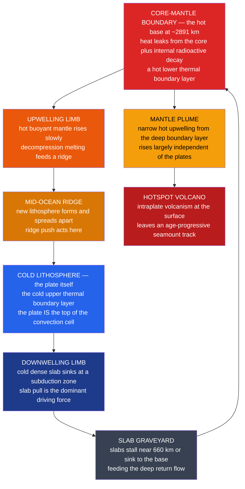

# 🌋 Mantle Convection and Hotspots

> [!abstract] TL;DR
> The mantle is **solid rock, yet it flows** — over millions of years it creeps by solid-state deformation and **convects**, carrying heat from the core and from radioactive decay up to the surface. **Plate tectonics is the surface expression of this convection**: the plates *are* the cold, rigid top thermal boundary layer, and slab pull plus ridge push are convective forces. Whether the layer convects at all is set by the **Rayleigh number** $Ra=\dfrac{\rho g \alpha \Delta T\, d^3}{\kappa\,\eta}$, which for Earth's mantle is $\sim10^{6}$–$10^{7}$, far above the critical value of order $10^{3}$. Piercing this circulation are **mantle plumes** — narrow hot upwellings from the deep thermal boundary layer that produce **hotspots**. Because a plume source stays comparatively fixed while the plate glides over it, hotspots leave **age-progressive volcanic tracks** (Hawaii–Emperor, Yellowstone, Réunion) that record *absolute* plate motion, and their giant "plume heads" flood the surface with **large igneous provinces** tied to mass extinctions.

## Intuition — analogy FIRST

Watch a **pot of thick soup on a low burner**. Heat at the bottom makes the soup there hot, expand, grow buoyant, and rise; at the top it cools, grows dense, and sinks back down. Rolling **convection cells** form, and a **skin** develops on the surface — cool, stiff, dragged along by the churning underneath. That skin is the analogue of a **tectonic plate**, and the rolling soup is the **convecting mantle**. The plate is not floating *on* the convection like a raft; it *is* the top of the convection cell.

Now imagine one especially hot spot on the burner sends up a thin, persistent **column of rising soup** — a plume — that keeps hitting the same point on the underside of the skin. If you slide the skin sideways, that fixed jet burns a **line of holes** across it, the oldest hole farthest from the jet. That is exactly how the **Hawaiian island chain** is stamped across the moving Pacific plate.

---

## How It Works



---

### Secondary Level

**The mantle flows even though it is solid.** Under the crushing pressure and heat of the deep Earth, rock behaves like an extremely stiff putty: given millions of years it deforms by **solid-state creep** at rates of centimetres per year. It is *not* molten (see [[Earth_Internal_Structure]]).

**Why it convects.** Heat comes from two places — leftover heat leaking out of the **core** and **radioactive decay** of uranium, thorium, and potassium spread through the mantle (see [[Earths_Internal_Heat_and_Geothermal_Gradient]]). Hot deep rock expands, becomes buoyant, and rises; cold surface rock is dense and sinks. This overturning obeys the same energy rules as any heat engine ([[Laws_of_Thermodynamics]]): heat in at depth, heat out at the surface, motion in between.

**Plates are the top of the convection.** The single most important idea: a tectonic plate is the cold, brittle **lid** of a convection cell. Two convective forces drive it — **ridge push** (new hot rock at a ridge slides off the topographic high) and, more powerfully, **slab pull** (a cold dense slab sinking at a subduction zone tows the rest of the plate behind it, see [[Subduction_Zones_and_Mountain_Building]]).

**Hotspots.** A few dozen places on Earth show **volcanism far from any plate boundary**. The classic explanation is a **mantle plume**: a fixed, narrow jet of hot rock rising from deep down. As the plate glides over it, the plume punches a **chain of volcanoes** — youngest over the hotspot, progressively older downstream.

| Hotspot | Plate above | Signature |
|---------|-------------|-----------|
| **Hawaii** | Pacific | Hawaiian–Emperor seamount chain, ages 0 → ~80 Ma |
| **Yellowstone** | North American | Snake River Plain caldera track |
| **Iceland** | ridge + plume | thick crust where a plume sits on a spreading ridge |
| **Réunion** | Indian / African | Deccan Traps → Chagos–Laccadive ridge → Réunion |

### Undergraduate Level

**The Rayleigh number** decides whether a fluid layer convects. It is the ratio of buoyancy *driving* the flow to the diffusion *damping* it:

$$Ra=\frac{\rho\, g\, \alpha\, \Delta T\, d^{3}}{\kappa\,\eta}$$

| Symbol | Meaning | Mantle value |
|--------|---------|--------------|
| $\rho$ | density | $\sim 4000\ \text{kg m}^{-3}$ |
| $g$ | gravity | $\sim 10\ \text{m s}^{-2}$ |
| $\alpha$ | thermal expansivity | $\sim 3\times10^{-5}\ \text{K}^{-1}$ |
| $\Delta T$ | temperature contrast | $\sim 2500\ \text{K}$ |
| $d$ | layer thickness | $\sim 2.9\times10^{6}\ \text{m}$ |
| $\kappa$ | thermal diffusivity | $\sim 10^{-6}\ \text{m}^2\text{s}^{-1}$ |
| $\eta$ | dynamic viscosity | $\sim 10^{21}\text{–}10^{22}\ \text{Pa s}$ |

Convection begins once $Ra$ exceeds a **critical value of order $10^{3}$** (657 for free–free boundaries, 1708 for rigid–rigid). Plugging the mantle numbers gives $Ra \approx 7\times10^{6}$ — thousands of times supercritical. The lesson: even a viscosity of $10^{22}\ \text{Pa s}$ cannot stop convection, because the $d^{3}$ term (a 2900 km layer) is enormous. The mantle convects **vigorously**, just very slowly.

**Reading plate speed off a hotspot track.** If the plume is fixed, then distance along the chain divided by age gives the plate's *absolute* velocity. For Hawaii the slope is $\sim 85\text{–}95\ \text{km/Myr} = 8\text{–}9\ \text{cm/yr}$ — the Pacific plate's absolute motion. This differs from the *relative* velocities read from magnetic stripes at ridges (see [[Seafloor_Spreading_and_Ocean_Basins]] and [[Plate_Boundaries_and_Plate_Motions]]): hotspots provide an approximately fixed reference frame.

**The Hawaiian–Emperor bend.** At roughly **47–50 Ma** the chain kinks by ~60°. The classic reading is a **change in the direction of Pacific-plate motion**; part of the bend, however, reflects **southward drift of the Hawaiian plume** itself (see Graduate level).

**Plume heads and flood basalts.** A new plume arrives as a large bulbous **head** trailing a narrow **tail**. The head melts catastrophically to erupt a **Large Igneous Province (LIP)** — the **Deccan Traps** (~66 Ma, Réunion plume) and **Siberian Traps** (~252 Ma) each coincide with a major **mass extinction**; the tail then feeds the long-lived hotspot track (see [[Volcanism_and_Volcanic_Hazards]]).

### Graduate Level

**Whole-mantle vs. layered convection.** Does the mantle overturn as one cell top-to-bottom, or in two decoupled layers separated at **660 km**? The 660 km ringwoodite → bridgmanite transition has a **negative Clapeyron slope** that resists vertical flow ([[Earth_Internal_Structure]]). Seismic tomography settled much of the debate: some cold slabs **stall and pond** near 660 km, but others **penetrate to the core–mantle boundary (CMB)**, imaging "slab graveyards" in the lowermost mantle. The modern consensus is **whole-mantle convection with a partial, leaky barrier at 660 km** ("penetrative" or intermittent layering).

**LLSVPs and plume roots.** Sitting on the CMB beneath Africa and the Pacific are two continent-sized **Large Low-Shear-Velocity Provinces** (nicknamed **Tuzo** and **Jason**) — dense, hot, likely **thermochemical piles**. Deep-rooted plumes appear to rise preferentially from their steep margins ("**plume generation zones**"), with even smaller **Ultra-Low-Velocity Zones (ULVZs)** marking probable plume roots.

**The fixity-of-hotspots debate.** Hotspots are only *approximately* fixed. **Paleomagnetic latitudes** of Emperor seamounts show the Hawaiian plume **drifted ~15° south** between ~80 and ~47 Ma, so the famous bend records **both** a plate-motion change and **plume motion** — mantle plumes are advected by the surrounding convective flow ("mantle wind").

**Plume hypothesis vs. plate hypothesis.** Not every hotspot need be a deep plume. The **plate hypothesis** (Anderson, Foulger) attributes some intraplate volcanism to **shallow, plate-related** causes — lithospheric cracks, edge-driven convection, fertile mantle patches — with no CMB root. Discriminating deep from shallow origins drives modern **seismic tomography**: French & Romanowicz (2015) imaged **broad ($\sim$400–1000 km wide) low-velocity conduits rooted at the CMB** beneath many major hotspots, strong evidence for genuinely deep plumes under at least some of them.

```python
import numpy as np

# Ar-Ar ages and distances from Kilauea along the HAWAIIAN ridge
# (the post-bend segment, younger than the ~47-50 Ma Hawaiian-Emperor bend).
# Values after Clague & Dalrymple / O'Connor et al.
age_Ma  = np.array([0.0, 5.1, 7.2, 10.3, 12.3, 19.9, 27.7, 29.8])
dist_km = np.array([0.0, 519, 780, 1058, 1435, 1818, 2432, 2600])

# Least-squares line: distance = speed * age + intercept
slope_km_per_Myr, intercept = np.polyfit(age_Ma, dist_km, 1)

# Convert km/Myr to cm/yr:  1 km/Myr = 1000 m / 1e6 yr = 0.1 cm/yr
speed_cm_per_yr = slope_km_per_Myr * 0.1

print(f"Pacific plate absolute speed = {slope_km_per_Myr:.1f} km/Myr "
      f"= {speed_cm_per_yr:.1f} cm/yr")
# -> ~84.5 km/Myr = ~8.5 cm/yr, the Pacific plate's absolute motion.

# The Hawaiian-Emperor BEND lies ~3500 km from Kilauea at ~47-50 Ma.
# It marks a change in the AZIMUTH of plate motion (and, per paleolatitude
# data, southward drift of the Hawaiian plume) -- not a change in speed.
print("Hawaiian-Emperor bend (~47-50 Ma): plate-motion direction change + plume drift.")
```

Running this fits the age–distance data to recover the Pacific plate's absolute speed of **~8–9 cm/yr**, then flags the bend that records a plate-motion (and plume) reorganization.

---

## Real-World Notes

- **Hawaii–Emperor chain** — the textbook case: a >6000 km line of volcanoes aging 0 → ~80 Ma away from the Big Island, with the diagnostic **bend at ~47–50 Ma**. It gives us the Pacific plate's absolute velocity.
- **Yellowstone** — the North American plate slides southwest over a hotspot, leaving a track of extinct calderas along the **Snake River Plain**; Yellowstone itself is the current, active head of the track.
- **Iceland** — a plume sitting *directly on* the Mid-Atlantic Ridge, so excess plume melting builds anomalously **thick crust** and lifts the ridge above sea level — a rare place to walk on a spreading centre.
- **Réunion plume and the Deccan Traps** — the plume head erupted the Deccan flood basalts at ~66 Ma (near the K–Pg extinction); the trailing tail carved the **Chagos–Laccadive Ridge** down to present-day Réunion, a plume track written across the Indian Ocean.
- **Siberian Traps** — the largest continental LIP (~252 Ma), tightly linked to the **end-Permian mass extinction**, the most severe in Earth history.
- **Seismic tomography and LLSVPs** — global wave-speed maps reveal cold slabs sinking, hot plumes rising, and the two vast **LLSVPs** on the CMB — the deep architecture that organizes where plumes are born.

---

## Common Pitfalls

1. **"The mantle is molten liquid."** It is **solid rock** that creeps in the solid state at cm/yr. Only a trace of partial melt exists near the surface (the asthenosphere); the convecting bulk is solid.
2. **"Convection currents drag the plates along like conveyor belts."** Outdated. Plates **are** the cold upper boundary layer of the convection, and **slab pull** (sinking slabs) — not passive dragging by a separate current — is the dominant driving force.
3. **"Hotspots are perfectly fixed."** They are only *approximately* fixed. Paleolatitude data show the Hawaiian plume drifted ~15° south during the Emperor stage; the hotspot reference frame is an approximation, not an anchor.
4. **"Every intraplate volcano is a deep mantle plume."** Some may be shallow, plate-driven features (edge-driven convection, lithospheric cracks). Distinguishing deep plumes from shallow sources is an active research problem.
5. **"The Hawaiian bend proves the Pacific plate suddenly turned."** The bend is *partly* a plate-motion change and *partly* plume drift — its interpretation is genuinely debated.
6. **"High viscosity should shut convection off."** No — the Rayleigh number scales with $d^{3}$, so a 2900 km-thick mantle convects vigorously ($Ra\sim10^{6\text{–}7}$) despite a viscosity of $\sim10^{22}\ \text{Pa s}$.

---

## Related Concepts

- [[_MOC_Plate_Tectonics|↑ Section MOC]]
- [[Continental_Drift_and_the_Plate_Tectonics_Revolution]] — convection supplied the long-missing *mechanism* for Wegener's drifting continents.
- [[Plate_Boundaries_and_Plate_Motions]] — ridges, trenches, and transforms are the surface geometry of convective up- and down-wellings.
- [[Seafloor_Spreading_and_Ocean_Basins]] — upwelling limbs build new ocean floor; magnetic stripes give the *relative* motions that complement hotspot *absolute* motions.
- [[Subduction_Zones_and_Mountain_Building]] — the downwelling limb; slab pull is the strongest single driver of plate motion.
- [[Wilson_Cycle_and_Supercontinents]] — supercontinents assemble and disperse as the pattern of mantle convection reorganizes.
- [[Earths_Internal_Heat_and_Geothermal_Gradient]] — the heat budget and geotherm that power and pace the convection.
- [[Earth_Internal_Structure]] — the layered interior, the 660 km boundary, and the CMB where plumes are born.
- [[Volcanism_and_Volcanic_Hazards]] — plume heads erupt flood basalts; plume tails feed hotspot volcanoes.
- **Physics** — [[Laws_of_Thermodynamics]] (Earth as a cooling heat engine), [[Classical_Statistical_Mechanics]] (thermal transport at the microscale), and [[Entropy_and_Second_Law]] (irreversible heat flow that drives the overturn).
- **Mathematics** — [[_MOC_Mathematics_Master]] (the fluid-dynamics and differential equations behind Rayleigh–Bénard convection).

---

## Review Questions

1. **Secondary**: Explain how a chain of volcanoes like Hawaii can form in the middle of a plate, thousands of kilometres from any boundary. Why do the islands get older toward the northwest, and what does that tell you about the direction the Pacific plate is moving?
2. **Undergraduate**: (a) Using $Ra=\rho g\alpha\Delta T d^{3}/(\kappa\eta)$ with the tabulated mantle values, estimate the Rayleigh number and state whether the mantle convects. (b) Given hotspot ages of 5.1, 12.3, and 27.7 Ma at 519, 1435, and 2432 km from the active vent, estimate the plate's absolute speed in cm/yr.
3. **Graduate**: Evaluate the evidence from seismic tomography and the 660 km discontinuity for whole-mantle versus layered convection. Then explain how paleolatitude data from the Emperor seamounts complicate the use of the Hawaiian–Emperor bend as a pure record of plate-motion change.

---

## Sources

- Wilson, J. T. (1963) — "A possible origin of the Hawaiian Islands," *Can. J. Phys.* 41, 863.
- Morgan, W. J. (1971) — "Convection plumes in the lower mantle," *Nature* 230, 42.
- Schubert, G., Turcotte, D. L. & Olson, P. — *Mantle Convection in the Earth and Planets* (Cambridge).
- Fowler, C. M. R. — *The Solid Earth: An Introduction to Global Geophysics*, 2nd ed. (Cambridge).
- Sharp, W. D. & Clague, D. A. (2006) — "50-Ma initiation of Hawaiian-Emperor bend records major change in Pacific plate motion," *Science* 313, 1281.
- French, S. W. & Romanowicz, B. (2015) — "Broad plumes rooted at the base of the Earth's mantle beneath major hotspots," *Nature* 525, 95.

#earth-science #plate-tectonics #geophysics #mantle-convection #hotspots #mantle-plumes #rayleigh-number #LLSVP #secondary #undergraduate #graduate
