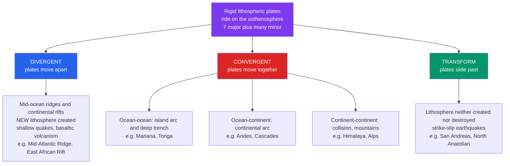

# 🧩 Plate Boundaries and Plate Motions

> [!abstract] TL;DR
> Earth's rigid outer shell is broken into about a dozen **lithospheric plates** — seven major ones (Pacific, North American, South American, Eurasian, African, Indo-Australian, Antarctic) plus many smaller ones — that ride slowly over the weaker asthenosphere. Almost all geological action happens at their edges, which come in three flavours: **divergent** (plates pull apart, new lithosphere is born), **convergent** (plates collide, lithosphere is consumed or crumpled into mountains), and **transform** (plates slide past, lithosphere is conserved). Because a plate moves over a sphere, its motion is a **rotation about an Euler pole**, so surface speed grows with angular distance from that pole as $v = \omega R \sin\theta$. Typical rates are a few centimetres per year — "as fast as fingernails grow" — driven mainly by **slab pull**, with **ridge push** and **mantle drag** playing supporting roles.

## Intuition — analogy FIRST

Peel a hard-boiled egg but leave the cracked shell in place: the shell is broken into curved, rigid pieces that still cling to the slippery white beneath. Now imagine the white slowly churning. The shell fragments don't deform — they slide as whole caps, and everything interesting (grinding, buckling, gaps opening) happens along the cracks between them. Earth's lithosphere is that shell; the asthenosphere is the churning white; the cracks are **plate boundaries**.

Because the shell is curved, no piece can move in a simple straight line — every rigid motion on a sphere is a *turn about some axis*. Stick a pin through the egg: the fragment swings around that pin. Points near the pin barely move; points on the far side sweep fastest. That pin is the **Euler pole**, and it is the single most important idea for describing how plates move.

---

## How It Works



---

## Key Concepts / Details

### Secondary Level

**The plates.** The lithosphere — crust plus the rigid uppermost mantle, roughly 100 km thick — is fractured into plates that behave as rigid caps. They carry continents and ocean floor alike, so a plate is **not** the same as a continent: the Pacific plate is almost entirely ocean floor, while the North American plate carries both a continent and half an ocean.

**Three boundary types** and their signature features:

| Boundary | Relative motion | Lithosphere | Earthquakes | Volcanism | Classic example |
|----------|-----------------|-------------|-------------|-----------|-----------------|
| **Divergent** | apart | created | shallow, small | basaltic (effusive) | Mid-Atlantic Ridge; East African Rift |
| **Convergent** | together | destroyed / crumpled | shallow to very deep | explosive (arc) or none | Andes; Himalaya; Mariana |
| **Transform** | past each other | conserved | shallow strike-slip | little to none | San Andreas Fault |

**How fast?** A few centimetres per year — the width of the Atlantic grows about as fast as your fingernails. Over millions of years that adds up to entire oceans opening and closing.

### Undergraduate Level

**Euler's theorem on a sphere.** Any rigid motion of a plate over Earth's surface is equivalent to a **rotation about an axis through the planet's centre**. That axis pierces the surface at the **Euler pole** (a point, not a physical object). Describe the motion by an angular-velocity vector $\boldsymbol{\omega}$ pointing along the axis. The surface velocity of a point at position $\mathbf{r}$ is:

$$\mathbf{v} = \boldsymbol{\omega} \times \mathbf{r}, \qquad |\mathbf{v}| = \omega\, R \sin\theta$$

where $R$ is Earth's radius and $\theta$ is the **angular distance from the Euler pole**. Velocity is *zero at the pole* and *maximal on the great circle 90° away*. This is the same rigid-body kinematics as [[Rotational_Dynamics]] — just wrapped onto a sphere.

**Relative vs absolute motion.** Plate motion is only ever defined *relative to something*.
- **Relative motion** — plate A with respect to plate B ($\boldsymbol{\omega}_{A/B}$). This is what a boundary "feels" and what we can measure directly at ridges and faults.
- **Absolute motion** — motion relative to the deep mantle, usually approximated by the **hotspot reference frame**, since hotspots (thought to be fed from the deep mantle) drift only slowly. See [[Mantle_Convection_and_Hotspots]].

**Triple junctions.** Where three plates meet at a point, three boundaries converge. Classifying them by the boundary types involved — ridge (R), trench (T), fault (F) — gives combinations like R-R-R or T-T-F. Their stability is governed by whether the three relative-velocity vectors can close a triangle in **velocity space**.

**Measuring the rates.**
- **Seafloor magnetic anomalies** record spreading over millions of years (see [[Seafloor_Spreading_and_Ocean_Basins]]): anomaly width ÷ age = half-spreading rate.
- **GPS / GNSS geodesy** measures present-day motion directly to millimetre-per-year precision, resolving even intraplate strain.

**Driving forces.**

| Force | Origin | Role |
|-------|--------|------|
| **Slab pull** | dense subducting slab sinks and drags the plate | **dominant** — plates with long subducting margins move fastest |
| **Ridge push** | gravitational sliding off the elevated, hot ridge flank | secondary |
| **Basal / mantle drag** | coupling to asthenospheric flow | can drive *or* resist, depending on flow direction |

### Graduate Level

**Plate-circuit closure.** Relative rotations add like vectors. For plates A, B, C:

$$\boldsymbol{\omega}_{A/C} = \boldsymbol{\omega}_{A/B} + \boldsymbol{\omega}_{B/C}$$

Around any closed circuit of plates the rotation vectors must sum to zero:

$$\sum_i \boldsymbol{\omega}_i = 0$$

Global models (NUVEL-1A, MORVEL) invert spreading rates, transform azimuths, and earthquake slip vectors under this consistency constraint to solve for every plate pair simultaneously.

**The no-net-rotation (NNR) frame.** To define *absolute* motion without invoking hotspots, one imposes that the whole lithosphere carries no net angular momentum — the integrated rotation of the velocity field over the sphere vanishes:

$$\int_S \mathbf{r} \times \mathbf{v}\; dS = 0$$

This picks a unique reference frame (NNR-MORVEL) in which the plates' motions are internally self-consistent. It generally differs from the hotspot frame by a slow net "westward drift" of the lithosphere.

**Force balance sets the velocity.** A plate's steady velocity is not free — it is fixed by **torque balance** about Earth's centre:

$$\boldsymbol{\tau}_{\text{slab pull}} + \boldsymbol{\tau}_{\text{ridge push}} + \boldsymbol{\tau}_{\text{drag}}(\boldsymbol{\omega}) + \boldsymbol{\tau}_{\text{friction}} = 0$$

Because basal drag and boundary friction depend on the plate's own motion, this is a self-consistent (implicit) equation for $\boldsymbol{\omega}$. Empirically, the ratio of a plate's trench length to its total boundary length is the best single predictor of its speed — direct evidence that slab pull dominates.

---

## Code Demo

```python
# Surface velocity of a point on a plate from its Euler rotation:
# v = omega x r, with a cross-check against |v| = omega * R * sin(theta).
# Convenient unit fact: 1 km/Myr == 1 mm/yr.
import numpy as np

R = 6371.0  # mean Earth radius, km

def lonlat_to_xyz(lon_deg, lat_deg, radius=1.0):
    lon, lat = np.radians(lon_deg), np.radians(lat_deg)
    return radius * np.array([np.cos(lat) * np.cos(lon),
                              np.cos(lat) * np.sin(lon),
                              np.sin(lat)])

# Approximate Euler pole for the Pacific plate's ABSOLUTE motion (hotspot frame)
pole_lon, pole_lat = -66.0, -63.0     # degrees
omega_deg_per_Myr  = 0.86             # angular speed, deg/Myr

# Angular-velocity vector: magnitude in rad/Myr, direction along the Euler pole
omega_hat = lonlat_to_xyz(pole_lon, pole_lat, 1.0)
omega_vec = np.radians(omega_deg_per_Myr) * omega_hat      # rad/Myr

# Site on the Pacific plate: near the Hawaiian hotspot
site_lon, site_lat = -155.0, 20.0
r_vec = lonlat_to_xyz(site_lon, site_lat, R)               # km

# v = omega x r  -> km/Myr, i.e. mm/yr
v_vec  = np.cross(omega_vec, r_vec)
speed  = np.linalg.norm(v_vec)

# Cross-check with the scalar law |v| = omega * R * sin(theta)
theta       = np.degrees(np.arccos(np.dot(omega_hat, r_vec / R)))
speed_check = np.radians(omega_deg_per_Myr) * R * np.sin(np.radians(theta))

print(f"Angular distance from Euler pole : {theta:6.1f} deg")
print(f"|v| = omega x r                  : {speed:6.1f} mm/yr")
print(f"check  omega*R*sin(theta)        : {speed_check:6.1f} mm/yr")
# -> both agree near ~90 mm/yr, matching the fast-moving Pacific plate
```

---

## Real-World Notes

- **San Andreas Fault (transform).** The Pacific and North American plates grind past each other at roughly 50 mm/yr. No lithosphere is made or destroyed — hence the shallow, purely strike-slip earthquakes that periodically rupture California.
- **Himalaya (continent–continent convergence).** India collides with Eurasia at about 40–50 mm/yr. Neither continent will subduct, so the crust thickens and buckles — the mountains are still rising, and the region is seismically lethal (see [[Subduction_Zones_and_Mountain_Building]]).
- **Fast vs slow spreading.** The East Pacific Rise opens at up to ~150 mm/yr (full rate) and has smooth, low relief; the Mid-Atlantic Ridge creeps at ~20–25 mm/yr and has a deep, rugged axial rift valley. Spreading rate controls ridge morphology.
- **Hawaiian–Emperor seamount chain.** A fixed hotspot punched a line of volcanoes into the moving Pacific plate, recording its **absolute** motion. The sharp bend at ~47 Ma marks a change in plate direction — a tape recording of plate kinematics (see [[Mantle_Convection_and_Hotspots]]).
- **Mendocino Triple Junction.** A ridge–transform–trench (R-T-F) junction migrating north along California; its passage stitched the San Andreas system together and left a wake of altered tectonics.
- **GNSS reference frames.** Continuous GPS networks (e.g. EarthScope/UNAVCO) now measure plate motion in near real time, and geodetic models (MORVEL, NNR-MORVEL) have superseded purely geological ones for present-day rates.

---

## Common Pitfalls

1. **Plates ≠ continents.** A plate is a slab of lithosphere that may carry ocean floor, continent, or both. The boundary between the North American and Pacific plates runs *through* California, not along the coastline.
2. **Boundaries ≠ coastlines.** Passive continental margins (most of the Atlantic coasts) sit in the *middle* of a plate, far from any active boundary. Shorelines are shaped by sea level, not tectonics.
3. **Velocity is zero *at* the Euler pole, not maximal.** A frequent sign-flip in reasoning: speed grows as $\sin\theta$, peaking 90° away from the pole. Near the pole a plate barely moves even while rotating.
4. **Half-rate vs full-rate spreading.** Magnetic anomalies on one ridge flank give the *half*-spreading rate; the plate-separation (full) rate is twice that. Mixing them doubles or halves every downstream estimate.
5. **Transform ≠ any strike-slip fault, and ≠ fracture zone.** A transform *boundary* connects two other boundaries and terminates at them; only the ridge-offset segment is seismically active — the inactive extension is a passive **fracture zone**. The sense of slip is often opposite to what the ridge offset naively suggests (Wilson, 1965).
6. **Ridges don't "push" plates apart from behind.** Rising magma passively fills the gap; the plates are pulled by their sinking slabs (**slab pull**), with ridge push a modest gravitational assist. Convection is not a simple conveyor belt dragging plates along.

---

## Related Concepts

- [[_MOC_Plate_Tectonics|↑ Section MOC]]
- [[Continental_Drift_and_the_Plate_Tectonics_Revolution]] — the historical route from Wegener's drift to the rigid-plate synthesis this note formalises.
- [[Seafloor_Spreading_and_Ocean_Basins]] — the divergent-boundary process; magnetic anomalies that date and rate plate motion.
- [[Subduction_Zones_and_Mountain_Building]] — the convergent-boundary machinery: arcs, trenches, deep quakes, and collision orogeny.
- [[Mantle_Convection_and_Hotspots]] — the engine beneath the plates and the hotspot frame for absolute motion.
- [[Wilson_Cycle_and_Supercontinents]] — how boundaries are born and die as oceans open and close over geologic time.
- [[Seismology_and_Earthquakes]] — earthquake depth and mechanism fingerprint the boundary type.
- [[Earth_Internal_Structure]] — the lithosphere / asthenosphere contrast that makes rigid plates possible.
- [[Volcanism_and_Volcanic_Hazards]] — why divergent volcanism is effusive and convergent volcanism explosive.
- [[Rotational_Dynamics]] (Physics) — the angular-velocity and $\mathbf{v} = \boldsymbol{\omega}\times\mathbf{r}$ kinematics used for Euler poles.
- [[Newtons_Laws_and_Kinematics]] (Physics) — force and torque balance that sets each plate's steady velocity.
- [[_MOC_Mathematics_Master]] (Mathematics) — spherical geometry, vector cross products, and least-squares inversion behind global plate models.

---

## Review Questions

1. **Secondary**: Name the three types of plate boundary. For each, state whether lithosphere is created, destroyed, or conserved, and give one real-world example.
2. **Undergraduate**: A plate rotates about an Euler pole with angular speed $\omega = 0.7°/\text{Myr}$. Using $v = \omega R \sin\theta$ with $R = 6371$ km, find the surface speed (in mm/yr) at points $30°$ and $90°$ from the pole. Why does a location's speed depend on where the Euler pole sits, not just on $\omega$?
3. **Graduate**: Explain plate-circuit closure and why it constrains global motion models. Then contrast the hotspot reference frame with the no-net-rotation (NNR) frame — what does each assume, and why do their predicted "absolute" velocities differ?

---

## Sources

- Fowler, C.M.R. — *The Solid Earth: An Introduction to Global Geophysics*, 2nd ed., Ch. 2
- Cox, A. & Hart, R.B. — *Plate Tectonics: How It Works* (Euler-pole treatment, worked problems)
- Turcotte, D. & Schubert, G. — *Geodynamics*, 3rd ed. (driving forces, force balance)
- Wilson, J.T. (1965) — "A New Class of Faults and their Bearing on Continental Drift," *Nature* 207, 343 (transform faults)
- DeMets, C., Gordon, R.G. & Argus, D.F. (2010) — "Geologically current plate motions," *Geophys. J. Int.* 181, 1 (MORVEL / NNR-MORVEL)
- USGS — *This Dynamic Earth* (plate-boundary overview)

#earth-science #plate-tectonics #geodynamics #euler-pole #plate-boundaries #secondary #undergraduate #graduate
