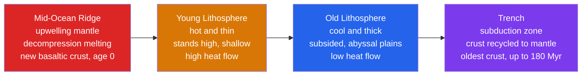

# 🌊 Seafloor Spreading and Ocean Basins

> [!abstract] TL;DR
> Ocean basins are not permanent holes in the Earth — they are conveyor belts. New basaltic ocean crust is created continuously at **mid-ocean ridges** by decompression melting of upwelling mantle, spreads outward, cools, subsides, and is eventually destroyed at subduction zones. Harry Hess proposed this **seafloor-spreading** mechanism in 1962; it was confirmed by the **Vine–Matthews–Morley** discovery of symmetric magnetic-anomaly stripes that record geomagnetic reversals. Because the crust is recycled, no oceanic seafloor is older than ~180–200 Myr, and its depth grows predictably as the square root of its age: $d \approx 2500 + 350\sqrt{t}$ metres.

## Intuition — analogy FIRST

Imagine a slow, endless conveyor belt of fresh asphalt laid down along a crack in the ground. Where the crack opens, hot tar wells up and paves a new strip; each new strip pushes the older strips outward on both sides. Far from the crack the asphalt has cooled, hardened, and sunk a little; at the far end it drops off the edge and is melted down again. The **crack is a mid-ocean ridge**, the **tar is basalt**, and the **far edge is a deep-sea trench**.

Now sprinkle iron filings into the tar as it sets and imagine the paving machine's magnet flips polarity every so often. Each cooled strip freezes-in the magnet's direction *at the moment it hardened*. Because strips are added symmetrically to both sides, you get a **mirror-image barcode** of magnetic stripes flanking the crack — a permanent tape recording of both the spreading and the flipping of Earth's field.

---

## How It Works

At the ridge axis, plate separation lets hot asthenosphere rise. As it ascends it decompresses along an adiabat, crosses its solidus, and partially melts (~10–20%). The buoyant basaltic melt erupts as **pillow basalts**, freezes past its **Curie point**, and becomes the newest oceanic lithosphere — which then ages, thickens, and deepens as it is carried away.



---

### Secondary Level

- **The mid-ocean ridge system** is Earth's longest mountain chain — a continuous submarine range ~65,000 km long, winding through every ocean basin like the seam on a baseball.
- **Seafloor spreading (Hess, 1962):** ocean crust is born at the ridge and destroyed at trenches. The seafloor is *young*, not ancient. (Robert Dietz coined the term "seafloor spreading" in 1961; Hess supplied the mechanism.)
- **Magnetic stripes** parallel the ridge and are **symmetric** on both sides — the confirming evidence. Each stripe records the direction of Earth's magnetic field when that crust cooled; reversals of the field make alternating "normal" and "reversed" stripes.
- **Age pattern:** youngest rock sits at the ridge crest; the seafloor gets systematically older with distance from the ridge. The oldest ocean floor is only ~180–200 million years old — vastly younger than the ~4-billion-year-old continents.
- **Depth pattern:** ridges are shallow (~2.5 km deep); the seafloor sinks to abyssal-plain depths (~5–6 km) as it ages and cools.

### Undergraduate Level

**Structure of oceanic lithosphere (the ophiolite sequence).** Ocean crust has a layered structure, sometimes obducted onto land as an **ophiolite** (e.g., Troodos in Cyprus, Semail in Oman). Top to bottom:

| Layer | Rock | Origin |
|-------|------|--------|
| 1 | Pelagic sediment | Slow rain of ooze and clay |
| 2A | Pillow basalts | Lava quenched on the seafloor |
| 2B | Sheeted dikes | Frozen vertical feeder conduits |
| 3 | Gabbro | Slowly cooled magma chamber |
| (mantle) | Peridotite | Depleted residual mantle |

**Vine–Matthews–Morley hypothesis (1963).** As erupted basalt cools below the **Curie temperature** of magnetite (~580 °C), it acquires a *thermoremanent magnetization* locked to the ambient field. Symmetric spreading + geomagnetic reversals produce a mirror-image barcode of anomalies. Matching the stripe pattern to the dated reversal timescale gives the spreading rate directly. See [[Geomagnetism_and_Paleomagnetism]].

**Age–depth relationship.** Young lithosphere is hot, thin, and buoyant, so it stands high; as it conductively cools it thickens, contracts, and subsides. Empirically the depth below the ridge crest grows as the square root of age:

$$d(t) \approx 2500 + 350\,\sqrt{t}\quad[\text{m},\ t\ \text{in Myr}]$$

Heat flow decreases correspondingly, $q(t) \propto t^{-1/2}$. This √t behaviour is the fingerprint of **half-space conductive cooling** — link [[Earths_Internal_Heat_and_Geothermal_Gradient]].

**Spreading rates and ridge morphology.**

| Ridge | Full rate | Morphology |
|-------|-----------|------------|
| Mid-Atlantic Ridge (slow) | ~2–5 cm/yr | Deep axial **rift valley**, rugged |
| East Pacific Rise (fast) | ~15 cm/yr | Smooth **axial high**, no rift valley |

Slow ridges have thick, strong axial lithosphere that faults and drops down to form a median valley; fast ridges have thin, hot, weak axial crust that simply bulges up.

**Transform faults and fracture zones.** Ridge segments are offset by **transform faults** (Wilson, 1965) — strike-slip boundaries that are seismically active *only between* the offset ridge tips. Beyond the tips, the inactive scar continues as a **fracture zone**. Between ridge segments lie **abyssal plains** and, at the axis, **hydrothermal vents** — "black smokers" venting ~350 °C metal-sulfide-rich fluid that supports chemosynthetic ecosystems (tube worms, sulfur-oxidizing bacteria) independent of sunlight.

### Graduate Level

**Half-space cooling model (HSCM).** Treat the lithosphere as the cooling upper surface of a semi-infinite half-space with mantle temperature $T_m$ at $t=0$. The 1-D diffusion equation gives an error-function geotherm; the isostatically compensated depth is:

$$d(t) = d_r + \frac{2\,\rho_m\,\alpha_V\,(T_m - T_0)}{\rho_m - \rho_w}\sqrt{\frac{\kappa\,t}{\pi}}$$

With $\rho_m \approx 3300$, $\rho_w \approx 1000\ \text{kg/m}^3$, $\alpha_V \approx 3\times10^{-5}\ \text{K}^{-1}$, $T_m - T_0 \approx 1300\ \text{K}$, $\kappa \approx 10^{-6}\ \text{m}^2/\text{s}$, this yields the empirical ~$350\ \text{m}/\sqrt{\text{Myr}}$ coefficient. The thermal boundary layer (the mechanical lithosphere) thickens as $\sqrt{\kappa t}$.

**Why old seafloor flattens: the plate model.** The HSCM predicts unbounded deepening and vanishing heat flow, but observations show depth and heat flow *flatten* beyond ~70–80 Myr. The **plate cooling model** (e.g., **GDH1**, Stein & Stein 1992) imposes a finite plate of thickness ~95 km held at a fixed basal temperature (~1450 °C). Extra basal heat — plausibly from small-scale sublithospheric convection or hotspot reheating — halts cooling, so depth asymptotes rather than following √t forever. HSCM fits young crust; the plate model fits old crust.

**Ridge segmentation and accretion.** Real ridges are segmented at multiple scales (transform faults, overlapping spreading centers, non-transform discontinuities). Fast ridges host quasi-steady axial magma lens; slow ridges have episodic, tectonically dominated accretion producing corrugated **oceanic core complexes** where mantle peridotite and gabbro are unroofed along detachment faults.

```python
import numpy as np
import matplotlib.pyplot as plt

# Half-space cooling: seafloor deepens as the square root of lithospheric age.
#   d(t) = 2500 + 350 * sqrt(t)   [t in Myr, d in metres below sea level]
age = np.linspace(0, 180, 400)            # crustal age, 0 at the ridge axis (Myr)
depth = 2500 + 350 * np.sqrt(age)         # ocean depth (m)

# For a fixed spreading HALF-rate, age maps linearly to distance from the ridge:
#   distance = half_rate * age   (1 cm/yr = 10 km/Myr)
half_slow, half_fast = 1.0, 7.0           # cm/yr: Mid-Atlantic vs East Pacific style
dist_slow = 10.0 * half_slow * age        # km
dist_fast = 10.0 * half_fast * age        # km

fig, (ax1, ax2) = plt.subplots(1, 2, figsize=(12, 5))

# Panel 1 -- subsidence curve (y inverted so deeper plots downward)
ax1.plot(age, depth, lw=2, color="navy")
ax1.axvline(80, ls="--", color="grey", alpha=0.6)
ax1.text(83, 3200, "half-space valid\nfor t < ~80 Myr", fontsize=9)
ax1.set_xlabel("Lithospheric age  t  (Myr)")
ax1.set_ylabel("Ocean depth  d  (m)")
ax1.set_title(r"Subsidence:  $d = 2500 + 350\sqrt{t}$")
ax1.invert_yaxis()
ax1.grid(True, alpha=0.3)

# Panel 2 -- age vs distance from ridge for two spreading rates
ax2.plot(dist_slow, age, lw=2, label="half-rate 1 cm/yr (slow, MAR)")
ax2.plot(dist_fast, age, lw=2, label="half-rate 7 cm/yr (fast, EPR)")
ax2.set_xlabel("Distance from ridge axis  (km)")
ax2.set_ylabel("Age of seafloor  (Myr)")
ax2.set_title("Age vs distance for a fixed spreading rate")
ax2.legend()
ax2.grid(True, alpha=0.3)

plt.tight_layout()
plt.show()
```

---

## Real-World Notes

- **Iceland** straddles the Mid-Atlantic Ridge above a hotspot — one of the few places seafloor spreading is exposed on land (the Þingvellir rift). You can literally walk between the North American and Eurasian plates.
- **East Pacific Rise vs Mid-Atlantic Ridge** is the textbook contrast: a fast, smooth axial-high ridge versus a slow, deep rift-valley ridge — morphology set by spreading rate and lithospheric strength.
- **Magnetic anomaly maps** are the primary tool for reconstructing past plate motions and dating any patch of ocean floor; the reversal barcode is a global geologic clock.
- **Age–depth subsidence** controls global sea level over 10⁸-year timescales: fast spreading inflates the ridge system, displacing water and raising sea level (Cretaceous highstand); slow spreading lets basins deepen and sea level fall.
- **Hydrothermal vents (black smokers)**, discovered at the Galápagos Rift in 1977, host chemosynthetic ecosystems and deposit **volcanogenic massive sulfide (VMS)** ore bodies — many ancient ore deposits are fossil vent fields preserved in ophiolites.
- **Ophiolites** (Oman's Semail, Cyprus's Troodos, Newfoundland's Bay of Islands) are slabs of ocean lithosphere thrust onto continents — our best hand-sample view of crust that is otherwise 3+ km underwater.

---

## Common Pitfalls

1. **"The ridge pushes the plates."** Ridge-push is a real but *secondary* force (gravitational sliding off the elevated ridge). The dominant driver is **slab-pull** from subducting lithosphere; spreading is largely a passive response to plates being pulled apart — see [[Mantle_Convection_and_Hotspots]].
2. **Confusing full rate and half-rate.** The *full* spreading rate is how fast two plates separate; each plate moves at the *half*-rate. Magnetic-stripe spacing gives the half-rate on one flank. Distance-from-ridge $=$ half-rate $\times$ age, not full-rate $\times$ age.
3. **Thinking magnetic stripes are magnetized rock ridges.** They are alternating **normal/reversed** magnetizations frozen into uniform basalt; the "stripe" is a magnetic-field anomaly, not a topographic or compositional band.
4. **Extending $d = 2500 + 350\sqrt{t}$ to all ages.** The √t law is the half-space result and fails beyond ~70–80 Myr, where the plate cooling model (flattening depth and heat flow) takes over.
5. **Assuming ocean crust is ancient.** No in-situ seafloor is older than ~180–200 Myr — it is all recycled. The "old ocean" intuition (mirroring old continents) is exactly backwards.
6. **Confusing transform faults with fracture zones.** The transform fault is the *active*, seismically slipping segment *between* offset ridge tips; the fracture zone is its *inactive* fossil trace where crust of different ages sits side by side.

---

## Related Concepts

- [[_MOC_Plate_Tectonics|↑ Section MOC]]
- [[Continental_Drift_and_the_Plate_Tectonics_Revolution]] — spreading supplied the mechanism Wegener's drift lacked
- [[Plate_Boundaries_and_Plate_Motions]] — mid-ocean ridges are the archetypal divergent boundary
- [[Subduction_Zones_and_Mountain_Building]] — where the aged ocean lithosphere is consumed, closing the conveyor belt
- [[Mantle_Convection_and_Hotspots]] — the deeper thermal engine that drives upwelling and plate motion
- [[Wilson_Cycle_and_Supercontinents]] — the birth-to-death life cycle of ocean basins over ~10⁸ years
- [[Geomagnetism_and_Paleomagnetism]] — the reversal record that magnetic stripes encode as the crust cools past the Curie point
- [[Earths_Internal_Heat_and_Geothermal_Gradient]] — half-space conductive cooling underlies the √t age–depth and heat-flow laws
- [[Igneous_Rocks_and_Classification]] — the basalt and gabbro that build oceanic crust
- **Mathematics** — [[_MOC_Mathematics_Master]]: the diffusion equation and error-function solutions behind lithospheric cooling

---

## Review Questions

1. **Secondary:** Explain why magnetic stripes on the seafloor are *symmetric* about a mid-ocean ridge, and how this pattern proves that new crust forms at the ridge.
2. **Undergraduate:** A patch of ocean floor lies 1400 km from the ridge axis, and the spreading half-rate is 2 cm/yr. (a) How old is the crust? (b) Using $d = 2500 + 350\sqrt{t}$, estimate its depth below sea level.
3. **Graduate:** Derive (schematically) the $\sqrt{t}$ subsidence law from the half-space cooling model, then explain physically why the observed seafloor depth *flattens* for lithosphere older than ~80 Myr and what the plate cooling model adds to fix the discrepancy.

---

## Sources

- Hess, H. H. (1962) — "History of Ocean Basins," *Petrologic Studies: A Volume in Honor of A. F. Buddington*, GSA
- Vine, F. J. & Matthews, D. H. (1963) — "Magnetic Anomalies over Oceanic Ridges," *Nature* 199, 947
- Turcotte & Schubert — *Geodynamics*, 3rd ed., Ch. 4 (half-space and plate cooling)
- Stein, C. A. & Stein, S. (1992) — "A model for the global variation in oceanic depth and heat flow with lithospheric age," *Nature* 359, 123
- Kearey, Klepeis & Vine — *Global Tectonics*, 3rd ed., Ch. 6

#earth-science #plate-tectonics #seafloor-spreading #mid-ocean-ridge #ophiolite #paleomagnetism #secondary #undergraduate #graduate
