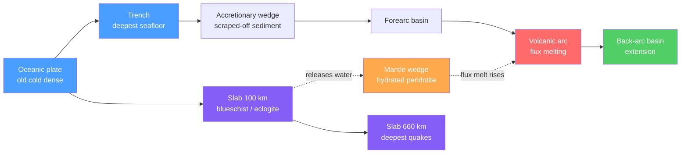

# ⛰️ Subduction Zones and Mountain Building

> [!abstract] TL;DR
> Where plates converge, the older, colder, denser slab of **oceanic lithosphere bends down into the mantle** at a **trench** and sinks — its own negative buoyancy provides **slab pull**, the single largest force driving plate motion. The descending slab lights up a dipping plane of earthquakes (the **Wadati–Benioff zone**, traceable to $\sim660$ km) and drives a "subduction factory": an **accretionary wedge**, a **forearc**, and a **volcanic arc** born of **flux melting** as water from the slab lowers the mantle solidus. Convergence thickens crust and builds mountains — **Andean** (subduction), **collisional** (Himalaya–Tibet), and **accretionary** (terrane) orogens — whose high peaks are held up isostatically by deep crustal roots.

## Intuition — analogy FIRST

Drop a cold, wet dishcloth onto the surface of a full sink. At first it floats, but where one edge dips below the water it begins to sag, and the heavy, waterlogged part pulls the rest of the cloth down after it — the cloth *subducts* itself. Oceanic lithosphere behaves the same way: fresh at the ridge it is warm and buoyant, but over $\sim100$ million years it cools, thickens, and grows **denser than the mantle beneath it**. Once an edge founders at a trench, the sinking slab pulls the whole plate along like that drooping cloth. That pull is the engine of plate tectonics.

Now push two sheets of paper toward each other on a desk. Neither can dive under the other easily, so they crumple upward into ridges and folds. When two *continents* meet — India into Asia — that is exactly what happens: nothing sinks, everything thickens, and the crust piles into the highest mountains on Earth.

---

## How It Works



---

## Key Concepts / Details

### Secondary Level

At a **convergent boundary**, two plates move toward each other and one is forced down beneath the other — this is **subduction**. There are three flavours:

| Convergence | What subducts | Example | Result |
|-------------|---------------|---------|--------|
| Ocean–ocean | Older, denser oceanic plate | Mariana, Tonga | **Island arc** (e.g. Japan, Aleutians) |
| Ocean–continent | Oceanic plate under continent | Andes (Nazca under S. America) | **Continental / Andean arc** + high mountains |
| Continent–continent | Neither — collision | Himalaya (India–Asia) | Huge thickened mountain belt |

Key surface features, from ocean toward land: a deep **oceanic trench** (the lowest points on Earth — the Mariana Trench is $\sim11$ km deep), a chain of **earthquakes** that get deeper away from the trench, and a curved **volcanic arc**. Most of the planet's large earthquakes and explosive volcanoes ring the Pacific along these zones — the **Ring of Fire**. Where crust is squeezed instead of subducted, rock folds and breaks along **thrust faults** and stacks up into **mountains** (**orogeny**).

### Undergraduate Level

**Why old ocean floor sinks — slab pull.** Oceanic lithosphere cools by conduction as it ages, so its density rises with the thermal contraction $\Delta\rho = \rho_m\,\alpha\,\Delta T$. After $\sim20$–$30$ Myr it becomes denser than the underlying asthenosphere. The **negative buoyancy** of the cold slab, integrated down its length, is the **slab-pull force** per unit trench length:

$$F_{sp} \approx \Delta\rho\; g\; h\; L \;\sim\; \left(\rho_m\alpha\,\Delta T\right) g\, h\, L$$

with slab thickness $h\sim100$ km and down-dip length $L$. Numerically $F_{sp}\sim10^{13}\ \text{N m}^{-1}$ — several times larger than **ridge push**, making slab pull the **dominant plate-driving force**.

**The Wadati–Benioff zone.** Earthquakes nucleate within and along the cold, brittle descending slab, defining an inclined seismic plane from the trench down to $\sim660$ km (below that, mantle phase changes make the slab too warm/ductile to fail seismically). The **dip angle** $\delta$ varies enormously — near-horizontal *flat-slab* segments (parts of the Andes) to near-vertical ($\sim80°$, Marianas). For an idealised planar slab, focal depth grows with distance $x$ from the trench as $z = x\tan\delta$.

**The subduction factory and flux melting.** Contrary to intuition, the arc does **not** melt because the slab is hot. The slab carries seawater bound in hydrous minerals; as it heats, dehydration releases water into the overlying **mantle wedge**. Water dramatically **lowers the peridotite solidus** — **flux melting** — so the wedge melts even though it never crosses its *dry* solidus:

$$T_{solidus}^{wet} < T_{solidus}^{dry}$$

The melt rises to build the **volcanic arc**. Arc position sits above where the slab reaches $\sim100$–$150$ km depth. Slab rollback can open an extensional **back-arc basin** behind the arc.

**Paired metamorphic belts.** Subduction juxtaposes two opposite metamorphic regimes (Miyashiro, 1961):
- Near the trench: **high-P / low-T** — the cold slab drives up pressure without heating, forming **blueschist** and, deeper, **eclogite**.
- Under the arc: **high-T / low-P** — magmatic heat, forming Barrovian/Buchan assemblages.

**Isostatic support of mountains.** High topography is not held up by crustal strength but floats on the mantle. By **Airy isostasy**, a mountain of height $h$ requires a crustal **root** of depth $b$:

$$b = \frac{\rho_c}{\rho_m - \rho_c}\,h$$

With $\rho_c\approx2800$ and $\rho_m\approx3300\ \text{kg m}^{-3}$, $b\approx5.6\,h$ — the $\sim5$ km Tibetan Plateau demands a $\sim70$ km-thick crust, which seismology confirms.

**Three orogenic settings.**

| Orogen type | Mechanism | Type example |
|-------------|-----------|--------------|
| Andean / Cordilleran | Subduction under a continental margin | Andes, western N. America |
| Collisional | Continent–continent suture | Himalaya–Tibet, Alps, Appalachians/Caledonides |
| Accretionary | Terrane / arc accretion onto a margin | N. American Cordillera terranes |

### Graduate Level

**Force balance of a subducting slab.** Steady-state subduction is a competition between the driving slab pull and the resisting forces:

$$F_{sp} \;=\; F_{bend} \;+\; F_{visc} \;+\; F_{fric}$$

where $F_{bend}$ is the viscous dissipation of **bending the plate** at the trench (scaling steeply with plate thickness and inversely with bending radius), $F_{visc}$ is drag as the slab shears through the surrounding mantle, and $F_{fric}$ is interface friction. The partitioning controls slab dip, whether trenches **roll back** (advance seaward, driving back-arc extension) or advance, and the styles of flat-slab vs steep subduction. Only a fraction of $F_{sp}$ is transmitted to the surface plate — much is spent bending the slab.

**Ultra-high-pressure (UHP) metamorphism.** Continental crust dragged into a subduction zone can reach $>2.7$ GPa ($\sim90$+ km) — the stability field of **coesite** (high-P SiO$_2$) and even **microdiamond**. Their preservation in exhumed massifs (Dora Maira, Kokchetav, the Western Gneiss Region) shows continental material subducts deeply and then returns, requiring buoyancy-driven **exhumation** faster than it re-equilibrates thermally.

**Tectonics–erosion–climate feedback.** Orogens are governed by mass added by tectonic thickening versus mass removed by erosion. In a **critical-taper wedge**, the range grows until surface slope reaches a failure envelope; erosion then limits height and can localise deformation. Orographic rainfall focuses erosion on the windward flank (Himalayan front, Southern Alps of New Zealand), potentially driving rapid exhumation and, in some models, **channel flow** of weak lower crust. Elevation is capped near $\sim7$–$9$ km because thickened crust hot enough to flow cannot support more relief.

```python
import numpy as np
import matplotlib.pyplot as plt

# --- Wadati-Benioff zone: focal depth vs horizontal distance from the trench ---
# Idealised planar slab descending at a constant dip: z = x * tan(dip)
x = np.linspace(0, 1000, 500)          # horizontal distance from trench (km)
dips = [30, 45, 70]                    # slab dip angles (degrees)

plt.figure(figsize=(8, 5))
for dip in dips:
    z = x * np.tan(np.radians(dip))
    z = np.where(z <= 700, z, np.nan)  # slabs stop failing seismically near 660 km
    plt.plot(x, z, lw=2, label=f'dip = {dip} deg')

plt.axhline(660, ls='--', color='grey', label='660 km discontinuity')
plt.gca().invert_yaxis()               # depth increases downward
plt.xlabel('Horizontal distance from trench (km)')
plt.ylabel('Earthquake focal depth (km)')
plt.title('Idealised Wadati-Benioff Zone')
plt.legend(); plt.grid(True, alpha=0.3); plt.tight_layout()

# --- Airy isostasy: crustal root required to support a mountain of height h ---
rho_c, rho_m = 2800.0, 3300.0          # crust, mantle density (kg/m^3)
for h in [1.0, 3.0, 5.0]:              # elevation (km)
    root = rho_c / (rho_m - rho_c) * h
    print(f'Elevation {h:>4} km  ->  crustal root {root:5.1f} km below normal crust')
# Elevation  5.0 km -> ~28 km root -> ~70 km total crust (matches Tibet)
```

---

## Real-World Notes

- **Nazca–South America (Andes).** Oceanic Nazca plate subducts beneath continental South America, building an Andean arc; flat-slab segments (Pampean, Peru) shut off volcanism and broaden deformation inland.
- **India–Asia (Himalaya–Tibet).** Collision starting $\sim50$ Ma doubled the crustal thickness to $\sim70$ km, raising the Tibetan Plateau — the type example of continent–continent orogeny and isostatic roots.
- **Cascadia.** The Juan de Fuca slab subducts beneath the Pacific Northwest, capable of $M_w\,9$ megathrust ruptures (last in 1700 CE) and feeding the Cascade arc (Mt. St. Helens, Rainier).
- **Mariana Trench.** Old Pacific lithosphere subducts steeply into the deepest ocean trench on Earth ($\sim11$ km) — the end-member of steep, rollback-dominated "Mariana-type" subduction.
- **Appalachians / Caledonides.** A now-eroded Paleozoic collisional belt (Iapetus closure) whose deep roots have largely disappeared, illustrating post-orogenic exhumation and isostatic rebound.
- **Franciscan Complex, California.** Classic blueschist terrane — high-P/low-T metamorphism recording a fossil subduction interface.

---

## Common Pitfalls

1. **"The slab is pushed down."** Subduction is driven mainly by the slab's own **negative buoyancy (slab pull)**, not by plates being shoved together; ridge push is secondary.
2. **"Arc magmas come from melting the hot slab."** The dominant mechanism is **flux melting of the mantle wedge** by water released from the slab, which lowers the peridotite solidus — the slab itself rarely melts wholesale.
3. **"Deeper earthquakes are near the trench."** It is the reverse — the Wadati–Benioff zone **deepens away from the trench**, since the slab dips beneath the overriding plate.
4. **"Mountains are held up because rock is strong."** High topography is supported **isostatically** by low-density crustal roots floating on the mantle, not by material strength.
5. **"All convergence makes volcanoes."** Continent–continent **collision produces no arc** (nothing subducts to feed melting); flat-slab subduction likewise suppresses volcanism.
6. **"Subduction stops at the base of the crust."** Slabs penetrate deep into the mantle; seismicity extends to $\sim660$ km and tomography images some slabs sinking to the core–mantle boundary.

---

## Related Concepts

- [[_MOC_Plate_Tectonics|↑ Section MOC]]
- [[Continental_Drift_and_the_Plate_Tectonics_Revolution]] — the paradigm shift that made subduction thinkable
- [[Plate_Boundaries_and_Plate_Motions]] — convergent margins in the full boundary classification
- [[Seafloor_Spreading_and_Ocean_Basins]] — where lithosphere is *created*; subduction is where it is *destroyed*
- [[Mantle_Convection_and_Hotspots]] — slabs are the cold downwelling limbs of mantle convection
- [[Wilson_Cycle_and_Supercontinents]] — subduction opens and closes ocean basins over geologic time
- [[Seismology_and_Earthquakes]] — the Wadati–Benioff zone and megathrust ruptures
- [[Volcanism_and_Volcanic_Hazards]] — how flux melting builds island and continental arcs
- [[Metamorphism_and_Metamorphic_Facies]] — blueschist/eclogite vs arc high-T belts (paired metamorphism)
- [[Gravity_Isostasy_and_the_Geoid]] — isostatic support of mountain roots and elevation
- [[_MOC_Mathematics_Master]] — trigonometry of slab dip and the force balance of subduction

---

## Review Questions

1. **Secondary**: Name the three types of convergent boundary and give one real-world example of each. Which one builds volcanoes and which one does not, and why?
2. **Undergraduate**: A Wadati–Benioff zone dips at $45°$. Using $z = x\tan\delta$, at what horizontal distance from the trench do earthquakes reach $300$ km depth? Separately, use Airy isostasy to estimate the crustal root beneath a $4$ km mountain ($\rho_c=2800$, $\rho_m=3300\ \text{kg m}^{-3}$).
3. **Graduate**: Explain the force balance that sets a slab's dip angle and controls trench rollback. How does the tectonics–erosion–climate feedback (e.g. orographic precipitation) influence the height and internal deformation of a collisional orogen?

---

## Sources

- Stern, R.J. (2002) — "Subduction Zones," *Reviews of Geophysics* 40(4)
- Grove, Till & Krawczynski (2012) — "The Role of H$_2$O in Subduction Zone Magmatism," *Annu. Rev. Earth Planet. Sci.* 40
- Turcotte & Schubert — *Geodynamics*, 3rd ed. (slab forces, isostasy)
- Kearey, Klepeis & Vine — *Global Tectonics*, 3rd ed.
- Miyashiro, A. (1961) — "Evolution of Metamorphic Belts," *J. Petrology* 2

#earth-science #plate-tectonics #subduction #orogeny #slab-pull #flux-melting #isostasy #secondary #undergraduate #graduate
