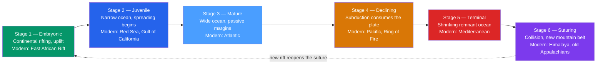

# 🔄 Wilson Cycle and Supercontinents

> [!abstract] TL;DR
> Ocean basins are not permanent — they are **born, grow, shrink, and die** on a timescale of hundreds of millions of years. The **Wilson cycle** (J. Tuzo Wilson, 1966) traces this life cycle through six stages, each with a living example: continental **rifting** (East African Rift) → a **narrow young ocean** (Red Sea) → a **wide mature ocean** with passive margins (Atlantic) → a **declining ocean** as subduction begins (Pacific) → a **terminal remnant** (Mediterranean) → **collision and a new mountain belt** (Himalaya). Stitch many Wilson cycles together and the continents themselves periodically gather into a single **supercontinent** and then disperse — Nuna, Rodinia, Pannotia, **Pangaea** — roughly every **400–600 Myr**. The next one, **Amasia / Pangaea Proxima**, is forecast for ~200–250 Myr from now. This rhythm paces global sea level, climate, biodiversity, and where mineral and energy resources are found.

## Intuition — analogy FIRST

Picture a crowded room where people slowly drift apart, open up dance floors between them, then, hours later, get pushed back together into one big cluster before drifting apart again. The **people are continents** and the **empty floor is ocean**. An ocean basin is just the gap that opens when two continents separate; it widens for a while, then closes again when the continents are shoved back together — and where they collide, they crumple upward into a mountain range, exactly the way two people squeezing together buckle the rug between them.

Now zoom out in time. Every few hundred million years the whole room clumps into one giant huddle — a **supercontinent** — sits there long enough to trap the planet's internal heat like a thick blanket, and then splits apart when that trapped heat forces a new rift open. The Atlantic you cross on a flight today did not exist 200 million years ago, and it will not exist 250 million years from now. Solid ground is a slow-motion tide.

---

## How It Works



---

### Secondary Level

**Wilson's insight.** In 1966 J. Tuzo Wilson asked, *"Did the Atlantic close and then re-open?"* Geologists had found matching fossils and mountain belts (the Appalachians of North America and the Caledonides of Scotland/Scandinavia) split across the Atlantic. Wilson realised an earlier ocean — the **Iapetus** — had closed to build those mountains, and the *modern* Atlantic later reopened almost along the same seam. Oceans have life cycles.

**The six stages** (each with a place you can visit today):

| Stage | Name | What is happening | Modern example |
|-------|------|-------------------|----------------|
| 1 | Embryonic | Continent domes up and **rifts**; a rift valley forms | East African Rift |
| 2 | Juvenile | Rift floods; **seafloor spreading** starts; narrow ocean | Red Sea, Gulf of California |
| 3 | Mature | Ocean widens; quiet **passive margins** on both sides | Atlantic Ocean |
| 4 | Declining | A **subduction zone** starts eating the ocean floor | Pacific Ocean |
| 5 | Terminal | Ocean nearly closed; continents almost touching | Mediterranean Sea |
| 6 | Suturing | Continents **collide**; ocean gone; mountains rise | Himalaya (India–Asia) |

**Passive vs active continental margins.** A margin is simply the edge of a continent where it meets the sea.

| Feature | Passive margin | Active margin |
|---------|----------------|---------------|
| Plate boundary at the edge? | No (mid-plate) | Yes (subduction or transform) |
| Earthquakes / volcanoes | Quiet | Frequent |
| Shape | Broad shelf, thick sediment wedge | Narrow shelf, deep-sea **trench**, volcanic arc |
| Born during | Rifting / opening (stages 2–3) | Closing / subduction (stages 4–5) |
| Example | US East Coast, West Africa | Andes (Chile), California |

### Undergraduate Level

**Why ridges control sea level.** A young ocean floor is hot and buoyant, so it sits high; as it ages and cools it contracts and sinks. Ocean depth grows with the square root of lithospheric age (half-space cooling):

$$d(t) = d_0 + k\sqrt{t}$$

When spreading is **fast**, the ridge system is voluminous, young, and shallow — it physically **displaces seawater onto the continents**, driving a global (eustatic) **highstand** and flooding continental interiors. The mid-Cretaceous highstand (~+200 m, when spreading was rapid) drowned much of the continents in shallow seas. When spreading slows and ridges age, sea level falls. So the Wilson/supercontinent rhythm is written into the rock record as cycles of marine flooding and retreat.

**Climate and the carbon cycle.** A supercontinent has a vast interior far from any ocean, so its heartland becomes intensely **arid** with extreme seasonal swings (continentality) — Pangaea's interior hosted enormous deserts. Configuration also tunes the long-term thermostat: mountain uplift and warm wet climates accelerate **silicate weathering**, which draws down atmospheric $\text{CO}_2$ (the Urey reaction),

$$\text{CaSiO}_3 + \text{CO}_2 \;\longrightarrow\; \text{CaCO}_3 + \text{SiO}_2,$$

cooling the planet over millions of years. Rifting and flood basalts release $\text{CO}_2$; collision and weathering consume it.

**Biodiversity and resources.** Breakup fragments habitats and raises sea level, multiplying shallow-shelf area and isolating populations → **provincialism and higher diversity**. Assembly does the reverse — merged shelves, fewer barriers, lower diversity, and stressed environments; Pangaea's peak coincides with the end-Permian, the largest mass extinction (see [[Mass_Extinctions_and_Paleoclimate]]). The cycle also localises resources: rifted **passive-margin basins** are the world's great oil and gas provinces, while continental **collisions** concentrate orogenic gold and metamorphic mineral belts.

**The supercontinent roster.**

| Supercontinent | Assembled | Dispersed | Signature orogeny / note |
|----------------|-----------|-----------|--------------------------|
| Nuna / Columbia | ~1.8 Ga | ~1.5 Ga | First well-established supercontinent |
| Rodinia | ~1.1 Ga | ~0.75 Ga | Grenville orogeny; "Snowball Earth" followed |
| Pannotia | ~0.6 Ga | ~0.55 Ga | Short-lived, contested |
| **Pangaea** | ~0.335 Ga | ~0.175 Ga | Variscan/Alleghanian; broke into Laurasia + Gondwana |
| Amasia / Pangaea Proxima | **+0.2–0.25 Ga (future)** | — | Projected next supercontinent |

### Graduate Level

**Introversion, extroversion, orthoversion.** How the *next* supercontinent assembles depends on *which* ocean closes.

| Model | Ocean that closes | Reassembly geometry | Forecast |
|-------|-------------------|---------------------|----------|
| **Introversion** | The young *interior* ocean opened at breakup (the Atlantic) | Continents reverse the last dispersal | **Pangaea Ultima / Proxima** — Atlantic recloses |
| **Extroversion** | The old *exterior* ocean (Panthalassa → Pacific) | Continents drift the long way and meet on the far side | **Novopangaea** |
| **Orthoversion** | Subduction girdle ~90° from the last centroid | New supercontinent forms ~$90^\circ$ away from the old one | **Amasia** over the Arctic |

Orthoversion (Mitchell et al., 2012) is favoured by paleomagnetic true-polar-wander data, which suggest successive supercontinents center ~$90^\circ$ apart along the ring of subduction.

**Self-destruction by mantle insulation.** A supercontinent acts as a thermal blanket over the mantle. Trapped heat builds a sub-continental thermal anomaly and a **degree-2 mantle upwelling** (linked to today's two great **LLSVPs** beneath Africa and the Pacific). That upwelling domes and rifts the supercontinent apart — assembly *causes* its own breakup. The cycle is thus a **coupled surface–mantle oscillation**, not just plate kinematics (see [[Mantle_Convection_and_Hotspots]]).

**Rhythms in the record.** The full supercontinent cycle recurs on ~$400$–$600$ Myr (some estimates ~$500$–$700$ Myr). Superimposed, workers report shorter cyclicities — a proposed ~$90$ Myr oscillation in detrital-zircon age spectra, strontium isotopes, and sea level — though whether these are genuine tectonic clocks or sampling artefacts is actively debated. Treat all periodicities as **hypotheses tested against data**, not laws.

```python
import numpy as np
import matplotlib.pyplot as plt

# ------------------------------------------------------------------
# 1) ONE Wilson cycle: schematic ocean-basin WIDTH vs TIME
#    rift -> open -> widen (max) -> subduct/close -> suture (width 0)
# ------------------------------------------------------------------
t = np.linspace(0, 500, 500)                      # Myr since rifting began
width = 6000 * np.sin(np.pi * t / 500) ** 1.4     # km; 0 at both birth and death

stages = {
    "Rift (E. African Rift)":        20,
    "Narrow ocean (Red Sea)":        70,
    "Mature (Atlantic)":            250,
    "Subduction (Pacific)":         360,
    "Terminal (Mediterranean)":     440,
    "Suture (Himalaya)":            495,
}

plt.figure(figsize=(9, 5))
plt.plot(t, width, lw=2, color="#2563eb")
for label, tm in stages.items():
    w = 6000 * np.sin(np.pi * tm / 500) ** 1.4
    plt.scatter([tm], [w], zorder=5, color="#dc2626")
    plt.annotate(label, (tm, w), textcoords="offset points",
                 xytext=(0, 8), fontsize=8, ha="center")
plt.xlabel("Time since rifting (Myr)")
plt.ylabel("Ocean-basin width (km)")
plt.title("A Wilson Cycle: the birth and death of an ocean basin")
plt.grid(True, alpha=0.3)
plt.tight_layout()

# ------------------------------------------------------------------
# 2) Supercontinent timeline over deep time
#    (negative = Ma in the past, positive = Myr into the future)
# ------------------------------------------------------------------
supercontinents = {
    "Nuna/Columbia": (-1800, -1500),
    "Rodinia":       (-1100,  -750),
    "Pannotia":       (-620,  -560),
    "Pangaea":        (-335,  -175),
    "Next (Amasia)":  ( 200,   300),
}
fig, ax = plt.subplots(figsize=(9, 2.6))
for name, (start, end) in supercontinents.items():
    ax.barh(0, end - start, left=start, height=0.5)
    ax.text((start + end) / 2, 0, name, ha="center", va="center", fontsize=8)
ax.axvline(0, color="k", ls="--", lw=1)           # "now"
ax.text(0, 0.4, "now", ha="center", fontsize=8)
ax.set_yticks([])
ax.set_xlabel("Time (Ma; negative = past, positive = future)")
ax.set_title("The supercontinent cycle: assembly and dispersal")
plt.tight_layout()

# Recurrence estimate from assembly-interval midpoints
mids = np.array([-1650, -925, -590, -255, 250])
periods = np.diff(mids)
print("Intervals between successive supercontinents (Myr):", periods)
print("Mean recurrence:", int(periods.mean()), "Myr")
```

---

## Real-World Notes

- **The Atlantic is opening; the Pacific is closing.** Every year the Atlantic widens a few centimetres at the Mid-Atlantic Ridge (a stage-3 ocean), while the Pacific shrinks as subduction zones around the Ring of Fire consume its floor (a stage-4 ocean). The two are in different phases of the *same* cycle.
- **East Africa is a continent tearing in two.** The East African Rift is a textbook stage-1 embryo; the Afar triple junction, where the Red Sea (stage 2) and Gulf of Aden meet the rift, shows one arm that succeeded (ocean) and one that stalled (a **failed rift**, or aulacogen).
- **The Mediterranean is a dying ocean.** It is the shrinking remnant of the **Tethys**, being squeezed shut as Africa converges on Europe — the terminal stage that will eventually raise a new Alpine–Himalayan-style range.
- **Passive margins hold the oil.** Sediment piling onto the quiet, subsiding shoulders of a young ocean (Gulf of Mexico, Brazil–West Africa "pre-salt," North Sea) builds the source and reservoir rocks for most of the world's hydrocarbons.
- **Old sutures are fossil oceans.** The Appalachian–Caledonian mountains mark the closure of the Iapetus Ocean before Pangaea; the Ural Mountains and the Himalaya are collisional scars where oceans vanished entirely.
- **Snowball Earth followed Rodinia's breakup.** The Neoproterozoic dispersal of Rodinia, spreading weatherable continents into the wet tropics, is a leading trigger for the extreme global glaciations of ~720–635 Ma.

---

## Common Pitfalls

1. **"Continents float on the ocean crust."** No — continental and oceanic lithosphere sit side by side on the mantle; oceanic plate *subducts beneath* continental plate because it is denser, driving the closing half of the cycle.
2. **Confusing rift stage with mature ocean.** A rift valley (East African Rift) has *continental* crust in the floor and no mid-ocean ridge yet. Only after seafloor spreading manufactures new *oceanic* crust (Red Sea) is a true ocean basin born.
3. **Treating supercontinent periods as an exact clock.** Recurrence is ~400–600 Myr *on average*; individual cycles vary widely, and shorter proposed rhythms (e.g., ~90 Myr) remain debated, not established.
4. **Assuming Pangaea was the only/first supercontinent.** Pangaea is simply the most recent and best-reconstructed. Rodinia and Nuna/Columbia preceded it; the record grows fuzzier further back.
5. **Passive ≠ permanently passive.** A passive margin is only passive until subduction nucleates along it (a poorly understood step); it can flip to an active margin and begin closing the very ocean it opened.
6. **Mixing up the future models.** "Amasia" (Pacific closes, continents gather near the pole) and "Pangaea Ultima/Proxima" (Atlantic recloses) are *competing* extroversion/introversion forecasts, not the same prediction.

---

## Related Concepts

- [[_MOC_Plate_Tectonics|↑ Section MOC]]
- [[Continental_Drift_and_the_Plate_Tectonics_Revolution]] — the matched fossils and mountains across the Atlantic that led Wilson to ask whether it had closed before
- [[Plate_Boundaries_and_Plate_Motions]] — divergent, convergent, and transform boundaries are the machinery that opens and shuts each ocean basin
- [[Seafloor_Spreading_and_Ocean_Basins]] — how ridge spreading manufactures the ocean floor whose width defines the Wilson cycle
- [[Subduction_Zones_and_Mountain_Building]] — the closing half of the cycle, consuming ocean floor and raising collisional ranges
- [[Mantle_Convection_and_Hotspots]] — the deep engine; supercontinent insulation and degree-2 upwellings drive assembly and breakup
- [[Earths_History_Hadean_to_Phanerozoic]] — where each supercontinent sits in the 4.5-Gyr story of the planet
- [[Mass_Extinctions_and_Paleoclimate]] — supercontinent assembly and flood basalts coincide with the largest biotic crises
- [[Geologic_Time_Scale]] — the framework that dates Rodinia, Pangaea, and the intervening cycles
- **Mathematics** — [[_MOC_Mathematics_Master]] — periodicity, spectral analysis, and curve fitting used to test for cyclicity in the geologic record

---

## Review Questions

1. **Secondary:** Put these modern places in order of *increasing* ocean age within the Wilson cycle: Mediterranean Sea, Atlantic Ocean, Red Sea, East African Rift. For each, name the Wilson stage it represents.
2. **Undergraduate:** Explain, using $d(t)=d_0+k\sqrt{t}$, why a *fast*-spreading planet has *higher* global sea level. How would you expect this to appear in the sedimentary record of a continental interior during a supercontinent-breakup episode?
3. **Graduate:** Contrast the introversion, extroversion, and orthoversion models for the next supercontinent. Which observations (paleomagnetic true polar wander, LLSVP geometry, current plate velocities) would you use to discriminate between an "Amasia over the Arctic" and a "Pangaea Ultima with a reclosed Atlantic," and what would each predict?

---

## Sources

- Wilson, J.T. (1966) — "Did the Atlantic Close and then Re-open?" *Nature* 211, 676
- Nance, R.D., Murphy, J.B. & Santosh, M. (2014) — "The supercontinent cycle: A retrospective essay," *Gondwana Research* 25, 4
- Mitchell, R.N., Kilian, T.M. & Evans, D.A.D. (2012) — "Supercontinent cycles and the calculation of absolute palaeolongitude," *Nature* 482, 208
- Marshak — *Earth: Portrait of a Planet*, Ch. on plate tectonics and the Wilson cycle
- Kearey, Klepeis & Vine — *Global Tectonics*, 3rd ed.
- Scotese, C.R. — PALEOMAP Project reconstructions of past and future continents

#earth-science #plate-tectonics #wilson-cycle #supercontinent #pangaea #rodinia #ocean-basins #passive-margin #secondary #undergraduate #graduate
