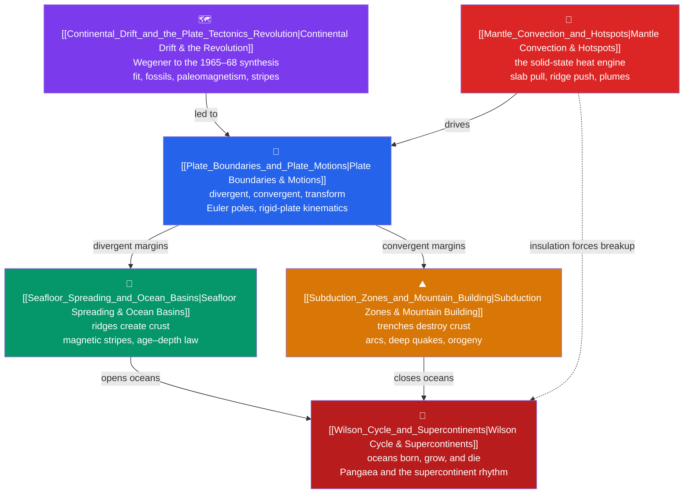

# 🗺️ Plate Tectonics & Geodynamics — Map of Content

> [!abstract] What This Section Covers
> Plate tectonics is the unifying theory of the solid Earth: the rigid lithosphere is broken into a dozen plates that glide over the ductile asthenosphere, and almost all earthquakes, volcanoes, and mountain belts are concentrated at their edges. This section runs from the historical revolution — Wegener's rejected continental drift resurrected by seafloor spreading and paleomagnetism into the 1965–1968 rigid-plate synthesis — through the machinery of the three boundary types and their Euler-pole kinematics, into the twin processes that create ocean floor at ridges and destroy it at subduction zones, down to the mantle-convection heat engine that drives it all, and out to the deep-time Wilson cycle in which whole ocean basins are born and die and continents periodically gather into supercontinents. Each of the six notes opens with an everyday analogy and deepens from secondary intuition to graduate-level quantitative geodynamics.

## Concept Map

*(Purple = the historical foundation, blue = the organizing framework, green/orange = the create/destroy processes, red = the driving engine and the deep-time synthesis; solid arrows = "leads to / drives", dashed = a deeper feedback.)*

## Learning Path

1. [[Continental_Drift_and_the_Plate_Tectonics_Revolution]] — Start here: how Wegener's four lines of evidence, seafloor spreading, and the Vine–Matthews–Morley stripes turned "drift" into the rigid-plate synthesis of geology.
2. [[Plate_Boundaries_and_Plate_Motions]] — The organizing framework: the three boundary types, and Euler-pole kinematics ($\mathbf{v}=\boldsymbol{\omega}\times\mathbf{r}$) that describe rigid plates moving on a sphere.
3. [[Seafloor_Spreading_and_Ocean_Basins]] — The divergent-boundary process where new lithosphere is created; magnetic stripes, the ophiolite sequence, and the √t age–depth subsidence law.
4. [[Subduction_Zones_and_Mountain_Building]] — The convergent-boundary process where lithosphere is destroyed; slab pull, the Wadati–Benioff zone, flux melting, arcs, and isostatic mountain roots.
5. [[Mantle_Convection_and_Hotspots]] — The engine underneath: solid-state convection set by the Rayleigh number, plumes and hotspot tracks, and the true driving forces behind plate motion.
6. [[Wilson_Cycle_and_Supercontinents]] — The synthesis across deep time: the six-stage life cycle of an ocean basin and the ~400–600 Myr supercontinent rhythm from Rodinia to Pangaea to Amasia.

## All Notes at a Glance

| Note | Difficulty | What You'll Learn |
|------|------------|-------------------|
| [[Continental_Drift_and_the_Plate_Tectonics_Revolution]] | Secondary → Graduate | Wegener's evidence, Pangaea, apparent polar wander, seafloor spreading, magnetic stripes, and the transform-fault synthesis on a sphere |
| [[Plate_Boundaries_and_Plate_Motions]] | Secondary → Graduate | Divergent/convergent/transform boundaries, Euler poles, relative vs absolute motion, triple junctions, plate-circuit closure, and driving forces |
| [[Seafloor_Spreading_and_Ocean_Basins]] | Secondary → Graduate | Mid-ocean ridges, Vine–Matthews–Morley stripes, ophiolites, half-space vs plate cooling, ridge morphology, and hydrothermal vents |
| [[Subduction_Zones_and_Mountain_Building]] | Secondary → Graduate | Slab pull, Wadati–Benioff zones, flux melting and arcs, paired metamorphic belts, Airy isostasy, and Andean/collisional/accretionary orogeny |
| [[Mantle_Convection_and_Hotspots]] | Secondary → Graduate | Solid-state creep, the Rayleigh number, mantle plumes and hotspot tracks, flood basalts, whole-mantle vs layered convection, and LLSVPs |
| [[Wilson_Cycle_and_Supercontinents]] | Secondary → Graduate | The six-stage ocean life cycle, passive vs active margins, sea-level and climate control, the supercontinent roster, and introversion/extroversion/orthoversion |

## Key Questions This Section Answers

- Why was continental drift rejected for 50 years, and what evidence finally resurrected it as plate tectonics?
- What are the three types of plate boundary, and why is a plate never the same thing as a continent?
- Why is no ocean floor older than ~200 Myr, and why does the seafloor deepen as the square root of its age?
- What actually drives the plates — and why is slab pull, not "ridge push" or a conveyor-belt current, the dominant force?
- How can a chain of volcanoes like Hawaii form thousands of kilometres from any plate boundary?
- Why does the solid mantle convect at all, and how does the Rayleigh number tell us it must?
- How are whole ocean basins born and destroyed, and how often do the continents gather into a supercontinent?

## Related Sections

- [[_MOC_Earth_Science_Master|↑ Earth Science Master MOC]]
- [[_MOC_Earth_Structure_Geophysics|→ Earth Structure & Geophysics]] — the lithosphere/asthenosphere layering, the 660 km boundary, seismology, internal heat, paleomagnetism, and isostasy that make plate tectonics possible
- [[_MOC_Rocks_Petrology|→ Rocks & Petrology]] — the basalt and gabbro of ocean crust, arc volcanism, and the metamorphic facies produced at subduction zones
- [[_MOC_Historical_Geology|→ Historical Geology & Deep Time]] — where each supercontinent and mass extinction sits in the 4.6-billion-year record
- [[Rotational_Dynamics|→ Rotational Dynamics]] (Physics) — the $\mathbf{v}=\boldsymbol{\omega}\times\mathbf{r}$ rigid-body kinematics behind Euler-pole plate motion
- [[Laws_of_Thermodynamics|→ Laws of Thermodynamics]] (Physics) — Earth as a cooling heat engine driving mantle convection

## Key References

- Kearey, Klepeis & Vine — *Global Tectonics* (3rd ed.) — the modern textbook synthesis for this whole section
- Turcotte & Schubert — *Geodynamics* (3rd ed.) — the quantitative standard for cooling, isostasy, and slab forces
- Fowler, C.M.R. — *The Solid Earth: An Introduction to Global Geophysics* (2nd ed.) — plate kinematics and mantle convection
- Cox, A. & Hart, R.B. — *Plate Tectonics: How It Works* — Euler-pole treatment with worked problems
- USGS — *This Dynamic Earth* — accessible plate-boundary overview

#MOC #EarthScience #PlateTectonics
