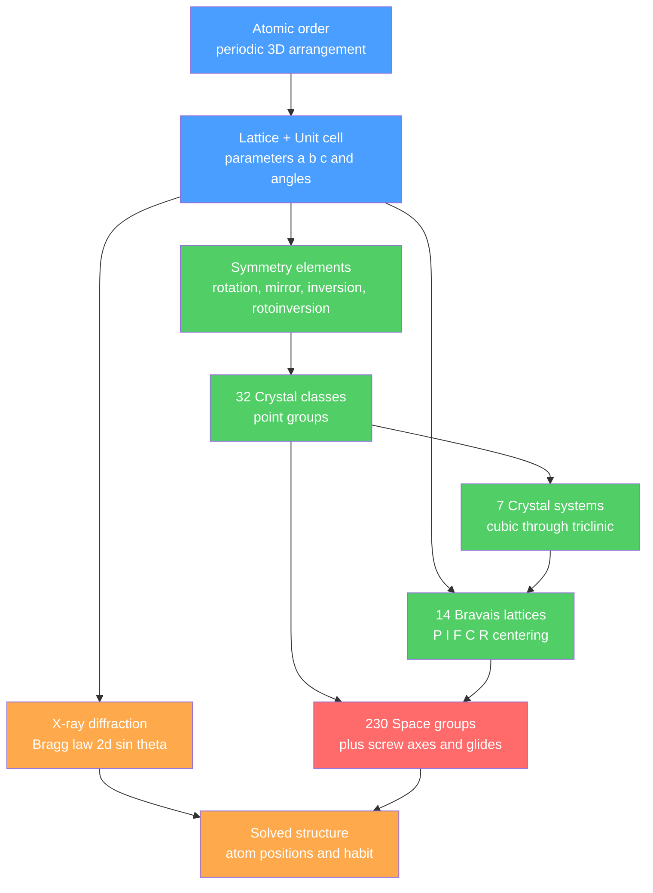

# 🔷 Crystal Systems and Symmetry

> [!abstract] TL;DR
> A crystal is matter in which atoms repeat in an ordered, periodic pattern — a **lattice** built from a single **unit cell** with parameters $a,b,c,\alpha,\beta,\gamma$. The symmetry of that repeat (rotation axes, mirror planes, inversion, rotoinversion) is severely restricted: only 1-, 2-, 3-, 4-, and 6-fold rotations are allowed, which sorts all crystals into **32 crystal classes**, **7 crystal systems**, and **14 Bravais lattices**. We read the geometry through flat crystal faces (Steno's constancy of interfacial angles) and, decisively, through **X-ray diffraction** governed by Bragg's law $n\lambda = 2d\sin\theta$. At graduate level, adding translational symmetry (screw axes, glide planes) gives the **230 space groups**, and quasicrystals stand as the aperiodic exception that rewrote the definition of "crystal."

## Intuition — analogy FIRST

Think of tiling a bathroom floor. If your tiles are squares, rectangles, triangles, or hexagons, you can cover the whole floor with **no gaps** — the pattern repeats forever. But try to tile a floor with regular pentagons and you always leave holes. A crystal is a *three-dimensional* tiled floor of atoms: nature only permits shapes whose repeat unit fills space completely.

This one fact — that the repeat must fill space — is why crystals can have 2-, 3-, 4-, or 6-fold rotational symmetry but **never** 5-fold. The beautiful flat faces of a quartz or garnet crystal are not decoration; they are the outward shadow of this hidden atomic tiling, and their angles are fixed no matter how big or misshapen the crystal grows.

---

## How It Works

The external **habit** of a crystal (its shape) is the macroscopic expression of a microscopic **lattice**. Symmetry elements acting on the unit cell restrict which lattices are geometrically possible; diffraction lets us measure the lattice we cannot see.



---

## Key Concepts / Details

### Secondary Level

**Crystalline vs amorphous.** In a crystal, atoms occupy a repeating pattern with long-range order (halite, quartz). In an amorphous solid (volcanic glass, opal) atoms are frozen in disorder — no lattice, no faces.

**Steno's Law (constancy of interfacial angles, 1669).** The angles between equivalent faces of a mineral are always the same for a given species, regardless of specimen size or distortion. Two quartz crystals — one tiny, one fist-sized — share identical face angles because both express the same lattice. This was the first quantitative evidence for internal order.

**The seven crystal systems.** Every crystal belongs to one of seven systems, distinguished by the shape of the unit cell and its characteristic symmetry:

| System | Lattice parameters | Diagnostic symmetry | Bravais lattices | Example minerals |
|--------|--------------------|---------------------|:----------------:|------------------|
| Cubic (isometric) | $a=b=c;\ \alpha=\beta=\gamma=90^\circ$ | four 3-fold axes | 3 (P, I, F) | Halite, garnet, pyrite |
| Tetragonal | $a=b\neq c;\ \alpha=\beta=\gamma=90^\circ$ | one 4-fold axis | 2 (P, I) | Zircon, rutile |
| Orthorhombic | $a\neq b\neq c;\ \alpha=\beta=\gamma=90^\circ$ | three ⊥ 2-fold axes | 4 (P, I, F, C) | Olivine, topaz, barite |
| Monoclinic | $a\neq b\neq c;\ \alpha=\gamma=90^\circ\neq\beta$ | one 2-fold axis / mirror | 2 (P, C) | Gypsum, orthoclase, mica |
| Triclinic | $a\neq b\neq c;\ \alpha\neq\beta\neq\gamma$ | only 1-fold / inversion | 1 (P) | Plagioclase, kyanite |
| Hexagonal | $a=b\neq c;\ \alpha=\beta=90^\circ,\gamma=120^\circ$ | one 6-fold axis | 1 (P) | Beryl, apatite |
| Trigonal (rhombohedral) | $a=b=c;\ \alpha=\beta=\gamma\neq90^\circ$ | one 3-fold axis | 1 (R) | Calcite, quartz, corundum |

Note the totals: $3+2+4+2+1+1+1 = 14$ **Bravais lattices**.

### Undergraduate Level

**Symmetry elements.** A symmetry operation maps the crystal onto itself. The point-symmetry elements are:

| Element | Symbol | Action |
|---------|--------|--------|
| Rotation axis | $n$ (1, 2, 3, 4, 6) | rotate by $360^\circ/n$ |
| Mirror plane | $m$ | reflect across a plane |
| Center of symmetry | $i$ or $\bar{1}$ | invert through a point $(x,y,z)\!\to\!(-x,-y,-z)$ |
| Rotoinversion axis | $\bar{n}$ ($\bar{1},\bar{3},\bar{4},\bar{6}$) | rotate $360^\circ/n$, then invert ($\bar{2}\equiv m$) |

**Why 5-fold is forbidden (the crystallographic restriction theorem).** For a rotation by $\theta = 360^\circ/n$ to be a lattice symmetry, mapping lattice points onto lattice points forces the trace of the rotation matrix to be an integer:

$$1 + 2\cos\theta \in \mathbb{Z} \;\Rightarrow\; 2\cos\theta \in \mathbb{Z}.$$

Only $2\cos\theta \in \{-2,-1,0,1,2\}$ work, giving $\theta = 180^\circ, 120^\circ, 90^\circ, 60^\circ, 360^\circ$ — i.e. $n = 2,3,4,6,1$. A 5-fold axis needs $2\cos72^\circ \approx 0.618$, not an integer, so it cannot repeat periodically. Combining the allowed elements in all self-consistent ways yields exactly **32 crystal classes (point groups)**.

**Miller indices $(hkl)$.** To label a lattice plane: take its intercepts on the axes (in units of $a,b,c$), take reciprocals, and clear to the smallest integers. A plane cutting $a$ at 1, $b$ at 2, $c$ at $\infty$ gives reciprocals $1, \tfrac12, 0 \to (210)$. A bar denotes a negative index, e.g. $(\bar{1}10)$. Hexagonal crystals use the four-index Miller–Bravais notation $(hkil)$ with $i=-(h+k)$ to make symmetry-equivalent faces obvious.

**Interplanar spacing.** For the general orthorhombic case,

$$\frac{1}{d_{hkl}^2} = \frac{h^2}{a^2} + \frac{k^2}{b^2} + \frac{l^2}{c^2},$$

which for the cubic system ($a=b=c$) collapses to the clean result

$$d_{hkl} = \frac{a}{\sqrt{h^2 + k^2 + l^2}}.$$

**Bragg's Law.** X-rays scattering from successive lattice planes spaced $d$ apart interfere constructively only when the extra path length $2d\sin\theta$ equals a whole number of wavelengths:

$$n\lambda = 2d\sin\theta.$$

This is [[Interference_and_Diffraction|constructive interference]] applied to atomic planes — the same physics as light through a grating (see [[Wave_Motion_and_Properties]]). Measuring the angles $\theta$ at which reflections appear inverts back to the $d$-spacings, and hence the lattice.

**Habit, form, and twinning.** *Habit* is a specimen's overall shape (prismatic, tabular, acicular); *form* is a set of symmetry-equivalent faces. Both are constrained by — but not identical to — the crystal class, since growth conditions bias which faces develop. **Twinning** is the intergrowth of two or more crystals of the same species in a specific symmetric relationship (a shared plane or axis), as in the "swallowtail" twins of gypsum or the Carlsbad twins of orthoclase.

### Graduate Level

**Bravais lattices and centering.** The 14 Bravais lattices arise from decorating the 7 primitive cells with lattice points at cell interiors (body-centered, $I$), all faces ($F$), or one pair of faces ($C$). Not every centering is distinct in every system; e.g. a "face-centered tetragonal" cell can always be redrawn as a smaller body-centered tetragonal cell, which is why tetragonal has only $P$ and $I$.

**The 230 space groups.** Point groups describe symmetry about a fixed point. Adding lattice **translations** plus two roto-translational elements — **screw axes** $n_m$ (rotate $360^\circ/n$ *and* translate a fraction $m/n$ along the axis) and **glide planes** (reflect *and* translate) — expands the 32 point groups into exactly **230 space groups**, the complete symmetry catalogue for periodic crystals (Fedorov, Schoenflies, Barlow, ~1890s).

**Reciprocal lattice and the structure factor.** Diffraction is naturally described in reciprocal space, where each set of planes $(hkl)$ becomes a single point $\mathbf{G}_{hkl}$. The Laue condition $\Delta\mathbf{k} = \mathbf{G}_{hkl}$ is equivalent to Bragg's law. The intensity of a reflection is set by the **structure factor**:

$$F_{hkl} = \sum_j f_j \, e^{2\pi i (h x_j + k y_j + l z_j)}, \qquad I_{hkl} \propto |F_{hkl}|^2,$$

summed over atoms $j$ at fractional positions $(x_j,y_j,z_j)$ with scattering factors $f_j$. Centering and screw/glide symmetry cause **systematic absences** (e.g. body-centered lattices extinguish all reflections with $h+k+l$ odd), and reading which reflections vanish is precisely how the space group is deduced. Because detectors record $|F|^2$, the phases are lost — the celebrated **phase problem** of crystallography.

**Quasicrystals — the exception that redefined "crystal."** In 1982 Dan Shechtman observed a diffraction pattern from an Al–Mn alloy with sharp spots showing **10-fold symmetry** — impossible for any periodic lattice. Quasicrystals are ordered but *aperiodic*: they diffract like crystals yet never repeat, tiling space by Penrose-like rules. In 1992 the International Union of Crystallography rewrote the definition of a crystal as any solid with an *essentially discrete diffraction pattern*, dropping the requirement of periodicity. Shechtman received the 2011 Nobel Prize in Chemistry.

---

## Code Demo

```python
# Synthetic X-ray powder pattern for a cubic mineral.
# Computes d-spacings d = a / sqrt(h^2+k^2+l^2) and Bragg angles
# 2*theta = 2*arcsin(lambda / (2d)) for allowed (hkl) reflections.
import numpy as np
from itertools import product

a_cell = 5.6402      # halite (NaCl) lattice parameter, angstroms
wavelength = 1.5406  # Cu K-alpha X-ray wavelength, angstroms

def fcc_allowed(h, k, l):
    """Face-centered cubic selection rule: h,k,l all even OR all odd."""
    parities = {h % 2, k % 2, l % 2}
    return len(parities) == 1

# Enumerate reflections, group by s = h^2+k^2+l^2 (cubic d depends only on s)
seen = {}
for h, k, l in product(range(0, 5), repeat=3):
    s = h*h + k*k + l*l
    if s == 0 or not fcc_allowed(h, k, l):
        continue
    if s not in seen:
        seen[s] = (h, k, l)

print(f"Halite (NaCl), a = {a_cell} A, Cu K-alpha = {wavelength} A\n")
print(f"{'(hkl)':>8} {'h2+k2+l2':>9} {'d (A)':>9} {'2theta (deg)':>13}")
for s in sorted(seen):
    h, k, l = seen[s]
    d = a_cell / np.sqrt(s)
    sin_theta = wavelength / (2 * d)
    if sin_theta > 1.0:          # reflection beyond the Ewald sphere
        continue
    two_theta = 2 * np.degrees(np.arcsin(sin_theta))
    print(f"{f'({h}{k}{l})':>8} {s:>9} {d:>9.3f} {two_theta:>13.2f}")

# Expected first peaks (matches real NaCl pattern):
#   (111) 2theta ~ 27.4 deg,  (200) ~ 31.7 deg,  (220) ~ 45.5 deg
```

---

## Real-World Notes

- **Halite and rock salt.** NaCl's face-centered cubic lattice gives it perfect **cubic cleavage** — hit a salt grain and it fractures into little cubes because the bonds break along equivalent low-energy lattice planes. Cleavage is symmetry made visible.
- **Quartz piezoelectricity.** Quartz belongs to trigonal class 32, which *lacks* a center of symmetry. That non-centrosymmetry is exactly what allows quartz to generate a voltage under pressure — the basis of quartz watches and radio oscillators.
- **Gemstone identification.** Gemologists routinely infer crystal system from optical behavior: cubic minerals (garnet, diamond) are isotropic (single refractive index), while all other systems are anisotropic (birefringent), a direct consequence of lattice symmetry.
- **Polymorphism.** The same composition can crystallize in different systems: carbon as cubic **diamond** vs hexagonal **graphite**; CaCO$_3$ as trigonal **calcite** vs orthorhombic **aragonite**. Structure, not chemistry alone, sets the properties.
- **Protein crystallography.** The same Bragg/structure-factor machinery that solves mineral structures solves the atomic structure of proteins and DNA — Franklin's Photo 51 was an X-ray fiber-diffraction pattern.
- **Quasicrystalline minerals.** Icosahedrite (Al$_{63}$Cu$_{24}$Fe$_{13}$), found in a Siberian meteorite, is the first *natural* quasicrystal — proof that aperiodic order occurs in nature, not just the lab.

---

## Common Pitfalls

1. **Confusing habit with crystal system.** A mineral can grow needle-like or blocky under different conditions yet belong to the same system. Habit is growth-dependent; the underlying symmetry class is fixed.
2. **Assuming external faces guarantee a crystal.** Some rounded or massive minerals are fully crystalline internally with no faces developed, while some faceted-looking materials (glass) are amorphous. Diffraction, not appearance, is the arbiter.
3. **Miscounting: 32 vs 7 vs 14 vs 230.** These are different levels — 32 point groups (classes), 7 systems, 14 Bravais lattices, 230 space groups. They are not interchangeable; the space groups add translational symmetry the point groups lack.
4. **Forgetting the reciprocal in Miller indices.** Beginners plot intercepts directly. You must take *reciprocals* of the intercepts (and a zero index means the plane is parallel to that axis, i.e. intercept at infinity).
5. **Using the cubic $d$-formula for non-cubic crystals.** $d=a/\sqrt{h^2+k^2+l^2}$ holds **only** for cubic. Lower-symmetry systems need the full quadratic form with all lattice parameters.
6. **Thinking 5-fold symmetry is simply impossible.** It is forbidden only for *periodic* lattices. Quasicrystals achieve sharp 5- and 10-fold diffraction through aperiodic long-range order.

---

## Related Concepts

- [[_MOC_Minerals_Crystallography|↑ Section MOC]]
- [[What_Is_a_Mineral]] — the definition of a mineral requires an ordered internal atomic structure, which this note formalizes
- [[Silicate_Minerals]] — silicate frameworks (chains, sheets, tektosilicates) are classified by the symmetry of their SiO$_4$ linkage
- [[Non_Silicate_and_Ore_Minerals]] — carbonates, sulfides, and oxides sorted partly by their crystal systems
- [[Mineral_Properties_and_Identification]] — cleavage, hardness anisotropy, and optics are all symmetry-controlled diagnostics
- [[Mineral_Stability_and_Phase_Diagrams]] — polymorphs occupy different symmetry structures across pressure–temperature space
- [[Solid_State_and_Crystal_Structures]] (Chemistry) — unit cells, packing fractions, and the 14 Bravais lattices from the chemistry side
- [[Interference_and_Diffraction]] (Physics) — Bragg's law is constructive interference from atomic planes
- [[Wave_Motion_and_Properties]] (Physics) — wavelength and path difference underpin the diffraction condition
- [[_MOC_Mathematics_Master]] (Mathematics) — group theory is the formal language of the 32 point groups and 230 space groups

---

## Review Questions

1. **Secondary:** Two crystals of the same mineral look very different — one is a long thin prism, the other a stubby block. Explain, using Steno's law, why a geologist can still identify them as the same species by measuring their faces.
2. **Undergraduate:** For halite ($a = 5.64$ Å, cubic), compute the interplanar spacing $d$ for the $(200)$ planes, then use Bragg's law with Cu K$\alpha$ ($\lambda = 1.541$ Å, $n=1$) to find the diffraction angle $2\theta$. Why does the $(200)$ reflection appear while $(100)$ does not for a face-centered lattice?
3. **Graduate:** Explain how systematic absences in a diffraction pattern reveal both lattice centering and the presence of screw axes or glide planes. Given the "phase problem," why is measuring $|F_{hkl}|^2$ insufficient to reconstruct the electron density directly, and name one method used to recover the phases.

---

## Sources

- Klein & Dutrow — *Manual of Mineral Science* (23rd ed.), Ch. on crystallography and symmetry
- Nesse — *Introduction to Mineralogy* (Oxford), symmetry and crystal chemistry chapters
- Kittel — *Introduction to Solid State Physics*, crystal structure and reciprocal lattice
- Hammond — *The Basics of Crystallography and Diffraction* (IUCr / Oxford)
- Shechtman, D. et al. (1984) — "Metallic Phase with Long-Range Orientational Order," *PRL* 53, 1951 (quasicrystals)

#earth-science #mineralogy #crystallography #symmetry #bravais-lattices #miller-indices #bragg-law #xrd #quasicrystals #secondary #undergraduate #graduate
