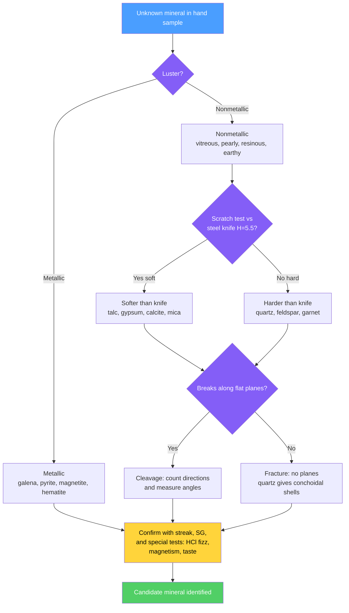

# 🔍 Mineral Properties and Identification

> [!abstract] TL;DR
> Geologists identify minerals in the field and lab by reading a suite of **diagnostic physical properties** — crystal habit, cleavage/fracture, hardness (the Mohs scale, 1–10), luster, color and streak, specific gravity, and tenacity — plus special tests like the fizz of carbonates in dilute HCl. Each property is a window onto the underlying **crystal structure and chemical bonding**: hardness tracks bond strength, cleavage tracks planes of weak bonding, and color arises from crystal-field $d$–$d$ transitions, charge transfer, or color centers. At the graduate level, physical ID is confirmed by **optical mineralogy** (polarizing microscope) and superseded for precision by **quantitative instruments** — electron microprobe, XRD, and Raman spectroscopy.

## Intuition — analogy FIRST

Identifying a mineral is like identifying a dog breed without asking the owner. You don't run a DNA test first — you read cheap, fast clues: size, coat, ear shape, temperament. Each clue narrows the field; together they pin down the breed. A geologist works the same way with a hand lens and a pocketknife: *Does it scratch glass? Does it break into flat sheets or curved shells? Is the powder red or white?* No single clue is decisive — color especially lies — but a handful of independent properties, read in the right order, converges on one mineral out of thousands.

The deep reason this works: every physical property is a macroscopic echo of the atomic architecture. Weak bonds become cleavage planes; strong 3-D bond networks become high hardness; unpaired $d$-electrons on transition-metal impurities become color. Read the properties and you are reading the crystal structure.

---

## How It Works



---

## Key Concepts / Details

### Secondary Level

**Crystal habit and form.** The external shape a mineral tends to grow into — cubic (pyrite, halite), prismatic (quartz), bladed (kyanite), fibrous (asbestos), botryoidal ("grape-like," hematite). Habit reflects internal symmetry; see [[Crystal_Systems_and_Symmetry]].

**Cleavage vs fracture.** Cleavage is breakage along planes of *weakest bonding* — it is repeatable and structurally controlled. Describe by **number of directions** and **angles** between them:

| Mineral | Cleavage directions | Angle | Structural cause |
|---------|--------------------|-------|------------------|
| Mica | 1 perfect | — | weak K interlayer bonds between silicate sheets |
| Feldspar | 2 | ~90° | two planes of weaker bonds |
| Amphibole | 2 | 56° / 124° | double-chain spacing |
| Pyroxene | 2 | ~87° / 93° | single-chain spacing |
| Halite, galena | 3 | 90° (cubic) | equal bonds along cube axes |
| Calcite | 3 | ~75° / 105° (rhombic) | rhombohedral packing |
| Fluorite | 4 (octahedral) | — | weakest planes cut cube corners |

**Fracture** is irregular breakage where bonding is uniform. **Conchoidal** fracture (smooth, curved, shell-like) is diagnostic of quartz, obsidian, and glass — no weak plane exists, so the crack follows the stress field.

**Hardness (Mohs scale).** Resistance to scratching, ranked 1–10 by reference minerals:

| Mohs | Mineral | Common tool |
|------|---------|-------------|
| 1 | Talc | — |
| 2 | Gypsum | fingernail ≈ 2.5 |
| 3 | Calcite | copper coin ≈ 3.5 |
| 4 | Fluorite | — |
| 5 | Apatite | steel knife ≈ 5.5 |
| 6 | Orthoclase | window glass ≈ 5.5, streak plate ≈ 6.5 |
| 7 | Quartz | — |
| 8 | Topaz | — |
| 9 | Corundum | — |
| 10 | Diamond | — |

The Mohs scale is **ordinal** — it ranks, it does not measure ratios. Diamond (10) is far more than "twice" quartz (7); see the demo below.

**Luster.** How light reflects: **metallic** (galena, pyrite) vs **nonmetallic** — vitreous (glassy, quartz), resinous (sphalerite), pearly (talc, mica faces), silky (fibrous gypsum), adamantine (brilliant, diamond), earthy/dull (kaolinite).

**Color and streak.** Color is often unreliable — quartz comes clear, purple, pink, or smoky depending on trace impurities and defects. **Streak**, the color of the powdered mineral rubbed on unglazed porcelain, is far more diagnostic because it removes surface and grain-size effects. Hematite is steel-gray in the lump but always leaves a **red-brown streak**.

**Specific gravity (SG).** Density relative to water, $G = \rho_{mineral}/\rho_{water}$. Quartz $\approx 2.65$, galena $\approx 7.5$, gold $\approx 19.3$. The "heft" test distinguishes a dense ore from ordinary rock in the hand.

**Tenacity.** Response to deformation: **brittle** (most silicates shatter), **malleable** (native gold flattens), **sectile** (gypsum cuts with a knife), **flexible** (talc bends and stays bent), **elastic** (mica bends and springs back).

**Special properties.** Fast, decisive tests:
- **Reaction to dilute HCl** — carbonates fizz (calcite vigorously; dolomite only when powdered) as $CO_2$ is released.
- **Magnetism** — magnetite is strongly attracted to a magnet.
- **Taste** — halite is salty (used sparingly and safely).
- **Double refraction** — clear calcite (Iceland spar) splits text into a double image.
- **Fluorescence** and **radioactivity** for specific accessory minerals.

### Undergraduate Level

**The origin of color.** Minerals are **idiochromatic** (color is intrinsic, from an essential element — malachite's green from $Cu$, azurite's blue) or **allochromatic** (color from trace impurities and defects). Three physical mechanisms dominate:

1. **Crystal-field $d$–$d$ transitions** — a transition-metal ion sits in a coordination polyhedron; the ligand field splits its $d$-orbitals by an energy gap $\Delta_o$, and light of energy $E = \Delta_o$ is absorbed. Ruby is $Cr^{3+}$ substituting for $Al^{3+}$ in corundum; emerald is the *same* $Cr^{3+}$ in beryl — a different ligand field shifts the color from red to green. See [[Coordination_Chemistry_and_Ligand_Field_Theory]].
2. **Charge-transfer** — an electron hops between neighboring ions of different valence. Blue sapphire's color is $Fe^{2+} \rightarrow Ti^{4+}$ intervalence charge transfer, a very strong absorption.
3. **Color centers** — a lattice defect (a vacancy trapping an electron, often produced by natural irradiation) absorbs light. Smoky quartz, purple fluorite, and blue halite are color-center minerals.

This is *why* streak beats color: the diagnostic streak reflects bulk composition, while color is hostage to parts-per-million of chromophore.

**Hardness and bonding.** Mohs hardness tracks **bond strength and structure**. Diamond and graphite are both pure carbon, yet diamond is 10 and graphite ~1–2: diamond is a 3-D covalent network, graphite is strong sheets held by weak van der Waals forces (which also make graphite a lubricant). Hardness is anisotropic — kyanite is ~4.5 parallel to its length but ~6.5 across it, a diagnostic feature.

**Optical mineralogy — the polarizing microscope.** Minerals are ground to a standard **30 µm thin section** and examined in transmitted light. Two modes:

- **Plane-polarized light (PPL):** shows natural color, **relief** (how strongly the grain stands out, set by the refractive-index contrast with the $n = 1.54$ mount), and **pleochroism** — color change as the stage rotates, because an anisotropic crystal absorbs differently along different vibration directions.
- **Cross-polarized light (XPL):** a second polarizer (the analyzer) is inserted at 90°. **Isotropic** minerals (cubic and glass, single refractive index) stay dark. **Anisotropic** minerals show **interference colors** set by the retardation

$$\Gamma = t\,(n_\gamma - n_\alpha)$$

where $t$ is section thickness and $(n_\gamma - n_\alpha)$ is the **birefringence**. Because $t$ is fixed at 30 µm, the interference color read against a **Michel-Lévy chart** gives the birefringence directly — quartz shows first-order gray-white, calcite shows high-order pastel. Anisotropic grains go dark four times per full rotation — the **extinction** positions — and the **extinction angle** relative to cleavage is diagnostic. Refractive index and birefringence are optical consequences of anisotropy; see [[Polarization_and_Dispersion]] and [[Geometric_and_Wave_Optics]].

### Graduate Level

For rigorous, quantitative identification, physical properties are **confirmatory** and instruments are definitive:

- **Electron probe microanalysis (EPMA):** a focused electron beam excites characteristic X-rays; wavelength-dispersive spectrometers (WDS) give element concentrations to ~0.01 wt%, yielding a full chemical formula from a spot a few µm across. The standard for mineral chemistry and zoning.
- **X-ray diffraction (XRD):** identifies the **crystal structure** via Bragg's law,

$$n\lambda = 2d\sin\theta$$

where $d$ is the interplanar spacing. The pattern of $d$-spacings is a structural fingerprint — the only reliable way to separate polymorphs (calcite vs aragonite, both $CaCO_3$) and clay minerals.
- **Raman spectroscopy:** measures vibrational (phonon) modes from inelastic light scattering; non-destructive, needs no preparation, and can probe µm-scale inclusions *inside* a host crystal (diagnostic of formation conditions).

These methods **supersede** physical ID where precision matters, but the trained eye at the outcrop still triages thousands of samples faster and cheaper than any spectrometer — physical properties remain the front line.

```python
# Demonstrate that the Mohs scale is ORDINAL and strongly non-linear:
# equal Mohs steps hide wildly unequal absolute (indentation) hardness.
import numpy as np
import matplotlib.pyplot as plt

minerals = ["Talc", "Gypsum", "Calcite", "Fluorite", "Apatite",
            "Orthoclase", "Quartz", "Topaz", "Corundum", "Diamond"]
mohs = np.arange(1, 11)
# Classic "absolute hardness" (relative indentation resistance)
absolute = np.array([1, 2, 9, 21, 48, 72, 100, 200, 400, 1500])

# Ratio of absolute hardness per single Mohs step
ratios = absolute[1:] / absolute[:-1]
for i in range(len(ratios)):
    print(f"Mohs {mohs[i]}->{mohs[i+1]} "
          f"({minerals[i]}->{minerals[i+1]}): x{ratios[i]:.1f} absolute")

fig, ax = plt.subplots(figsize=(7, 5))
ax.semilogy(mohs, absolute, "o-", lw=2, color="#845ef7")
for x, y, name in zip(mohs, absolute, minerals):
    ax.annotate(name, (x, y), textcoords="offset points",
                xytext=(6, -2), fontsize=8)
ax.set_xlabel("Mohs hardness (ordinal rank)")
ax.set_ylabel("Absolute indentation hardness (log scale)")
ax.set_title("Mohs is ordinal: diamond jumps ~4x corundum in one step")
ax.grid(True, which="both", alpha=0.3)
plt.tight_layout()
# The diamond point (10) sits far above a linear extrapolation of 1-9.
```

---

## Real-World Notes

- **Prospecting and field mapping.** A geologist's kit — hand lens, streak plate, dilute HCl bottle, magnet, and a knife — resolves most rock-forming minerals in seconds, long before any sample reaches a lab. Field ID is the throughput bottleneck's cure, not the lab.
- **Gemstone value from chromophores.** Ruby and sapphire are both corundum; the price gap is a few hundred ppm of $Cr$ vs $Fe$–$Ti$. Understanding crystal-field color underpins both grading and lab-grown/treatment detection.
- **Asbestos hazard from habit.** The danger of some amphiboles and serpentine is a *physical property* — fibrous, flexible habit that lodges in lung tissue — not chemistry alone.
- **Dolomite vs limestone.** In the field, calcite fizzes instantly in dilute HCl while dolomite reacts only when scratched to powder — a single drop distinguishes two major carbonate reservoir rocks.
- **Iceland spar and early optics.** Calcite's strong double refraction (birefringence 0.172) made it the material for the first polarizing prisms (Nicol prism), directly enabling optical mineralogy itself.
- **Magnetite and paleomagnetism.** Magnetite's magnetism is not just an ID test — it records ancient field directions, the backbone of [[Geomagnetism_and_Paleomagnetism]].

---

## Common Pitfalls

1. **Trusting color.** Color is the least reliable property for most nonmetallic minerals — trace chromophores and defects dominate it. Always confirm with streak, hardness, and cleavage.
2. **Confusing cleavage with crystal faces.** Growth faces (habit) and cleavage planes both look flat. Cleavage *repeats* on breaking and follows fixed crystallographic angles; a single smooth face may just be a grown surface.
3. **Misreading hardness from softer coatings or the wrong sample.** Weathering rinds, a softer intergrown mineral, or scratching a hard mineral *against* a softer plate (leaving a false "streak" of your own tool) all corrupt the test. Scratch a fresh surface and check which material actually gouged.
4. **Treating Mohs as linear.** A "6.5" is not the average of 6 and 7 in any physical sense — the scale is ordinal and the absolute hardness jump from corundum to diamond is enormous (see demo).
5. **Forgetting isotropic minerals stay dark in XPL.** A cubic mineral or glass showing no interference colors under crossed polars is not "missing" — extinction in all orientations is itself diagnostic of isotropy.
6. **Over-relying on one property.** No single test is decisive. Convergent evidence from several independent properties, read in a sensible order (luster → hardness → cleavage → special tests), is what pins down an identification.

---

## Related Concepts

- [[_MOC_Minerals_Crystallography|↑ Section MOC]]
- [[What_Is_a_Mineral]] — the definition (naturally occurring, inorganic, ordered structure) that makes these properties well-defined
- [[Crystal_Systems_and_Symmetry]] — symmetry controls habit, cleavage directions, and optical class (isotropic/uniaxial/biaxial)
- [[Silicate_Minerals]] — chain and sheet structures directly explain pyroxene, amphibole, and mica cleavage
- [[Non_Silicate_and_Ore_Minerals]] — carbonates (HCl test) and ore minerals (metallic luster, high SG) rely heavily on physical ID
- [[Mineral_Stability_and_Phase_Diagrams]] — which mineral forms, and its polymorph, determines the properties you observe
- [[Coordination_Chemistry_and_Ligand_Field_Theory]] — crystal-field $d$–$d$ splitting is the origin of mineral color (cross-vault: Chemistry)
- [[Chemical_Bonding_and_Molecular_Geometry]] — bond type and strength set hardness, cleavage, and tenacity (cross-vault: Chemistry)
- [[Polarization_and_Dispersion]] — birefringence, double refraction, and pleochroism are polarization optics (cross-vault: Physics)
- [[Geometric_and_Wave_Optics]] — refractive index, relief, and interference colors in thin section (cross-vault: Physics)
- [[_MOC_Mathematics_Master]] — angles, symmetry groups, and the geometry behind crystallography (cross-vault: Math)

---

## Review Questions

1. **Secondary:** You have a soft, nonmetallic sample that leaves a white streak, breaks into rhombs with three cleavage directions not at right angles, and fizzes in dilute HCl. Name the mineral and list the three tests that identify it.
2. **Undergraduate:** Ruby and emerald owe their colors to the same ion, $Cr^{3+}$. Explain, using crystal-field theory, why one is red and the other green. Why does this make *streak* a more reliable identifier than *color*?
3. **Graduate:** You must distinguish calcite from aragonite (both $CaCO_3$) and determine the trace-element zoning within a single grain. Which instrumental methods would you use for each task, and why is physical hand-sample ID insufficient here?

---

## Sources

- Klein & Dutrow — *Manual of Mineral Science*, 23rd ed. (Dana's), Ch. on physical properties
- Nesse — *Introduction to Mineralogy* and *Introduction to Optical Mineralogy*
- Burns — *Mineralogical Applications of Crystal Field Theory*, 2nd ed. (origin of color)
- Mohs, F. (1822) — *Grundriss der Mineralogie* (original hardness scale)
- Perkins — *Mineralogy*, 3rd ed. (XRD, EPMA, Raman methods)

#earth-science #mineralogy #mineral-identification #hardness #cleavage #streak #optical-mineralogy #crystal-field #secondary #undergraduate #graduate
