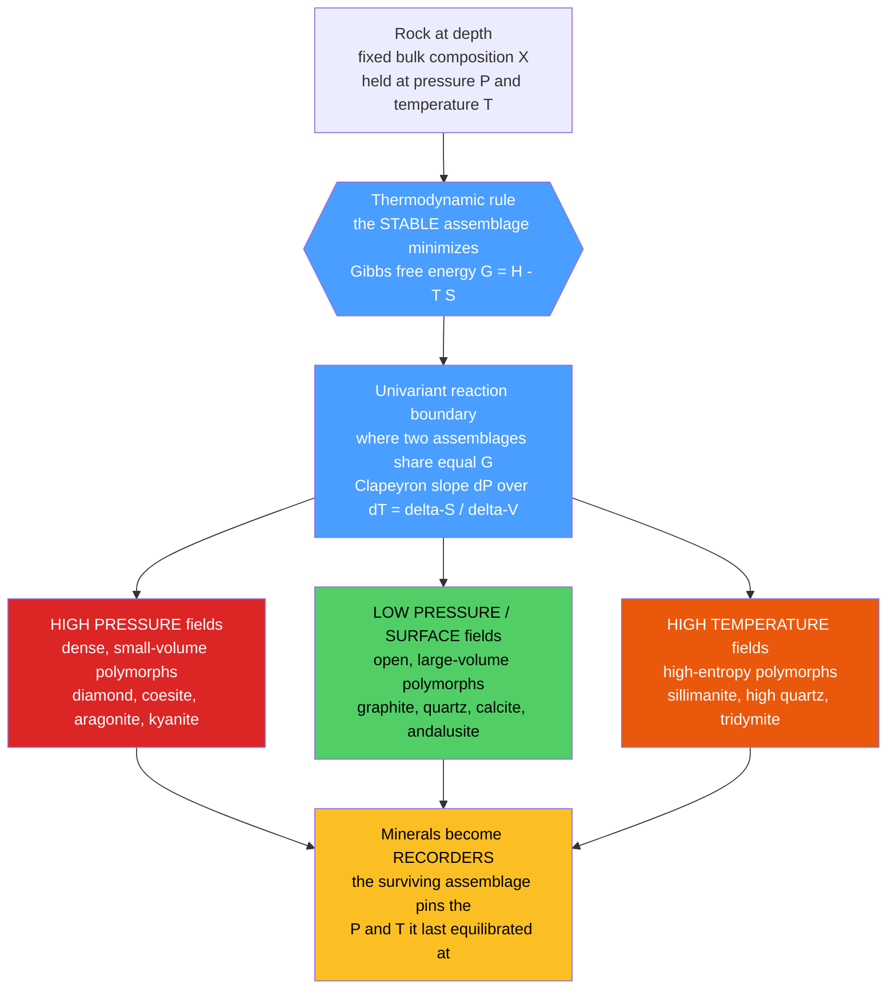

# ⚖️ Mineral Stability and Phase Diagrams

> [!abstract] TL;DR
> For a rock of fixed bulk composition, the mineral assemblage that is **stable** at a given pressure and temperature is simply the one with the **lowest Gibbs free energy** ($G = H - TS$). Because different minerals win that competition under different conditions, a mineral assemblage becomes a **recorder** of the P–T conditions it last equilibrated under. Reaction boundaries obey the **Clapeyron relation** $dP/dT = \Delta S/\Delta V$: dense, low-volume polymorphs (diamond, coesite, aragonite, kyanite) win at high pressure; high-entropy polymorphs (sillimanite, tridymite) win at high temperature. Diamonds are messengers from below ~150 km, the $\mathrm{Al_2SiO_5}$ triple point pins metamorphic grade, and mantle olivine polymorphs define the 410 and 660 km seismic discontinuities. Because reactions can be kinetically frozen, metastable phases like diamond and aragonite survive at the surface.

## Intuition — analogy FIRST

Imagine a crowded room where people rearrange to be **as comfortable as possible** given the conditions. When the room is cold and roomy (low temperature, low pressure) everyone spreads out into loose, open arrangements. Turn up the crowding (raise the pressure) and people are forced into tight, space-saving huddles. Turn up the heat (raise the temperature) and everyone wants to move freely and spread out again. Nature plays exactly this game with atoms: **pressure rewards compactness, temperature rewards disorder**, and the arrangement that best balances the two — the one with the lowest **Gibbs free energy** — is what you find.

Carbon is the perfect illustration. The *same* carbon atoms build soft, layered **graphite** at the surface and ultra-dense **diamond** deep in the mantle. Which one you get is dictated entirely by pressure and temperature. So when a diamond reaches your hand, it is carrying a message: *"I formed where the pressure exceeds a billion pascals — more than 150 km down."* Minerals are not just pretty crystals; they are **thermometers and barometers frozen into rock**.

---

## How It Works



---

### Undergraduate Level

**The governing principle: minimize Gibbs free energy.** At fixed pressure and temperature, the equilibrium assemblage is the one that minimizes

$$G = H - TS = U + PV - TS$$

Differentiating for a single phase gives the master relation

$$dG = V\,dP - S\,dT$$

so molar volume $V$ sets how $G$ responds to pressure and molar entropy $S$ sets how it responds to temperature. A **dense** phase (small $V$) is favored as $P$ rises; a **disordered** phase (large $S$) is favored as $T$ rises. This single equation explains every stability field below.

**The Clapeyron slope.** Along a reaction boundary between two assemblages, both have equal Gibbs energy, so $dG_1 = dG_2$. Setting $V_1\,dP - S_1\,dT = V_2\,dP - S_2\,dT$ and rearranging gives the **Clapeyron equation**:

$$\frac{dP}{dT} = \frac{\Delta S}{\Delta V} = \frac{\Delta H}{T\,\Delta V}$$

For solid–solid reactions $\Delta S$ and $\Delta V$ are nearly constant, so boundaries plot as **near-straight lines** in P–T space. See [[Chemical_Thermodynamics]] and [[Phase_Equilibria_and_Colligative_Properties]] for the full derivation.

**Polymorphs as barometers and thermometers.** One composition, several crystal structures — the classic recorders:

| System | Low-P / surface form | High-P (or high-T) form | What it records |
|--------|----------------------|-------------------------|-----------------|
| C | graphite (soft, layered) | **diamond** (dense, 3.51 g/cm³) | mantle pressures $\gtrsim$ 4.5 GPa, depths $>$ 150 km |
| $\mathrm{SiO_2}$ | quartz | **coesite** then **stishovite** | ultrahigh-P metamorphism and impact shock |
| $\mathrm{CaCO_3}$ | calcite | **aragonite** | high-P / low-T subduction (blueschist) |
| $\mathrm{Al_2SiO_5}$ | andalusite (low-P) | **kyanite** (high-P), **sillimanite** (high-T) | metamorphic P–T grade |

**The $\mathrm{Al_2SiO_5}$ triple point — the petrologist's compass.** Three polymorphs of the same formula meet at one invariant point, dividing P–T space cleanly:

| Polymorph | Crystal system | Density (g/cm³) | Stability field |
|-----------|----------------|-----------------|-----------------|
| **Kyanite** | triclinic | 3.61 | high P, low–moderate T |
| **Andalusite** | orthorhombic | 3.15 | low P, low–moderate T |
| **Sillimanite** | orthorhombic | 3.24 | high T |

The triple point sits near **~500 °C and ~3.8 kbar** (Holdaway, 1971; other calibrations place it near 550 °C, 4.2 kbar). Because the boundaries are so widely spaced, finding *which* polymorph a schist contains immediately brackets its metamorphic P–T path — kyanite means high-pressure Barrovian, andalusite means low-pressure Buchan. This is the preview of [[Metamorphism_and_Metamorphic_Facies]].

**Solid solutions, solvus, and exsolution.** Most rock-forming minerals are **solid solutions** with a continuous compositional range — olivine ($\mathrm{Mg_2SiO_4}$–$\mathrm{Fe_2SiO_4}$), plagioclase ($\mathrm{NaAlSi_3O_8}$–$\mathrm{CaAl_2Si_2O_8}$), garnet, pyroxene. At high $T$ a single homogeneous crystal is stable, but on **cooling** it may cross a **solvus** and become unstable, unmixing into two phases — **exsolution**. Perthite (albite lamellae in alkali feldspar) and pyroxene exsolution lamellae are textbook examples; the finer the lamellae, the faster the cooling.

**Geothermometry and geobarometry.** Because element partitioning between coexisting minerals is P- and T-sensitive, their compositions can be inverted to read off conditions. **Exchange reactions** (large $\Delta S$, e.g. Fe–Mg swapping in garnet–biotite) make good **thermometers**; **net-transfer reactions** (large $\Delta V$, e.g. the GASP barometer, garnet–aluminosilicate–plagioclase–quartz) make good **barometers**. The two-feldspar and two-pyroxene thermometers work the same way.

### Graduate Level

**The Gibbs phase rule** counts the degrees of freedom of an assemblage:

$$F = C - \varphi + 2$$

where $C$ is the number of components and $\varphi$ the number of phases. An **invariant point** ($F=0$, e.g. the $\mathrm{Al_2SiO_5}$ triple point) fixes both $P$ and $T$; a **univariant line** ($F=1$) is a reaction boundary; a **divariant field** ($F=2$) is a stable assemblage across a P–T area.

**Petrogenetic grids** assemble *all* univariant reaction curves and invariant points for a chemical system into one master map. **Schreinemakers analysis** dictates the permissible geometry: around any invariant point, the univariant lines (each labelled by its *absent* phase) must be arranged so that metastable extensions obey the "each line divides stable-from-metastable" rule, and no more than 180° may separate the stable segments of chemically consistent reactions. This lets petrologists build correct grids from thermodynamics alone, before any experiment.

**Pseudosections (equilibrium assemblage diagrams).** Modern petrology moves beyond fixed-composition grids to **Gibbs-energy-minimization** for a *specific* bulk composition. Programs such as THERMOCALC and Perple_X compute, at every P–T point, the assemblage that globally minimizes $G$, producing fields of divariant and trivariant assemblages tailored to one real rock. Overlaying mineral-composition isopleths (e.g. garnet $X_{\mathrm{Mg}}$) recovers the full P–T path.

**The mantle transition zone.** The 410 and 660 km seismic discontinuities are **solid–solid phase transitions** in $(\mathrm{Mg,Fe})_2\mathrm{SiO_4}$: olivine → **wadsleyite** (~410 km, ~13.5 GPa) → **ringwoodite** (~520 km, ~18 GPa) → **bridgmanite** + ferropericlase (~660 km, ~23 GPa). By the Clapeyron relation the 410 km transition has a **positive** slope (aids sinking slabs) while the 660 km transition has a **negative** $dP/dT$ (resists vertical flow, potentially layering convection). See [[Earth_Internal_Structure]].

**Metastability and kinetics.** Thermodynamics says *which* phase is stable; it says nothing about *how fast* the rock gets there. Reactions need to overcome an activation barrier, and rates fall exponentially as temperature drops (Arrhenius). Below ~ some threshold the transformation effectively stops, **freezing in a metastable phase**. This is precisely why we possess diamonds and aragonite shells at the surface — see [[Chemical_Equilibrium]].

```python
import numpy as np
import matplotlib.pyplot as plt

# Graphite <-> Diamond boundary from the Clapeyron relation dP/dT = dS/dV,
# built from standard-state molar data for the reaction graphite -> diamond.
M = 12.011e-3                     # kg/mol  molar mass of carbon
rho_g, rho_d = 2260.0, 3515.0     # kg/m^3  densities of graphite, diamond
V_g, V_d = M/rho_g, M/rho_d       # m^3/mol molar volumes
S_g, S_d = 5.74, 2.38             # J/mol/K standard molar entropies
dG0 = 2900.0                      # J/mol   G(diamond) - G(graphite) at 298 K, 1 bar

dV = V_d - V_g                    # m^3/mol  negative: diamond is denser
dS = S_d - S_g                    # J/mol/K  negative
dPdT = dS/dV                      # Pa/K     Clapeyron slope (positive)
print(f"Molar volume change dV = {dV*1e6:6.3f} cm^3/mol")
print(f"Clapeyron slope dP/dT  = {dPdT/1e6:6.3f} MPa/K")

# Equilibrium pressure at 298 K: solve dG0 + dV*(P - P0) = 0
T0, P0 = 298.0, 1e5
P_eq_298 = P0 - dG0/dV            # Pa
print(f"Equilibrium P at 298 K  = {P_eq_298/1e9:6.3f} GPa")

# Boundary line in P-T space
T = np.linspace(300, 2000, 400)                 # K
P_bnd = (P_eq_298 + dPdT*(T - T0)) / 1e9        # GPa

# A curved cratonic geotherm and hydrostatic pressure with depth
g, rho_m = 9.81, 3300.0
depth = np.linspace(0, 250, 400)                        # km
T_geo = 300 + 1400*(1 - np.exp(-depth/70))             # K, flattens at depth
P_geo = rho_m*g*(depth*1e3)/1e9                        # GPa

plt.figure(figsize=(7, 6))
plt.plot(T, P_bnd, "k-", lw=2, label="Graphite = Diamond boundary")
plt.fill_between(T, P_bnd, 10, color="#cfe8ff", alpha=0.6)   # diamond field
plt.fill_between(T, 0, P_bnd, color="#eaeaea", alpha=0.7)    # graphite field
plt.plot(T_geo, P_geo, "r--", lw=2, label="Cratonic geotherm")
plt.scatter([1473], [5.0], color="navy", zorder=5,
            label="Cratonic diamonds (~150 km)")
plt.text(1500, 7.4, "DIAMOND stable", fontsize=11, weight="bold")
plt.text(650, 0.8, "GRAPHITE stable", fontsize=11, weight="bold")

ax = plt.gca()
ax.set_xlabel("Temperature (K)"); ax.set_ylabel("Pressure (GPa)")
ax.set_xlim(300, 2000); ax.set_ylim(0, 10)
secax = ax.secondary_yaxis(
    "right",
    functions=(lambda P: P*1e9/(rho_m*g)/1e3, lambda z: rho_m*g*z*1e3/1e9))
secax.set_ylabel("Approx. depth (km)")
plt.legend(loc="lower right")
plt.title("Graphite-Diamond stability from the Clapeyron relation")
plt.tight_layout()
plt.show()
```

Running this prints $\Delta V \approx -1.90\ \mathrm{cm^3/mol}$, a Clapeyron slope of $\approx 1.8\ \mathrm{MPa/K}$, and an equilibrium pressure of $\approx 1.5\ \mathrm{GPa}$ at room temperature — after which the cratonic geotherm plunges into the diamond field near ~150 km depth, exactly where kimberlite-borne diamonds are sourced.

---

## Real-World Notes

- **Diamonds as deep messengers.** Natural diamonds crystallize at 4–6 GPa and 900–1300 °C (depths of 150–250 km) and are carried up in violent **kimberlite** eruptions. Mineral and fluid **inclusions** trapped inside them are pristine samples of the deep mantle, otherwise unreachable.
- **Coesite proves crust went deep.** Coesite discovered in metamorphic rocks of the Dora Maira massif (Western Alps; Chopin, 1984) showed continental crust was subducted to $>$ 90 km and returned — the birth of **ultrahigh-pressure (UHP) metamorphism**.
- **Stishovite fingerprints impacts.** The dense $\mathrm{SiO_2}$ polymorph stishovite (Si in six-fold coordination) forms only under shock pressures $>$ ~8 GPa; its discovery at Meteor Crater confirmed the crater's impact origin.
- **Aragonite in blueschists.** The high-P $\mathrm{CaCO_3}$ polymorph aragonite records cold, high-pressure subduction; mollusk shells and coral also build aragonite biologically, though it is metastable and slowly inverts to calcite.
- **Ringwoodite in a diamond.** A ringwoodite inclusion in a Brazilian diamond (Pearson et al., 2014) confirmed the transition-zone mineralogy predicted from phase relations *and* revealed the deep mantle holds water.
- **Reading a rock's history.** Combining a garnet–biotite thermometer with a GASP barometer on one thin section returns a quantitative P–T point, and a series of such points reconstructs the **P–T–time path** of an entire mountain belt.

---

## Common Pitfalls

1. **Confusing stable with abundant.** Thermodynamics predicts the *lowest-G* phase, but kinetics decides what actually survives. Diamond, aragonite, and volcanic glass are all **metastable** at the surface — present precisely because their reactions are frozen.
2. **Forgetting composition (X).** A phase diagram is drawn for a *fixed bulk composition*. Change the rock chemistry and the whole stability map shifts; two rocks at identical P–T can host entirely different assemblages.
3. **Misreading the Clapeyron sign.** $dP/dT = \Delta S/\Delta V$. A **negative** slope (like the 660 km transition) is not an error — it arises when the high-P phase has *lower* entropy but the volume change dominates, tilting the boundary the "wrong" way.
4. **Assuming boundaries are exactly linear.** $\Delta S$ and $\Delta V$ drift with P and T (and $\Delta V$ especially for reactions producing a gas or melt), so real curves bend. The linear approximation is a first pass, not gospel.
5. **Treating polymorph density as intuition-proof.** Kyanite is denser than sillimanite *and* andalusite, so kyanite is the high-pressure form — but you must check the actual molar volumes, not guess from crystal habit.
6. **Ignoring metastable persistence in geothermometry.** If an assemblage never fully re-equilibrated on cooling, its recorded composition may be a mixed or retrograde signal, not a single clean P–T point.

---

## Related Concepts

- [[_MOC_Minerals_Crystallography|↑ Section MOC]]
- [[What_Is_a_Mineral]] — the definition of a mineral as a crystalline solid with a definite composition, the entity whose stability we are tracking.
- [[Crystal_Systems_and_Symmetry]] — polymorphs of one formula differ in symmetry and packing, which is *why* their volumes and entropies differ.
- [[Silicate_Minerals]] — the $\mathrm{Al_2SiO_5}$ and $\mathrm{SiO_2}$ systems and mantle olivine polymorphs are all silicates.
- [[Non_Silicate_and_Ore_Minerals]] — carbonates ($\mathrm{CaCO_3}$) and native carbon supply the calcite–aragonite and graphite–diamond barometers.
- [[Mineral_Properties_and_Identification]] — density, hardness, and optics distinguish the polymorphs whose stability fields this note maps.
- [[Metamorphism_and_Metamorphic_Facies]] — index minerals and facies are the direct application: reading P–T from assemblages.
- [[Magma_Generation_and_Bowens_Series]] — melting is the ultimate high-T phase change; the solidus/liquidus obeys the same Gibbs-energy rules.
- [[Earth_Internal_Structure]] — the 410 and 660 km discontinuities are mantle mineral phase transitions.
- **Chemistry** — [[Phase_Equilibria_and_Colligative_Properties]] (the Clapeyron relation and phase rule), [[Chemical_Thermodynamics]] (Gibbs free energy and equilibrium), and [[Chemical_Equilibrium]] (kinetics vs. thermodynamics, metastability).
- **Mathematics** — [[_MOC_Mathematics_Master]] (the differential relations and free-energy minimization behind pseudosections).

---

## Review Questions

1. **Undergraduate**: Using $dP/dT = \Delta S/\Delta V$ and the fact that diamond is denser and more ordered than graphite (both $\Delta S$ and $\Delta V$ negative for graphite → diamond), explain why the boundary has a *positive* slope and why diamond is the high-pressure polymorph.
2. **Undergraduate**: A pelitic schist contains kyanite; a chemically similar schist a few kilometres away contains andalusite. Using the $\mathrm{Al_2SiO_5}$ triple point, what can you infer about the different P–T conditions the two rocks experienced?
3. **Graduate**: Apply the Gibbs phase rule to explain why the $\mathrm{Al_2SiO_5}$ triple point is invariant ($F=0$). Then describe how a pseudosection differs from a classical petrogenetic grid, and why bulk composition must be fixed to compute one.

---

## Sources

- Holdaway, M. J. (1971) — "Stability of andalusite and the aluminum silicate phase diagram," *Am. J. Sci.* 271, 97.
- Kennedy, C. S. & Kennedy, G. C. (1976) — "The equilibrium boundary between graphite and diamond," *J. Geophys. Res.* 81, 2467.
- Spear, F. S. — *Metamorphic Phase Equilibria and Pressure–Temperature–Time Paths* (Mineralogical Society of America).
- Philpotts, A. & Ague, J. — *Principles of Igneous and Metamorphic Petrology*, 2nd ed. (Cambridge).
- Chopin, C. (1984) — "Coesite and pure pyrope in high-grade blueschists of the Western Alps," *Contrib. Mineral. Petrol.* 86, 107.
- Pearson, D. G. et al. (2014) — "Hydrous mantle transition zone indicated by ringwoodite in diamond," *Nature* 507, 221.

#earth-science #mineralogy #petrology #phase-diagrams #geothermobarometry #polymorphism #clapeyron #undergraduate #graduate
