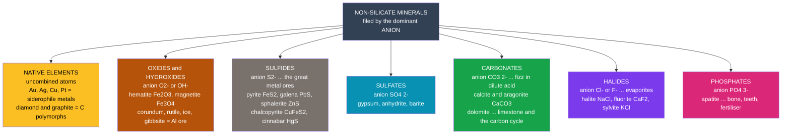

# ⛏️ Non-Silicate and Ore Minerals

> [!abstract] TL;DR
> Silicates build most of the crust, but nearly everything we **mine** comes from the **non-silicates** — minerals classified by their dominant anion. **Native elements** are pure metals and carbon ($\mathrm{Au}$, $\mathrm{Cu}$, diamond, graphite). **Oxides** and **hydroxides** ($\mathrm{Fe_2O_3}$, $\mathrm{Fe_3O_4}$, gibbsite) are the ores of iron, aluminium, and titanium. **Sulfides** ($\mathrm{FeS_2}$, $\mathrm{PbS}$, $\mathrm{ZnS}$, $\mathrm{CuFeS_2}$) are the great base-metal ores — and, when weathered, the source of acid mine drainage. **Carbonates** ($\mathrm{CaCO_3}$, dolomite) are rock-forming, fizz in acid, and store most of Earth's surface carbon. **Sulfates**, **halides**, and **phosphates** (gypsum, halite, apatite) round out the evaporites and the phosphorus cycle. **Ore grade** — the weight-percent of target metal — is what turns a mineral into a mine.

## Intuition — analogy FIRST

Think of the non-silicate minerals as a **library sorted by the last name of one key character** — the **anion**. A silicate is filed under $\mathrm{SiO_4}$; but pull that book off the shelf and the rest of the collection opens up: everything filed under **oxygen alone** (oxides), under **sulfur** (sulfides), under **carbonate**, **sulfate**, **halide**, **phosphate**, and the loners filed under **nothing at all** — the native elements, pure gold and carbon that never bothered to bond with anything.

Now here is the payoff. That filing system is also a **treasure map**. Iron hides in the oxide aisle, copper and lead in the sulfide aisle, aluminium in the hydroxide aisle, table salt and fertiliser in the halide and phosphate aisles. A geologist who knows the anion knows where the metal is — and a chemist who knows the anion can predict, from a formula alone, **exactly what fraction of the rock is the metal you actually want.**

---

## How It Works



---

### Secondary Level

Minerals are named by their **anion class** — the negatively charged part that defines the family. Every class has a "signature" test that identifies it in the field.

| Class | Defining anion | Key minerals | Signature / use |
|-------|----------------|--------------|-----------------|
| **Native elements** | none (pure element) | gold $\mathrm{Au}$, silver, copper, platinum; **diamond**, **graphite** ($\mathrm{C}$) | metallic; diamond = hardest, graphite = soft, greasy |
| **Oxides / hydroxides** | $\mathrm{O^{2-}}$, $\mathrm{OH^-}$ | hematite $\mathrm{Fe_2O_3}$, magnetite $\mathrm{Fe_3O_4}$, corundum $\mathrm{Al_2O_3}$, rutile $\mathrm{TiO_2}$, ice $\mathrm{H_2O}$ | **ores of Fe, Al, Ti**; magnetite is magnetic |
| **Sulfides** | $\mathrm{S^{2-}}$ | pyrite $\mathrm{FeS_2}$, galena $\mathrm{PbS}$, sphalerite $\mathrm{ZnS}$, chalcopyrite $\mathrm{CuFeS_2}$, cinnabar $\mathrm{HgS}$ | **base-metal ores**; metallic lustre, heavy, opaque |
| **Sulfates** | $\mathrm{SO_4^{2-}}$ | gypsum $\mathrm{CaSO_4\cdot 2H_2O}$, anhydrite $\mathrm{CaSO_4}$, barite $\mathrm{BaSO_4}$ | soft, light-coloured; drywall, drilling mud |
| **Carbonates** | $\mathrm{CO_3^{2-}}$ | calcite / aragonite $\mathrm{CaCO_3}$, dolomite $\mathrm{CaMg(CO_3)_2}$ | **fizz in dilute HCl**; limestone, marble |
| **Halides** | $\mathrm{Cl^-}$, $\mathrm{F^-}$ | halite $\mathrm{NaCl}$, fluorite $\mathrm{CaF_2}$, sylvite $\mathrm{KCl}$ | **evaporites**; salty taste (halite) |
| **Phosphates** | $\mathrm{PO_4^{3-}}$ | apatite $\mathrm{Ca_5(PO_4)_3(F,Cl,OH)}$ | **bone and teeth**; fertiliser rock |

**"Fool's gold."** Pyrite $\mathrm{FeS_2}$ tricks beginners: brassy and shiny, but it forms hard **cubic** crystals, is brittle, and streaks black-green — real gold is soft, dense, and streaks gold.

**The acid test.** A drop of dilute hydrochloric acid on calcite fizzes vigorously ($\mathrm{CaCO_3}$ releasing $\mathrm{CO_2}$). Dolomite barely reacts unless powdered — a fast way to tell the two carbonates apart.

### Undergraduate Level

**Ore minerals and ore grade.** An *ore* is a mineral (or rock) from which a metal can be extracted **at a profit**. The **grade** is the concentration of the valuable component. The *theoretical* (maximum) grade of a pure ore mineral is fixed by its formula:

$$\text{grade}(\%) = 100 \times \frac{n_M \, A_M}{\sum_i n_i A_i}$$

where $A_M$ is the atomic mass of the target metal and $n_M$ its count in the formula unit. Example — chalcopyrite $\mathrm{CuFeS_2}$:

$$\text{Cu}\% = 100 \times \frac{63.55}{63.55 + 55.85 + 2(32.06)} = 34.6\%$$

Real *deposit* grades are far lower because the ore mineral is diluted by worthless **gangue**. Enrichment is measured against the crustal (Clarke) abundance:

| Metal | Clarke (crustal) | Typical ore grade | Enrichment factor |
|-------|------------------|-------------------|-------------------|
| Al | ~8 % | 30–50 % (bauxite) | ~5× |
| Fe | ~5 % | 30–65 % | ~10× |
| Cu | ~60 ppm | 0.4–1 % | ~100× |
| Au | ~4 ppb | 1–5 ppm | ~1000× |

Aluminium is abundant, so **bauxite** (a mix of gibbsite $\mathrm{Al(OH)_3}$, boehmite, diaspore) needs only mild enrichment; copper and gold need enormous concentration, which is why their deposits are rare and geologically special.

**How metals concentrate into deposits** (see [[Economic_Geology_and_Resources]]):

| Process | Mechanism | Typical ores |
|---------|-----------|--------------|
| **Magmatic** | dense sulfide/oxide crystals settle in a magma chamber | chromite, Ni–Cu sulfides, Pt |
| **Hydrothermal** | hot fluids leach metals, deposit sulfides in veins | Cu, Pb, Zn, Au (porphyry, VMS, SEDEX) |
| **Sedimentary / placer** | chemical precipitation or gravity sorting of dense grains | banded iron formation; placer Au, cassiterite |
| **Supergene** | weathering dissolves and re-precipitates metal below the water table | secondary Cu enrichment (chalcocite) |

**Sulfides, redox, and acid mine drainage.** Sulfide minerals form in **reducing** environments; expose them to air and water and they **oxidise**. Pyrite is the culprit:

$$\mathrm{FeS_2 + \tfrac{7}{2}O_2 + H_2O \;\rightarrow\; Fe^{2+} + 2\,SO_4^{2-} + 2\,H^+}$$

The dissolved $\mathrm{Fe^{2+}}$ oxidises further to $\mathrm{Fe^{3+}}$, which hydrolyses to release **still more acid** and can itself attack pyrite — a self-sustaining cycle producing sulfuric acid and mobilising toxic metals (see [[Inorganic_Acids_Bases_and_Redox]]). This is **acid mine drainage**, one of mining's worst environmental legacies.

**Carbonates and the carbon cycle.** Limestone ($\mathrm{CaCO_3}$) is Earth's largest surface carbon reservoir. Its dissolution and precipitation buffer ocean chemistry:

$$\mathrm{CaCO_3 + CO_2 + H_2O \;\rightleftharpoons\; Ca^{2+} + 2\,HCO_3^-}$$

Rightward is chemical weathering (a long-term $\mathrm{CO_2}$ sink); leftward builds reefs and limestone.

### Graduate Level

**Crystal chemistry of sulfides — beyond simple ionic bonding.** Sulfides are not well described as $\mathrm{M^{2+}S^{2-}}$ ionic solids. The large, polarisable $\mathrm{S}$ atom and the metal $d$-electrons produce bonding that ranges from **covalent** to **metallic**, which is why sulfides are dense, opaque, metallic-lustred, and often electrical semiconductors or conductors.

- **Galena** $\mathrm{PbS}$ takes the **rock-salt** ($\mathrm{NaCl}$) structure — octahedral $\mathrm{Pb}$–$\mathrm{S}$ — but with substantial covalent/metallic character (it is a classic semiconductor; early "cat's whisker" radio detectors used galena crystals).
- **Pyrite** $\mathrm{FeS_2}$ is *not* iron with two sulfide ions; it contains **disulfide dumbbells** $\mathrm{S_2^{2-}}$ (a persulfide anion), so iron is formally $\mathrm{Fe^{2+}}$, low-spin, in an $\mathrm{NaCl}$-derivative lattice. This is why pyrite is hard ($\sim 6.5$) and brittle, unlike soft galena.
- **Sphalerite** $\mathrm{ZnS}$ defines the **zinc-blende** structure — tetrahedral, highly covalent, four-coordinate.

**Goldschmidt geochemistry** explains *which* metals go where. Elements partition by affinity: **lithophile** ($\mathrm{Al, Ca, Si}$) bond to oxygen (silicates, oxides); **chalcophile** ($\mathrm{Cu, Zn, Pb, Hg, Ag}$) bond to sulfur (sulfides); **siderophile** ($\mathrm{Fe, Ni, Au, Pt}$) bond to metal (native metals, alloys). This is essentially the **hard–soft acid–base** principle: *soft* cations ($\mathrm{Cu^+, Ag^+, Hg^{2+}, Pb^{2+}}$) prefer the *soft* base $\mathrm{S^{2-}}$; *hard* cations ($\mathrm{Ca^{2+}, Al^{3+}}$) prefer the *hard* bases $\mathrm{O^{2-}, F^-}$ (see [[Periodic_Trends_and_Main_Group_Chemistry]], [[Chemical_Bonding_and_Molecular_Geometry]]).

**Carbonate polymorph stability — calcite vs aragonite.** Both are $\mathrm{CaCO_3}$, but they differ in $\mathrm{Ca}$ coordination and density:

| Polymorph | System | Ca coordination | Density (g/cm³) | Stability |
|-----------|--------|------------------|-----------------|-----------|
| **Calcite** | trigonal (rhombohedral) | **6-fold** (octahedral) | 2.71 | stable at surface P–T |
| **Aragonite** | orthorhombic | **9-fold** | 2.93 | high-P; metastable at surface |

Aragonite is **denser**, so higher pressure favours it (positive $\Delta V$ drives the Clapeyron slope; the transition lies near $\sim 0.3$–$0.4$ GPa at room $T$). At surface conditions aragonite is **metastable** and slowly inverts to calcite — yet corals, pteropods, and mollusc nacre precipitate aragonite biologically, and elevated $\mathrm{Sr^{2+}}$/$\mathrm{Ba^{2+}}$ (large cations) stabilise its 9-fold site, while $\mathrm{Mg^{2+}}$ (small) favours calcite. This crystal-chemical competition governs reef mineralogy and its vulnerability to ocean acidification. See [[Mineral_Stability_and_Phase_Diagrams]].

```python
# Theoretical metal grade of an ore mineral = mass fraction of the target
# metal in the PURE mineral, computed straight from atomic masses.
# Real deposit grades are lower (the mineral is diluted by worthless gangue).

atomic_mass = {  # standard atomic weights, g/mol (IUPAC 2021)
    "H": 1.008, "C": 12.011, "O": 15.999, "F": 18.998, "Na": 22.990,
    "Mg": 24.305, "Al": 26.982, "S": 32.06, "Cl": 35.45, "Ca": 40.078,
    "Ti": 47.867, "Fe": 55.845, "Cu": 63.546, "Zn": 65.38,
    "Hg": 200.59, "Pb": 207.2,
}

# mineral -> (element counts in one formula unit, target metal)
ores = {
    "Magnetite  Fe3O4":    ({"Fe": 3, "O": 4}, "Fe"),
    "Hematite   Fe2O3":    ({"Fe": 2, "O": 3}, "Fe"),
    "Galena     PbS":      ({"Pb": 1, "S": 1}, "Pb"),
    "Cinnabar   HgS":      ({"Hg": 1, "S": 1}, "Hg"),
    "Sphalerite ZnS":      ({"Zn": 1, "S": 1}, "Zn"),
    "Rutile     TiO2":     ({"Ti": 1, "O": 2}, "Ti"),
    "Chalcopyrite CuFeS2": ({"Cu": 1, "Fe": 1, "S": 2}, "Cu"),
    "Gibbsite   Al(OH)3":  ({"Al": 1, "O": 3, "H": 3}, "Al"),
    "Pyrite     FeS2":     ({"Fe": 1, "S": 2}, "Fe"),
}

def grade(formula, metal):
    molar_mass = sum(atomic_mass[el] * n for el, n in formula.items())
    return 100.0 * atomic_mass[metal] * formula[metal] / molar_mass

rows = [(name, metal, grade(f, metal)) for name, (f, metal) in ores.items()]
rows.sort(key=lambda r: r[2], reverse=True)  # rank by grade

print(f"{'mineral':22s} {'metal':5s} {'grade wt%':>9s}")
for name, metal, g in rows:
    print(f"{name:22s} {metal:5s} {g:9.2f}")

# Expected (theoretical maxima):
#   Galena    Pb 86.60   Cinnabar Hg 86.22   Magnetite Fe 72.36
#   Hematite  Fe 69.94   Sphalerite Zn 67.11  Rutile Ti 59.94
#   Pyrite    Fe 46.55   Chalcopyrite Cu 34.63   Gibbsite Al 34.59
```

Running this ranks the ores by richness: **galena and cinnabar** top 86% because their heavy metals sit against a single light $\mathrm{S}$; **magnetite** beats hematite (more Fe per O); and **chalcopyrite** carries only ~35% Cu — which is why copper is smelted, not simply melted, out of its ore.

---

## Real-World Notes

- **Iron and steel** come almost entirely from **hematite** and **magnetite** in ancient **banded iron formations** (BIFs, ~2.5 Ga), themselves a fingerprint of the **Great Oxidation Event** — the ocean rusted as photosynthesis released $\mathrm{O_2}$.
- **Bauxite** ($\mathrm{Al(OH)_3}$-rich) forms as a tropical **laterite** where intense weathering strips away silica and leaves aluminium hydroxides — the sole commercial aluminium ore, refined via the Bayer and Hall–Héroult processes.
- **Sphalerite and galena** are the world's dominant zinc and lead ores; sphalerite also hosts most of our **cadmium, indium, and gallium** as trace substitutions — the "minor metals" behind semiconductors and solar cells.
- **Gypsum** ($\mathrm{CaSO_4\cdot 2H_2O}$) is drywall and plaster of Paris; heated, it loses water to hemihydrate and re-sets when rewetted — the chemistry of every plaster cast.
- **Apatite** rock is the feedstock for **phosphate fertiliser** — the phosphorus in it is geologically finite and strategically critical, and it is chemically the same mineral as your **bones and tooth enamel**.
- **Halite and sylvite** are **evaporites**: entire salt basins (Zechstein, Michigan, the Mediterranean's Messinian salt) record ancient seas that dried up, now mined for road salt and **potash** fertiliser.
- **Diamond vs graphite**: identical carbon, opposite worlds — diamond ($\mathrm{sp^3}$, 3-D, hardest natural material) forms only in the deep mantle; graphite ($\mathrm{sp^2}$ sheets) is a soft lubricant and the "lead" in pencils. Same element, different bonding.

---

## Common Pitfalls

1. **Confusing pyrite with gold.** Pyrite ($\mathrm{FeS_2}$) is brittle, hard, cubic, and streaks black; **gold** is soft, malleable, dense (SG 19.3), and streaks gold. Never judge by colour alone.
2. **Assuming grade equals recoverable metal.** The formula gives the *theoretical* grade of the pure mineral; a real deposit is mostly gangue, and metallurgy never recovers 100%. A 0.5% Cu ore is economic; the mineral in it is still 35% Cu.
3. **Forgetting the dolomite acid test caveat.** Calcite fizzes instantly in cold dilute HCl; **dolomite** reacts only when powdered or in warm acid. Using this backwards misidentifies limestone as dolostone.
4. **Treating aragonite as a distinct compound.** Aragonite and calcite are the **same formula** $\mathrm{CaCO_3}$ — different crystal structures (polymorphs). Aragonite is metastable at the surface and slowly inverts to calcite.
5. **Calling sulfides "ionic salts."** Sulfide bonding is largely **covalent/metallic**, which is why they are opaque, metallic-lustred, dense, and electrically conductive — unlike the transparent, insulating ionic halides.
6. **Ignoring the redox setting of sulfides.** Sulfides are stable only under **reducing** conditions. Expose them to air/water and they oxidise, generating **acid mine drainage** — a chemistry problem, not just a mining one ([[Inorganic_Acids_Bases_and_Redox]]).

---

## Related Concepts

- [[_MOC_Minerals_Crystallography|↑ Section MOC]]
- [[What_Is_a_Mineral]] — the defining criteria (natural, inorganic, ordered structure, definite composition) that all these classes satisfy.
- [[Crystal_Systems_and_Symmetry]] — the seven systems that pyrite (cubic), calcite (trigonal), and aragonite (orthorhombic) illustrate.
- [[Silicate_Minerals]] — the complementary, rock-forming majority of the crust; non-silicates are the economically dense minority.
- [[Mineral_Properties_and_Identification]] — lustre, hardness, streak, cleavage, and the acid test used to separate these classes in hand sample.
- [[Mineral_Stability_and_Phase_Diagrams]] — the thermodynamics behind calcite–aragonite and sulfide oxidation.
- [[Economic_Geology_and_Resources]] — how magmatic, hydrothermal, sedimentary, and supergene processes concentrate ore minerals into deposits.
- [[Sedimentary_Rocks_and_Environments]] — limestone, evaporites, and BIFs are the sedimentary homes of carbonates, halides, and iron oxides.
- **Chemistry** — [[Periodic_Trends_and_Main_Group_Chemistry]] (chalcophile vs lithophile behaviour), [[Inorganic_Acids_Bases_and_Redox]] (sulfide oxidation and acid mine drainage), and [[Chemical_Bonding_and_Molecular_Geometry]] (ionic vs covalent vs metallic bonding across the classes).
- **Mathematics** — [[_MOC_Mathematics_Master]] (stoichiometric mass balance behind ore-grade calculation).

---

## Review Questions

1. **Secondary**: Name the seven non-silicate classes by their defining anion, and give one economically important mineral from each. Which simple field test distinguishes carbonates from every other class?
2. **Undergraduate**: Using atomic masses, show that magnetite $\mathrm{Fe_3O_4}$ has a higher theoretical iron grade than hematite $\mathrm{Fe_2O_3}$. Then explain why copper deposits are economic at ~0.5% grade while iron deposits require ~30%+, referring to crustal abundance and enrichment factors.
3. **Graduate**: Contrast the crystal chemistry of galena, pyrite, and sphalerite (structure type, coordination, and bonding character). Separately, explain why aragonite is the high-pressure $\mathrm{CaCO_3}$ polymorph yet is precipitated biologically at the surface, and what large-cation substitutions stabilise each polymorph.

---

## Sources

- Klein, C. & Dutrow, B. — *Manual of Mineral Science* (23rd ed.), Wiley — non-silicate classification and crystal chemistry.
- Nesse, W. D. — *Introduction to Mineralogy* (2nd ed.), Oxford — mineral classes, ore minerals, and properties.
- Vaughan, D. J. & Craig, J. R. — *Mineral Chemistry of Metal Sulfides*, Cambridge — sulfide bonding and structures.
- Robb, L. — *Introduction to Ore-Forming Processes*, Blackwell — magmatic, hydrothermal, sedimentary, and supergene deposits.
- Railsback, L. B. — "An Earth Scientist's Periodic Table of the Elements and Their Ions" (Goldschmidt / HSAB affinities).

#earth-science #mineralogy #non-silicates #ore-minerals #sulfides #carbonates #oxides #ore-grade #secondary #undergraduate #graduate
