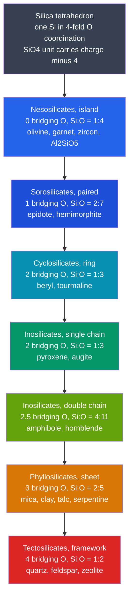

# 🔺 Silicate Minerals

> [!abstract] TL;DR
> Silicates are the dominant mineral group, making up **over 90 percent of Earth's crust**. Every one is built from a single unit: the **silica tetrahedron** $[\mathrm{SiO_4}]^{4-}$ — one small $\mathrm{Si^{4+}}$ nested in 4-fold coordination among four $\mathrm{O^{2-}}$. The one organizing principle that generates the whole family is **polymerization**: how many corner (bridging) oxygens neighboring tetrahedra share. Sharing none, then one, then chains, sheets, and finally a full 3-D framework produces the structural classes — nesosilicates, sorosilicates, cyclosilicates, inosilicates, phyllosilicates, tectosilicates — with steadily **rising Si:O ratio** (1:4 → 1:2) and **falling residual charge** for cations to balance. That single geometric knob controls **cleavage** (bonds break where the tetrahedra are weakly linked), **crystallization temperature** (Bowen's series is increasing polymerization), and **weathering rate** (Goldich series is its reverse).

## Intuition — analogy FIRST

Think of the tetrahedron as a **single Lego brick with four studs at its corners**. Hand a child one kind of brick and the *only* creative choice left is **how to connect them**: leave them loose in a bag, snap them in pairs, click them into long chains, weave them into flat mats, or lock them into a solid 3-D wall. The *same brick* becomes a keychain trinket, a bracelet, a sheet, or a cinder block — and each result has utterly different strength, and breaks along utterly different planes.

Minerals do exactly this. Nature has essentially **one brick** — $\mathrm{SiO_4}$ — and the entire diversity of quartz, mica, garnet, feldspar, olivine, and asbestos comes down to *how many corners get shared*. Learn that one rule and the whole silicate zoo becomes a single continuous idea.

---

## How It Works

Each oxygen at a tetrahedron's corner can either dangle free (a **non-bridging** oxygen, its charge balanced by a metal cation) or bond to a **second** silicon (a **bridging** oxygen shared between two tetrahedra). A bridging oxygen is counted **half** to each tetrahedron. As sharing increases from 0 to 4 corners, oxygen is progressively "used up" in $\mathrm{Si\!-\!O\!-\!Si}$ bridges, so **oxygen per silicon falls from 4 to 2** and the leftover negative charge shrinks toward zero.



---

### Secondary Level

**The building block.** Silicon is small and highly charged, so four oxygens pack around it in a **tetrahedron**. On its own, $\mathrm{Si^{4+}} + 4\,\mathrm{O^{2-}}$ gives a net charge of $+4 - 8 = -4$, written $[\mathrm{SiO_4}]^{4-}$. That leftover charge is neutralized by metal cations ($\mathrm{Mg^{2+}}, \mathrm{Fe^{2+}}, \mathrm{Ca^{2+}}, \mathrm{K^+}, \mathrm{Na^+}, \mathrm{Al^{3+}}$) sitting between tetrahedra.

**The one rule:** the more corners a tetrahedron shares, the more polymerized the mineral, the higher its Si:O ratio, and the smaller the charge left for cations.

| Class | Bridging O | Anion unit | Si:O | Example |
|-------|-----------|------------|------|---------|
| Nesosilicate (island) | 0 | $[\mathrm{SiO_4}]^{4-}$ | 1:4 | olivine, garnet, zircon |
| Sorosilicate (paired) | 1 | $[\mathrm{Si_2O_7}]^{6-}$ | 2:7 | epidote |
| Cyclosilicate (ring) | 2 | $[\mathrm{Si_6O_{18}}]^{12-}$ | 1:3 | beryl, tourmaline |
| Inosilicate (single chain) | 2 | $[\mathrm{SiO_3}]^{2-}$ | 1:3 | pyroxene (augite) |
| Inosilicate (double chain) | 2.5 | $[\mathrm{Si_4O_{11}}]^{6-}$ | 4:11 | amphibole (hornblende) |
| Phyllosilicate (sheet) | 3 | $[\mathrm{Si_2O_5}]^{2-}$ | 2:5 | mica, clay, talc |
| Tectosilicate (framework) | 4 | $\mathrm{SiO_2}$ | 1:2 | quartz, feldspar |

### Undergraduate Level

**Structure dictates cleavage.** Silicate cleavage almost never breaks $\mathrm{Si\!-\!O}$ bonds — it splits the **weaker cation or interlayer bonds** *between* the tetrahedral units. The geometry of those weak links sets the number and angle of cleavage planes, giving a hand-sample fingerprint:

| Class | Where the weak bonds are | Cleavage | Diagnostic mineral |
|-------|--------------------------|----------|--------------------|
| Nesosilicate | isotropic, cations everywhere | poor / none, conchoidal fracture | olivine |
| Single-chain inosilicate | between chains | **2 planes at ~87° / 93° (near 90°)** | pyroxene / augite |
| Double-chain inosilicate | between wider double chains | **2 planes at ~56° / 124° (60° / 120°)** | amphibole / hornblende |
| Phyllosilicate | weak interlayer bonds | **1 perfect basal cleavage** | mica (peels in sheets) |
| Tectosilicate | uniform 3-D framework | none in quartz (conchoidal); 2 at ~90° in feldspar | quartz, feldspar |

The **pyroxene-versus-amphibole cleavage angle** ($90°$ vs $60°/120°$) is the classic way to tell two dark chain silicates apart in the field.

**Feldspars: coupled substitution and solid solution.** In framework silicates, $\mathrm{Al^{3+}}$ commonly substitutes for $\mathrm{Si^{4+}}$ in tetrahedral sites. Each swap leaves a $-1$ charge deficit, balanced by stuffing a cation into a framework cavity. This makes the two great **solid-solution** series:

- **Alkali feldspar:** $\mathrm{KAlSi_3O_8}$ (orthoclase / microcline) $\leftrightarrow$ $\mathrm{NaAlSi_3O_8}$ (albite) — simple $\mathrm{K^+} \leftrightarrow \mathrm{Na^+}$ exchange.
- **Plagioclase feldspar:** $\mathrm{NaAlSi_3O_8}$ (albite) $\leftrightarrow$ $\mathrm{CaAl_2Si_2O_8}$ (anorthite) via **coupled substitution** $\;\mathrm{Na^+ + Si^{4+} \rightleftharpoons Ca^{2+} + Al^{3+}}\;$ (both sides sum to charge $+5$).

**Polymerization tracks crystallization order.** The **discontinuous branch of Bowen's series** — olivine → pyroxene → amphibole → biotite — is *literally* a ladder of increasing polymerization (island → single chain → double chain → sheet). Early, high-temperature minerals are the least polymerized; the last melt to crystallize is silica-rich quartz, the fully polymerized framework. See [[Magma_Generation_and_Bowens_Series]].

### Graduate Level

**Melt structure and the NBO/T parameter.** In a silicate *melt*, the same polymerization idea is quantified by **non-bridging oxygens per tetrahedron**, $\mathrm{NBO/T}$:

$$\frac{\mathrm{NBO}}{\mathrm{T}} = \frac{2\,O_{\text{total}} - 4\,T}{T}$$

where $T$ counts tetrahedral cations ($\mathrm{Si + Al}$). A fully polymerized (tectosilicate-composition) melt has $\mathrm{NBO/T} = 0$; an olivine-composition melt approaches $\mathrm{NBO/T} = 4$. Higher polymerization means **higher viscosity**, so felsic (silica-rich) magmas are stiff and erupt explosively while mafic magmas flow freely — connecting mineral structure directly to volcanic hazard.

**Crystal-chemical site control.** Which cation enters which site follows **Pauling's rules** and the radius-ratio principle: coordination number rises with the cation-to-anion radius ratio. $\mathrm{Al^{3+}}$ sits near the tetrahedral/octahedral boundary, which is exactly why it plays a **dual role** — tetrahedral (replacing $\mathrm{Si}$) *and* octahedral (a cation site). In olivine, similar-radius $\mathrm{Mg^{2+}}$ and $\mathrm{Fe^{2+}}$ share the octahedral M1/M2 sites, giving a **complete forsterite–fayalite solid solution**. Charge balance across coupled swaps is maintained by the **Tschermak substitution** $\;\mathrm{(Mg,Fe)^{2+} + Si^{4+} \rightleftharpoons 2\,Al^{3+}}\;$ in pyroxenes and amphiboles.

**Why sheet silicates rule the surface.** Weathering of feldspars and micas produces **clay minerals** (phyllosilicates), built from **1:1** (tetrahedral–octahedral, e.g. kaolinite) or **2:1** (T–O–T, e.g. smectite, illite) sheets. Weak interlayer bonding, interlayer cations, and adsorbed water give clays their **cation-exchange capacity, swelling, and plasticity** — the properties that make them dominate soils and mudrocks (roughly two-thirds of the sedimentary record). The **Goldich dissolution series** is Bowen's series run backward: the least-polymerized, highest-$T$ minerals (olivine) have the most exposed cation–oxygen bonds and weather fastest, while fully bonded quartz survives — which is why beach and desert sand is overwhelmingly quartz. See [[Weathering_and_Soils]].

```python
from fractions import Fraction
from math import gcd

# Formal charges: Si = +4, O = -2.
# "bridging" = corner oxygens shared per tetrahedron (each shared between 2
# tetrahedra, so it counts 1/2 to each). O per Si = 4 - bridging/2.
# (class, bridging O/tetrahedron, n_Si in unit, anion unit, example mineral)
classes = [
    ("Nesosilicate  (island)",       0,             1, "[SiO4]4-",    "olivine, garnet, zircon"),
    ("Sorosilicate  (paired)",       1,             2, "[Si2O7]6-",   "epidote"),
    ("Cyclosilicate (ring)",         2,             6, "[Si6O18]12-", "beryl, tourmaline"),
    ("Inosilicate   (single chain)", 2,             1, "[SiO3]2-",    "pyroxene / augite"),
    ("Inosilicate   (double chain)", Fraction(5,2), 4, "[Si4O11]6-",  "amphibole / hornblende"),
    ("Phyllosilicate(sheet)",        3,             2, "[Si2O5]2-",   "mica, clay, talc"),
    ("Tectosilicate (framework)",    4,             1, "SiO2",        "quartz, feldspar"),
]

hdr = f"{'Structural class':30s}{'Si:O':>7s}{'chg/Si':>8s}{'unit charge':>13s}   {'anion unit':12s} example"
print(hdr)
print("-" * len(hdr))
for name, bridging, n_si, unit, example in classes:
    o_per_si      = Fraction(4) - Fraction(bridging, 2)   # oxygens left per silicon
    charge_per_si = 4 - 2 * o_per_si                       # Si(+4) plus O(-2) each
    unit_charge   = charge_per_si * n_si                    # charge of the whole formula unit
    num, den      = o_per_si.numerator, o_per_si.denominator
    g             = gcd(num, den)
    si_o          = f"{den//g}:{num//g}"                    # Si:O = 1 : (O/Si)
    print(f"{name:30s}{si_o:>7s}{str(charge_per_si):>8s}{str(unit_charge):>13s}   {unit:12s} {example}")

# Output reproduces the classic mineralogy table: as bridging O rises 0 -> 4,
# Si:O climbs 1:4 -> 1:2 and the residual charge shrinks -4 -> 0. Ring and
# single-chain share Si:O = 1:3 and charge -2 per Si despite different shapes.
```

---

## Real-World Notes

- **Feldspars are the most abundant minerals on Earth** — about **51 percent** of the crust, with quartz another **~12 percent**. Together with the other silicates they account for over 90 percent of crustal rock.
- **Beach and desert sand is mostly quartz** because the fully polymerized framework resists chemical attack — the Goldich weathering series in action ([[Weathering_and_Soils]]).
- **Asbestos is silicate structure made visible:** fibrous *amphiboles* (crocidolite, amosite) and the *serpentine* chrysotile owe their needle-like and curly-fiber habits directly to chain and sheet bonding — the same geometry that makes them a respiratory hazard.
- **Clays run the near-surface world:** phyllosilicates dominate soils, mudrocks, and drilling fluids; their cation-exchange capacity governs soil fertility and contaminant retention.
- **Zircon** ($\mathrm{ZrSiO_4}$, a nesosilicate) is nearly indestructible and incorporates uranium — the backbone of U–Pb geochronology and the source of the oldest known terrestrial material, the **~4.4-billion-year Jack Hills zircons**.
- **Magma viscosity and eruption style** are set by melt polymerization: viscous, highly polymerized felsic magmas erupt explosively; fluid mafic magmas effuse gently ([[Igneous_Rocks_and_Classification]]).

---

## Common Pitfalls

1. **Confusing pyroxene and amphibole by cleavage.** Both are dark ferromagnesian chain silicates, but pyroxene cleaves at **~90°** and amphibole at **~60°/120°**. This angle is *the* hand-sample discriminator.
2. **"More sharing means more oxygen per silicon."** The opposite is true: sharing corners *consumes* oxygen in $\mathrm{Si\!-\!O\!-\!Si}$ bridges, so quartz ($\mathrm{SiO_2}$) has the **fewest** O per Si and island olivine the most.
3. **Thinking cleavage breaks the tetrahedra.** Strong $\mathrm{Si\!-\!O}$ bonds rarely break; cleavage follows the **weak cation or interlayer bonds** *between* tetrahedral units.
4. **Treating "silica" and "silicate" as synonyms.** Silica ($\mathrm{SiO_2}$: quartz, glass) is a single tectosilicate composition; *silicates* are the entire family with varied cations and polymerization.
5. **Miscounting aluminum.** $\mathrm{Al^{3+}}$ can substitute for $\mathrm{Si^{4+}}$ in tetrahedral sites (needing a coupled cation for balance) **and** occupy octahedral cation sites — forget its dual role and feldspar/mica formulas will not balance.
6. **"Quartz has no cleavage because it is hard."** Hardness (bond strength) and cleavage (bond-strength *anisotropy*) are different. Quartz lacks cleavage because its framework is equally strong in every direction, giving **conchoidal fracture**.

---

## Related Concepts

- [[_MOC_Minerals_Crystallography|↑ Section MOC]]
- [[What_Is_a_Mineral]] — the definition (naturally occurring, inorganic, crystalline solid) that silicates exemplify.
- [[Crystal_Systems_and_Symmetry]] — the tetrahedral linkages here express themselves as external symmetry and crystal habit.
- [[Non_Silicate_and_Ore_Minerals]] — the carbonates, oxides, sulfides, and sulfates that make up the remaining ~10 percent of the crust and most ore.
- [[Mineral_Properties_and_Identification]] — cleavage, hardness, and habit that structure controls and that identify silicates in hand sample.
- [[Mineral_Stability_and_Phase_Diagrams]] — where each silicate is stable in pressure–temperature–composition space.
- [[Magma_Generation_and_Bowens_Series]] — the discontinuous branch *is* increasing polymerization on cooling.
- [[Weathering_and_Soils]] — the Goldich series (weathering) is Bowen's series reversed; clays are the phyllosilicate product.
- [[Igneous_Rocks_and_Classification]] — silica content and mineral assemblage classify igneous rocks.
- **Chemistry** — [[Chemical_Bonding_and_Molecular_Geometry]] (the covalent-ionic $\mathrm{Si\!-\!O}$ bond and tetrahedral geometry), [[Solid_State_and_Crystal_Structures]] (silicate crystallography and coordination), and [[Periodic_Trends_and_Main_Group_Chemistry]] (why Si, Al, and O behave as they do).
- **Mathematics** — [[_MOC_Mathematics_Master]] (ratios, stoichiometry, and the linear algebra of coupled substitution).

---

## Review Questions

1. **Secondary**: A dark, elongate mineral shows two cleavage planes meeting at about **120°**. Is it more likely a pyroxene or an amphibole? Name its structural class and one example mineral.
2. **Undergraduate**: Derive the Si:O ratio and the net anionic charge *per silicon* for a single-chain inosilicate, and show why they equal those of a ring cyclosilicate. Then explain the coupled substitution that turns albite into anorthite and why it keeps the framework charge-balanced.
3. **Graduate**: Using non-bridging oxygens and melt polymerization, explain why the discontinuous branch of Bowen's series (olivine → pyroxene → amphibole → biotite) tracks increasing tetrahedral connectivity, why the *same* ordering predicts relative weathering rates (Goldich series), and how coupled Al-for-Si substitution enters the argument.

---

## Sources

- Klein, C. & Dutrow, B. — *The 23rd Edition of the Manual of Mineral Science* (Wiley).
- Deer, W. A., Howie, R. A. & Zussman, J. — *An Introduction to the Rock-Forming Minerals*, 3rd ed. (Mineralogical Society).
- Nesse, W. D. — *Introduction to Mineralogy*, 2nd ed. (Oxford).
- Goldich, S. S. (1938) — "A study in rock weathering," *Journal of Geology* 46, 17–58.
- Bowen, N. L. (1928) — *The Evolution of the Igneous Rocks* (Princeton).

#earth-science #mineralogy #silicates #polymerization #silica-tetrahedron #feldspar #cleavage #secondary #undergraduate #graduate
