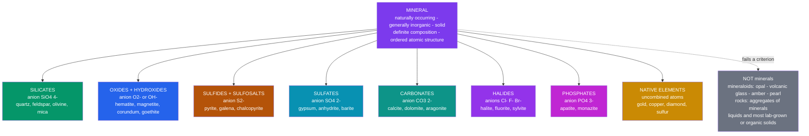

# 💎 What Is a Mineral

> [!abstract] TL;DR
> A **mineral** is a **naturally occurring, generally inorganic solid with a definite (but not necessarily fixed) chemical composition and an ordered internal atomic structure** — five criteria that together separate true minerals from **mineraloids** (opal, volcanic glass — no long-range order), **rocks** (aggregates of minerals), and synthetic or organic materials. There are roughly **6,000 approved mineral species**, yet only a **few dozen common rock-forming minerals** build almost the entire crust. Minerals are organized by their **dominant anion** into the Dana/Nickel–Strunz classes (silicates, oxides, sulfides, sulfates, carbonates, halides, phosphates, native elements). Which minerals can form is dictated by **crystal chemistry**: ionic radii set **coordination numbers** via the radius-ratio rule and **Pauling's rules**; similar ions substitute freely to give **solid solutions** (olivine Fe–Mg, plagioclase Na–Ca); and identical compositions can crystallize as different **polymorphs** (diamond/graphite, calcite/aragonite).

## Intuition — analogy FIRST

Think of a mineral as a **word spelled with atoms**. A word needs the *right letters* (a definite composition) arranged in the *right, repeating order* (an ordered crystal lattice). Scramble the same letters with no order and you get gibberish — that is **glass** (a mineraloid), not a mineral. String many words into a sentence and you get a **rock**: an aggregate built from several mineral "words."

The rules of spelling are not arbitrary. Just as letter size and shape decide which letters fit together, an ion's **size and charge** decide which atoms can pack around it and how — so the periodic table, not chance, writes the vocabulary of the mineral kingdom.

---

## How It Works



---

### Secondary Level

**The five-part definition.** To be a mineral, a substance must satisfy *all five*:

| Criterion | Meaning | Instructive edge case |
|-----------|---------|-----------------------|
| **Naturally occurring** | Formed by geological processes, not made in a lab | Synthetic ruby is chemically identical but not a mineral |
| **(Generally) inorganic** | Not built by life's carbon chemistry | Biogenic shell calcite *is* accepted; coal and amber are not |
| **Solid** | At Earth-surface conditions | **Ice is a mineral**; liquid water is not. Native mercury is a borderline liquid "mineral" |
| **Definite composition** | Expressible by a chemical formula, within limits | Olivine ranges Mg₂SiO₄–Fe₂SiO₄ but is still "definite" |
| **Ordered atomic structure** | Atoms sit on a repeating 3-D lattice (**crystalline**) | **Opal** and **volcanic glass** fail here — they are *mineraloids* |

**Three things a mineral is not:**
- A **mineraloid** — mineral-like but **amorphous** (no long-range order): opal (SiO₂·nH₂O), volcanic glass, amber, pearl.
- A **rock** — a naturally occurring **aggregate** of one or more minerals (granite = quartz + feldspar + mica). See [[The_Rock_Cycle]].
- A **synthetic** crystal — same structure and composition but lab-grown, so it fails "naturally occurring."

**Scale of the mineral kingdom.** About **6,000** species are approved by the IMA (roughly 100 new ones per year), yet **fewer than ~30** minerals — dominated by the **silicates** (~90% of the crust) plus a handful of oxides and carbonates — make up almost everything you will ever hold.

**Classification by anion.** Minerals are grouped by the **dominant anion or anionic group** (Dana; the modern IMA standard is **Nickel–Strunz**): native elements, sulfides, halides, oxides & hydroxides, carbonates, sulfates, phosphates, and silicates.

### Undergraduate Level

**Radius ratio sets coordination.** A cation surrounds itself with as many anions as can touch it without overlapping. The ratio of ionic radii $R_r = r_{cation}/r_{anion}$ selects the **coordination number** (CN) and the shape of the anion polyhedron:

| $R_r$ range | Coordination number | Geometry | Rock-forming example |
|-------------|--------------------|----------|----------------------|
| $< 0.225$ | 3 | triangular | C in CO₃²⁻, B in borates |
| $0.225 - 0.414$ | 4 | tetrahedral | **Si⁴⁺** in SiO₄ |
| $0.414 - 0.732$ | 6 | octahedral | Mg²⁺, Fe²⁺, Al³⁺ |
| $0.732 - 1.0$ | 8 | cubic | Ca²⁺, Na⁺ |
| $> 1.0$ | 12 | cuboctahedral | K⁺ in feldspar |

Geometrically, the lower bound for CN 6 is $R_r = \sqrt{2} - 1 \approx 0.414$ and for CN 8 is $R_r = \sqrt{3} - 1 \approx 0.732$.

**Pauling's rules** (1929) predict stable ionic structures:
1. **Coordination polyhedron** — a polyhedron of anions forms around each cation; the cation–anion distance equals $r_{cation}+r_{anion}$ and CN is set by $R_r$.
2. **Electrostatic valence** — each anion's charge is balanced by the bond strengths reaching it, where bond strength $s = z_{cation}/\text{CN}$. In quartz, Si⁴⁺ (CN 4) gives $s = 4/4 = 1$; each O²⁻ links **two** Si tetrahedra, so $2 \times 1 = 2$ neatly balances O²⁻.
3. **Shared polyhedral elements** — sharing **edges** and especially **faces** destabilizes a structure (it brings cations closer); corner-sharing is preferred, most strongly for small, highly charged cations.
4. Cations of **high charge and low CN** avoid sharing polyhedral elements.
5. **Parsimony** — the number of distinct kinds of sites in a crystal is small.

**Bond type.** Electronegativity difference sets ionic vs covalent character. The Si–O bond is roughly **50% ionic / 50% covalent**, so the SiO₄ tetrahedron is exceptionally strong and the true building block of the silicate world (see [[Chemical_Bonding_and_Molecular_Geometry]], [[Solid_State_and_Crystal_Structures]]).

**Isomorphism and solid solution.** Ions of similar size and charge substitute freely — **Goldschmidt's rules**: substitution is easy when radii differ by $<15\%$ and charges match.
- **Olivine**: complete Fe²⁺ ↔ Mg²⁺ substitution, forsterite Mg₂SiO₄ – fayalite Fe₂SiO₄.
- **Plagioclase**: albite NaAlSi₃O₈ – anorthite CaAl₂Si₂O₈ (a *coupled* substitution, below).

**Polymorphism** — one composition, several structures selected by pressure and temperature:

| Composition | Polymorphs | Control |
|-------------|-----------|---------|
| C | diamond / graphite | pressure (diamond = deep, high-P) |
| CaCO₃ | calcite / aragonite | P–T (aragonite = higher pressure) |
| SiO₂ | quartz, tridymite, cristobalite, coesite, stishovite | rising P and T |
| Al₂SiO₅ | kyanite / andalusite / sillimanite | classic metamorphic P–T index |

### Graduate Level

**Coupled (heterovalent) substitution.** When substituting ions differ in charge, a second, compensating substitution preserves overall neutrality. In plagioclase:

$$\text{Na}^+ + \text{Si}^{4+} \;\rightleftharpoons\; \text{Ca}^{2+} + \text{Al}^{3+}$$

The charge deficit of Ca-for-Na is exactly offset by Al-for-Si in the tetrahedral framework — one continuous solid solution built from two coupled swaps. The **Tschermak substitution** $(\text{Mg}^{2+},\text{Fe}^{2+}) + \text{Si}^{4+} \rightleftharpoons \text{Al}^{3+}_{VI} + \text{Al}^{3+}_{IV}$ plays the same role in pyroxenes and amphiboles.

**Order–disorder.** Al and Si can be ordered or randomly distributed over tetrahedral sites. In K-feldspar, high-temperature **sanidine** is Al/Si-disordered while low-temperature **microcline** is fully ordered — a temperature-dependent transition that carries configurational entropy and serves as a geothermometer.

**Thermodynamics of solid solution.** Mixing two end-members changes the Gibbs energy by

$$\Delta G_{mix} = \Delta H_{mix} - T\,\Delta S_{mix}, \qquad \Delta S_{mix} = -R\sum_i x_i \ln x_i$$

An **ideal** solution has $\Delta H_{mix}=0$, so entropy always favors mixing. A **regular (symmetric) solution** adds an interaction term with parameter $W$:

$$\Delta G_{mix} = RT\big(x_A\ln x_A + x_B\ln x_B\big) + W\,x_A x_B$$

When $W>0$ (unlike ions dislike each other), cooling drives **unmixing**: below the critical **solvus** temperature

$$T_c = \frac{W}{2R}$$

the single solid solution exsolves into two phases — the origin of **perthite** lamellae in alkali feldspar and exsolution lamellae in pyroxene. This same free-energy competition, entropy vs. an enthalpy of mixing, controls whether olivine mixes completely (near-ideal) while alkali feldspar develops a miscibility gap (large $W$). See [[Mineral_Stability_and_Phase_Diagrams]].

```python
# Radius-ratio rule: predict a cation's coordination number (CN) from the
# cation/anion radius ratio, then compare with the CN observed in common
# rock-forming minerals. Anion = O2- (effective ionic radius 1.40 angstrom).

r_anion = 1.40  # O2- effective ionic radius, in angstroms

# cation: (effective ionic radius A, observed CN in minerals, example)
cations = {
    "Si4+": (0.26, "4",    "quartz - every silicate tetrahedron"),
    "Al3+": (0.51, "4-6",  "feldspar (tet) AND mica (oct) - straddles boundary"),
    "Fe3+": (0.645, "6",   "hematite, magnetite"),
    "Mg2+": (0.72, "6",    "olivine, pyroxene M-sites"),
    "Fe2+": (0.78, "6",    "olivine, pyroxene M-sites"),
    "Ca2+": (1.00, "6-8",  "plagioclase, calcite, pyroxene M2"),
    "Na+":  (1.02, "6-8",  "albite, halite"),
    "K+":   (1.51, "8-12", "K-feldspar, mica interlayer"),
}

def predict_cn(ratio):
    if ratio < 0.225:   return 3    # triangular
    elif ratio < 0.414: return 4    # tetrahedral
    elif ratio < 0.732: return 6    # octahedral
    elif ratio <= 1.0:  return 8    # cubic
    else:               return 12   # cuboctahedral

print(f"{'Cation':6} {'r/R':>6} {'Predicted':>9} {'Observed':>9}   Example")
print("-" * 74)
for ion, (r, observed, example) in cations.items():
    ratio = r / r_anion
    flag = "" if str(predict_cn(ratio)) in observed else "  <- edge case"
    print(f"{ion:6} {ratio:6.3f} {predict_cn(ratio):>9} {observed:>9}   {example}{flag}")
```

Running it reproduces the two famous teaching cases: **Si⁴⁺** ($R_r\approx0.19$) formally predicts 3-fold yet is *always* 4-fold — its half-covalent bonding forces tetrahedra — and **Al³⁺** sits right on the 4/6 boundary, which is exactly why aluminium occupies *both* tetrahedral (framework) and octahedral (sheet) sites. Everything from Mg²⁺ to K⁺ lands where predicted.

---

## Real-World Notes

- **Ice is a mineral; water is not.** Snow and glacial ice are legitimate minerals (crystalline H₂O), making glaciology a branch of applied mineralogy — the "solid" criterion does real work.
- **Biogenic minerals blur "inorganic."** The calcite of a seashell and the apatite of your bones are IMA-accepted minerals, but **pearl** (aragonite in an organic matrix) and **amber** are classed as mineraloids — the definition has softened as biomineralization was understood.
- **Opal, the archetype mineraloid.** Its ordered arrays of silica *spheres* diffract light (play-of-color), yet it has no long-range atomic lattice, so it fails the crystallinity test despite looking crystalline.
- **Synthetic gems.** Lab-grown diamond and ruby are physically indistinguishable from natural ones but are excluded by "naturally occurring" — a definition boundary with billion-dollar commercial stakes.
- **Radius ratio guides ore geology.** Because Fe²⁺ ≈ Mg²⁺ in size, "incompatible" large-ion or wrong-charge elements (K, U, Th, rare earths) are excluded from early olivine/pyroxene and concentrate in late melts — the basis of many economic deposits ([[Non_Silicate_and_Ore_Minerals]]).
- **Deep-Earth polymorphs.** The same Mg₂SiO₄ that is olivine at the surface transforms to denser polymorphs (wadsleyite, ringwoodite, bridgmanite) with depth — polymorphism literally builds the mantle's layered structure.

---

## Common Pitfalls

1. **Confusing "definite" with "fixed" composition.** A definite composition can still *vary continuously* within a solid-solution series (olivine's Fe:Mg is definite yet variable); "definite" means expressible by a formula, not invariant.
2. **Calling glass or opal a mineral.** Amorphous solids lack the required long-range atomic order. They are **mineraloids**, no matter how mineral-like they appear.
3. **Confusing a mineral with a rock.** A single crystal species is a mineral; an **aggregate** of grains is a rock. Marble is a rock; the calcite grains inside it are the mineral.
4. **Assuming radius ratio always predicts the observed CN.** It is a first approximation for *ionic* bonding. Covalency (Si⁴⁺) and boundary cases (Al³⁺) break it; use it as a guide, not a law.
5. **Ignoring charge balance in substitution.** Swapping ions of unequal charge (Ca²⁺ for Na⁺) requires a **coupled** substitution elsewhere (Al³⁺ for Si⁴⁺). Forgetting this yields impossible, unbalanced formulas.
6. **Treating polymorphs as different compounds.** Diamond and graphite are *the same element*; only atomic arrangement (and thus stability field) differs — the distinction is structural, not compositional.

---

## Related Concepts

- [[_MOC_Minerals_Crystallography|↑ Section MOC]]
- [[Crystal_Systems_and_Symmetry]] — the "ordered internal structure" criterion formalized: lattices, symmetry, and the seven crystal systems.
- [[Silicate_Minerals]] — the dominant class; how SiO₄ tetrahedra polymerize into chains, sheets, and frameworks.
- [[Non_Silicate_and_Ore_Minerals]] — the oxides, sulfides, carbonates, sulfates, halides, and native elements of the classification tree.
- [[Mineral_Properties_and_Identification]] — how structure and bonding express as hardness, cleavage, luster, and color.
- [[Mineral_Stability_and_Phase_Diagrams]] — the thermodynamics of solid solution, exsolution, and polymorph stability fields.
- [[The_Rock_Cycle]] — minerals are the building blocks; rocks are their aggregates.
- **Chemistry** — [[Solid_State_and_Crystal_Structures]] (crystal lattices *are* mineral structures), [[Chemical_Bonding_and_Molecular_Geometry]] (bond type behind coordination), [[Periodic_Trends_and_Main_Group_Chemistry]] (ionic radii and charge that drive substitution).
- **Mathematics** — [[_MOC_Mathematics_Master]] (the geometry and thermodynamic functions behind radius ratios and mixing entropy).

---

## Review Questions

1. **Secondary**: State the five parts of the definition of a mineral. Using them, explain why (a) ice qualifies as a mineral but liquid water does not, and (b) opal and obsidian do not qualify.
2. **Undergraduate**: Mg²⁺ (r ≈ 0.72 Å) and Ca²⁺ (r ≈ 1.00 Å) both bond to O²⁻ (r ≈ 1.40 Å). Compute each radius ratio, predict the coordination number, and explain why Mg readily substitutes into olivine's octahedral site while Ca does not.
3. **Graduate**: Alkali feldspar (K–Na) develops an exsolution solvus on cooling while olivine (Fe–Mg) stays a complete solid solution. Using the regular-solution free energy $\Delta G_{mix} = RT(x_A\ln x_A + x_B\ln x_B) + W x_A x_B$, explain the role of the interaction parameter $W$ and estimate the critical temperature $T_c$ at which unmixing begins.

---

## Sources

- Klein, C. & Dutrow, B. — *Manual of Mineral Science*, 23rd ed. (Wiley).
- Nesse, W. D. — *Introduction to Mineralogy*, 2nd ed. (Oxford University Press).
- Pauling, L. (1929) — "The principles determining the structure of complex ionic crystals," *J. Am. Chem. Soc.* 51, 1010.
- Putnis, A. — *Introduction to Mineral Sciences* (Cambridge University Press).
- International Mineralogical Association (IMA) — Commission on New Minerals, Nomenclature and Classification (Nickel–Strunz scheme).

#earth-science #mineralogy #mineral-definition #crystal-chemistry #radius-ratio #Pauling-rules #solid-solution #polymorphism #secondary #undergraduate #graduate
