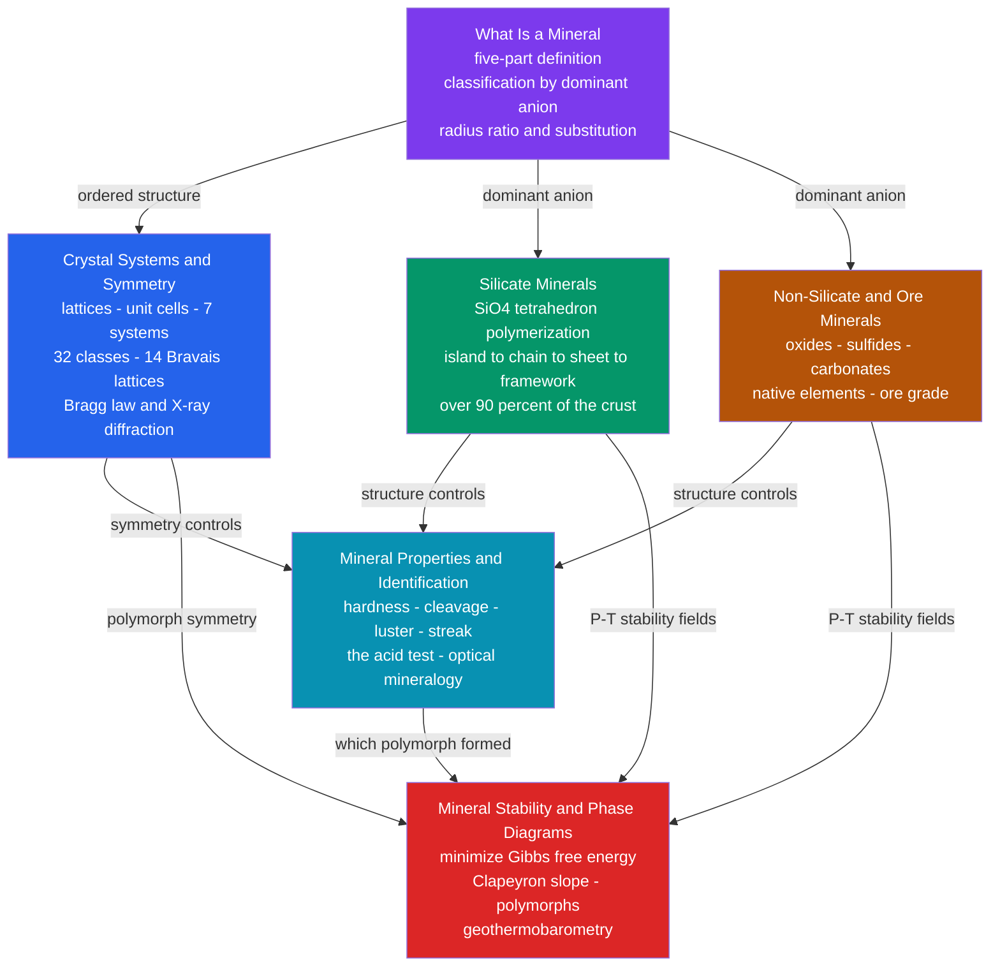

# 💎 Minerals & Crystallography — Map of Content

> [!abstract] What This Section Covers
> Minerals are the building blocks of the solid Earth — naturally occurring, generally inorganic crystalline solids with a definite composition and an ordered internal structure. This section builds the mineral kingdom from first principles: it defines what a mineral *is* and how the ~6,000 species are classified by their dominant anion, formalizes the "ordered structure" criterion through lattices, symmetry, the seven crystal systems, and X-ray diffraction, then works through the two great compositional divisions — the rock-forming **silicates** (over 90 percent of the crust, all built by polymerizing one SiO4 tetrahedron) and the economically vital **non-silicates and ores** (oxides, sulfides, carbonates, native elements). It closes by turning structure and chemistry into practice: reading **diagnostic physical properties** to identify minerals in hand sample, and using **Gibbs-energy phase diagrams** to predict which mineral or polymorph is stable, so that an assemblage becomes a frozen thermometer and barometer of the conditions it last equilibrated under. Every note opens at secondary level and deepens to graduate-level crystal chemistry and thermodynamics.

## Concept Map

*(Purple = foundational entry point, blue/green/brown/cyan = the core body, red = the advanced capstone; arrows read as "leads to" or "controls".)*

## Learning Path

1. [[What_Is_a_Mineral]] — Start here: the five-part definition, mineral vs mineraloid vs rock, classification by anion, and the crystal chemistry (radius ratio, Pauling's rules, solid solution) that governs which minerals form.
2. [[Crystal_Systems_and_Symmetry]] — Formalize the "ordered structure" criterion: lattices and unit cells, symmetry elements, the seven crystal systems and 14 Bravais lattices, and how Bragg's law and X-ray diffraction reveal them.
3. [[Silicate_Minerals]] — The dominant class: how a single SiO4 tetrahedron polymerizes from islands through chains and sheets to frameworks, and how that one knob sets cleavage, crystallization order, and weathering rate.
4. [[Non_Silicate_and_Ore_Minerals]] — The economically dense minority: native elements, oxides, sulfides, carbonates, sulfates, halides, and phosphates, plus ore grade and how metals concentrate into deposits.
5. [[Mineral_Properties_and_Identification]] — Turn structure into practice: hardness, cleavage, luster, color and streak, specific gravity, special tests, and the optical mineralogy that identifies minerals in the field and lab.
6. [[Mineral_Stability_and_Phase_Diagrams]] — The capstone: minimize Gibbs free energy, read the Clapeyron slope, and use polymorphs and solid solutions as thermometers and barometers frozen into rock.

## All Notes at a Glance

| Note | Difficulty | What You'll Learn |
|------|------------|-------------------|
| [[What_Is_a_Mineral]] | Secondary → Graduate | The five-part definition, mineral vs mineraloid vs rock, Nickel–Strunz anion classes, radius-ratio and Pauling's rules, solid solution, coupled substitution, polymorphism |
| [[Crystal_Systems_and_Symmetry]] | Secondary → Graduate | Lattices and unit cells, symmetry elements, the crystallographic restriction (no 5-fold), 7 systems, 32 classes, 14 Bravais lattices, 230 space groups, Miller indices, Bragg's law, quasicrystals |
| [[Silicate_Minerals]] | Secondary → Graduate | The SiO4 tetrahedron, polymerization from neso- to tectosilicates, Si:O ratios, structure-controlled cleavage, feldspar solid solutions, NBO/T and melt viscosity, clays and weathering |
| [[Non_Silicate_and_Ore_Minerals]] | Secondary → Graduate | Native elements, oxides, sulfides, carbonates, sulfates, halides, phosphates; ore grade and enrichment, deposit-forming processes, acid mine drainage, sulfide bonding, calcite vs aragonite |
| [[Mineral_Properties_and_Identification]] | Secondary → Graduate | Habit, cleavage vs fracture, Mohs hardness, luster, color and streak, specific gravity, tenacity, special tests, origin of color, and optical/instrumental (PPL, XPL, EPMA, XRD, Raman) methods |
| [[Mineral_Stability_and_Phase_Diagrams]] | Undergraduate → Graduate | Gibbs-energy minimization, the Clapeyron relation, polymorph barometers, the Al2SiO5 triple point, solvus and exsolution, the Gibbs phase rule, pseudosections, and mantle transition-zone phase changes |

## Key Questions This Section Answers

- What exactly makes something a mineral — and why is ice a mineral while liquid water, opal, and lab-grown ruby are not?
- Why can crystals show 2-, 3-, 4-, and 6-fold symmetry but never 5-fold, and how does X-ray diffraction let us "see" a lattice we cannot?
- How does nature build the entire silicate zoo — quartz, feldspar, olivine, mica, garnet, asbestos — from a single SiO4 building block?
- Where are the metals hidden, and how does a formula alone tell you what fraction of an ore is the metal you actually want?
- How does a geologist identify one mineral out of thousands in the field with just a hand lens, a knife, and a drop of acid?
- Why is a diamond a message from more than 150 km down, and how does a mineral assemblage record the pressure and temperature it last equilibrated at?

## Related Sections

- [[_MOC_Earth_Science_Master|↑ Earth Science Master MOC]]
- [[_MOC_Rocks_Petrology|→ Rocks & Petrology]] — minerals are the building blocks; rocks are their aggregates, and Bowen's series *is* increasing silicate polymerization.
- [[_MOC_Earth_Structure_Geophysics|→ Earth Structure & Geophysics]] — olivine polymorph transitions define the 410 and 660 km mantle discontinuities.
- **Chemistry** — [[Solid_State_and_Crystal_Structures]] (crystal lattices *are* mineral structures), [[Chemical_Bonding_and_Molecular_Geometry]] (the Si–O bond and coordination), [[Chemical_Thermodynamics]] and [[Phase_Equilibria_and_Colligative_Properties]] (Gibbs energy and the Clapeyron relation).
- **Physics** — [[Interference_and_Diffraction]] and [[Wave_Motion_and_Properties]] underpin Bragg's law; [[Polarization_and_Dispersion]] and [[Geometric_and_Wave_Optics]] drive optical mineralogy.

## Key References

- Klein, C. & Dutrow, B. — *Manual of Mineral Science* (23rd ed., Dana's) — the standard hand reference
- Nesse, W. D. — *Introduction to Mineralogy* and *Introduction to Optical Mineralogy* (Oxford)
- Putnis, A. — *Introduction to Mineral Sciences* (Cambridge) — crystal chemistry and thermodynamics
- Deer, Howie & Zussman — *An Introduction to the Rock-Forming Minerals* (3rd ed.)
- Spear, F. S. — *Metamorphic Phase Equilibria and P–T–t Paths* (MSA) — phase diagrams and geothermobarometry

#MOC #EarthScience #Mineralogy
