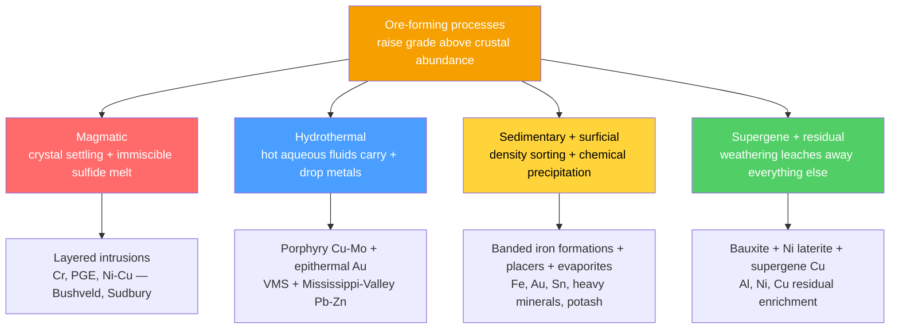

# 💰 Economic Geology and Resources

> [!abstract] TL;DR
> Economic geology studies how Earth concentrates useful elements — which are usually rare and thinly spread — into **ore deposits** rich enough to mine at a profit. The key number is the **concentration factor**: the ratio of an ore's grade to the element's average crustal abundance. Aluminium needs only ~4× enrichment, but gold needs over ~1000× and mercury ~25,000×. Four great process families do the concentrating: **magmatic** (crystal settling and immiscible sulfide melts — Ni, Cr, PGE), **hydrothermal** (metal-bearing fluids — porphyry Cu–Mo, epithermal Au, VMS, Mississippi-Valley Pb–Zn), **sedimentary** (banded iron formations, evaporites, density-sorted placers), and **supergene/residual** (weathering-concentrated bauxite and laterites). Energy resources — coal, oil and gas, geothermal, uranium — plus groundwater and the critical metals of the energy transition (Li, Co, rare earths) all obey the same logic: geology sets the grade and tonnage; economics sets the **cut-off grade** that decides what counts as ore.

## Intuition — analogy FIRST

Imagine a swimming pool with a single gold ring dissolved into it, atom by atom. The gold is *there* — but it is worthless, because collecting it costs far more than the ring is worth. Now imagine the same amount of gold gathered onto a coin at the bottom of the pool. Same atoms, same total mass — but now it is a *resource*, because it is **concentrated** enough to recover profitably. That gathering is exactly what ore-forming geology does: a slow crystallizing magma, a hot fluid, a river sorting grains by weight, or tropical rain leaching away everything *except* the metal.

The single most important idea: **"ore" is not a mineral, it is an economic verdict.** A rock is ore only if the valuable stuff (the *ore minerals*) can be extracted profitably from the worthless stuff (the *gangue*). Change the metal price, the technology, or the depth, and the same rock can switch between "ore" and "waste" without a single atom moving.

---

## How It Works



Every deposit is a place where one of these four engines ran locally, hundreds to millions of times more efficiently than the average crust, and left the metal behind in mineable form.

### Secondary Level

**Ore, gangue, and the concentration factor.** An **ore** is rock from which a valuable material can be extracted profitably; the useless minerals mixed in are **gangue**. Whether rock is ore depends on how concentrated the valuable element is. The **concentration factor** compares the ore grade $G_{ore}$ to the element's average abundance in the crust $C_{crust}$:

$$CF = \frac{G_{ore}}{C_{crust}}$$

| Metal | Crustal abundance | Typical ore grade | Concentration factor |
|-------|-------------------|-------------------|----------------------|
| Aluminium | ~8.2% | ~30% (bauxite) | ~4× |
| Iron | ~5.6% | ~50% | ~9× |
| Copper | ~55 ppm | ~0.5% | ~90× |
| Nickel | ~84 ppm | ~1% | ~120× |
| Zinc | ~70 ppm | ~5% | ~700× |
| Lead | ~13 ppm | ~4% | ~3000× |
| Uranium | ~2.7 ppm | ~0.1% | ~370× |
| Gold | ~0.004 ppm | ~5 g/t | ~1250× |
| Mercury | ~0.08 ppm | ~0.2% | ~25,000× |

The lesson: abundant metals (Al, Fe) need barely any enrichment, so they are cheap and widespread; rare metals (Au, Hg) require enormous concentration factors, so their deposits are geological rarities — and precious.

**Reserves vs resources.** *Resources* are all of an element that exists in a form we might one day use; *reserves* are the portion we have **found** and can extract **profitably right now**. Reserves are small, well-known, and economic; resources are large, partly hypothetical, and include material too poor or too deep to mine today.

### Undergraduate Level

**The McKelvey box** (USGS classification) sorts every occurrence on two independent axes — how *sure* we are it exists (geologic certainty) and how *profitable* it is (economic feasibility):

| | Identified | Undiscovered |
|---|---|---|
| **Economic** | **RESERVES** | (hypothetical / speculative) |
| **Sub-economic** | conditional resources | undiscovered resources |

Only the top-left cell — *identified* **and** *economic* — is a reserve. Because the vertical axis is set by price and technology, **reserves grow when the metal price rises or extraction improves, and shrink as they are mined**, even if no new rock is found. This is why "years of reserves left" almost never falls to zero.

**Grade, tonnage, and cut-off grade.** Two numbers define a deposit: its **grade** (concentration of the valuable component, e.g. % Cu or g/t Au) and its **tonnage** (mass of ore). Contained metal is

$$M = T \times \bar{g} \times r$$

where $\bar g$ is average grade and $r$ is metallurgical recovery. The **cut-off grade** $g_c$ is the lowest grade worth processing; material below it is waste. At break-even, the value of recovered metal in a tonne of ore just equals its processing cost:

$$g_c = \frac{C_{proc}}{p \, r}$$

with $C_{proc}$ the processing plus overhead cost per tonne, $p$ the metal price, and $r$ the recovery. Raising the cut-off leaves less ore but a higher average grade — the fundamental **grade–tonnage trade-off**.

**Metallic ore-forming processes.**

- **Magmatic.** Inside a cooling mafic magma, dense early crystals **settle** to form layers (chromite → Cr; the Merensky Reef → platinum-group elements), and if the melt becomes sulfur-saturated an **immiscible sulfide liquid** separates and scavenges Ni, Cu, Co and PGE, pooling at the base. The **Bushveld Complex** (South Africa) and **Sudbury** (impact-triggered, Canada) are archetypes. See [[Magma_Generation_and_Bowens_Series]].
- **Hydrothermal.** Hot water carries metals as dissolved complexes and drops them where conditions change. **Porphyry Cu–Mo** deposits form above subduction-zone plutons and supply most of the world's copper (Chuquicamata, Bingham Canyon); **epithermal Au–Ag** forms in shallow volcanic settings; **VMS** deposits precipitate at seafloor black smokers; **Mississippi-Valley-type (MVT)** Pb–Zn forms from cool basinal brines in limestone. Arc magmatism ties many of these to [[Subduction_Zones_and_Mountain_Building]].
- **Sedimentary.** **Banded iron formations (BIFs)** — the world's iron backbone (Hamersley, Carajás) — record the **Great Oxidation Event**: rising atmospheric O₂ oxidized dissolved Fe²⁺ in Precambrian oceans, precipitating iron-oxide layers. **Evaporites** yield potash and salt; **placers** let flowing water sort dense, durable grains (gold, cassiterite, diamond, heavy minerals) — the Witwatersrand paleoplacer is history's greatest gold source. See [[Sedimentary_Rocks_and_Environments]].
- **Supergene / residual.** Intense tropical weathering strips away soluble elements and leaves the insoluble behind: **bauxite** (residual Al hydroxides) and **Ni laterites**. In **supergene enrichment**, downward-percolating acid water leaches copper from a low-grade cap and redeposits it below the water table, upgrading a sub-economic protore into ore.

**Energy resources.** **Coal** forms from peat buried and cooked through rising rank — peat → lignite → sub-bituminous → bituminous → anthracite — with carbon content and heating value climbing at each step. **Oil and gas** require a complete **petroleum system**: an organic-rich **source rock**, **maturation** into the **oil window** (~60–120 °C at 2–4 km depth), **migration** of buoyant hydrocarbons, a porous **reservoir**, a geometric **trap**, and an impermeable **seal** — all in the right order. **Geothermal** taps Earth's internal heat (see [[Earths_Internal_Heat_and_Geothermal_Gradient]]); **uranium** fuels reactors and concentrates in unconformity and sandstone roll-front deposits. **Groundwater** in aquifers is itself a mined resource — often faster than it recharges (see [[Groundwater_and_Karst]]).

### Graduate Level

**Thermodynamics and kinetics of hydrothermal transport.** Metals are almost insoluble as free ions but travel as **aqueous complexes**. Base metals ride **chloride** ligands, e.g. galena dissolution

$$\mathrm{PbS + 2H^{+} + 2Cl^{-} \rightleftharpoons PbCl_2(aq) + H_2S}$$

so solubility rises with chloride activity, acidity, and temperature. Gold rides **bisulfide** complexes:

$$\mathrm{Au + 2H_2S \rightleftharpoons Au(HS)_2^{-} + H^{+} + \tfrac{1}{2}H_2}$$

Deposition is triggered by anything that **lowers solubility**: cooling, dilution by meteoric water, reduction, a pH rise from wall-rock reaction, or **boiling** — phase separation strips H₂S and CO₂ into the vapour, raising pH and collapsing the gold complex. This is why epithermal gold concentrates in boiling zones. The temperature dependence follows a van't Hoff form,

$$\frac{d\ln K}{dT} = \frac{\Delta H_r}{RT^2}$$

so mapping fluid inclusion temperatures and salinities effectively reconstructs the metal-carrying capacity of the paleo-fluid.

**Grade–tonnage statistics of deposit populations.** Across a deposit type, both grade and tonnage are approximately **lognormal**, so contained metal (endowment) is extraordinarily right-skewed — a handful of **giant deposits** hold most of the world's metal. **Lasky's law** captures the grade–tonnage relation within a district: average grade falls linearly as the logarithm of tonnage rises,

$$\bar{g} = K - k\,\log_{10} T$$

meaning that lowering the cut-off grows tonnage exponentially while grade decays only arithmetically. USGS **grade–tonnage models** (Singer, Cox) formalize this by describing each deposit type with median tonnage and grade plus lognormal spreads, enabling probabilistic assessment of undiscovered resources.

**Critical minerals and the R/P limit.** The energy transition concentrates demand on **lithium** (salar brines, spodumene pegmatites), **cobalt** (Ni–Cu sulfides, DRC sediment-hosted Cu–Co), and **rare earths** (carbonatites, ionic clays). Supply is geographically concentrated and recycling still marginal. A common metric is the **reserve-to-production ratio**,

$$\frac{R}{P} = \frac{\text{reserves}}{\text{annual production}}$$

often mis-read as "years until we run out." In fact $R$ is a moving economic quantity, so $R/P$ for many commodities has stayed roughly constant — or risen — for a century as reserves were added faster than production.

```python
import numpy as np

rng = np.random.default_rng(42)

# --- A porphyry-copper block model ------------------------------------
# Each block = 10,000 tonnes of rock. Copper grade (% Cu) is lognormally
# distributed, a standard empirical model for disseminated deposits.
n_blocks         = 200_000
tonnes_per_block = 1e4
grades = rng.lognormal(mean=np.log(0.35), sigma=0.6, size=n_blocks)  # % Cu

# --- Economic parameters ----------------------------------------------
cu_price        = 9000.0   # USD per tonne of copper metal (~ $4.08/lb)
recovery        = 0.88     # metallurgical recovery (fraction of Cu recovered)
processing_cost = 9.0      # USD per tonne of ore milled
ga_cost         = 2.0      # general & admin, USD per tonne of ore

# --- Break-even (milling) cut-off grade -------------------------------
#   value of recovered metal == processing + overhead cost
#   (g/100) * recovery * price == proc + ga   ->   solve for g
cutoff = (processing_cost + ga_cost) / (recovery * cu_price) * 100  # % Cu
print(f"Break-even cut-off grade: {cutoff:.3f} % Cu\n")

# --- Apply the cut-off: above = ore, below = waste --------------------
ore_mask       = grades >= cutoff
ore_tonnes     = ore_mask.sum() * tonnes_per_block
avg_grade      = grades[ore_mask].mean()
contained_cu   = ore_tonnes * avg_grade / 100.0     # tonnes Cu in the ground
recoverable_cu = contained_cu * recovery            # tonnes Cu actually won
gross_value    = recoverable_cu * cu_price

print(f"Ore tonnage above cut-off: {ore_tonnes/1e6:8.1f} Mt")
print(f"Average ore grade:         {avg_grade:8.3f} % Cu")
print(f"Recoverable copper:        {recoverable_cu/1e3:8.1f} kt")
print(f"Gross in-situ value:       {gross_value/1e9:8.2f} B USD")

# --- Grade-tonnage curve: the fundamental inverse trade-off -----------
print("\ncut-off %   ore Mt   avg grade %   recoverable Cu kt")
for gc in [0.15, 0.20, 0.30, 0.40, 0.50, 0.70]:
    m  = grades >= gc
    t  = m.sum() * tonnes_per_block
    g  = grades[m].mean() if m.any() else 0.0
    cu = t * g / 100 * recovery / 1e3
    print(f"  {gc:5.2f}   {t/1e6:7.1f}    {g:8.3f}      {cu:10.1f}")
# Raising the cut-off shrinks tonnage but lifts average grade:
# there is no free lunch in choosing where "ore" begins.
```

---

## Real-World Notes

- **Bushveld Complex, South Africa** — the planet's largest layered mafic intrusion holds ~75% of world platinum-group-element reserves in centimetre-scale magmatic layers (the Merensky Reef, UG2 chromitite), a textbook case of crystal settling and sulfide immiscibility.
- **Chuquicamata & Escondida, Chile** — giant porphyry copper systems above the Andean subduction zone; low grade (~0.5% Cu) but colossal tonnage make Chile the world's copper superpower. Supergene enrichment blankets upgraded the near-surface ore.
- **Hamersley Basin, Western Australia** — banded iron formations deposited ~2.5 Ga during the Great Oxidation Event, later upgraded by fluids to >60% Fe hematite ore; the foundation of the global steel supply.
- **Witwatersrand, South Africa** — a ~2.9-Ga paleoplacer that has produced roughly a third of all gold ever mined; density sorting concentrated detrital gold into ancient river conglomerates.
- **Ghawar Field, Saudi Arabia** — the largest conventional oil field: a Jurassic carbonate reservoir, marine source rock matured in the oil window, an anticlinal trap, and an anhydrite seal — every element of the petroleum system aligned.
- **Salar de Atacama, Chile / Greenbushes, Australia** — the two dominant lithium modes (evaporite brine vs spodumene pegmatite) supplying the battery economy; illustrate why "critical mineral" supply is geologically and geographically concentrated.

---

## Common Pitfalls

1. **Confusing an element's presence with an ore.** Every rock contains trace copper or gold; only rock enriched by a large **concentration factor** and extractable at a profit is ore. Abundance in the crust is not a resource.
2. **Treating reserves as a fixed physical stock.** Reserves are an *economic* quantity that expands with higher prices or better technology and contracts with depletion — which is why "reserve life" $R/P$ rarely counts down to zero.
3. **Reading $R/P$ as a doomsday clock.** A ratio of "50 years of reserves" does not mean 50 years to exhaustion; reserves are continually re-defined as $R$ grows with exploration and price.
4. **Ignoring the cut-off grade.** Quoting a deposit's "grade" without its cut-off is meaningless — the average grade is an artefact of where you drew the ore/waste line, and lowering the cut-off always lowers average grade while raising tonnage.
5. **Assuming hydrothermal metals just "flow in."** Metals are near-insoluble alone; they move only as complexes (chloride, bisulfide) and precipitate only when cooling, boiling, dilution, or pH change destabilizes the complex. No trigger, no ore.
6. **Calling all iron and aluminium ore "primary."** The great iron and aluminium ores are *derived*: BIFs record ancient ocean chemistry, and bauxite is a residual weathering product — not primary magmatic concentrations.

---

## Related Concepts

- [[_MOC_Rocks_Petrology|↑ Section MOC]]
- [[The_Rock_Cycle]] — the machinery whose processes (melting, fluid flow, weathering, sorting) do all the concentrating
- [[Magma_Generation_and_Bowens_Series]] — fractional crystallization and sulfide immiscibility behind magmatic ores
- [[Igneous_Rocks_and_Classification]] — the intrusive hosts of porphyry and layered-intrusion deposits
- [[Volcanism_and_Volcanic_Hazards]] — the surface expression of the arc magmatism that drives porphyry and epithermal systems
- [[Sedimentary_Rocks_and_Environments]] — home of banded iron formations, evaporites, placers, and hydrocarbons
- [[Metamorphism_and_Metamorphic_Facies]] — contact metamorphism and skarn ore formation at intrusion margins
- [[Non_Silicate_and_Ore_Minerals]] — the sulfide, oxide, and native-metal minerals that actually carry the metal
- [[Subduction_Zones_and_Mountain_Building]] — the tectonic engine behind arc-related porphyry and VMS deposits
- [[Groundwater_and_Karst]] — water as a resource, and the basinal brines that form MVT Pb–Zn ores
- [[Earths_Internal_Heat_and_Geothermal_Gradient]] — the heat driving geothermal energy and hydrocarbon maturation
- [[_MOC_Mathematics_Master]] — lognormal distributions and grade–tonnage statistics used in the demo (Mathematics vault)

---

## Review Questions

1. **Secondary**: Gold's crustal abundance is ~0.004 ppm and a workable ore grade is ~5 g/t (≈5 ppm). Compute the concentration factor. Explain why gold deposits are geologically rare while iron deposits are common, using the idea that iron needs only ~9× enrichment.
2. **Undergraduate**: A copper deposit is milled for a total processing-plus-overhead cost of \$11 per tonne, at 88% recovery, with copper at \$9000/t. Find the break-even cut-off grade. If the price falls to \$6000/t, what happens to the cut-off grade, the tonnage classified as ore, and the reserves — and why?
3. **Graduate**: Explain why epithermal gold concentrates in zones where the hydrothermal fluid boils. Reference the transport of gold as a bisulfide complex and describe how boiling changes H₂S content and pH. Then discuss why the reserve-to-production ratio $R/P$ is a poor predictor of long-run resource exhaustion.

---

## Sources

- Robb, L. — *Introduction to Ore-Forming Processes*, 2nd ed. (Wiley-Blackwell)
- Guilbert, J. M. & Park, C. F. — *The Geology of Ore Deposits*
- McKelvey, V. E. (1972) — "Mineral Resource Estimates and Public Policy," *American Scientist* 60, 32 (the reserves/resources box)
- Singer, D. A. & Menzie, W. D. — *Quantitative Mineral Resource Assessments* (grade–tonnage models)
- Selley, R. C. & Sonnenberg, S. A. — *Elements of Petroleum Geology*, 3rd ed.
- USGS — *Mineral Commodity Summaries* (annual reserves and production data)

---

#earth-science #economic-geology #ore-deposits #mineral-resources #hydrothermal #magmatic #petroleum #critical-minerals #secondary #undergraduate #graduate
