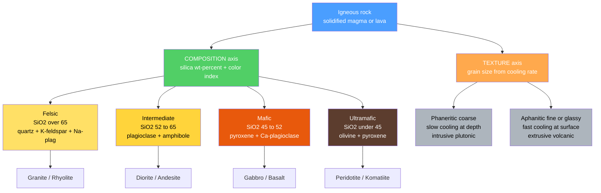

# 🪨 Igneous Rocks and Classification

> [!abstract] TL;DR
> Igneous rocks crystallize from molten **magma** (below ground) or **lava** (at the surface), and every one records its origin through just **two variables**: **texture** (grain size, set by cooling rate) and **composition** (magma chemistry, tracked by silica content). Slow cooling at depth grows large crystals → coarse **phaneritic** *intrusive/plutonic* rocks; fast cooling at the surface gives fine **aphanitic** or **glassy** *extrusive/volcanic* rocks. Silica content sorts magma from **felsic** ($>65\%\ \mathrm{SiO_2}$, light) through **intermediate** and **mafic** to **ultramafic** ($<45\%$, dark). Crossing the two axes yields the classic grid — **granite/rhyolite, diorite/andesite, gabbro/basalt, peridotite/komatiite** — formalized by the IUGS **QAPF** (modal) and **TAS** (chemical) schemes. Basalt builds the ocean floor; granite builds the continents.

## Intuition — analogy FIRST

Think about making rock candy versus a chocolate bar. If you let sugar syrup cool **slowly** over days, big sugar crystals grow that you can see and crunch. If you cool the same syrup **fast** (quench it), you get a smooth, glassy candy with no visible crystals at all. The *chemistry* of the syrup never changed — only the *cooling rate* — yet the two results look completely different.

An igneous rock is exactly this, at planetary scale. The same magma cooled slowly kilometres underground grows coarse, interlocking crystals (**granite**); erupted and chilled at the surface it becomes fine-grained or glassy (**rhyolite**, or **obsidian**). So a geologist reads **two dials** on every igneous rock: *how fast did it cool?* (texture) and *what was it made of?* (composition). Together they name the rock and reveal where it was born.

---

## How It Works

An igneous rock is fully described by locating it on a two-dimensional grid: the **composition axis** (silica-rich felsic → silica-poor ultramafic) and the **texture axis** (coarse phaneritic → fine aphanitic → glassy). Composition is inherited from the source and its evolution ([[Magma_Generation_and_Bowens_Series]]); texture is imprinted by the cooling environment.



---

## Key Concepts / Details

### Secondary Level

Two questions name any igneous rock: **How did it cool?** (texture) and **What was the magma made of?** (composition).

**Texture — the cooling-rate record**

| Texture | Grain size | Cooling | Origin / example |
|---------|-----------|---------|------------------|
| **Phaneritic** | coarse, crystals visible to eye | slow, deep | **intrusive / plutonic** (granite) |
| **Aphanitic** | fine, crystals microscopic | fast, at surface | **extrusive / volcanic** (basalt) |
| **Glassy** | no crystals | quenched instantly | obsidian |
| **Porphyritic** | two sizes: large **phenocrysts** in fine **groundmass** | two-stage cooling | porphyry |
| **Vesicular** | frothy, gas-bubble holes | gas-rich, fast | **pumice** (felsic), **scoria** (mafic) |
| **Pyroclastic** | broken fragments welded/cemented | explosive eruption | **tuff**, volcanic **breccia** |

**Composition — the chemistry record.** Silica ($\mathrm{SiO_2}$) content is the master variable; it correlates with mineralogy and **color** (dark, iron/magnesium minerals dominate silica-poor magma).

| Class | $\mathrm{SiO_2}$ (wt %) | Color | Key minerals | Intrusive / Extrusive |
|-------|-------------------------|-------|--------------|-----------------------|
| **Felsic** | $>65$ | light | quartz, K-feldspar, Na-plagioclase | **Granite / Rhyolite** |
| **Intermediate** | $52-65$ | medium | plagioclase, amphibole, biotite | **Diorite / Andesite** |
| **Mafic** | $45-52$ | dark | Ca-plagioclase, pyroxene, olivine | **Gabbro / Basalt** |
| **Ultramafic** | $<45$ | very dark | olivine, pyroxene | **Peridotite / Komatiite** |

Reading the grid: a **dark, coarse** rock of pyroxene and Ca-plagioclase is **gabbro**; the same magma erupted and chilled is fine-grained **basalt**. A **light, coarse** rock with quartz is **granite**; erupted, it is **rhyolite**.

### Undergraduate Level

**Color index (CI)** quantifies the intuition, as the volume percent of dark (mafic) minerals:

$$\text{CI} = \text{vol\%}(\text{olivine} + \text{pyroxene} + \text{amphibole} + \text{biotite})$$

- **Leucocratic** ($\text{CI} < 35$) — felsic, light
- **Mesocratic** ($35 \le \text{CI} \le 65$) — intermediate
- **Melanocratic** ($65 < \text{CI} \le 90$) — mafic, dark
- **Holomelanocratic** ($\text{CI} > 90$) — ultramafic

**Tie to Bowen's Reaction Series.** The order minerals crystallize on cooling ([[Magma_Generation_and_Bowens_Series]]) is exactly the felsic–mafic gradient: high-temperature **olivine → pyroxene → amphibole → biotite** (discontinuous branch) and **Ca-plagioclase → Na-plagioclase** (continuous branch), ending in low-temperature **K-feldspar → muscovite → quartz**. Mafic rocks are made of the early, hot minerals; felsic rocks of the late, cool ones ([[Silicate_Minerals]]).

**Intrusive bodies** (shape of the pluton, defined relative to host layering):

| Body | Size / shape | Relation to country rock |
|------|--------------|--------------------------|
| **Batholith** | huge, $>100\ \mathrm{km^2}$ | **discordant** (cuts across) |
| **Stock** | pluton $<100\ \mathrm{km^2}$ | discordant |
| **Dike** | tabular sheet | **discordant** (cuts layers) |
| **Sill** | tabular sheet | **concordant** (parallel to layers) |
| **Laccolith** | dome, blister-shaped | concordant, arches roof up |

**IUGS classification schemes.** Two complementary standards:
- **QAPF (modal)** — Streckeisen's double triangle of **Q**uartz, **A**lkali feldspar, **P**lagioclase, **F**eldspathoid. Used for **coarse plutonic** rocks where you can *count* the minerals.
- **TAS (chemical)** — plots total alkalis $(\mathrm{Na_2O + K_2O})$ against $\mathrm{SiO_2}$ (both wt %). Used for **fine-grained/glassy volcanic** rocks where modes cannot be measured.

$$\text{TAS: } y = w(\mathrm{Na_2O}) + w(\mathrm{K_2O}) \quad \text{vs.} \quad x = w(\mathrm{SiO_2})$$

**Why it matters geologically.** **Basalt/gabbro** ($\rho \approx 3.0\ \mathrm{g\,cm^{-3}}$) forms the dense **oceanic crust** at mid-ocean ridges ([[Seafloor_Spreading_and_Ocean_Basins]]); **granite/granodiorite** ($\rho \approx 2.7\ \mathrm{g\,cm^{-3}}$) forms buoyant **continental crust**. This density contrast is why continents ride high and ocean basins sit low (isostasy), and why oceanic crust — not continental — subducts.

### Graduate Level

**Texture as a quantitative cooling-rate record.** Grain size reflects the competition between **nucleation rate** $N$ and **crystal growth rate** $G$, both functions of **undercooling** $\Delta T$ (degrees below the liquidus):

- **Small $\Delta T$ (slow cooling):** few nuclei form but grow for a long time → few **large** crystals (phaneritic).
- **Large $\Delta T$ (fast cooling):** many nuclei, rapid growth but little time → many **small** crystals (aphanitic).
- **Extreme quench:** nucleation is kinetically suppressed → **glass** (obsidian).

The cooling timescale of a body of half-thickness $L$ is set by thermal diffusion,

$$t_{\text{cool}} \sim \frac{L^2}{\kappa}, \qquad \kappa \approx 10^{-6}\ \mathrm{m^2\,s^{-1}}$$

so a metre-scale dike solidifies in days, a kilometre-scale pluton in $10^{4}$–$10^{5}$ years — directly explaining fine dikes versus coarse batholiths.

**Crystal Size Distribution (CSD).** Marsh's population-balance theory gives the density of crystals of length $L$ as

$$n(L) = n_0\,\exp\!\left(-\frac{L}{G\,\tau}\right)$$

where $\tau$ is the residence/growth time. The slope of $\ln n$ vs $L$ yields $G\tau$, turning a thin section into a clock for magmatic history.

**Magmatic suites and tectonic setting.** Chemical *trends* across a related rock series diagnose the tectonic environment:
- **Tholeiitic** — strong iron enrichment $(\mathrm{FeO}/\mathrm{MgO}$ rises before silica$)$; mid-ocean ridges (MORB), oceanic islands, primitive island arcs.
- **Calc-alkaline** — no iron enrichment, steady silica increase; mature **continental subduction arcs** (the Andes, Cascades).

Plotted on an **AFM diagram** $(\mathrm{Na_2O{+}K_2O}\ /\ \mathrm{FeO_{tot}}\ /\ \mathrm{MgO})$ the two trends separate cleanly, so an igneous suite becomes a fingerprint of the plate-tectonic setting that produced it.

```python
import numpy as np
import matplotlib.pyplot as plt

# --- Part 1: rule-based classifier (composition x texture grid) ---
def classify_igneous(sio2_wt, grain):
    """Name an igneous rock from silica wt-% and texture.
    grain in {'coarse','fine','glass'}."""
    if sio2_wt > 65:
        klass, intrusive, extrusive = 'Felsic', 'Granite', 'Rhyolite'
    elif sio2_wt >= 52:
        klass, intrusive, extrusive = 'Intermediate', 'Diorite', 'Andesite'
    elif sio2_wt >= 45:
        klass, intrusive, extrusive = 'Mafic', 'Gabbro', 'Basalt'
    else:
        klass, intrusive, extrusive = 'Ultramafic', 'Peridotite', 'Komatiite'

    if grain == 'coarse':      # phaneritic -> intrusive / plutonic
        rock = intrusive
    elif grain == 'fine':      # aphanitic  -> extrusive / volcanic
        rock = extrusive
    else:                      # quenched melt -> volcanic glass
        rock = 'Obsidian' if sio2_wt > 65 else f'{extrusive} (glassy)'
    return f'{klass}: {rock}'

tests = [(72, 'coarse'), (70, 'fine'), (60, 'coarse'),
         (48, 'fine'), (49, 'coarse'), (40, 'coarse'), (73, 'glass')]
for s, g in tests:
    print(f'SiO2={s:>3} wt%, {g:>6} -> {classify_igneous(s, g)}')

# --- Part 2: simplified Total-Alkali-Silica (TAS) diagram ---
# representative (SiO2, Na2O+K2O) wt-% for common volcanic rocks
tas = {'Basalt': (49, 3.0), 'Basaltic andesite': (54, 4.0),
       'Andesite': (59, 5.0), 'Dacite': (65, 6.5),
       'Rhyolite': (73, 8.5), 'Trachyte': (62, 10.5)}
plt.figure(figsize=(7, 5))
for name, (x, y) in tas.items():
    plt.scatter(x, y, s=60, zorder=5)
    plt.annotate(name, (x, y), textcoords='offset points', xytext=(5, 5))
plt.axvline(52, ls='--', c='grey'); plt.axvline(65, ls='--', c='grey')
plt.xlabel('SiO2 (wt %)'); plt.ylabel('Na2O + K2O (wt %)')
plt.title('Simplified TAS classification (Le Bas et al. 1986)')
plt.grid(alpha=0.3); plt.tight_layout()
```

---

## Real-World Notes

- **Ocean floor is basalt.** Mid-ocean ridges continuously erupt mafic magma; the ocean crust is pillow basalt + sheeted dikes over gabbro — preserved on land as **ophiolite** sequences, our best cross-sections of oceanic lithosphere ([[Seafloor_Spreading_and_Ocean_Basins]]).
- **Continents are granitic.** Great batholiths (Sierra Nevada, Coast Ranges) crystallized beneath ancient subduction arcs. Their low density keeps continents buoyant and unsubductable, setting the fundamental land–sea divide.
- **The Ring of Fire erupts andesite.** Named for the Andes, andesite dominates circum-Pacific subduction arcs; the **calc-alkaline** suite is the chemical signature of continental-margin subduction.
- **Obsidian and pumice served humanity.** Both are rhyolitic (felsic): obsidian's glassy conchoidal fracture made prized cutting tools; frothy pumice floats on water and is still mined as an abrasive.
- **Komatiites are time capsules.** These ultramafic lavas, with distinctive **spinifex** crystal textures, erupted mostly in the Archean ($>2.5$ Ga) when the mantle was hotter — nearly none form today.
- **Large Igneous Provinces (LIPs).** Continental flood basalts (Deccan Traps, Siberian Traps) erupted staggering volumes of mafic lava from mantle plumes and are causally linked to mass extinctions.

---

## Common Pitfalls

1. **Confusing texture with composition.** "Granite" does not mean "any coarse light rock." Grain size records *cooling history*; chemistry is a *separate* axis. A coarse **mafic** rock is **gabbro**, never granite.
2. **Trusting color alone.** Color only approximates composition. **Obsidian** is chemically felsic yet jet-black (glass + trace iron); some intermediate rocks look pale. Confirm with mineralogy or chemistry ([[Mineral_Properties_and_Identification]]).
3. **Misreading porphyritic texture.** Phenocrysts in a fine groundmass record **two cooling stages** (slow at depth, then fast on eruption) — *not* a single intermediate cooling rate.
4. **Equating silica wt % with visible quartz.** A rock can be $>45\%\ \mathrm{SiO_2}$ and contain **no quartz**, because silica is bound inside feldspars and pyroxenes. Free quartz crystallizes only when silica is in *excess* — i.e., in felsic rocks.
5. **Mixing classification schemes.** Use **QAPF** (modal mineralogy) for coarse plutonic rocks you can count, and **TAS** (whole-rock chemistry) for fine or glassy volcanic rocks you cannot. Applying the wrong scheme gives the wrong name.
6. **Overreading the field term "granite."** Commercial and field "granite" lumps granodiorite, tonalite, and syenite together; strict IUGS granite requires quartz to be 20–60% of the QAP total and specific feldspar ratios.

---

## Related Concepts

- [[_MOC_Rocks_Petrology|↑ Section MOC]]
- [[The_Rock_Cycle]] — igneous is one of three rock families; melting and crystallization drive the loop
- [[Magma_Generation_and_Bowens_Series]] — where magma composition comes from and the crystallization order behind the felsic–mafic gradient
- [[Volcanism_and_Volcanic_Hazards]] — the surface processes that produce extrusive rocks and eruption styles
- [[Sedimentary_Rocks_and_Environments]] — sibling family formed by weathering and deposition
- [[Metamorphism_and_Metamorphic_Facies]] — sibling family formed by solid-state transformation
- [[Economic_Geology_and_Resources]] — ore deposits genetically tied to igneous intrusions
- [[Silicate_Minerals]] — the mineral building blocks that define igneous composition
- [[Seafloor_Spreading_and_Ocean_Basins]] — basalt/gabbro as oceanic crust
- [[Mineral_Properties_and_Identification]] — color index and hand-sample identification
- [[_MOC_Mathematics_Master]] — cross-vault: thermal-diffusion cooling and CSD population statistics

---

## Review Questions

1. **Secondary:** A rock is dark, coarse-grained, and made almost entirely of pyroxene and calcium-rich plagioclase. Name the rock, state its composition class, and say whether it cooled slowly at depth or quickly at the surface.
2. **Undergraduate:** Two rocks have identical whole-rock chemistry ($52\%\ \mathrm{SiO_2}$) but one is phaneritic and one is aphanitic. Give both rock names, explain the different cooling environments, and describe what a *porphyritic* version of this magma would tell you about its ascent history.
3. **Graduate:** You are given whole-rock analyses for a related volcanic suite. Explain how you would use a TAS diagram and an AFM diagram to (a) name the rocks and (b) decide whether the suite is tholeiitic or calc-alkaline — and hence what tectonic setting produced it.

---

## Sources

- Best, M. — *Igneous and Metamorphic Petrology*, 2nd ed., Ch. 2–8
- Le Bas, M. J. et al. (1986) — "A Chemical Classification of Volcanic Rocks Based on the Total Alkali–Silica Diagram," *Journal of Petrology* 27, 745
- Streckeisen, A. (1976) — "To Each Plutonic Rock Its Proper Name" (IUGS QAPF), *Earth-Science Reviews* 12, 1
- Bowen, N. L. (1928) — *The Evolution of the Igneous Rocks*
- Marsh, B. D. (1988) — "Crystal Size Distribution (CSD) in Rocks and the Kinetics of Crystallization," *Contributions to Mineralogy and Petrology* 99, 277

#earth-science #petrology #igneous #rocks #texture #composition #TAS #QAPF #basalt #granite #secondary #undergraduate #graduate
