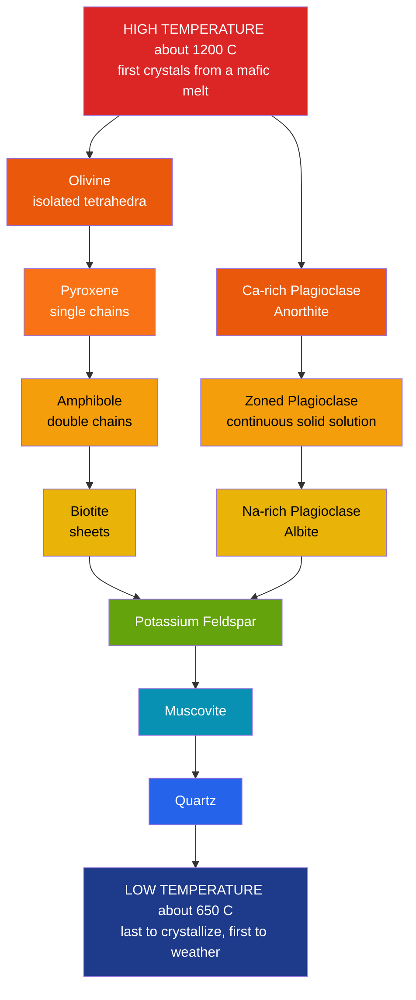

# 🌡️ Magma Generation and Bowen's Reaction Series

> [!abstract] TL;DR
> The mantle is **hot but almost entirely solid** — the geotherm sits *below* the dry peridotite solidus, so melting is the exception, not the rule. Rock melts by only **three tricks**: **decompression** (upwelling mantle rises adiabatically and crosses the solidus, at ridges and plumes), **flux melting** (water from a subducting slab lowers the solidus at arcs), and **heat addition** (basalt intruding the crust drives *anatexis*). The magma that results is defined by its **silica content**, which controls **polymerization → viscosity → eruptive style**. As magma cools, minerals crystallize in a predictable temperature order — **Bowen's Reaction Series**: a *discontinuous* ferromagnesian branch (olivine → pyroxene → amphibole → biotite) and a *continuous* plagioclase branch (Ca-rich → Na-rich), converging to K-feldspar → muscovite → quartz. Removing early crystals (**fractional crystallization**) drives residual melt toward felsic compositions, and the same order — reversed — is the **Goldich weathering series**.

## Intuition — analogy FIRST

Think of **slowly freezing a bottle of salty, spiced seawater**. It does not freeze all at once. The **purest water freezes first** at the highest temperature, and as ice grows the *leftover* liquid becomes saltier and more concentrated — its freezing point keeps dropping. Scoop out each layer of ice as it forms and the remaining brine drifts ever further from where you started.

Magma does exactly this in reverse-of-melting. A cooling basaltic melt crystallizes **olivine and calcium-rich plagioclase first** (the "ice"), and if those early crystals are physically **removed** — they sink, or get squeezed out — the **residual liquid** grows richer in silica, water, and incompatible elements, marching step by step toward granite. Bowen's series is simply the **ordered guest-list of which mineral leaves the melt at which temperature**, and magmatic diversity is the story of what happens to the leftover brine.

---

## How It Works



---

### Secondary Level

**Why the mantle is solid.** The mantle is hot — over 1000 °C — but under enormous pressure. The temperature-with-depth curve (the **geotherm**) lies *below* the temperature at which mantle rock (peridotite) begins to melt (the **solidus**). So the mantle stays solid and flows only as a stiff putty (see [[Mantle_Convection_and_Hotspots]]). To make magma you must **cross the solidus** by one of three tricks:

| Melting mechanism | What changes | Tectonic setting |
|---|---|---|
| **Decompression** | Pressure drops as hot rock rises | Mid-ocean ridges, mantle plumes |
| **Flux (water) melting** | Adding water lowers the solidus | Subduction zones / volcanic arcs |
| **Heat addition** | Hot basalt bakes the crust | Continental crust *anatexis* |

**Magma composition families.** Magmas are ranked by **silica ($\text{SiO}_2$) content**, and silica controls how stiff (viscous) and explosive they are:

| Magma | $\text{SiO}_2$ | Viscosity | Temp | Eruption |
|---|---|---|---|---|
| Ultramafic | < 45% | very low | ~1300 °C | (rare today) |
| Mafic / basaltic | 45–52% | low | 1100–1250 °C | runny, effusive |
| Intermediate / andesitic | 52–63% | high | 900–1100 °C | often explosive |
| Felsic / rhyolitic | > 63% | very high | 650–900 °C | very explosive |

More silica → more **polymerization** of $\text{SiO}_4$ tetrahedra into chains and networks (see [[Silicate_Minerals]]) → higher viscosity → gas cannot escape → explosive eruptions.

**Bowen's series in one line.** As magma cools, minerals crystallize in the fixed order shown in the diagram. The **discontinuous branch** (olivine → pyroxene → amphibole → biotite) changes *crystal structure* at each step; the **continuous branch** is one plagioclase feldspar shifting *composition* from Ca-rich to Na-rich. They meet at K-feldspar → muscovite → quartz. **Goldich weathering:** at Earth's surface this order *reverses* — olivine (first to crystallize) weathers fastest, quartz (last) is the most stable, which is why beaches are quartz sand.

### Undergraduate Level

**The solidus and the adiabat.** For dry peridotite the solidus has a **steep positive slope** in pressure–temperature space (higher pressure → higher melting point, a Clausius–Clapeyron consequence, $\frac{dP}{dT}=\frac{\Delta S}{\Delta V}$). Rising mantle follows a shallow **adiabat** (~0.3–0.5 °C/km). Because the adiabat is flatter than the solidus, upward flow **overtakes the solidus** and melts *without any heat being added* — this is decompression melting, the origin of MORB at ridges. **Flux melting** works differently: dissolved $\text{H}_2\text{O}$ dramatically **depresses the solidus** (by hundreds of degrees), so slab-derived water melts the mantle wedge at fixed temperature. **Anatexis** simply raises $T$ across the crustal solidus, usually via basaltic underplating.

**Polymerization quantitatively.** Melt structure is described by the ratio of **non-bridging oxygens to tetrahedral cations (NBO/T)**. Basaltic melts have high NBO/T (depolymerized, fluid); rhyolitic melts approach NBO/T ≈ 0 (fully polymerized network) with viscosities up to $10^{8}\,\text{Pa·s}$ — a trillion times stiffer than basalt. Dissolved water **breaks bridging bonds**, sharply lowering viscosity.

**Magmatic differentiation — four levers:**
1. **Fractional crystallization** — early crystals (olivine, Ca-plagioclase) are removed by settling or filter-pressing; residual melt evolves toward felsic. The engine of igneous diversity.
2. **Partial melting** — only part of a source melts; silica and incompatible elements enter the melt first, so the liquid is *more felsic* than the source.
3. **Magma mixing** — a mafic recharge blends with a resident felsic magma to give a hybrid (and often triggers eruption).
4. **Assimilation (AFC)** — magma melts and absorbs wall rock while crystallizing, coupling contamination to fractionation.

**The two branches, structurally.** Discontinuous branch = a march through silicate structures: **nesosilicate** (olivine, isolated $\text{SiO}_4$) → **inosilicate single chain** (pyroxene) → **inosilicate double chain** (amphibole, now hydrous) → **phyllosilicate** (biotite, sheets). Each step is a **peritectic reaction** where an earlier mineral reacts with the melt to build the next structure. The continuous branch is a **coupled substitution** in plagioclase, $\text{Ca}^{2+}+\text{Al}^{3+} \rightleftharpoons \text{Na}^{+}+\text{Si}^{4+}$, with no structural change — only composition slides from anorthite to albite.

### Graduate Level

**Binary phase diagrams — the thermodynamic basis.** Bowen's two branches are the two archetypal binary systems:

- **Diopside–Anorthite (a eutectic system, no solid solution).** Diopside melts at ~1392 °C, anorthite at ~1553 °C; the **eutectic** sits near **An₄₂ at ~1274 °C**. A melt cools to its liquidus, crystallizes one pure phase, and the liquid slides *down the liquidus toward the eutectic*, where both phases crystallize together at fixed $T$. This is why minerals appear **in sequence, then co-precipitate** — the model for the *discontinuous* behaviour. Phase proportions follow the **lever rule**.
- **Albite–Anorthite (a complete solid solution).** A **liquidus + solidus loop** with no eutectic. At any temperature, liquid and crystal coexist with *different* compositions; slow (equilibrium) cooling keeps crystals homogeneous, but fast cooling produces **compositional zoning** — Ca-rich cores, Na-rich rims — the fingerprint of the *continuous* branch and of fractional crystallization.

**Trace-element modeling.** A trace element's behaviour is set by its **bulk partition coefficient** $D=\dfrac{C^{\text{solid}}}{C^{\text{liquid}}}$ (mass-weighted over crystallizing phases). $D>1$ = **compatible** (enters crystals: Ni, Cr); $D<1$ = **incompatible** (stays in melt: Rb, K, U, REE). For **fractional (Rayleigh) crystallization**, where crystals are removed the instant they form:

$$\frac{C_L}{C_0} = F^{\,(D-1)}$$

with $F$ the fraction of melt remaining. Contrast **equilibrium (batch) crystallization**, where crystals stay in contact with the melt:

$$\frac{C_L}{C_0} = \frac{1}{D + F(1-D)}$$

Rayleigh drives far more extreme enrichment/depletion. Coupled assimilation is captured by the **AFC equation** (DePaolo, 1981), which links the concentration and isotope ratio of the melt to the ratio $r$ of assimilated to crystallized mass. Element *ratios* (e.g. $\text{Rb}/\text{Sr}$, $\text{La}/\text{Yb}$) fingerprint whether a suite formed by partial melting or by fractional crystallization.

```python
import numpy as np
import matplotlib.pyplot as plt

# Rayleigh fractional crystallization:  C_L / C_0 = F**(D - 1)
# F = fraction of MELT remaining;  D = bulk solid/melt partition coefficient.
F = np.linspace(1.0, 0.05, 200)      # melt fraction: 100% down to 5% remaining
crystallized = (1 - F) * 100          # percent of magma crystallized (x-axis)

elements = {
    "Rb  incompatible  D=0.05": 0.05,  # rejected by crystals -> soars in melt
    "Sr  neutral       D=1.0":  1.0,   # unchanged reference
    "Ni  compatible    D=8":    8.0,   # locked into olivine -> stripped out
}

plt.figure(figsize=(7, 5))
for label, D in elements.items():
    C_ratio = F ** (D - 1.0)          # residual-melt concentration / initial
    plt.plot(crystallized, C_ratio, lw=2, label=label)

plt.axhline(1.0, color="grey", ls=":", lw=1)
plt.yscale("log")
plt.xlabel("Percent of magma crystallized")
plt.ylabel("Melt concentration / initial  (C_L / C_0)")
plt.title("Rayleigh Fractional Crystallization of Trace Elements")
plt.legend()
plt.grid(True, which="both", alpha=0.3)
plt.tight_layout()

print("At 90% crystallized (F = 0.1):")
for label, D in elements.items():
    print(f"  {label:26s}  C_L/C_0 = {0.1**(D-1):10.4f}")
# Incompatible Rb is ~9x enriched in the residual felsic melt;
# compatible Ni is depleted by ~10 million-fold into the cumulate crystals.
```

---

## Real-World Notes

- **Mid-ocean ridges** produce the planet's greatest volume of magma by **decompression melting** of upwelling asthenosphere, yielding remarkably uniform MORB basalt (see [[Volcanism_and_Volcanic_Hazards]]).
- **Volcanic arcs** (Cascades, Andes, Japan) are built by **flux melting**: water expelled from the subducting slab melts the mantle wedge, and the wet, silica-rich magmas erupt explosively — Mount St. Helens (1980) and Pinatubo (1991) (see [[Subduction_Zones_and_Mountain_Building]]).
- **Hawaii and Iceland** tap hot mantle plumes; decompression yields hot, low-viscosity basalt that erupts *effusively* as lava flows rather than ash columns.
- **Layered mafic intrusions** — Bushveld, Skaergaard, Stillwater — are textbook **fractional crystallization**: settled crystals form rhythmic **cumulate** layers hosting the world's chromite and platinum-group ores (see [[Economic_Geology_and_Resources]]).
- **Granite batholiths** (Sierra Nevada) and supervolcanoes (Yellowstone) record **crustal anatexis** plus fractionation to felsic melts — cool, viscous, gas-charged.
- **Bowen himself** established the series through 1910s–1920s melting experiments at the Carnegie Geophysical Laboratory, summarized in *The Evolution of the Igneous Rocks* (1928).

## Common Pitfalls

1. **"Magma comes from a molten mantle."** The mantle is **solid**; only a few percent partial melt forms, and only where the solidus is crossed by decompression, flux, or heat. Melt is the rare exception.
2. **Treating Bowen's series as a ladder every magma must climb.** It is a *reference framework*. A basalt and a rhyolite start at different points; most magmas crystallize only a portion of the series, and few reach quartz.
3. **"More silica means hotter."** The opposite: felsic magmas are the **coolest**. Silica governs *viscosity* through polymerization, not temperature.
4. **Confusing continuous with discontinuous.** The plagioclase (continuous) branch keeps **one crystal structure** and only changes composition; the ferromagnesian (discontinuous) branch **changes structure** at each peritectic step.
5. **Forgetting that fractionation removes evidence.** Fractional crystallization *extracts* early phases, so the final rock may **lack** the minerals that formed first — don't read the modal assemblage as the full crystallization history.
6. **Misusing the Rayleigh equation.** $C_L/C_0=F^{(D-1)}$ assumes **perfect fractional** crystallization (instant crystal removal, no re-equilibration). Equilibrium (batch) crystallization needs the other formula and gives much milder enrichment.

---

## Related Concepts

- [[_MOC_Rocks_Petrology|↑ Section MOC]]
- [[The_Rock_Cycle]] — igneous crystallization is one gateway of the broader rock cycle
- [[Igneous_Rocks_and_Classification]] — the rock names (basalt, andesite, granite) that these magmas freeze into
- [[Volcanism_and_Volcanic_Hazards]] — silica-driven viscosity sets effusive vs explosive style
- [[Sedimentary_Rocks_and_Environments]] — Goldich weathering (Bowen reversed) supplies the detritus
- [[Metamorphism_and_Metamorphic_Facies]] — the other high-$T$/high-$P$ path through the rock cycle
- [[Economic_Geology_and_Resources]] — fractional crystallization concentrates Cr, Pt, and layered ore deposits
- [[Silicate_Minerals]] — tetrahedral polymerization underlies both viscosity and the reaction series
- [[Mantle_Convection_and_Hotspots]] — supplies the upwelling that drives decompression melting
- [[Subduction_Zones_and_Mountain_Building]] — the flux-melting factory for arc magmas
- [[Phase_Equilibria_and_Colligative_Properties]] — eutectics, solidus/liquidus, and freezing-point depression (Chemistry vault)
- [[Chemical_Thermodynamics]] — the free-energy basis of phase stability and the Clausius–Clapeyron slope (Chemistry vault)
- [[_MOC_Mathematics_Master]] — differential mass balance behind the Rayleigh equation (Mathematics vault)

---

## Review Questions

1. **Secondary**: Name the three ways to melt mantle or crustal rock, give the tectonic setting where each dominates, and explain in one sentence why the mantle is solid despite being over 1000 °C.
2. **Undergraduate**: A basaltic magma undergoes fractional crystallization. Predict how (a) the residual melt's $\text{SiO}_2$, (b) an incompatible element like Rb, and (c) a compatible element like Ni evolve as crystallization proceeds. Tie your answer to Bowen's series and to which minerals leave first.
3. **Graduate**: Using the diopside–anorthite eutectic (An₄₂, ~1274 °C), trace the crystallization path of a melt of composition An₃₀: which phase appears first, how does the liquid composition move, and what crystallizes at the eutectic? Then, given $D_{\text{Rb}}=0.05$, use the Rayleigh equation to compute the Rb enrichment of the melt after 80% crystallization, and state one assumption that would break if crystals were *not* removed.

---

## Sources

- Bowen, N. L. (1928) — *The Evolution of the Igneous Rocks*, Princeton University Press
- Winter, J. D. — *Principles of Igneous and Metamorphic Petrology*, 2nd ed., Ch. 6–11
- Best, M. G. — *Igneous and Metamorphic Petrology*, 2nd ed.
- Goldich, S. S. (1938) — "A Study in Rock Weathering," *Journal of Geology* 46, 17–58
- DePaolo, D. J. (1981) — "Trace element and isotopic effects of combined wallrock assimilation and fractional crystallization," *EPSL* 53, 189–202

#earth-science #petrology #igneous #magma #bowens-series #fractional-crystallization #partial-melting #secondary #undergraduate #graduate
