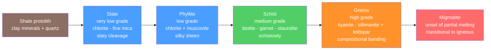

# 💠 Metamorphism and Metamorphic Facies

> [!abstract] TL;DR
> **Metamorphism** is the **solid-state** transformation of a pre-existing rock (the **protolith**) by **heat**, **pressure**, and **chemically active fluids** — recrystallizing minerals and growing new ones *without melting* (melting marks the boundary with igneous processes). Four agents drive it: rising **temperature** (recrystallization and new phases), **lithostatic/confining pressure** (depth of burial), **differential/directed stress** (which produces **foliation**), and **fluids** (which catalyze reactions and drive **metasomatism**). The intensity of change is the **metamorphic grade**, tracked by **index minerals** ($\text{chlorite}\to\text{biotite}\to\text{garnet}\to\text{staurolite}\to\text{kyanite}\to\text{sillimanite}$) and mapped as **isograds** and **Barrovian zones**. A rock's stable mineral **assemblage** places it in a **metamorphic facies** — a field in pressure–temperature space (zeolite, greenschist, amphibolite, granulite; **blueschist** and **eclogite** at high-$P$/low-$T$) — so its facies is a fingerprint of the **tectonic setting** and the $P$–$T$ path it followed.

## Intuition — analogy FIRST

Think of **baking and squeezing dough**. Raw dough (the protolith) doesn't melt in the oven — it stays solid, but heat rearranges its molecules into bread with a new texture. Now press that dough flat while it bakes: the layers align, giving it a grain, exactly the way **directed stress aligns platy minerals into foliation**. Bake hotter or press harder and you get a coarser, more differentiated loaf. The final crumb — fine and layered versus coarse and banded — tells you *how hot* and *how squeezed* it got.

Crucially, the **ingredients don't change** (it's the same flour and water = same bulk chemistry), only their **arrangement and which crystals are stable**. That single idea — same atoms, new stable minerals — is metamorphism, and the specific mineral "recipe" that survives is a thermometer and barometer recording the rock's deepest, hottest moment.

---

## How It Works



*Increasing grade — temperature and pressure both rise left to right; grain size coarsens and foliation strengthens until, at the far right, the rock begins to melt and re-enters the [[The_Rock_Cycle|rock cycle]] as magma.*

---

## Key Concepts / Details

### Secondary Level

**The four agents of metamorphism**

| Agent | Effect | Signature |
|-------|--------|-----------|
| **Heat** (raised $T$) | Drives recrystallization and growth of new minerals | Coarser grains, new index minerals |
| **Lithostatic pressure** (confining, from depth) | Equal in all directions; stabilizes dense minerals | Denser phases (e.g. garnet) |
| **Differential stress** (directed) | Unequal stress; rotates and grows platy grains | **Foliation** (planar fabric) |
| **Fluids** ($\text{H}_2\text{O}$, $\text{CO}_2$) | Catalyze reactions; transport ions | **Metasomatism** (bulk chemistry changes) |

**Textures — foliated vs non-foliated**

- **Foliated** (formed under directed stress): the classic shale sequence with rising grade — **slate → phyllite → schist → gneiss**, then **migmatite** where melting begins.
- **Non-foliated** (no platy minerals, or no directed stress): **marble** (from limestone), **quartzite** (from sandstone), **hornfels** (baked mudstone in a contact aureole).

**Metamorphic settings**

- **Contact / thermal**: baking in an **aureole** around a hot intrusion — high $T$, low $P$, non-foliated hornfels.
- **Regional / dynamothermal**: the dominant type — large volumes cooked and squeezed in **orogenic belts** (see [[Subduction_Zones_and_Mountain_Building]]).
- **Dynamic**: intense shear in **fault zones**, producing **mylonite**.
- **Burial / hydrothermal**: low-grade change from deep burial or hot circulating fluids.

### Undergraduate Level

**Grade and index minerals (Barrovian sequence)**

In pelitic (shale-derived) rocks, distinctive **index minerals** appear in order of rising temperature. First mapped by **George Barrow** in the Scottish Highlands, these define **Barrovian zones**:

$$\underbrace{\text{chlorite}}_{\text{low }T}\to\text{biotite}\to\text{garnet}\to\text{staurolite}\to\text{kyanite}\to\underbrace{\text{sillimanite}}_{\text{high }T}$$

The first appearance of each index mineral is an **isograd** — a line of equal metamorphic grade on a map. Zones between isograds record progressively hotter conditions.

**Metamorphic facies**

A **facies** is the set of $P$–$T$ conditions under which a characteristic **mineral assemblage** is stable (concept of **Pentti Eskola**, 1920). Every facies is a *field* in $P$–$T$ space; a metabasalt (basaltic protolith) placed in each facies develops a diagnostic assemblage:

| Facies | Approx. $T$ | Approx. $P$ | Diagnostic assemblage (metabasite) | Setting |
|--------|-------------|-------------|-------------------------------------|---------|
| **Zeolite** | 100–250 °C | low | zeolites, clays | shallow burial |
| **Greenschist** | 300–500 °C | low–moderate | chlorite + albite + epidote + actinolite | regional, moderate |
| **Amphibolite** | 500–700 °C | moderate | hornblende + plagioclase | regional, deeper |
| **Granulite** | >700 °C | moderate–high | pyroxene + plagioclase, no hydrous phases | deep crust, hot |
| **Blueschist** | 200–400 °C | **high** | glaucophane (blue amphibole) + lawsonite | **subduction** |
| **Eclogite** | >500 °C | **very high** | omphacite + garnet (no plagioclase) | deep subduction |
| **Hornfels** | 400–800 °C | very low | cordierite, andalusite | contact aureole |

The key insight: **greenschist → amphibolite → granulite** is the "normal" continental (Barrovian) trend of moderate $\mathrm{d}T/\mathrm{d}P$, while **blueschist → eclogite** requires a **cold, high-$P$** path — only produced by rapid **subduction**. Thus facies is a **tectonic fingerprint**. Which assemblage is stable is set by the same equilibrium thermodynamics as any [[Mineral_Stability_and_Phase_Diagrams|phase diagram]] (see also [[Phase_Equilibria_and_Colligative_Properties]]).

### Graduate Level

**Prograde vs retrograde**

- **Prograde** metamorphism accompanies rising $T$ (burial, heating); reactions are typically **dehydration** — they release $\text{H}_2\text{O}$ and are self-driving because fluid escapes.
- **Retrograde** metamorphism occurs on cooling/exhumation but is usually **incomplete**: hydration reactions are sluggish and starved of fluid, so high-grade assemblages are commonly *preserved metastably* at the surface — which is precisely why we can read the peak conditions.

**P–T–t paths and loops**

A rock does not sit at one point; it traverses a **pressure–temperature–time ($P$–$T$–$t$) loop**. Burial raises $P$ first (fast), then $T$ catches up (thermal relaxation is slow), so many orogenic rocks follow a **clockwise** loop: peak $P$ *precedes* peak $T$. The shape of the loop discriminates tectonic mechanisms (thickening vs. subduction vs. rifting).

**Geothermobarometry**

Peak $P$ and $T$ are quantified from the compositions of coexisting minerals. Any exchange reaction with a strong $T$- or $P$-dependence works as a sensor:

$$\ln K = -\frac{\Delta H}{RT} + \frac{\Delta S}{R} - \frac{\Delta V}{RT}P$$

- **Thermometers** use reactions with large $\Delta S$ / small $\Delta V$ (e.g. **garnet–biotite** Fe–Mg exchange) — steep in $T$.
- **Barometers** use reactions with large $\Delta V$ (e.g. **GASP**: garnet–aluminosilicate–plagioclase) — steep in $P$.

Intersecting a thermometer and a barometer on a $P$–$T$ diagram pins the peak conditions, letting geologists reconstruct **burial and exhumation** histories quantitatively (grounded in [[Chemical_Thermodynamics]]).

```python
# Schematic metamorphic-facies P-T diagram with two geothermal-gradient paths.
# High-P subduction geotherm (~8 C/km) -> blueschist/eclogite
# Normal continental geotherm (~25 C/km) -> greenschist/amphibolite
import numpy as np
import matplotlib.pyplot as plt
from matplotlib.patches import Rectangle

# Facies fields: name -> (Tmin, Tmax, Pmin, Pmax) in [deg C, GPa], schematic
facies = {
    "Zeolite":       (50, 250, 0.0, 0.30, "#cfe8ff"),
    "Greenschist":   (300, 500, 0.25, 0.80, "#8fd694"),
    "Amphibolite":   (500, 700, 0.40, 1.10, "#f4b26a"),
    "Granulite":     (700, 950, 0.40, 1.20, "#e57373"),
    "Blueschist":    (150, 400, 0.70, 1.50, "#7aa6ff"),
    "Eclogite":      (400, 900, 1.50, 2.50, "#9575cd"),
    "Hornfels":      (350, 800, 0.0, 0.25, "#ffe08a"),
}

fig, ax = plt.subplots(figsize=(7.5, 6))
for name, (Tmin, Tmax, Pmin, Pmax, c) in facies.items():
    ax.add_patch(Rectangle((Tmin, Pmin), Tmax - Tmin, Pmax - Pmin,
                            facecolor=c, edgecolor="k", alpha=0.55, lw=0.8))
    ax.text((Tmin + Tmax) / 2, (Pmin + Pmax) / 2, name,
            ha="center", va="center", fontsize=8, weight="bold")

# Geotherms: P[GPa] ~ 0.03 * z[km];  T = grad * z  =>  P = (0.03/grad) * T
T = np.linspace(0, 950, 200)
for grad, label, ls in [(25, "Normal continental (~25 C/km)", "-"),
                        (8,  "Subduction (~8 C/km)", "--")]:
    P = (0.03 / grad) * T
    ax.plot(T, P, ls, lw=2.4, label=label, color="black")

ax.set_xlim(0, 950); ax.set_ylim(0, 2.5)
ax.set_xlabel("Temperature (deg C)")
ax.set_ylabel("Pressure (GPa)  ~  depth")
ax.set_title("Schematic Metamorphic Facies & Geothermal Paths")
ax.invert_yaxis()  # depth increases downward
ax.legend(loc="lower right", fontsize=8)
plt.tight_layout()
plt.show()
```

---

## Real-World Notes

- **Barrovian zones, Scottish Highlands**: the type locality where Barrow mapped chlorite → sillimanite isograds in the 1890s — still the template for regional-metamorphic mapping worldwide.
- **Franciscan Complex, California**: classic **blueschist** terrane; blue glaucophane records the cold, high-$P$ path of the paleo-subduction zone beneath the ancestral North American margin.
- **Alpine & Himalayan eclogites**: coesite- and even microdiamond-bearing **ultrahigh-pressure (UHP)** eclogites prove continental crust was subducted to >100 km depth and then exhumed — direct evidence for deep [[Subduction_Zones_and_Mountain_Building|continental subduction]].
- **Marble and slate as commodities**: Carrara marble (metamorphosed limestone) and Welsh roofing slate are metamorphic rocks whose *texture* (recrystallized calcite; perfect slaty cleavage) is their economic value.
- **Contact aureoles**: the hornfels rims around granite plutons (e.g. Skiddaw, England) show metamorphic grade *decreasing outward* from the intrusion over a few hundred metres — a natural thermometer of the pluton's heat.
- **Metamorphic core complexes** (e.g. Basin and Range, USA): deep amphibolite-facies rocks exhumed along low-angle detachment faults, recording rapid extension and unroofing on $P$–$T$–$t$ loops.

---

## Common Pitfalls

1. **"Metamorphism means melting."** No — melting *ends* metamorphism. Once melt appears (migmatite), the rock crosses into igneous petrology. Metamorphism is strictly **sub-solidus** (solid-state).
2. **Confusing pressure with stress.** **Lithostatic pressure** is equal in all directions and comes from depth; **differential (directed) stress** is unequal and is what produces **foliation**. High pressure alone does not foliate a rock.
3. **Reading grade from grain size alone.** Grain size *tends* to rise with grade, but the reliable indicators are the **index-mineral assemblage** and **facies**, not coarseness.
4. **Assuming the protolith from the product.** Marble can come from limestone *or* dolostone; a schist could derive from shale, tuff, or basalt. You infer the protolith from **bulk chemistry**, not the metamorphic name.
5. **Treating facies boundaries as sharp lines.** Facies fields are **broad, gradational** regions in $P$–$T$ space; the boundaries are reaction bands whose exact position shifts with bulk composition and fluid activity.
6. **Forgetting retrograde overprints.** A rock often preserves its *peak* assemblage metastably; late, partial retrograde reactions can mask it. Distinguishing peak from overprint minerals is essential before applying geothermobarometry.

---

## Related Concepts

- [[_MOC_Rocks_Petrology|↑ Section MOC]]
- [[The_Rock_Cycle]] — metamorphism is one of the three great rock-forming loops; feeds and is fed by igneous and sedimentary paths
- [[Magma_Generation_and_Bowens_Series]] — the melting side; migmatite is the bridge between high-grade metamorphism and anatexis
- [[Igneous_Rocks_and_Classification]] — protoliths (metabasites) and the plutons that drive contact metamorphism
- [[Volcanism_and_Volcanic_Hazards]] — hydrothermal and contact metamorphism accompany shallow magmatism
- [[Sedimentary_Rocks_and_Environments]] — the most common protoliths (shale, limestone, sandstone) begin here
- [[Economic_Geology_and_Resources]] — metasomatism and skarns concentrate ore minerals
- [[Mineral_Stability_and_Phase_Diagrams]] — the equilibrium framework behind facies and index minerals
- [[Silicate_Minerals]] — the chlorite–mica–garnet–aluminosilicate families that index grade
- [[Subduction_Zones_and_Mountain_Building]] — the tectonic engine of regional metamorphism and blueschist/eclogite paths
- [[Phase_Equilibria_and_Colligative_Properties]] — (Chemistry) the phase-rule basis of stable assemblages
- [[Chemical_Thermodynamics]] — (Chemistry) $\Delta G$, $\Delta H$, $\Delta V$ behind geothermobarometry
- [[_MOC_Mathematics_Master]] — (Math) the equilibrium and calibration mathematics of $P$–$T$ inversion

---

## Review Questions

1. **Secondary**: Arrange slate, gneiss, phyllite, and schist in order of increasing metamorphic grade, and state what happens to grain size and foliation along the way. What non-foliated rock forms from limestone?
2. **Undergraduate**: A metabasite contains **glaucophane + lawsonite**. Which facies is it, and what does that imply about the $P$–$T$ conditions and tectonic setting of its formation? Contrast this with a rock in the **amphibolite** facies.
3. **Graduate**: Explain why many orogenic rocks follow a **clockwise** $P$–$T$–$t$ loop with peak pressure preceding peak temperature. How would you combine a garnet–biotite thermometer with a GASP barometer to pin the peak conditions, and why is retrograde re-equilibration a problem?

---

## Sources

- Winter, J. D. — *Principles of Igneous and Metamorphic Petrology*, 2nd ed. (Chs. 21–28)
- Bucher & Grapes — *Petrogenesis of Metamorphic Rocks*, 8th ed.
- Yardley — *An Introduction to Metamorphic Petrology*
- Spear — *Metamorphic Phase Equilibria and Pressure–Temperature–Time Paths* (MSA)
- Eskola, P. (1920) — "The mineral facies of rocks," *Norsk Geologisk Tidsskrift* 6, 143

#earth-science #petrology #metamorphic #facies #foliation #barrovian #geothermobarometry #secondary #undergraduate #graduate
