# 🏖️ Sedimentary Rocks and Environments

> [!abstract] TL;DR
> Sedimentary rocks are the **surface archive of Earth's history** — the only rocks that routinely preserve fossils, ancient climates, and past environments. They form along the **clastic pathway**: source rock is broken down by [[Weathering_and_Soils|weathering]], eroded, **transported** by water/wind/ice/gravity (which *sorts* and *rounds* grains), **deposited** when the carrying agent loses energy, then **buried and lithified** by compaction and cementation. Three genetic classes exist: **detrital/clastic** (classified by grain size on the Wentworth scale, $\phi=-\log_2 d$), **chemical** (evaporites, some limestone, chert), and **biochemical/organic** (reef limestone, siliceous chert, coal). Sedimentary structures — cross-bedding, graded bedding, ripples, mud cracks — record the environment; **facies analysis**, **Walther's Law**, and at graduate level **sequence stratigraphy** decode that record into a history of sea level and tectonics.

## Intuition — analogy FIRST

Think of a river carrying a bag of mixed marbles, sand, and flour downstream. Where the current is fast, only the heavy marbles stay put; the sand and flour rush onward. As the river slows entering a lake, the sand drops out next, and finally, in the still water at the far end, the flour settles as a smooth mud. **Moving water is a sorting machine**: it lays out grains by size, coarsest where energy is highest, finest where it is lowest. Millions of years later that sorted pile is glued into rock — and by reading the grain sizes and layering, a geologist runs the film *backwards* to reconstruct the ancient river, beach, or deep sea.

The same logic makes sedimentary rocks Earth's **diary**. Igneous and metamorphic rocks record heat and pressure at depth; sediments record *the surface* — the wind that blew the dunes, the tide that rippled the sand, the drought that cracked the mud, and the life that swam above. No other rock type keeps this kind of minute-by-minute journal of the planet's face.

---

## How It Works

```mermaid
graph LR
    SRC["Source rock<br/>igneous, metamorphic,<br/>or older sedimentary"]
    WX["Weathering<br/>physical + chemical<br/>breakdown at the surface"]
    ER["Erosion<br/>grains detached<br/>and entrained"]
    TR["Transport<br/>water, wind, ice, gravity<br/>sorts + rounds grains"]
    DEP["Deposition<br/>agent loses energy,<br/>grains settle by size"]
    BUR["Burial<br/>overburden loads<br/>the sediment pile"]
    LITH["Lithification<br/>compaction squeezes,<br/>cement glues grains"]
    DIA["Diagenesis<br/>low-temperature change<br/>toward equilibrium"]
    ROCK["Sedimentary rock<br/>the surface archive"]

    SRC --> WX --> ER --> TR --> DEP --> BUR --> LITH --> DIA --> ROCK
    ROCK -. "uplift then re-weathering" .-> WX

    style SRC fill:#6b7280,color:#fff
    style WX fill:#2563eb,color:#fff
    style ER fill:#2563eb,color:#fff
    style TR fill:#0891b2,color:#fff
    style DEP fill:#0891b2,color:#fff
    style BUR fill:#d97706,color:#fff
    style LITH fill:#d97706,color:#fff
    style DIA fill:#d97706,color:#fff
    style ROCK fill:#059669,color:#fff
```



---

## Key Concepts / Details

### Secondary Level

**The three genetic classes.** How a sediment originates defines its class:

| Class | Origin | Examples |
|-------|--------|----------|
| **Detrital / clastic** | solid fragments (*clasts*) transported and deposited | conglomerate, sandstone, siltstone, shale |
| **Chemical** | precipitated from ions in solution | rock salt, gypsum, some limestone, chert |
| **Biochemical / organic** | built or concentrated by living things | reef limestone, chalk, coal, some chert |

**Clastic rocks are named by grain size** — the **Wentworth scale**. Coarse grains need high energy to move and travel short distances; fine grains drift far into quiet water:

| Sediment | Grain size (mm) | Loose sediment | Lithified rock |
|----------|-----------------|----------------|----------------|
| Gravel | > 2 | boulder, cobble, pebble, granule | **conglomerate** (rounded) / **breccia** (angular) |
| Sand | 1/16 – 2 | sand | **sandstone** |
| Silt | 1/256 – 1/16 | silt | **siltstone** |
| Clay | < 1/256 | mud | **shale** (fissile) / **mudstone** |

**Sedimentary structures** are labels the environment writes into the rock: flat **bedding** (layers), **ripple marks** (wave or current), **cross-bedding** (migrating dunes/ripples), **graded bedding** (a single event settling out coarse-to-fine), **mud cracks** (drying in air), and **fossils** (see [[Fossils_and_the_Fossil_Record]]).

**Lithification** turns sediment to rock in two steps: **compaction** (burial squeezes grains together, expelling water) and **cementation** (minerals — quartz, calcite, iron oxide — precipitate in the pores and glue grains).

### Undergraduate Level

**The phi scale.** Because grain diameters span many powers of two, sedimentologists use the logarithmic **Krumbein $\phi$ scale**:

$$\phi = -\log_2 d \quad (d \text{ in millimetres})$$

The minus sign makes *coarse grains negative* and *fine grains positive*, so a graph of $\phi$ reads left-to-right from big to small. Key boundaries: sand/gravel at $\phi=-1$ ($d=2$ mm), sand/silt at $\phi=4$ ($d=1/16$ mm), silt/clay at $\phi=8$ ($d=1/256$ mm).

**Grain-size statistics (Folk & Ward).** From the cumulative curve read at percentiles $\phi_5,\phi_{16},\phi_{50},\phi_{84},\phi_{95}$:

$$M_z=\frac{\phi_{16}+\phi_{50}+\phi_{84}}{3},\qquad \sigma_I=\frac{\phi_{84}-\phi_{16}}{4}+\frac{\phi_{95}-\phi_5}{6.6}$$

$M_z$ is the mean size; $\sigma_I$ is **sorting** (spread) — a well-sorted beach sand has $\sigma_I<0.5\,\phi$; a poorly sorted glacial till has $\sigma_I>2\,\phi$.

**Sediment maturity** measures how much transport has processed a sediment:
- **Textural maturity** — increasing transport improves *sorting* and *rounding* and reduces mud matrix. Immature (poorly sorted, angular, muddy) → mature (well sorted, rounded, clean).
- **Compositional maturity** — transport and weathering destroy *unstable* minerals (feldspar, mafics, lithics), enriching the residue in ultra-stable **quartz**. A pure quartz sand is compositionally mature.

**Sandstone classification** encodes maturity via the quartz–feldspar–lithic (QFL) mix and matrix:

| Sandstone | Composition | Maturity / setting |
|-----------|-------------|--------------------|
| **Quartz arenite** | > 95% quartz, clean | most mature — cratonic beach/eolian |
| **Arkose** | > 25% feldspar | immature — rapid erosion of granite, arid climate |
| **Litharenite** | abundant rock fragments | recycled orogen / arc source |
| **Greywacke (wacke)** | poorly sorted, > 15% clay matrix | immature — turbidite/deep marine |

**Chemical & biochemical detail.** As seawater evaporates, minerals precipitate in a fixed order of increasing solubility — **evaporite sequence**: calcite → gypsum/anhydrite → **halite** → potash salts. **Limestone** ($\text{CaCO}_3$) is mostly biochemical (shells, reefs, chalk) but can be chemical (ooids, travertine). **Chert** is microcrystalline silica — biochemical (radiolarian/diatom ooze) or chemical (nodules in limestone). **Coal** is compressed plant matter, ranked peat → lignite → bituminous → anthracite with burial.

**Structures as environmental indicators.** **Cross-bedding** foresets dip *downcurrent*, giving paleocurrent direction and marking dunes/ripples (huge sets = desert dunes). **Graded bedding** (coarse-to-fine upward) marks a waning **turbidity current** — the Bouma sequence of a submarine turbidite; it is also a **way-up** (younging) indicator. **Symmetric ripples** = wave oscillation; **asymmetric** = one-way current. **Mud cracks** prove subaerial drying.

**Facies and Walther's Law.** A **facies** is a body of sediment with a distinct set of characteristics reflecting one environment (e.g., "cross-bedded fluvial sandstone facies"). **Walther's Law**: facies found in *conformable* vertical succession are the same facies that were laterally adjacent in the depositional system. This is why a marine **transgression** stacks beach → shelf → deep-marine deposits vertically. Stratigraphic order follows **superposition** and **original horizontality** (see [[Relative_Dating_and_Stratigraphy]]).

**Depositional environments** and their fingerprints:

| Environment | Diagnostic features | Typical rocks |
|-------------|---------------------|---------------|
| Alluvial / fluvial | channels, cross-beds, fining-upward | conglomerate, arkose, shale |
| Deltaic | coarsening-upward, distributaries | sandstone, siltstone, coal |
| Beach / shoreline | very well sorted, mature quartz sand | quartz arenite |
| Shallow marine shelf | fossils, bioturbation, carbonate | limestone, sandstone |
| Deep marine | graded turbidites, pelagic mud, chert | greywacke, shale, chert |
| Eolian / desert | large-scale cross-beds, frosted rounded sand | quartz arenite, arkose |
| Glacial | unsorted till, dropstones | tillite, diamictite |
| Lacustrine | fine laminae, varves, evaporites | shale, oil shale, evaporite |

### Graduate Level

**Sequence stratigraphy.** The stratigraphic record is organized by cycles of **relative sea-level** change. The key control is **accommodation** — the space available for sediment to fill:

$$\text{Accommodation} = f(\text{eustasy},\ \text{tectonic subsidence})$$

The balance of accommodation *creation* against **sediment supply** determines whether the shoreline advances or retreats. One cycle produces **systems tracts** bounded by key surfaces: a **lowstand systems tract (LST)** above the sequence boundary (a subaerial unconformity), a **transgressive systems tract (TST)** of retrogradational parasequences capped by the **maximum flooding surface**, and a **highstand systems tract (HST)** of progradational parasequences. A **parasequence** is a shallowing-upward package bounded by flooding surfaces. Reflection geometries (onlap, downlap, toplap) let these surfaces be mapped in seismic data — the basis of the Exxon/Vail global sea-level curves.

**Provenance analysis** reverses transport to fingerprint the source terrane:
- **QFL (Dickinson) diagrams** tie sandstone modal composition to tectonic setting (continental block, magmatic arc, recycled orogen).
- **Detrital-zircon U–Pb geochronology** dates hundreds of grains; the *youngest* population sets a **maximum depositional age**, and the age *spectrum* fingerprints the source crust.
- **Heavy-mineral and geochemical assemblages** refine the sediment routing.

**Diagenesis and reservoir quality.** After deposition, low-temperature reactions reorganize the sediment: **mechanical compaction** and **quartz/carbonate cementation** progressively destroy porosity $\phi_{por}$ and permeability $k$ (petroleum reservoir quality), while **dissolution** can create secondary porosity. **Dolomitization** replaces calcite with dolomite; **pressure solution** produces stylolites. Understanding this $\phi_{por}$–$k$ evolution with burial depth is central to hydrocarbon, groundwater, and $\text{CO}_2$-storage assessment (see [[Economic_Geology_and_Resources]]).

```python
# Wentworth (1922) grain-size classifier via the Krumbein phi scale.
# phi = -log2(d) with d in millimetres; coarse grains are negative phi.
import numpy as np

def phi(d_mm):
    """Krumbein phi value for a grain diameter in millimetres."""
    return -np.log2(d_mm)

def wentworth_class(d_mm):
    """Return (size class, phi, sediment, lithified rock) for a diameter."""
    p = phi(d_mm)
    # (upper phi bound, class, loose sediment, lithified rock), coarse -> fine
    grades = [
        (-8.0, "Boulder",          "gravel", "conglomerate / breccia"),
        (-6.0, "Cobble",           "gravel", "conglomerate / breccia"),
        (-2.0, "Pebble",           "gravel", "conglomerate / breccia"),
        (-1.0, "Granule",          "gravel", "conglomerate / breccia"),
        ( 0.0, "Very coarse sand", "sand",   "sandstone"),
        ( 1.0, "Coarse sand",      "sand",   "sandstone"),
        ( 2.0, "Medium sand",      "sand",   "sandstone"),
        ( 3.0, "Fine sand",        "sand",   "sandstone"),
        ( 4.0, "Very fine sand",   "sand",   "sandstone"),
        ( 8.0, "Silt",             "silt",   "siltstone"),
    ]
    for upper, size, sediment, rock in grades:
        if p <= upper:
            return size, round(p, 2), sediment, rock
    return "Clay", round(p, 2), "mud", "shale / mudstone"

samples_mm = [120.0, 5.0, 1.5, 0.30, 0.09, 0.02, 0.002]
print(f"{'d (mm)':>8}  {'phi':>6}  {'class':<16}  rock")
for d in samples_mm:
    size, p, sediment, rock = wentworth_class(d)
    print(f"{d:8.3f}  {p:6.2f}  {size:<16}  {rock}")

# d (mm)     phi  class             rock
#  120.000   -6.91  Cobble            conglomerate / breccia
#    5.000   -2.32  Pebble            conglomerate / breccia
#    1.500   -0.58  Very coarse sand  sandstone
#    0.300    1.74  Medium sand       sandstone
#    0.090    3.47  Very fine sand    sandstone
#    0.020    5.64  Silt              siltstone
#    0.002    8.97  Clay              shale / mudstone
```

---

## Real-World Notes

- **Petroleum systems live in sediments.** Source rock (organic-rich shale), reservoir (porous sandstone or reef limestone), and seal (impermeable shale/evaporite) are all sedimentary — reservoir quality is set by grain sorting and diagenesis, so grain-size analysis is a daily oil-industry tool.
- **Cross-beds record vanished winds.** Giant cross-bed sets in the Navajo Sandstone (Zion, Utah) preserve the lee faces of Early Jurassic desert dunes; their foreset dips reconstruct a paleo-wind field over 190 million years old.
- **Turbidites and earthquakes.** Graded turbidite beds on continental slopes are triggered by slope failures; counting them in cores gives a **paleoseismic** history of great subduction earthquakes (e.g., Cascadia).
- **Evaporites as climate archives.** Thick halite and gypsum sequences (the Mediterranean Messinian salt, the Permian Zechstein) record entire seas drying up, dating basin isolation and arid climate.
- **Banded iron formations (BIFs).** These chemical/biochemical cherts-plus-iron-oxide rocks precipitated ~2.5 Ga as photosynthetic oxygen first met dissolved iron — they are both the world's chief iron ore and a proxy for the Great Oxidation Event.
- **Chalk and the carbon cycle.** The White Cliffs of Dover are biochemical limestone built from coccolithophore plates — a direct record of Cretaceous plankton locking $\text{CO}_2$ into rock.

---

## Common Pitfalls

1. **Confusing grain size with composition.** "Sandstone" states only that grains are 1/16–2 mm; it says nothing about what the grains *are*. A quartz arenite and an arkose are both sandstones but tell opposite stories about source and climate.
2. **Ignoring the phi sign convention.** Because $\phi=-\log_2 d$, coarse grains have *negative* $\phi$ and fine grains *positive*. Forgetting the minus sign inverts every sorting and mean-size interpretation.
3. **Reading cross-beds upside down.** Cross-bed foresets are steep and truncated *at the top*; graded beds fine *upward*. Misidentifying these way-up indicators can lead to interpreting an overturned (tectonically inverted) section as right-way-up.
4. **Applying Walther's Law across an unconformity.** The law only relates facies in a **conformable** succession. Across an erosional or non-depositional surface, vertically stacked facies were *not* laterally adjacent — a classic misreading of environment.
5. **Trusting rounding as an age or distance gauge alone.** Rounding depends on grain size, mineral hardness, and transport medium (wind rounds sand far faster than water), not simply on how far or how long a grain travelled.
6. **Treating limestone as one rock.** Carbonates range from reef framework to ooid shoal to deep pelagic chalk; lumping them hides the environmental signal that carbonate microfacies (Dunham classification) are designed to reveal.

---

## Related Concepts

- [[_MOC_Rocks_Petrology|↑ Section MOC]]
- [[The_Rock_Cycle]] — sediments are one of three rock families; the cycle recycles uplifted sedimentary rock back through weathering
- [[Magma_Generation_and_Bowens_Series]] — Bowen's reaction series predicts which minerals weather first, controlling clastic composition and maturity
- [[Igneous_Rocks_and_Classification]] — the primary source rocks whose breakdown supplies most detrital grains
- [[Volcanism_and_Volcanic_Hazards]] — volcaniclastic sediments (ash, tuff) blur the line between igneous and sedimentary
- [[Metamorphism_and_Metamorphic_Facies]] — the next stage: deep burial converts shale to slate and limestone to marble
- [[Economic_Geology_and_Resources]] — coal, evaporites, iron ore, groundwater, and petroleum reservoirs are chiefly sedimentary
- [[Weathering_and_Soils]] — the upstream step that generates the sediment supply and sets compositional maturity
- [[Rivers_and_Fluvial_Landscapes]] — the dominant transport-and-deposition system for terrestrial clastics
- [[Relative_Dating_and_Stratigraphy]] — superposition, original horizontality, and facies relationships order the sedimentary record
- [[Fossils_and_the_Fossil_Record]] — preserved almost exclusively in sedimentary rocks; a key environmental and time indicator
- [[_MOC_Mathematics_Master]] — logarithms behind the $\phi$ scale, statistics of grain-size distributions (cross-vault: Math)

---

## Review Questions

1. **Secondary:** A rock is made of well-rounded, well-sorted grains 0.3 mm across cemented by silica. Name the grain-size class, the rock, and one depositional environment consistent with this texture. What does the good sorting imply about transport?
2. **Undergraduate:** Explain how *textural* and *compositional* maturity differ, and describe the transport history that would turn a freshly weathered arkose into a mature quartz arenite. Why does the $\phi$ scale use a base-2 logarithm rather than base-10?
3. **Graduate:** During a relative sea-level cycle, describe the succession of systems tracts and bounding surfaces you would expect on a passive-margin shelf. How does the balance of accommodation and sediment supply determine whether parasequences prograde or retrograde?

---

## Sources

- Boggs — *Principles of Sedimentology and Stratigraphy*, 5th ed.
- Nichols — *Sedimentology and Stratigraphy*, 2nd ed.
- Prothero & Schwab — *Sedimentary Geology*, 2nd ed.
- Wentworth, C. K. (1922) — "A Scale of Grade and Class Terms for Clastic Sediments," *J. Geology* 30, 377
- Folk & Ward (1957) — "Brazos River bar: a study in the significance of grain size parameters," *J. Sed. Petrology* 27, 3
- Catuneanu — *Principles of Sequence Stratigraphy* (Elsevier)

#earth-science #petrology #sedimentary #clastic #stratigraphy #depositional-environments #wentworth-scale #facies #secondary #undergraduate #graduate
