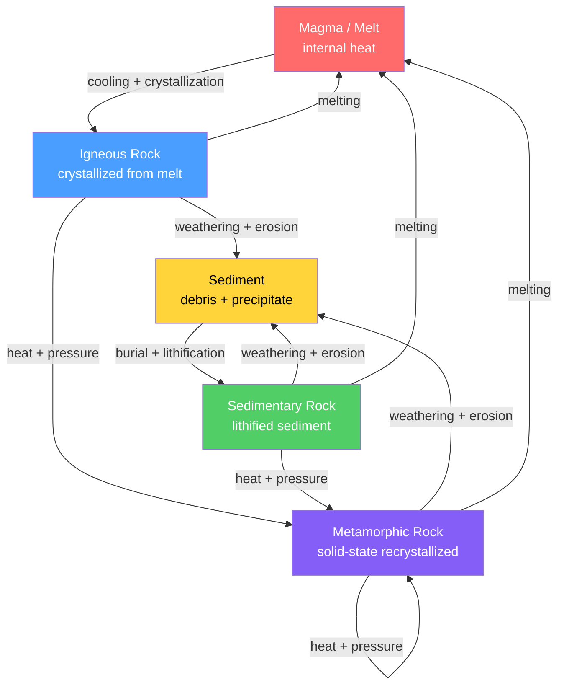

# 🔄 The Rock Cycle

> [!abstract] TL;DR
> The rock cycle is Earth's grand recycling system: the continual transformation of three rock families — **igneous** (crystallized from melt), **sedimentary** (weathered debris or precipitates, lithified), and **metamorphic** (solid-state recrystallization under heat and pressure) — into one another. It is powered from two directions: **internal heat** drives melting, metamorphism, and uplift, while **solar energy plus gravity** drive weathering, erosion, transport, and deposition. Plate tectonics organizes the whole engine. Crucially, the cycle is *not* a fixed sequence — any rock can follow multiple pathways (e.g., metamorphic → sediment without ever melting). James Hutton's recognition of this endless recycling gave us **deep time**: "no vestige of a beginning, no prospect of an end."

## Intuition — analogy FIRST

Think of a language whose only alphabet is dirt, crystal, and squeezed stone — and every word is constantly being erased and rewritten. A granite cliff is not a permanent object; it is a *temporary configuration of atoms* passing through. Rain and frost crumble it into sand, rivers carry the sand to a delta, burial cements it into sandstone, a colliding continent bakes and squeezes it into gneiss, and a subduction zone finally melts it back into magma that rises to crystallize as new granite. Nothing is created or destroyed — only rearranged. The atoms in the granite of your countertop have very likely been igneous, sedimentary, *and* metamorphic several times over Earth's 4.5-billion-year history.

The single most important idea: **the rock cycle is a loop with shortcuts, not a conveyor belt.** There is no mandatory order.

---

## How It Works



The arrows show that **every family can reach every other family** — directly or through the sediment reservoir. Melting is only *one* of many exits; a metamorphic rock uplifted and weathered becomes sediment without ever seeing magma.

### Secondary Level

**The three rock families**

| Family | Origin | Energy source | Diagnostic feature | Examples |
|--------|--------|---------------|--------------------|----------|
| Igneous | Crystallization of magma/lava | Internal heat | Interlocking crystals; no layering | Granite, basalt |
| Sedimentary | Lithified weathered debris or chemical precipitate | Solar + gravity | Layering, fossils, grains | Sandstone, limestone, shale |
| Metamorphic | Solid-state recrystallization | Internal heat + pressure | Foliation, aligned minerals | Gneiss, schist, marble |

**The transforming processes** (see sibling notes [[Igneous_Rocks_and_Classification]], [[Sedimentary_Rocks_and_Environments]], [[Metamorphism_and_Metamorphic_Facies]]):

1. **Melting** → magma (needs heat; deep crust and mantle)
2. **Crystallization** → igneous rock (cooling melt; see [[Magma_Generation_and_Bowens_Series]])
3. **Weathering and erosion** → sediment (surface, powered by Sun and gravity; see [[Weathering_and_Soils]])
4. **Transport and deposition** → sediment moved by water, wind, ice
5. **Burial and lithification** → sedimentary rock (compaction plus cementation)
6. **Metamorphism** → metamorphic rock (heat and pressure below melting)

### Undergraduate Level

**Reservoirs and fluxes.** Model the cycle as a **box model**: each rock family is a *reservoir* of mass $M_i$, connected by *fluxes* $F_{ij}$ (mass per unit time). At steady state, inflow equals outflow for each box, and the mean **residence time** of material in reservoir $i$ is

$$\tau_i = \frac{M_i}{F_{\text{out},i}}$$

where $F_{\text{out},i}$ is the total flux leaving that reservoir.

**Abundances are counterintuitive.** By *volume*, igneous and metamorphic rocks dominate the crust (together roughly $95\%$); sedimentary rocks are only about $5\%$. But by *surface area*, sedimentary rocks blanket roughly $66$–$75\%$ of the continents as a thin veneer (mean cover a few km thick). So the rocks you *see* are mostly sedimentary; the rocks the crust is *made of* are mostly igneous and metamorphic.

| Property | Igneous + Metamorphic | Sedimentary |
|----------|-----------------------|-------------|
| Crustal volume | ~95% | ~5% |
| Continental surface exposure | ~25–34% | ~66–75% |
| Typical residence time | $10^8$–$10^9$ yr | $10^7$–$10^8$ yr (recycled fast) |

**Plate tectonics is the engine.** Divergent boundaries generate new igneous crust (mid-ocean ridges); convergent boundaries drive subduction, arc magmatism, and regional metamorphism; uplift at collision zones exposes rock to weathering. Mantle convection is the ultimate organizer — see [[Mantle_Convection_and_Hotspots]] and [[Subduction_Zones_and_Mountain_Building]].

**Thermodynamic framing.** The cycle never violates energy conservation. It is driven by two energy gradients maintained far from equilibrium: Earth's internal heat (radiogenic + primordial, ~47 TW globally) and the vastly larger solar flux (~$1.7\times10^{17}$ W) that powers the hydrologic cycle. Gravity supplies the downhill "fall" of eroded sediment. Because these sources continually re-supply free energy, the cycle can run indefinitely without contradicting the [[Laws_of_Thermodynamics|second law]] — entropy of the whole (Earth plus Sun plus space) still increases.

### Graduate Level

**Coupled mass-flux system.** Write the reservoir masses as a vector $\mathbf{M} = (M_I, M_S, M_M)$ and the fluxes as a matrix. Non-steady-state behavior obeys

$$\frac{d M_i}{dt} = \sum_{j \neq i} F_{ji} - \sum_{j \neq i} F_{ij}$$

Over Earth history the system is **not** perfectly steady: the continental crust has *grown* (net transfer of mantle-derived melt into crust), so the boundary conditions drift on Gyr timescales.

**The sedimentary-recycling problem.** The present sedimentary mass is far too small, and its mean age far too young, for sediments to have accumulated monotonically since 4 Ga. Resolution: the sedimentary reservoir is repeatedly **cannibalized** — old sediment is uplifted, re-weathered, or subducted and returned, so the same atoms are recycled many times. Mass-age distributions (Garrels & Mackenzie; Veizer & Jansen) show sediment survival is roughly exponential with a "half-mass age" of only a few hundred Myr. This recycling must be *subtracted* when inferring crustal growth curves from the sedimentary record.

**Crustal growth over Earth history.** Combining the rock cycle with isotopic ages (U-Pb zircon, Nd/Hf model ages) constrains whether continental crust grew *episodically* (pulses tied to supercontinent assembly) or *continuously*. The rock cycle is the machinery that both *creates* juvenile crust (arc magmatism) and *destroys* it (sediment subduction, delamination), so the observed crustal volume is the integral of a small difference between two large fluxes.

```python
import numpy as np

# Rock cycle as a Markov chain over three states.
# States: 0 = Igneous, 1 = Sedimentary, 2 = Metamorphic.
labels = ["Igneous", "Sedimentary", "Metamorphic"]

# Row-stochastic transition matrix: P[i, j] = P(next = j | now = i)
# over one time step (~100 Myr). Illustrative values, not calibrated field data.
# A rock that melts and re-crystallizes returns to the Igneous state.
P = np.array([
    # to:  Ign    Sed    Met
    [0.80, 0.12, 0.08],   # from Igneous:     mostly persists; some erodes / metamorphoses
    [0.10, 0.75, 0.15],   # from Sedimentary:  recycles fastest of the three
    [0.15, 0.10, 0.75],   # from Metamorphic:  can melt back to igneous or erode
])
assert np.allclose(P.sum(axis=1), 1.0), "each row must sum to 1"

# --- Steady-state distribution: left eigenvector of P with eigenvalue 1 ---
vals, vecs = np.linalg.eig(P.T)
idx = np.argmin(np.abs(vals - 1.0))
pi = np.real(vecs[:, idx])
pi = pi / pi.sum()

print("Steady-state rock-type fractions:")
for name, p in zip(labels, pi):
    print(f"  {name:12s}: {p:6.1%}")

# --- Expected residence time in each state ---
# For a geometric holding time, E[steps before leaving] = 1 / (1 - P_ii)
step_Myr = 100
print("\nMean residence time before transformation:")
for k, name in enumerate(labels):
    steps = 1.0 / (1.0 - P[k, k])
    print(f"  {name:12s}: {steps:4.1f} steps  (~{steps * step_Myr:4.0f} Myr)")

# --- Cross-check: iterate an arbitrary starting mix toward steady state ---
x = np.array([1.0, 0.0, 0.0])  # start as 100% igneous
for _ in range(500):
    x = x @ P
print("\nIterated distribution after 500 steps:", np.round(x, 3))
# Converges to pi regardless of the starting mix — the cycle "forgets" its origin.
```

---

## Real-World Notes

- **Siccar Point, Scotland** — the unconformity where James Hutton (1788) saw near-vertical Silurian greywacke truncated by gently dipping Devonian sandstone. The gap represented tens of millions of years of an entire cycle: deposition, lithification, tilting, uplift, erosion, then renewed deposition. It gave Hutton the concept of **deep time**.
- **Himalaya** — active demonstration of the full loop: continental collision drives metamorphism and melting at depth, uplift exposes rock, monsoon weathering strips it, and the Ganges–Brahmaputra carry ~1 billion tonnes of sediment per year to the Bengal Fan, the largest sediment body on Earth.
- **Mid-ocean ridges** — the planet's dominant igneous factory: seafloor spreading crystallizes basaltic crust continuously (see [[Seafloor_Spreading_and_Ocean_Basins]]), which is later subducted, dewatered, and partly re-melted at arcs.
- **The White Cliffs of Dover** — chalk (biochemical limestone) built from coccolithophore plates: the rock cycle routed through *biology*, converting atmospheric CO$_2$ and seawater Ca into solid rock.
- **Subducting sediment** — sediment scraped off or dragged down at trenches carries water and carbon into the mantle, feeding arc volcanism and long-term climate regulation, and closing the loop back to magma.
- **Metamorphic → sedimentary shortcut** — the Appalachian schists and gneisses now shed sediment directly into the Atlantic margin without any melting, a concrete case of the cycle skipping the "magma" node.

---

## Common Pitfalls

1. **Treating the cycle as a fixed sequence.** There is no mandatory order igneous → sedimentary → metamorphic → igneous. Any rock can go to any other family; the sediment reservoir is a hub, and metamorphic rock can erode straight to sediment.
2. **Confusing melting with metamorphism.** Metamorphism is *solid-state* recrystallization *below* the melting point. Once the rock melts, it leaves the metamorphic path and enters the magma reservoir; the products are igneous, not metamorphic.
3. **Assuming sedimentary rocks are abundant by volume.** They dominate *surface area* but are only ~5% of crustal *volume* — a thin skin over an igneous/metamorphic basement.
4. **Ignoring the two separate energy sources.** Surface processes (weathering, transport) run on solar energy and gravity; deep processes (melting, metamorphism, uplift) run on internal heat. Attributing everything to "plate tectonics" hides the solar half of the engine.
5. **Reading the sedimentary record as complete.** Because sediment is continually recycled and subducted, the preserved record is a small, biased survivor of a much larger throughput — the sedimentary-recycling problem.
6. **Thinking the cycle "reaches equilibrium."** It runs *because* Earth is far from equilibrium, continuously fed by internal and solar energy; a truly equilibrated planet would have no rock cycle at all.

---

## Related Concepts

- [[_MOC_Rocks_Petrology|↑ Section MOC]]
- [[Magma_Generation_and_Bowens_Series]] — how melts form and the crystallization order that builds igneous rock
- [[Igneous_Rocks_and_Classification]] — the "crystallized from melt" node in detail
- [[Volcanism_and_Volcanic_Hazards]] — magma reaching the surface, the fastest branch of the cycle
- [[Sedimentary_Rocks_and_Environments]] — the debris-and-precipitate node and its depositional settings
- [[Metamorphism_and_Metamorphic_Facies]] — solid-state recrystallization and P–T conditions
- [[Economic_Geology_and_Resources]] — how cycle processes concentrate ores and hydrocarbons
- [[What_Is_a_Mineral]] — the building blocks that make up every rock family
- [[Weathering_and_Soils]] — the surface breakdown that feeds the sediment reservoir
- [[Geologic_Time_Scale]] — deep time, the temporal canvas Hutton's cycle revealed
- [[Mantle_Convection_and_Hotspots]] — the internal-heat engine that drives melting and uplift
- [[Laws_of_Thermodynamics]] — energy sources and the entropy framing of a self-sustaining cycle (Physics vault)
- [[_MOC_Mathematics_Master]] — Markov chains and steady-state eigenvector methods used in the demo (Mathematics vault)

---

## Review Questions

1. **Secondary**: Name the three rock families and the single process that converts each *into* sediment. Explain why sedimentary rocks cover most of the land surface yet form only a small fraction of the crust's volume.
2. **Undergraduate**: A sedimentary reservoir holds $M = 2.4\times10^{18}$ t and loses mass at $F = 1\times10^{10}$ t/yr through erosion, subduction, and metamorphism. Compute the mean residence time $\tau = M/F$. Why is this far shorter than the age of the crust, and what does that imply about recycling?
3. **Graduate**: Explain the sedimentary-recycling problem. Why can't the present sedimentary mass and age distribution be produced by monotonic accumulation since 4 Ga, and how must recycling be treated when inferring continental crustal growth curves from the rock record?

---

## Sources

- Hutton, J. (1788) — "Theory of the Earth," *Transactions of the Royal Society of Edinburgh*
- Lyell, C. — *Principles of Geology* (1830–33), the systematic case for uniformitarianism
- Garrels, R. M. & Mackenzie, F. T. — *Evolution of Sedimentary Rocks* (1971)
- Veizer, J. & Jansen, S. L. (1985) — "Basement and Sedimentary Recycling," *Journal of Geology*
- Marshak, S. — *Earth: Portrait of a Planet*, chapters on the rock cycle and petrology
- Grotzinger & Jordan — *Understanding Earth*, 7th ed.

---

#earth-science #petrology #rock-cycle #igneous #sedimentary #metamorphic #deep-time #plate-tectonics #secondary #undergraduate #graduate
