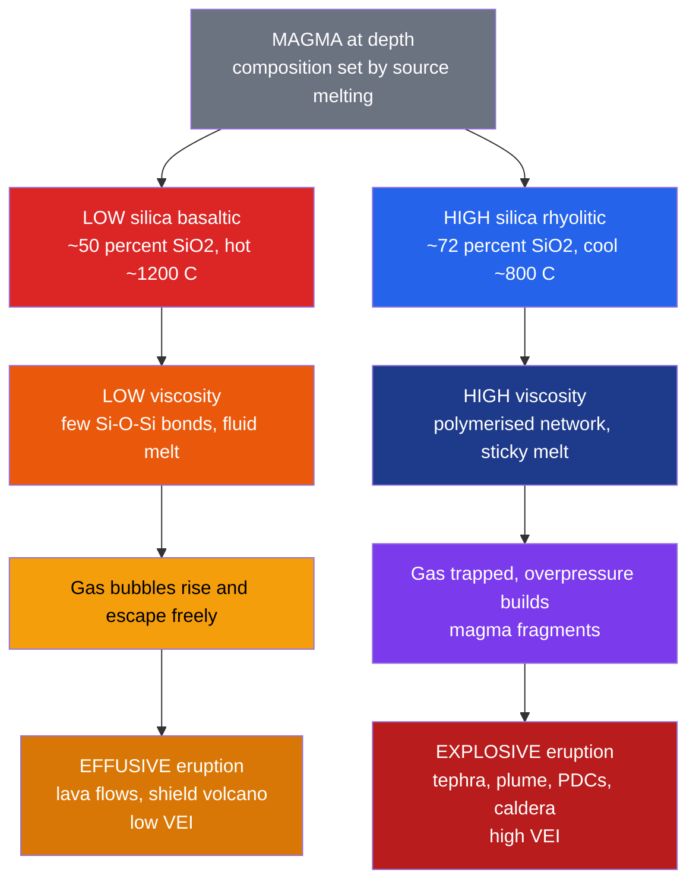

# 🌋 Volcanism and Volcanic Hazards

> [!abstract] TL;DR
> A volcano's whole personality — a gentle river of lava versus a continent-scaling blast — is set by **how sticky its magma is and how much gas it holds**, and both are controlled by **silica content and temperature** ([[Magma_Generation_and_Bowens_Series]]). Low-silica, hot **basaltic** magma is fluid, lets gas bubble out, and erupts **effusively** to build broad shield volcanoes (Hawaii, Iceland). High-silica, cool **rhyolitic** magma is viscous, **traps its gas** until overpressure shatters it, and erupts **explosively** to build steep stratovolcanoes and collapse **calderas** (the Ring of Fire; Yellowstone, Toba). Eruptions are ranked on the **Volcanic Explosivity Index (VEI)**, a *logarithmic* scale of erupted tephra volume where each step is roughly a tenfold jump. The deadliest hazards are rarely the lava — they are **pyroclastic density currents, lahars, tephra fall, volcanic gases, and tsunamis** — and the largest eruptions perturb global **climate**.

## Intuition — analogy FIRST

Shake a warm bottle of **thin soda water** and crack the cap: the gas fizzes off quickly and nothing much happens. Now shake a bottle of **thick, cold syrup** charged with the same gas and open it — the gas cannot escape the goo, pressure builds behind the sticky plug, and it erupts violently. **Magma is the syrup, dissolved water and $\text{CO}_2$ are the fizz.** Runny basalt lets its gas slip away and oozes out as lava; stiff rhyolite bottles the gas up until it fragments the magma into a blast of ash and pumice.

The second key idea is **decompression**. Gas stays dissolved under the enormous pressure at depth, exactly like $\text{CO}_2$ in a sealed bottle. As magma rises the pressure drops, the gas comes *out of solution* into bubbles, and the magma inflates — the whole eruption is a race between bubbles trying to escape and viscosity refusing to let them.

---

## How It Works



---

## Key Concepts / Details

### Secondary Level

**The master switch is viscosity plus gas.** Whether a volcano oozes or explodes comes down to how easily gas can leave the magma. Two ingredients set this: **silica content** (more silica makes magma stickier and cooler) and **temperature** (hotter magma is runnier).

| Volcano type | Magma | Slopes | Style | Example |
|--------------|-------|--------|-------|---------|
| **Shield** | Basaltic (low silica) | Gentle, $2$–$10°$ | Effusive lava | Mauna Loa, Kilauea, Iceland |
| **Stratovolcano** (composite) | Andesitic–dacitic | Steep, $\sim30°$ | Alternating lava + explosive | Fuji, St. Helens, Vesuvius |
| **Cinder / scoria cone** | Basaltic | Steep, small | Short Strombolian burst | Parícutin |
| **Lava dome** | Rhyolitic–dacitic | Bulbous plug | Viscous extrusion + collapse | St. Helens dome, Chaitén |
| **Caldera** (supervolcano) | Rhyolitic | Collapse basin | Cataclysmic, then subsides | Yellowstone, Toba, Krakatau |

**Eruptive products.** *Lava* comes as smooth ropy **pāhoehoe**, rubbly **ʻaʻā**, or bulbous **pillow lava** erupted underwater. *Tephra* (fragmented material) is sorted by size: **ash** ($<2$ mm), **lapilli** ($2$–$64$ mm), and **blocks and bombs** ($>64$ mm).

**The deadliest hazards are usually not the lava** (which you can mostly walk away from):
- **Pyroclastic density currents (PDCs)** — ground-hugging avalanches of hot gas and ash moving $>100$ km/h; buried Pompeii and destroyed St. Pierre.
- **Lahars** — volcanic mudflows of ash + water that surge down valleys; Nevado del Ruiz buried Armero in 1985.
- **Tephra fall** — ash collapses roofs, chokes engines, and ruins crops.
- **Volcanic gases** — $\text{SO}_2$, $\text{CO}_2$, $\text{HF}$; dense $\text{CO}_2$ suffocated $\sim1{,}700$ people at Lake Nyos in 1986.
- **Tsunamis** — flank collapse or caldera formation displaces water; Krakatau (1883) killed $\sim36{,}000$.

Most of these cluster along the **Ring of Fire**, the subduction arcs circling the Pacific ([[Subduction_Zones_and_Mountain_Building]]). Eruption size is ranked by the **Volcanic Explosivity Index (VEI)**, from $0$ (gentle Hawaiian) to $8$ (supereruption).

### Undergraduate Level

**Why silica controls viscosity.** Silicate melts are built from $\text{SiO}_4$ tetrahedra. In silica-rich melts these polymerise into a rigid three-dimensional network linked by **bridging oxygens** ($\text{Si–O–Si}$), so the melt resists flow. Basalt is silica-poor and depolymerised; rhyolite is silica-rich and highly polymerised. Viscosity spans **ten orders of magnitude**:

| Magma | $\text{SiO}_2$ (wt %) | Temp (°C) | Viscosity (Pa·s) | Style |
|-------|--------------|-----------|------------------|-------|
| Basaltic | $45$–$52$ | $1100$–$1200$ | $10^{1}$–$10^{2}$ | Effusive |
| Andesitic | $52$–$63$ | $900$–$1000$ | $10^{3}$–$10^{5}$ | Mixed |
| Rhyolitic | $68$–$77$ | $700$–$900$ | $10^{6}$–$10^{11}$ | Explosive |

Temperature matters too: viscosity falls roughly exponentially with $T$ (Arrhenius form $\eta \propto e^{E_a/RT}$), so a hotter basalt is far runnier than a cool rhyolite of the same composition. Dissolved water **depolymerises** the melt and lowers viscosity, which is why hydrous arc magmas can still fragment violently once that water exsolves.

**Volatile solubility and fragmentation.** Water solubility in melt scales roughly as $C \propto \sqrt{P}$ (Henry's law for a diatomic-dissolving species), so ascent and depressurisation force **exsolution** into bubbles. Bubbles nucleate, grow, and coalesce; if they cannot escape the viscous melt fast enough, the gas volume fraction climbs until the magma **fragments** into pyroclasts. This fragmentation front is the boundary between a coherent liquid and a gas-plus-particle spray blasting up the conduit.

**The VEI is logarithmic.** Newhall & Self (1982) defined VEI from erupted tephra volume and plume height. Above VEI 2 each unit is a **tenfold** increase in volume — thresholds are $V \gtrsim 10^{\,\text{VEI}+4}\ \text{m}^3$:

| VEI | Erupted tephra | Plume | Example |
|-----|----------------|-------|---------|
| 0–1 | $<10^{6}\ \text{m}^3$ | $<1$ km | Kilauea (effusive) |
| 3 | $>10^{7}\ \text{m}^3$ | $3$–$15$ km | Nevado del Ruiz 1985 |
| 4 | $>10^{8}\ \text{m}^3$ | $10$–$25$ km | Eyjafjallajökull 2010; Pelée 1902 |
| 5 | $>10^{9}\ \text{m}^3$ | $>25$ km | Mt. St. Helens 1980; Vesuvius 79 CE |
| 6 | $>10^{10}\ \text{m}^3$ | $>25$ km | Pinatubo 1991; Krakatau 1883 |
| 7 | $>10^{11}\ \text{m}^3$ | $>25$ km | Tambora 1815; Santorini (Minoan) |
| 8 | $>10^{12}\ \text{m}^3$ | $>25$ km | Toba $\sim74$ ka; Yellowstone |

**Tectonic setting sets the composition** (three melting mechanisms, see [[Magma_Generation_and_Bowens_Series]]):

| Setting | Melting mechanism | Magma | Typical style |
|---------|-------------------|-------|---------------|
| **Divergent** (ridges, rifts) | Decompression of dry mantle | Basalt | Effusive |
| **Convergent** (subduction arcs) | Flux melting by slab water | Andesite–dacite | Explosive |
| **Hotspot / intraplate** | Decompression in a plume | Basalt (LIPs) | Effusive to flood |

**Monitoring.** Precursors are read from **seismicity** (swarms of volcano-tectonic quakes, long-period events, and **harmonic tremor** as magma and gas move, see [[Seismology_and_Earthquakes]]); **ground deformation** (tiltmeters, GPS, and satellite **InSAR** detecting inflation of the edifice); and **gas emissions** (rising $\text{SO}_2$ flux and changing $\text{CO}_2/\text{SO}_2$ ratios).

### Graduate Level

**Magma ascent and fragmentation dynamics.** In the conduit, ascent velocity, decompression rate, bubble nucleation density, and bubble growth (diffusion- versus decompression-limited) together set whether gas can outrun the melt. Fragmentation occurs by one of two criteria: a **gas volume fraction threshold** ($\phi \approx 0.7$–$0.83$, when bubble walls thin to failure) or a **brittle (strain-rate) criterion** — when the deformation timescale is shorter than the melt's structural relaxation time, i.e. the **Deborah number** $De = \tau_{relax}/\tau_{flow} \gtrsim 10^{-2}$, the melt behaves as a solid and shatters. Above the fragmentation level, conduit flow is often **choked** at the sound speed of the bubbly mixture.

**Eruption column: plume versus collapse.** The gas-thrust region decelerates, then the hot mixture entrains and heats cold air. If enough air is entrained, the mixture becomes **buoyant** and rises as a convective **Plinian plume**; column height scales weakly with mass eruption rate, $H \propto Q^{1/4}$ (Morton–Taylor–Turner buoyant-plume theory), so raising the eruption rate $10{,}000\times$ only doubles column height. If the mixture stays **denser** than air — from high mass flux, low gas content, or a wide vent — the column **collapses** into fountain-fed **pyroclastic density currents**. The plume-versus-collapse bifurcation is the single most important control on whether a large eruption rains ash downwind or annihilates the surrounding landscape.

**Climate and mass extinction.** It is the **sulfur**, not the ash, that alters climate: stratospheric $\text{SO}_2$ converts to sulfate aerosols that reflect sunlight, with a $\sim1$–$3$ year residence time. Tambora (1815) produced the **"Year Without a Summer"** (1816); Pinatubo (1991) cooled global mean surface temperature by $\sim0.5$°C for over a year. On geologic timescales, **flood-basalt Large Igneous Provinces** (Siberian Traps, Deccan Traps) inject $\text{CO}_2$ and $\text{SO}_2$ over millennia and are tied to major **mass extinctions** ([[Mass_Extinctions_and_Paleoclimate]], [[Mantle_Convection_and_Hotspots]]).

```python
import numpy as np
import matplotlib.pyplot as plt

# The VEI is a LOGARITHMIC scale: above VEI 2, each unit is ~10x more tephra.
# Threshold volume in cubic metres:  V(VEI) ~ 10**(VEI + 4)  for VEI >= 2
# (VEI 8 -> 1e12 m^3 = 1000 km^3). Divide by 1e9 to get km^3.
vei = np.arange(0, 9)
volume_km3 = 10.0 ** (vei + 4) / 1e9        # model threshold volume, km^3

# Famous eruptions: (name, VEI, approx erupted bulk volume in km^3)
events = [
    ("Kilauea (typical)", 1, 0.001),
    ("Mt St Helens 1980", 5, 1.0),
    ("Pinatubo 1991",     6, 10.0),
    ("Tambora 1815",      7, 160.0),
    ("Toba ~74 ka",       8, 2800.0),
]

plt.figure(figsize=(8, 5))
plt.semilogy(vei, volume_km3, "o-", color="grey",
             label="VEI threshold (x10 per step)")
for name, v, vol in events:
    plt.scatter([v], [vol], zorder=5)
    plt.annotate(name, (v, vol), textcoords="offset points", xytext=(6, 4))

plt.xlabel("Volcanic Explosivity Index (VEI)")
plt.ylabel("Erupted tephra volume (km^3, log scale)")
plt.title("The VEI is logarithmic: each unit ~ 10x more tephra")
plt.grid(True, which="both", alpha=0.3)
plt.legend()
plt.tight_layout()

# Tambora (VEI 7) erupted ~1e5 times more tephra than a small Kilauea
# lava fountain (VEI 1) -- five orders of magnitude on a single index.
print("Volume ratio Tambora / Kilauea =", 160.0 / 0.001, "(~1e5)")
```

---

## Real-World Notes

- **Kilauea & Mauna Loa (Hawaii)** — end-member effusive basaltic volcanism over a hotspot; fluid pāhoehoe/ʻaʻā flows, lava lakes, and fire fountains with very low VEI. Property is lost, but the low viscosity lets gas escape, so blasts are rare.
- **Mount St. Helens (1980)** — a dacitic stratovolcano whose bulging cryptodome triggered a **lateral blast and sector collapse** (the largest landslide in recorded history), a VEI 5 Plinian column, and devastating PDCs and lahars.
- **Pinatubo (1991)** — a VEI 6 arc eruption on the Ring of Fire; a **monitoring and forecasting triumph** (seismicity + tilt + $\text{SO}_2$) that evacuated tens of thousands before the climax. Its $\sim20$ Mt of $\text{SO}_2$ cooled the planet $\sim0.5$°C.
- **Tambora (1815)** — the largest historic eruption (VEI 7, $\sim160\ \text{km}^3$); its sulfate veil caused the **"Year Without a Summer"** with crop failures across the Northern Hemisphere.
- **Nevado del Ruiz (1985)** — a modest VEI 3 eruption whose summit ice melted into a **lahar** that killed $\sim23{,}000$ people in Armero — proof that hazard is not the same as eruption size.
- **Laki fissure (Iceland, 1783)** — a basaltic **flood-basalt-style** fissure eruption whose $\text{SO}_2$ and fluorine haze poisoned livestock, caused famine, and disrupted European climate — effusive volume, catastrophic gas.

---

## Common Pitfalls

1. **"Bigger eruptions are the deadliest."** No — hazard depends on the *phenomenon* and exposure. A small VEI 3 lahar (Nevado del Ruiz) killed far more people than many VEI 5–6 eruptions in remote areas.
2. **"Explosive eruptions happen because the magma is hotter."** The opposite. Explosivity comes from **high viscosity and trapped gas** in *cooler*, silica-rich magma; hot fluid basalt lets gas escape and erupts gently.
3. **"Lava flows are the main killer."** Lava is usually slow enough to outrun. The real killers are **pyroclastic density currents, lahars, gas, and tsunamis**, which move fast and far.
4. **"The VEI is a linear scale."** It is **logarithmic** — a VEI 6 erupts roughly $10\times$ the tephra of a VEI 5 and $\sim100{,}000\times$ that of a VEI 1.
5. **"Ash cools the climate."** It is the **sulfate aerosols** from $\text{SO}_2$ that reflect sunlight; ash settles out within days to weeks, while stratospheric sulfate lingers for years.
6. **"Supervolcanoes are overdue and predictable."** Recurrence intervals are statistical, not scheduled; "overdue" is a misuse of long-term averages, and calderas can go dormant for hundreds of thousands of years.

---

## Related Concepts

- [[_MOC_Rocks_Petrology|↑ Section MOC]]
- [[Magma_Generation_and_Bowens_Series]] — where the magma (and its silica content) comes from; the master control on eruption style
- [[Igneous_Rocks_and_Classification]] — the solidified products: basalt, andesite, rhyolite, pumice, and tuff
- [[The_Rock_Cycle]] — volcanism as the surface expression of the igneous limb of the cycle
- [[Sedimentary_Rocks_and_Environments]] — reworked tephra and volcaniclastic sediments
- [[Metamorphism_and_Metamorphic_Facies]] — contact metamorphism and hydrothermal alteration around magma bodies
- [[Economic_Geology_and_Resources]] — geothermal energy and volcanic-hosted ore and mineral deposits
- [[Subduction_Zones_and_Mountain_Building]] — flux melting builds the explosive arcs of the Ring of Fire
- [[Mantle_Convection_and_Hotspots]] — plume heads erupt flood basalts (LIPs); plume tails feed hotspot chains
- [[Mass_Extinctions_and_Paleoclimate]] — large-igneous-province volcanism and climate forcing across deep time
- [[Seismology_and_Earthquakes]] — volcanic tremor and quakes as eruption precursors
- **Mathematics** — [[_MOC_Mathematics_Master]] — logarithms behind the VEI and the fluid dynamics of eruption columns

---

## Review Questions

1. **Secondary**: Explain why Hawaiian volcanoes erupt gently as rivers of lava while Ring-of-Fire volcanoes like Mount St. Helens explode. Which two magma properties make the difference, and what sets them?
2. **Undergraduate**: Pinatubo (VEI 6) erupted $\sim10\ \text{km}^3$ and Mount St. Helens (VEI 5) $\sim1\ \text{km}^3$. Using the rule that each VEI unit is a tenfold volume change, roughly how much tephra would a VEI 8 supereruption produce, and why does that make VEI a logarithmic scale? Separately, explain how decompression during ascent turns dissolved gas into an explosive driver.
3. **Graduate**: Describe the plume-versus-collapse bifurcation of an eruption column. What determines whether the column rises buoyantly or collapses into pyroclastic density currents, and why does column height scale only weakly ($H \propto Q^{1/4}$) with mass eruption rate?

---

## Sources

- Newhall, C. G. & Self, S. (1982) — "The Volcanic Explosivity Index (VEI)," *J. Geophys. Res.* 87, 1231.
- Sparks, R. S. J. et al. (1997) — *Volcanic Plumes* (Wiley).
- Gonnermann, H. M. & Manga, M. (2007) — "The Fluid Mechanics Inside a Volcano," *Annu. Rev. Fluid Mech.* 39, 321.
- Francis, P. & Oppenheimer, C. — *Volcanoes*, 2nd ed. (Oxford).
- Robock, A. (2000) — "Volcanic Eruptions and Climate," *Rev. Geophys.* 38, 191.
- Global Volcanism Program — Smithsonian Institution (volcano database and VEI catalogue).

#earth-science #petrology #volcanology #eruption-style #magma-viscosity #VEI #pyroclastic-flows #volcanic-hazards #secondary #undergraduate #graduate
