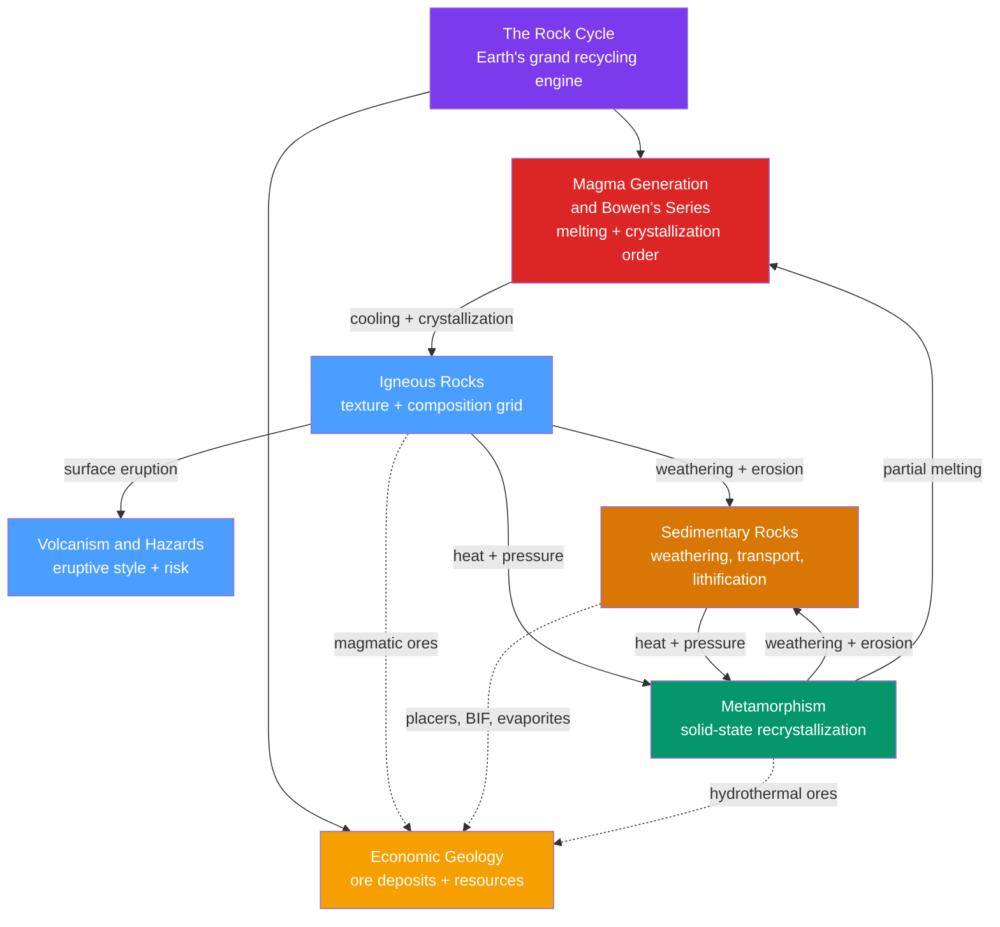

# 🪨 Rocks & Petrology — Map of Content

> [!abstract] What This Section Covers
> Petrology is the study of rocks — how they form, what they are made of, and how they turn into one another. This section is organized around the **rock cycle**, Earth's grand recycling engine, and the three rock families it connects: **igneous** (crystallized from melt), **sedimentary** (weathered debris and precipitates, lithified at the surface), and **metamorphic** (solid-state recrystallization under heat and pressure). It runs from why the mantle melts and the ordered sequence in which minerals crystallize (Bowen's series), through the texture-and-composition grid that names every igneous rock and the eruptive styles and hazards of volcanoes, to the clastic-chemical-biochemical pathways that build the sedimentary archive and the pressure-temperature facies that fingerprint metamorphic rocks — closing with **economic geology**, the study of how these same processes concentrate the metals, fuels, and critical minerals civilization runs on. Every note opens with an everyday analogy and deepens to graduate-level petrology.

## Concept Map

*(Purple = framework, red = melting, blue = igneous, orange = sedimentary, green = metamorphic, gold = resources; solid arrows = rock-cycle transformations, dashed arrows = ore-forming links.)*

## Learning Path

1. [[The_Rock_Cycle]] — Start here: the framework that connects all three rock families and every other note in this section.
2. [[Magma_Generation_and_Bowens_Series]] — Why and how rocks melt, and the ordered temperature sequence in which minerals crystallize from cooling magma.
3. [[Igneous_Rocks_and_Classification]] — Reading the two dials — texture and composition — that name every rock born from magma or lava.
4. [[Volcanism_and_Volcanic_Hazards]] — What happens when magma reaches the surface: eruptive styles, the VEI, and the hazards that follow.
5. [[Sedimentary_Rocks_and_Environments]] — The surface pathway: weathering, transport, deposition, and lithification into Earth's rock archive.
6. [[Metamorphism_and_Metamorphic_Facies]] — Solid-state transformation under heat and pressure, with grade, index minerals, and facies as tectonic fingerprints.
7. [[Economic_Geology_and_Resources]] — How all of the above concentrate metals, fuels, and critical minerals into deposits worth mining.

## All Notes at a Glance

| Note | Difficulty | What You'll Learn |
|------|------------|-------------------|
| [[The_Rock_Cycle]] | Secondary → Graduate | The three rock families and their transformation pathways; internal heat vs. solar-plus-gravity drivers; plate tectonics as the engine; Hutton and deep time |
| [[Magma_Generation_and_Bowens_Series]] | Secondary → Graduate | Decompression, flux, and heat-addition melting; silica, polymerization, and viscosity; Bowen's continuous and discontinuous branches; fractional crystallization |
| [[Igneous_Rocks_and_Classification]] | Secondary → Graduate | Texture from cooling rate and composition from silica content; intrusive vs. extrusive; felsic to ultramafic; the QAPF and TAS classification schemes |
| [[Volcanism_and_Volcanic_Hazards]] | Secondary → Graduate | Effusive vs. explosive eruptions; volcano types and calderas; the Volcanic Explosivity Index; pyroclastic flows, lahars, tephra, gases, and climate impact |
| [[Sedimentary_Rocks_and_Environments]] | Secondary → Graduate | Clastic, chemical, and biochemical classes; the Wentworth scale; sorting and rounding; sedimentary structures, facies analysis, and sequence stratigraphy |
| [[Metamorphism_and_Metamorphic_Facies]] | Secondary → Graduate | Heat, pressure, stress, and fluids as agents; foliation; metamorphic grade and index minerals; Barrovian zones and pressure-temperature facies |
| [[Economic_Geology_and_Resources]] | Secondary → Graduate | Concentration factor and cut-off grade; magmatic, hydrothermal, sedimentary, and supergene ore families; energy resources and critical metals |

## Key Questions This Section Answers

- If the mantle is hot, why is it almost entirely solid — and what three tricks make rock melt?
- Why does the same magma become coarse granite in one place and glassy obsidian in another?
- What makes one volcano ooze gentle lava while another blows apart in a continent-scale blast?
- How does a geologist run the film backwards from a layer of sandstone to reconstruct an ancient river, beach, or sea?
- How can a rock be baked and squeezed into a completely new texture without ever melting?
- Why is "ore" an economic verdict rather than a mineral, and how do geological processes concentrate rare metals thousands of times?

## Related Sections

- [[_MOC_Earth_Science_Master|↑ Earth Science Master MOC]]
- [[_MOC_Minerals_Crystallography|→ Minerals & Crystallography]] — the mineral building blocks that make up every rock in this section
- [[_MOC_Plate_Tectonics|→ Plate Tectonics & Geodynamics]] — the engine that drives melting, metamorphism, and the rock cycle
- [[_MOC_Geomorphology|→ Surface Processes & Geomorphology]] — weathering and erosion that feed the sedimentary pathway

#MOC #EarthScience #Petrology
