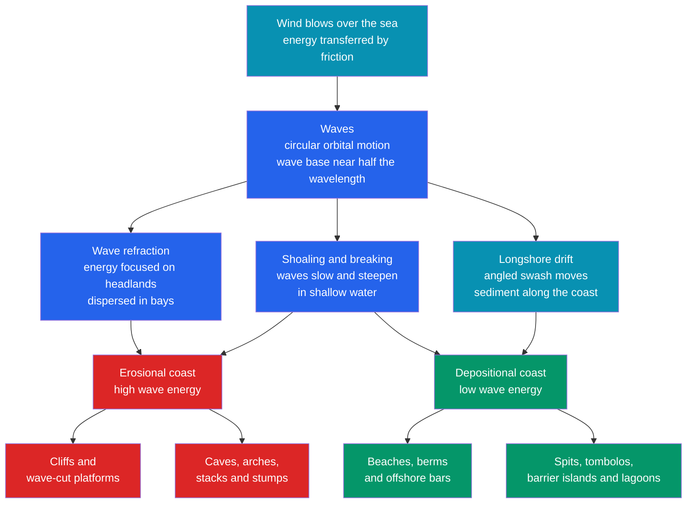

# 🏖️ Coastal Processes and Landforms

> [!abstract] TL;DR
> The coast is Earth's most dynamic boundary — the restless line where land, sea, and air meet and are rebuilt daily. **Waves** are the master energy source: water travels in **orbital circles** that die out below a **wave base** of about half a wavelength; as waves enter shallow water they **shoal**, **refract** (focusing energy on headlands, dispersing it in bays), and **break**. Waves striking the shore at an angle drive **longshore drift**, a conveyor belt of sand. High-energy coasts are *carved* into **cliffs, wave-cut platforms, caves, arches, stacks, and stumps**; low-energy coasts are *built* into **beaches, spits, baymouth bars, tombolos, and barrier islands** whose survival hinges on the **sediment budget**. Over longer spans, **sea-level change** and **tectonics/isostasy** classify coasts as **emergent** (marine terraces) or **submergent** (rias, fjords), while **deltas and estuaries** mark the river–sea interface. The graduate treatment uses **linear (Airy) wave theory** and the **CERC** longshore-transport law, $Q \propto H_b^{5/2}\sin(2\theta_b)$, which peaks near a **45° breaker angle**.

## Intuition — analogy FIRST

Watch a gull resting on the open sea as a swell rolls past. The crest lifts it, then a trough drops it, and after each wave goes by the bird is back almost where it started — it traces a small **circle**, it does not surf toward the beach. This is the single most important fact about waves: **they carry energy, not water**. The wave *form* races shoreward, but the water molecules merely orbit in place. Only when those orbits reach shallow water do they scrape the bottom, topple forward, and finally *break* — hurling their stored energy against the land. Erosion, sand transport, and every coastal landform trace back to that moment of breaking.

Now walk along the beach and watch a single grain of sand. A wave that approaches at an angle rushes its **swash** up the beach *along that same slanted line*, but gravity drags the **backwash** straight back down the steepest path. Repeat this thousands of times and the grain zig-zags steadily *along* the shore — a saw-tooth **conveyor belt of sand** called longshore drift. Build a wall across it and sand piles up on one side and vanishes from the other; that single observation explains half of all coastal-engineering disasters.

---

## How It Works



---

## Key Concepts / Details

### Secondary Level

**Waves are wind made visible.** Wind blowing over water transfers energy by friction, raising waves whose size grows with wind **speed**, **duration**, and **fetch** (open-water distance). Beneath a passing wave, water parcels move in **circular orbits** whose diameter equals the wave height at the surface and shrinks rapidly downward. Below the **wave base** — roughly *half the wavelength* — the water barely moves, which is why submarines and deep divers feel calm beneath a storm.

**Shoaling, breaking, and the surf zone.** As a wave moves into water shallower than the wave base, its orbits touch bottom: the wave slows, its crests crowd together (wavelength shrinks), it steepens, and finally **breaks** when the water depth is about $1.3\times$ the wave height. The turbulent **surf zone** is where nearly all coastal work is done.

**Refraction straightens coastlines.** Waves bend toward shallow water, so their crests wrap around **headlands** — concentrating energy and erosion there — while spreading out and losing energy in **bays**, which become sheltered zones of deposition. Over time this planes headlands back and fills bays, straightening the coast.

**Longshore drift and rip currents.** Waves arriving at an angle push swash obliquely up the beach; backwash returns straight down-slope, so sediment migrates *along* the shore. Water piled against the beach escapes seaward through narrow, fast **rip currents** — the leading cause of beach drownings.

**Tides** are the twice-daily rise and fall caused by the Moon's (and Sun's) gravity plus Earth's rotation. **Spring tides** (largest range) occur at new and full Moon when Sun and Moon align; **neap tides** (smallest range) occur at the quarter Moons when they pull at right angles. Tidal **range** governs how much shore the sea reworks each day.

| Erosional landform | How it forms |
|--------------------|--------------|
| **Wave-cut notch & cliff** | undercutting at the waterline collapses the rock face |
| **Wave-cut platform** | flat bench left as the cliff retreats |
| **Sea cave → arch → stack → stump** | weakness in a headland is progressively cut through, roofed, and beheaded |
| **Headlands & bays** | differential erosion of hard vs soft rock |

### Undergraduate Level

**Wave mechanics, quantified.** For a wave of period $T$, the **deep-water** phase speed and wavelength are

$$C_0 = \frac{gT}{2\pi}, \qquad L_0 = \frac{gT^2}{2\pi}$$

so *longer-period* swells travel faster and reach far deeper (wave base $=L/2$). Water is "deep" when $d > L/2$ and "shallow" when $d < L/20$; in the **shallow-water** limit the speed depends only on depth,

$$C = \sqrt{g d}\,,$$

and is **non-dispersive**. Wave energy scales as $E \propto H^2$, so doubling wave height quadruples the pounding.

**The beach profile breathes with the seasons.** Long, gentle **summer swell** is *constructive*: swash outruns backwash and piles sediment into a wide **berm**. Short, steep **winter storm** waves are *destructive*: backwash dominates, strips the berm, and stores the sand in an offshore **bar**. The beach oscillates between a summer (berm) and winter (bar) equilibrium profile.

**Sediment budget (the littoral cell).** A beach persists only if inputs balance outputs:

| Sources (gains) | Sinks (losses) |
|-----------------|----------------|
| river sediment (dominant), cliff erosion | longshore drift out of the cell |
| longshore drift into the cell | offshore loss down submarine canyons |
| onshore transport, biogenic shell/coral | wind transport into dunes, dredging |

A persistent **deficit** — commonly from dammed rivers or trapping structures — forces the shoreline to retreat.

**Coastal classification** records the vertical dance of land and sea:

| Type | Cause | Diagnostic landforms |
|------|-------|----------------------|
| **Emergent** | land uplift or falling sea level | **marine terraces** (uplifted platforms), raised beaches |
| **Submergent** | rising sea level or subsidence | **rias** (drowned river valleys), **fjords** (drowned glacial troughs) |

The controls are **eustatic** sea-level change (glacial–interglacial swings of ~120 m), **tectonic** uplift/subsidence, and **isostatic** adjustment — see [[Gravity_Isostasy_and_the_Geoid]].

**Deltas and estuaries** are the river–coast interface. Where a river delivers sediment faster than waves and tides can remove it, a **delta** grows; Galloway's scheme classifies them as **river-dominated** (Mississippi bird's-foot), **wave-dominated** (Nile), or **tide-dominated** (Ganges–Brahmaputra). Where marine reworking wins, the drowned river mouth becomes an **estuary** — a sediment sink of mud flats and salt marsh. Both feed the sedimentary record (see [[Sedimentary_Rocks_and_Environments]], [[Rivers_and_Fluvial_Landscapes]]).

### Graduate Level

**Linear (Airy) wave theory** solves potential flow for small-amplitude waves, giving the full **dispersion relation** that spans all depths:

$$\omega^2 = g k \tanh(k d), \qquad C = \frac{gT}{2\pi}\tanh\!\left(\frac{2\pi d}{L}\right)$$

with $k = 2\pi/L$ and $\omega = 2\pi/T$. The limits recover the shortcuts above: $\tanh(kd)\to 1$ (deep, dispersive) and $\tanh(kd)\to kd$ (shallow, $C=\sqrt{gd}$). The **group velocity** that actually transports energy is

$$C_g = \frac{1}{2}\left(1 + \frac{2kd}{\sinh 2kd}\right)C, \qquad E = \tfrac{1}{8}\rho g H^2, \qquad P = E\,C_g .$$

**Shoaling and refraction** follow from conserving the energy flux $P=EC_g$ along a wave ray, so $H = H_0\,K_s\,K_r$ with shoaling coefficient $K_s$ and refraction coefficient $K_r$; ray bending obeys a Snell's law, $\sin\theta / C = \text{const}$ — the same physics as optics (see [[Wave_Motion_and_Properties]]).

**Longshore sediment transport (CERC formula).** The longshore component of wave energy flux at the breaker line drives the drift. Using the shallow-water $C_g=\sqrt{g d_b}$ and a breaker index $d_b = H_b/\gamma_b$,

$$P_{ls} = \frac{\rho\,g^{3/2}}{16\sqrt{\gamma_b}}\;H_b^{5/2}\,\sin(2\theta_b),$$

and the volumetric transport rate is

$$Q = \frac{K\,P_{ls}}{(\rho_s-\rho)\,g\,(1-n)} \;\propto\; H_b^{5/2}\,\sin(2\theta_b).$$

Two lessons fall out: transport rises steeply with **breaking wave height** (the $5/2$ power) and, through $\sin(2\theta_b)$, is **maximised at a breaker angle of $45°$** and vanishes for shore-normal or shore-parallel waves.

**Response to sea-level rise (Bruun rule).** For an equilibrium profile of active width $L_*$, closure depth $h_*$, and berm height $B$, a sea-level rise $S$ translates the profile landward by $R = S\,L_*/(B + h_*)$ — a first-order estimate of shoreline retreat, valid only for sandy, sediment-conserving coasts.

```python
# Deep-water wave properties from period, and shoaling toward the surf zone.
# Airy dispersion:  L = (g T^2 / 2*pi) * tanh(2*pi*d / L),  C = L / T.
import numpy as np

g = 9.81  # m/s^2

def deep_water(T):
    """Deep-water wavelength L0 (m) and phase speed C0 (m/s) from period T (s)."""
    L0 = g * T**2 / (2 * np.pi)
    C0 = g * T / (2 * np.pi)
    return L0, C0

def wavelength_at_depth(T, d, tol=1e-8):
    """Solve the Airy dispersion for local wavelength L at depth d by iteration."""
    L0 = g * T**2 / (2 * np.pi)
    L = L0                                  # start from the deep-water guess
    for _ in range(200):
        L_new = L0 * np.tanh(2 * np.pi * d / L)
        if abs(L_new - L) < tol:
            break
        L = L_new
    return L, L / T                         # local wavelength and phase speed

print("Deep-water swell properties:")
for T in (4, 8, 12, 16):
    L0, C0 = deep_water(T)
    print(f"  T = {T:2d} s -> L0 = {L0:6.1f} m   C0 = {C0:5.1f} m/s   "
          f"wave base = {L0/2:6.1f} m")

print("\nShoaling of an 8 s swell (deep-water L0 = "
      f"{deep_water(8)[0]:.1f} m):")
for d in (100, 40, 20, 10, 5, 2):
    L, C = wavelength_at_depth(8, d)
    regime = "deep" if d > L/2 else ("shallow" if d < L/20 else "intermediate")
    print(f"  depth {d:4d} m -> L = {L:5.1f} m   C = {C:4.1f} m/s   ({regime})")
# As depth falls, L and C shrink (waves slow and bunch up) until the wave
# steepens enough to break, roughly where water depth ~ 1.3 * wave height.
```

---

## Real-World Notes

- **Twelve Apostles, Australia & Old Harry Rocks, England** — textbook **stacks**: refracted waves cut caves through headlands, the caves became arches, and collapsed arch roofs left isolated pillars that the sea keeps whittling to stumps.
- **The Nile Delta is drowning.** Since the Aswan High Dam (1964) trapped the river's silt, the delta's sediment budget flipped to a deficit; the Rosetta and Damietta promontories now retreat metres per year — a live demonstration of a starved [[Rivers_and_Fluvial_Landscapes|fluvial]] supply.
- **Santa Barbara harbour, California** — a breakwater intercepted the eastward littoral drift, so sand piled up updrift while downdrift beaches eroded catastrophically; the port has been mechanically bypassing sand ever since. The classic cautionary tale of interrupting longshore transport.
- **Chesapeake Bay** is a **ria** — the drowned valley of the Susquehanna River flooded by post-glacial sea-level rise — whereas Norway's deep, U-shaped **fjords** are drowned glacial troughs (see [[Glaciers_and_Glacial_Landscapes]]).
- **Barrier islands** such as North Carolina's Outer Banks migrate **landward** as sea level rises, rolling over themselves via storm overwash — which is why hardening them with seawalls tends to destroy the very beach they protect.
- **The Sand Motor, Netherlands** — a 21-million-m³ "mega-nourishment" that lets waves and longshore drift redistribute one big sand deposit over decades, an example of working *with* coastal processes rather than against them.

---

## Common Pitfalls

1. **"Waves push water toward the beach."** In deep water the motion is **orbital** — the wave form advances but the water returns almost to its start (only a tiny net Stokes drift remains). Bulk water transport happens only once waves break.
2. **Reversing the refraction result.** Wave refraction **concentrates** energy on **headlands** (erosion) and **disperses** it in **bays** (deposition). Many students wrongly expect the protruding headland to be the sheltered spot.
3. **Treating "deep" and "shallow" as absolute depths.** They are relative to *wavelength* ($d/L$): a 15 s ocean swell "feels bottom" in over 100 m of water, while a short wind-chop is effectively in deep water at a few metres.
4. **Building structures without a sediment budget.** Groynes and harbour breakwaters trap drift **updrift** and starve beaches **downdrift**; the erosion is simply relocated, not solved.
5. **Believing seawalls save beaches.** A rigid wall **reflects** wave energy, scouring its own base and preventing the beach from adjusting — "coastal squeeze" often destroys the beach fronting the wall.
6. **Misreading "spring" tides as seasonal.** Spring tides occur **twice a month** at new and full Moon (from "to spring forth"); they have nothing to do with the season.

---

## Related Concepts

- [[_MOC_Geomorphology|↑ Section MOC]]
- [[Weathering_and_Soils]] — prepares and supplies the sediment that rivers and cliffs deliver to the coast
- [[Mass_Wasting_and_Slope_Stability]] — cliff failure and coastal landslides are wave-triggered mass movements feeding the beach
- [[Rivers_and_Fluvial_Landscapes]] — the dominant sediment source; deltas and estuaries are the river–sea handoff
- [[Glaciers_and_Glacial_Landscapes]] — carved the troughs later drowned as fjords; ice-age sea-level swings drove emergence/submergence
- [[Deserts_and_Aeolian_Processes]] — the same wind that raises waves builds coastal dunes, a key sediment sink
- [[Groundwater_and_Karst]] — coastal aquifers and the saltwater-intrusion wedge respond to sea-level rise
- [[Sedimentary_Rocks_and_Environments]] — beach, delta, and barrier deposits are the ancient rock record of coasts
- [[Gravity_Isostasy_and_the_Geoid]] — isostatic rebound and subsidence set relative sea level and coastal classification
- **Physics** — [[Wave_Motion_and_Properties]] (dispersion, refraction, energy flux), [[Oscillations_and_SHM]] (the orbital motion of water parcels)
- **Mathematics** — [[_MOC_Mathematics_Master]] (hyperbolic functions of the dispersion relation, energy-flux calculus)

---

## Review Questions

1. **Secondary:** Explain, using the idea of orbital water motion and wave base, why a swimmer floating beyond the surf bobs in place while the wave still "moves." Then describe how the same wave changes as it enters shallow water and finally breaks.
2. **Undergraduate:** A groyne field is built along a beach where the dominant waves approach from the southwest. Sketch where sand accumulates and where it erodes, and use the sediment-budget concept to predict the fate of the beaches immediately downdrift. Why does the deep-water relation $L_0 = gT^2/2\pi$ *not* apply once the waves reach the surf zone?
3. **Graduate:** Starting from the CERC longshore-transport relation $Q \propto H_b^{5/2}\sin(2\theta_b)$, explain (a) why doubling the breaking wave height increases transport by a factor of about $5.7$, and (b) why the drift is maximised near a breaker angle of $45°$ and vanishes at $0°$ and $90°$. How would you combine this with the Bruun rule to forecast a sandy shoreline's response to 0.5 m of sea-level rise?

---

## Sources

- Masselink, Hughes & Knight — *Introduction to Coastal Processes and Geomorphology*, 2nd ed.
- Davidson-Arnott, Bauer & Houser — *Introduction to Coastal Processes and Geomorphology*, 2nd ed.
- Komar — *Beach Processes and Sedimentation*, 2nd ed.
- Bird — *Coastal Geomorphology: An Introduction*, 2nd ed.
- Dean & Dalrymple — *Water Wave Mechanics for Engineers and Scientists*
- U.S. Army Corps of Engineers — *Coastal Engineering Manual* (CERC longshore-transport formula)

#earth-science #geomorphology #coastal #waves #longshore-drift #erosion #deposition #sea-level #secondary #undergraduate #graduate
