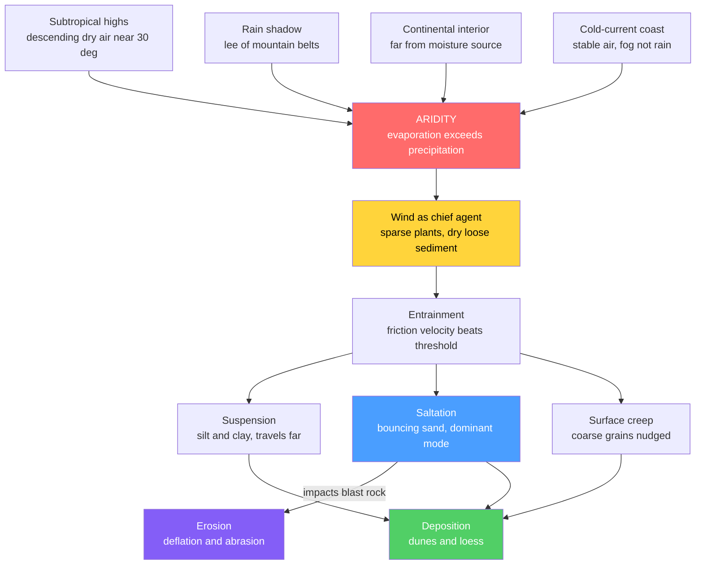

# 🏜️ Deserts and Aeolian Processes

> [!abstract] TL;DR
> A **desert** is defined by *aridity* — potential evaporation exceeds precipitation — not by heat or sand. Deserts cluster where descending dry air of the **subtropical highs** (~30° latitude) suppresses rain, in the **rain shadow** of mountains, deep in **continental interiors**, and along **cold-current coasts**. Because vegetation is sparse and sediment is dry and loose, **wind (aeolian) processes** become geomorphically dominant: grains are entrained above a **threshold friction velocity** and moved by **suspension** (dust), **saltation** (bouncing sand — the workhorse), and **surface creep**. Wind erodes by **deflation** and **abrasion** and deposits **dunes** (barchan, transverse, linear, star, parabolic) and **loess**. Yet the boldest desert landforms — alluvial fans, playas, mesas, inselbergs — are carved by *rare, violent water*. At graduate level the whole system reduces to two laws: the threshold $u_{*t}\propto\sqrt{\tfrac{\rho_s-\rho}{\rho}gd}$ and Bagnold's transport law $q\propto u_*^3$.

## Intuition — analogy FIRST

Imagine sweeping a dusty concrete floor with a leaf blower. Fine flour lifts instantly into a haze that drifts across the whole room and settles far away (**suspension**). Grains of sugar don't fly — they *skip*, hopping downwind in low arcs, and each landing kicks up the next grain in a chain reaction (**saltation**). Marbles never leave the ground; they just get nudged and roll a little (**surface creep**). Turn the blower on a pile of sugar and it slowly marches across the floor, always building a gentle ramp on the blowing side and a sharp cliff on the far side — a **dune** on the move.

The single most important idea: **wind sorts by size.** It can only lift the smallest grains high, it bounces medium sand efficiently, and it barely moves the coarse. That size-selectivity is why one wind builds far-travelled dust blankets, marching sand seas, and stony pavements *all at once*.

---

## How It Works



### Secondary Level

**Why deserts exist.** A desert is *arid*: over a year, potential evaporation exceeds rainfall. Four settings produce that.

| Cause | Mechanism | Examples |
|-------|-----------|----------|
| Subtropical high | Air rises at the equator, dumps rain, and **descends dry** near 30° (Hadley circulation) | Sahara, Arabian, Kalahari, Australian |
| Rain shadow | Mountains force air up on the windward side, wringing out rain; lee air descends dry | Great Basin (Sierra Nevada), Patagonia (Andes) |
| Continental interior | Too far inland for moist ocean air to reach | Gobi, Taklamakan |
| Cold-current coast | A cold current chills coastal air, stabilizes it, and yields fog but almost no rain | Atacama (Humboldt), Namib (Benguela) |

**How wind moves sediment** — three modes sorted by grain size:

| Mode | Grain size | Behavior | Share of load |
|------|-----------|----------|---------------|
| Suspension | Silt and clay (< ~70 µm) | Lifted and carried aloft for hundreds–thousands of km as **dust** | Long-range mass |
| Saltation | Sand (~70–500 µm) | **Bounces** in low arcs; impacts eject the next grain — the dominant transport | ~50–75% |
| Surface creep | Granules (> ~500 µm) | Rolled and pushed along the bed by saltation impacts | ~5–25% |

**Wind erosion.** *Deflation* removes loose fines, leaving behind a one-grain-thick armor of coarse clasts — a **desert pavement** — or scooping shallow hollows called **blowouts**. *Abrasion* is natural sandblasting: it polishes and facets stones into **ventifacts** and streamlines bedrock ridges into **yardangs**, always aligned with the prevailing wind.

**Dunes.** A dune has a gentle **windward (stoss)** slope where sand saltates upward and a steep **slip face** on the lee side. Sand avalanches down the slip face at the **angle of repose** (~34° for dry sand), so the whole dune migrates downwind while internal **cross-bedding** records each avalanche. Five classic shapes depend on how much sand there is and how variable the wind is: **barchan**, **transverse**, **linear (seif)**, **star**, and **parabolic**.

**Loess.** Where suspended silt finally settles it blankets the land as **loess** — porous, vertically-cleaving, and highly **fertile**, forming some of Earth's best farmland (Chinese Loess Plateau, US Midwest).

### Undergraduate Level

**Quantifying aridity.** The UNEP **aridity index** compares precipitation $P$ to potential evapotranspiration (PET):

$$\text{AI} = \frac{P}{\text{PET}}, \qquad \begin{cases} \text{hyperarid} & \text{AI} < 0.05 \\ \text{arid} & 0.05 \le \text{AI} < 0.20 \\ \text{semiarid} & 0.20 \le \text{AI} < 0.50 \end{cases}$$

**The entrainment threshold.** Wind exerts a shear stress on the bed measured by the **friction (shear) velocity** $u_* = \sqrt{\tau_0/\rho}$. Grains move once $u_*$ exceeds a **threshold** $u_{*t}$. Bagnold's cohesionless result balances aerodynamic drag against grain weight:

$$u_{*t} = A\sqrt{\frac{\rho_s - \rho}{\rho}\,g\,d}$$

with $A \approx 0.1$, $\rho_s \approx 2650~\text{kg m}^{-3}$ (quartz), $\rho \approx 1.2~\text{kg m}^{-3}$ (air), and $d$ the grain diameter. Threshold *rises* with $d$ — coarse grains are hard to lift. But for very fine grains cohesion and moisture dominate and threshold *rises again*, giving a **minimum near fine sand (~0.1 mm)**. This is the central paradox: silt and clay are *hard to entrain* yet *travel farthest once airborne*. Bagnold also distinguished the higher **fluid (static) threshold** from the lower **impact (dynamic) threshold** sustained by saltation bombardment.

**Reading dune type as a wind record.** Dune morphology is a proxy for **sand supply** and **wind directional variability**:

| Dune | Sand supply | Wind regime | Diagnostic |
|------|-------------|-------------|------------|
| Barchan | Limited | One dominant direction | Crescent; **horns point downwind** |
| Transverse | Abundant | One dominant direction | Ridges perpendicular to wind |
| Linear / seif | Moderate | Two convergent directions | Long ridges parallel to net wind |
| Star (rhourd) | Abundant | Multidirectional | Radiating arms; grows *up*, migrates little |
| Parabolic | Moderate, **vegetated** | One direction | U-shape; **horns point upwind** |

**Desert landforms carved by water.** Rain is rare but intense; with no vegetation to slow it, runoff is flashy and erosive. **Ephemeral streams** flow in **wadis/arroyos**; where they debouch from mountains they drop **alluvial fans** that coalesce into a **bajada**; internal drainage ponds in **playas** that evaporate to salt flats; between mountain and basin lies the beveled bedrock ramp of a **pediment**; resistant remnants stand as **inselbergs** (isolated hills) and caprock-protected **mesas and buttes**. See [[Weathering_and_Soils]] and [[Rivers_and_Fluvial_Landscapes]].

### Graduate Level

**Physics of saltation.** Cohesion breaks Bagnold's clean square-root law at small $d$. The **Shao & Lu (2000)** semi-empirical scheme adds an interparticle-cohesion term, reproducing the U-shaped threshold curve:

$$u_{*t}(d) = \sqrt{A_N\left(\frac{\rho_s\,g\,d}{\rho} + \frac{\gamma}{\rho\,d}\right)}$$

with $A_N \approx 0.0123$ and cohesion parameter $\gamma \approx 1.65$–$5\times10^{-4}~\text{N m}^{-1}$. The first term (weight) grows with $d$; the second (cohesion) grows as $d\to 0$; their sum is minimized near $d \approx 75$–$100~\mu\text{m}$. Once saltation begins, descending grains **splash** new grains from the bed (the *splash function*), and the airborne load extracts momentum from the wind until the near-bed profile self-adjusts so that $u_*$ at the surface equals the impact threshold — a self-regulating cascade.

**Bulk transport — Bagnold's cubic law.** Integrating the saltation flux gives mass transport per unit width scaling with the *cube* of friction velocity:

$$q = C\,\frac{\rho}{g}\sqrt{\frac{d}{D}}\;u_*^3 \qquad (C \approx 1.5\text{–}2.8,\; D = 0.25~\text{mm})$$

Because $q \propto u_*^3$, transport is wildly dominated by the strongest wind events. Wind speed enters through the **logarithmic profile** $u(z) = (u_*/\kappa)\ln(z/z_0)$, so a modest gust in $u_*$ is a large jump in flux.

**Dune migration.** Conserving sand across a dune of height $H$ gives a **celerity** (migration speed)

$$c = \frac{q}{\gamma_b\,H}$$

where $q$ is the crestal sand flux and $\gamma_b$ a bulk-density/shape factor. Since $c \propto 1/H$, **small dunes move faster than large ones** and catch up — explaining barchan collisions, merging, and self-organization of dune fields.

**Dust and the Earth system.** Suspended fines couple deserts to the whole planet. Saharan dust supplies **phosphorus to the Amazon** and **iron to the ocean**, fertilizing primary production; airborne mineral aerosols scatter and absorb radiation, seed clouds and ice nuclei, and the dry **Saharan Air Layer** suppresses Atlantic hurricanes. Dust archives in ice and loess record past aridity and wind strength.

```python
import numpy as np
import matplotlib.pyplot as plt

# Threshold friction velocity for wind entrainment vs grain diameter.
# Compares Bagnold's cohesionless fluid threshold with the Shao & Lu (2000)
# scheme that adds interparticle cohesion -- reproducing the ~0.1 mm minimum
# and explaining why silt/clay resist entrainment yet travel far once aloft.

rho_a = 1.22        # air density (kg/m^3)
rho_s = 2650.0      # quartz grain density (kg/m^3)
g = 9.81            # gravity (m/s^2)
d = np.logspace(-6, -2.3, 400)     # grain diameter: 1 um -> ~5 mm (m)

# Bagnold (1941) cohesionless fluid threshold
A_bag = 0.10
u_bagnold = A_bag * np.sqrt((rho_s - rho_a) / rho_a * g * d)

# Shao & Lu (2000): cohesion term gamma/(rho_a*d) bends the curve up at small d
A_N = 0.0123
gamma = 3.0e-4      # interparticle cohesion parameter (N/m)
u_shao = np.sqrt(A_N * (rho_s * g * d / rho_a + gamma / (rho_a * d)))

# Convert friction velocity to a 10 m wind speed via the log wind profile
kappa, z, z0 = 0.40, 10.0, 1.0e-3
U10 = (u_shao / kappa) * np.log(z / z0)

d_um = d * 1e6
i_min = int(np.argmin(u_shao))
print(f"Minimum threshold at d = {d_um[i_min]:.0f} um: "
      f"u*t = {u_shao[i_min]:.3f} m/s, U10 ~ {U10[i_min]:.1f} m/s")

fig, ax = plt.subplots(figsize=(7, 5))
ax.loglog(d_um, u_shao, lw=2, label="Shao & Lu 2000 (with cohesion)")
ax.loglog(d_um, u_bagnold, "--", lw=2, label="Bagnold (cohesionless)")
ax.axvspan(70, 500, alpha=0.15, color="gold", label="saltating sand window")
ax.set_xlabel("grain diameter (um)")
ax.set_ylabel("threshold friction velocity u*t (m/s)")
ax.set_title("Why fine silt resists entrainment yet travels far once aloft")
ax.legend(); ax.grid(True, which="both", alpha=0.3)
plt.tight_layout()
```

---

## Real-World Notes

- **Sahara → Amazon dust bridge.** The **Bodélé Depression** in Chad, a deflating former lakebed, is Earth's single largest dust source; ~180 Mt of Saharan dust crosses the Atlantic yearly and tens of Mt reach the Amazon, replacing phosphorus leached from its soils. A desert fertilizes a rainforest.
- **Atacama, the driest place on Earth.** A double whammy — subtropical descent *plus* the cold Humboldt current — leaves some weather stations with no recorded rain for decades. Its hyperarid, Mars-like soils are NASA testbeds.
- **Namib sand sea.** Cold-current coastal desert whose towering **star and linear dunes** (Sossusvlei) are sustained by coastal fog moisture and multidirectional winds; among the oldest and tallest dune systems on Earth.
- **Chinese Loess Plateau.** Up to ~300 m of wind-blown silt over ~440,000 km², deflated from central-Asian deserts and glacial outwash; its fertility cradled early Chinese agriculture but it erodes catastrophically, coloring the **Yellow River**.
- **Dust Bowl (1930s, US Great Plains).** Plowing up native grass exposed loose soil; drought plus wind stripped it in continent-crossing "black blizzards" — a human-triggered deflation disaster and a textbook case of **desertification** via land mismanagement.
- **Migrating barchans as a hazard.** Barchan dunes advance ~10–30 m/yr (small ones faster), burying roads, rail, and pipelines in the Sahara, Arabia, and the American Southwest — managed by fencing, vegetation, or removing the sand supply.

---

## Common Pitfalls

1. **"Desert" means "hot" or "sandy."** Deserts are defined by *aridity*, not temperature. Antarctica is the largest desert on Earth, and most deserts are dominated by rock and gravel (**hamada**, **reg**) — sand seas (**erg**) cover only a fraction.
2. **Assuming wind sculpts most desert landforms.** The grandest features — mesas, buttes, alluvial fans, pediments, canyons — are cut by *rare, intense water*. Wind mainly reworks fines into dunes, pavements, and dust; water does the heavy erosion.
3. **Thinking the finest grains are the easiest to blow away.** Cohesion and moisture make silt and clay *harder* to entrain than fine sand — the threshold minimum sits near 0.1 mm. Once lofted, though, fines dominate *long-distance* transport.
4. **Confusing barchan and parabolic horns.** Barchan horns point **downwind** (bare mobile sand); parabolic horns point **upwind** because vegetation pins the arms while the nose blows out ahead.
5. **Treating saltation as a minor mode.** Saltation is the *engine*: it carries the bulk of sand load, drives surface creep by impact, and does nearly all the abrasion (ventifacts, yardangs) — most erosion happens within a metre of the ground.
6. **Equating drought with desertification.** Drought is a temporary climate anomaly; **desertification** is persistent land degradation in drylands, usually from combined climatic stress and human pressure (overgrazing, deforestation, unsustainable irrigation and salinization).

---

## Related Concepts

- [[_MOC_Geomorphology|↑ Section MOC]]
- [[Weathering_and_Soils]] — supplies the loose sediment wind entrains, and loess weathers into the richest desert-margin soils
- [[Mass_Wasting_and_Slope_Stability]] — the gravity-driven slope failures that deliver debris to fans and pediments alongside wind and water
- [[Rivers_and_Fluvial_Landscapes]] — ephemeral streams, wadis, and alluvial fans do the heavy erosional work in deserts
- [[Glaciers_and_Glacial_Landscapes]] — glacial outwash is a prime source of the silt that becomes loess downwind
- [[Coastal_Processes_and_Landforms]] — coastal dunes and cold-current coastal deserts share aeolian dune dynamics
- [[Groundwater_and_Karst]] — desert groundwater feeds oases, playas, and evaporite (salt-flat) chemistry
- [[Sedimentary_Rocks_and_Environments]] — aeolian dunes lithify into cross-bedded sandstones (e.g., Navajo Sandstone), a key ancient environment
- [[Newtons_Laws_and_Kinematics]] — saltation trajectories are ballistic hops set by drag, gravity, and impact momentum (Physics vault)
- [[Kinetic_Theory_of_Gases]] — air density and viscosity, which set the entrainment threshold, come from gas kinetics (Physics vault)
- [[_MOC_Mathematics_Master]] — power-law scaling ($q\propto u_*^3$) and log-profile methods used in the demo (Mathematics vault)

---

## Review Questions

1. **Secondary**: Name the four settings that create deserts and give one real example of each. Explain why saltation, not suspension, moves most of the sand in a dune field.
2. **Undergraduate**: You find a dune field of crescent-shaped ridges whose horns all point east and slip faces face east. What do sand supply and wind direction look like? Now the same region is vegetated and the dunes are U-shaped with horns pointing west — what changed and why did the horn direction flip?
3. **Graduate**: Starting from Bagnold's threshold $u_{*t}\propto\sqrt{\tfrac{\rho_s-\rho}{\rho}gd}$, explain why the observed threshold curve turns *upward* for grains finer than ~0.1 mm, and write the Shao–Lu cohesion correction. Then use $q\propto u_*^3$ and $c = q/(\gamma_b H)$ to argue why small dunes overtake large ones and how dune fields self-organize.

---

## Sources

- Bagnold, R. A. (1941) — *The Physics of Blown Sand and Desert Dunes* (the founding text)
- Shao, Y. & Lu, H. (2000) — "A simple expression for wind erosion threshold friction velocity," *J. Geophys. Res.* 105, 22437
- Pye, K. & Tsoar, H. — *Aeolian Sand and Sand Dunes* (2009)
- Cooke, Warren & Goudie — *Desert Geomorphology* (1993)
- Marshak, S. — *Earth: Portrait of a Planet*, chapter on deserts and winds
- Yu, H. et al. (2015) — "The fertilizing role of African dust in the Amazon rainforest," *Geophys. Res. Lett.* 42, 1984

---

#earth-science #geomorphology #aeolian #deserts #dunes #saltation #loess #dust #desertification #secondary #undergraduate #graduate
