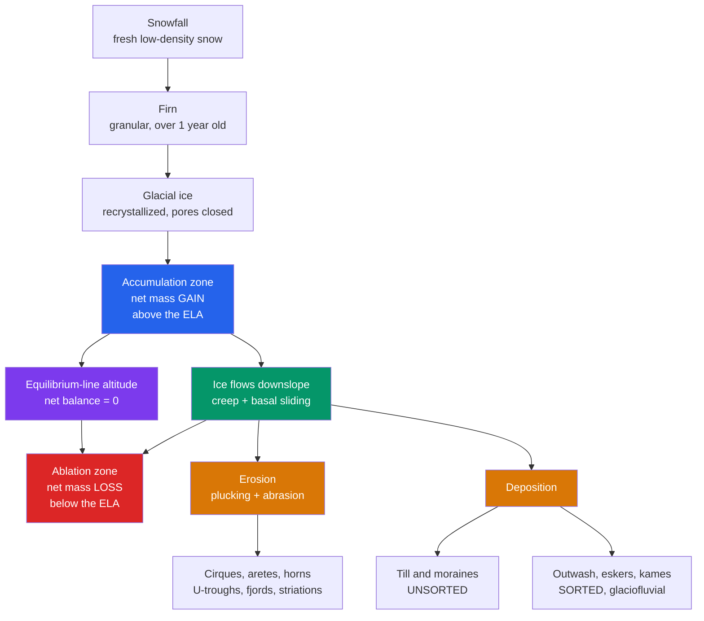

# 🧊 Glaciers and Glacial Landscapes

> [!abstract] TL;DR
> A **glacier** is a self-flowing mass of ice built from snow that survives year after year, compacting through **firn** into dense glacial ice. It is governed by **mass balance**: an **accumulation zone** (net gain) and an **ablation zone** (net loss) meet at the **equilibrium-line altitude (ELA)**, where net balance is zero. A net-positive balance makes the terminus **advance**, net-negative makes it **retreat** — but the ice always keeps flowing *downslope* regardless. Glaciers **erode** by plucking and abrasion (cirques, horns, U-shaped troughs, fjords) and **deposit** unsorted till and sorted outwash (moraines, drumlins, eskers, kettles). Ice ages left the Pleistocene imprint: isostatic depression and ongoing **post-glacial rebound**, glacio-eustatic sea-level swings, and a climate record paced by **Milankovitch cycles**.

## Intuition — analogy FIRST

Picture a bank account for ice. Every winter the high country makes **deposits** of snow; every summer the low, warm tongue makes **withdrawals** of meltwater. The **ELA** is the elevation where deposits exactly equal withdrawals for the year. If deposits beat withdrawals across the whole glacier, the "balance" grows and the ice front pushes forward; if withdrawals win, the front melts back.

Here is the twist that trips everyone up: the account is also a **conveyor belt**. Ice added up high is continuously carried downhill and delivered to the melting snout. So a glacier can be *retreating* (its terminus melting back) while every ice crystal inside it is still moving *forward and downslope*. Retreat is a statement about the front position, not the direction of flow.

---

## How It Works



---

## Key Concepts / Details

### Secondary Level

**From snow to ice.** A glacier is not frozen water poured into a valley — it is *metamorphosed snow*. Fresh snow (density ~0.1 g/cm³) that survives a summer becomes **firn**, granular old snow (~0.4–0.83 g/cm³). As more snow buries it, compaction and recrystallization squeeze out the air; once pore spaces seal at ~0.83 g/cm³ the mass becomes impermeable **glacial ice** (~0.917 g/cm³). This takes decades in warm temperate glaciers, centuries to millennia in cold polar ones.

**Types of glacier.** *Alpine (valley) glaciers* and their bowl-shaped birthplaces, *cirque glaciers*, are confined by topography. *Ice caps* and vast *continental ice sheets* (Antarctica, Greenland) bury the landscape and flow outward under their own weight.

**A glacier is an agent of change.** Wherever snowfall beats melting over the years, ice accumulates, begins to flow, and becomes a powerful tool that **erodes** rock, **transports** debris for kilometres, and **deposits** it far away — leaving landscapes no river could carve.

### Undergraduate Level

**Mass balance.** The **specific (net) balance** at a point is accumulation minus ablation, measured in metres of water equivalent (m w.e.) per year:

$$b = c - a$$

Integrating over the glacier's surface $S$ gives the **glacier-wide net balance**:

$$B_n = \int_S b \; dS$$

The **ELA** is the contour where $b = 0$. Above it lies the accumulation zone; below it, the ablation zone. In steady state the **Accumulation Area Ratio** $\text{AAR} = S_{acc}/S_{total} \approx 0.5\text{–}0.65$. Because temperature falls with height (lapse rate ~6.5 °C/km), the ELA is a sensitive climate dial: a **+1 °C** warming raises it by roughly **150 m**.

**Advance vs retreat — the key misconception.** $B_n > 0 \Rightarrow$ the glacier thickens and the terminus tends to **advance**; $B_n < 0 \Rightarrow$ it thins and **retreats**. The terminus sits where the incoming ice flux is exactly consumed by melt. When melt outpaces delivery the snout melts *back* — yet the ice within still flows *forward*. Flow never reverses.

**How glaciers move.** Two mechanisms:
1. **Internal deformation (creep)** — ice crystals slide and recrystallize; the whole column flows plastically.
2. **Basal sliding** — a film of meltwater lets warm-based (temperate) glaciers slip over bedrock. Cold-based glaciers frozen to their bed barely slide.

Velocity is highest at the surface centreline and lowest at the bed and margins. The upper ~30–60 m is a **brittle zone** that cannot deform fast enough, so it fractures into **crevasses**. Some glaciers **surge**, alternating slow build-up with sudden fast flow when subglacial water lubricates the bed.

**Erosion.** Two processes act together:
- **Plucking / quarrying** — meltwater freezes into bedrock joints; refrozen ice rips out blocks.
- **Abrasion** — rock embedded in the ice sole rasps the bed, cutting **striations** and polish and shaping asymmetric **roches moutonnées** (smooth abraded *stoss* side up-glacier, steep plucked *lee* side down-glacier).

| Erosional landform | How it forms |
|--------------------|--------------|
| **Cirque** | Bowl gouged at a glacier's head |
| **Arête / Horn** | Knife-edge ridge / pyramidal peak between cirques (Matterhorn) |
| **U-shaped trough** | Valley widened and deepened to a flat-floored U |
| **Hanging valley** | Tributary trough left high above the main valley |
| **Fjord** | Overdeepened coastal trough later drowned by the sea |

**Deposition.** Sediment left by ice is **glacial drift**:
- **Till** — dumped directly by ice: *unsorted, unstratified* (a diamict).
- **Stratified drift** — reworked by meltwater: *sorted, layered* (glaciofluvial).

| Depositional landform | Material | Origin |
|-----------------------|----------|--------|
| **Moraines** (lateral, medial, terminal, ground) | Till | Debris ridges at margins / snout / base |
| **Drumlins** | Till | Streamlined hills, steep end up-glacier |
| **Erratics** | Boulders | Far-travelled foreign lithology |
| **Eskers** | Sorted sand/gravel | Subglacial meltwater tunnels |
| **Kames** | Sorted drift | Mounds of ice-contact sediment |
| **Kettles** | — | Pits left by buried ice blocks melting |
| **Outwash plain (sandur)** | Sorted | Braided meltwater beyond the snout |

### Graduate Level

**Glen's flow law.** Ice is a non-Newtonian fluid: strain rate scales nonlinearly with the deviatoric (shear) stress,

$$\dot{\varepsilon} = A\,\tau^{\,n}, \qquad n \approx 3$$

where the softness $A(T)$ is temperature-dependent (Arrhenius) — warmer ice deforms far more easily. The **driving (basal shear) stress** of an ice slab of thickness $h$ on a slope $\alpha$ is

$$\tau_b = \rho\,g\,h\sin\alpha \quad (\sim 50\text{–}150\ \text{kPa})$$

Integrating Glen's law through the column (the shallow-ice approximation) gives a surface deformation velocity

$$u_d = \frac{2A}{n+1}\left(\rho g\sin\alpha\right)^{n} h^{\,n+1}$$

Because velocity goes as $h^{\,n+1}\!\approx h^{4}$, ice discharge is extraordinarily sensitive to thickness — the heart of ice-sheet instability.

**Ice-sheet stability and tipping points.** Where a marine ice sheet grounds on a bed that deepens *inland* (a retrograde slope), the **Marine Ice Sheet Instability (MISI)** applies: grounding-line ice flux rises steeply with thickness, so any retreat into deeper ice accelerates itself — a runaway threatening the **West Antarctic Ice Sheet**. Tall unstable calving fronts add a proposed **Marine Ice Cliff Instability (MICI)**. Positive feedbacks (elevation–mass-balance and ice–albedo) can push ice sheets past thresholds.

**Ice ages and their legacy.** Pleistocene ice sheets loaded the crust, causing **isostatic depression**; their removal drives ongoing **post-glacial rebound** of ~10 mm/yr in Fennoscandia and Hudson Bay — see [[Gravity_Isostasy_and_the_Geoid]]. Locking water into ice lowered **glacio-eustatic** sea level by ~120 m at the Last Glacial Maximum. The rhythm of glacials and interglacials is paced by **Milankovitch cycles** (eccentricity, obliquity, precession), the orbital forcing behind the paleoclimate record in [[Mass_Extinctions_and_Paleoclimate]].

```python
import numpy as np

# --- Glacier mass balance vs elevation, and the equilibrium line ---
# Specific balance b(z) [m water-equivalent / yr] increases with elevation.
# Below the ELA b < 0 (ablation wins); above it b > 0 (accumulation wins).
# The ELA is the altitude where b(z) = 0.

db_dz = 0.007          # balance gradient: (m w.e./yr) per metre of height
ELA   = 2800.0         # m, prescribed equilibrium-line altitude
b_max = 2.5            # m w.e./yr cap in the high accumulation basin

def specific_balance(z):
    """Net specific balance (m w.e./yr) at elevation z, capped up high."""
    return np.minimum(db_dz * (z - ELA), b_max)

# --- Glacier hypsometry: how area is distributed over elevation bands ---
z_bands = np.arange(2000, 3600, 100)                       # band centres (m)
area    = 5.0 * np.exp(-((z_bands - 2900) / 400.0) ** 2)   # km^2 per band

# --- Glacier-wide net balance = area-weighted integral of b(z) ---
b_bands = specific_balance(z_bands)
B_mean  = np.sum(b_bands * area) / np.sum(area)   # area-averaged (m w.e./yr)
AAR     = np.sum(area[z_bands > ELA]) / np.sum(area)

print(f"ELA                       = {ELA:.0f} m")
print(f"Accumulation Area Ratio   = {AAR:.2f}")
print(f"Area-averaged net balance = {B_mean:+.3f} m w.e./yr")

if B_mean > 0.02:
    print("=> Positive balance: glacier GROWS, terminus tends to ADVANCE.")
elif B_mean < -0.02:
    print("=> Negative balance: glacier SHRINKS, terminus tends to RETREAT.")
else:
    print("=> Near zero: close to steady state (AAR ~ 0.5-0.6).")

# Even a shrinking glacier still FLOWS downslope: a retreating terminus means
# melt outpaces the ice delivered from above, NOT that the ice reverses.
```

---

## Real-World Notes

- **Yosemite Valley (California)** is the textbook glacial **U-shaped trough**, its polished granite walls and hanging valleys (Bridalveil Fall) carved by Pleistocene ice — abrasion and plucking made visible.
- **The Matterhorn** is a **horn**: a pyramidal peak left where three or four cirque glaciers gnawed inward from different sides, their headwalls meeting in knife-edge arêtes.
- **Norway's Sognefjord** is an overdeepened glacial trough now flooded by the sea — a **fjord** over 1,300 m deep, cut well below present sea level because ice, unlike a river, can erode below base level.
- **Fennoscandia and Hudson Bay** are still rising ~10 mm/yr, more than 10,000 years after their ice sheets melted — a live demonstration of **post-glacial rebound** and mantle viscosity.
- **The Great Lakes and Long Island** are ice-age signatures: basins scoured by lobes of the Laurentide Ice Sheet, dammed and bordered by **terminal moraines** of unsorted till.
- **Thwaites Glacier (West Antarctica)**, the "Doomsday Glacier," grounds on a retrograde bed and is the poster child for **Marine Ice Sheet Instability** and multi-metre future sea-level risk.

---

## Common Pitfalls

1. **"Retreat means the ice flows backward."** No — the terminus melts back while ice continues to flow *downslope*. Retreat/advance describes the *front position*, set by the balance of ice delivery vs melt, not flow direction.
2. **Confusing till with outwash.** *Till* is dumped straight from ice: unsorted and unstratified. *Stratified drift* (outwash, eskers, kames) is washed and sorted by meltwater. Sorting is the diagnostic.
3. **Thinking the ELA is a fixed elevation.** The ELA is the zero-balance line for a given year; it rises in warm/dry years and falls in cold/snowy ones. Tracking it is how we read climate from glaciers.
4. **Mixing up roches moutonnées and drumlins.** A roche moutonnée is *bedrock* (smooth stoss up-glacier, plucked lee); a drumlin is a *depositional* till hill (steep end up-glacier). Both indicate flow direction but form oppositely.
5. **Assuming all glaciers slide on their beds.** Only warm-based (temperate) glaciers slide on meltwater; cold-based glaciers are frozen to the bed and move almost entirely by internal creep, doing little erosion.
6. **Treating ice as a simple linear (Newtonian) fluid.** Glen's law $\dot{\varepsilon}=A\tau^{3}$ is strongly nonlinear; velocity scales as roughly $h^{4}$, so small thickness changes cause large discharge changes.

---

## Related Concepts

- [[_MOC_Geomorphology|↑ Section MOC]]
- [[Weathering_and_Soils]] — frost weathering and regolith that feed debris into the glacial system
- [[Mass_Wasting_and_Slope_Stability]] — oversteepened glacial troughs trigger rockfalls and debris flows
- [[Rivers_and_Fluvial_Landscapes]] — glaciofluvial meltwater builds outwash; contrast V- vs U-shaped valleys
- [[Deserts_and_Aeolian_Processes]] — wind reworks fine glacial outwash into extensive loess deposits
- [[Coastal_Processes_and_Landforms]] — drowned troughs (fjords) and glacio-eustatic sea-level change shape coasts
- [[Groundwater_and_Karst]] — subglacial meltwater and buried outwash aquifers
- [[Gravity_Isostasy_and_the_Geoid]] — ice loading, isostatic depression and post-glacial rebound
- [[Sedimentary_Rocks_and_Environments]] — till lithifies to tillite; glacial diamicts in the rock record
- [[Mass_Extinctions_and_Paleoclimate]] — Milankovitch pacing and the Pleistocene ice-age climate record
- **Physics** — [[Laws_of_Thermodynamics]] (latent heat and the melting that drives ablation and basal sliding), [[Work_Energy_and_Conservation]] (gravitational potential energy of ice converted to erosive work)
- **Mathematics** — [[_MOC_Mathematics_Master]] (the nonlinear flow law, area–elevation integration, and diffusion of ice thickness)

---

## Review Questions

1. **Secondary**: Trace the transformation of a snowflake into glacial ice, naming the intermediate stage and the property (density) that changes. Why must snowfall exceed melting over many years for a glacier to exist at all?
2. **Undergraduate**: A valley glacier has its ELA at 2,800 m and an Accumulation Area Ratio of 0.45. Is it likely to be advancing or retreating, and why? Explain how the terminus can retreat even though the ice inside continues to flow downslope.
3. **Graduate**: Using Glen's flow law $\dot{\varepsilon}=A\tau^{n}$ with $n=3$ and driving stress $\tau_b=\rho g h\sin\alpha$, show why ice discharge scales roughly as $h^{4}$. Explain how this thickness sensitivity, combined with a retrograde bed, produces the Marine Ice Sheet Instability.

---

## Sources

- Benn & Evans — *Glaciers and Glaciation*, 2nd ed. (the standard reference)
- Cuffey & Paterson — *The Physics of Glaciers*, 4th ed., Ch. 3 (mass balance), Ch. 8 (Glen's law & flow)
- Schoof, C. (2007) — "Ice sheet grounding line dynamics," *J. Geophys. Res.* 112, F03S28
- Tarbuck & Lutgens — *Earth: An Introduction to Physical Geology*, Ch. on glaciers and glaciation

#earth-science #geomorphology #glaciology #glaciers #mass-balance #ELA #moraines #Glens-law #secondary #undergraduate #graduate
