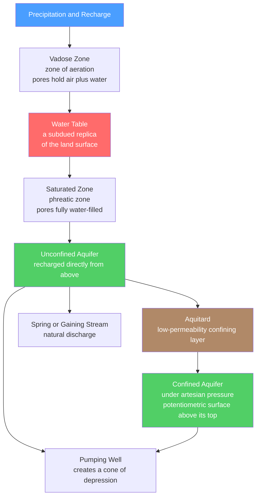

# 💧 Groundwater and Karst

> [!abstract] TL;DR
> Most liquid freshwater on Earth is not in rivers or lakes but underground, filling the pores of rock and sediment below the **water table**. **Groundwater** occupies the saturated zone, moves slowly down hydraulic gradients according to **Darcy's law** ($Q = -KA\,dh/dl$), and stores water in **aquifers**. Where the bedrock is soluble carbonate, slightly acidic groundwater dissolves it to create **karst**: sinkholes, disappearing streams, caves, and dripstone speleothems. Groundwater is a vital resource, but overdraft causes falling water tables, land subsidence, and saltwater intrusion.

## Intuition — analogy FIRST

Picture a sponge sitting in a shallow tray of water. The bottom of the sponge is fully saturated — squeeze it and water drips out; the top is damp but full of air. The boundary between "soaked" and "merely damp" is the **water table**. Now tilt the tray: the water inside the sponge slowly creeps toward the low side. That is groundwater flow — driven not by gravity pulling straight down but by differences in *water-energy height* (hydraulic head) from place to place.

The rock beneath your feet is that sponge. Sandstone and gravel are generous sponges (easy to soak and drain); clay is a sponge that holds water but refuses to give it up. And where the "sponge" is made of limestone, the water is faintly acidic and slowly **eats the sponge away**, hollowing out caves.

---

## How It Works



---

## Key Concepts / Details

### Secondary Level

**Porosity vs permeability.** Two different properties:
- **Porosity** $\phi = V_{void}/V_{total}$ — the *fraction* of rock that is open pore space (how much water it can hold).
- **Permeability** — how *easily* water flows through, set by how large and well-connected the pores are.

Clay has high porosity (~50%) but tiny, poorly connected pores, so it is nearly impermeable. Gravel has moderate porosity but huge connected pores, so it is highly permeable.

**Two zones and the water table.** Rainfall infiltrates downward through the **vadose zone** (zone of aeration), where pores hold both air and water. At depth it reaches the **saturated zone** (phreatic zone), where every pore is full of water. The surface separating them is the **water table** — a *subdued replica of the surface topography*, higher under hills, lower under valleys, and it intersects the ground at lakes, streams, and springs.

**Aquifers and aquitards.**
| Term | Meaning |
|------|---------|
| Aquifer | Permeable unit that stores and transmits usable water (sand, gravel, fractured/karst limestone) |
| Aquitard | Low-permeability unit that impedes flow (clay, shale) |
| Unconfined aquifer | Top boundary is the water table; recharged directly from above |
| Confined aquifer | Sandwiched between aquitards; water is under pressure |
| Potentiometric surface | Level to which water would rise in a well tapping a confined aquifer |

Where the potentiometric surface lies **above the aquifer top**, a well is **artesian**; where it lies above the ground, water flows out on its own (a **flowing artesian well**). Natural discharge points are **springs**.

**Karst — dissolving the bedrock.** Rain absorbs $\mathrm{CO_2}$ from air and soil to form weak carbonic acid, which dissolves limestone:
$$\mathrm{CO_2 + H_2O \rightleftharpoons H_2CO_3}$$
$$\mathrm{CaCO_3 + H_2CO_3 \rightleftharpoons Ca^{2+} + 2\,HCO_3^-}$$
This creates **sinkholes** (dolines), **disappearing streams**, and **caves/caverns**. Inside caves, when groundwater drips into open air, $\mathrm{CO_2}$ escapes (degasses) and the reaction *reverses*, precipitating calcite as **speleothems**: **stalactites** hang from the ceiling, **stalagmites** grow from the floor.

### Undergraduate Level

**Darcy's law.** Groundwater discharge through a cross-section is proportional to hydraulic conductivity and the hydraulic gradient:
$$Q = -K A \frac{dh}{dl}$$
- $Q$ = volumetric discharge $[\mathrm{m^3/s}]$
- $K$ = **hydraulic conductivity** $[\mathrm{m/s}]$ (property of *both* rock and fluid; sand ~$10^{-4}$, clay ~$10^{-9}$ m/s)
- $A$ = cross-sectional area normal to flow
- $dh/dl$ = **hydraulic gradient** (slope of hydraulic head $h = z + p/\rho g$)

The minus sign encodes that water flows from **high head to low head**. Head is *not* pressure alone — it includes elevation, so water can flow "uphill" in pressure if the elevation term dominates.

**Two velocities — a critical distinction.** The **Darcy flux** (specific discharge) is
$$q = \frac{Q}{A} = -K\frac{dh}{dl}$$
but this is *not* how fast a water molecule travels, because flow squeezes through only the pore fraction. The **average linear (seepage) velocity** is
$$v = \frac{q}{n_e} = -\frac{K}{n_e}\frac{dh}{dl}$$
where $n_e$ is the **effective porosity**. Since $n_e < 1$, the real particle velocity $v$ is always *larger* than the Darcy flux $q$.

**Wells and the cone of depression.** Pumping a well lowers the water table around it, producing **drawdown**. The resulting funnel-shaped surface is the **cone of depression**. Overlapping cones from many wells cause **well interference**.

**Streams and groundwater.** A **gaining stream** receives groundwater discharge (water table above stream level — typical in humid regions); a **losing stream** recharges the aquifer (water table below the streambed — typical in arid regions). See [[Rivers_and_Fluvial_Landscapes]].

**Overdraft problems.** When extraction exceeds recharge:
- **Falling water tables** — wells must be deepened; springs dry up.
- **Land subsidence** — dewatering compacts clay aquitards *irreversibly* (Central Valley, Mexico City).
- **Saltwater intrusion** — coastal freshwater lens thins; the **Ghyben–Herzberg** relation gives freshwater depth below sea level $z \approx \frac{\rho_f}{\rho_s - \rho_f}h \approx 40h$ for one unit of head above sea level.
- **Contamination** — slow flow and long residence times mean pollutants persist for decades. The **Ogallala (High Plains) Aquifer** is the classic example of chronic overdraft — see [[Economic_Geology_and_Resources]].

### Graduate Level

**Transmissivity and storativity.** For a confined aquifer of thickness $b$:
$$T = K b \qquad \text{(transmissivity, } \mathrm{m^2/s})$$
$$S = S_s\, b \qquad \text{(storativity / storage coefficient, dimensionless)}$$
$T$ measures the aquifer's ability to transmit water; $S$ measures how much water is released per unit head decline per unit area.

**Governing flow equation.** Combining Darcy's law with continuity gives a diffusion equation for head:
$$S_s \frac{\partial h}{\partial t} = \nabla \cdot (K \nabla h)$$

**Theis solution (transient well hydraulics).** For a fully penetrating well pumping a confined aquifer at constant rate $Q$, drawdown $s$ at radius $r$ and time $t$ is
$$s(r,t) = \frac{Q}{4\pi T}\,W(u), \qquad u = \frac{r^2 S}{4 T t}$$
where $W(u) = \int_u^{\infty}\frac{e^{-\tau}}{\tau}\,d\tau$ is the **well function** (an exponential integral). The steady-state **Thiem** equation gives the difference in drawdown between two radii:
$$s_1 - s_2 = \frac{Q}{2\pi T}\ln\!\frac{r_2}{r_1}$$

**Residence time and groundwater age dating.** Mean residence time is $\tau = V/Q_{flux}$ (stored volume / throughflow). Ages are measured with environmental tracers: **tritium** ($^3\mathrm{H}$, half-life 12.3 yr) and $^3\mathrm{H}/^3\mathrm{He}$ for years–decades, **CFCs / SF$_6$** for modern water, **$^{14}$C** for centuries–millennia, and **$^{36}$Cl / $^4$He** for very old (paleo) water. Deep aquifers can hold water tens of thousands of years old — effectively a non-renewable resource on human timescales.

```python
import numpy as np

# Darcy's law applied to a confined sandy aquifer:
# compute discharge, seepage velocity, and contaminant travel time between two wells.

# --- Aquifer and hydraulic parameters ---
K      = 15.0      # hydraulic conductivity [m/day]  (clean medium sand)
n_e    = 0.25      # effective porosity [-]
b      = 20.0      # aquifer thickness [m]
width  = 500.0     # transverse width of the flow section [m]
h1, h2 = 52.0, 50.0    # hydraulic head at the two wells [m]
L      = 1000.0    # distance between the wells [m]

# --- Hydraulic gradient (head drop per unit length) ---
i = (h1 - h2) / L              # dimensionless
A = b * width                  # cross-sectional area [m^2]

# --- Darcy flux and volumetric discharge (Q = -K A dh/dl, magnitudes) ---
q = K * i                      # Darcy flux (specific discharge) [m/day]
Q = q * A                      # discharge [m^3/day]

# --- Average linear (seepage) velocity of a water particle ---
v = q / n_e                    # [m/day]  --- ALWAYS larger than Darcy flux

# --- Travel time for a conservative tracer to cross the reach ---
t_days  = L / v
t_years = t_days / 365.25

print(f"Hydraulic gradient i        = {i:.4f}")
print(f"Darcy flux q                = {q:.3f} m/day")
print(f"Discharge Q                 = {Q:,.0f} m^3/day")
print(f"Seepage velocity v          = {v:.3f} m/day  (= q / n_e)")
print(f"Travel time over {L:.0f} m   = {t_days:,.0f} days = {t_years:.1f} years")
# Note: v > q because water flows only through the connected pore fraction.
```

---

## Real-World Notes

- **Ogallala / High Plains Aquifer (USA):** irrigates ~30% of US crop-and-livestock groundwater but is mined far faster than it recharges; parts of Kansas and Texas have dropped tens of metres, and much of the water is thousands of years old (fossil water).
- **Land subsidence:** California's San Joaquin Valley has sunk up to ~9 m over the 20th century from aquifer compaction; Mexico City sinks several centimetres per year, cracking buildings and drainage.
- **Karst water supply:** roughly a fifth to a quarter of the world's population relies on karst aquifers. The word *karst* comes from the **Kras** plateau (Slovenia); Mammoth Cave (Kentucky) is the world's longest known cave; Florida's carbonate platform produces frequent collapse **sinkholes**.
- **Speleothems as climate archives:** the growth bands and $\delta^{18}\mathrm{O}$ of stalagmites record past rainfall and temperature, giving some of the best-dated continental paleoclimate records (linked to $\mathrm{CO_2}$ degassing chemistry — see [[Chemical_Equilibrium]]).
- **Geothermal groundwater:** where circulating groundwater meets hot rock it emerges as **hot springs**; if a plumbing constriction lets water superheat and flash to steam, it erupts as a **geyser** (Old Faithful, Yellowstone). Degassing and cooling deposit **travertine** terraces (Pamukkale, Mammoth Hot Springs).
- **Saltwater intrusion:** over-pumping coastal aquifers (Gaza, southern Florida) draws seawater inland, salinizing wells — governed by the density contrast in the Ghyben–Herzberg lens.

---

## Common Pitfalls

1. **Confusing porosity with permeability.** Clay is highly porous yet nearly impermeable. Storage capacity and transmitting ability are independent properties.
2. **Darcy flux ≠ particle velocity.** The Darcy flux $q$ is discharge per bulk area; the real (seepage) velocity is $v = q/n_e$ and is always larger. Using $q$ for contaminant travel time badly overestimates arrival time.
3. **"Underground rivers and lakes."** Groundwater almost always fills pore space and creeps slowly; the water table is a subdued replica of topography, not a flat buried lake. Open flowing conduits exist *only* in mature karst.
4. **Head is not pressure.** Hydraulic head $h = z + p/\rho g$ includes elevation. Water flows from high *head* to low head, which can mean flowing toward higher pressure if it goes downhill enough.
5. **Karst reaction direction.** Dissolution ($\mathrm{CaCO_3}$ dissolving) requires $\mathrm{CO_2}$-charged acidic water; **speleothems form by the reverse** — $\mathrm{CO_2}$ degassing precipitates calcite. Same equilibrium, opposite direction (see [[Acids_Bases_and_pH]]).
6. **Ignoring well interference.** A single cone of depression seems local, but overlapping cones from a dense well field can drop regional water tables and reverse gaining streams into losing ones.

---

## Related Concepts

- [[_MOC_Geomorphology|↑ Section MOC]]
- [[Weathering_and_Soils]] — carbonic-acid (carbonation) weathering supplies the same chemistry that drives karst dissolution
- [[Rivers_and_Fluvial_Landscapes]] — gaining vs losing streams couple surface runoff to the groundwater system
- [[Mass_Wasting_and_Slope_Stability]] — pore-water pressure and the water table control slope failure
- [[Glaciers_and_Glacial_Landscapes]] — a sibling surface-process system with its own erosion and deposition
- [[Deserts_and_Aeolian_Processes]] — arid-region losing streams and deep water tables
- [[Coastal_Processes_and_Landforms]] — coastal aquifers and the freshwater–saltwater interface
- [[Non_Silicate_and_Ore_Minerals]] — calcite and the carbonate minerals that karst dissolves and re-precipitates
- [[Economic_Geology_and_Resources]] — groundwater as a strategic resource; the Ogallala overdraft problem
- [[Acids_Bases_and_pH]] (Chemistry) — carbonic-acid dissociation and pH control on carbonate solubility
- [[Chemical_Equilibrium]] (Chemistry) — the $\mathrm{CaCO_3}$–$\mathrm{CO_2}$–$\mathrm{H_2O}$ equilibrium behind caves and speleothems
- [[_MOC_Mathematics_Master]] (Mathematics) — the diffusion PDE and exponential integrals underlying the Theis solution

---

## Review Questions

1. **Secondary:** Explain why a clay layer with 50% porosity makes a poor aquifer but a good aquitard, while a gravel with 30% porosity is an excellent aquifer. Sketch the water table under a hill and a valley.
2. **Undergraduate:** A confined sand aquifer has $K = 20\ \mathrm{m/day}$, effective porosity $n_e = 0.30$, and a hydraulic gradient of $0.003$. (a) Compute the Darcy flux and the seepage velocity. (b) How long would a conservative tracer take to travel 800 m? (c) Why is the answer *shorter* than if you had used the Darcy flux directly?
3. **Graduate:** Starting from Darcy's law and continuity, state the transient groundwater flow equation and the Theis solution for drawdown near a pumping well. Define transmissivity and storativity, and explain how the well function $W(u)$ lets you estimate $T$ and $S$ from a pumping-test time–drawdown curve.

---

## Sources

- Fetter — *Applied Hydrogeology*, 4th ed., Ch. 3–7
- Freeze & Cherry — *Groundwater* (classic reference text)
- Ford & Williams — *Karst Hydrogeology and Geomorphology*
- Domenico & Schwartz — *Physical and Chemical Hydrogeology*
- Marshak — *Earth: Portrait of a Planet*, groundwater and karst chapters

#earth-science #geomorphology #hydrogeology #groundwater #karst #aquifer #darcyslaw #watertable #speleothems #secondary #undergraduate #graduate
