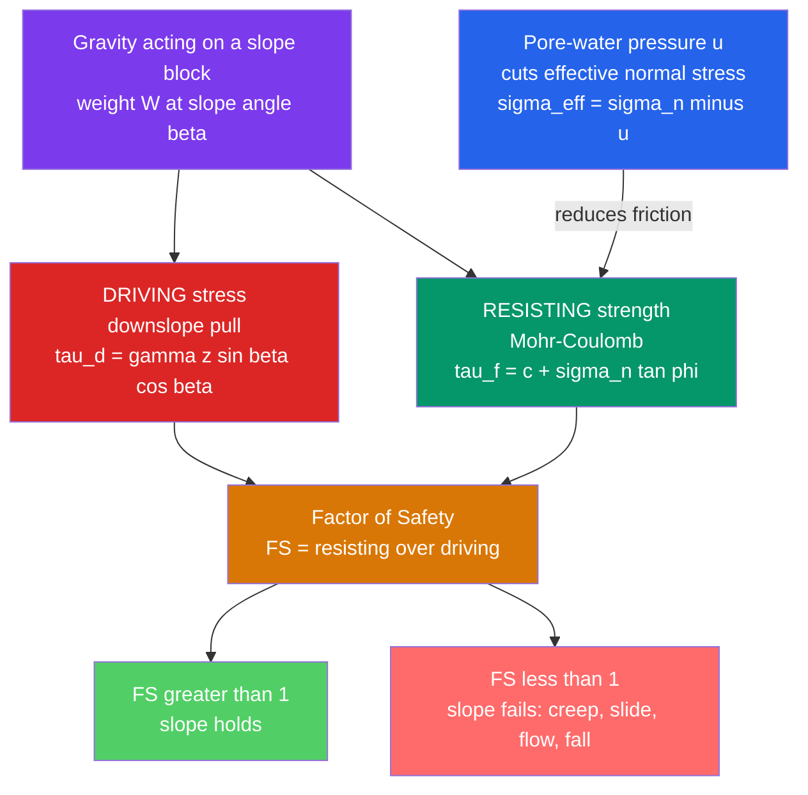

# ⛰️ Mass Wasting and Slope Stability

> [!abstract] TL;DR
> **Mass wasting** is the downslope movement of rock, regolith, and soil under gravity — no river, glacier, or wind required. Whether a slope holds or fails is a tug-of-war between the **driving** stress (gravity's downslope component) and the **resisting** strength of the material (**Mohr–Coulomb**, $\tau=c+\sigma_n\tan\phi$). We summarize this with the **factor of safety** $FS=\dfrac{\text{resisting}}{\text{driving}}$; the slope fails when $FS<1$. For dry loose grains the tipping point is the **angle of repose** ($\beta=\phi$). Water is the great destabilizer: **pore-water pressure** cuts the *effective* normal stress and so the friction, which is why most catastrophic slides — creep, slumps, debris flows, lahars, and rockfalls — happen after heavy rain or an earthquake.

## Intuition — analogy FIRST

Pour dry sand slowly onto a table. It builds a neat cone that refuses to get any steeper than about $34°$ — add more and grains just avalanche down the sides. That fixed maximum steepness is the **angle of repose**, and it is nothing more than a visible force balance: on a shallow slope, friction between grains beats gravity's downslope pull; past the critical angle, gravity wins and the surface flows.

Now dribble a little water on the cone and it briefly stands *steeper* — the moisture films glue grains together (capillary "sandcastle" cohesion). But keep pouring until the pile is fully saturated and it collapses into a soupy flow. That is the whole subject in one bowl: gravity drives, friction and cohesion resist, and **water quietly sabotages the friction** by holding the grains apart. A hillside is that sand pile scaled up to a mountain, loaded for millennia, waiting for the rainstorm that pushes the balance below one.

---

## How It Works

The stability of any slope is a stress balance. Gravity resolves into a component *along* the slope that tries to move material (driving) and a component *into* the slope that presses the material together and generates friction (part of resisting). Cohesion adds to resistance; **pore-water pressure subtracts from it** by pushing grains apart.



---

### Secondary Level

**What mass wasting is.** Any downslope movement of Earth material driven directly by gravity. Unlike erosion by rivers, ice, or wind, no transporting medium is needed — the material *is* the flow. It is the crucial link that delivers weathered debris (see [[Weathering_and_Soils]]) from hillslopes to rivers (see [[Rivers_and_Fluvial_Landscapes]]).

**Driving vs resisting.** Gravity is constant, but its *downslope component* grows with slope angle. Resistance comes from friction (grains locking together) and cohesion (clay, roots, cements gluing them). When resistance exceeds driving the slope is stable; when it does not, it fails.

**The angle of repose.** The steepest stable angle for *dry, loose* granular material, typically $30°$–$37°$. It equals the internal friction angle $\phi$.

| Material | Angle of repose |
|----------|-----------------|
| Dry sand | $\sim30°$–$35°$ |
| Rounded gravel | $\sim35°$ |
| Angular gravel / talus | $\sim37°$–$40°$ |
| Wet clay | highly variable, can stand steep then fail |

**Classifying movements** — by *material*, *mechanism*, and *rate*:

| Type | Mechanism | Rate | Example |
|------|-----------|------|---------|
| **Creep** | grains ratchet downslope (freeze–thaw, wet–dry) | mm–cm per year, imperceptible | tilted fence posts, "drunken" trees |
| **Solifluction** | water-logged soil oozes over frozen ground | cm–m per year | periglacial lobes |
| **Slump (rotational slide)** | block rotates on a curved failure surface | m per hour to days | road-cut and coastal-cliff failures |
| **Translational slide** | slab slides on a planar surface (bedding, joint) | can be fast | dip-slope rock slides |
| **Earthflow / mudflow** | saturated fine sediment flows | m per hour to km per hour | hillside flows after rain |
| **Debris flow / lahar** | fast slurry of water and coarse debris | up to tens of km per hour | canyon debris flows, volcanic lahars |
| **Rockfall / topple** | free fall or toppling of blocks from a cliff | free fall, seconds | cliff rockfalls, talus building |

**Triggers.** Steepening or *undercutting* (a river or the sea cutting the toe), heavy rain or snowmelt (saturation), earthquakes (see [[Seismology_and_Earthquakes]]), loss of vegetation (roots removed), volcanic eruptions (lahars — see [[Volcanism_and_Volcanic_Hazards]]), and human loading or excavation.

### Undergraduate Level

**Force balance on a block on an incline.** For a block of weight $W$ resting on a plane inclined at $\beta$, resolve gravity into components along and normal to the slope:

$$\text{driving} = W\sin\beta,\qquad N = W\cos\beta$$

For a **dry, cohesionless** material the maximum frictional resistance is $F=N\tan\phi=W\cos\beta\tan\phi$. The factor of safety is their ratio:

$$FS=\frac{\text{resisting}}{\text{driving}}=\frac{W\cos\beta\tan\phi}{W\sin\beta}=\boxed{\dfrac{\tan\phi}{\tan\beta}}$$

The weight cancels — stability does **not** depend on how heavy the block is, only on the angle. Failure ($FS=1$) occurs exactly when $\beta=\phi$: the **angle of repose is the friction angle**.

**Mohr–Coulomb strength.** Real hillslope materials also have cohesion. Shear strength is

$$\tau_f = c + \sigma_n\tan\phi$$

where $c$ is cohesion, $\sigma_n$ the normal stress on the failure plane, and $\phi$ the internal friction angle. Cohesion lets a slope stand *vertically* over short spans (a fresh trench wall) even though $\beta>\phi$ — until the cohesion is lost.

**Effective stress — why water is lethal.** Terzaghi's principle says friction responds only to the **effective** normal stress, the part carried by grain-to-grain contact:

$$\sigma' = \sigma_n - u$$

where $u$ is the **pore-water pressure**. Saturating a slope raises $u$, which lowers $\sigma'$ and therefore the frictional term $\sigma'\tan\phi$ — the resistance drops even though the driving stress barely changes. This is a **force** effect, not merely added weight; the physics is the same Newtonian force balance that governs any body on an incline (see [[Newtons_Laws_and_Kinematics]]), and the energy released as the mass accelerates downslope is set by the drop in gravitational potential energy (see [[Work_Energy_and_Conservation]]).

### Graduate Level

**The infinite-slope model with a water table.** For a long, uniform slope where the failure surface parallels the ground and is much longer than it is deep, the ratio-of-stresses balance gives a closed form. With slope-parallel seepage and a water table at vertical height $h_w$ above the failure plane (saturation ratio $m=h_w/z$):

$$FS=\frac{c'+(\gamma - m\gamma_w)\,z\cos^2\beta\,\tan\phi'}{\gamma\,z\sin\beta\cos\beta}$$

where $c'$ and $\phi'$ are **effective-stress** strength parameters, $\gamma$ the soil unit weight, $\gamma_w$ the unit weight of water, $z$ the vertical depth to the failure plane, and $\beta$ the slope angle. Two limiting checks:

- **Dry, cohesionless** ($c'=0,\ m=0$): reduces to $FS=\dfrac{\tan\phi'}{\tan\beta}$ — recovers the block result.
- **Fully saturated** ($c'=0,\ m=1$): $FS=\dfrac{\gamma-\gamma_w}{\gamma}\cdot\dfrac{\tan\phi'}{\tan\beta}$. Since $\gamma\approx 2\gamma_w$ for typical soils, **full saturation roughly halves the factor of safety** — the single most important quantitative fact in slope hazard.

**Limit-equilibrium for finite slopes.** Rotational slumps are analyzed by the **method of slices** (Fellenius, Bishop, Morgenstern–Price), which discretizes a trial circular surface, sums driving and resisting moments, and searches for the critical circle giving minimum $FS$.

**Rainfall intensity–duration thresholds.** Because pore pressure builds with infiltration, regional landslide triggering is often predicted from empirical envelopes of rainfall **intensity** $I$ (mm/h) versus **duration** $D$ (h). The classic global threshold (Caine, 1980) is a power law:

$$I = 14.82\,D^{-0.39}$$

Storms plotting above the curve are likely to trigger shallow slides and debris flows. Modern early-warning systems combine such thresholds with real-time rain gauges, soil-moisture models, and InSAR/LiDAR deformation monitoring.

```python
import numpy as np
import matplotlib.pyplot as plt

# --- Infinite-slope factor of safety ---------------------------------
# FS = [ c' + (gamma - m*gamma_w) * z * cos^2(beta) * tan(phi') ]
#      -----------------------------------------------------------
#                 gamma * z * sin(beta) * cos(beta)
#
# c        effective cohesion (Pa)
# gamma    soil unit weight (N/m^3)   gamma_w water unit weight (N/m^3)
# z        vertical depth to failure plane (m)
# phi_deg  effective friction angle (deg)
# m        saturation ratio h_w/z  (0 = dry, 1 = water table at surface)
def factor_of_safety(beta_deg, c=5.0e3, gamma=18.0e3, gamma_w=9.81e3,
                     z=3.0, phi_deg=32.0, m=0.0):
    b, phi = np.radians(beta_deg), np.radians(phi_deg)
    resisting = c + (gamma - m * gamma_w) * z * np.cos(b)**2 * np.tan(phi)
    driving   = gamma * z * np.sin(b) * np.cos(b)
    return resisting / driving

beta = np.linspace(5, 60, 300)
FS_dry = factor_of_safety(beta, m=0.0)   # dry slope
FS_sat = factor_of_safety(beta, m=1.0)   # water table at the surface

plt.figure(figsize=(7, 5))
plt.plot(beta, FS_dry, lw=2, label="Dry (m = 0)")
plt.plot(beta, FS_sat, lw=2, label="Saturated (m = 1)")
plt.axhline(1.0, color="k", ls="--", label="Failure threshold FS = 1")
plt.fill_between(beta, 0, 1, color="red", alpha=0.08)  # unstable band
plt.xlabel("Slope angle  beta  (degrees)")
plt.ylabel("Factor of safety  FS")
plt.title("Infinite-slope stability: dry vs saturated")
plt.ylim(0, 4); plt.legend(); plt.grid(True, alpha=0.3); plt.tight_layout()

# Sanity check: cohesionless dry case must collapse to tan(phi)/tan(beta)
phi = 32.0
for angle in (20, 32, 45):
    fs_full   = factor_of_safety(angle, c=0.0, m=0.0, phi_deg=phi)
    fs_simple = np.tan(np.radians(phi)) / np.tan(np.radians(angle))
    print(f"beta={angle:>2} deg   FS_full={fs_full:.3f}   tanphi/tanbeta={fs_simple:.3f}")
```

---

## Real-World Notes

- **Vajont, Italy (1963).** Filling a reservoir behind the world's tallest thin-arch dam raised pore-water pressure in an ancient slide mass on Monte Toc. About $270$ million m³ of rock slid into the reservoir in seconds; the displacement wave overtopped the dam by $\sim250$ m and destroyed towns downstream, killing $\sim2{,}000$ people — a textbook case of pore pressure driving $FS$ below one.
- **Oso, Washington (2014).** After weeks of record rainfall, a saturated hillslope failed as a fast debris flow that ran out over $1$ km across the valley, killing $43$ — a modern reminder that gentle, revegetated slopes can still fail catastrophically when saturated.
- **Nevado del Ruiz lahar, Colombia (1985).** A modest eruption melted summit snow and ice, generating **lahars** (volcanic mudflows) that raced down river valleys and buried the town of Armero, killing $\sim23{,}000$ — the deadliest mass-wasting event of the century (see [[Volcanism_and_Volcanic_Hazards]]).
- **Frank Slide, Alberta (1903).** $\sim30$ million m³ of limestone slid off Turtle Mountain in $\sim100$ seconds, its **bedding planes dipping toward the valley** so that intact-rock strength was irrelevant — structure, not just material, controls stability.
- **Solifluction lobes** in periglacial and permafrost regions creep visibly downslope as the active layer thaws over impermeable frozen ground, shaping tundra hillslopes (a bridge to [[Glaciers_and_Glacial_Landscapes]]).
- **Mitigation engineering.** Because water is the dominant trigger, the front-line defenses are **drainage** (horizontal drains, cut-off ditches), **regrading** to gentler angles, **retaining walls** and rock bolts, **terracing**, revegetation for root reinforcement, and continuous **slope monitoring** (inclinometers, GPS, InSAR).

---

## Common Pitfalls

1. **"Water fails slopes by adding weight."** The dominant effect is **pore-water pressure lowering effective stress and friction**, not the extra mass — added weight increases *both* driving and normal stress and nearly cancels. Effective stress, via $\sigma'=\sigma_n-u$, is the real culprit.
2. **Confusing damp cohesion with saturation.** A *little* moisture adds apparent (capillary) cohesion and lets sand stand steeper; *full* saturation destroys it. The "sandcastle" and the "mudflow" are opposite ends of the same water axis.
3. **Treating $FS>1$ as permanently safe.** $FS$ is time-dependent: undercutting, a rainstorm, or an earthquake can push a slope from $1.5$ to below $1$ in hours. It is also deterministic — probabilistic methods account for the natural scatter in $c'$ and $\phi'$.
4. **Lumping all "landslides" together.** Creep ($mm/yr$), slumps ($m/hr$), and debris flows ($km/hr$) differ by orders of magnitude in speed and demand completely different mitigations; the classification (fall / slide / flow / creep) is not pedantry.
5. **Ignoring structure.** Bedding or joints that "daylight" (dip out of the slope face) create pre-existing failure planes; a slope can fail far below the strength measured on intact rock, as at Frank and Vajont.
6. **Mixing total and effective stress parameters.** Use effective $c',\phi'$ with pore pressures (drained/long-term), or undrained $c_u$ without them (short-term). Combining $c'$ with total stress — or forgetting $u$ entirely — silently overestimates $FS$.

---

## Related Concepts

- [[_MOC_Geomorphology|↑ Section MOC]]
- [[Weathering_and_Soils]] — weathering makes the loose regolith and clay that mass wasting then moves; it sets $c$, $\phi$, and permeability
- [[Rivers_and_Fluvial_Landscapes]] — rivers undercut slope toes (removing support) and carry away the debris that mass wasting delivers
- [[Glaciers_and_Glacial_Landscapes]] — oversteepened glaciated valleys and periglacial solifluction are prime mass-wasting settings
- [[Deserts_and_Aeolian_Processes]] — dune slip-faces sit at the angle of repose; dry granular avalanching in miniature
- [[Coastal_Processes_and_Landforms]] — wave undercutting drives cliff falls and coastal slumps
- [[Groundwater_and_Karst]] — the water table and pore pressure that control $FS$; sinkhole collapse is a form of subsidence
- [[Seismology_and_Earthquakes]] — seismic shaking is a major trigger, adding inertial driving force and generating liquefaction
- [[Volcanism_and_Volcanic_Hazards]] — lahars and volcanic edifice collapse are among the deadliest mass-wasting hazards
- **Physics** — [[Newtons_Laws_and_Kinematics]] (the block-on-incline force balance), [[Work_Energy_and_Conservation]] (potential energy released as the mass accelerates and runs out)
- **Mathematics** — [[_MOC_Mathematics_Master]] — trigonometry of the force resolution and the limit-equilibrium optimization for the critical slip surface

---

## Review Questions

1. **Secondary:** A pile of dry sand rests at its angle of repose, $\sim34°$. Explain, in terms of driving versus resisting forces, (a) why it cannot get steeper, (b) why a light sprinkle of water lets you build it steeper, and (c) why soaking it makes it collapse into a flow.
2. **Undergraduate:** Starting from the force balance on a block on a plane inclined at $\beta$, derive $FS=\tan\phi/\tan\beta$ for a dry cohesionless slope. For $\phi=30°$, at what angle does it fail? Then, using effective stress, explain quantitatively why raising the water table to the surface roughly halves the factor of safety.
3. **Graduate:** For an infinite slope with $c'=5$ kPa, $\gamma=18$ kN/m³, $z=3$ m, $\phi'=32°$, and $\beta=30°$, compute $FS$ for dry ($m=0$) and saturated ($m=1$) conditions, and find the saturation ratio $m$ at which $FS=1$. Then discuss how a rainfall intensity–duration threshold such as $I=14.82\,D^{-0.39}$ would be used operationally for early warning, and its main limitations.

---

## Sources

- Selby, M.J. — *Hillslope Materials and Processes*, 2nd ed. (1993)
- Terzaghi, Peck & Mesri — *Soil Mechanics in Engineering Practice*, 3rd ed. (1996)
- Duncan, Wright & Brandon — *Soil Strength and Slope Stability*, 2nd ed. (2014)
- Cruden, D.M. & Varnes, D.J. (1996) — "Landslide Types and Processes," TRB Special Report 247
- Caine, N. (1980) — "The rainfall intensity–duration control of shallow landslides and debris flows," *Geografiska Annaler A* 62, 23
- USGS Landslide Hazards Program — types, triggers, and mitigation references

#earth-science #geomorphology #mass-wasting #slope-stability #landslides #factor-of-safety #angle-of-repose #secondary #undergraduate #graduate
