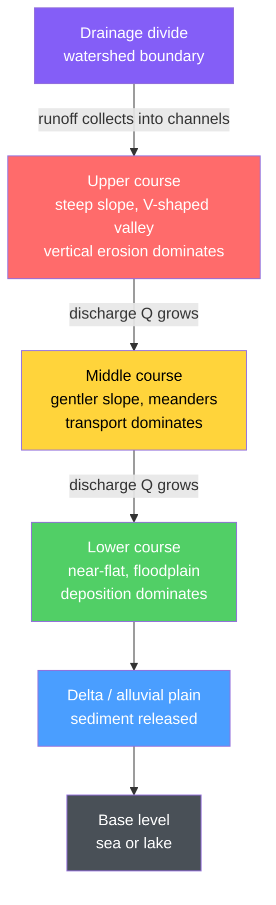

# 🏞️ Rivers and Fluvial Landscapes

> [!abstract] TL;DR
> Rivers are the dominant sculptors of the continents: gravity-driven flows of water that **erode** (hydraulic action, abrasion, solution), **transport** a sediment load (dissolved, suspended, and bed load), and **deposit** it, wiring an entire **drainage basin** into a single hierarchical system. Discharge $Q = A\,v$ grows downstream as tributaries join; the **Hjulström relationship** governs which grains are entrained, carried, or dropped. Channels adopt straight, **meandering**, or **braided** forms, and the whole river tends toward a **graded** longitudinal profile in dynamic equilibrium with **base level**. Fluvial landforms — V-shaped valleys, waterfalls, floodplains, levees, terraces, alluvial fans, and deltas — record this balance. At the graduate level, **stream power** ($\Omega = \rho g Q S$) and boundary **shear stress** drive incision, formalized in the stream-power incision model of bedrock rivers.

## Intuition — analogy FIRST

Think of a river as a **conveyor belt with a strict weight limit that changes as it speeds up**. When the belt runs fast (steep, flooding, narrow), it can pick up and haul heavy loads — cobbles, gravel, sand. When it slows down (gentle gradient, spreading out, low flow), it *must* set the heaviest items down first, then the lighter ones, sorting its cargo by size as it goes. The river never carries more than its speed allows; the instant it decelerates, it unloads. Every fluvial landform — a boulder-strewn mountain torrent, a sandy point bar on a lazy bend, the fine silt of a delta — is simply the belt dropping a particular grain size at the place where it could no longer hold it.

The single most important idea: **a river continuously trades between erosion, transport, and deposition, and which one wins at any point depends on how its velocity compares to the size of the sediment.**

---

## How It Works



The profile is **concave-up**: steep and erosional at the head, gentle and depositional at the mouth, always grading toward base level.

### Secondary Level

**The drainage basin.** A river and its tributaries collect water from a **drainage basin** (watershed), bounded by **drainage divides**. Water enters at the **source**, tributaries meet at **confluences**, and the river reaches its **mouth** at base level. The plan-view **drainage pattern** reflects the underlying geology:

| Pattern | Geometry | Control |
|---------|----------|---------|
| Dendritic | Tree-like, random branching | Uniform, flat-lying rock |
| Trellis | Parallel trunks, right-angle tributaries | Folded / tilted alternating hard–soft beds |
| Radial | Outward from a central peak | Volcanoes, domes |
| Rectangular | Right-angle bends | Joint / fault networks |

**The three kinds of river work.** A river does three things: **erodes**, **transports**, and **deposits**.

*Erosion processes:* **hydraulic action** (the sheer force and pressure of water prying at cracks), **abrasion** (bed-load tools grinding the channel, cutting potholes), **attrition** (particles knocking each other smaller and rounder), and **solution** (chemical dissolving of soluble rock such as limestone).

*The load:* carried three ways — **dissolved load** (ions in solution), **suspended load** (fine silt and clay held aloft by turbulence), and **bed load** (sand, gravel, and cobbles rolled, slid, or bounced — **saltation** — along the bottom).

**Discharge.** The volume of water passing a point per second:
$$Q = A\,v$$
where $A$ is the channel cross-sectional area ($\text{m}^2$) and $v$ the mean velocity ($\text{m/s}$), giving $Q$ in $\text{m}^3/\text{s}$ (cumecs). $Q$ **grows downstream** as tributaries add water.

### Undergraduate Level

**Stream order and network laws.** In the **Strahler** scheme, an unbranched headwater stream is order 1; two order-1 streams join to make an order 2; two order-2 make an order 3, and so on. Horton's laws describe the resulting self-similar geometry — e.g., the number of streams falls geometrically with order:
$$\frac{N_\omega}{N_{\omega+1}} = R_b$$
where $R_b$ (the **bifurcation ratio**) is typically 3–5.

**Downstream hydraulic geometry.** Leopold & Maddock (1953) found that as discharge rises downstream, width $w$, mean depth $d$, and velocity $v$ scale as power laws:
$$w \propto Q^{\,b}, \quad d \propto Q^{\,f}, \quad v \propto Q^{\,m}, \qquad b + f + m = 1$$
because $Q = wdv$. Typical exponents: $b \approx 0.5$, $f \approx 0.4$, $m \approx 0.1$ — rivers widen and deepen faster than they speed up.

**Competence, capacity, and the Hjulström curve.** A river's **competence** is the *largest particle* it can move (roughly $\propto v^2$ for bed load); its **capacity** is the *total quantity* it can carry (governed by $Q$ and $v$). The **Hjulström diagram** plots critical mean velocity against grain size, splitting the plane into three fields:

| Grain size | Behaviour | Why |
|-----------|-----------|-----|
| Clay / silt (< 0.06 mm) | Needs **high** velocity to erode | Electrostatic **cohesion** binds fine particles |
| Fine sand (~0.1–0.5 mm) | Erodes at the **lowest** velocity | Non-cohesive and light |
| Gravel / cobbles (> 2 mm) | Needs high velocity to erode | Sheer weight |

Once suspended, fine grains stay up at velocities far below their entrainment threshold — clay eroded in a flood may travel to the sea before it settles.

**Channel form.** Sinuosity $= \dfrac{\text{channel length}}{\text{valley length}}$.

- **Straight** — rare and usually structurally controlled; the deepest line (**thalweg**) still wanders.
- **Meandering** (sinuosity > 1.5) — **helical (secondary) flow** drives the fastest water against the **outer bank** (cut bank → erosion) and sweeps sediment onto the **inner bank** (**point bar** → deposition). Bends migrate and amplify until a neck is cut off, abandoning an **oxbow lake**.
- **Braided** — multiple shifting channels around mid-channel bars, favoured by **high sediment load**, erodible banks, and variable discharge.

**The graded stream.** Over time a river approaches a **graded** longitudinal profile — Mackin's (1948) definition: a stream *"in which slope is delicately adjusted to provide, with available discharge, just the velocity required to transport the load supplied."* It is a **dynamic equilibrium**: perturb the load or discharge and slope readjusts. The lowest level to which a river can erode is **base level** (ultimate = sea level; local = a lake or resistant sill). A fall in base level triggers **rejuvenation**: renewed downcutting sends a **knickpoint** (a step in the profile — waterfall or rapid) migrating upstream, leaving **river terraces** (abandoned floodplains) and **incised meanders**.

**Fluvial landforms.**

| Landform | Course | Process |
|----------|--------|---------|
| V-shaped valley | Upper | Vertical incision + slope wash |
| Waterfall / gorge | Upper–middle | Resistant caprock over soft rock; headward retreat |
| Floodplain | Middle–lower | Lateral migration + overbank silt |
| Natural levee | Lower | Coarse sediment dropped at channel margin in floods |
| River terrace | Any | Incision below a former floodplain |
| Alluvial fan | Mountain front | Sudden gradient drop in dry lands |
| Delta | Mouth | Sediment supply outpaces removal at base level |

### Graduate Level

**Shear stress and stream power.** The **boundary shear stress** the flow exerts on its bed is
$$\tau_0 = \rho\, g\, R\, S$$
where $R = A/P$ is the hydraulic radius ($P$ = wetted perimeter) and $S$ the energy slope. Grains move once $\tau_0$ exceeds a critical value set by the dimensionless **Shields stress** $\tau^{*} = \dfrac{\tau_0}{(\rho_s - \rho)\,g\,D}$, with $\tau^{*}_c \approx 0.03$–$0.06$.

**Total** and **specific** stream power measure the rate of energy expenditure:
$$\Omega = \rho\, g\, Q\, S \quad[\text{W/m}], \qquad \omega = \frac{\Omega}{w} = \rho\, g\, q\, S \quad[\text{W/m}^2]$$
where $q = Q/w$ is discharge per unit width. Incision and sediment transport both scale with $\omega$.

**Stream-power incision model (SPIM).** For detachment-limited bedrock rivers, incision rate is commonly modelled as
$$E = K\,A^{m}\,S^{n}$$
with drainage area $A$ a proxy for discharge, $K$ an erodibility coefficient, and exponents $m, n$. At topographic steady state $E = U$ (rock-uplift rate), yielding the diagnostic **slope–area** relation
$$S = \left(\frac{U}{K}\right)^{1/n} A^{-\,m/n}, \qquad \theta = \frac{m}{n} \approx 0.4\text{–}0.6$$
where $\theta$ is the **concavity index**. Knickpoints migrate upstream as kinematic waves with celerity $\propto K\,A^{m}$ — a base-level signal propagating through the network.

**Landscape evolution models.** Two competing frameworks:

| Model | Author | Core idea | Time dependence |
|-------|--------|-----------|-----------------|
| Cycle of erosion | Davis (1899) | Rapid uplift then decay: youth → maturity → old age → **peneplain** | Time-**dependent**, cyclic |
| Dynamic equilibrium | Hack (1960) | Form set by a *balance* of uplift, erosion, and rock resistance | Time-**independent**, steady |

**Flood frequency.** Rank annual peak discharges; the **recurrence interval** (return period) by the Weibull plotting position is
$$T = \frac{n+1}{m}$$
for a record of $n$ years and rank $m$. The **annual exceedance probability** is $P = 1/T$ — a "100-year flood" has a $1\%$ chance in *any* year (not once per century). **Human impacts** shift these curves: dams trap sediment and starve downstream deltas; channelization and urbanization make hydrographs flashier, raising downstream peaks.

```python
import numpy as np
import matplotlib.pyplot as plt

# ----------------------------------------------------------------------
# Part 1 - Manning's equation: mean velocity and discharge of a channel
#   v = (1/n) * R^(2/3) * S^(1/2)   (SI units),   Q = A * v
# Trapezoidal channel: bottom width b, side slope z (H:V), flow depth y.
# ----------------------------------------------------------------------
def manning_channel(b, y, z, n, S):
    A = (b + z * y) * y                       # cross-sectional flow area  [m^2]
    P = b + 2 * y * np.sqrt(1 + z**2)         # wetted perimeter           [m]
    R = A / P                                 # hydraulic radius           [m]
    v = (1.0 / n) * R**(2/3) * S**0.5         # mean velocity              [m/s]
    Q = A * v                                 # discharge                  [m^3/s]
    return A, R, v, Q

# A gravel-bedded stream: 20 m wide, 2 m deep, gentle slope, weedy/stony bed
A, R, v, Q = manning_channel(b=20.0, y=2.0, z=1.5, n=0.035, S=8e-4)
print(f"Area A       = {A:6.2f} m^2")
print(f"Hydraulic R  = {R:6.3f} m")
print(f"Velocity v   = {v:6.2f} m/s")
print(f"Discharge Q  = {Q:6.1f} m^3/s")   # ~53 cumecs

# ----------------------------------------------------------------------
# Part 2 - Hjulstrom-style thresholds vs grain size (illustrative)
#   deposition curve = settling velocity  (Ferguson & Church 2004)
#   erosion curve    = entrainment velocity from a Shields criterion
# ----------------------------------------------------------------------
rho, rho_s, g, nu = 1000., 2650., 9.81, 1.0e-6   # water, quartz, gravity, viscosity
Rsub = rho_s / rho - 1.0                          # submerged specific gravity ~1.65
D = np.logspace(-6, -1, 400)                      # grain diameter 1 um -> 100 mm

# Settling (fall) velocity - smooth across laminar and turbulent regimes
C1, C2 = 18.0, 1.0
w_s = Rsub * g * D**2 / (C1 * nu + np.sqrt(0.75 * C2 * Rsub * g * D**3))

# Entrainment velocity: Shields -> critical shear -> mean velocity via tau = rho*Cf*U^2
theta_c, Cf = 0.045, 3e-3
tau_c    = theta_c * (rho_s - rho) * g * D
U_noncoh = np.sqrt(tau_c / (rho * Cf))                    # rises for coarse grains
U_cohes  = 0.10 * np.sqrt(5e-4 / np.maximum(D, 1e-6))     # cohesion raises fine-grain limit
U_erode  = np.maximum(U_noncoh, U_cohes)                  # U-shaped Hjulstrom curve

plt.figure(figsize=(7, 5))
plt.loglog(D * 1000, U_erode, lw=2, label="erosion / entrainment")
plt.loglog(D * 1000, w_s, "--", lw=2, label="deposition (settling)")
plt.fill_between(D * 1000, w_s, U_erode, where=(U_erode > w_s), alpha=0.15,
                 label="transport field")
plt.xlabel("grain diameter (mm)"); plt.ylabel("mean flow velocity (m/s)")
plt.title("Hjulstrom-style entrainment / transport / deposition fields")
plt.legend(); plt.grid(True, which="both", alpha=0.3); plt.tight_layout()
# Minimum entrainment velocity (~0.19 m/s) sits at fine sand (~0.14 mm) - textbook Hjulstrom.
```

---

## Real-World Notes

- **Niagara Falls** — a resistant Lockport dolostone caprock over weak shale; undercutting collapses the lip, so the falls (a giant knickpoint) retreat upstream ~1–1.5 m/yr, carving the Niagara Gorge behind them.
- **Mississippi River delta** — a fluvial-dominated "bird's-foot" delta; upstream dams and levees now trap sediment and choke off overbank deposition, so the delta is *starving*, subsiding, and drowning — a textbook human impact on the sediment budget.
- **Ganges–Brahmaputra** — carries roughly 1 billion tonnes of Himalayan sediment per year to the Bay of Bengal, building the world's largest delta and the Bengal deep-sea fan (links [[Sedimentary_Rocks_and_Environments]]).
- **Colorado River / Grand Canyon** — regional uplift plus a lowered base level drove ~1.6 km of incision; **incised meanders** (e.g., the Goosenecks of the San Juan) preserve a floodplain pattern later cut deep into bedrock.
- **Braided outwash rivers** (Iceland, New Zealand's Canterbury Plains) — glacial meltwater delivers sediment loads so large that the channel repeatedly chokes and splits into shifting braids (see [[Glaciers_and_Glacial_Landscapes]]).
- **1993 Mississippi flood** — a >100-year event that overtopped and failed engineered levees, demonstrating that channelization transfers flood risk downstream rather than removing it.

---

## Common Pitfalls

1. **Confusing competence with capacity.** Competence is the *largest grain* movable (set by velocity); capacity is the *total load* carried (set by discharge and velocity). A slow, huge river has high capacity but low competence; a small torrent in flood is the reverse.
2. **Misreading the Hjulström curve.** The *lowest* erosion velocity is at fine **sand**, not the finest clay. Cohesion makes clay and silt *hard to erode* yet, once suspended, *easy to keep* moving — the erosion and deposition curves diverge for fine grains.
3. **Treating a "100-year flood" as once-per-century.** It is a $1\%$ annual-exceedance-probability event; two can occur in consecutive years, and the estimate drifts as land use and climate change the flow record.
4. **Thinking erosion happens on the inside of a meander bend.** Fastest flow and erosion are on the **outer** (cut) bank; the **inner** bank builds a **point bar**. Helical flow, not "centrifugal throw," drives this.
5. **Assuming a graded profile is static.** "Graded" means **dynamic equilibrium**, not frozen: change the load, discharge, or base level and the slope, sinuosity, or bed state adjusts to a new balance.
6. **Ignoring the two energy inputs.** Fluvial work is powered by **gravity** (potential energy of water at altitude, converting to kinetic energy) — see [[Work_Energy_and_Conservation]] — while the **hydrologic cycle** that lifts the water is solar-driven. Attributing incision to "the river alone" hides both.

---

## Related Concepts

- [[_MOC_Geomorphology|↑ Section MOC]]
- [[Weathering_and_Soils]] — supplies the regolith and sediment that rivers transport and sort
- [[Mass_Wasting_and_Slope_Stability]] — hillslope failures deliver sediment to channels and steepen valley sides
- [[Glaciers_and_Glacial_Landscapes]] — ice carves U-shaped valleys and feeds sediment-choked braided outwash rivers
- [[Deserts_and_Aeolian_Processes]] — where alluvial fans, ephemeral washes, and wind compete to move sediment
- [[Coastal_Processes_and_Landforms]] — the downstream neighbour: where deltas, estuaries, and longshore drift take over
- [[Groundwater_and_Karst]] — solution, springs, and baseflow that sustain rivers between storms
- [[Sedimentary_Rocks_and_Environments]] — the fluvial and deltaic deposits that lithify into the rock record
- [[Work_Energy_and_Conservation]] — potential-to-kinetic energy conversion that powers erosion (Physics vault)
- [[Newtons_Laws_and_Kinematics]] — force balance behind shear stress, entrainment, and settling (Physics vault)
- [[_MOC_Mathematics_Master]] — power laws, log–log scaling, and the numerics behind the demo (Mathematics vault)

---

## Review Questions

1. **Secondary**: A river channel has a cross-sectional area of $30\ \text{m}^2$ and a mean velocity of $1.5\ \text{m/s}$. Compute its discharge $Q$. Name the three ways a river transports its load, and give the erosion process responsible for carving potholes in a rocky bed.
2. **Undergraduate**: Using the Hjulström diagram, explain why a river in flood can erode fine clay only at high velocity yet, once the flood wanes, deposits sand and gravel long before that clay settles. Relate your answer to competence, cohesion, and settling velocity.
3. **Graduate**: For a bedrock river at topographic steady state under uniform uplift $U$, derive the slope–area relation from $E = K A^{m} S^{n}$ and explain how the concavity index $\theta = m/n$ is measured. How would a step increase in $U$ propagate through the network as a knickpoint, and what would you expect to see in a longitudinal profile?

---

## Sources

- Leopold, L. B., Wolman, M. G. & Miller, J. P. — *Fluvial Processes in Geomorphology* (1964)
- Knighton, D. — *Fluvial Forms and Processes: A New Perspective* (1998)
- Hjulström, F. (1935) — "Studies of the morphological activity of rivers," *Bulletin of the Geological Institution of Uppsala*
- Mackin, J. H. (1948) — "Concept of the graded river," *GSA Bulletin* 59, 463–512
- Whipple, K. X. & Tucker, G. E. (1999) — "Dynamics of the stream-power river incision model," *J. Geophys. Res.* 104, 17661
- Hack, J. T. (1960) — "Interpretation of erosional topography in humid temperate regions," *Am. J. Sci.* 258-A
- Ferguson, R. I. & Church, M. (2004) — "A simple universal equation for grain settling velocity," *J. Sediment. Res.* 74, 933
- Grotzinger, J. & Jordan, T. — *Understanding Earth*, 7th ed.

---

#earth-science #geomorphology #hydrology #rivers #fluvial #drainage-basin #meanders #stream-power #hjulstrom #secondary #undergraduate #graduate
