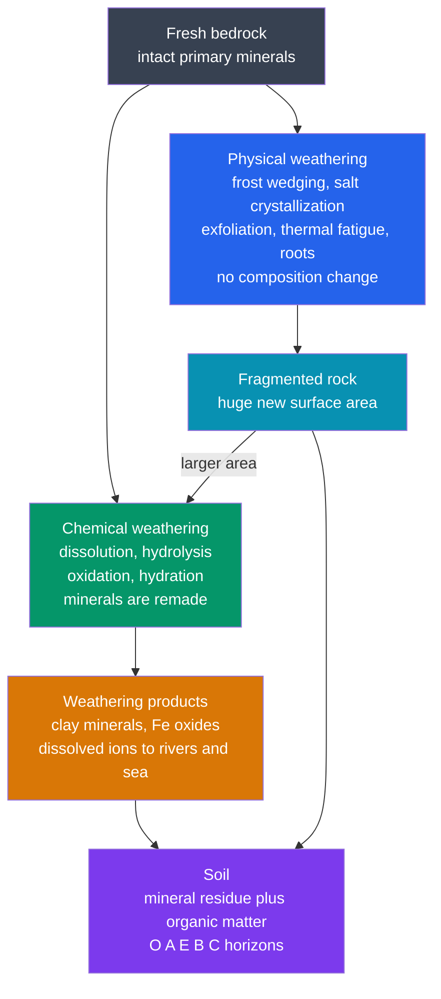

# 🍂 Weathering and Soils

> [!abstract] TL;DR
> **Weathering** is the *in-situ* breakdown of rock at or near Earth's surface — no transport required (that is [[Mass_Wasting_and_Slope_Stability|mass wasting]] and erosion). **Physical weathering** (frost wedging, salt crystallization, thermal fatigue, pressure-release exfoliation, root prying) shatters rock without changing its chemistry, multiplying the surface area exposed to attack. **Chemical weathering** (dissolution, **hydrolysis** of silicates to clay, oxidation to rust, hydration) actually *remakes* the minerals, following an Arrhenius-like temperature law so that warm, wet climates weather fastest. Mineral vulnerability follows the **Goldich series** — Bowen's crystallization order run backwards. The residue plus organic matter becomes **soil**, organized into O–A–E–B–C horizons by the **CLORPT** factors. At planetary scale, silicate weathering is Earth's long-term **CO₂ thermostat**, drawing down atmospheric carbon over millions of years.

## Intuition — analogy FIRST

Leave a brand-new cast-iron skillet outdoors for a decade. First, water seeps into a hairline crack, freezes overnight, and **wedges** the crack wider — the metal is being *broken* but it is still iron: that is **physical weathering**. Then the exposed surface turns orange and flaky as iron reacts with oxygen and water to become **rust** — a genuinely *new substance*: that is **chemical weathering**. The two feed each other: every fresh crack the frost opens gives the rust more surface to eat into. Rock does exactly this, only the "rust" is clay, iron oxide, and dissolved ions carried off to the sea — and the crumbly leftover, mixed with dead leaves and microbes, is **soil**.

---

## How It Works

Physical and chemical weathering are **coupled, not separate**: fracturing exposes surface area, and surface area is what chemical reactions consume. Their combined product — a mineral-plus-organic blanket — is soil.



---

### Secondary Level

**Weathering vs erosion.** Weathering *breaks down* rock where it sits; **erosion** *carries the pieces away*. A gravestone that pits and crumbles in place is weathering; a boulder rolling downhill is [[Mass_Wasting_and_Slope_Stability|mass wasting]].

**Physical (mechanical) weathering** — breaks rock, keeps its chemistry, increases surface area:

| Process | Mechanism |
|---------|-----------|
| Frost wedging | water in cracks freezes, expands ~9%, pries rock apart |
| Salt crystallization | evaporating salt grows crystals that push grains apart |
| Thermal / insolation | repeated heating–cooling fatigues the outer shell |
| Pressure-release exfoliation | unloading of overburden lets rock expand, peeling sheets |
| Biological (roots) | root growth wedges joints; burrowing mixes debris |

**Chemical weathering** — alters the minerals themselves. The four main reactions:

- **Dissolution** — soluble minerals go straight into solution (halite $\mathrm{NaCl}$; limestone via **carbonation**):
$$\mathrm{CaCO_3 + CO_2 + H_2O \rightarrow Ca^{2+} + 2HCO_3^-}$$
- **Hydrolysis** — water/acid attacks silicates, making clay (the master reaction, below).
- **Oxidation** — iron-bearing minerals "rust" to reddish iron oxides.
- **Hydration** — water is taken *into* the mineral structure.

**Controls on rate:** climate (heat + water), rock/mineral type, surface area, and time.

**Soil basics.** Soil = weathered **parent material** + **organic matter** + water + air, organized top-to-bottom into horizons **O, A, E, B, C** (organics → topsoil → leached → accumulation → parent rock).

### Undergraduate Level

**Hydrolysis — the master reaction of silicate weathering.** Weakly acidic rainwater ($\mathrm{H^+}$ from dissolved $\mathrm{CO_2}$) attacks feldspar, converting it to clay and releasing dissolved silica and base cations. For K-feldspar → kaolinite:

$$\mathrm{2\,KAlSi_3O_8 + 2\,H^+ + 9\,H_2O \rightarrow Al_2Si_2O_5(OH)_4 + 4\,H_4SiO_4 + 2\,K^+}$$

The acid comes from $\mathrm{CO_2 + H_2O \rightleftharpoons H_2CO_3 \rightleftharpoons H^+ + HCO_3^-}$, so weathering rate rises as $\mathrm{pH}$ falls — see [[Acids_Bases_and_pH]] and [[Silicate_Minerals]]. Products depend on leaching intensity: mild leaching yields smectite; intense tropical leaching strips even silica, leaving $\mathrm{Al}$ and $\mathrm{Fe}$ oxides ([[Sedimentary_Rocks_and_Environments|laterite/bauxite]]).

**Goldich stability series (1938) = Bowen's series reversed.** Minerals that crystallize *first and hottest* from magma are *least* stable at the cool, wet surface — see [[Magma_Generation_and_Bowens_Series]].

| Weathers fastest (least stable) | → | Weathers slowest (most stable) |
|---|---|---|
| olivine, Ca-plagioclase | pyroxene, amphibole, biotite, Na-plagioclase | K-feldspar, muscovite, **quartz** |

**Oxidation.** Ferrous $\mathrm{Fe^{2+}}$ in silicates or sulfides oxidizes to insoluble ferric oxides/hydroxides — the red-brown stain of weathered rock. Pyrite oxidation drives acid drainage:
$$\mathrm{2FeS_2 + 7O_2 + 2H_2O \rightarrow 2Fe^{2+} + 4SO_4^{2-} + 4H^+}, \qquad \mathrm{4Fe^{2+} + O_2 + 6H_2O \rightarrow 4FeOOH + 8H^+}$$

**Hydration** swells and weakens minerals, e.g. anhydrite → gypsum: $\mathrm{CaSO_4 + 2H_2O \rightarrow CaSO_4\!\cdot\!2H_2O}$.

**Rate law.** Chemical-weathering kinetics follow an **Arrhenius** temperature dependence (see [[Chemical_Kinetics]]):
$$k = A\,e^{-E_a/RT}, \qquad E_a \approx 40\text{–}80\ \mathrm{kJ\,mol^{-1}}$$
Near surface temperatures a $Q_{10}\approx 2$ means the rate roughly **doubles per 10 °C** of warming — but water (runoff) is a co-limiter: no water, no reaction ([[Solutions_and_Concentration]]). This is why the humid tropics weather fastest and cold deserts slowest.

**Soil formation — the CLORPT factors** (Jenny's 1941 state-factor equation, $S=f(cl,o,r,p,t)$): **Cl**imate, **O**rganisms, **R**elief, **P**arent material, **T**ime. Pedogenic processes — *eluviation* (loss from upper horizons), *illuviation* (accumulation below), *leaching*, and *humification* — sculpt the profile. Endmember soils: **Oxisols/laterites** (deeply leached tropical), **Aridisols** (dry, salt/carbonate-rich), **Spodosols** (acid, iron-podzolized).

### Graduate Level

**Weathering-limited vs transport-limited denudation.** In steep, rapidly uplifting terrain, erosion strips regolith faster than rock can weather, so soils are thin and bedrock is exposed — landscape lowering is **weathering-limited (supply-limited)**. In gentle, humid terrain, weathering outpaces removal, thick saprolite accumulates, and lowering is **transport-limited**. For the *chemical* flux specifically (West et al., 2005): at low erosion rates, minerals sit long enough to weather to completion — **supply-limited**; at high erosion rates, fresh mineral is always available and climate/kinetics set the rate — **kinetically-limited**.

**Cosmogenic-nuclide denudation rates.** In-situ $^{10}\mathrm{Be}$ produced in quartz accumulates in proportion to a grain's near-surface residence time; its concentration in stream sand gives **catchment-averaged denudation rates** integrated over $10^3$–$10^5$ yr, the workhorse for comparing weathering, soil production, and erosion.

**The carbonate–silicate (Urey) cycle — Earth's climate thermostat.** Silicate weathering consumes atmospheric $\mathrm{CO_2}$; carbonate precipitation in the ocean returns half of it, so net one $\mathrm{CO_2}$ is buried per $\mathrm{Ca}$. The schematic Urey reaction:
$$\mathrm{CaSiO_3 + CO_2 \rightarrow CaCO_3 + SiO_2}$$
Because the weathering rate rises with temperature and $p_{\mathrm{CO_2}}$, it forms a **negative feedback** (Walker, Hays & Kasting, 1981): warming → faster weathering → CO₂ drawdown → cooling, stabilizing climate over $10^5$–$10^6$ yr. Enhanced weathering of uplifted rock (Himalaya) or fresh flood basalts is invoked for long-term cooling and, when disrupted, for CO₂-driven [[Mass_Extinctions_and_Paleoclimate|mass extinctions and paleoclimate]] swings.

```python
# Arrhenius temperature dependence of chemical-weathering rate.
# Shows why warm, wet climates weather fastest (rate roughly doubles per 10 C).
import numpy as np

R  = 8.314          # J / (mol K)
Ea = 60_000.0       # J/mol  (typical silicate-weathering activation energy)

def rate(T_celsius, T_ref=15.0):
    """Weathering rate relative to a 15 C reference (Arrhenius)."""
    T  = T_celsius + 273.15
    Tr = T_ref     + 273.15
    return np.exp(-Ea / R * (1.0 / T - 1.0 / Tr))

for T in [0, 5, 15, 25, 30]:
    print(f"{T:2d} C  ->  relative rate {rate(T):.2f}")

# Effective Q10 near the reference temperature
Q10 = rate(25) / rate(15)
print(f"\nRate multiplier per +10 C near 15 C: {Q10:.2f}x")
# -> ~2x per 10 C, so tropical (25-30 C) weathers several times faster than boreal (0-5 C)
```

---

## Real-World Notes

- **Karst and caves.** Carbonation dissolves limestone along joints, carving sinkholes, caverns, and disappearing streams — the defining chemistry of [[Groundwater_and_Karst]].
- **Acid mine (rock) drainage.** Pyrite oxidation in exposed spoil generates sulfuric acid and iron staining, one of mining's most persistent water-quality problems.
- **Bauxite and laterite ores.** Extreme tropical hydrolysis leaches away silica and bases, concentrating residual $\mathrm{Al}$ and $\mathrm{Fe}$ oxides — the world's aluminium ore is a *weathering* deposit.
- **Decay of monuments.** Cleopatra's Needle weathered more in a century in polluted, freeze–thaw New York than in three millennia in dry Egypt — climate control on rate, live.
- **Spheroidal weathering.** Hydrolysis attacks a jointed block fastest at edges and corners, rounding it into onion-skin "core stones," a diagnostic outcrop texture.
- **Soil as a finite resource.** Soil forms at ~0.01–0.1 mm/yr but the Dust Bowl and modern tillage strip it far faster — an erosion-versus-formation imbalance with direct food-security stakes.

---

## Common Pitfalls

1. **Confusing weathering with erosion.** Weathering is *in-situ* breakdown; erosion/[[Mass_Wasting_and_Slope_Stability|mass wasting]] is *transport*. Dissolution is chemical *weathering*, not erosion, even though material moves in solution.
2. **Treating physical and chemical weathering as independent.** They are coupled: fracturing supplies the surface area that chemical reactions consume, so physical weathering *accelerates* chemical weathering.
3. **Frost wedging = "9% ice expansion" only.** Volumetric expansion matters, but the modern view emphasizes **ice segregation** and unfrozen-water films feeding growing ice lenses, most effective in a sustained frost-cracking window (roughly −3 to −8 °C), not a single hard freeze.
4. **Assuming quartz weathers like other silicates.** By the Goldich series quartz is nearly inert; olivine and Ca-plagioclase go first. That is why beach sand and residual soils are quartz-rich.
5. **Calling carbonate weathering a long-term CO₂ sink.** Only **silicate** weathering nets a permanent CO₂ drawdown; carbonate weathering releases the CO₂ back on reprecipitation, so it is roughly carbon-neutral over geologic time.
6. **Ignoring water as a co-limiter.** A hot but bone-dry desert weathers slowly; the Arrhenius rate needs liquid water present. Chemical weathering scales with *both* temperature and runoff.

---

## Related Concepts

- [[_MOC_Geomorphology|↑ Section MOC]]
- [[Mass_Wasting_and_Slope_Stability]] — weathered regolith is the material that then fails and moves downslope
- [[Rivers_and_Fluvial_Landscapes]] — rivers export dissolved ions and clay produced by weathering
- [[Glaciers_and_Glacial_Landscapes]] — glacial grinding produces fresh, high-surface-area rock flour that weathers rapidly
- [[Deserts_and_Aeolian_Processes]] — aridity limits chemical weathering; salt and thermal weathering dominate instead
- [[Coastal_Processes_and_Landforms]] — salt-spray and wetting–drying weathering shape sea cliffs and shore platforms
- [[Groundwater_and_Karst]] — carbonation-driven dissolution is the engine of karst landscapes
- [[Silicate_Minerals]] — the Goldich stability order is Bowen's series reversed; hydrolysis remakes silicates as clays
- [[Sedimentary_Rocks_and_Environments]] — weathering supplies the sediment and solutes that become sedimentary rock
- [[Mass_Extinctions_and_Paleoclimate]] — silicate-weathering feedback is Earth's long-term CO₂ thermostat
- [[Acids_Bases_and_pH]] — carbonic acid and pH set the pace of dissolution and hydrolysis (Chemistry)
- [[Chemical_Kinetics]] — the Arrhenius law behind temperature-controlled weathering rates (Chemistry)
- [[Solutions_and_Concentration]] — dissolution, saturation, and ion transport in weathering solutions (Chemistry)
- [[_MOC_Mathematics_Master]] — diffusion/reaction equations and geochronology statistics (Mathematics)

---

## Review Questions

1. **Secondary:** Distinguish physical from chemical weathering, and explain *why* physical weathering makes chemical weathering faster even though it changes no mineral's composition.
2. **Undergraduate:** Using the Goldich series and the Arrhenius rate law, predict which of two identical granite outcrops — one in humid Amazonia, one in the polar Dry Valleys of Antarctica — develops thicker clay-rich soil, and justify with both mineralogy and climate.
3. **Graduate:** Explain how the silicate-weathering feedback acts as a planetary thermostat. What quantities in the Urey cycle respond to temperature, why does this create a *negative* feedback, and over what timescale does it operate compared with the ocean carbon cycle?

---

## Sources

- White, A. F. & Brantley, S. L. (2003) — "The effect of time on the weathering of silicate minerals," *Chemical Geology* 202, 479.
- Goldich, S. S. (1938) — "A study in rock weathering," *Journal of Geology* 46, 17.
- Walker, J. C. G., Hays, P. B. & Kasting, J. F. (1981) — silicate-weathering climate feedback, *JGR* 86, 9776.
- West, A. J., Galy, A. & Bickle, M. (2005) — "Tectonic and climatic controls on silicate weathering," *EPSL* 235, 211.
- Jenny, H. (1941) — *Factors of Soil Formation* (the CLORPT state-factor model).
- Berner, R. A. (2004) — *The Phanerozoic Carbon Cycle: CO₂ and O₂* (carbonate–silicate cycle).

---

#earth-science #geomorphology #weathering #soils #hydrolysis #Goldich #CLORPT #carbon-cycle #secondary #undergraduate #graduate
