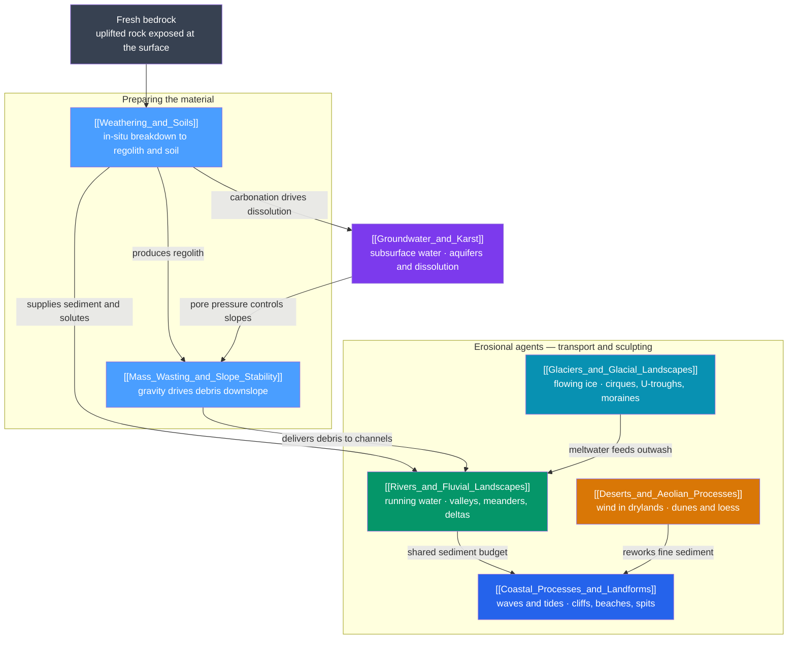

# 🏔️ Surface Processes & Geomorphology — Map of Content

> [!abstract] What This Section Covers
> Geomorphology is the study of how Earth's surface is sculpted — the ceaseless contest between tectonic uplift building relief and surface processes tearing it back down. This section follows material through the whole denudation system: first **weathering** breaks bedrock into regolith and soil, then **mass wasting** hauls that debris downslope under gravity, and finally the great erosional agents — **running water, flowing ice, wind, and waves** — transport, sort, and deposit it into the landforms we see. A parallel subsurface thread, **groundwater and karst**, dissolves rock from within and controls the pore pressures that make slopes fail. Every note opens with an everyday analogy, builds through undergraduate process theory, and reaches graduate-level quantitative treatment (Mohr–Coulomb strength, stream power, Glen's flow law, Bagnold transport, Airy wave theory, Darcy's law) with real-world hazards and climate connections throughout.

## Concept Map

*(Blue = foundations that prepare material; the agents in the middle band transport and sculpt it; groundwater threads through both. Arrows read as "supplies / leads to / controls.")*

## Learning Path

*Recommended order for a first pass through this section:*

1. [[Weathering_and_Soils]] — start here: how bedrock is broken down into the regolith, clay, and dissolved load that every later process moves.
2. [[Mass_Wasting_and_Slope_Stability]] — gravity is the first mover; the force balance that decides whether a slope holds or fails and delivers debris downhill.
3. [[Rivers_and_Fluvial_Landscapes]] — the dominant continental sculptor; erosion, transport, and deposition wired into a whole drainage basin.
4. [[Glaciers_and_Glacial_Landscapes]] — flowing ice as an erosive engine; mass balance, U-shaped troughs, moraines, and the ice-age legacy.
5. [[Deserts_and_Aeolian_Processes]] — aridity and wind; entrainment thresholds, saltation, dunes, and loess (with water still doing the heavy carving).
6. [[Coastal_Processes_and_Landforms]] — waves and tides at the land–sea boundary; longshore drift, erosional and depositional coasts, sea-level change.
7. [[Groundwater_and_Karst]] — the subsurface system; Darcy flow, aquifers, and the dissolution chemistry that carves caves and sinkholes.

## All Notes at a Glance

| Note | Core Idea | Difficulty |
|------|-----------|------------|
| [[Weathering_and_Soils]] | In-situ physical and chemical breakdown of rock into regolith and soil; the Goldich series, the CLORPT factors, and the silicate-weathering CO₂ thermostat | Secondary → Graduate |
| [[Mass_Wasting_and_Slope_Stability]] | Gravity-driven downslope movement; Mohr–Coulomb strength, the factor of safety, angle of repose, and pore-pressure-triggered failure | Secondary → Graduate |
| [[Rivers_and_Fluvial_Landscapes]] | Running water erodes, transports, and deposits across a drainage basin; discharge, the Hjulström curve, channel form, and stream-power incision | Secondary → Graduate |
| [[Glaciers_and_Glacial_Landscapes]] | Self-flowing ice governed by mass balance and the ELA; plucking and abrasion, moraines and outwash, Glen's flow law, and ice-sheet instability | Secondary → Graduate |
| [[Deserts_and_Aeolian_Processes]] | Aridity makes wind dominant; threshold friction velocity, saltation, dune types, loess, and rare-but-violent desert water | Secondary → Graduate |
| [[Coastal_Processes_and_Landforms]] | Waves, tides, and longshore drift build and carve the shore; Airy wave theory, sediment budgets, emergent/submergent coasts | Secondary → Graduate |
| [[Groundwater_and_Karst]] | Subsurface water flow and carbonate dissolution; Darcy's law, aquifers, karst caves and speleothems, overdraft hazards | Secondary → Graduate |

## Key Questions This Section Answers

- Why does breaking a rock into fragments (with no change in chemistry) make it dissolve and rot far faster?
- What actually makes a hillside fail — the added weight of rain, or something subtler in the physics of pore-water pressure?
- Why does a river drop its heaviest cargo first, and why is fine sand the *easiest* grain of all to pick up?
- How can a glacier be retreating while every ice crystal inside it is still flowing forward and downslope?
- Why are deserts defined by aridity rather than heat, and why is water — not wind — responsible for their grandest landforms?
- Why do waves carry energy toward the beach without carrying the water, and how does that single fact explain longshore drift and half of all coastal-engineering failures?
- Why is most of Earth's liquid freshwater underground, and how does faintly acidic groundwater hollow out entire cave systems?

## Related Sections

- [[_MOC_Earth_Science_Master|↑ Earth Science Master MOC]]
- [[_MOC_Rocks_Petrology|→ Rocks & Petrology]] — weathering supplies the sediment and solutes that become sedimentary rock; the surface end of the rock cycle
- [[_MOC_Plate_Tectonics|→ Plate Tectonics & Geodynamics]] — uplift creates the relief that surface processes then erode; the tectonics–erosion balance
- [[_MOC_Historical_Geology|→ Historical Geology & Deep Time]] — silicate-weathering feedback and glacial cycles pace long-term climate and mass extinctions

#MOC #EarthScience #Geomorphology
