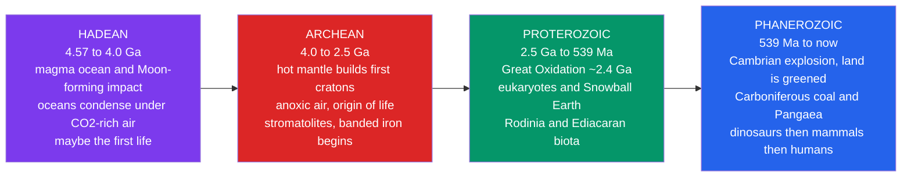

# 🌎 Earth's History: Hadean to Phanerozoic

> [!abstract] TL;DR
> Earth's **4.5-billion-year** history is divided into four **eons**. The **Hadean** (4.567–4.0 Ga) was a magma ocean world that suffered the Moon-forming impact and cooled to grow oceans under a $\text{CO}_2$-rich sky. The **Archean** (4.0–2.5 Ga) saw a hotter mantle build the first continental cratons, the origin of life, and the earliest fossils (stromatolites) under an anoxic atmosphere. The **Proterozoic** (2.5 Ga–539 Ma) was transformed by the **Great Oxidation Event** (~2.4 Ga), spanned the "boring billion," the rise of eukaryotes, the **Snowball Earth** glaciations, the Rodinia supercontinent, and the Ediacaran biota. The **Phanerozoic** (539 Ma–present) opened with the **Cambrian explosion** and runs through the greening of land, Carboniferous coal forests, Pangaea, the age of dinosaurs, and the age of mammals to humans. The unifying story is the **co-evolution of life, atmosphere, and climate**, orchestrated by **plate tectonics**.

## Intuition — analogy FIRST

Compress all 4.5 billion years into a single calendar year, with Earth's birth on **January 1**. Life appears by late **February**, but the air stays unbreathable until the **Great Oxidation Event around late March**. Then almost nothing visibly changes for months — the "boring billion" drags through summer. Complex animals do not burst onto the scene until **mid-November** (the Cambrian explosion). Dinosaurs rule from **mid-December to the 26th**, mammals inherit the last five days, and *all of recorded human history* is the final **few seconds before midnight** on December 31.

The lesson of the calendar is **deep time**: the Precambrian — Hadean plus Archean plus Proterozoic — is roughly **88%** of Earth's history yet is often reduced to a footnote, while the animal-rich Phanerozoic we study most is only the last **~12%**. Earth spent the overwhelming majority of its life as a microbial planet slowly rebuilding its own air.

---

## How It Works



---

## Key Concepts / Details

### Secondary Level

Earth history is split into **eons**, the largest divisions of the [[Geologic_Time_Scale]]. The first three eons together form the **Precambrian**.

| Eon | Age span | Share of history | Hallmark events |
|-----|----------|------------------|-----------------|
| **Hadean** | 4.567–4.0 Ga | ~12% | Magma ocean, Moon-forming impact, first oceans |
| **Archean** | 4.0–2.5 Ga | ~33% | First cratons, origin of life, stromatolites, anoxic air |
| **Proterozoic** | 2.5 Ga–539 Ma | ~43% | Great Oxidation, eukaryotes, Snowball Earth, Rodinia |
| **Phanerozoic** | 539 Ma–now | ~12% | Animals, land life, dinosaurs, mammals, humans |

**Hadean — the hellish beginning.** Earth accreted about **4.567 Ga** (see [[Earth_Formation_and_Differentiation]]) and was so hot it held a global magma ocean. A Mars-sized body struck it, throwing off the debris that built the **Moon**. As the surface cooled, steam condensed into the first **oceans** beneath a thick $\text{CO}_2$-rich atmosphere. Zircon crystals **4.4 billion years** old show liquid water and crust existed surprisingly early.

**Archean — the microbial world.** The mantle ran hotter, so early continents assembled into stable cores called **cratons**. The air had essentially **no free oxygen**. **Life originated** here: the oldest widely accepted fossils are **stromatolites** — layered mats built by microbes — dated to ~**3.48 Ga**. **Banded iron formations** (BIFs) began to accumulate.

**Proterozoic — the oxygen revolution.** Around **2.4 Ga**, oxygen produced by photosynthetic cyanobacteria finally accumulated in the air: the **Great Oxidation Event (GOE)**. Later came the first **eukaryotes** (cells with a nucleus), the first multicellular life, planet-wide **Snowball Earth** glaciations, the supercontinent **Rodinia**, and the soft-bodied **Ediacaran** organisms.

**Phanerozoic — "visible life."** Beginning **539 Ma**, animals with hard parts exploded onto the scene (the **Cambrian explosion**). Plants and then animals colonized land, Carboniferous swamps laid down **coal**, continents fused into **Pangaea**, **dinosaurs** dominated the Mesozoic, and after their extinction **66 Ma**, **mammals** rose in the Cenozoic — culminating in the ice ages and humans.

### Undergraduate Level

**The Great Oxidation Event and banded iron.** Before the GOE, the oceans held abundant dissolved **ferrous iron** ($\text{Fe}^{2+}$), stable only because the water was anoxic. As cyanobacteria pumped out $\text{O}_2$, iron was oxidized to insoluble **ferric** ($\text{Fe}^{3+}$) minerals that rained down as **banded iron formations**:

$$4\,\text{Fe}^{2+} + \text{O}_2 + 10\,\text{H}_2\text{O} \;\longrightarrow\; 4\,\text{Fe(OH)}_3 \downarrow + 8\,\text{H}^{+}$$

This is a **redox and solubility shift** — a change in which side of a chemical equilibrium is favored once an oxidant appears (see [[Chemical_Equilibrium]]). The oceans acted as a giant $\text{O}_2$ sink; only after most dissolved iron was exhausted (BIFs largely end by ~1.8 Ga) could oxygen build up in the **atmosphere**.

**The faint young Sun paradox.** Solar models say the early Sun shone at only ~**70%** of today's luminosity. The planet's equilibrium temperature scales as

$$T_{\text{eq}} = \left[\frac{L_\odot\,(1-\alpha)}{16\pi\sigma d^{2}}\right]^{1/4},$$

so a 30% dimmer Sun should have frozen Earth solid — yet the rock record shows **liquid water** throughout the Archean. The resolution is a much stronger **greenhouse** (high $\text{CO}_2$, plus $\text{CH}_4$ from methanogens), which kept the surface warm despite the faint Sun.

**Snowball Earth.** The Neoproterozoic **Cryogenian** hosted two near-global glaciations — the **Sturtian** (~717–660 Ma) and **Marinoan** (~650–635 Ma) — when ice may have reached the equator. A runaway **ice-albedo feedback** cools the planet as growing ice reflects more sunlight; escape required slow volcanic $\text{CO}_2$ buildup until a super-greenhouse melted the ice. Cap carbonates draping glacial deposits record the aftermath.

**Supercontinents and life.** The **Wilson Cycle** repeatedly assembled and rifted supercontinents — **Rodinia** (~1.1–0.75 Ga), later **Pangaea** (~335–175 Ma) — reshaping ocean circulation, weathering, and climate (see [[Wilson_Cycle_and_Supercontinents]]). Rodinia's breakup is implicated in triggering Snowball glaciations and, later, the oxygen rise that preceded animals.

**The Phanerozoic in three acts.**
- **Paleozoic (538.8–251.9 Ma):** Cambrian explosion of body plans; land greened by plants (~470 Ma) then colonized by arthropods and tetrapods; **Carboniferous** coal forests drove $\text{O}_2$ to ~**35%**, enabling giant insects; ended in the **Permian–Triassic** mass extinction (251.9 Ma), the largest in Earth history.
- **Mesozoic (251.9–66 Ma):** the age of **dinosaurs**; Pangaea rifted apart; ended with the **Chicxulub** impact at the **Cretaceous–Paleogene (K–Pg)** boundary.
- **Cenozoic (66 Ma–now):** the age of **mammals**; grasslands spread (C₄ grasses expand ~8 Ma); **Pleistocene** ice ages (2.58 Ma–11.7 ka); *Homo sapiens* appears ~300 ka.

### Graduate Level

**The evidence base — reading a tape with no eyewitnesses.** Deep-time history is reconstructed from **isotopic proxies** in rocks and fossils (isotopes are atoms of one element differing in neutron number; see [[Atomic_Structure_and_Subatomic_Particles]]):

- **Sulfur mass-independent fractionation (S-MIF).** Defined as $\Delta^{33}\text{S} = \delta^{33}\text{S} - 0.515\,\delta^{34}\text{S}$, non-zero values arise from $\text{SO}_2$ photolysis in an **ozone-free, anoxic** atmosphere. S-MIF is abundant before ~2.45 Ga and vanishes after — one of the sharpest fingerprints of the GOE.
- **Carbon isotopes** ($\delta^{13}\text{C}$). Positive excursions (e.g. the **Lomagundi** event, ~2.22–2.06 Ga) record massive organic-carbon burial and net $\text{O}_2$ release; sharp negative excursions mark the Snowball intervals.
- **Iron speciation and redox proxies** (Mo, U, Ce) track whether deep oceans were oxic, **ferruginous**, or sulfidic (**euxinic**) — showing the ocean interior stayed largely anoxic through the "boring billion."

**Great debate 1 — the timing and pace of oxygenation.** The GOE marks *atmospheric* oxygen crossing ~$10^{-5}$ of the present level, but "oxygen oases" and **whiffs** of $\text{O}_2$ appear in the late Archean, implying oxygenic photosynthesis evolved *well before* $\text{O}_2$ accumulated. The lag is set by **reduced sinks** (volcanic gases, dissolved $\text{Fe}^{2+}$) that had to be titrated first. A second, **Neoproterozoic Oxygenation Event** (~0.8–0.54 Ga) is argued to be the true trigger for large animals — though whether oxygen *permitted* or merely *coincided with* animal radiation is contested.

**Great debate 2 — causes of Snowball Earth.** Was it a hard **"snowball"** (fully frozen oceans) or a **"slushball"** with an open tropical seaway? Proposed triggers include Rodinia's low-latitude rifting boosting silicate weathering (a $\text{CO}_2$ drawdown), reduced solar luminosity, and biological feedbacks. Reconciling equatorial glacial deposits with the survival of eukaryotic life motivates the slushball alternative.

**Great debate 3 — triggers of the Cambrian explosion.** Candidate drivers include an **oxygen threshold** crossed by the NOE, the genetic novelty of **Hox regulatory networks**, ecological escalation (predator–prey arms races), and rising seawater chemistry favoring **biomineralization**. Most workers now favor a **multi-causal** interplay of environment, ecology, and development rather than any single cause.

**Recurring synthesis.** Across all four eons the same coupling recurs: **life** alters the **atmosphere** (oxygenation, methane), which alters **climate** (greenhouse, ice-albedo), while **plate tectonics** sets the boundary conditions — building continents, cycling carbon through weathering and volcanism, and moving landmasses in and out of climatic sensitivity.

```python
# Schematic rise of atmospheric O2 through geologic time.
#   y-axis: O2 as a fraction of the Present Atmospheric Level (PAL; 1 = ~21% O2)
#   x-axis: age in billions of years (Ga); present day = 0 on the right.
# Values are order-of-magnitude, drawn from proxy syntheses and GEOCARBSULF-style
# models -- schematic, NOT precise.
import numpy as np
import matplotlib.pyplot as plt

# (age_Ga, O2_in_PAL) control points, oldest first
age = np.array([4.0, 3.0, 2.5, 2.45, 2.30, 1.80, 1.00, 0.80,
                0.635, 0.54, 0.42, 0.30, 0.25, 0.05, 0.0])
o2  = np.array([1e-6, 1e-5, 1e-5, 1e-5, 1e-2, 1e-2, 1e-2, 2e-2,
                1e-1, 3e-1, 6e-1, 1.6, 0.7, 1.0, 1.0])

# Smooth interpolation in log-space (np.interp needs increasing x, so reverse)
fine  = np.linspace(age.min(), age.max(), 2000)
o2fit = 10 ** np.interp(fine, age[::-1], np.log10(o2[::-1]))

fig, ax = plt.subplots(figsize=(9, 5))
ax.plot(fine, o2fit, lw=2.5, color="#2563eb")
ax.set_yscale("log")
ax.invert_xaxis()                       # oldest on the left, present on the right
ax.axhline(1.0, color="gray", ls="--", alpha=0.5)      # present-day level
ax.axvspan(2.45, 2.30, color="orange", alpha=0.15)     # GOE

ax.annotate("Great Oxidation\nEvent ~2.4 Ga", xy=(2.35, 1e-2), xytext=(3.3, 6e-2),
            arrowprops=dict(arrowstyle="->"))
ax.annotate("Neoproterozoic\nrise ~0.6 Ga", xy=(0.6, 1e-1), xytext=(1.4, 5e-1),
            arrowprops=dict(arrowstyle="->"))
ax.annotate("Carboniferous\npeak ~35% O2", xy=(0.30, 1.6), xytext=(0.9, 1.3),
            arrowprops=dict(arrowstyle="->"))

ax.set_xlabel("Age (Ga before present)")
ax.set_ylabel("Atmospheric $O_2$ (fraction of present level, log scale)")
ax.set_title("Schematic rise of atmospheric oxygen through Earth history")
ax.grid(True, which="both", alpha=0.3)
plt.tight_layout()
plt.show()
```

---

## Real-World Notes

- **Living Archean analogs.** Modern **stromatolites** still grow in hypersaline Shark Bay (Western Australia); watching microbes build layered mounds today is our window onto 3.5-billion-year-old fossils.
- **BIFs are the world's iron.** The banded iron formations laid down around the GOE are the **primary ore** for the global steel industry — the Hamersley Basin and Lake Superior deposits are literally rusted early oceans.
- **Red beds and the visible GOE.** After ~2.4 Ga, oxidized **red-bed** sandstones and paleosols appear in the record, a color change you can see with the naked eye that marks a breathable-air threshold.
- **Carboniferous coal in your grid.** Much of the coal burned in power plants formed in Carboniferous swamp forests; the same high-$\text{O}_2$ air let **Meganeura** dragonflies reach 70 cm wingspans.
- **The K–Pg iridium anomaly.** A worldwide clay layer enriched in **iridium** (rare in the crust, common in asteroids) plus the buried **Chicxulub** crater pin the dinosaurs' end to an impact at 66 Ma — one of geology's great detective stories.
- **Ice ages made us.** *Homo* evolved during the oscillating **Pleistocene** glaciations; ice-core and marine-sediment climate records overlap the last stretch of human evolution.

---

## Common Pitfalls

1. **Equating "life appeared" with "oxygen appeared."** Life is **Archean** (~3.5 Ga or earlier); breathable oxygen is ~2 Gyr later at the GOE. *Fix:* keep the origin of life and the oxygenation of the air as two separate milestones.
2. **Assuming the GOE made a modern, fully oxic world.** It raised *atmospheric* $\text{O}_2$ to perhaps a few percent of today's level; the **deep ocean stayed anoxic** (ferruginous/euxinic) for another billion-plus years. *Fix:* distinguish surface air from ocean interior.
3. **Thinking cyanobacteria invented photosynthesis exactly at the GOE.** Oxygenic photosynthesis likely predates the GOE by hundreds of millions of years; the **lag** reflects reduced sinks consuming $\text{O}_2$ first. *Fix:* separate $\text{O}_2$ *production* from $\text{O}_2$ *accumulation*.
4. **Reading the timeline as proportional.** The Precambrian is ~**88%** of Earth history but often gets a single paragraph. *Fix:* respect deep time — the microbial eons dwarf the animal eon.
5. **Calling the Hadean uniformly "hellish and dry."** The 4.4 Ga **Jack Hills zircons** show liquid water and continental crust existed remarkably early. *Fix:* treat the Hadean as cooling and wet earlier than the old picture assumed.
6. **Stating Snowball Earth as a settled global freeze.** The **"snowball vs slushball"** extent and its triggers remain actively debated. *Fix:* present it as a strong but contested hypothesis.

---

## Related Concepts

- [[_MOC_Historical_Geology|↑ Section MOC]]
- [[Geologic_Time_Scale]] — the formal eon–era–period framework this narrative hangs on
- [[Relative_Dating_and_Stratigraphy]] — how the *order* of events was worked out before numeric ages
- [[Radiometric_Dating]] — the isotopic clocks that put absolute ages (Ga, Ma) on the story
- [[Fossils_and_the_Fossil_Record]] — the biological evidence tracing life from stromatolites to mammals
- [[Mass_Extinctions_and_Paleoclimate]] — the P–Tr and K–Pg crises that punctuate the Phanerozoic
- [[Earth_Formation_and_Differentiation]] — the accretion and magma-ocean world the Hadean inherited
- [[Wilson_Cycle_and_Supercontinents]] — Rodinia and Pangaea, the tectonic engine reshaping climate and life
- [[Geomagnetism_and_Paleomagnetism]] — paleomagnetism reconstructs where the continents sat through time
- **Chemistry** — [[Atomic_Structure_and_Subatomic_Particles]] (isotopes behind every proxy), [[Chemical_Equilibrium]] (the redox shift that made banded iron formations)
- **Mathematics** — [[_MOC_Mathematics_Master]] (log-scale interpolation and decay math behind the O₂ curve and the ages)
- **Biology** — [[_MOC_Biology_Master]] (the evolutionary radiations — Cambrian explosion, land colonization, mammals — in biological depth)

---

## Review Questions

1. **Secondary:** Name the four eons in order with their approximate age boundaries, and give one hallmark event of each. Roughly what fraction of Earth history is the Precambrian?
2. **Undergraduate:** Explain why banded iron formations accumulated when they did and largely ceased by ~1.8 Ga. How does the faint young Sun paradox constrain the composition of the early atmosphere?
3. **Graduate:** Sulfur mass-independent fractionation (S-MIF) disappears around 2.45 Ga. Explain the atmospheric chemistry that produces S-MIF, why its loss dates the GOE, and how the "whiffs of oxygen" reconcile with a later *accumulation* of atmospheric $\text{O}_2$.

---

## Sources

- Grotzinger & Jordan — *Understanding Earth*, 8th ed. (Earth history, GOE, Snowball Earth)
- Stanley & Luczaj — *Earth System History*, 4th ed. (eon-by-eon narrative)
- Knoll — *Life on a Young Planet* (Precambrian life and the oxygen transition)
- Lyons, Reinhard & Planavsky (2014) — "The rise of oxygen in Earth's early ocean and atmosphere," *Nature* 506, 307
- Hoffman et al. (2017) — "Snowball Earth climate dynamics and Cryogenian geology-geobiology," *Science Advances* 3, e1600983
- Marshak — *Earth: Portrait of a Planet*, 6th ed. (deep time and the geologic column)

#earth-science #historical-geology #deep-time #eons #great-oxidation-event #snowball-earth #cambrian-explosion #secondary #undergraduate #graduate
