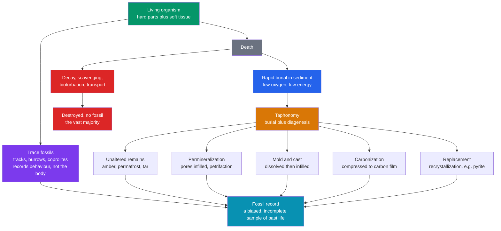

# 🦴 Fossils and the Fossil Record

> [!abstract] TL;DR
> A **fossil** is any preserved trace of ancient life — a shell, a bone, a leaf film, a footprint, even a molecule. **Taphonomy** (the study of decay, burial, and preservation) explains *which* organisms survive as fossils and which vanish: preservation strongly favours **hard parts** that are **rapidly buried** in [[Sedimentary_Rocks_and_Environments|sediment]], so the record is dominated by **marine, shelly, abundant, and geographically widespread** taxa. Soft-bodied life is nearly invisible except in rare **Lagerstätten** (Burgess Shale, Solnhofen). Fossils are then used three ways: as **index fossils** for [[Relative_Dating_and_Stratigraphy|biostratigraphic correlation]], as **paleoenvironmental/paleoclimate proxies**, and as the primary record of **evolution and the history of life**. Because the record is a *biased, incomplete sample*, graduate paleobiology corrects for it with **rarefaction**, **sampling standardization**, and confidence intervals that tame the **Signor–Lipps effect**.

## Intuition — analogy FIRST

Imagine trying to reconstruct a vanished city a million years later from its **garbage dumps** alone. Almost everything rots to nothing — bodies, wooden houses, cloth, food. What survives is the **hard, durable stuff** (pottery, coins, bone) that happened to be **buried quickly**, before scavengers, weather, and decay erased it, and only where a dump was actively piling up sediment. Your reconstruction is therefore lopsided: crammed with ceramics from the busy riverside market, and almost silent about the songbirds, the jellyfish-soft inhabitants, and the hilltop neighbourhoods that never dumped anything. You would badly *undercount* the rare and the soft, and *overcount* the common and the sturdy.

The fossil record is exactly this kind of biased garbage dump. It is not a fair census of past life but a **filtered sample** — and the single most important skill in paleontology is knowing *how* the filter distorts the picture so you can read the diary despite the missing pages.

---

## How It Works



---

## Key Concepts / Details

### Secondary Level

**What is a fossil?** Any evidence of past life preserved in the geologic record. By convention a specimen must be older than the **Holocene** (roughly older than ~10,000 years) to count as a fossil rather than a modern remain. Two great families exist:

- **Body fossils** — the organism itself (or a mineral copy of it): shells, bones, teeth, leaves, wood.
- **Trace fossils** (*ichnofossils*) — evidence of *behaviour*: footprints and trackways, burrows, borings, and **coprolites** (fossil dung). A trace fossil records what an animal *did*, not what it looked like.

**Taphonomy** is the study of everything that happens to an organism *between death and discovery* — decay, scavenging, transport, burial, chemical alteration, and re-exposure. Most organisms are recycled completely; fossilization is the rare exception.

**Modes of preservation:**

| Mode | Process | Example |
|------|---------|---------|
| **Unaltered remains** | original material trapped and sealed from decay | insect in **amber**, mammoth in **permafrost**, bones in **tar** |
| **Permineralization / petrifaction** | groundwater fills pore spaces with mineral (silica, calcite) | **petrified wood**, dinosaur bone |
| **Recrystallization / replacement** | original mineral is swapped atom-for-atom for another | shell aragonite → calcite; wood or shell → **pyrite** or silica |
| **Mold and cast** | shell dissolves leaving a cavity (**mold**); cavity later infilled (**cast**) | ammonite molds in limestone |
| **Carbonization / compression** | volatiles driven off, leaving a thin **carbon film** | leaves, graptolites, fish, soft *Burgess* animals |
| **Trace fossils** | sediment records activity | tracks, burrows, coprolites |

**What makes fossilization likely?** Three conditions dominate: possession of **hard parts** (shell, bone, wood), **rapid burial** in [[Sedimentary_Rocks_and_Environments|sediment]] (so scavengers and currents cannot destroy the body), and **low-oxygen** pore water (which slows the microbes of decay).

### Undergraduate Level

**The preservation filter and its biases.** Because the requirements above are so specific, the record is a *skewed sample* of past biodiversity. It over-represents organisms that are:

- **Marine** — continents mostly erode; ocean basins accumulate sediment;
- **Shelly / mineralized** — hard parts survive, soft bodies rot;
- **Abundant** — common species leave more specimens (a pure numbers game, see the demo);
- **Widespread and long-ranging** — broad geographic + stratigraphic reach raises the odds of intersecting a fossiliferous outcrop.

Soft-bodied and rare taxa are almost absent — except in **Lagerstätten**, deposits of exceptional preservation:

| Type | Meaning | Examples |
|------|---------|----------|
| **Konservat-Lagerstätte** | exceptional *quality* — soft tissue preserved | Burgess Shale, Chengjiang, Solnhofen, Messel |
| **Konzentrat-Lagerstätte** | exceptional *quantity* — bones concentrated | bone beds, shell coquinas |

**Index (guide) fossils and biostratigraphy.** A good **index fossil** is **widespread** (broad geography), **abundant** (easy to find), **short-lived** (narrow time range = high resolution), and **distinctive** (easy to identify). These properties let a species act as a time marker: wherever it occurs, that rock is the same age. Overlapping ranges of many taxa define **biozones**, and matching biozones between distant sections is **correlation** — the backbone of [[Relative_Dating_and_Stratigraphy|relative dating]] and the calibration of the [[Geologic_Time_Scale|geologic time scale]]. Classic zone fossils: **ammonites** and **graptolites** (basin-scale, rapidly evolving), **conodonts**, **foraminifera**, and **pollen** (microfossils for the subsurface).

**Fossils as environmental proxies.** *Facies fossils* indicate the depositional setting (reef corals ⇒ warm, clear, shallow marine); **stable isotopes** in shells and tests (e.g. $\delta^{18}\mathrm{O}$, $\delta^{13}\mathrm{C}$) record paleotemperature, ice volume, and the carbon cycle.

**Fossils as the record of evolution.** The record documents the major chapters of life: **stromatolites** and microfossils push the earliest life to ~3.5 Ga; the **Ediacaran biota** (~575 Ma) are the first large multicellular organisms; the **Cambrian explosion** (~539 Ma) marks the rapid appearance of animal body plans and mineralized skeletons; then the **colonization of land** by plants, then arthropods and tetrapods. **Transitional forms** — *Tiktaalik* (fish→tetrapod), *Archaeopteryx* (dinosaur→bird), the whale series — are direct documents of macroevolution (see the forward-linked [[_MOC_Biology_Master|Biology vault]]). Even **molecular fossils (biomarkers)** — degradation-resistant lipids such as steranes, hopanes, and oleanane — record whole clades (eukaryotes, cyanobacteria, angiosperms) long after their bodies dissolved.

### Graduate Level

**Quantifying incompleteness.** The record's biases are not a nuisance to lament but a *sampling process to model*. Two workhorses:

**1. Rarefaction (the collector's curve).** Observed richness climbs with sampling effort, so raw counts confound diversity with effort. Rarefaction estimates the expected number of species $E[S_n]$ in a random subsample of $n$ specimens drawn from a collection of $N$ specimens and $S$ species with counts $N_i$ (Hurlbert 1971):

$$E[S_n] \;=\; \sum_{i=1}^{S}\left[\,1 - \frac{\dbinom{N-N_i}{n}}{\dbinom{N}{n}}\,\right]$$

Comparing samples at **equal $n$** removes the effort bias. Modern **coverage-based rarefaction** and Alroy's **shareholder quorum subsampling (SQS)** standardize by *sampling completeness* rather than raw count — reshaping the entire Phanerozoic marine diversity curve derived from the Paleobiology Database.

**2. Detection probability.** If a taxon occupies a fraction of localities and is preserved with per-locality probability $q$, then across $L$ independent fossiliferous localities:

$$P(\text{recovered}) \;=\; 1 - (1-q)^{L}$$

Rare taxa (small $q$) go undetected until $L$ is large — the arithmetic behind ghost lineages and pull-of-the-recent effects.

**The Signor–Lipps effect.** Because sampling is incomplete, a taxon's **last observed occurrence almost always predates its true extinction**. At a mass-extinction boundary this smears an instantaneous, catastrophic event into an *apparent gradual decline* leading up to the boundary (Signor & Lipps 1982). The correction: place **confidence intervals** on stratigraphic ranges. Under uniform, random fossil horizons, the classical Strauss–Sadler (1989) interval extends a taxon's true endpoint beyond its observed range $R$ by

$$\gamma \;=\; R\left[(1-C)^{-1/(H-1)} - 1\right]$$

for confidence level $C$ and $H$ fossil horizons. More horizons ⇒ tighter bounds. Bayesian **fossilized birth–death (FBD)** models now integrate sampling, speciation, and extinction jointly, letting the incompleteness be estimated rather than assumed away.

```python
# Preservation/sampling bias: why the fossil record undercounts rare taxa.
# (1) each species gets a detection probability set by abundance + effort;
# (2) build a rarefaction (collector's) curve of observed vs true richness.
import numpy as np
rng = np.random.default_rng(42)

# A model community: many rare species, few abundant ones (lognormal SAD).
S_true = 300
abundance = rng.lognormal(mean=3.0, sigma=1.5, size=S_true)
p_species = abundance / abundance.sum()        # relative abundance

# (1) Detection model: over L localities, P(found) = 1 - (1 - q*p)^L,
#     where q is per-locality preservation potential (hard parts, burial).
def detection_prob(p, q, L):
    return 1.0 - (1.0 - q * p) ** L

q = 0.3
rarest = np.argsort(p_species)[: S_true // 10]  # rarest 10% of species
for L in (1, 10, 100):
    found = detection_prob(p_species, q, L)
    print(f"L={L:>3} localities -> expected taxa recovered: "
          f"{found.sum():6.1f}/{S_true}   "
          f"rarest-decile P(found)={found[rarest].mean():.3f}")

# (2) Rarefaction: draw fossil occurrences weighted by abundance*preservation
#     and count how many DISTINCT species have appeared after n specimens.
weights = (q * p_species) / (q * p_species).sum()
draws = rng.choice(S_true, size=5000, p=weights)
seen = set()
print("\nRarefaction curve (specimens sampled -> species observed):")
for n, sp in enumerate(draws, 1):
    seen.add(sp)
    if n in (10, 100, 1000, 5000):
        print(f"  {n:>5} specimens -> {len(seen):>3} species "
              f"({100*len(seen)/S_true:4.1f}% of true richness)")

# Expected pattern: rarest-decile P(found) is near 0 at L=1 and rises with L;
# the rarefaction curve climbs steeply then flattens, never reaching S_true --
# common species saturate first, rare ones keep the count perpetually short.
```

---

## Real-World Notes

- **Biostratigraphy runs the oil industry.** Correlating well cores relies on **microfossils** — foraminifera, nannofossils, and **palynology** (pollen/spores) — because they are abundant in tiny rock chips; this is often the fastest, cheapest way to date and correlate subsurface strata.
- **The Burgess Shale and Chengjiang** (Konservat-Lagerstätten) preserve soft-bodied Cambrian animals as carbon films, revealing body plans that the normal shelly record cannot show — the main empirical window on the Cambrian explosion.
- **Deep-sea foraminifera and $\delta^{18}\mathrm{O}$** in ocean-drilling cores give the continuous Cenozoic paleoclimate curve, resolving glacial–interglacial cycles and long-term cooling.
- **Stromatolites** (microbial carbonate layers) are among the oldest evidence of life (~3.5 Ga, Pilbara, Australia) and still form today at Shark Bay — a living calibration of an ancient fossil type.
- **Amber inclusions** preserve insects and even feathers in exquisite 3-D, but **ancient DNA degrades** on ~10^5–10^6-year timescales, so "dinosaur DNA from amber" is fiction; genuine aDNA reaches back only into the Pleistocene.
- **The Paleobiology Database + sampling standardization** (Alroy et al.) overturned the raw diversity curve: much of the apparent Phanerozoic diversity rise reflects better sampling of younger rocks, not simply more species.

---

## Common Pitfalls

1. **Absence of evidence ≠ evidence of absence.** A gap in a taxon's record is usually a sampling failure, not a true absence — hence *ghost lineages* inferred from phylogeny and the whole logic of the [[Mass_Extinctions_and_Paleoclimate|Signor–Lipps]] correction.
2. **Reading raw diversity curves uncorrected.** Apparent diversity tracks **rock area, outcrop, and sampling effort** as much as biology (the "common cause" / rock-record bias). Always compare at standardized sampling.
3. **Confusing the trace with the tracemaker.** A trace fossil names a *behaviour*, not a species: one animal makes many ichnotaxa (a resting mark, a trackway, a burrow), and similar traces can be made by unrelated animals.
4. **Assuming a fossil is the original organism.** Most body fossils are **replaced or permineralized** — "petrified wood" is quartz, not wood; a pyritized ammonite is fool's gold shaped like a shell.
5. **Ignoring time-averaging.** A single fossil bed can blend generations to millennia of organisms into one assemblage; it is a *time-averaged* accumulation, not a snapshot census of a single instant.
6. **Over-reading first/last appearances.** Because of the preservation filter, first appearances postdate true origins and last appearances predate true extinctions — never equate an observed range with a true range without confidence intervals.

---

## Related Concepts

- [[_MOC_Historical_Geology|↑ Section MOC]]
- [[Geologic_Time_Scale]] — the biozones defined by index fossils are the fabric of the Phanerozoic time scale
- [[Relative_Dating_and_Stratigraphy]] — superposition and faunal succession let fossils correlate and order strata
- [[Radiometric_Dating]] — supplies the *absolute* ages that calibrate biostratigraphic zones to years
- [[Earths_History_Hadean_to_Phanerozoic]] — fossils are the primary evidence for the narrative of deep time
- [[Mass_Extinctions_and_Paleoclimate]] — reading extinctions from the record requires the Signor–Lipps correction
- [[Sedimentary_Rocks_and_Environments]] — nearly all fossils are preserved in sediment; facies control what is recorded (same vault)
- [[_MOC_Biology_Master]] — fossils are the historical evidence for evolution and macroevolutionary transitions (cross-vault: Biology, planned)
- [[_MOC_Mathematics_Master]] — rarefaction, binomial detection models, and range confidence intervals rest on combinatorics and statistics (cross-vault: Math)

---

## Review Questions

1. **Secondary:** You have a jellyfish and a clam living in the same lagoon. Which is far more likely to become a fossil, and why? List the three conditions that most favour preservation.
2. **Undergraduate:** What four properties make a good index fossil, and why does each one matter for correlation? Explain why the fossil record over-represents marine, shelly, abundant taxa.
3. **Graduate:** State the Signor–Lipps effect and explain how it can make a geologically instantaneous mass extinction appear as a gradual decline. Describe one quantitative method (confidence intervals or sampling standardization) that corrects for it, and what assumptions it requires.

---

## Sources

- Prothero — *Bringing Fossils to Life: An Introduction to Paleobiology*, 3rd ed.
- Benton & Harper — *Introduction to Paleobiology and the Fossil Record*, 2nd ed.
- Foote & Miller — *Principles of Paleontology*, 3rd ed.
- Signor & Lipps (1982) — "Sampling bias, gradual extinction patterns and catastrophes in the fossil record," *GSA Special Paper* 190
- Strauss & Sadler (1989) — "Classical confidence intervals and Bayesian probability estimates for ends of local taxon ranges," *Math. Geology* 21, 411
- Alroy et al. (2008) — "Phanerozoic trends in the global diversity of marine invertebrates," *Science* 321, 97

#earth-science #historical-geology #paleontology #taphonomy #fossils #biostratigraphy #lagerstatten #secondary #undergraduate #graduate
