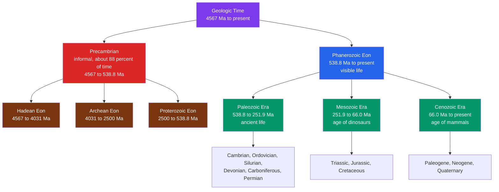

# ⏳ The Geologic Time Scale

> [!abstract] TL;DR
> The **geologic time scale (GTS)** is the calendar of Earth history — a nested hierarchy of **eons → eras → periods → epochs → ages** that partitions the **4.567 billion years** since Earth formed. It was built *twice over*: first as a purely **relative** sequence from superposition and fossil succession (which layer is younger, older), then **calibrated to absolute ages in millions of years (Ma)** by [[Radiometric_Dating|radiometric dating]]. Most major boundaries mark **biotic turnovers** — the base of the Phanerozoic ("visible life", 538.8 Ma) and the great [[Mass_Extinctions_and_Paleoclimate|mass extinctions]]. The **Precambrian** — Hadean, Archean, Proterozoic together — is ~88% of all time yet has almost no visible fossils. At graduate level the scale splits into **chronostratigraphy** (rock: *System*) versus **geochronology** (time: *Period*), boundaries are pinned by **GSSP "golden spikes"**, and **astrochronology** tunes it to Milankovitch orbital cycles.

## Intuition — analogy FIRST

Deep time is the hardest idea in geology because human intuition tops out around a few generations. So collapse the whole 4.567-billion-year history into **one calendar year**: Earth forms at the stroke of **midnight on January 1**, and *right now* is the final instant of **December 31**.

On that calendar, single-celled life appears in **late February**, but nothing you could see with the naked eye exists until the **Cambrian explosion around November 18**. Dinosaurs rule from mid-December and vanish on **December 26**. Our entire species, *Homo sapiens*, shows up in the **last half hour before midnight on December 31**, and all of recorded human history — every pyramid, empire, and equation — fits in the **final minute**. Each calendar day is about **12.5 million years**. That visceral mismatch — a species that has existed for seconds trying to comprehend a planet billions of years old — *is* the geologic time scale.

---

## How It Works



The hierarchy is strictly **nested**: every period belongs to exactly one era, every era to one eon. Finer subdivisions continue below periods into **epochs** (e.g., Pleistocene, Holocene) and **ages** (the finest formal unit).

### Secondary Level

**The four eons.** All of time divides into four eons; the first three are lumped informally as the **Precambrian**.

| Eon | Age (Ma) | Duration (Myr) | Signature |
|-----|----------|----------------|-----------|
| Hadean | 4567–4031 | ~536 | molten Earth, Moon-forming impact, no rock record |
| Archean | 4031–2500 | ~1531 | first life, oceans, first continents |
| Proterozoic | 2500–538.8 | ~1961 | Great Oxidation, eukaryotes, "Snowball Earth" |
| **Phanerozoic** | 538.8–present | ~539 | abundant, visible, shelly life |

The Precambrian spans $4567 - 538.8 = 4028$ Myr — about $88\%$ of Earth history — yet fills only the bottom sliver of most classroom charts.

**The Phanerozoic eras and periods.** These are the units you memorize. A classic mnemonic for the Paleozoic periods (Cambrian → Permian) is *"Camels Ordinarily Sit Down Carefully; Perhaps Their Joints Creak"* (which runs on through the Mesozoic and Cenozoic).

| Era | Period | Base age (Ma) | Landmark event |
|-----|--------|--------------:|----------------|
| **Paleozoic** | Cambrian | 538.8 | Cambrian explosion of animal phyla |
| | Ordovician | 485.4 | first land plants; end-Ord. extinction |
| | Silurian | 443.8 | reefs, jawed fish |
| | Devonian | 419.2 | "age of fishes"; forests spread |
| | Carboniferous | 358.9 | coal swamps; amniote eggs |
| | Permian | 298.9 | ends in the **P–Tr** great dying |
| **Mesozoic** | Triassic | 251.9 | recovery; first dinosaurs and mammals |
| | Jurassic | 201.4 | giant dinosaurs; first birds |
| | Cretaceous | 145.0 | flowering plants; ends at **K–Pg** |
| **Cenozoic** | Paleogene | 66.0 | mammals radiate after the asteroid |
| | Neogene | 23.03 | grasslands, hominins |
| | Quaternary | 2.58 | Ice Ages; genus *Homo* |

### Undergraduate Level

**Built relatively first, dated absolutely later.** The 19th-century pioneers (Smith, Sedgwick, Murchison, Lyell) had *no* clocks. They ordered strata using two principles from [[Relative_Dating_and_Stratigraphy]]:

- **Superposition** — in undisturbed layers, deeper = older.
- **Faunal succession** — fossil assemblages follow a fixed, worldwide order, so [[Fossils_and_the_Fossil_Record|index fossils]] correlate rocks between continents.

This produced the *relative* column — the *sequence* of periods — decades before anyone knew a single number in years. Only after 1905 did [[Radiometric_Dating|radiometric dating]] hang **absolute ages** on the boundaries, and those ages are still being refined to this day. So the GTS is a **relative framework calibrated by absolute geochronology**, not one or the other.

**Boundaries are biological.** The system's greatest divisions are *not* arbitrary round numbers; they are **turnovers in life**. The Phanerozoic begins with the first abundant skeletonized fauna; the Paleozoic–Mesozoic boundary is the **end-Permian extinction** (~96% of marine species lost); the Mesozoic–Cenozoic boundary is the **K–Pg extinction** that ended non-avian dinosaurs. This is why the chart's biggest lines coincide with the events in [[Mass_Extinctions_and_Paleoclimate]].

**GSSPs — the golden spikes.** Since the 1970s the **International Commission on Stratigraphy (ICS)** defines each boundary by a **Global Boundary Stratotype Section and Point (GSSP)**: a physical golden spike hammered into one specific, agreed rock outcrop that marks the *base* of a stage worldwide. The published product is the **International Chronostratigraphic Chart**, revised every few years — always check the current version, because boundary ages *move*.

### Graduate Level

**Chronostratigraphy versus geochronology.** The scale is really *two parallel hierarchies* — one of **rock**, one of **time** — and conflating them is a classic error.

| Chronostratigraphy (rock) | Geochronology (time) | Example |
|---------------------------|----------------------|---------|
| Eonothem | Eon | Phanerozoic |
| Erathem | Era | Mesozoic |
| **System** | **Period** | Jurassic |
| Series | Epoch | Upper / Late Jurassic |
| **Stage** | **Age** | Tithonian |

You say *"the Jurassic **System**"* for the layers of rock you can touch, but *"the Jurassic **Period**"* for the interval of time they represent. A GSSP defines the base of a **stage** (rock); its calibrated numerical value defines the base of the corresponding **age** (time).

**GSSP versus GSSA.** Where suitable fossil-bearing rock exists (most of the Phanerozoic), boundaries are **GSSPs** anchored in outcrop. In the deep Precambrian, no correlatable strata exist, so many boundaries are **GSSAs (Global Standard Stratigraphic Ages)** — boundaries defined by a *chosen round number* of years (e.g., Archean–Proterozoic at exactly 2500 Ma) rather than a rock horizon.

**Astrochronology and cyclostratigraphy.** The most precise modern tuning uses **Milankovitch cycles** — periodic changes in Earth's orbit imprinted as rhythmic sediment layering. The dominant frequencies are eccentricity ($\sim100$ and $405$ kyr), obliquity ($\sim41$ kyr), and precession ($\sim21$ kyr). The **405-kyr eccentricity cycle** (driven by the $g_2 - g_5$ term of the Venus–Jupiter interaction) is the "metronome," astronomically stable back to at least ~250 Ma. Counting these cycles against orbital solutions (Laskar's La2004/La2010/La2011) yields an **astronomically tuned time scale** with resolution approaching $\pm 0.1\%$ — far sharper than radiometric ages alone.

**The proposed Anthropocene.** A working group proposed a new **Anthropocene Epoch** with a GSSP at Crawford Lake, Ontario, its base set by the mid-20th-century plutonium spike from nuclear tests. In **March 2024** the ICS Subcommission on Quaternary Stratigraphy **rejected** the formal proposal; the term remains a widely used but *informal* concept.

```python
from datetime import datetime, timedelta

EARTH_AGE_MA = 4567.0  # age of Earth, in millions of years (Ma)

# Key events dated in Ma (millions of years before present).
events = [
    ("Earth forms (accretion)",   4567.0),
    ("Oldest evidence of life",   3700.0),
    ("Great Oxidation Event",     2400.0),
    ("First eukaryotic cells",    1650.0),
    ("Cambrian explosion",         538.8),
    ("First land plants",          470.0),
    ("First dinosaurs",            230.0),
    ("K-Pg mass extinction",        66.0),
    ("Genus Homo appears",           2.8),
    ("Homo sapiens appears",         0.30),   # ~300 ka
    ("End of last ice age",          0.0117), # ~11.7 ka
    ("Now",                          0.0),
]

# Compress ALL of Earth history onto a single non-leap calendar year:
# Jan 1 00:00 == 4.567 Ga (formation);  Dec 31 24:00 == present.
YEAR_START = datetime(2025, 1, 1)
SEC_PER_YEAR = 365 * 24 * 3600

def elapsed_fraction(age_ma):
    return 1.0 - age_ma / EARTH_AGE_MA        # 0 at formation, 1 today

def to_calendar(age_ma):
    return YEAR_START + timedelta(seconds=elapsed_fraction(age_ma) * SEC_PER_YEAR)

def to_clock24(age_ma):                        # same history on a 24-hour clock
    total = elapsed_fraction(age_ma) * 24 * 3600
    h, rem = divmod(int(total), 3600)
    m, s = divmod(rem, 60)
    return f"{h:02d}:{m:02d}:{s:02d}"

print(f"1 calendar day  = {EARTH_AGE_MA/365:6.1f} Myr")
print(f"1 clock hour    = {EARTH_AGE_MA/24:6.1f} Myr\n")
print(f"{'Event':24s}{'Age (Ma)':>10s}   {'Calendar':>10s}   {'24h clock'}")
print("-" * 62)
for name, age in events:
    print(f"{name:24s}{age:>10.4g}   {to_calendar(age):%b %d}    {to_clock24(age)}")

# Expected highlights: life ~ mid-March, Cambrian ~ Nov 18,
# dinosaurs die ~ Dec 26, Homo sapiens ~ Dec 31 23:25 -- last ~35 minutes.
```

---

## Real-World Notes

- **The ICS chart is a living document.** Boundary ages are revised as dating improves — the base of the Cambrian, long quoted as 542 Ma, is now **538.8 Ma**. Always cite the chart version; textbooks quickly go stale.
- **Petroleum and coal exploration** runs on the time scale: source rocks, reservoirs, and seals are correlated by **biostratigraphy** (microfossils) tied to the GTS, so a driller can predict what lies kilometres down from cuttings.
- **The "golden spike" at Meishan, China** physically defines the Permian–Triassic base and the greatest extinction in the record — a single bed you can put your finger on.
- **Deep time as a public-communication tool.** Sagan's "Cosmic Calendar" and John McPhee's coinage of *"deep time"* both use exactly the year/clock compression in the demo above to make 4.5 Gyr graspable.
- **Astrochronology now dates the Cenozoic** almost entirely by orbital tuning, giving epoch boundaries (e.g., the Paleocene–Eocene Thermal Maximum) to within a few thousand years.
- **Mars and the Moon have their own time scales** (Noachian/Hesperian/Amazonian; pre-Nectarian onward) built from crater-counting rather than fossils — the *method* differs but the *nesting logic* is identical.

---

## Common Pitfalls

1. **Thinking the eons are equal.** The Precambrian is ~88% of time; the Phanerozoic (all "familiar" life) is the last ~12%. Charts drawn to scale barely show the Phanerozoic at all.
2. **Confusing "Period" with "System."** *Period* is an interval of **time** (geochronology); *System* is the body of **rock** deposited during it (chronostratigraphy). Use the right word for the right object.
3. **Treating ages as fixed constants.** Boundary ages are *revised* as dating and astrochronology improve. Memorizing "541 Ma" for the Cambrian base without a source dates you instantly.
4. **Assuming the scale is purely radiometric.** The *sequence* of periods was fixed by relative dating (superposition, fossils) long before any absolute ages existed; radiometry *calibrated* an existing framework.
5. **Believing boundaries are arbitrary.** The major divisions are pinned to **biotic turnovers** — mostly mass extinctions — not to round numbers (except Precambrian GSSAs).
6. **Calling the Anthropocene a formal epoch.** As of the 2024 ICS vote it is **informal**; the Holocene remains the current formal epoch of the Quaternary.

---

## Related Concepts

- [[_MOC_Historical_Geology|↑ Section MOC]]
- [[Relative_Dating_and_Stratigraphy]] — superposition and faunal succession, which built the *relative* column first
- [[Radiometric_Dating]] — the isotopic clocks that hung *absolute* ages (in Ma) on the boundaries
- [[Fossils_and_the_Fossil_Record]] — index fossils correlate strata worldwide and define most boundaries
- [[Earths_History_Hadean_to_Phanerozoic]] — the narrative that fills the framework this note lays out
- [[Mass_Extinctions_and_Paleoclimate]] — the biotic turnovers that mark the era and period boundaries
- [[The_Rock_Cycle]] — Hutton's endless recycling is where the concept of *deep time* was born
- [[Wilson_Cycle_and_Supercontinents]] — supercontinent assembly and breakup punctuate the same deep-time record
- [[_MOC_Mathematics_Master]] — orbital solutions, cycle-counting, and statistics behind astrochronology (Mathematics vault)
- [[_MOC_Biology_Master]] — evolution and the tree of life read against this timeline (Biology vault, planned)

---

## Review Questions

1. **Secondary**: List the four eons oldest-to-youngest with their approximate ages, name the three eras of the Phanerozoic, and give the six periods of the Paleozoic in order. Roughly what fraction of Earth history is the Precambrian?
2. **Undergraduate**: Explain how geologists established the *sequence* of the periods before any absolute ages were known, and how radiometric dating later fit in. Why do the major boundaries fall at mass extinctions rather than at round-number ages?
3. **Graduate**: Distinguish chronostratigraphy from geochronology using the Jurassic as an example, and contrast a GSSP with a GSSA. How does astrochronology using the 405-kyr eccentricity cycle refine boundary ages beyond the precision of radiometric dating alone?

---

## Sources

- Cohen, K. M. et al. — *The ICS International Chronostratigraphic Chart* (updated periodically; stratigraphy.org)
- Gradstein, F. M. et al. (eds.) — *Geologic Time Scale 2020* (GTS2020), Elsevier
- Laskar, J. et al. (2004) — "A long-term numerical solution for the insolation quantities of the Earth," *Astronomy & Astrophysics* 428, 261
- Hilgen, F. J. et al. — "Astrochronology" chapters in GTS2020
- Marshak, S. — *Earth: Portrait of a Planet*; Grotzinger & Jordan — *Understanding Earth*
- Subcommission on Quaternary Stratigraphy (2024) — decision on the proposed Anthropocene Series/Epoch

---

#earth-science #historical-geology #geologic-time-scale #deep-time #chronostratigraphy #eons #eras #periods #GSSP #astrochronology #secondary #undergraduate #graduate
