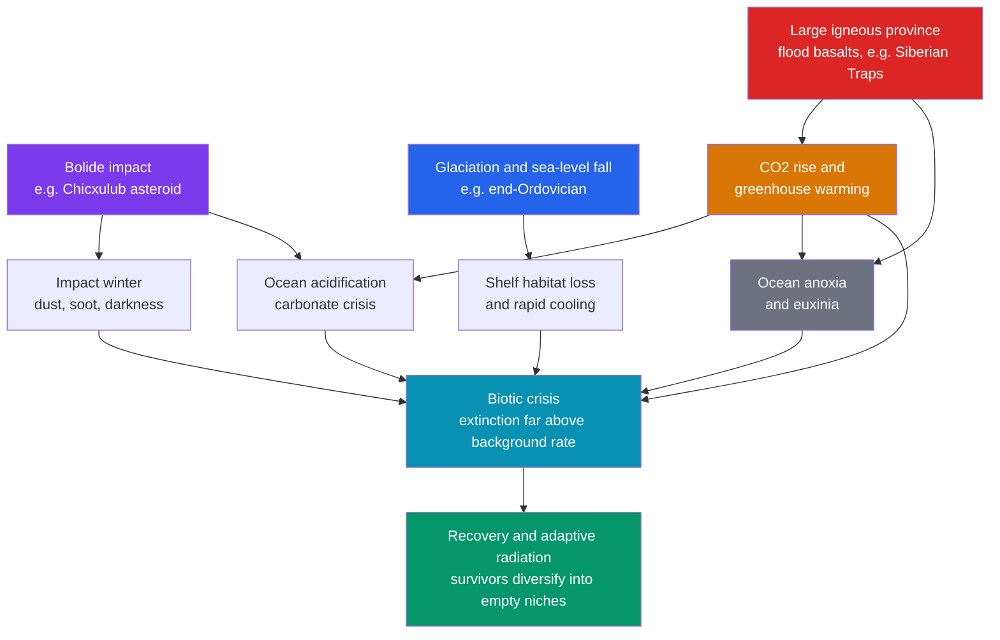

# ☄️ Mass Extinctions and Paleoclimate

> [!abstract] TL;DR
> A **mass extinction** is a sharp, global, taxonomically broad collapse of biodiversity *well above the background rate* — five such events (the **"Big Five"**) punctuate the Phanerozoic. The greatest, the **end-Permian "Great Dying"** (~252 Ma), erased ~90–96% of marine species and is pinned to the **Siberian Traps** flood basalts; the most famous, the **end-Cretaceous K–Pg** (~66 Ma), killed the non-avian dinosaurs and left a global **iridium anomaly**, **shocked quartz**, and **tektites** from the **Chicxulub** impact (with the **Deccan Traps** as accomplice). The same rocks record Earth's **climate history** — reconstructed from proxies like the oxygen-isotope ratio $\delta^{18}\mathrm{O}$ in [[Fossils_and_the_Fossil_Record|foraminifera]] and ice cores — swinging between **hothouse** and **icehouse** states, through **Snowball Earth**, the **PETM**, and the **Milankovitch**-paced ice ages. Today's biodiversity loss raises the question of a **sixth mass extinction**, with deep-time climate crises as the closest analogues for the modern carbon spike.

## Intuition — analogy FIRST

Think of Earth's history as a very long-running theatre company. Actors (species) leave the stage all the time — a slow, steady trickle of retirements that is the **background extinction rate**. A **mass extinction** is not that trickle: it is the night the **theatre catches fire** and most of the cast is lost at once, across every role — leads, extras, orchestra, ushers — in a geological instant. Whole *kinds* of actor vanish together, and the play that resumes afterwards has a completely different cast (mammals only got the lead after the dinosaurs' fire).

Now imagine the theatre keeps a **thermostat log** scrawled on its walls — a chemical diary of how hot or cold the building was, written in the isotopes of shells and ice. Reading that diary shows the fires almost always coincide with the thermostat swinging violently: a runaway heater (volcanic $\mathrm{CO_2}$), a sudden blackout (an impact winter), or the pipes freezing solid (a global glaciation). The lesson of deep time is blunt — **when the climate lurches fast, the cast dies**.

---

## How It Works



---

## Key Concepts / Details

### Secondary Level

**What defines a mass extinction?** Three things at once: it is **sharp** (fast in geological terms), **global** (not one region or habitat), and **taxonomically broad** (many unrelated groups die, not just one). Crucially, the loss must sit **well above the background rate** — the ordinary trickle of extinctions that runs continuously through the [[Geologic_Time_Scale|geologic record]].

**The Big Five.** Statistically identified from marine [[Fossils_and_the_Fossil_Record|fossil]] counts (Raup & Sepkoski, 1982), five events stand out:

| Event | Age | Boundary | Marine genera lost | Marine species est. | Leading driver |
|-------|-----|----------|--------------------|--------------------|----------------|
| **End-Ordovician** | ~444 Ma | Ordovician–Silurian | ~57% | ~85% | Gondwanan glaciation + sea-level fall |
| **Late Devonian** | ~372 Ma | Frasnian–Famennian (Kellwasser) | ~35% | ~75% | Anoxia, cooling, eutrophication |
| **End-Permian** | ~252 Ma | Permian–Triassic | ~81% | ~90–96% | **Siberian Traps** flood basalts |
| **End-Triassic** | ~201 Ma | Triassic–Jurassic | ~47% | ~80% | **CAMP** flood basalts |
| **End-Cretaceous** | ~66 Ma | Cretaceous–Paleogene (K–Pg) | ~40% | ~76% | **Chicxulub** impact + Deccan Traps |

The **end-Permian** is the worst catastrophe life ever survived — "**the Great Dying**." The **K–Pg** is the celebrity, because it ended the age of dinosaurs and handed the world to mammals.

**How do we know it was climate?** The rocks keep a diary. **Paleoclimate proxies** are measurable quantities in sediment, ice, shells, or wood that stand in for temperature, ice volume, or $\mathrm{CO_2}$ we cannot measure directly across deep time: oxygen isotopes, pollen, tree rings, and more (below).

### Undergraduate Level

**Kill mechanisms.** A short menu recurs across the Big Five:

1. **Large igneous provinces (LIPs)** — continent-scale **flood-basalt** eruptions ([[Volcanism_and_Volcanic_Hazards|volcanism]] fed by [[Mantle_Convection_and_Hotspots|mantle plumes]]) release enormous $\mathrm{CO_2}$, driving **greenhouse warming**, **ocean acidification** (from dissolved $\mathrm{CO_2}$), and **anoxia/euxinia** (warm water holds less oxygen; stratified oceans go sulfidic). The Siberian Traps (end-Permian) and CAMP (end-Triassic) are the type examples.
2. **Bolide impact** — a large asteroid/comet strike throws dust and soot into the stratosphere, causing an **impact winter** (photosynthesis shutdown), then acid rain and, later, greenhouse rebound.
3. **Sea-level and climate change** — glaciation drains the shallow continental shelves where most marine diversity lives (end-Ordovician).
4. **Ocean anoxia** — the common downstream killer that often does the actual work in warming-driven crises.

**The K–Pg smoking guns.** The **Alvarez hypothesis** (1980) rests on a worldwide **iridium anomaly** — iridium is rare in Earth's crust but abundant in meteorites — in the boundary clay. Alongside it: **shocked quartz** (planar deformation from impact pressures), **tektites** and **microspherules** (quenched impact melt), and soot. The **Chicxulub crater** (~180 km, Yucatán) was later dated to the boundary. The **Deccan Traps** erupting around the same time likely stressed ecosystems beforehand — a *one-two punch* debate that still runs.

**Reconstructing paleoclimate.** Key proxies:

| Proxy | Records | Archive |
|-------|---------|---------|
| $\delta^{18}\mathrm{O}$ of carbonate | temperature + ice volume | foraminifera, corals, ice cores |
| $\delta^{13}\mathrm{C}$ excursions | carbon-cycle perturbations | carbonates, organic matter |
| Mg/Ca, alkenones ($U^{K}_{37}$) | sea-surface temperature | foram tests, sediments |
| Pollen / spores | vegetation → climate | lake and marine sediments |
| Tree rings | annual temperature/moisture | wood (dendroclimatology) |
| Air bubbles | past atmospheric $\mathrm{CO_2}$ | polar ice cores |

The **oxygen-isotope paleothermometer**: calcite precipitated in colder water (or when more $^{16}\mathrm{O}$ is locked in ice sheets) is **enriched in $^{18}\mathrm{O}$**. The classic Epstein scale gives

$$T \;\approx\; 16.9 \;-\; 4.0\,(\delta_c - \delta_w)$$

where $\delta_c$ is the $\delta^{18}\mathrm{O}$ of the carbonate and $\delta_w$ that of the water. **Higher $\delta^{18}\mathrm{O}$ ⇒ colder and/or more ice.**

**Climate states and events.** Earth alternates between **hothouse** (ice-free poles, e.g. Cretaceous) and **icehouse** (permanent polar ice, e.g. today) states. Extreme episodes: **Snowball Earth** (Cryogenian **Sturtian** ~717–660 Ma and **Marinoan** ~650–635 Ma glaciations, ice reaching near the equator); the **PETM** (Paleocene–Eocene Thermal Maximum, ~56 Ma) — a ~5–8 °C global warming in a few thousand years, marked by a sharp negative $\delta^{13}\mathrm{C}$ excursion, deep-sea carbonate dissolution, and mammalian turnover; and the **Pleistocene glacial–interglacial cycles**.

**Milankovitch forcing.** Ice ages are paced by cyclic changes in Earth's orbit and spin that redistribute sunlight:

- **Eccentricity** — orbit shape, ~100 kyr (and ~405 kyr)
- **Obliquity** — axial tilt, ~41 kyr
- **Precession** — wobble of the axis, ~23 and ~19 kyr

These set the *timing* of [[Glaciers_and_Glacial_Landscapes|glacial]] advances and retreats; the $\delta^{18}\mathrm{O}$ record of deep-sea cores matches the orbital frequencies almost tone-for-tone.

### Graduate Level

**The silicate-weathering thermostat.** On million-year timescales, climate is stabilized by a negative feedback in the long-term carbon cycle (Walker–Hays–Kasting, 1981). The **Urey reaction** consumes $\mathrm{CO_2}$ as silicate rock [[Weathering_and_Soils|weathers]]:

$$\mathrm{CaSiO_3 + CO_2 \;\rightarrow\; CaCO_3 + SiO_2}$$

Warmer, wetter climate ⇒ faster weathering ⇒ more $\mathrm{CO_2}$ drawn down ⇒ cooling. This thermostat sets how fast a LIP's carbon pulse is neutralized (~$10^5$–$10^6$ yr) — and why a *rate* faster than the thermostat can respond is what turns a carbon injection into a mass killer.

**Quantifying extinction rates.** Raw counts of last appearances are biased. The **per-capita (per-taxon) extinction rate** (Foote, 2000) uses boundary-crossers — taxa that range through both the bottom and top of an interval — to correct for singletons and edge effects:

$$q \;=\; -\ln\!\left(\frac{N_{bt}}{N_b}\right)\Big/\Delta t$$

where $N_b$ is the number of taxa crossing the bottom boundary, $N_{bt}$ those crossing **both** boundaries, and $\Delta t$ the interval duration. A mass extinction is a spike in $q$ far above the background distribution.

**Record biases.** The **Signor–Lipps effect** (see [[Fossils_and_the_Fossil_Record|the fossil record]]): because sampling is incomplete, a taxon's *last observed* occurrence typically **predates** its true extinction, smearing an abrupt event into an *apparent gradual decline* below the boundary. Confidence intervals on stratigraphic ranges are required before reading a "gradual" pattern as real. Related artefacts: the **Lazarus effect** (taxa vanish then reappear), **ghost lineages**, and the **pull of the recent**.

**Deconvolving multiple kill mechanisms.** Rarely is one cause clean. The end-Permian is modelled as a **kill cascade**: Siberian Traps $\mathrm{CO_2}$ (plus thermogenic methane from intruded coals) → rapid warming → deep-ocean anoxia and euxinia → carbonate-system collapse and acidification. **Mercury (Hg) anomalies** in boundary sediments serve as a LIP fingerprint, helping tie extinctions to specific eruptive episodes. At the K–Pg, disentangling the **Chicxulub impact** from **Deccan** volcanism uses high-precision [[Radiometric_Dating|geochronology]] to test which pulse leads the biotic collapse.

**A sixth mass extinction?** Modern extinction rates run ~$10^2$–$10^3\times$ the background rate (Barnosky et al., 2011; Ceballos et al., 2015). Cumulative losses have not yet reached Big-Five magnitude, so we are *entering*, not completing, one — but the **modern carbon perturbation is faster than the PETM**, outpacing the silicate-weathering thermostat. Deep time's clearest warning: it is the **rate** of change, not just the amount, that overwhelms ecosystems.

```python
# The Big Five extinction magnitudes vs age, plus a schematic Milankovitch
# glacial cycle expressed as delta-18-O (an ice-volume / temperature proxy).
import numpy as np
import matplotlib.pyplot as plt

# ---- (1) The Big Five: boundary age (Ma) and ~% of marine GENERA lost ----
events     = ["End-Ordovician", "Late Devonian", "End-Permian",
              "End-Triassic", "End-Cretaceous"]
age_Ma     = np.array([444, 372, 252, 201, 66])   # approximate boundary ages
genera_pct = np.array([57, 35, 83, 47, 40])       # ~% marine genera (Raup & Sepkoski)
drivers    = ["glaciation", "anoxia", "Siberian Traps",
              "CAMP", "Chicxulub + Deccan"]

fig, (ax1, ax2) = plt.subplots(2, 1, figsize=(8, 8))

bars = ax1.bar(range(5), genera_pct, color="#b30000")
ax1.set_xticks(range(5))
ax1.set_xticklabels([f"{e}\n~{a} Ma" for e, a in zip(events, age_Ma)], fontsize=8)
ax1.set_ylabel("Marine genera lost (%)")
ax1.set_ylim(0, 100)
ax1.set_title("The Big Five Mass Extinctions")
for b, d in zip(bars, drivers):
    ax1.text(b.get_x() + b.get_width() / 2, b.get_height() + 1.5, d,
             ha="center", va="bottom", fontsize=7)

# ---- (2) Milankovitch-paced glacial cycle: superposed orbital periods ----
t     = np.linspace(0, 800, 2000)                 # kyr before present
ecc   = 1.0 * np.sin(2 * np.pi * t / 100)          # eccentricity ~100 kyr
obliq = 0.5 * np.sin(2 * np.pi * t / 41)           # obliquity   ~41 kyr
prec  = 0.3 * np.sin(2 * np.pi * t / 23)           # precession  ~23 kyr
insolation = ecc + obliq + prec
# Higher delta-18-O = more ice = colder; use insolation as a crude inverse proxy.
d18O = 3.0 - 0.6 * insolation

ax2.plot(t, d18O, color="#005b96", lw=1.2)
ax2.invert_yaxis()                                 # warmer plotted upward
ax2.set_xlabel("Age (kyr before present)")
ax2.set_ylabel(r"$\delta^{18}$O (per mil)   colder $\rightarrow$")
ax2.set_title("Milankovitch-Paced Glacial Cycles (schematic)")

plt.tight_layout()
plt.show()
```

---

## Real-World Notes

- **Chicxulub, Yucatán.** The ~180 km buried crater beneath Mexico dates to the K–Pg boundary; the 2016 IODP drilling of its peak ring recovered impact melt and shocked rock, cementing the asteroid as the primary trigger of the dinosaurs' demise.
- **The Siberian Traps** cover millions of km² of Siberia in basalt. Their eruption through carbon- and evaporite-rich sediments (releasing $\mathrm{CO_2}$, methane, and halogens) is the leading explanation for the end-Permian Great Dying — the tightest LIP-to-extinction link known.
- **The Vostok and EPICA ice cores** (Antarctica) directly trapped ancient air, showing $\mathrm{CO_2}$ oscillating between ~180 ppm (glacials) and ~280 ppm (interglacials) in lockstep with temperature over the last ~800 kyr — Milankovitch cycles caught in the act.
- **CENOGRID and deep-sea $\delta^{18}\mathrm{O}$ stacks** splice thousands of benthic foraminiferal measurements into a continuous 66-Myr curve, tracing the slide from Cretaceous hothouse to today's icehouse and resolving the PETM as a sharp warm spike.
- **The PETM as a natural experiment.** Its carbon release (thousands of gigatonnes over millennia) is the closest deep-time analogue for anthropogenic emissions — but modern release is roughly an order of magnitude *faster*, so ocean acidification is expected to be worse.
- **Mercury as a volcanic tracer.** Hg spikes in Late Devonian, end-Permian, and end-Triassic boundary beds are used across continents to fingerprint LIP eruptions synchronous with extinction pulses.

---

## Common Pitfalls

1. **Confusing background with mass extinction.** Extinction is *always* happening; only a rate spike far above background — sharp, global, and broad across the tree of life — qualifies as a mass extinction.
2. **Assuming one cause per event.** Most Big Five events are **multi-causal cascades** (warming → anoxia → acidification). "Was it the impact or the volcanoes?" often has the answer "both, in sequence."
3. **Reading a gradual decline literally.** The **Signor–Lipps effect** smears abrupt boundaries into apparent gradual declines; without range confidence intervals you can mistake a sampling artefact for a slow dying.
4. **Inverting the $\delta^{18}\mathrm{O}$ sign.** *Higher* $\delta^{18}\mathrm{O}$ means *colder* (or more continental ice), not warmer — and benthic records mix a temperature signal with an ice-volume signal that must be separated.
5. **Blaming Milankovitch for everything.** Orbital cycles *pace* the ice ages but are a weak forcing on their own; feedbacks ($\mathrm{CO_2}$, ice-albedo) amplify them, and the ~100-kyr dominance after ~1 Ma is still not fully explained (the "100-kyr problem").
6. **Equating amount with severity.** For the modern crisis it is the **rate** of carbon release relative to the silicate-weathering thermostat — not merely the total — that determines whether ecosystems can adapt.

---

## Related Concepts

- [[_MOC_Historical_Geology|↑ Section MOC]]
- [[Fossils_and_the_Fossil_Record]] — extinctions are *read* from the fossil record; the Signor–Lipps correction is essential to dating them
- [[Geologic_Time_Scale]] — the Big Five define several period boundaries (P–Tr, K–Pg) of the time scale
- [[Radiometric_Dating]] — high-precision ages are what tie extinctions to specific impacts and flood-basalt pulses
- [[Relative_Dating_and_Stratigraphy]] — boundary clays, iridium spikes, and isotope excursions are correlated stratigraphically worldwide
- [[Earths_History_Hadean_to_Phanerozoic]] — mass extinctions and climate states are the plot points of the deep-time narrative
- [[Volcanism_and_Volcanic_Hazards]] — large igneous provinces are the deadliest kill mechanism (same vault)
- [[Mantle_Convection_and_Hotspots]] — mantle plumes feed the flood basalts behind LIP-driven crises (same vault)
- [[Glaciers_and_Glacial_Landscapes]] — Milankovitch-paced glaciations drive icehouse climates and the end-Ordovician extinction (same vault)
- [[Weathering_and_Soils]] — silicate weathering is the long-term $\mathrm{CO_2}$ thermostat that governs recovery (same vault)
- [[_MOC_Biology_Master]] — extinction and recovery are the pruning-and-radiation engine of macroevolution (cross-vault: Biology, planned)
- [[_MOC_Mathematics_Master]] — extinction-rate metrics, spectral analysis of Milankovitch cycles, and range confidence intervals rest on statistics and Fourier methods (cross-vault: Math)

---

## Review Questions

1. **Secondary:** Name the five great mass extinctions with their approximate ages, and state which was the most severe and which ended the age of dinosaurs. What three criteria must a loss meet to count as a mass extinction?
2. **Undergraduate:** List the physical evidence for the Chicxulub impact at the K–Pg boundary, and separately explain how a large igneous province like the Siberian Traps can cause a mass extinction. What does a rising $\delta^{18}\mathrm{O}$ in foraminifera tell you about climate?
3. **Graduate:** Explain the silicate-weathering thermostat and why the *rate* of a carbon perturbation matters more than its magnitude for extinction risk. Then describe how the Signor–Lipps effect and Foote's per-capita rate metric change your interpretation of whether an extinction was abrupt or gradual.

---

## Sources

- Raup & Sepkoski (1982) — "Mass Extinctions in the Marine Fossil Record," *Science* 215, 1501
- Alvarez, Alvarez, Asaro & Michel (1980) — "Extraterrestrial Cause for the Cretaceous–Tertiary Extinction," *Science* 208, 1095
- Walker, Hays & Kasting (1981) — "A negative feedback mechanism for the long-term stabilization of Earth's surface temperature," *JGR* 86, 9776
- Foote, M. (2000) — "Origination and extinction components of taxonomic diversity," *Paleobiology* 26 (Suppl.)
- Barnosky et al. (2011) — "Has the Earth's sixth mass extinction already arrived?," *Nature* 471, 51
- Westerhold et al. (2020) — "An astronomically dated record of Earth's climate (CENOGRID)," *Science* 369, 1383
- Prothero — *Bringing Fossils to Life: An Introduction to Paleobiology*, 3rd ed.
- [Mass Extinctions Through Geologic Time (US NPS)](https://www.nps.gov/subjects/fossils/mass-extinctions-through-geologic-time.htm)
- [Late Ordovician mass extinction (Wikipedia)](https://en.wikipedia.org/wiki/Late_Ordovician_mass_extinction)

#earth-science #historical-geology #paleoclimate #mass-extinction #bigfive #milankovitch #PETM #KPg #secondary #undergraduate #graduate
