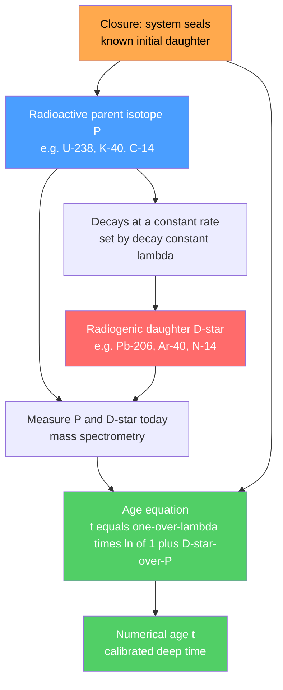

# ⏱️ Radiometric Dating

> [!abstract] TL;DR
> Radiometric dating is the physical clock that converted geology's *relative* ordering of events into **absolute numerical ages**. Radioactive **parent** isotopes decay to stable **daughter** isotopes at a rate fixed by the decay constant $\lambda$ — utterly independent of temperature, pressure, or chemistry. Measuring how much daughter has accumulated relative to surviving parent gives an age from $t=\tfrac{1}{\lambda}\ln\!\left(1+D^*/P\right)$. Different systems (U–Pb, K–Ar, Rb–Sr, $^{14}$C) span timescales from decades to the **4.54-billion-year** age of the Earth, and independent systems cross-check one another — the decisive evidence for **deep time**.

## Intuition — analogy FIRST

Imagine a giant hourglass, but a *magical* one where each grain of sand has a fixed probability per second of falling — you cannot speed it up by shaking it, heating it, or squeezing it. You did not watch it start, but you can still tell how long it has run: count the grains left on top (**parent**) and the grains piled below (**daughter**), and because the fall *rate* is a known constant, the ratio gives the elapsed time.

Every radioactive isotope is exactly such an hourglass built into the atomic nucleus. A uranium atom in a zircon crystal has no memory of the volcano that erupted it, the ocean that buried it, or the mountain that folded it — it ticks at the same rate everywhere. That indifference to environment is precisely why the clock is trustworthy across four billion years of geologic chaos.

---

## How It Works



The clock only reads true if three conditions hold: the **initial daughter** is known (or corrected for), the mineral has behaved as a **closed system** since closure, and the **half-life** is well matched to the age being measured.

---

## Key Concepts / Details

### Secondary Level

Radioactive decay follows an exponential law. If $N_0$ parent atoms are present at time zero, the number remaining after time $t$ is

$$N = N_0\,e^{-\lambda t}$$

The **half-life** is the time for half the parent to decay, related to the decay constant by

$$t_{1/2}=\frac{\ln 2}{\lambda}$$

After one half-life, $1/2$ of the parent remains; after two, $1/4$; after $n$, $(1/2)^n$. The atoms that vanished became daughter atoms, so daughter accumulates as parent disappears.

**Major geochronometers** (parent → stable daughter, half-life, typical use):

| System | Parent → Daughter | Half-life $t_{1/2}$ | Typical use |
|---|---|---|---|
| U–Pb | $^{238}$U → $^{206}$Pb | 4.47 Gyr | zircon; age of Earth; deep time |
| U–Pb | $^{235}$U → $^{207}$Pb | 704 Myr | zircon; concordia dating |
| K–Ar / $^{40}$Ar/$^{39}$Ar | $^{40}$K → $^{40}$Ar | 1.25 Gyr | volcanic ash, lavas |
| Rb–Sr | $^{87}$Rb → $^{87}$Sr | 48.8 Gyr | whole-rock isochrons |
| Sm–Nd | $^{147}$Sm → $^{143}$Nd | 106 Gyr | mafic rocks, meteorites |
| $^{14}$C (radiocarbon) | $^{14}$C → $^{14}$N | 5730 yr | organics younger than ~50 kyr |

Because $^{14}$C has such a short half-life, essentially none survives past ~10 half-lives (~50,000 yr) — so radiocarbon **cannot** date dinosaurs or rocks. Deep time requires the long-lived uranium and potassium clocks.

### Undergraduate Level

**The age equation.** Let $P$ be the surviving parent atoms measured today and $D^*$ the *radiogenic* daughter atoms produced by decay. Since every daughter came from a parent, $P_0 = P + D^*$. Substituting $N=N_0e^{-\lambda t}$ (with $N=P$, $N_0=P_0$):

$$P = (P+D^*)\,e^{-\lambda t}\quad\Longrightarrow\quad \boxed{\,t=\frac{1}{\lambda}\ln\!\left(1+\frac{D^*}{P}\right)}$$

Only the present-day **ratio** $D^*/P$ is needed — mass spectrometry measures isotope ratios far more precisely than absolute abundances.

**The initial-daughter problem.** Real minerals almost always incorporate *some* daughter isotope at formation ($D_0 \neq 0$). The total measured daughter is $D = D_0 + D^*$, and we cannot know $D_0$ directly. Two fixes:

- Choose a mineral that excludes the daughter — zircon accepts U but rejects Pb, so nearly all its Pb is radiogenic.
- Use the **isochron method** for cogenetic samples.

**Isochron method.** Normalise everything to a *non-radiogenic, stable* reference isotope of the daughter element (e.g. $^{86}$Sr for the Rb–Sr system). For a suite of samples that formed together (same age, same initial ratio) but with different parent/daughter chemistry:

$$\left(\frac{^{87}\text{Sr}}{^{86}\text{Sr}}\right)=\left(\frac{^{87}\text{Sr}}{^{86}\text{Sr}}\right)_0+\left(\frac{^{87}\text{Rb}}{^{86}\text{Sr}}\right)\left(e^{\lambda t}-1\right)$$

This is a straight line $y=b+mx$. A least-squares fit yields **both** unknowns at once: the **slope** gives the age via $t=\tfrac{1}{\lambda}\ln(1+m)$, and the **intercept** $b$ gives the initial ratio $(^{87}\text{Sr}/^{86}\text{Sr})_0$. The initial-daughter problem is solved algebraically — no assumption of $D_0=0$ required. Scatter off the line flags an open system.

### Graduate Level

**Closure temperature and thermochronology.** A mineral only "starts the clock" when it cools below the temperature at which the daughter stops diffusing out — the **closure temperature** $T_c$ (Dodson, 1973). Above $T_c$ the daughter escapes as fast as it forms; below it, it is trapped. Because different mineral–isotope pairs close at different temperatures, dating several systems in one rock reconstructs its **cooling history** (thermochronology).

| System / mineral | Approx. $T_c$ | Records |
|---|---|---|
| U–Pb zircon | > 900 °C | crystallisation |
| U–Pb titanite | ~ 600 °C | high-grade cooling |
| $^{40}$Ar/$^{39}$Ar hornblende | ~ 500 °C | mid-crustal cooling |
| $^{40}$Ar/$^{39}$Ar biotite | ~ 300 °C | exhumation |
| Apatite fission track | ~ 110 °C | shallow uplift |
| Apatite (U–Th)/He | ~ 70 °C | near-surface erosion |

**Concordia and discordia (U–Pb).** Uranium provides *two* independent clocks in the same crystal: $^{238}$U→$^{206}$Pb and $^{235}$U→$^{207}$Pb. Plotting $^{206}\text{Pb}^*/^{238}\text{U}$ against $^{207}\text{Pb}^*/^{235}\text{U}$ traces the **concordia** curve — the locus where both ages agree. A closed system plots *on* concordia. A system that lost lead (e.g. during metamorphism) falls along a chord, the **discordia** line: its **upper intercept** with concordia dates crystallisation, and its **lower intercept** dates the lead-loss event. This built-in cross-check makes zircon U–Pb the **gold standard** of deep-time geochronology.

**Pb–Pb geochron and the age of the solar system.** Because both uranium clocks share the same daughter element, one can combine them into a single Pb-isotope equation independent of the present U/Pb ratio. Clair Patterson (1956) measured Pb isotopes in iron and stone meteorites; they fell on a single **geochron** line whose slope gave $4.55$ Gyr — the age of the meteorites, the Earth, and by extension the whole solar system (refined today to $4.567$ Ga from CAIs). See [[Earth_Formation_and_Differentiation]].

The underlying nuclear physics — decay constants, decay modes, and nuclide stability — is developed in [[Radioactive_Decay]], [[Nuclear_Structure]], and [[Atomic_Structure_and_Subatomic_Particles]].

```python
import numpy as np
import matplotlib.pyplot as plt

# --- Part 1: universal decay curve (fraction of parent vs half-lives) ---
n_halflives  = np.linspace(0, 6, 300)
frac_parent  = 0.5 ** n_halflives          # N/N0 = (1/2)^(t/t_half)
frac_daught  = 1 - frac_parent

# --- Part 2: age from a measured radiogenic daughter/parent ratio ---
# U-238 -> Pb-206; assume all Pb-206 is radiogenic in a closed zircon.
t_half_U238 = 4.468e9                       # years
lam = np.log(2) / t_half_U238               # decay constant (1/yr)
D_over_P = 0.1710                           # measured Pb-206* / U-238 (atoms)
age = (1.0 / lam) * np.log(1.0 + D_over_P)
print(f"lambda(U-238) = {lam:.4e} /yr")
print(f"U-Pb age      = {age/1e9:.3f} Ga")  # ~1.02 Ga

# --- Part 3: least-squares Rb-Sr isochron on synthetic cogenetic samples ---
lam_Rb    = 1.42e-11                         # 87Rb decay constant, t_half ~ 48.8 Gyr
t_true    = 2.5e9                            # true age (2.5 Ga)
slope_true = np.exp(lam_Rb * t_true) - 1
init      = 0.7000                           # initial 87Sr/86Sr
rng = np.random.default_rng(0)
x = np.array([0.5, 1.2, 2.0, 3.1, 4.0, 5.2])            # 87Rb/86Sr
y = init + slope_true * x + rng.normal(0, 0.0015, x.size)  # 87Sr/86Sr + noise

m, b = np.polyfit(x, y, 1)                    # linear fit y = b + m*x
age_iso = (1.0 / lam_Rb) * np.log(1.0 + m)
print(f"isochron slope = {m:.5f}  -> age = {age_iso/1e9:.3f} Ga")
print(f"initial 87Sr/86Sr = {b:.4f}")

# --- plots ---
fig, ax = plt.subplots(1, 2, figsize=(11, 4.5))
ax[0].plot(n_halflives, frac_parent, lw=2, label='parent  N/N0')
ax[0].plot(n_halflives, frac_daught, '--', lw=2, label='daughter  D/N0')
ax[0].set(xlabel='number of half-lives', ylabel='fraction',
          title='Radioactive decay')
ax[0].legend(); ax[0].grid(alpha=0.3)

ax[1].scatter(x, y, zorder=5, label='cogenetic samples')
xf = np.linspace(0, x.max(), 50)
ax[1].plot(xf, b + m * xf, 'r-', label=f'isochron: {age_iso/1e9:.2f} Ga')
ax[1].set(xlabel='87Rb / 86Sr', ylabel='87Sr / 86Sr', title='Rb-Sr isochron')
ax[1].legend(); ax[1].grid(alpha=0.3)
plt.tight_layout()
```

---

## Real-World Notes

- **The age of the Earth (4.54 Ga).** Clair Patterson (1956) dated the Canyon Diablo iron meteorite by the Pb–Pb geochron method, pinning Earth's age at $4.55\pm0.07$ Gyr — the first reliable measurement, still valid today.
- **Oldest known Earth material.** Detrital zircon grains from the Jack Hills, Western Australia, yield U–Pb ages up to **4.4 Ga**, showing that continental crust and liquid water existed within ~150 Myr of Earth's formation — deep into the Hadean.
- **Dating human origins.** $^{40}$Ar/$^{39}$Ar dating of volcanic ash layers brackets hominin fossils and footprints (e.g. the KBS Tuff at Koobi Fora, the Laetoli footprints) — because the fossils themselves cannot be dated, the datable volcanics *above and below* them are.
- **Radiocarbon and archaeology.** $^{14}$C dated Ötzi the Iceman (~5,300 yr) and the Shroud of Turin (medieval). Radiocarbon *years* differ from *calendar* years because atmospheric $^{14}$C has varied; the **IntCal** curves calibrate them using tree rings, corals, and speleothems.
- **Timing mass extinctions.** High-precision U–Pb zircon ages tie the end-Permian extinction to Siberian Traps volcanism at ~252 Ma and the end-Cretaceous extinction to the Chicxulub impact at 66 Ma — see [[Mass_Extinctions_and_Paleoclimate]].
- **Refuting a young Earth.** Dozens of independent isotopic systems, with wildly different chemistries and half-lives, converge on the same billions-of-years ages. No single "assumption" could bias them all identically — the agreement is the point.

---

## Common Pitfalls

1. **Assuming zero initial daughter.** Treating all measured daughter as radiogenic on a mineral that *did* inherit some yields an age that is too old. The isochron method exists precisely to correct for $D_0$.
2. **Open-system resetting.** Metamorphic heating can drive daughter (especially Ar) out of a mineral. The clock then dates the **last thermal event**, not the rock's formation — a feature for thermochronology, a trap for the unwary.
3. **Wrong clock for the timescale.** $^{14}$C is useless beyond ~50 kyr (too little parent left); U–Pb is useless on a fresh lava (too little daughter accumulated). Match the half-life to the expected age.
4. **Radiocarbon years are not calendar years.** The Libby half-life (5,568 yr) and atmospheric $^{14}$C variations mean raw $^{14}$C ages must be **calibrated** to true calendar ages.
5. **Inherited or detrital cores.** A zircon can have an old core overgrown by a young rim; bulk analysis mixes ages. Modern spot analysis (SIMS, LA-ICP-MS) targets individual growth zones to avoid this.
6. **Confusing precision with accuracy.** A tight analytical error bar means nothing if the closure or closed-system assumptions are violated. Discordance in U–Pb is the built-in warning that something leaked.

---

## Related Concepts

- [[_MOC_Historical_Geology|↑ Section MOC]]
- [[Geologic_Time_Scale]] — the numerical timescale that radiometric ages calibrate and subdivide
- [[Relative_Dating_and_Stratigraphy]] — superposition and cross-cutting give *order*; radiometric dating adds absolute *numbers*
- [[Fossils_and_the_Fossil_Record]] — datable volcanic layers anchor the biostratigraphic record in years
- [[Earths_History_Hadean_to_Phanerozoic]] — the deep-time narrative made possible by absolute dating
- [[Mass_Extinctions_and_Paleoclimate]] — U–Pb ages resolve extinction timing to sub-million-year precision
- [[Earth_Formation_and_Differentiation]] — Pb–Pb geochron dates the Earth and solar system to 4.54–4.567 Ga
- [[Radioactive_Decay]] — the nuclear physics of the decay law and decay constant (Physics vault)
- [[Nuclear_Structure]] — why some nuclides are unstable and how they decay (Physics vault)
- [[Atomic_Structure_and_Subatomic_Particles]] — isotopes, protons, and neutrons underpinning parent/daughter identity (Chemistry vault)
- [[_MOC_Mathematics_Master]] — exponential decay, logarithms, and least-squares regression (Mathematics vault)

---

## Review Questions

1. **Secondary:** A mineral contains $1/8$ of its original parent isotope. (a) How many half-lives have elapsed? (b) If the half-life is 1.25 Gyr, what is the age? (c) What fraction of the sample is now daughter?
2. **Undergraduate:** Starting from $N=N_0e^{-\lambda t}$ and $P_0=P+D^*$, derive the age equation $t=\tfrac{1}{\lambda}\ln(1+D^*/P)$. Then explain how the isochron method extracts *both* the age and the initial daughter ratio, and why scatter about the isochron indicates an open system.
3. **Graduate:** On a concordia diagram, a suite of zircons plots along a discordia chord. Interpret the geological meaning of the upper and lower intercepts. Why does having two uranium decay systems in one crystal make U–Pb uniquely self-checking compared with K–Ar?

---

## Sources

- Dickin, A. P. — *Radiogenic Isotope Geology*, 2nd ed., Cambridge University Press
- Faure, G. & Mensing, T. M. — *Isotopes: Principles and Applications*, 3rd ed., Wiley
- Dalrymple, G. B. — *The Age of the Earth* (1991), Stanford University Press
- Patterson, C. (1956) — "Age of meteorites and the Earth," *Geochimica et Cosmochimica Acta* 10, 230
- Steiger, R. H. & Jäger, E. (1977) — "Subcommission on geochronology: convention on the use of decay constants," *Earth Planet. Sci. Lett.* 36, 359

#earth-science #historical-geology #geochronology #radiometric-dating #isochron #deep-time #secondary #undergraduate #graduate
