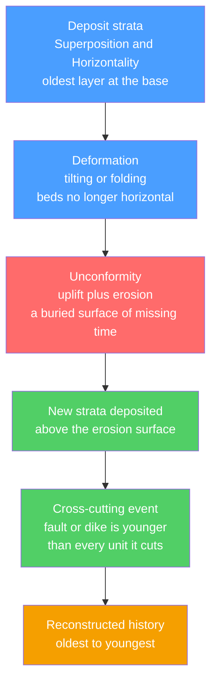

# 📚 Relative Dating and Stratigraphy

> [!abstract] TL;DR
> Relative dating reads the *order* of geologic events straight from rock — no clocks required. A handful of common-sense principles laid down by Steno, Hutton, and Smith (superposition, original horizontality, lateral continuity, cross-cutting, inclusions, and faunal succession) let geologists say which layer, fault, or intrusion came first. Stratigraphy then stacks and correlates those layers into a global column, using unconformities to mark missing time and fossils to tie distant sections together. This framework built the entire geologic time scale *before* a single absolute age was known; radiometric dating later hung numbers on it.

## Intuition — analogy FIRST

Think of a laundry hamper. Clothes you tossed in this morning sit on top; last week's are at the bottom. You never watched them fall, yet you can confidently reconstruct the order you wore them: **the deeper it is, the older it is.** If a cat later claws a rip straight through the pile, the rip must be *younger* than everything it tears through — and if you find a sock from a different pile balled up inside a shirt, that sock existed *before* the shirt swallowed it.

That is the whole of relative dating. Rock layers are the laundry, faults and lava dikes are the cat's claw, and stray pebbles frozen inside a sandstone are the misplaced sock. Stratigraphy is the discipline of doing this carefully, everywhere on Earth, and matching one hamper to another.

---

## How It Works



---

## Key Concepts / Details

### Secondary Level

**The classic principles.** Each is a rule for extracting *before / after* from geometry alone.

| Principle | Author | Statement |
|-----------|--------|-----------|
| Superposition | Steno, 1669 | In undisturbed strata, each layer is younger than the one below and older than the one above |
| Original horizontality | Steno, 1669 | Sediments settle in near-horizontal sheets, so tilted beds were tilted *after* deposition |
| Lateral continuity | Steno, 1669 | Layers extend outward until they thin to zero or hit a barrier, so beds split by a canyon once joined |
| Cross-cutting relationships | Hutton, 1788 | A fault, dike, or intrusion is younger than any rock it cuts |
| Inclusions | Hutton / Lyell | Fragments (clasts, xenoliths) are older than the rock enclosing them |
| Faunal succession | Smith, 1796 | Fossil assemblages appear in a fixed, worldwide order, so like fossils mean like ages |

Put together, these turn a roadcut into a timeline. A tilted sandstone cut by a granite dike, for example, must have been (1) deposited, (2) tilted, then (3) intruded — in that order, guaranteed.

### Undergraduate Level

**Unconformities: reading the gaps.** An unconformity is a buried surface where deposition stopped or erosion removed rock. The rock record is *incomplete*, and the missing interval is called a **hiatus**. Three geometries:

| Type | Rock below the surface | Meaning |
|------|------------------------|---------|
| **Angular unconformity** | Tilted or folded strata | Deposition → deformation → erosion → renewed deposition (e.g. Hutton's Siccar Point) |
| **Disconformity** | Parallel strata, same orientation | An erosion surface between horizontal beds; easy to miss |
| **Nonconformity** | Igneous or metamorphic basement | Sedimentary cover resting on eroded crystalline rock |

Missing time is estimated by bracketing the surface with dated beds. If the youngest bed below is $t_{below}$ and the oldest bed above is $t_{above}$:

$$\Delta t_{hiatus} = t_{below} - t_{above}$$

A disconformity capped by 300 Ma strata over 320 Ma strata hides a $\Delta t_{hiatus}\approx 20$ Myr gap — "no rock" is emphatically not "no time."

**Correlation and the three stratigraphies.** To build one column from many outcrops, geologists match beds across gaps using distinct frameworks:

| Framework | Unit of division | Correlated by |
|-----------|------------------|---------------|
| **Lithostratigraphy** | Formation, Member, Group | Rock type, texture, mappable character |
| **Biostratigraphy** | Biozone | Fossil ranges via faunal succession — see [[Fossils_and_the_Fossil_Record]] |
| **Chronostratigraphy** | System, Series, Stage | Actual time, anchored to global boundaries |

The **formation** is the basic mappable lithostratigraphic unit. Correlation power comes from **key beds** — thin, widespread, near-instantaneous layers such as volcanic ash (bentonite) — which are effectively isochronous marker horizons. Faunal succession is what let William Smith predict rock order across all of England, and it remains the backbone of long-distance correlation. Depositional context for these layers is developed in [[Sedimentary_Rocks_and_Environments]] and [[The_Rock_Cycle]].

**Relative before absolute.** The entire [[Geologic_Time_Scale]] — Cambrian through Quaternary — was assembled by superposition and fossils in the 1800s, long before radioactivity existed. Twentieth-century [[Radiometric_Dating]] did not replace this scaffold; it *calibrated* it, pinning numeric ages to boundaries that fossils had already ordered.

### Graduate Level

**Walther's Law.** In a conformable succession without breaks, the vertical sequence of facies mirrors the lateral sequence of the environments that were once adjacent. Formally, facies that succeed one another vertically were deposited in laterally neighbouring environments. This is the engine that converts a 1-D core into a 2-D paleogeographic reconstruction — and its critical caveat is that it holds *only* across conformable contacts, never across an unconformity.

**Sequence stratigraphy.** Rather than lithology, sequences track relative sea level (base level). Cycles of accommodation creation and destruction produce stacked **systems tracts** (lowstand, transgressive, highstand) bounded by sequence boundaries (subaerial unconformities) and flooding surfaces. Accommodation change is:

$$\Delta A = \Delta E + \Delta T - S$$

where $\Delta E$ is eustatic sea-level change, $\Delta T$ is tectonic subsidence, and $S$ is sediment supply. This predictive framework is the standard toolkit of petroleum stratigraphy.

**High-resolution correlation tools.** Beyond bio- and lithostratigraphy:

- **Event stratigraphy** — a globally synchronous instant (an impact ejecta layer, a tephra, a turbidite) provides a razor-sharp time line.
- **Chemostratigraphy** — correlation by isotope excursions, e.g. $\delta^{13}\mathrm{C}$ and $^{87}\mathrm{Sr}/^{86}\mathrm{Sr}$ curves shared across basins.
- **Magnetostratigraphy** — the polarity reversal pattern of the strata is matched to the global polarity time scale, giving age control independent of fossils; see [[Geomagnetism_and_Paleomagnetism]].
- **Cyclostratigraphy** — Milankovitch orbital cycles imprint rhythmic beds whose counted periods act as a precise "astronomical clock."

---

## Python Demo — reconstructing event order from a cross-section

```python
"""
Relative-dating engine.
Given a labeled cross-section, each stratigraphic principle becomes an
ordering constraint (older_event -> younger_event). A topological sort
then returns the full history from oldest to youngest.
"""
from collections import defaultdict, deque

constraints = []  # list of (older, younger) pairs

def older_than(a, b):
    """Record that event a is older than event b."""
    constraints.append((a, b))

# --- Superposition: beds listed bottom (oldest) to top (youngest) ---
lower_package = ["Shale_A", "Limestone_B", "Sandstone_C"]
for below, above in zip(lower_package, lower_package[1:]):
    older_than(below, above)

# --- Cross-cutting: a fault is younger than every unit it displaces ---
for cut in lower_package:
    older_than(cut, "Fault_F")

# --- The fault is truncated by the erosion surface, so it predates it ---
older_than("Fault_F", "Unconformity")

# --- Unconformity: younger than beds below, older than beds above ---
older_than("Sandstone_C", "Unconformity")
older_than("Unconformity", "Conglomerate_D")
older_than("Conglomerate_D", "Siltstone_E")   # superposition, upper package

# --- Cross-cutting + inclusions: a dike cuts D and E and contains ---
# --- baked clasts (xenoliths) of E, so the dike is the youngest event ---
for cut in ["Conglomerate_D", "Siltstone_E"]:
    older_than(cut, "Dike_G")

def relative_order(pairs):
    """Kahn's algorithm: oldest-first topological sort of the constraints."""
    succ, indeg, nodes = defaultdict(list), defaultdict(int), set()
    for a, b in pairs:
        succ[a].append(b)
        indeg[b] += 1
        nodes.update((a, b))
    for n in nodes:
        indeg.setdefault(n, 0)
    ready = deque(sorted(n for n in nodes if indeg[n] == 0))
    order = []
    while ready:
        n = ready.popleft()
        order.append(n)
        for m in sorted(succ[n]):
            indeg[m] -= 1
            if indeg[m] == 0:
                ready.append(m)
    if len(order) != len(nodes):
        raise ValueError("Cycle detected: contradictory contact relationships")
    return order

for i, event in enumerate(relative_order(constraints), 1):
    print(f"{i:>2}. {event}")

# Output (oldest -> youngest):
#  1. Shale_A          2. Limestone_B     3. Sandstone_C
#  4. Fault_F          5. Unconformity    6. Conglomerate_D
#  7. Siltstone_E      8. Dike_G
```

---

## Real-World Notes

- **Grand Canyon, Arizona.** A near-textbook column: flat-lying Paleozoic strata obey superposition above the "Great Unconformity," a nonconformity where ~1 billion years of record is missing over tilted and metamorphosed basement.
- **Siccar Point, Scotland.** James Hutton's 1788 angular unconformity — vertical Silurian greywacke truncated beneath gently dipping Devonian sandstone — was the outcrop that revealed "deep time" and no vestige of a beginning.
- **William Smith's 1815 map.** The first geological map of a whole country, built purely on faunal succession and lithostratigraphy, proved strata could be predicted and correlated across regions.
- **Ordovician K-bentonites.** Ash beds from cataclysmic eruptions (e.g. the Millbrig and Deicke bentonites) blanket eastern North America and Scandinavia as isochronous key beds, tying [[Radiometric_Dating]] ages directly into the biostratigraphy.
- **The K–Pg boundary.** A worldwide iridium-rich clay layer from the Chicxulub impact is the classic event/chemostratigraphic marker, defining the Cretaceous–Paleogene boundary and dating a mass extinction to a single horizon — see [[Mass_Extinctions_and_Paleoclimate]].
- **Petroleum exploration.** Sequence stratigraphy correlates reservoir sands and seals between wells kilometres apart by tracing systems tracts and flooding surfaces rather than raw lithology.

---

## Common Pitfalls

1. **Assuming order equals age.** Superposition holds only for *undisturbed* strata. Overturned folds and thrust sheets can invert the pile — always check way-up indicators (graded bedding, cross-beds, sole marks, geopetal fills) before trusting "lower = older."
2. **Treating the record as complete.** An unconformity can look like an ordinary bedding plane while hiding tens of millions of years. A conformable-looking column may be mostly *gap*; missing rock is not missing time.
3. **Correlating by lithology alone.** The same rock type recurs across many ages and places. Because facies migrate (Walther's Law), a single sandstone body is **diachronous** — its base is a different age from its top, so lithostratigraphic boundaries cross time lines.
4. **Confusing a sill with a lava flow.** A buried lava flow is younger than beds below but *older* than beds above (it is a surface layer); a sill is younger than beds on *both* sides. Distinguish them by baked/chilled margins and inclusions before applying cross-cutting.
5. **Trusting reworked fossils.** Faunal succession assumes assemblages are in place. Derived (reworked) fossils and bioturbation can mix ages, making a bed look older than it is.
6. **Expecting numbers.** Relative dating yields *sequence and correlation only*. Absolute durations require radiometric or other numeric methods — see [[Radiometric_Dating]].

---

## Related Concepts

- [[_MOC_Historical_Geology|↑ Section MOC]]
- [[Geologic_Time_Scale]] — the ordered column that relative dating built and radiometric dating later calibrated
- [[Radiometric_Dating]] — supplies the absolute ages that hang numbers on the relative framework
- [[Fossils_and_the_Fossil_Record]] — faunal succession is the basis of biostratigraphic correlation
- [[Earths_History_Hadean_to_Phanerozoic]] — the narrative reconstructed by applying these principles at global scale
- [[Mass_Extinctions_and_Paleoclimate]] — extinction horizons are correlated using event and chemostratigraphy
- [[Sedimentary_Rocks_and_Environments]] — the depositional settings that Walther's Law reads from vertical facies
- [[The_Rock_Cycle]] — supplies the sediments, intrusions, and unconformable contacts being ordered
- [[Geomagnetism_and_Paleomagnetism]] — polarity reversals give magnetostratigraphic time control
- [[_MOC_Mathematics_Master]] — the topological ordering of events is a directed-graph (DAG) problem

---

## Review Questions

1. **Secondary**: A horizontal sandstone bed is cut by a vertical basalt dike, and both are overlain by a flat-lying shale that the dike does *not* penetrate. List the three events from oldest to youngest and name the principle used for each step.
2. **Undergraduate**: A disconformity separates a bed radiometrically dated at 250 Ma from an overlying bed dated at 200 Ma. (a) What is the minimum duration of the hiatus? (b) Why can lithostratigraphic correlation alone fail to reveal this gap, and what single line of evidence would expose it most cleanly?
3. **Graduate**: Explain how Walther's Law both enables paleoenvironmental reconstruction from a single core and breaks down at a sequence boundary. How do sequence stratigraphy and event stratigraphy provide complementary correlation where lithostratigraphy cannot?

---

## Sources

- Steno, N. (1669) — *De solido intra solidum naturaliter contento dissertationis prodromus*
- Prothero & Dott — *Evolution of the Earth*, 8th ed., Ch. 4–6
- Boggs — *Principles of Sedimentology and Stratigraphy*, 5th ed.
- Catuneanu — *Principles of Sequence Stratigraphy* (2006)
- International Commission on Stratigraphy — *International Stratigraphic Guide* (Salvador, ed.)

#earth-science #historical-geology #stratigraphy #superposition #unconformity #biostratigraphy #correlation #secondary #undergraduate #graduate
